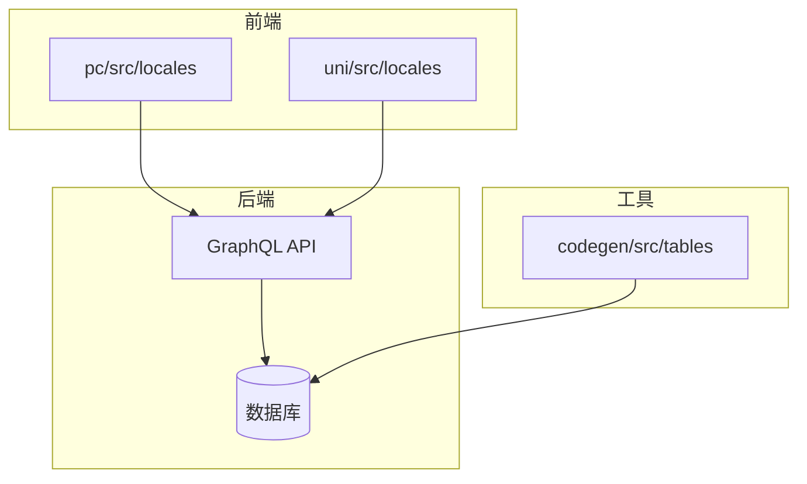
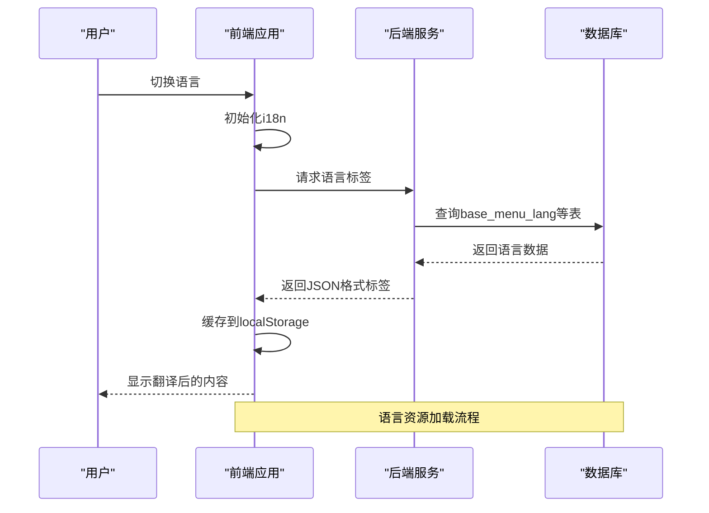
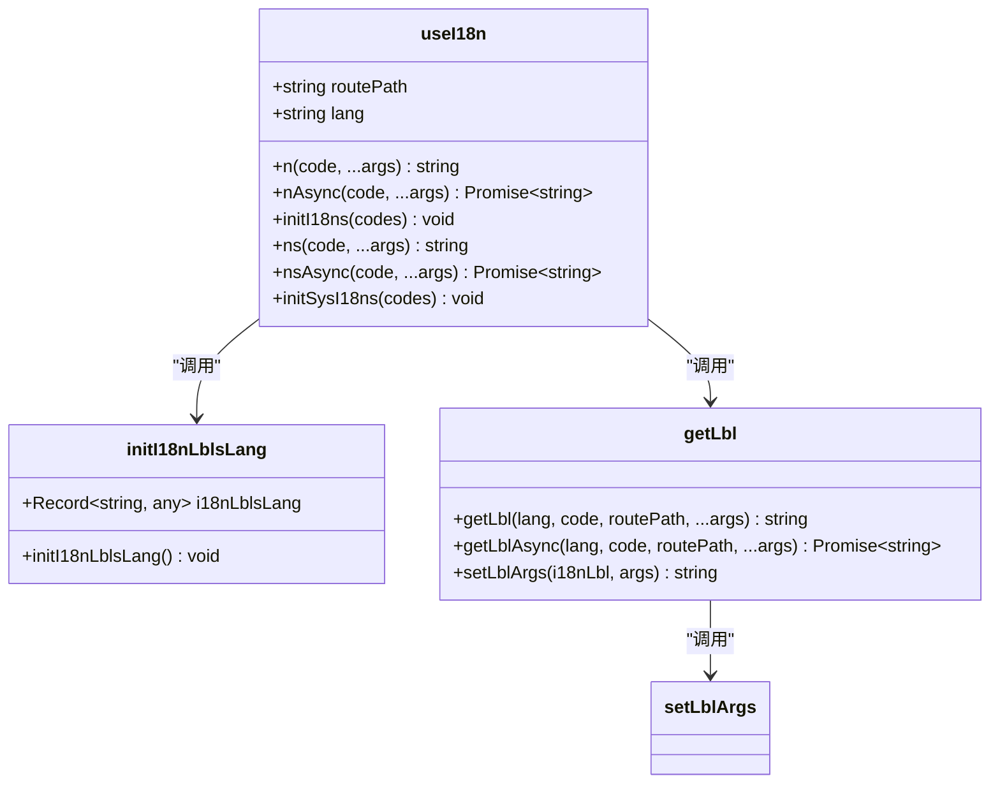
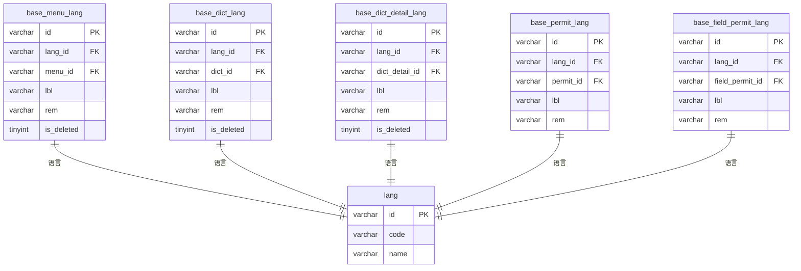
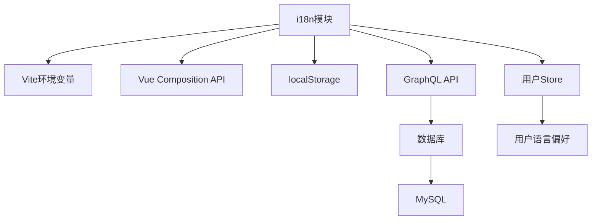

# 语言资源管理

**本文档引用的文件**   
- [base.i18n.sql](https://github.com/sail-sail/nest/blob/main/codegen/src/tables/base/base.i18n.sql)
- [zh-cn.ts](https://github.com/sail-sail/nest/blob/main/pc/src/locales/zh-cn.ts)
- [en.ts](https://github.com/sail-sail/nest/blob/main/pc/src/locales/en.ts)
- [i18n.ts](https://github.com/sail-sail/nest/blob/main/pc/src/locales/i18n.ts)
- [i18n.ts](https://github.com/sail-sail/nest/blob/main/deno/src/base/i18n/i18n.ts)

## 目录
1. [简介](#简介)
2. [项目结构](#项目结构)
3. [核心组件](#核心组件)
4. [架构概述](#架构概述)
5. [详细组件分析](#详细组件分析)
6. [依赖分析](#依赖分析)
7. [性能考虑](#性能考虑)
8. [故障排除指南](#故障排除指南)
9. [结论](#结论)

## 简介
本文档详细阐述了系统中语言资源的管理机制，涵盖前端Vue组件中的多语言文本组织方式、后端数据库的i18n表结构设计、语言资源的加载策略以及添加新语言包的完整流程。文档还提供了版本控制、冲突解决和性能优化的最佳实践，旨在为开发者提供全面的语言资源管理指导。

## 项目结构
项目采用分层架构，前端位于`pc`和`uni`目录，后端服务位于`deno`目录，代码生成工具位于`codegen`目录。语言资源分布在前端的`locales`目录和后端的数据库表中，通过GraphQL接口进行数据交互。

**图示来源**
- [base.i18n.sql](https://github.com/sail-sail/nest/blob/main/codegen/src/tables/base/base.i18n.sql)
- [i18n.ts](https://github.com/sail-sail/nest/blob/main/pc/src/locales/i18n.ts)

**本节来源**
- [base.i18n.sql](https://github.com/sail-sail/nest/blob/main/codegen/src/tables/base/base.i18n.sql)
- [i18n.ts](https://github.com/sail-sail/nest/blob/main/pc/src/locales/i18n.ts)

## 核心组件
系统的核心语言资源管理组件包括前端的i18n模块和后端的i18n数据库表。前端通过`useI18n`函数提供语言标签的获取接口，后端通过一系列`_lang`表存储多语言数据。

**本节来源**
- [i18n.ts](https://github.com/sail-sail/nest/blob/main/pc/src/locales/i18n.ts)
- [base.i18n.sql](https://github.com/sail-sail/nest/blob/main/codegen/src/tables/base/base.i18n.sql)

## 架构概述
系统采用前后端分离的国际化架构。前端负责语言资源的请求和缓存，后端负责语言数据的存储和查询。当用户切换语言时，前端会根据当前路由和语言代码向后端请求相应的语言标签。

**图示来源**
- [i18n.ts](https://github.com/sail-sail/nest/blob/main/pc/src/locales/i18n.ts)
- [base.i18n.sql](https://github.com/sail-sail/nest/blob/main/codegen/src/tables/base/base.i18n.sql)

## 详细组件分析

### 前端i18n模块分析
前端i18n模块实现了语言标签的动态加载和缓存机制。模块通过`useI18n`函数提供统一的接口，支持同步和异步获取语言标签。

#### 类图

**图示来源**
- [i18n.ts](https://github.com/sail-sail/nest/blob/main/pc/src/locales/i18n.ts#L20-L217)

**本节来源**
- [i18n.ts](https://github.com/sail-sail/nest/blob/main/pc/src/locales/i18n.ts#L0-L217)

### 后端i18n表结构分析
后端通过一系列专门的数据库表来存储多语言数据，每个业务表都有对应的语言表，通过`lang_id`和业务ID进行关联。

#### 数据模型图

**图示来源**
- [base.i18n.sql](https://github.com/sail-sail/nest/blob/main/codegen/src/tables/base/base.i18n.sql#L0-L63)

**本节来源**
- [base.i18n.sql](https://github.com/sail-sail/nest/blob/main/codegen/src/tables/base/base.i18n.sql#L0-L63)

## 依赖分析
语言资源管理系统依赖于多个组件的协同工作。前端依赖Vue的响应式系统和localStorage进行数据缓存，后端依赖数据库存储和GraphQL查询能力。

**图示来源**
- [i18n.ts](https://github.com/sail-sail/nest/blob/main/pc/src/locales/i18n.ts)
- [base.i18n.sql](https://github.com/sail-sail/nest/blob/main/codegen/src/tables/base/base.i18n.sql)

**本节来源**
- [i18n.ts](https://github.com/sail-sail/nest/blob/main/pc/src/locales/i18n.ts)
- [base.i18n.sql](https://github.com/sail-sail/nest/blob/main/codegen/src/tables/base/base.i18n.sql)

## 性能考虑
系统通过多种机制优化语言资源的性能表现。前端采用localStorage缓存已获取的语言标签，避免重复请求。后端通过索引优化查询性能，特别是在`lang_id`、业务ID和`is_deleted`字段上建立复合索引。

## 故障排除指南
当遇到语言资源加载问题时，可按照以下步骤进行排查：
1. 检查`VITE_SERVER_I18N_ENABLE`环境变量是否正确设置
2. 验证localStorage中的`i18nLblsLang`数据是否完整
3. 检查GraphQL接口`n0`是否能正常返回数据
4. 确认数据库中对应的语言表是否存在且数据完整

**本节来源**
- [i18n.ts](https://github.com/sail-sail/nest/blob/main/pc/src/locales/i18n.ts#L10-L50)

## 结论
本系统通过前后端协同的架构实现了灵活高效的多语言支持。前端的按需加载和缓存机制保证了用户体验，后端的规范化表结构确保了数据的一致性和可维护性。建议在添加新语言时，遵循标准化的流程，确保前后端配置的同步更新。