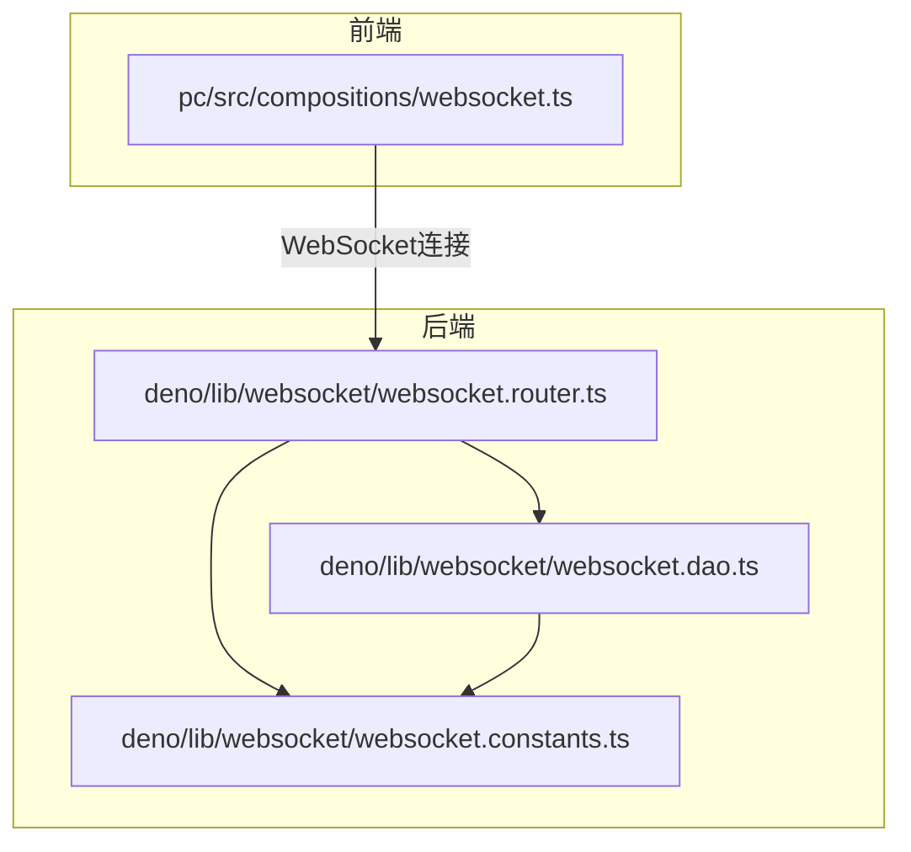
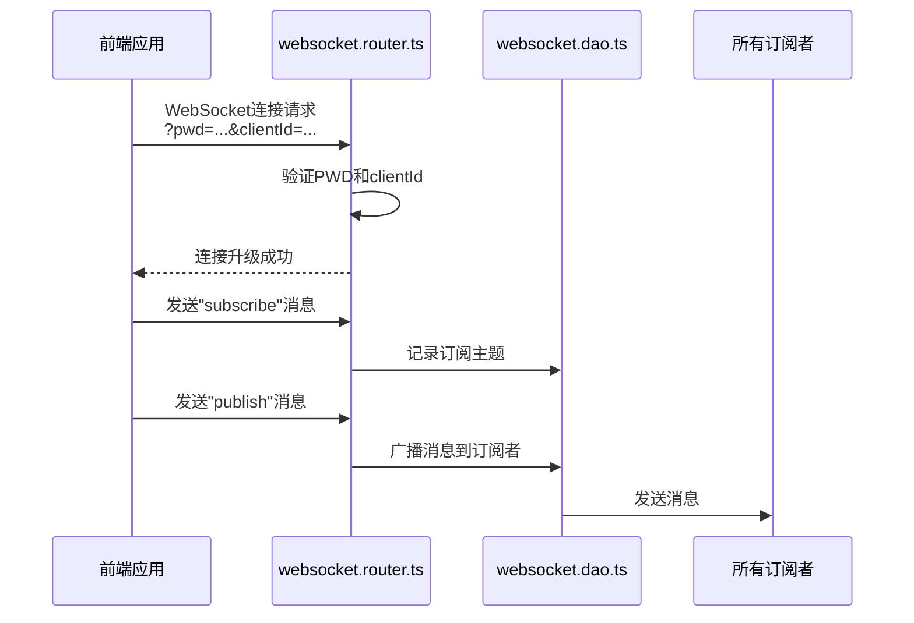
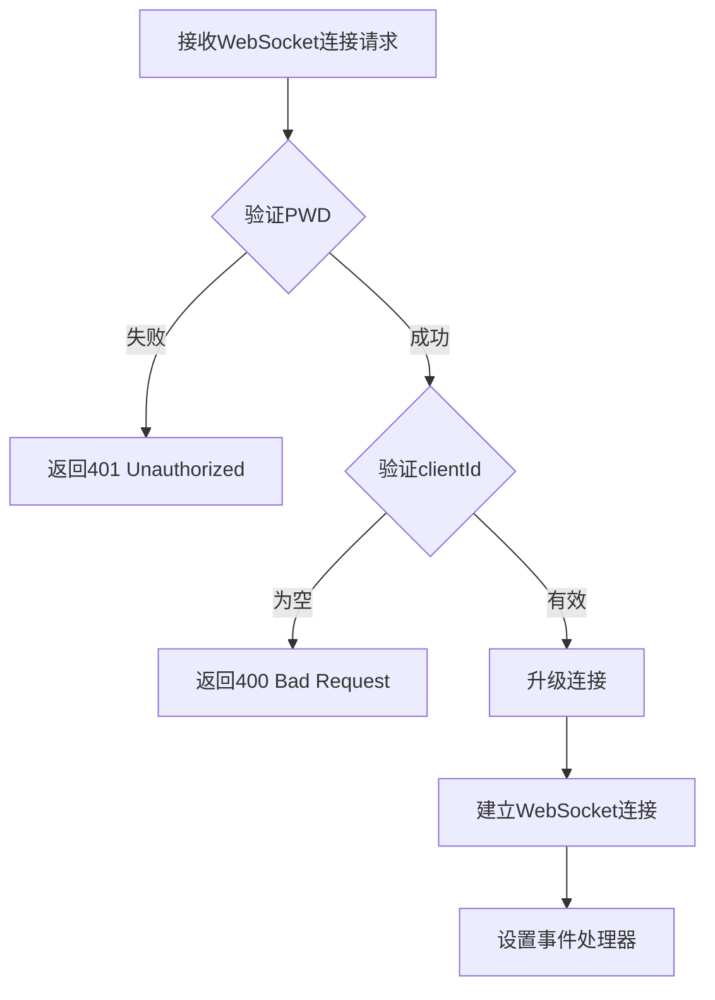
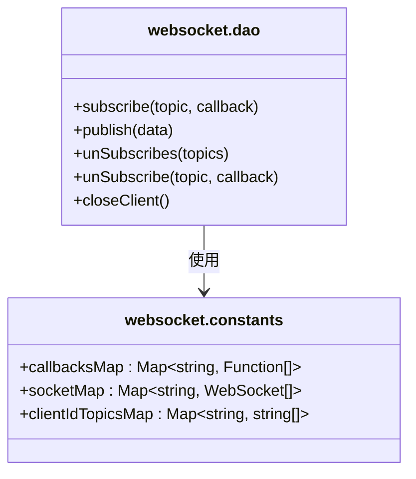
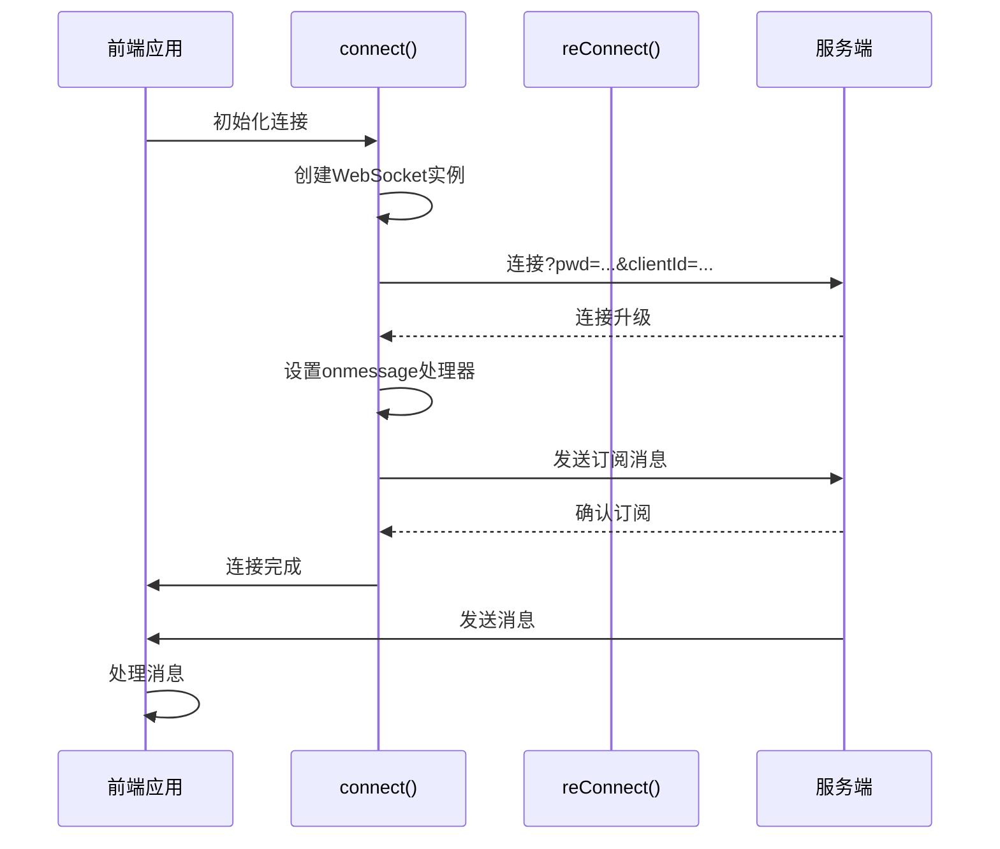
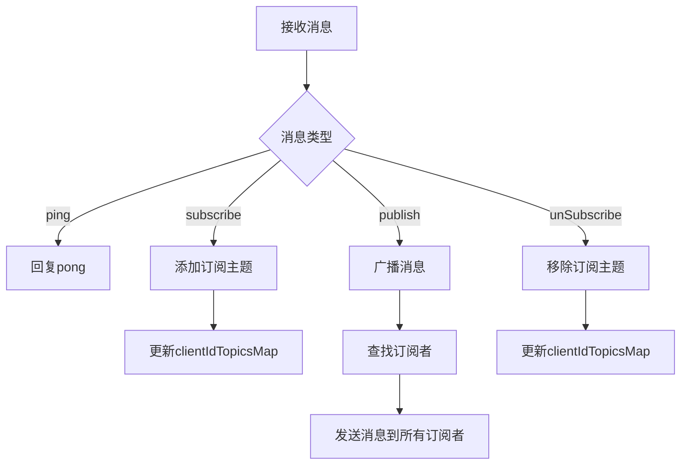
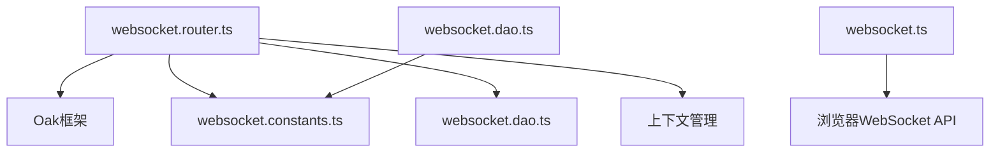

# WebSocket认证机制


**本文档引用文件**  
- [websocket.router.ts](https://github.com/sail-sail/nest/blob/main/deno\lib\websocket\websocket.router.ts)
- [websocket.dao.ts](https://github.com/sail-sail/nest/blob/main/deno\lib\websocket\websocket.dao.ts)
- [websocket.constants.ts](https://github.com/sail-sail/nest/blob/main/deno\lib\websocket\websocket.constants.ts)
- [websocket.ts](https://github.com/sail-sail/nest/blob/main/pc\src\compositions\websocket.ts)


## 目录
1. [引言](#引言)
2. [项目结构](#项目结构)
3. [核心组件](#核心组件)
4. [架构概览](#架构概览)
5. [详细组件分析](#详细组件分析)
6. [依赖分析](#依赖分析)
7. [性能考量](#性能考量)
8. [故障排除指南](#故障排除指南)
9. [结论](#结论)

## 引言
本文档深入解析WebSocket连接的认证机制，涵盖服务端如何验证连接请求、前端如何传递认证信息、连接状态的管理以及安全机制的实现。通过分析`websocket.router.ts`、`websocket.dao.ts`和前端`websocket.ts`文件，全面揭示系统中WebSocket认证的实现细节。

## 项目结构
WebSocket认证功能主要分布在后端`deno/lib/websocket/`目录和前端`pc/src/compositions/`目录中。后端负责处理连接升级、认证验证和消息路由，前端负责建立连接、发送认证信息和处理消息。



**图示来源**
- [websocket.router.ts](https://github.com/sail-sail/nest/blob/main/deno\lib\websocket\websocket.router.ts)
- [websocket.dao.ts](https://github.com/sail-sail/nest/blob/main/deno\lib\websocket\websocket.dao.ts)
- [websocket.constants.ts](https://github.com/sail-sail/nest/blob/main/deno\lib\websocket\websocket.constants.ts)
- [websocket.ts](https://github.com/sail-sail/nest/blob/main/pc\src\compositions\websocket.ts)

## 核心组件
WebSocket认证机制的核心组件包括：
- **websocket.router.ts**：处理WebSocket连接升级和消息路由
- **websocket.dao.ts**：管理订阅、发布和连接状态
- **websocket.constants.ts**：定义全局状态存储
- **websocket.ts**（前端）：管理前端WebSocket连接和消息处理

**组件来源**
- [websocket.router.ts](https://github.com/sail-sail/nest/blob/main/deno\lib\websocket\websocket.router.ts)
- [websocket.dao.ts](https://github.com/sail-sail/nest/blob/main/deno\lib\websocket\websocket.dao.ts)
- [websocket.constants.ts](https://github.com/sail-sail/nest/blob/main/deno\lib\websocket\websocket.constants.ts)
- [websocket.ts](https://github.com/sail-sail/nest/blob/main/pc\src\compositions\websocket.ts)

## 架构概览
系统采用客户端-服务器架构，通过WebSocket协议实现双向通信。认证机制基于预共享密码（PWD）和客户端ID（clientId）实现。



**图示来源**
- [websocket.router.ts](https://github.com/sail-sail/nest/blob/main/deno\lib\websocket\websocket.router.ts)
- [websocket.dao.ts](https://github.com/sail-sail/nest/blob/main/deno\lib\websocket\websocket.dao.ts)

## 详细组件分析

### 服务端认证流程分析
服务端在`websocket.router.ts`中实现认证机制，通过查询参数验证连接请求。



**图示来源**
- [websocket.router.ts](https://github.com/sail-sail/nest/blob/main/deno\lib\websocket\websocket.router.ts)

#### 认证实现细节
服务端认证通过以下步骤实现：

1. **密码验证**：检查查询参数中的`pwd`是否匹配预定义的`PWD`
2. **客户端ID验证**：确保`clientId`参数存在且不为空
3. **连接升级**：通过`ctx.upgrade()`建立WebSocket连接

```typescript
const PWD = "0YSCBr1QQSOpOfi6GgH34A";

router.get("upgrade", function(ctx) {
  const request = ctx.request;
  const response = ctx.response;
  const pwd = request.url.searchParams.get("pwd");
  if (pwd !== PWD) {
    response.status = 401;
    response.body = {
      code: 401,
      data: "Unauthorized",
    };
    return;
  }
  const clientId = request.url.searchParams.get("clientId");
  if (!clientId) {
    const errMsg = "clientId is required!";
    error(errMsg);
    response.status = 400;
    response.body = {
      code: 400,
      data: errMsg,
    };
    return;
  }
  const socket = ctx.upgrade();
  // ... 设置事件处理器
});
```

**代码来源**
- [websocket.router.ts](https://github.com/sail-sail/nest/blob/main/deno\lib\websocket\websocket.router.ts#L38-L89)

### 连接状态管理分析
`websocket.dao.ts`文件负责管理WebSocket连接状态和消息路由。



**图示来源**
- [websocket.dao.ts](https://github.com/sail-sail/nest/blob/main/deno\lib\websocket\websocket.dao.ts)
- [websocket.constants.ts](https://github.com/sail-sail/nest/blob/main/deno\lib\websocket\websocket.constants.ts)

#### 状态存储机制
系统使用三个全局Map对象存储连接状态：

- **callbacksMap**：存储主题到回调函数的映射
- **socketMap**：存储客户端ID到WebSocket连接的映射
- **clientIdTopicsMap**：存储客户端ID到订阅主题列表的映射

```typescript
// deno-lint-ignore no-explicit-any
export const callbacksMap = new Map<string, ((data: any) => Promise<void> | void)[]>();

export const socketMap = new Map<string, WebSocket[]>();

export const clientIdTopicsMap = new Map<string, string[]>();
```

**代码来源**
- [websocket.constants.ts](https://github.com/sail-sail/nest/blob/main/deno\lib\websocket\websocket.constants.ts#L0-L5)

### 前端认证实现分析
前端在`pc/src/compositions/websocket.ts`中实现WebSocket连接和认证。



**图示来源**
- [websocket.ts](https://github.com/sail-sail/nest/blob/main/pc\src\compositions\websocket.ts)

#### 前端认证实现
前端通过以下方式实现认证：

1. **生成客户端ID**：使用UUID生成唯一客户端标识
2. **构建连接URL**：将PWD和clientId作为查询参数
3. **自动重连**：实现断线重连机制

```typescript
const clientId = uuid();

const PWD = "0YSCBr1QQSOpOfi6GgH34A";

const url = (isSSL ? 'wss://' : 'ws://') + location.host + '/api/websocket/upgrade?pwd='+ PWD + '&clientId=' + encodeURIComponent(clientId);

async function connect() {
  if (!socket || (socket.readyState !== WebSocket.OPEN && socket.readyState !== WebSocket.CONNECTING)) {
    socket = new WebSocket(url);
    // ... 设置事件处理器
  }
}
```

**代码来源**
- [websocket.ts](https://github.com/sail-sail/nest/blob/main/pc\src\compositions\websocket.ts#L0-L23)

### 消息处理流程分析
系统支持多种消息类型，包括订阅、发布和取消订阅。



**图示来源**
- [websocket.router.ts](https://github.com/sail-sail/nest/blob/main/deno\lib\websocket\websocket.router.ts)
- [websocket.dao.ts](https://github.com/sail-sail/nest/blob/main/deno\lib\websocket\websocket.dao.ts)

#### 消息处理实现
消息处理通过`onmessage`事件处理器实现：

```typescript
socket.onmessage = async function(event) {
  const eventData = event.data;
  if (eventData === "ping") {
    socket.send("pong");
    return;
  }
  if (typeof eventData !== "string") {
    return;
  }
  try {
    const obj = JSON.parse(eventData);
    const action = obj.action;
    const data = obj.data;
    if (action === "subscribe") {
      // 处理订阅
    } else if (action === "publish") {
      // 处理发布
    } else if (action === "unSubscribe") {
      // 处理取消订阅
    }
  } catch (err) {
    error(err);
  }
}
```

**代码来源**
- [websocket.router.ts](https://github.com/sail-sail/nest/blob/main/deno\lib\websocket\websocket.router.ts#L86-L134)

## 依赖分析
WebSocket认证系统依赖于多个核心组件和外部库。



**图示来源**
- [websocket.router.ts](https://github.com/sail-sail/nest/blob/main/deno\lib\websocket\websocket.router.ts)
- [websocket.dao.ts](https://github.com/sail-sail/nest/blob/main/deno\lib\websocket\websocket.dao.ts)
- [websocket.constants.ts](https://github.com/sail-sail/nest/blob/main/deno\lib\websocket\websocket.constants.ts)

## 性能考量
系统在设计时考虑了以下性能因素：

1. **连接复用**：同一客户端ID可以有多个WebSocket连接
2. **内存管理**：及时清理断开连接的客户端状态
3. **消息广播**：优化主题匹配算法
4. **错误处理**：防止异常导致服务中断

## 故障排除指南
常见问题及解决方案：

1. **连接被拒绝（401）**：检查PWD是否正确
2. **缺少clientId（400）**：确保URL中包含clientId参数
3. **连接不稳定**：检查网络状况和服务器负载
4. **消息丢失**：验证主题名称是否匹配

**问题来源**
- [websocket.router.ts](https://github.com/sail-sail/nest/blob/main/deno\lib\websocket\websocket.router.ts)
- [websocket.dao.ts](https://github.com/sail-sail/nest/blob/main/deno\lib\websocket\websocket.dao.ts)

## 结论
WebSocket认证机制通过简单的查询参数验证实现了基本的安全控制。系统使用全局Map对象高效管理连接状态和消息路由。前端实现了自动重连机制，提高了连接的可靠性。整体设计简洁有效，满足了实时通信的基本需求。