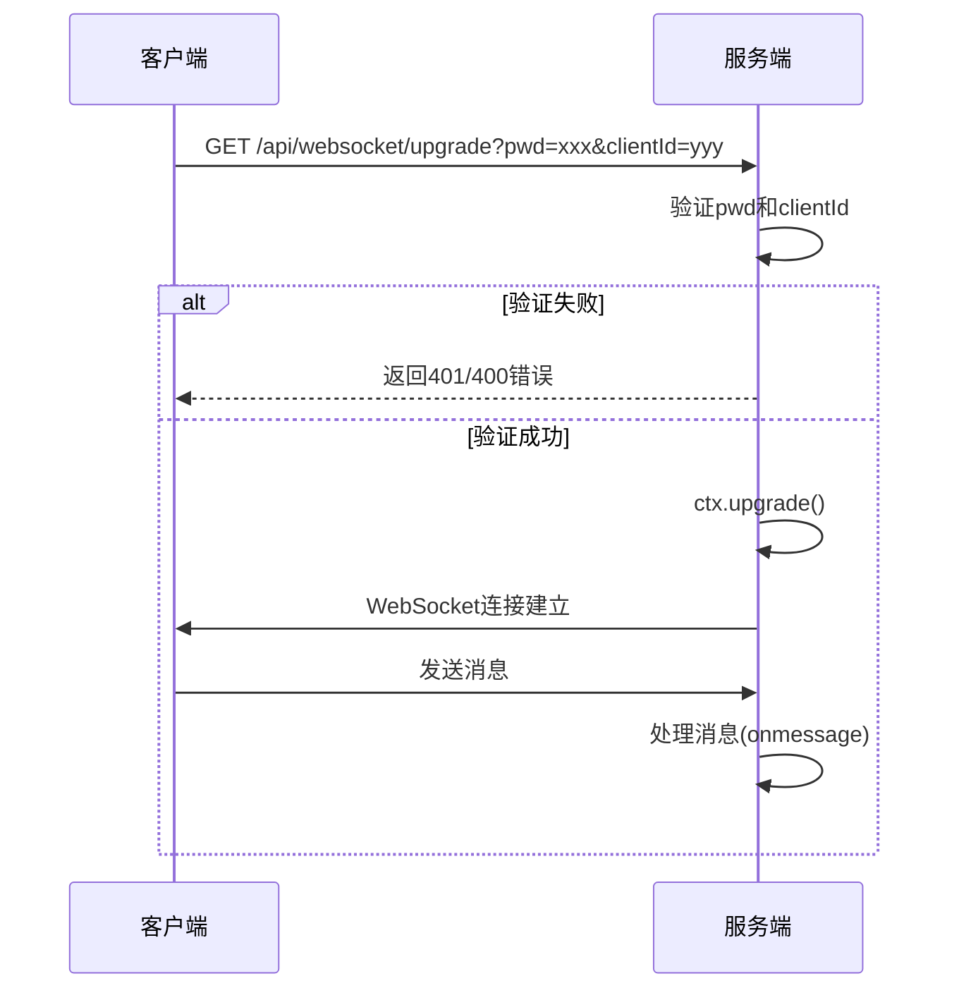
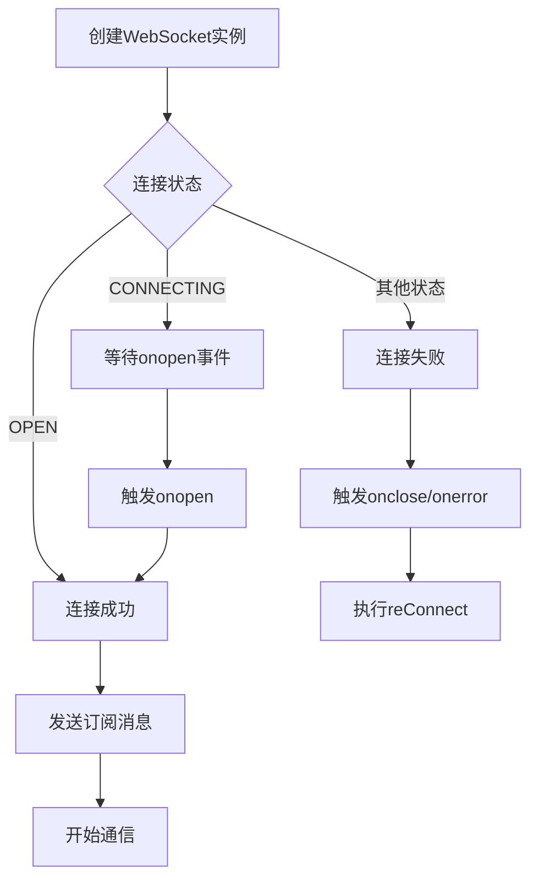
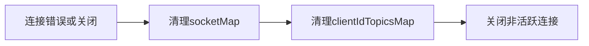
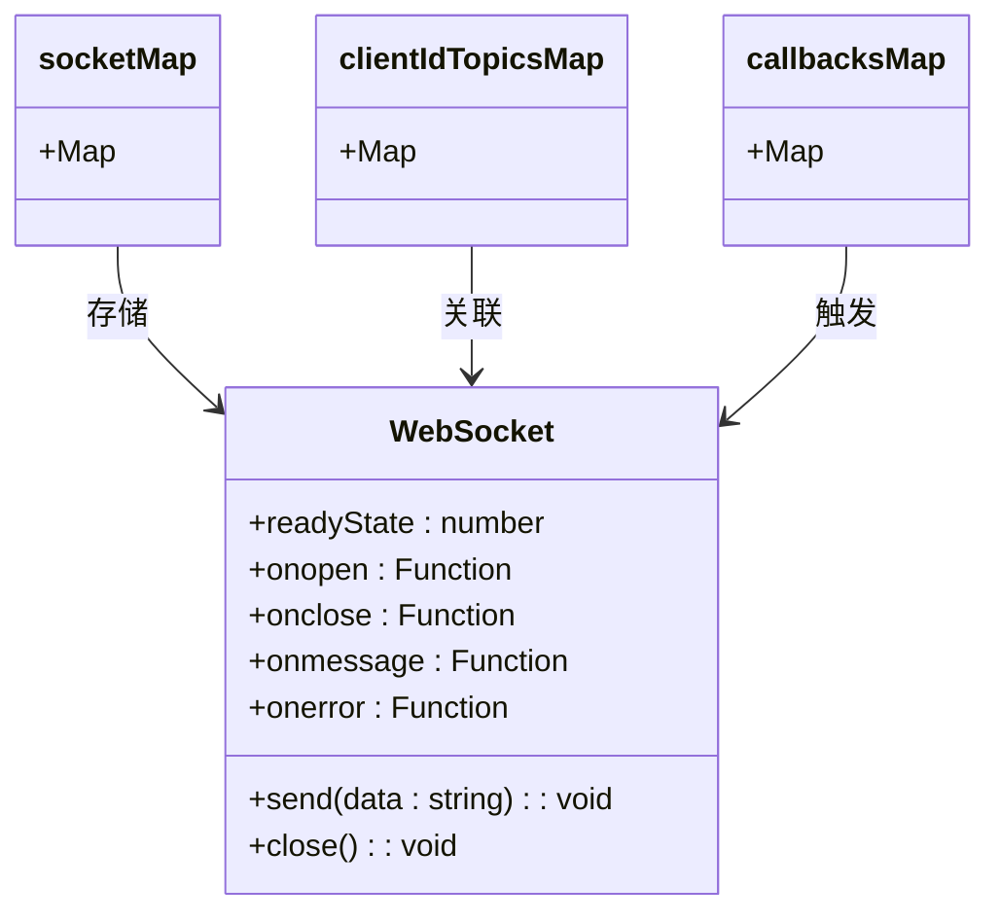

# WebSocket连接建立


**本文档引用的文件**  
- [websocket.router.ts](https://github.com/sail-sail/nest/blob/main/deno\lib\websocket\websocket.router.ts)
- [websocket.constants.ts](https://github.com/sail-sail/nest/blob/main/deno\lib\websocket\websocket.constants.ts)
- [websocket.ts](https://github.com/sail-sail/nest/blob/main/pc\src\compositions\websocket.ts)
- [websocket.dao.ts](https://github.com/sail-sail/nest/blob/main/deno\lib\websocket\websocket.dao.ts)


## 目录
1. [WebSocket连接建立](#websocket连接建立)
2. [服务端WebSocket升级处理](#服务端websocket升级处理)
3. [前端WebSocket实例创建](#前端websocket实例创建)
4. [连接参数与状态管理](#连接参数与状态管理)
5. [错误处理机制](#错误处理机制)
6. [完整连接流程示例](#完整连接流程示例)

## 服务端WebSocket升级处理

服务端通过 `websocket.router.ts` 文件中的路由配置处理WebSocket升级请求。该文件定义了 `/api/websocket/upgrade` 路径的GET请求处理器，用于将HTTP连接升级为WebSocket连接。

### 路由配置与请求验证

在 `websocket.router.ts` 中，使用Oak框架的Router创建了带有前缀 `/api/websocket/` 的路由实例。`upgrade` 接口的处理逻辑如下：

1. **密码验证**：从URL查询参数中获取 `pwd`，与预设的 `PWD` 常量进行比对。若不匹配，则返回401未授权状态。
2. **客户端ID验证**：检查 `clientId` 参数是否存在。若缺失，则返回400错误响应。
3. **连接升级**：通过 `ctx.upgrade()` 方法将HTTP连接升级为WebSocket连接。

```typescript
router.get("upgrade", function(ctx) {
  const request = ctx.request;
  const response = ctx.response;
  const pwd = request.url.searchParams.get("pwd");
  if (pwd !== PWD) {
    response.status = 401;
    response.body = { code: 401, data: "Unauthorized" };
    return;
  }
  const clientId = request.url.searchParams.get("clientId");
  if (!clientId) {
    const errMsg = "clientId is required!";
    error(errMsg);
    response.status = 400;
    response.body = { code: 400, data: errMsg };
    return;
  }
  const socket = ctx.upgrade();
  // ...
});
```

### 连接初始化与事件处理

连接升级成功后，服务端为WebSocket实例绑定以下事件处理器：

- **onopen**：连接打开时调用 `onopen(socket, clientId)` 函数，将新连接加入 `socketMap` 映射，并关闭该 `clientId` 下所有非活跃连接。
- **onclose**：连接关闭时，从 `socketMap` 和 `clientIdTopicsMap` 中移除对应记录。
- **onerror**：发生错误时，尝试关闭连接并清理相关资源。
- **onmessage**：处理客户端发送的消息，支持 `subscribe`、`publish` 和 `unSubscribe` 三种操作。



**图示来源**
- [websocket.router.ts](https://github.com/sail-sail/nest/blob/main/deno\lib\websocket\websocket.router.ts#L38-L89)

**本节来源**
- [websocket.router.ts](https://github.com/sail-sail/nest/blob/main/deno\lib\websocket\websocket.router.ts#L0-L199)

## 前端WebSocket实例创建

前端在 `pc/src/compositions/websocket.ts` 文件中实现了WebSocket连接的创建与管理。

### 连接URL构造

连接URL根据当前页面协议（HTTP/HTTPS）动态生成，确保协议一致性：

```typescript
const isSSL = location.protocol === 'https:';
const clientId = uuid();
const PWD = "0YSCBr1QQSOpOfi6GgH34A";
const url = (isSSL ? 'wss://' : 'ws://') + location.host + '/api/websocket/upgrade?pwd='+ PWD + '&clientId=' + encodeURIComponent(clientId);
```

### 协议协商与初始握手

通过 `new WebSocket(url)` 创建WebSocket实例，并设置以下事件处理器：

- **onmessage**：接收服务端消息。若消息为 `"pong"`，则忽略；否则解析JSON数据并触发对应主题的回调函数。
- **onclose**：连接关闭时，设置 `socket = undefined` 并调用 `reConnect()` 尝试重连。
- **onerror**：发生错误时，尝试关闭连接并触发重连。



**图示来源**
- [websocket.ts](https://github.com/sail-sail/nest/blob/main/pc\src\compositions\websocket.ts#L0-L23)

**本节来源**
- [websocket.ts](https://github.com/sail-sail/nest/blob/main/pc\src\compositions\websocket.ts#L0-L315)

## 连接参数与状态管理

### 连接参数配置

前端连接参数包括：
- **协议**：根据页面协议自动选择 `ws://` 或 `wss://`
- **主机**：使用 `location.host` 获取当前主机地址
- **查询参数**：
  - `pwd`：固定密码，用于服务端认证
  - `clientId`：使用 `uuid()` 生成的唯一客户端标识

### 超时设置

系统实现了两种超时机制：
1. **心跳机制**：每60秒发送一次 `"ping"` 消息，维持连接活跃。
2. **空闲关闭**：当无任何订阅主题时，10分钟后自动关闭连接。

```typescript
function socketPing() {
  if (socket && socket.readyState === WebSocket.OPEN) {
    socket.send("ping");
  }
  setTimeout(socketPing, 60000);
}
```

### 连接状态监听

通过WebSocket的 `readyState` 属性监听连接状态：
- `WebSocket.CONNECTING` (0)：连接中
- `WebSocket.OPEN` (1)：已打开
- `WebSocket.CLOSING` (2)：正在关闭
- `WebSocket.CLOSED` (3)：已关闭

`connect()` 函数会等待连接状态变为 `OPEN` 后才返回，确保连接可用。

**本节来源**
- [websocket.ts](https://github.com/sail-sail/nest/blob/main/pc\src\compositions\websocket.ts#L25-L72)

## 错误处理机制

### 网络不可达处理

当网络不可达时，WebSocket会触发 `onerror` 事件，随后触发 `onclose`。前端通过 `reConnect()` 函数实现自动重连：

```typescript
async function reConnect() {
  if (socket && (socket.readyState === WebSocket.OPEN || socket.readyState === WebSocket.CONNECTING)) {
    return socket;
  }
  if (topicCallbackMap.size === 0) {
    return;
  }
  reConnectNum++;
  let time = 200;
  if (reConnectNum > 10) {
    time = 5000;
  } else {
    time = reConnectNum * 200;
  }
  await new Promise((resolve) => setTimeout(resolve, time));
  await connect();
}
```

重连策略采用指数退避算法，初始间隔200ms，最多尝试10次，之后固定为5秒间隔。

### 认证失败处理

若 `pwd` 验证失败，服务端直接返回HTTP 401状态码，WebSocket连接无法建立。前端无法区分此错误与其他网络错误，统一按连接失败处理并尝试重连。

### 连接异常处理

服务端在 `onerror` 和 `onclose` 事件中清理资源：
- 从 `socketMap` 中移除失效连接
- 清除 `clientIdTopicsMap` 中的订阅记录
- 关闭非活跃连接



**图示来源**
- [websocket.router.ts](https://github.com/sail-sail/nest/blob/main/deno\lib\websocket\websocket.router.ts#L86-L134)

**本节来源**
- [websocket.router.ts](https://github.com/sail-sail/nest/blob/main/deno\lib\websocket\websocket.router.ts#L86-L134)
- [websocket.ts](https://github.com/sail-sail/nest/blob/main/pc\src\compositions\websocket.ts#L68-L115)

## 完整连接流程示例

以下是客户端发起连接到服务端接受连接的完整流程：

### 客户端代码示例

```typescript
// 订阅主题
await subscribe("user_update", (data) => {
  console.log("收到用户更新:", data);
});

// 发布消息
await publish({
  topic: "user_update",
  payload: { id: 1, name: "张三" }
});

// 取消订阅
await unSubscribe("user_update");
```

### 服务端处理流程

1. 客户端发送升级请求：`GET /api/websocket/upgrade?pwd=0YSCBr1QQSOpOfi6GgH34A&clientId=abc123`
2. 服务端验证参数，升级连接
3. 客户端发送订阅消息：
```json
{
  "action": "subscribe",
  "data": {
    "topics": ["user_update"]
  }
}
```
4. 服务端将 `user_update` 主题加入 `clientIdTopicsMap`
5. 当有消息发布时，服务端向所有订阅该主题的客户端广播消息

### 数据结构说明

- `socketMap`: `Map<string, WebSocket[]>` - 按 `clientId` 存储WebSocket连接数组
- `clientIdTopicsMap`: `Map<string, string[]>` - 按 `clientId` 存储订阅的主题列表
- `callbacksMap`: `Map<string, Function[]>` - 按主题存储回调函数数组



**图示来源**
- [websocket.constants.ts](https://github.com/sail-sail/nest/blob/main/deno\lib\websocket\websocket.constants.ts#L0-L5)
- [websocket.dao.ts](https://github.com/sail-sail/nest/blob/main/deno\lib\websocket\websocket.dao.ts#L0-L63)

**本节来源**
- [websocket.constants.ts](https://github.com/sail-sail/nest/blob/main/deno\lib\websocket\websocket.constants.ts#L0-L5)
- [websocket.dao.ts](https://github.com/sail-sail/nest/blob/main/deno\lib\websocket\websocket.dao.ts#L0-L63)