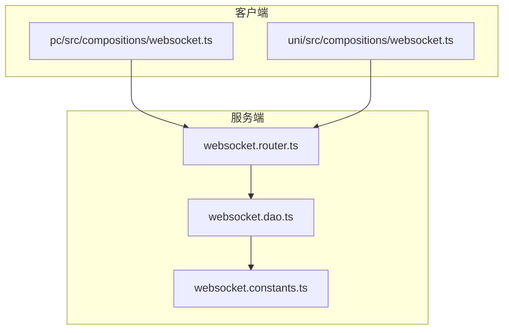
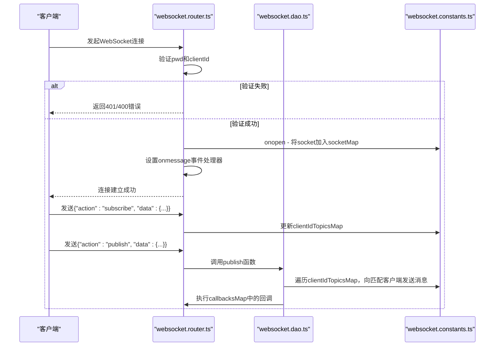
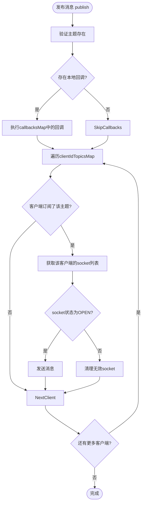
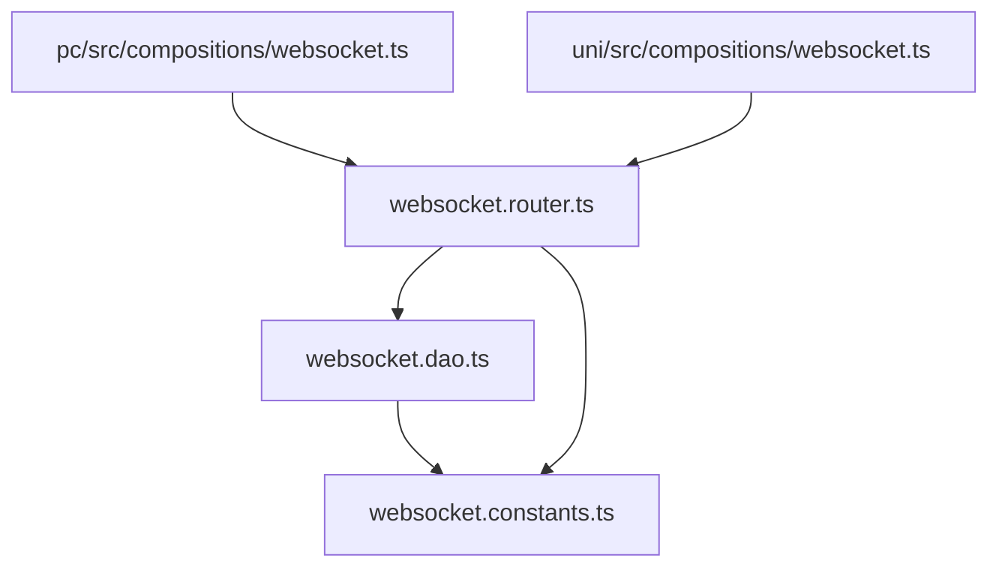

# WebSocket连接管理


**本文档引用的文件**  
- [websocket.router.ts](https://github.com/sail-sail/nest/blob/main/deno/lib/websocket/websocket.router.ts)
- [websocket.dao.ts](https://github.com/sail-sail/nest/blob/main/deno/lib/websocket/websocket.dao.ts)
- [websocket.constants.ts](https://github.com/sail-sail/nest/blob/main/deno/lib/websocket/websocket.constants.ts)
- [pc/src/compositions/websocket.ts](https://github.com/sail-sail/nest/blob/main/pc/src/compositions/websocket.ts)
- [uni/src/compositions/websocket.ts](https://github.com/sail-sail/nest/blob/main/uni/src/compositions/websocket.ts)


## 目录
1. [简介](#简介)
2. [项目结构](#项目结构)
3. [核心组件](#核心组件)
4. [架构概览](#架构概览)
5. [详细组件分析](#详细组件分析)
6. [依赖关系分析](#依赖关系分析)
7. [性能与异常处理](#性能与异常处理)
8. [故障排查指南](#故障排查指南)
9. [结论](#结论)

## 简介
本文档详细阐述了基于WebSocket的实时通信系统的设计与实现，重点涵盖连接建立、认证机制、生命周期管理、心跳检测、异常重连及连接池管理。系统采用服务端与客户端协同架构，服务端通过`websocket.router.ts`处理连接请求，利用`websocket.dao.ts`管理连接状态，常量定义在`websocket.constants.ts`中。前端通过`pc/src/compositions/websocket.ts`和`uni/src/compositions/websocket.ts`实现连接初始化与组合式API集成。文档将深入分析认证流程、消息发布/订阅机制及网络异常处理策略。

## 项目结构
WebSocket功能模块分布在服务端与客户端两个主要目录中。服务端逻辑位于`deno/lib/websocket/`目录下，包含路由、数据访问对象（DAO）和常量定义。客户端逻辑分别位于`pc/src/compositions/`（Web端）和`uni/src/compositions/`（UniApp端），提供统一的API接口。



**图示来源**
- [websocket.router.ts](https://github.com/sail-sail/nest/blob/main/deno/lib/websocket/websocket.router.ts)
- [websocket.dao.ts](https://github.com/sail-sail/nest/blob/main/deno/lib/websocket/websocket.dao.ts)
- [websocket.constants.ts](https://github.com/sail-sail/nest/blob/main/deno/lib/websocket/websocket.constants.ts)
- [pc/src/compositions/websocket.ts](https://github.com/sail-sail/nest/blob/main/pc/src/compositions/websocket.ts)
- [uni/src/compositions/websocket.ts](https://github.com/sail-sail/nest/blob/main/uni/src/compositions/websocket.ts)

## 核心组件
系统核心由三个服务端文件和两个客户端文件构成。`websocket.constants.ts`定义了全局状态存储的Map结构，`websocket.dao.ts`封装了消息发布与订阅的业务逻辑，`websocket.router.ts`负责处理WebSocket握手与消息分发。客户端文件则实现了连接管理、自动重连和组合式API。

**组件来源**
- [websocket.router.ts](https://github.com/sail-sail/nest/blob/main/deno/lib/websocket/websocket.router.ts)
- [websocket.dao.ts](https://github.com/sail-sail/nest/blob/main/deno/lib/websocket/websocket.dao.ts)
- [websocket.constants.ts](https://github.com/sail-sail/nest/blob/main/deno/lib/websocket/websocket.constants.ts)

## 架构概览
系统采用发布/订阅（Pub/Sub）模式，客户端通过唯一`clientId`连接到服务端。服务端维护三个核心映射关系：`socketMap`（客户端ID到WebSocket实例列表）、`clientIdTopicsMap`（客户端ID到订阅主题列表）和`callbacksMap`（主题到回调函数列表）。消息通过`action`字段区分操作类型（subscribe, publish, unSubscribe）。



**图示来源**
- [websocket.router.ts](https://github.com/sail-sail/nest/blob/main/deno/lib/websocket/websocket.router.ts)
- [websocket.dao.ts](https://github.com/sail-sail/nest/blob/main/deno/lib/websocket/websocket.dao.ts)
- [websocket.constants.ts](https://github.com/sail-sail/nest/blob/main/deno/lib/websocket/websocket.constants.ts)

## 详细组件分析

### 服务端组件分析

#### websocket.constants.ts
该文件定义了三个全局共享的Map对象，用于存储运行时状态。

```mermaid
classDiagram
class callbacksMap {
+Map<string, ((data : any) => void)[]>
+key : 主题(topic)
+value : 回调函数数组
}
class socketMap {
+Map<string, WebSocket[]>
+key : 客户端ID(clientId)
+value : WebSocket实例数组
}
class clientIdTopicsMap {
+Map<string, string[]>
+key : 客户端ID(clientId)
+value : 主题字符串数组
}
```

**图示来源**
- [websocket.constants.ts](https://github.com/sail-sail/nest/blob/main/deno/lib/websocket/websocket.constants.ts#L1-L7)

#### websocket.dao.ts
该文件提供了对`websocket.constants.ts`中Map对象的操作接口。

**功能分析：**
- **subscribe**: 为指定主题注册回调函数。
- **publish**: 向所有订阅了该主题的客户端广播消息，并触发本地回调。
- **unSubscribe**: 从指定主题移除回调函数或取消整个主题订阅。
- **unSubscribes**: 批量取消多个主题的订阅。
- **closeClient**: 清除所有订阅（目前未被调用）。



**图示来源**
- [websocket.dao.ts](https://github.com/sail-sail/nest/blob/main/deno/lib/websocket/websocket.dao.ts#L1-L104)

#### websocket.router.ts
这是WebSocket的入口点，处理连接升级、认证和消息分发。

**关键流程：**
1. **连接认证**：检查URL参数中的`pwd`和`clientId`，使用硬编码密码`0YSCBr1QQSOpOfi6GgH34A`。
2. **连接建立**：`onopen`事件将新连接加入`socketMap`，并关闭该`clientId`的旧连接。
3. **消息处理**：`onmessage`根据`action`字段分发消息。
   - `ping`: 回复`pong`，用于心跳检测。
   - `subscribe`: 更新`clientIdTopicsMap`。
   - `publish`: 调用`websocket.dao.ts`的`publish`函数。
   - `unSubscribe`: 从`clientIdTopicsMap`中移除主题。

**异常处理：**
- `onclose`和`onerror`事件会清理`socketMap`和`clientIdTopicsMap`中的对应条目。
- 使用`try-catch`捕获并记录错误。

**组件来源**
- [websocket.router.ts](https://github.com/sail-sail/nest/blob/main/deno/lib/websocket/websocket.router.ts#L1-L200)

### 客户端组件分析

#### pc/src/compositions/websocket.ts
Web端的WebSocket管理模块，使用标准WebSocket API。

**核心特性：**
- **连接管理**：`connect()`函数负责创建和初始化WebSocket连接。
- **自动重连**：`reConnect()`函数在连接断开后按指数退避策略重试。
- **心跳机制**：`socketPing()`每60秒发送一次`ping`消息。
- **订阅管理**：`topicCallbackMap`在前端维护订阅关系，`useSubscribe`提供Vue组合式API支持。
- **连接复用与延迟关闭**：`closeSocketTimeout`在无订阅后10分钟关闭连接，避免频繁重连。

**组件来源**
- [pc/src/compositions/websocket.ts](https://github.com/sail-sail/nest/blob/main/pc/src/compositions/websocket.ts#L1-L316)

#### uni/src/compositions/websocket.ts
UniApp端的WebSocket管理模块，使用`uni.connectSocket` API。

**与Web端的差异：**
- 使用`uni.connectSocket`而非原生`WebSocket`。
- 消息发送需通过`socket.send({ data: ... })`对象形式。
- 错误处理中`socket?.close({})`调用带空对象参数。
- 其余逻辑（重连、心跳、订阅管理）与Web端保持一致。

**组件来源**
- [uni/src/compositions/websocket.ts](https://github.com/sail-sail/nest/blob/main/uni/src/compositions/websocket.ts#L1-L304)

## 依赖关系分析
系统依赖关系清晰，服务端内部`router`依赖`dao`和`constants`，客户端依赖服务端的API。客户端之间通过服务端进行间接通信。



**图示来源**
- [websocket.router.ts](https://github.com/sail-sail/nest/blob/main/deno/lib/websocket/websocket.router.ts)
- [websocket.dao.ts](https://github.com/sail-sail/nest/blob/main/deno/lib/websocket/websocket.dao.ts)
- [websocket.constants.ts](https://github.com/sail-sail/nest/blob/main/deno/lib/websocket/websocket.constants.ts)
- [pc/src/compositions/websocket.ts](https://github.com/sail-sail/nest/blob/main/pc/src/compositions/websocket.ts)
- [uni/src/compositions/websocket.ts](https://github.com/sail-sail/nest/blob/main/uni/src/compositions/websocket.ts)

## 性能与异常处理

### 性能考量
- **内存使用**：`socketMap`和`clientIdTopicsMap`会随客户端数量线性增长，需监控内存。
- **消息广播**：`publish`操作的时间复杂度为O(N*M)，N为订阅客户端数，M为平均连接数。在高并发场景下可能成为瓶颈。
- **连接复用**：前端的延迟关闭机制有效减少了连接建立的开销。

### 异常处理策略
- **网络中断**：客户端`onclose`和`onerror`触发`reConnect`，实现自动重连。
- **服务器重启**：客户端在重连时会重新发送`subscribe`消息，恢复订阅状态。
- **无效连接**：服务端在发送消息前检查`readyState`，并清理无效连接。
- **认证失败**：服务端直接返回HTTP错误码，客户端需处理连接失败。

## 故障排查指南
- **连接失败**：检查URL中的`pwd`是否正确，`clientId`是否缺失。
- **消息收不到**：确认`subscribe`消息已成功发送，检查`clientIdTopicsMap`中是否存在对应条目。
- **频繁重连**：检查网络状况，或服务端日志是否有`onerror`记录。
- **内存泄漏**：检查`socketMap`和`clientIdTopicsMap`是否在连接关闭后被正确清理。目前`closeClient`函数未被调用，`unSubscribe`仅在无回调时清理`callbacksMap`，可能存在内存泄漏风险。

**组件来源**
- [websocket.router.ts](https://github.com/sail-sail/nest/blob/main/deno/lib/websocket/websocket.router.ts)
- [pc/src/compositions/websocket.ts](https://github.com/sail-sail/nest/blob/main/pc/src/compositions/websocket.ts)

## 结论
该WebSocket系统实现了完整的连接管理、认证、发布/订阅和异常恢复机制。架构清晰，前后端职责分明。主要优势在于自动重连和连接复用机制。潜在改进点包括：将硬编码密码移至配置文件、优化`publish`的广播性能、实现更完善的连接池清理策略，以及增加服务端主动推送连接状态的功能。