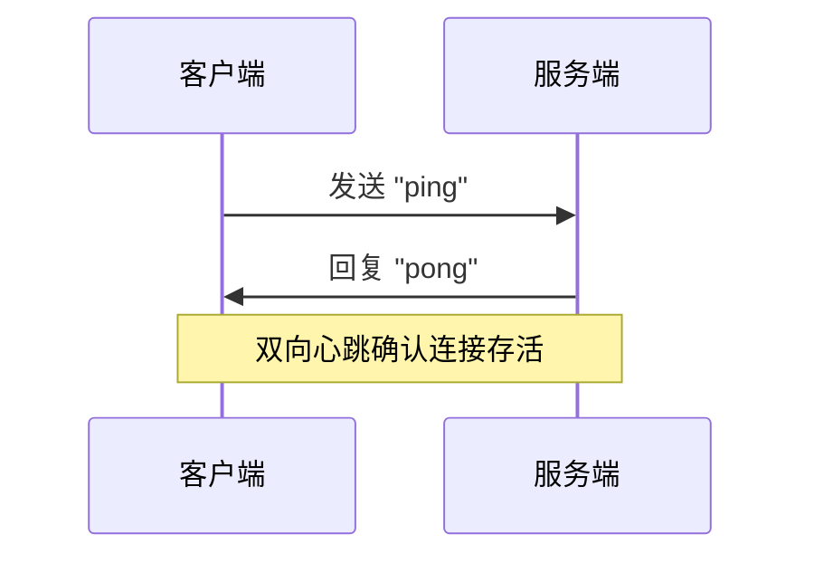
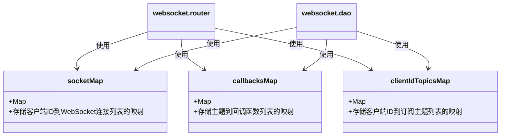

# 心跳检测与连接保持


**本文档引用的文件**   
- [websocket.constants.ts](https://github.com/sail-sail/nest/blob/main/deno\lib\websocket\websocket.constants.ts)
- [websocket.dao.ts](https://github.com/sail-sail/nest/blob/main/deno\lib\websocket\websocket.dao.ts)
- [websocket.router.ts](https://github.com/sail-sail/nest/blob/main/deno\lib\websocket\websocket.router.ts)
- [pc/src/compositions/websocket.ts](https://github.com/sail-sail/nest/blob/main/pc\src\compositions\websocket.ts)


## 目录
1. [引言](#引言)
2. [心跳机制概述](#心跳机制概述)
3. [服务端心跳处理实现](#服务端心跳处理实现)
4. [客户端心跳发送与响应](#客户端心跳发送与响应)
5. [双向心跳与连接状态管理](#双向心跳与连接状态管理)
6. [心跳消息格式与通信协议](#心跳消息格式与通信协议)
7. [网络波动与重连策略](#网络波动与重连策略)
8. [连接健康度判断与清理机制](#连接健康度判断与清理机制)
9. [代码示例与使用方式](#代码示例与使用方式)
10. [总结](#总结)

## 引言

WebSocket 是一种在单个 TCP 连接上进行全双工通信的协议，广泛用于实时数据推送场景。然而，长时间空闲的连接可能因网络中间设备（如 NAT、防火墙）超时而被断开，且客户端或服务端无法立即感知。为解决此问题，系统实现了基于定时心跳检测的连接保持机制。

本文档详细说明本项目中 WebSocket 心跳检测机制的实现原理，涵盖服务端与客户端的双向心跳设计、心跳间隔与超时配置、连接活跃状态管理、无效连接清理策略，以及网络异常下的重连逻辑。通过分析核心代码文件，帮助开发者理解如何保障 WebSocket 长连接的稳定性与可靠性。

## 心跳机制概述

本系统采用**双向心跳机制**，即客户端定时向服务端发送 `ping` 消息，服务端收到后立即响应 `pong` 消息。通过这一交互，双方可确认连接的活跃性。

- **客户端行为**：每 60 秒发送一次 `ping` 消息。
- **服务端行为**：收到 `ping` 后立即回复 `pong`。
- **连接判定**：若服务端在 WebSocket 连接的 `onmessage` 回调中持续收到 `ping`，则认为该连接正常；若连接关闭或出错，则通过 `onclose` 和 `onerror` 事件清理相关资源。

该机制有效防止了因网络空闲导致的连接中断，并能及时发现并处理异常连接。

**Section sources**
- [pc/src/compositions/websocket.ts](https://github.com/sail-sail/nest/blob/main/pc\src\compositions\websocket.ts#L20-L30)
- [websocket.router.ts](https://github.com/sail-sail/nest/blob/main/deno\lib\websocket\websocket.router.ts#L130-L140)

## 服务端心跳处理实现

服务端在 `websocket.router.ts` 文件中通过监听 `onmessage` 事件处理心跳消息。当收到客户端发送的纯文本 `"ping"` 消息时，服务端调用 `socket.send("pong")` 进行响应。



**Diagram sources**
- [websocket.router.ts](https://github.com/sail-sail/nest/blob/main/deno\lib\websocket\websocket.router.ts#L130-L135)

此外，服务端在遍历所有客户端连接并广播消息时，会检查每个 `WebSocket` 对象的 `readyState` 是否为 `WebSocket.OPEN`。若状态异常，则从 `socketMap` 中移除该连接，并尝试关闭 `socket`，防止无效连接占用资源。

```typescript
if (socket.readyState !== WebSocket.OPEN) {
  socketMap.set(clientId, sockets.filter((item) => item !== socket));
  clientIdTopicsMap.delete(clientId);
  try {
    socket.close();
  } catch (_err) {
    error(_err);
  }
  continue;
}
```

此逻辑在 `websocket.dao.ts` 的 `publish` 函数和 `websocket.router.ts` 的 `onmessage` 处理中均有体现，确保了服务端连接状态的实时性与准确性。

**Section sources**
- [websocket.dao.ts](https://github.com/sail-sail/nest/blob/main/deno\lib\websocket\websocket.dao.ts#L50-L60)
- [websocket.router.ts](https://github.com/sail-sail/nest/blob/main/deno\lib\websocket\websocket.router.ts#L170-L180)

## 客户端心跳发送与响应

前端在 `pc/src/compositions/websocket.ts` 中实现了定时心跳发送逻辑。通过 `socketPing` 函数，使用 `setTimeout` 每 60 秒检查一次连接状态，并向服务端发送 `ping` 消息。

```typescript
function socketPing() {
  if (socket && socket.readyState === WebSocket.OPEN) {
    socket.send("ping");
  }
  setTimeout(socketPing, 60000); // 每60秒发送一次
}
socketPing();
```

客户端的 `onmessage` 事件监听器会接收服务端返回的 `"pong"` 消息。虽然代码中未对 `"pong"` 做特殊处理（仅忽略），但成功接收 `pong` 表明连接畅通。若长时间未收到 `pong`，浏览器的 WebSocket 会触发 `onclose` 或 `onerror` 事件，进而触发重连流程。

该设计简洁高效，避免了复杂的超时计时器管理，依赖 WebSocket 原生事件机制进行异常检测。

**Section sources**
- [pc/src/compositions/websocket.ts](https://github.com/sail-sail/nest/blob/main/pc\src\compositions\websocket.ts#L20-L30)

## 双向心跳与连接状态管理

本系统实现了**逻辑上的双向心跳**：

- **前向心跳**：客户端 → 服务端 (`ping` → `pong`)
- **后向心跳**：服务端 → 客户端 (通过 `publish` 发送业务消息)

尽管服务端不主动发送 `ping`，但其在 `publish` 消息时会检查连接状态，相当于一种被动的心跳探测。若消息发送失败或连接状态非 `OPEN`，则立即清理该连接。

服务端使用三个全局 `Map` 管理连接状态：

| Map 名称 | 作用 | 数据结构 |
|---------|------|---------|
| `socketMap` | 存储每个客户端 ID 对应的所有 WebSocket 连接 | `Map<string, WebSocket[]>` |
| `callbacksMap` | 存储每个主题（topic）对应的回调函数列表 | `Map<string, Function[]>` |
| `clientIdTopicsMap` | 记录每个客户端订阅的主题列表 | `Map<string, string[]>` |

当客户端连接断开时，服务端通过 `onclose` 和 `onerror` 事件从这三个 `Map` 中清除对应数据，实现资源的自动回收。



**Diagram sources**
- [websocket.constants.ts](https://github.com/sail-sail/nest/blob/main/deno\lib\websocket\websocket.constants.ts#L1-L7)
- [websocket.dao.ts](https://github.com/sail-sail/nest/blob/main/deno\lib\websocket\websocket.dao.ts#L10-L15)
- [websocket.router.ts](https://github.com/sail-sail/nest/blob/main/deno\lib\websocket\websocket.router.ts#L10-L15)

## 心跳消息格式与通信协议

本系统的心跳消息采用**纯文本格式**，而非 JSON，以减少开销：

- **心跳请求（ping）**：`"ping"`（字符串）
- **心跳响应（pong）**：`"pong"`（字符串）

对于业务消息，系统使用 JSON 格式进行通信，结构如下：

```json
{
  "action": "subscribe | unSubscribe | publish",
  "data": { /* 业务数据 */ }
}
```

例如，订阅主题的消息格式为：

```json
{
  "action": "subscribe",
  "data": {
    "topics": ["user_update"]
  }
}
```

这种设计将心跳消息与业务消息分离，心跳消息轻量高效，业务消息结构清晰，便于解析与扩展。

**Section sources**
- [pc/src/compositions/websocket.ts](https://github.com/sail-sail/nest/blob/main/pc\src\compositions\websocket.ts#L100-L110)
- [websocket.router.ts](https://github.com/sail-sail/nest/blob/main/deno\lib\websocket\websocket.router.ts#L130-L135)

## 网络波动与重连策略

当前端检测到连接关闭（`onclose`）或发生错误（`onerror`）时，会触发 `reConnect()` 函数进行自动重连。

重连策略如下：

1. 若当前无任何订阅主题（`topicCallbackMap.size === 0`），则不进行重连。
2. 重连尝试次数通过 `reConnectNum` 计数。
3. 初始重连间隔为 `reConnectNum * 200` 毫秒，最多尝试 10 次。
4. 超过 10 次后，固定为 5 秒重试一次。

```typescript
let reConnectNum = 0;
async function reConnect() {
  if (topicCallbackMap.size === 0) {
    return;
  }
  reConnectNum++;
  let time = 200;
  if (reConnectNum > 10) {
    time = 5000;
  } else {
    time = reConnectNum * 200;
  }
  await new Promise((resolve) => setTimeout(resolve, time));
  await connect();
}
```

该策略采用**指数退避**的变体，避免在网络短暂波动时频繁重连，减轻服务端压力，同时保证最终能恢复连接。

**Section sources**
- [pc/src/compositions/websocket.ts](https://github.com/sail-sail/nest/blob/main/pc\src\compositions\websocket.ts#L35-L55)

## 连接健康度判断与清理机制

系统通过以下方式判断连接健康度并清理无效连接：

### 服务端清理机制
- **发送时检查**：在 `publish` 消息时，遍历所有客户端连接，检查 `readyState`。
- **事件驱动清理**：通过 `onclose` 和 `onerror` 事件，从 `socketMap` 和 `clientIdTopicsMap` 中删除失效连接。
- **资源回收**：及时调用 `socket.close()` 释放底层资源。

### 客户端清理机制
- **空闲关闭**：客户端通过 `closeSocketTimeout` 定时器，在无任何订阅主题时 10 分钟后自动关闭连接。
- **异常重连**：连接异常时，清除当前 `socket` 引用并尝试重连。

```typescript
let closeSocketTimeout: NodeJS.Timeout | undefined = undefined;
// 每次操作后重置定时器
closeSocketTimeout = setTimeout(() => {
  if (topicCallbackMap.size === 0) {
    try {
      socket?.close();
    } catch (err) {
      console.log(err);
    } finally {
      socket = undefined;
    }
  }
}, 600000); // 10分钟
```

该机制避免了客户端长时间保持无用连接，提升了系统整体资源利用率。

**Section sources**
- [pc/src/compositions/websocket.ts](https://github.com/sail-sail/nest/blob/main/pc\src\compositions\websocket.ts#L290-L310)
- [websocket.dao.ts](https://github.com/sail-sail/nest/blob/main/deno\lib\websocket\websocket.dao.ts#L50-L60)

## 代码示例与使用方式

### 前端订阅主题
使用 `useSubscribe` 函数在 Vue 组件中响应式订阅主题：

```typescript
import { useSubscribe } from '@/compositions/websocket';

export default {
  setup() {
    useSubscribe('user_update', (data) => {
      console.log('收到用户更新:', data);
      // 更新UI
    });
  }
}
```

### 前端发布消息
调用 `publish` 函数向指定主题发送消息：

```typescript
import { publish } from '@/compositions/websocket';

publish({
  topic: 'user_update',
  payload: { id: 1, name: '张三' }
});
```

### 服务端接收并广播
服务端自动处理 `publish` 消息，并将数据广播给所有订阅该主题的客户端。

## 总结

本系统通过简洁高效的双向心跳机制，保障了 WebSocket 长连接的稳定性。客户端每 60 秒发送 `ping`，服务端即时响应 `pong`，结合连接状态检查与事件驱动的资源清理，实现了对无效连接的精准识别与回收。前端采用指数退避重连策略应对网络波动，后端通过全局 `Map` 结构高效管理连接与订阅关系。整体设计兼顾了性能、可靠性与资源利用率，为实时通信功能提供了坚实的基础。