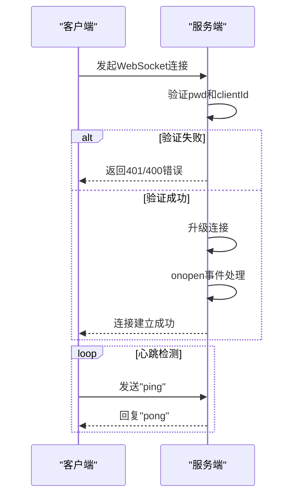
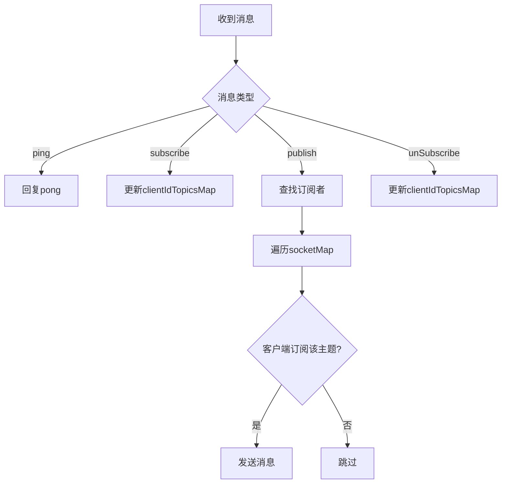
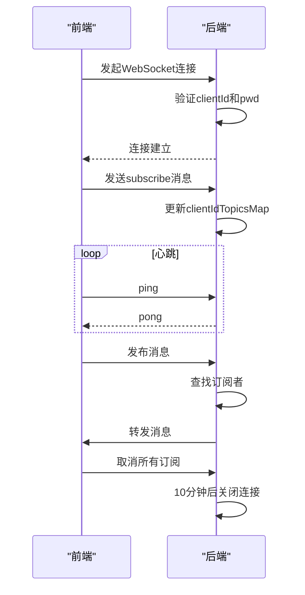

# 连接生命周期管理


**本文档引用的文件**  
- [websocket.dao.ts](https://github.com/sail-sail/nest/blob/main/deno/lib/websocket/websocket.dao.ts)
- [websocket.constants.ts](https://github.com/sail-sail/nest/blob/main/deno/lib/websocket/websocket.constants.ts)
- [websocket.router.ts](https://github.com/sail-sail/nest/blob/main/deno/lib/websocket/websocket.router.ts)
- [pc/src/compositions/websocket.ts](https://github.com/sail-sail/nest/blob/main/pc/src/compositions/websocket.ts)
- [uni/src/compositions/websocket.ts](https://github.com/sail-sail/nest/blob/main/uni/src/compositions/websocket.ts)


## 目录
1. [引言](#引言)
2. [服务端连接管理](#服务端连接管理)
3. [前端连接管理](#前端连接管理)
4. [连接状态与事件处理](#连接状态与事件处理)
5. [重连机制与策略](#重连机制与策略)
6. [资源释放与状态清理](#资源释放与状态清理)
7. [完整生命周期示例](#完整生命周期示例)
8. [总结](#总结)

## 引言
本文档全面阐述WebSocket连接的生命周期管理机制，涵盖服务端与前端在连接创建、活跃、闲置和销毁各阶段的实现逻辑。重点分析连接池管理、资源释放、状态清理、断线重连及异常处理等核心功能，确保系统在高并发场景下的稳定性与可靠性。

## 服务端连接管理

### 连接创建与认证
服务端通过`websocket.router.ts`中的`/api/websocket/upgrade`接口处理WebSocket连接升级请求。连接建立前需进行身份验证，确保安全性。

- **密码验证**：客户端必须提供正确的`pwd`参数，否则返回401未授权错误。
- **客户端ID验证**：每个连接必须携带唯一的`clientId`，否则返回400错误。

```typescript
const pwd = request.url.searchParams.get("pwd");
if (pwd !== PWD) {
  response.status = 401;
  response.body = { code: 401, data: "Unauthorized" };
  return;
}
const clientId = request.url.searchParams.get("clientId");
if (!clientId) {
  const errMsg = "clientId is required!";
  error(errMsg);
  response.status = 400;
  response.body = { code: 400, data: errMsg };
  return;
}
```

### 连接池与状态跟踪
服务端使用三个全局Map对象管理连接状态：

- **socketMap**：以`clientId`为键，存储该客户端的所有WebSocket连接实例（支持多标签页）。
- **clientIdTopicsMap**：记录每个`clientId`订阅的主题列表。
- **callbacksMap**：存储全局消息回调函数，用于服务端内部事件通知。

当连接打开时，`onopen`函数将新连接加入`socketMap`，并关闭该`clientId`下所有旧连接，防止连接泄露。

```mermaid
classDiagram
class socketMap {
+Map<string, WebSocket[]>
}
class clientIdTopicsMap {
+Map<string, string[]>
}
class callbacksMap {
+Map<string, ((data : any) => Promise<void> | void)[]>
}
socketMap --> "1" clientIdTopicsMap : 关联
socketMap --> "1" callbacksMap : 触发
```

**Diagram sources**
- [websocket.constants.ts](https://github.com/sail-sail/nest/blob/main/deno/lib/websocket/websocket.constants.ts#L1-L6)

**Section sources**
- [websocket.router.ts](https://github.com/sail-sail/nest/blob/main/deno/lib/websocket/websocket.router.ts#L38-L89)

### 连接状态监听
服务端为每个WebSocket实例注册以下事件监听器：

- **onopen**：连接建立时触发，调用`onopen()`函数进行初始化。
- **onclose**：连接关闭时触发，从`socketMap`中移除该连接，并清理`clientIdTopicsMap`。
- **onerror**：发生错误时触发，关闭连接并清理相关资源。
- **onmessage**：接收客户端消息，支持`ping`、`subscribe`、`publish`、`unSubscribe`等操作。



**Diagram sources**
- [websocket.router.ts](https://github.com/sail-sail/nest/blob/main/deno/lib/websocket/websocket.router.ts#L86-L134)

## 前端连接管理

### 连接初始化
前端在`pc/src/compositions/websocket.ts`中实现连接初始化逻辑。每个客户端生成唯一的`clientId`，并构建WebSocket连接URL。

```typescript
const clientId = uuid();
const url = (isSSL ? 'wss://' : 'ws://') + location.host + '/api/websocket/upgrade?pwd='+ PWD + '&clientId=' + encodeURIComponent(clientId);
```

连接建立后，自动发送`subscribe`消息，重新订阅所有已注册的主题。

### 主动关闭与资源释放
前端通过`unSubscribe`和`unSubscribes`函数取消订阅主题。当所有订阅被取消后，系统启动10分钟延迟定时器，若期间无新订阅，则自动关闭连接并释放资源。

```typescript
let closeSocketTimeout: NodeJS.Timeout | undefined = undefined;

closeSocketTimeout = setTimeout(() => {
  if (topicCallbackMap.size === 0) {
    try {
      socket?.close();
    } catch (err) {
      console.log(err);
    } finally {
      socket = undefined;
    }
  }
}, 600000);
```

## 连接状态与事件处理

### 服务端事件处理
服务端`onmessage`处理器支持多种操作：

- **subscribe**：客户端订阅主题，服务端更新`clientIdTopicsMap`。
- **publish**：客户端发布消息，服务端转发给所有订阅该主题的客户端。
- **unSubscribe**：客户端取消订阅，服务端更新`clientIdTopicsMap`。



**Diagram sources**
- [websocket.router.ts](https://github.com/sail-sail/nest/blob/main/deno/lib/websocket/websocket.router.ts#L131-L171)

**Section sources**
- [websocket.dao.ts](https://github.com/sail-sail/nest/blob/main/deno/lib/websocket/websocket.dao.ts#L0-L63)

### 前端事件处理
前端`onmessage`处理器解析服务端消息，根据`topic`分发给对应的回调函数。

```typescript
socket.onmessage = function(event) {
  const eventData = event.data;
  if (eventData === "pong") return;
  const obj = JSON.parse(eventData as string);
  const topic = obj.topic;
  const payload = obj.payload;
  const callbacks = topicCallbackMap.get(topic);
  if (callbacks && callbacks.length > 0) {
    for (const callback of callbacks) {
      callback(payload);
    }
  }
};
```

## 重连机制与策略

### 指数退避重连
前端实现指数退避重连策略，避免网络波动时频繁重连。

- 前10次重连：间隔时间为`reConnectNum * 200ms`
- 超过10次：固定5秒间隔

```typescript
async function reConnect() {
  reConnectNum++;
  let time = 200;
  if (reConnectNum > 10) {
    time = 5000;
  } else {
    time = reConnectNum * 200;
  }
  await new Promise((resolve) => setTimeout(resolve, time));
  await connect();
}
```

### 心跳机制
前端每60秒发送一次`ping`消息，维持连接活跃状态，防止被代理服务器断开。

```typescript
function socketPing() {
  if (socket && socket.readyState === WebSocket.OPEN) {
    socket.send("ping");
  }
  setTimeout(socketPing, 60000);
}
```

## 资源释放与状态清理

### 服务端清理逻辑
当连接关闭或出错时，服务端执行以下清理操作：

1. 从`socketMap`中移除该连接
2. 清理`clientIdTopicsMap`中对应的订阅信息
3. 关闭无效连接（`readyState !== WebSocket.OPEN`）

```typescript
socket.onclose = function() {
  for (const [ clientId2, sockets ] of socketMap) {
    if (sockets.includes(socket)) {
      socketMap.set(clientId2, sockets.filter((item) => item !== socket));
    }
  }
  clientIdTopicsMap.delete(clientId);
};
```

### 前端清理逻辑
前端通过`closeSocketTimeout`机制实现延迟关闭：

- 每次订阅/发布操作重置定时器
- 10分钟后无活动则自动关闭连接
- 确保资源及时释放，避免内存泄漏

## 完整生命周期示例

### 正常连接流程


**Diagram sources**
- [websocket.dao.ts](https://github.com/sail-sail/nest/blob/main/deno/lib/websocket/websocket.dao.ts#L0-L63)
- [pc/src/compositions/websocket.ts](https://github.com/sail-sail/nest/blob/main/pc/src/compositions/websocket.ts#L0-L23)

### 异常断开处理
当网络中断时：
1. 前端检测到`onclose`或`onerror`
2. 执行`reConnect()`函数
3. 按指数退避策略延迟重连
4. 重连成功后重新订阅所有主题

## 总结
本系统实现了完整的WebSocket连接生命周期管理，具备以下特点：

- **安全认证**：通过`pwd`和`clientId`双重验证
- **连接池管理**：支持单用户多标签页连接
- **智能重连**：指数退避策略避免雪崩
- **资源优化**：10分钟空闲自动关闭连接
- **状态同步**：连接恢复后自动重新订阅

该设计确保了系统的高可用性与资源高效利用，适用于大规模实时通信场景。