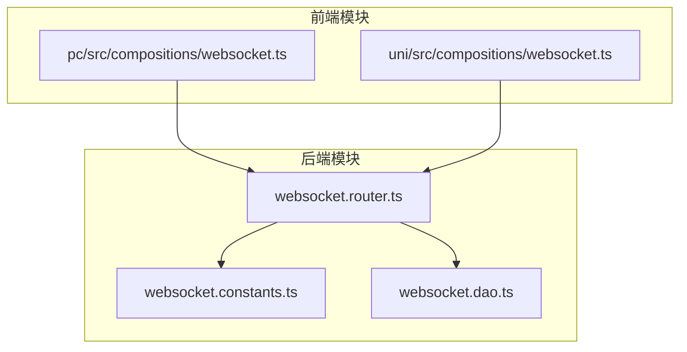
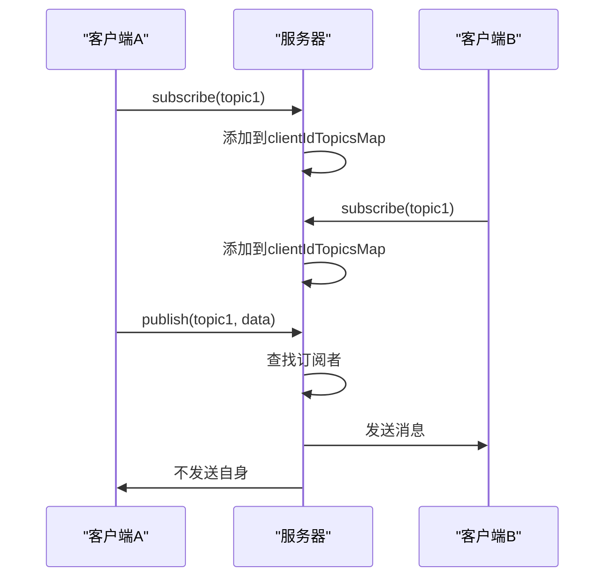

# 安全与性能优化


**本文档引用文件**  
- [websocket.router.ts](https://github.com/sail-sail/nest/blob/main/deno\lib\websocket\websocket.router.ts)
- [websocket.constants.ts](https://github.com/sail-sail/nest/blob/main/deno\lib\websocket\websocket.constants.ts)
- [websocket.dao.ts](https://github.com/sail-sail/nest/blob/main/deno\lib\websocket\websocket.dao.ts)
- [pc\src\compositions\websocket.ts](https://github.com/sail-sail/nest/blob/main/pc\src\compositions\websocket.ts)
- [uni\src\compositions\websocket.ts](https://github.com/sail-sail/nest/blob/main/uni\src\compositions\websocket.ts)


## 目录
1. [项目结构分析](#项目结构分析)
2. [WebSocket安全机制](#websocket安全机制)
3. [性能优化策略](#性能优化策略)
4. [连接管理与故障恢复](#连接管理与故障恢复)
5. [消息处理与内存管理](#消息处理与内存管理)
6. [客户端实现分析](#客户端实现分析)
7. [安全与性能综合建议](#安全与性能综合建议)

## 项目结构分析

本项目采用模块化架构，WebSocket功能主要集中在`deno/lib/websocket`目录下，包含路由、常量和数据访问对象（DAO）三个核心文件。前端部分在`pc/src/compositions`和`uni/src/compositions`中实现了WebSocket的客户端逻辑。



**图示来源**  
- [websocket.router.ts](https://github.com/sail-sail/nest/blob/main/deno\lib\websocket\websocket.router.ts)
- [websocket.constants.ts](https://github.com/sail-sail/nest/blob/main/deno\lib\websocket\websocket.constants.ts)
- [pc\src\compositions\websocket.ts](https://github.com/sail-sail/nest/blob/main/pc\src\compositions\websocket.ts)

## WebSocket安全机制

### 认证与授权

WebSocket连接通过密码和客户端ID进行双重验证。服务端在`websocket.router.ts`中设置了固定密码`PWD = "0YSCBr1QQSOpOfi6GgH34A"`，客户端必须在URL参数中提供正确的密码才能建立连接。

```typescript
const PWD = "0YSCBr1QQSOpOfi6GgH34A";

router.get("upgrade", function(ctx) {
  const pwd = request.url.searchParams.get("pwd");
  if (pwd !== PWD) {
    response.status = 401;
    response.body = { code: 401, data: "Unauthorized" };
    return;
  }
  // ...
});
```

**代码来源**  
- [websocket.router.ts](https://github.com/sail-sail/nest/blob/main/deno\lib\websocket\websocket.router.ts#L16-L45)

### 连接频率限制

系统通过客户端ID（clientId）管理连接，每个客户端ID可以建立多个WebSocket连接。当新连接建立时，会关闭该客户端ID下所有非活跃的旧连接，防止连接泛滥。

```typescript
function onopen(socket: WebSocket, clientId: string) {
  let socketOlds = socketMap.get(clientId);
  if (!socketOlds) {
    socketOlds = [];
    socketMap.set(clientId, socketOlds);
  }
  socketOlds.push(socket);
  
  for (const socket2 of socketOlds) {
    if (socket2.readyState !== WebSocket.OPEN) {
      socket2.close(1000, `websocket: clientId ${clientId} reconnect`);
    }
  }
}
```

**代码来源**  
- [websocket.router.ts](https://github.com/sail-sail/nest/blob/main/deno\lib\websocket\websocket.router.ts#L20-L35)

### 消息验证与注入防护

服务端对接收到的消息进行严格验证，只处理JSON格式的字符串消息，并过滤非预期的消息类型。ping/pong心跳消息被特殊处理，防止被滥用。

```typescript
socket.onmessage = async function(event) {
  const eventData = event.data;
  if (eventData === "ping") {
    socket.send("pong");
    return;
  }
  if (typeof eventData !== "string") {
    return;
  }
  try {
    const obj = JSON.parse(eventData);
    const action = obj.action;
    // ...
  } catch (err) {
    error(err);
  }
};
```

**代码来源**  
- [websocket.router.ts](https://github.com/sail-sail/nest/blob/main/deno\lib\websocket\websocket.router.ts#L90-L105)

## 性能优化策略

### 连接复用

系统使用`socketMap`存储每个客户端ID对应的所有WebSocket连接，支持单个客户端建立多个连接。这种设计允许负载均衡和故障转移，提高连接的可靠性。

```typescript
export const socketMap = new Map<string, WebSocket[]>();
```

**代码来源**  
- [websocket.constants.ts](https://github.com/sail-sail/nest/blob/main/deno\lib\websocket\websocket.constants.ts#L3)

### 消息批量处理

订阅机制支持批量订阅多个主题，减少网络往返次数。客户端可以一次性订阅多个主题，服务端会将这些主题添加到`clientIdTopicsMap`中。

```typescript
if (action === "subscribe") {
  const topics = data.topics;
  let oldTopics = clientIdTopicsMap.get(clientId);
  if (!oldTopics) {
    oldTopics = [];
    clientIdTopicsMap.set(clientId, oldTopics);
  }
  for (const topic of topics) {
    if (oldTopics.includes(topic)) {
      continue;
    }
    oldTopics.push(topic);
  }
}
```

**代码来源**  
- [websocket.router.ts](https://github.com/sail-sail/nest/blob/main/deno\lib\websocket\websocket.router.ts#L120-L135)

### 内存管理

系统使用三个核心Map进行内存管理：
- `callbacksMap`：存储主题对应的回调函数
- `socketMap`：存储客户端ID对应的WebSocket连接
- `clientIdTopicsMap`：存储客户端ID订阅的主题列表

```typescript
export const callbacksMap = new Map<string, ((data: any) => Promise<void> | void)[]>();
export const socketMap = new Map<string, WebSocket[]>();
export const clientIdTopicsMap = new Map<string, string[]>();
```

**代码来源**  
- [websocket.constants.ts](https://github.com/sail-sail/nest/blob/main/deno\lib\websocket\websocket.constants.ts#L1-L5)

## 连接管理与故障恢复

### 心跳机制

客户端和服务端都实现了心跳机制，每60秒发送一次ping消息，确保连接的活跃性。

```typescript
function socketPing() {
  if (socket && socket.readyState === WebSocket.OPEN) {
    socket.send("ping");
  }
  setTimeout(socketPing, 60000);
}
socketPing();
```

**代码来源**  
- [pc\src\compositions\websocket.ts](https://github.com/sail-sail/nest/blob/main/pc\src\compositions\websocket.ts#L15-L21)

### 自动重连

客户端实现了智能重连机制，初始重连间隔为200毫秒，随着重连次数增加而指数增长，最大不超过5秒。

```typescript
async function reConnect() {
  reConnectNum++;
  let time = 200;
  if (reConnectNum > 10) {
    time = 5000;
  } else {
    time = reConnectNum * 200;
  }
  await new Promise((resolve) => setTimeout(resolve, time));
  await connect();
}
```

**代码来源**  
- [pc\src\compositions\websocket.ts](https://github.com/sail-sail/nest/blob/main/pc\src\compositions\websocket.ts#L25-L35)

### 连接清理

当WebSocket连接关闭或出错时，系统会自动清理相关资源，防止内存泄漏。

```typescript
socket.onclose = function() {
  for (const [ clientId2, sockets ] of socketMap) {
    if (sockets.includes(socket)) {
      socketMap.set(clientId2, sockets.filter((item) => item !== socket));
    }
  }
  clientIdTopicsMap.delete(clientId);
};
```

**代码来源**  
- [websocket.router.ts](https://github.com/sail-sail/nest/blob/main/deno\lib\websocket\websocket.router.ts#L75-L85)

## 消息处理与内存管理

### 发布-订阅模式

系统实现了完整的发布-订阅模式，支持消息的广播和定向发送。



**图示来源**  
- [websocket.router.ts](https://github.com/sail-sail/nest/blob/main/deno\lib\websocket\websocket.router.ts#L137-L170)

### 消息广播

当收到发布消息时，服务端会查找所有订阅了该主题的客户端，并向它们广播消息。

```typescript
if (action === "publish") {
  const topic = data.topic;
  const callbacks = callbacksMap.get(topic);
  // 执行回调
  const dataStr = JSON.stringify(data);
  for (const [ clientId2, topics ] of clientIdTopicsMap) {
    if (!topics.includes(topic)) {
      continue;
    }
    const sockets = socketMap.get(clientId2);
    if (!sockets || sockets.length === 0) {
      continue;
    }
    for (const socket2 of sockets) {
      if (socket2.readyState !== WebSocket.OPEN) {
        // 清理无效连接
        socketMap.set(clientId2, sockets.filter((item) => item !== socket2));
        clientIdTopicsMap.delete(clientId2);
        try {
          socket2.close();
        } catch (_err) {
          error(_err);
        }
        continue;
      }
      socket2.send(dataStr);
    }
  }
}
```

**代码来源**  
- [websocket.router.ts](https://github.com/sail-sail/nest/blob/main/deno\lib\websocket\websocket.router.ts#L137-L170)

## 客户端实现分析

### 响应式订阅

前端实现了响应式订阅机制，可以在Vue组件的生命周期钩子中自动订阅和取消订阅。

```typescript
export async function useSubscribe<T>(
  topic: string,
  callback: ((data: T | undefined) => void),
) {
  onMounted(async () => {
    await subscribe(topic, callback);
  });
  
  onBeforeUnmount(async () => {
    await unSubscribe(topic, callback);
  });
}
```

**代码来源**  
- [pc\src\compositions\websocket.ts](https://github.com/sail-sail/nest/blob/main/pc\src\compositions\websocket.ts#L100-L115)

### 连接延迟关闭

为了提高性能，系统在没有订阅者时不会立即关闭连接，而是等待10分钟的超时时间。

```typescript
let closeSocketTimeout: NodeJS.Timeout | undefined = undefined;

// 在每次操作后重置超时
closeSocketTimeout = setTimeout(() => {
  if (topicCallbackMap.size === 0) {
    try {
      socket?.close();
    } catch (err) {
      console.log(err);
    } finally {
      socket = undefined;
    }
  }
}, 600000);
```

**代码来源**  
- [pc\src\compositions\websocket.ts](https://github.com/sail-sail/nest/blob/main/pc\src\compositions\websocket.ts#L280-L295)

## 安全与性能综合建议

### 安全建议

1. **密码管理**：当前使用硬编码密码，建议改为环境变量或配置文件
2. **客户端ID生成**：前端使用UUID生成客户端ID，确保唯一性
3. **消息加密**：建议在TLS基础上增加消息层加密
4. **DDoS防护**：可增加连接频率限制和IP限制

### 性能建议

1. **连接池优化**：当前每个客户端ID可建立多个连接，建议限制最大连接数
2. **消息压缩**：对于大数据量消息，建议启用WebSocket压缩
3. **批量操作**：支持批量订阅、批量取消订阅和批量发布
4. **内存监控**：定期监控`socketMap`和`clientIdTopicsMap`的大小，防止内存溢出

### 配置示例

```typescript
// 安全配置
const SECURITY_CONFIG = {
  password: process.env.WS_PASSWORD || "secure_password_here",
  maxConnectionsPerClient: 5,
  connectionTimeout: 300000, // 5分钟
  heartbeatInterval: 60000 // 60秒
};

// 性能配置
const PERFORMANCE_CONFIG = {
  messageCompression: true,
  batchOperations: true,
  maxMessageSize: 1024 * 1024, // 1MB
  connectionPoolSize: 10000
};
```

**代码来源**  
- 综合建议基于对所有引用文件的分析