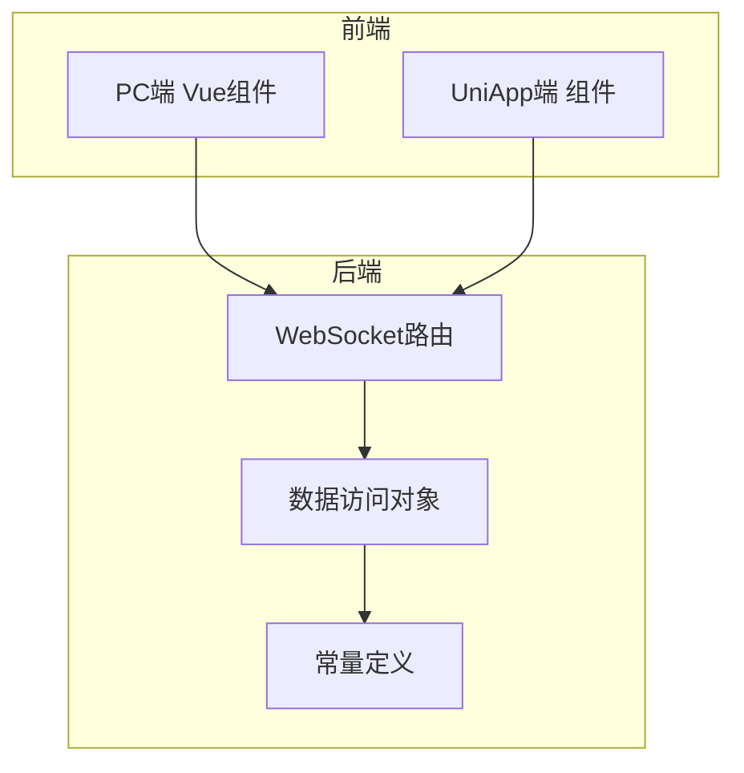
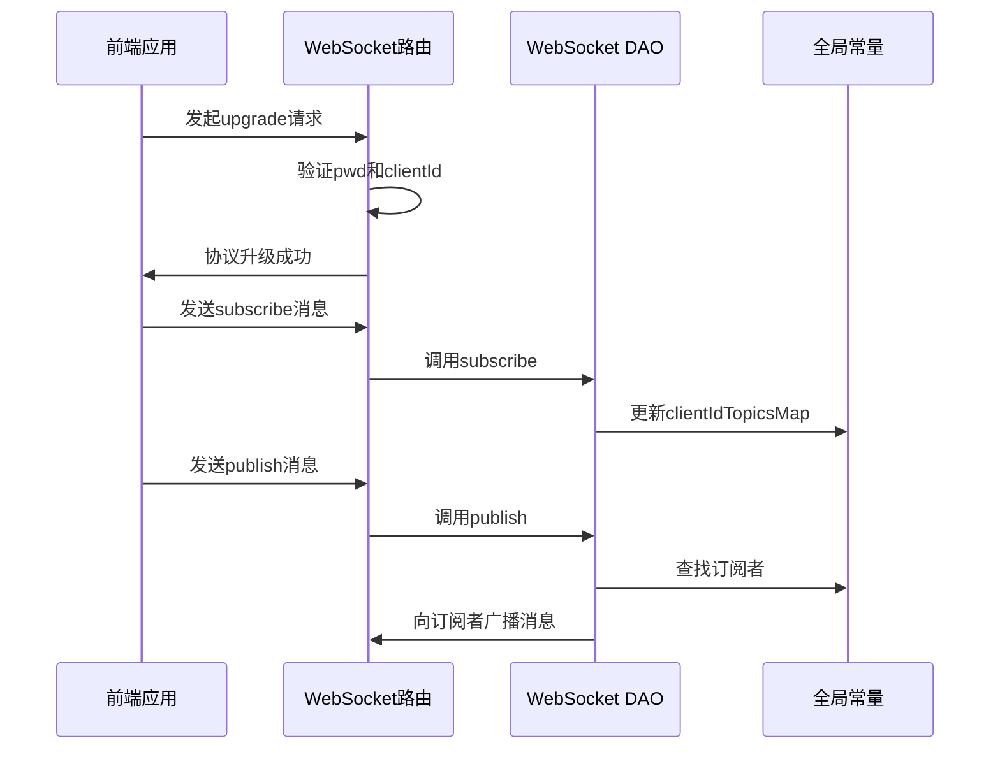
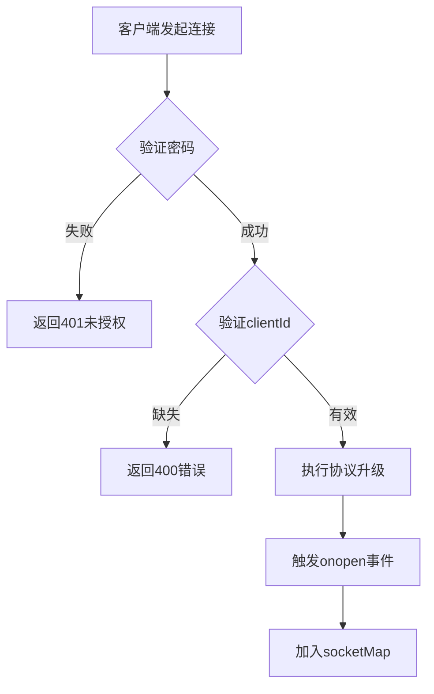
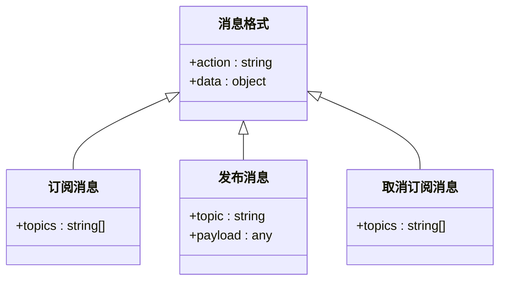
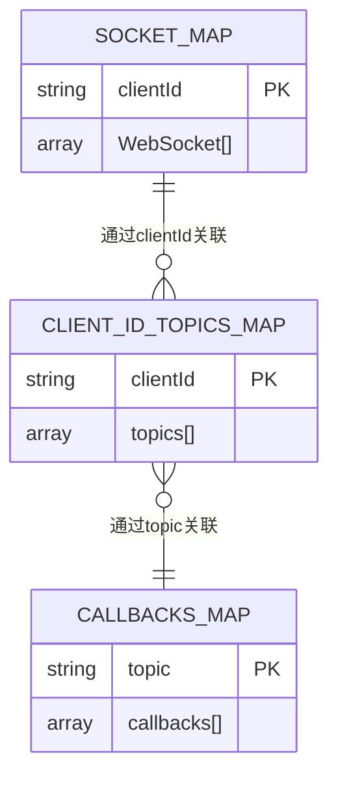
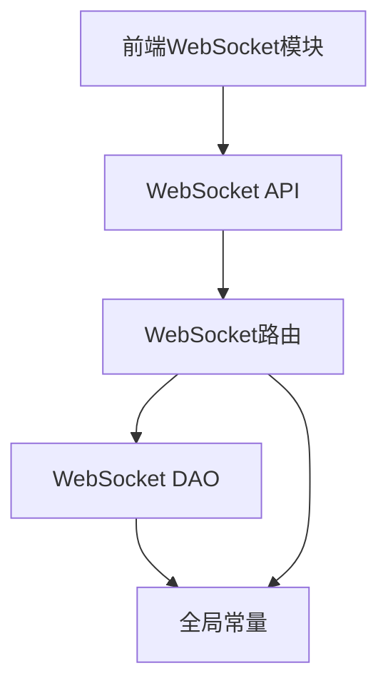

# 实时通信

**本文档引用文件**  
- [websocket.router.ts](https://github.com/sail-sail/nest/blob/main/deno/lib/websocket/websocket.router.ts)
- [websocket.dao.ts](https://github.com/sail-sail/nest/blob/main/deno/lib/websocket/websocket.dao.ts)
- [websocket.constants.ts](https://github.com/sail-sail/nest/blob/main/deno/lib/websocket/websocket.constants.ts)
- [websocket.ts](https://github.com/sail-sail/nest/blob/main/pc/src/compositions/websocket.ts)
- [websocket.ts](https://github.com/sail-sail/nest/blob/main/uni/src/compositions/websocket.ts)

## 目录
1. [简介](#简介)
2. [项目结构](#项目结构)
3. [核心组件](#核心组件)
4. [架构概述](#架构概述)
5. [详细组件分析](#详细组件分析)
6. [依赖分析](#依赖分析)
7. [性能考虑](#性能考虑)
8. [故障排除指南](#故障排除指南)
9. [结论](#结论)

## 简介
本文档详细介绍了基于WebSocket的实时通信功能，重点涵盖服务端架构设计、连接管理机制、消息格式规范以及前后端集成方案。系统采用发布/订阅模式，支持实时通知、在线状态更新和协作编辑等应用场景。文档深入分析了认证机制、心跳检测、异常处理和连接复用等关键技术实现。

## 项目结构
实时通信功能主要分布在`deno/lib/websocket`后端模块和`pc/src/compositions`、`uni/src/compositions`前端模块中。后端使用Deno和Oak框架实现WebSocket服务，前端通过Vue组合式API封装WebSocket连接。

**图示来源**  
- [websocket.router.ts](https://github.com/sail-sail/nest/blob/main/deno/lib/websocket/websocket.router.ts)
- [websocket.dao.ts](https://github.com/sail-sail/nest/blob/main/deno/lib/websocket/websocket.dao.ts)
- [websocket.constants.ts](https://github.com/sail-sail/nest/blob/main/deno/lib/websocket/websocket.constants.ts)

**本节来源**  
- [websocket.router.ts](https://github.com/sail-sail/nest/blob/main/deno/lib/websocket/websocket.router.ts)
- [websocket.ts](https://github.com/sail-sail/nest/blob/main/pc/src/compositions/websocket.ts)

## 核心组件
系统核心组件包括WebSocket路由处理器、连接管理DAO、全局状态常量和前端封装模块。服务端通过`socketMap`维护客户端连接，`clientIdTopicsMap`跟踪订阅关系，`callbacksMap`管理本地回调函数。

**本节来源**  
- [websocket.dao.ts](https://github.com/sail-sail/nest/blob/main/deno/lib/websocket/websocket.dao.ts)
- [websocket.constants.ts](https://github.com/sail-sail/nest/blob/main/deno/lib/websocket/websocket.constants.ts)

## 架构概述
系统采用分层架构，前端通过安全认证建立WebSocket连接，后端路由处理器负责协议升级和消息分发，DAO层处理订阅/发布逻辑，常量模块维护全局状态。

**图示来源**  
- [websocket.router.ts](https://github.com/sail-sail/nest/blob/main/deno/lib/websocket/websocket.router.ts)
- [websocket.dao.ts](https://github.com/sail-sail/nest/blob/main/deno/lib/websocket/websocket.dao.ts)

## 详细组件分析

### WebSocket连接建立与认证
服务端通过`/api/websocket/upgrade`端点处理连接升级，要求客户端提供密码和客户端ID进行认证。

**图示来源**  
- [websocket.router.ts](https://github.com/sail-sail/nest/blob/main/deno/lib/websocket/websocket.router.ts#L38-L89)

**本节来源**  
- [websocket.router.ts](https://github.com/sail-sail/nest/blob/main/deno/lib/websocket/websocket.router.ts#L38-L89)

### 消息处理与分发
系统支持三种操作：订阅、发布和取消订阅。消息格式为JSON，包含action和data字段。

**图示来源**  
- [websocket.router.ts](https://github.com/sail-sail/nest/blob/main/deno/lib/websocket/websocket.router.ts#L100-L150)

**本节来源**  
- [websocket.router.ts](https://github.com/sail-sail/nest/blob/main/deno/lib/websocket/websocket.router.ts#L100-L150)

### 连接管理与异常处理
系统维护三个核心映射表来管理连接状态和订阅关系。

**图示来源**  
- [websocket.constants.ts](https://github.com/sail-sail/nest/blob/main/deno/lib/websocket/websocket.constants.ts)
- [websocket.dao.ts](https://github.com/sail-sail/nest/blob/main/deno/lib/websocket/websocket.dao.ts)

**本节来源**  
- [websocket.constants.ts](https://github.com/sail-sail/nest/blob/main/deno/lib/websocket/websocket.constants.ts)
- [websocket.dao.ts](https://github.com/sail-sail/nest/blob/main/deno/lib/websocket/websocket.dao.ts)

## 依赖分析
系统依赖关系清晰，前端模块依赖后端API，DAO层依赖常量定义，路由层协调各组件工作。

**图示来源**  
- [websocket.router.ts](https://github.com/sail-sail/nest/blob/main/deno/lib/websocket/websocket.router.ts)
- [websocket.dao.ts](https://github.com/sail-sail/nest/blob/main/deno/lib/websocket/websocket.dao.ts)
- [websocket.ts](https://github.com/sail-sail/nest/blob/main/pc/src/compositions/websocket.ts)

**本节来源**  
- [websocket.router.ts](https://github.com/sail-sail/nest/blob/main/deno/lib/websocket/websocket.router.ts)
- [websocket.dao.ts](https://github.com/sail-sail/nest/blob/main/deno/lib/websocket/websocket.dao.ts)

## 性能考虑
- **心跳机制**：前端每60秒发送ping消息保持连接活跃
- **连接复用**：通过clientId识别客户端，支持连接重用
- **批量操作**：支持同时订阅/取消订阅多个主题
- **内存管理**：自动清理无效连接和空订阅
- **延迟重连**：指数退避算法实现智能重连

## 故障排除指南
常见问题及解决方案：

1. **连接被拒绝**：检查pwd参数是否正确（固定值`0YSCBr1QQSOpOfi6GgH34A`）
2. **订阅无效**：确保clientId已正确传递且连接已建立
3. **消息丢失**：检查网络状况和心跳机制是否正常工作
4. **内存泄漏**：确认在组件销毁时调用unSubscribe清理订阅
5. **重复消息**：避免在订阅回调中重复添加相同的回调函数

**本节来源**  
- [websocket.router.ts](https://github.com/sail-sail/nest/blob/main/deno/lib/websocket/websocket.router.ts)
- [websocket.ts](https://github.com/sail-sail/nest/blob/main/pc/src/compositions/websocket.ts)

## 结论
本WebSocket系统实现了完整的实时通信功能，具有良好的架构设计和错误处理机制。通过发布/订阅模式，系统能够高效地处理实时消息分发。前端封装提供了响应式API，简化了在Vue组件中的使用。建议在生产环境中增加连接数限制和DDoS防护措施以增强安全性。