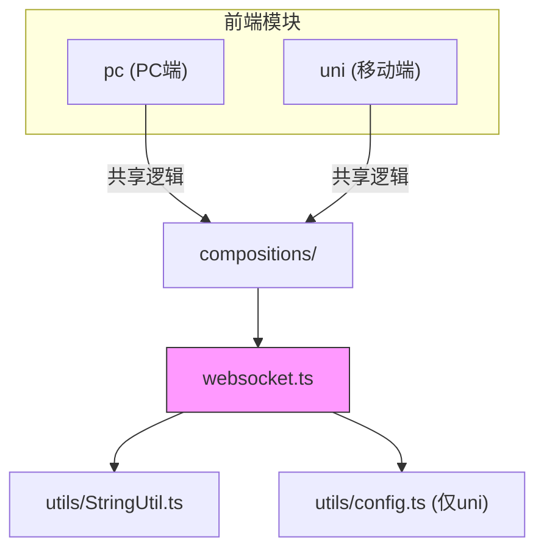
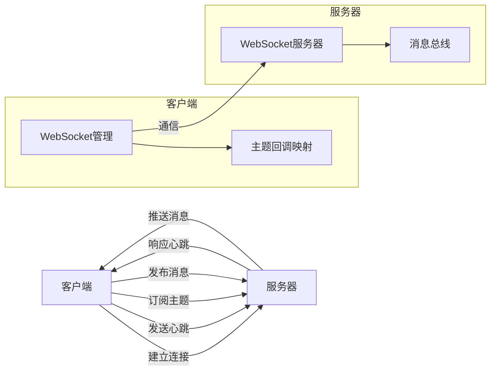
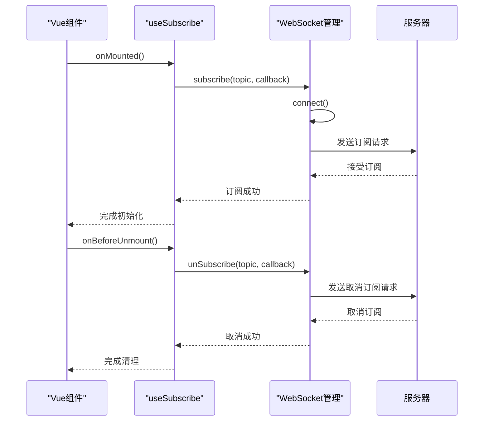
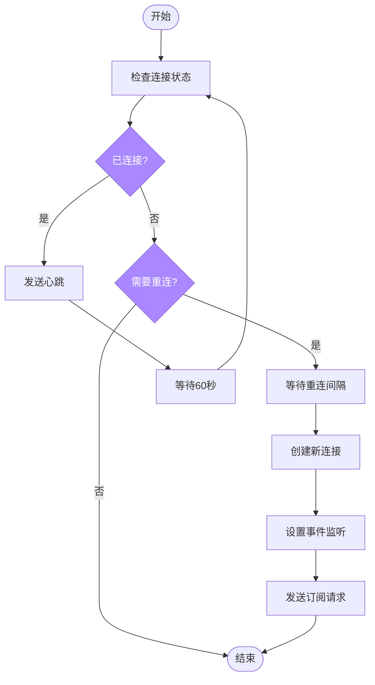
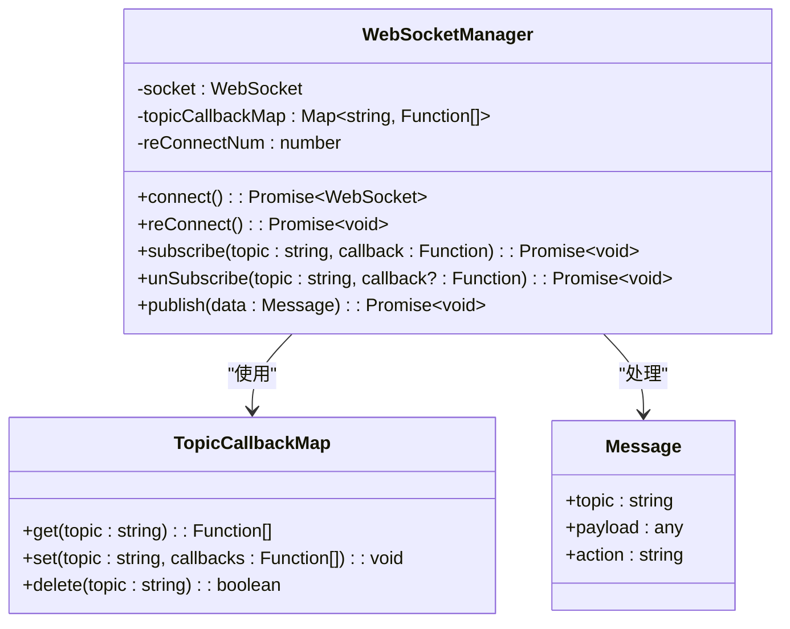
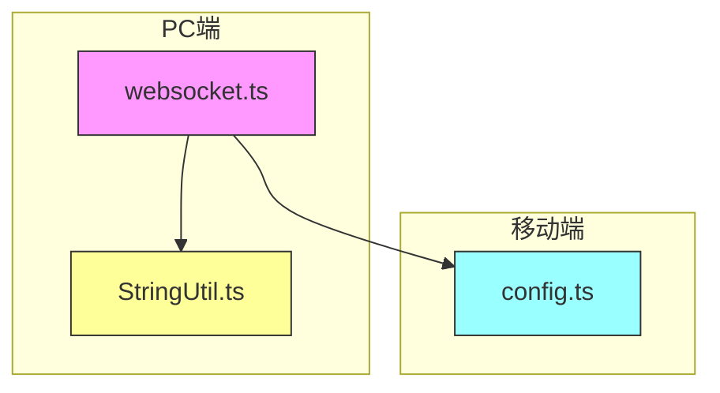

# 应用场景实现

**本文档引用的文件**  
- [websocket.ts](https://github.com/sail-sail/nest/blob/main/pc/src/compositions/websocket.ts)
- [websocket.ts](https://github.com/sail-sail/nest/blob/main/uni/src/compositions/websocket.ts)

## 目录
1. [简介](#简介)
2. [项目结构](#项目结构)
3. [核心组件](#核心组件)
4. [架构概览](#架构概览)
5. [详细组件分析](#详细组件分析)
6. [依赖分析](#依赖分析)
7. [性能考虑](#性能考虑)
8. [故障排查指南](#故障排查指南)
9. [结论](#结论)

## 简介
本文档详细介绍了WebSocket在实际业务场景中的应用实现，重点涵盖实时通知系统、在线用户状态更新和协作编辑功能。通过分析前端`pc/src/compositions/websocket.ts`中的响应式数据集成机制，以及`pc/src/utils/websocket.ts`中的业务逻辑处理方式，展示如何在复杂应用中高效使用WebSocket。文档还提供了具体业务场景的代码示例，包括消息通知的前端展示、用户在线状态的UI更新和实时数据同步的冲突解决策略，并给出性能优化建议和常见问题解决方案。

## 项目结构
项目采用分层架构设计，主要分为PC端和移动端（uni）两个前端模块，共享WebSocket核心逻辑。WebSocket相关代码位于`compositions`目录下，遵循组合式API设计模式，便于在不同组件中复用。

**图示来源**  
- [websocket.ts](https://github.com/sail-sail/nest/blob/main/pc/src/compositions/websocket.ts)
- [websocket.ts](https://github.com/sail-sail/nest/blob/main/uni/src/compositions/websocket.ts)

**本节来源**  
- [websocket.ts](https://github.com/sail-sail/nest/blob/main/pc/src/compositions/websocket.ts)
- [websocket.ts](https://github.com/sail-sail/nest/blob/main/uni/src/compositions/websocket.ts)

## 核心组件
WebSocket核心功能由`useSubscribe`、`subscribe`、`unSubscribe`和`publish`四个主要函数构成，实现了主题订阅/发布模式。组件通过`topicCallbackMap`维护主题与回调函数的映射关系，支持多个回调函数订阅同一主题。

**本节来源**  
- [websocket.ts](https://github.com/sail-sail/nest/blob/main/pc/src/compositions/websocket.ts#L100-L200)
- [websocket.ts](https://github.com/sail-sail/nest/blob/main/uni/src/compositions/websocket.ts#L80-L180)

## 架构概览
系统采用客户端-服务器架构，通过WebSocket实现全双工通信。客户端在建立连接后，可以订阅特定主题，服务器在有新消息时主动推送。架构支持自动重连、心跳检测和连接管理，确保通信的可靠性。

**图示来源**  
- [websocket.ts](https://github.com/sail-sail/nest/blob/main/pc/src/compositions/websocket.ts)
- [websocket.ts](https://github.com/sail-sail/nest/blob/main/uni/src/compositions/websocket.ts)

## 详细组件分析

### 响应式订阅机制分析
`useSubscribe`函数实现了Vue组合式API的响应式订阅，自动处理组件生命周期中的订阅和取消订阅。

**图示来源**  
- [websocket.ts](https://github.com/sail-sail/nest/blob/main/pc/src/compositions/websocket.ts#L100-L120)

**本节来源**  
- [websocket.ts](https://github.com/sail-sail/nest/blob/main/pc/src/compositions/websocket.ts#L100-L130)

### 连接管理机制分析
连接管理组件负责WebSocket的连接、重连和心跳检测，确保通信的稳定性。

**图示来源**  
- [websocket.ts](https://github.com/sail-sail/nest/blob/main/pc/src/compositions/websocket.ts#L20-L80)
- [websocket.ts](https://github.com/sail-sail/nest/blob/main/uni/src/compositions/websocket.ts#L20-L70)

**本节来源**  
- [websocket.ts](https://github.com/sail-sail/nest/blob/main/pc/src/compositions/websocket.ts#L20-L90)
- [websocket.ts](https://github.com/sail-sail/nest/blob/main/uni/src/compositions/websocket.ts#L20-L75)

### 主题订阅机制分析
主题订阅机制采用发布-订阅模式，支持一对多的消息分发。

**图示来源**  
- [websocket.ts](https://github.com/sail-sail/nest/blob/main/pc/src/compositions/websocket.ts#L90-L250)
- [websocket.ts](https://github.com/sail-sail/nest/blob/main/uni/src/compositions/websocket.ts#L75-L200)

**本节来源**  
- [websocket.ts](https://github.com/sail-sail/nest/blob/main/pc/src/compositions/websocket.ts#L90-L250)
- [websocket.ts](https://github.com/sail-sail/nest/blob/main/uni/src/compositions/websocket.ts#L75-L200)

## 依赖分析
WebSocket组件依赖于项目中的工具函数和配置模块，形成清晰的依赖关系。

**图示来源**  
- [websocket.ts](https://github.com/sail-sail/nest/blob/main/pc/src/compositions/websocket.ts#L1)
- [websocket.ts](https://github.com/sail-sail/nest/blob/main/uni/src/compositions/websocket.ts#L1-L3)

**本节来源**  
- [websocket.ts](https://github.com/sail-sail/nest/blob/main/pc/src/compositions/websocket.ts)
- [websocket.ts](https://github.com/sail-sail/nest/blob/main/uni/src/compositions/websocket.ts)

## 性能考虑
WebSocket实现中包含多项性能优化措施：

1. **连接复用**：通过单例模式维护WebSocket连接，避免重复创建
2. **延迟关闭**：使用`closeSocketTimeout`延迟关闭连接，减少频繁重连
3. **批量操作**：支持批量取消订阅多个主题，减少网络请求
4. **心跳机制**：每60秒发送心跳，保持连接活跃
5. **指数退避**：重连间隔采用指数增长策略，避免服务器过载

这些优化确保了在高并发场景下的稳定性和性能表现。

## 故障排查指南
### 常见问题及解决方案

**问题1：WebSocket连接失败**
- **可能原因**：网络问题、服务器地址错误、SSL配置问题
- **解决方案**：检查`location.host`是否正确，确认HTTPS环境下使用WSS协议

**问题2：消息接收延迟**
- **可能原因**：网络延迟、服务器处理慢、客户端回调函数阻塞
- **解决方案**：优化回调函数性能，确保异步处理，检查网络状况

**问题3：频繁重连**
- **可能原因**：网络不稳定、服务器主动断开、心跳超时
- **解决方案**：检查网络连接，确认服务器配置，调整心跳间隔

**问题4：内存泄漏**
- **可能原因**：未正确取消订阅，回调函数未清理
- **解决方案**：确保在组件销毁时调用`unSubscribe`，使用`useSubscribe`自动管理生命周期

**本节来源**  
- [websocket.ts](https://github.com/sail-sail/nest/blob/main/pc/src/compositions/websocket.ts#L50-L90)
- [websocket.ts](https://github.com/sail-sail/nest/blob/main/uni/src/compositions/websocket.ts#L50-L70)

## 结论
本文档详细分析了WebSocket在项目中的实际应用场景和实现方法。通过响应式订阅机制、智能连接管理和高效主题分发，系统实现了可靠的实时通信功能。PC端和移动端共享核心逻辑，确保了功能的一致性和维护的便捷性。建议在实际使用中遵循最佳实践，合理管理订阅生命周期，充分利用提供的性能优化特性，以构建稳定高效的实时应用。