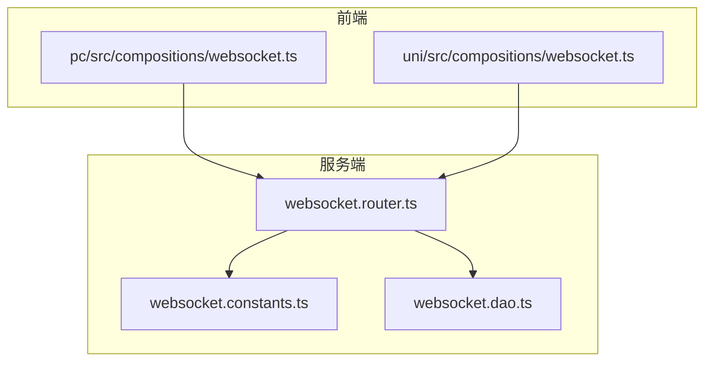
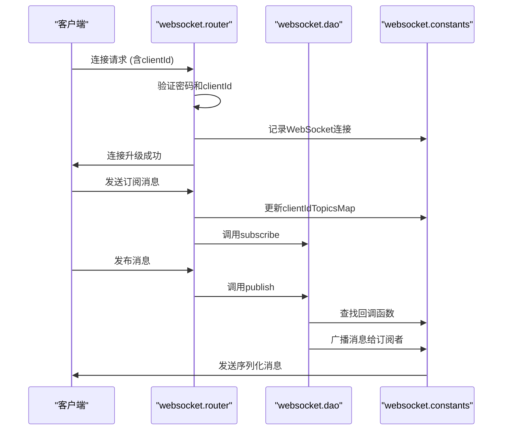
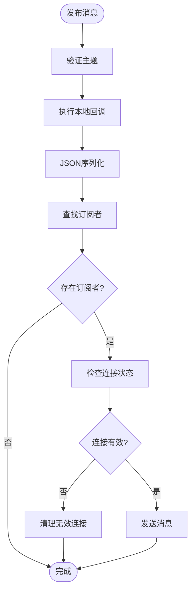
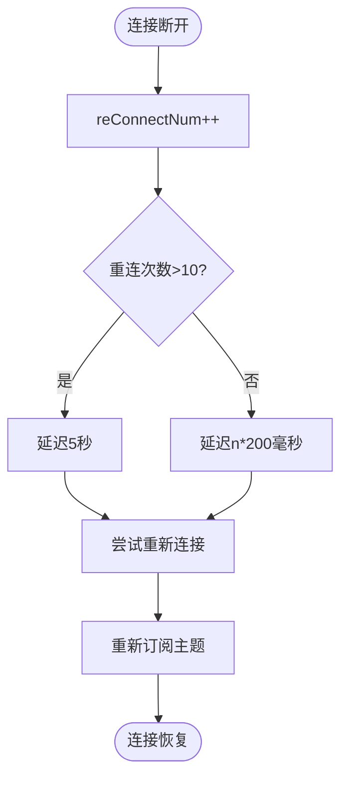
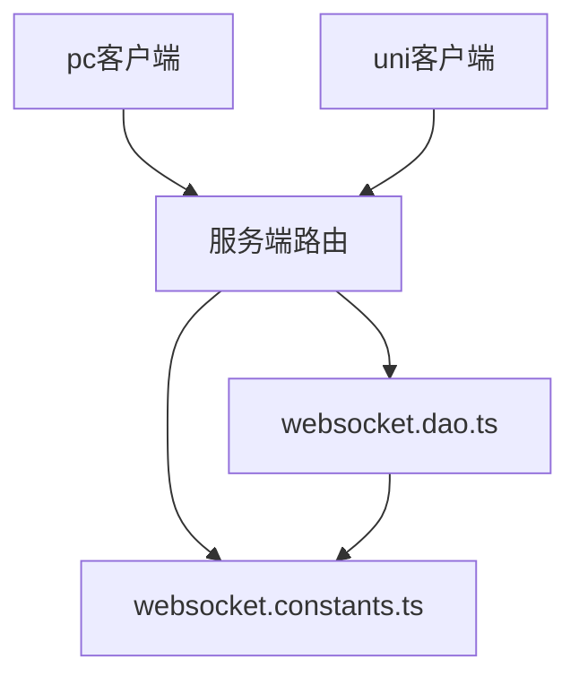

# 序列化规范


**本文档引用文件**  
- [websocket.constants.ts](https://github.com/sail-sail/nest/blob/main/deno\lib\websocket\websocket.constants.ts)
- [websocket.dao.ts](https://github.com/sail-sail/nest/blob/main/deno\lib\websocket\websocket.dao.ts)
- [websocket.router.ts](https://github.com/sail-sail/nest/blob/main/deno\lib\websocket\websocket.router.ts)
- [websocket.ts](https://github.com/sail-sail/nest/blob/main/pc\src\compositions\websocket.ts)
- [websocket.ts](https://github.com/sail-sail/nest/blob/main/uni\src\compositions\websocket.ts)


## 目录
1. [引言](#引言)
2. [项目结构](#项目结构)
3. [核心组件](#核心组件)
4. [架构概览](#架构概览)
5. [详细组件分析](#详细组件分析)
6. [依赖分析](#依赖分析)
7. [性能考量](#性能考量)
8. [故障排查指南](#故障排查指南)
9. [结论](#结论)

## 引言
本文档详细描述了WebSocket数据序列化的实现机制，重点分析了JSON序列化在消息传递中的应用。文档涵盖序列化类型常量定义、序列化/反序列化处理逻辑、不同类型数据的编码规则，以及性能和兼容性考量。系统采用基于主题（topic）的发布/订阅模式，通过WebSocket实现实时通信，所有消息均使用JSON格式进行编码。

## 项目结构
WebSocket功能主要分布在`deno/lib/websocket/`目录下，包含常量定义、数据访问对象（DAO）和路由处理。前端项目（pc和uni）通过compositions模块集成WebSocket客户端功能。系统采用分层架构，服务端处理连接管理、消息路由，客户端负责连接维护和消息处理。



**图示来源**  
- [websocket.constants.ts](https://github.com/sail-sail/nest/blob/main/deno\lib\websocket\websocket.constants.ts)
- [websocket.dao.ts](https://github.com/sail-sail/nest/blob/main/deno\lib\websocket\websocket.dao.ts)
- [websocket.router.ts](https://github.com/sail-sail/nest/blob/main/deno\lib\websocket\websocket.router.ts)
- [websocket.ts](https://github.com/sail-sail/nest/blob/main/pc\src\compositions\websocket.ts)
- [websocket.ts](https://github.com/sail-sail/nest/blob/main/uni\src\compositions\websocket.ts)

**本节来源**  
- [websocket.constants.ts](https://github.com/sail-sail/nest/blob/main/deno\lib\websocket\websocket.constants.ts)
- [websocket.dao.ts](https://github.com/sail-sail/nest/blob/main/deno\lib\websocket\websocket.dao.ts)
- [websocket.router.ts](https://github.com/sail-sail/nest/blob/main/deno\lib\websocket\websocket.router.ts)

## 核心组件
系统核心组件包括三个主要模块：`websocket.constants.ts`定义全局状态映射，`websocket.dao.ts`实现消息发布/订阅逻辑，`websocket.router.ts`处理WebSocket连接升级和消息路由。这些组件共同构成了实时消息系统的基础设施。

**本节来源**  
- [websocket.constants.ts](https://github.com/sail-sail/nest/blob/main/deno\lib\websocket\websocket.constants.ts#L1-L7)
- [websocket.dao.ts](https://github.com/sail-sail/nest/blob/main/deno\lib\websocket\websocket.dao.ts#L1-L104)
- [websocket.router.ts](https://github.com/sail-sail/nest/blob/main/deno\lib\websocket\websocket.router.ts#L1-L200)

## 架构概览
系统采用发布/订阅模式的事件驱动架构。客户端通过认证后建立WebSocket连接，服务端维护客户端连接和主题订阅关系。消息发布时，系统同时通知本地回调函数并广播给订阅该主题的客户端。所有消息通过JSON序列化进行编码，确保跨平台兼容性。



**图示来源**  
- [websocket.constants.ts](https://github.com/sail-sail/nest/blob/main/deno\lib\websocket\websocket.constants.ts#L1-L7)
- [websocket.dao.ts](https://github.com/sail-sail/nest/blob/main/deno\lib\websocket\websocket.dao.ts#L15-L65)
- [websocket.router.ts](https://github.com/sail-sail/nest/blob/main/deno\lib\websocket\websocket.router.ts#L38-L199)

## 详细组件分析

### 常量定义分析
`websocket.constants.ts`文件定义了三个全局Map对象，用于维护运行时状态：

```mermaid
classDiagram
class callbacksMap {
+Map<string, ((data : any) => Promise<void> | void)[]>
+key : topic
+value : 回调函数数组
}
class socketMap {
+Map<string, WebSocket[]>
+key : clientId
+value : WebSocket连接数组
}
class clientIdTopicsMap {
+Map<string, string[]>
+key : clientId
+value : 主题字符串数组
}
```

**图示来源**  
- [websocket.constants.ts](https://github.com/sail-sail/nest/blob/main/deno\lib\websocket\websocket.constants.ts#L1-L7)

**本节来源**  
- [websocket.constants.ts](https://github.com/sail-sail/nest/blob/main/deno\lib\websocket\websocket.constants.ts#L1-L7)

### 数据访问对象分析
`websocket.dao.ts`实现了核心的发布/订阅逻辑，包括消息序列化和广播机制。

#### 订阅功能
```typescript
export function subscribe<T>(
  topic: string,
  callback: (data: T) => void,
) {
  let callbacks = callbacksMap.get(topic);
  if (!callbacks) {
    callbacks = [];
    callbacksMap.set(topic, callbacks);
  }
  if (!callbacks.includes(callback)) {
    callbacks.push(callback);
  }
}
```
此函数将回调函数注册到指定主题，确保同一回调不会重复订阅。

#### 发布功能
```typescript
export async function publish<T>(
  data: {
    topic: string;
    payload: T;
  },
) {
  const topic = data.topic;
  const callbacks = callbacksMap.get(topic);
  if (callbacks && callbacks.length > 0) {
    for (const callback of callbacks) {
      await callback(data.payload);
    }
  }
  const dataStr = JSON.stringify(data);
  for (const [ clientId, topics ] of clientIdTopicsMap) {
    if (!topics.includes(topic)) {
      continue;
    }
    const sockets = socketMap.get(clientId);
    if (!sockets || sockets.length === 0) {
      continue;
    }
    for (const socket of sockets) {
      if (socket.readyState !== WebSocket.OPEN) {
        // 清理无效连接
        socketMap.set(clientId, sockets.filter((item) => item !== socket));
        clientIdTopicsMap.delete(clientId);
        try {
          socket.close();
        } catch (_err) {
          error(_err);
        }
        continue;
      }
      socket.send(dataStr);
    }
  }
}
```
发布功能包含两个关键步骤：首先在服务端执行本地回调函数，然后将消息JSON序列化后广播给所有订阅该主题的客户端。



**图示来源**  
- [websocket.dao.ts](https://github.com/sail-sail/nest/blob/main/deno\lib\websocket\websocket.dao.ts#L45-L103)

**本节来源**  
- [websocket.dao.ts](https://github.com/sail-sail/nest/blob/main/deno\lib\websocket\websocket.dao.ts#L15-L103)

### 路由处理分析
`websocket.router.ts`处理WebSocket连接升级和消息路由，包含完整的认证和错误处理机制。

#### 连接升级流程
```mermaid
sequenceDiagram
participant Client as "客户端"
participant Router as "websocket.router"
participant Context as "上下文"
Client->>Router : GET /api/websocket/upgrade
Router->>Router : 验证pwd参数
alt 认证失败
Router-->>Client : 401 Unauthorized
stop
end
Router->>Router : 验证clientId
alt clientId缺失
Router-->>Client : 400 Bad Request
stop
end
Router->>Context : 升级为WebSocket
Context-->>Router : WebSocket实例
Router->>Router : 设置事件处理器
Router-->>Client : 连接建立
```

**图示来源**  
- [websocket.router.ts](https://github.com/sail-sail/nest/blob/main/deno\lib\websocket\websocket.router.ts#L38-L85)

**本节来源**  
- [websocket.router.ts](https://github.com/sail-sail/nest/blob/main/deno\lib\websocket\websocket.router.ts#L38-L199)

### 客户端实现分析
前端通过`compositions/websocket.ts`实现WebSocket客户端功能，包含自动重连和心跳机制。

#### 消息处理流程
```typescript
socket.onmessage = function(event) {
  const eventData = event.data;
  if (eventData === "pong") {
    return;
  }
  if (typeof eventData !== "string") {
    return;
  }
  const obj = JSON.parse(eventData as string);
  const topic = obj.topic;
  const payload = obj.payload;
  const callbacks = topicCallbackMap.get(topic);
  if (callbacks && callbacks.length > 0) {
    for (const callback of callbacks) {
      callback(payload);
    }
  }
};
```
客户端接收到消息后，首先进行类型检查和反序列化，然后根据主题分发给相应的回调函数。

#### 自动重连机制


**图示来源**  
- [websocket.ts](https://github.com/sail-sail/nest/blob/main/pc\src\compositions\websocket.ts#L25-L72)

**本节来源**  
- [websocket.ts](https://github.com/sail-sail/nest/blob/main/pc\src\compositions\websocket.ts#L1-L115)
- [websocket.ts](https://github.com/sail-sail/nest/blob/main/uni\src\compositions\websocket.ts#L1-L50)

## 依赖分析
系统依赖关系清晰，服务端组件之间存在明确的调用链：路由层调用DAO层，DAO层依赖常量定义。前端通过标准WebSocket API与服务端通信，不依赖特定库。



**图示来源**  
- [websocket.constants.ts](https://github.com/sail-sail/nest/blob/main/deno\lib\websocket\websocket.constants.ts)
- [websocket.dao.ts](https://github.com/sail-sail/nest/blob/main/deno\lib\websocket\websocket.dao.ts)
- [websocket.router.ts](https://github.com/sail-sail/nest/blob/main/deno\lib\websocket\websocket.router.ts)

**本节来源**  
- [websocket.constants.ts](https://github.com/sail-sail/nest/blob/main/deno\lib\websocket\websocket.constants.ts)
- [websocket.dao.ts](https://github.com/sail-sail/nest/blob/main/deno\lib\websocket\websocket.dao.ts)
- [websocket.router.ts](https://github.com/sail-sail/nest/blob/main/deno\lib\websocket\websocket.router.ts)

## 性能考量
系统采用JSON作为序列化格式，具有以下特点：

### 序列化格式对比
| 特性 | JSON | 二进制 | Protobuf |
|------|------|--------|----------|
| 可读性 | 高 | 低 | 低 |
| 序列化速度 | 中等 | 高 | 高 |
| 反序列化速度 | 中等 | 高 | 高 |
| 带宽占用 | 较高 | 低 | 低 |
| 兼容性 | 极高 | 低 | 中等 |
| 实现复杂度 | 低 | 高 | 中等 |

### 当前实现优缺点
**优点：**
- **高兼容性**：JSON是Web标准，所有现代浏览器和服务器都原生支持
- **可读性强**：便于调试和问题排查
- **实现简单**：无需额外依赖，`JSON.stringify()`和`JSON.parse()`直接可用
- **类型安全**：通过TypeScript泛型提供编译时类型检查

**缺点：**
- **带宽效率低**：相比二进制格式，JSON文本编码占用更多带宽
- **解析开销**：字符串解析比二进制解析更耗时
- **无模式验证**：运行时缺乏数据结构验证机制

### 优化建议
1. **小消息优化**：对于频繁发送的小消息，考虑使用二进制格式
2. **压缩机制**：对大消息启用WebSocket压缩扩展
3. **批处理**：合并多个小消息为单个批次发送
4. **模式缓存**：对于重复结构的消息，预编译解析器

**本节来源**  
- [websocket.dao.ts](https://github.com/sail-sail/nest/blob/main/deno\lib\websocket\websocket.dao.ts#L60-L62)
- [websocket.router.ts](https://github.com/sail-sail/nest/blob/main/deno\lib\websocket\websocket.router.ts#L115-L117)

## 故障排查指南
### 常见问题及解决方案
1. **连接失败**
   - 检查`pwd`参数是否正确
   - 确认`clientId`是否提供
   - 验证HTTPS/WSS配置是否匹配

2. **消息丢失**
   - 检查客户端是否正确订阅主题
   - 确认消息格式是否符合`{topic: string, payload: any}`结构
   - 验证网络连接稳定性

3. **重复消息**
   - 检查是否多次调用`subscribe`
   - 确认客户端重连时是否重复订阅

4. **内存泄漏**
   - 确保调用`unSubscribe`清理订阅
   - 验证断开连接后是否从`socketMap`中移除

### 监控指标
- 连接数：`socketMap.size`
- 订阅主题数：`callbacksMap.size`
- 客户端数：`clientIdTopicsMap.size`
- 消息吞吐量：每秒处理的消息数量

**本节来源**  
- [websocket.dao.ts](https://github.com/sail-sail/nest/blob/main/deno\lib\websocket\websocket.dao.ts#L70-L85)
- [websocket.router.ts](https://github.com/sail-sail/nest/blob/main/deno\lib\websocket\websocket.router.ts#L140-L150)

## 结论
当前WebSocket序列化方案采用JSON格式，平衡了兼容性、可维护性和性能需求。系统架构清晰，组件职责分明，通过发布/订阅模式实现了灵活的消息通信。虽然JSON格式在带宽效率上不如二进制格式，但其高兼容性和易调试性使其成为Web环境下的理想选择。未来可根据性能需求考虑引入二进制序列化作为可选方案，实现性能与兼容性的最佳平衡。