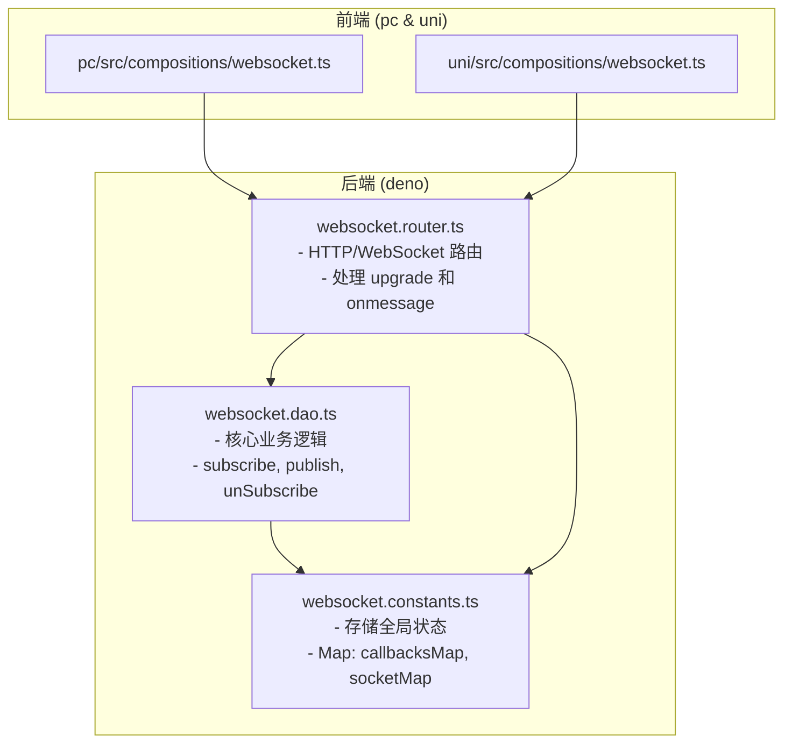
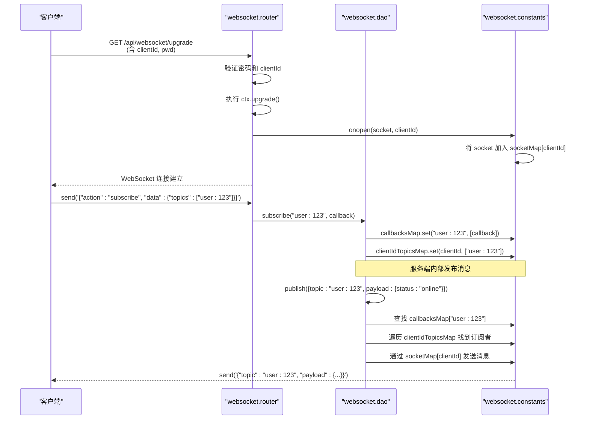
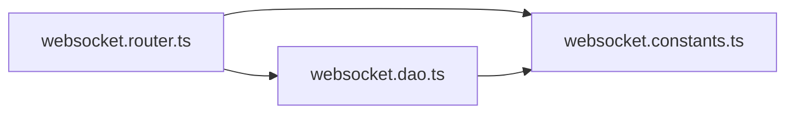

# 消息协议规范


**本文档引用文件**  
- [websocket.constants.ts](https://github.com/sail-sail/nest/blob/main/deno\lib\websocket\websocket.constants.ts)
- [websocket.dao.ts](https://github.com/sail-sail/nest/blob/main/deno\lib\websocket\websocket.dao.ts)
- [websocket.router.ts](https://github.com/sail-sail/nest/blob/main/deno\lib\websocket\websocket.router.ts)
- [websocket.ts](https://github.com/sail-sail/nest/blob/main/pc\src\compositions\websocket.ts)
- [websocket.ts](https://github.com/sail-sail/nest/blob/main/uni\src\compositions\websocket.ts)


## 目录
1. [引言](#引言)
2. [项目结构](#项目结构)
3. [核心组件](#核心组件)
4. [架构概览](#架构概览)
5. [详细组件分析](#详细组件分析)
6. [依赖关系分析](#依赖关系分析)
7. [性能考量](#性能考量)
8. [故障排查指南](#故障排查指南)
9. [结论](#结论)

## 引言
本文档旨在全面阐述基于 WebSocket 的实时消息通信协议，涵盖消息格式、通信模式、数据序列化、订阅/发布机制及错误处理策略。文档重点分析 `websocket.constants.ts`、`websocket.dao.ts` 和 `websocket.router.ts` 三个核心文件，揭示服务端如何管理客户端连接、处理消息路由以及实现高效的事件广播。目标是为开发者提供一份清晰、详尽的技术参考，以支持实时通知、在线状态同步和协作编辑等应用场景的开发。

## 项目结构
WebSocket 功能模块位于 `deno/lib/websocket/` 目录下，采用典型的分层设计，将常量定义、数据访问逻辑和路由处理分离。`pc` 和 `uni` 两个前端项目通过 `compositions/websocket.ts` 文件与后端建立连接，体现了前后端分离的架构思想。



**图示来源**
- [websocket.constants.ts](https://github.com/sail-sail/nest/blob/main/deno\lib\websocket\websocket.constants.ts)
- [websocket.dao.ts](https://github.com/sail-sail/nest/blob/main/deno\lib\websocket\websocket.dao.ts)
- [websocket.router.ts](https://github.com/sail-sail/nest/blob/main/deno\lib\websocket\websocket.router.ts)
- [websocket.ts](https://github.com/sail-sail/nest/blob/main/pc\src\compositions\websocket.ts)
- [websocket.ts](https://github.com/sail-sail/nest/blob/main/uni\src\compositions\websocket.ts)

## 核心组件
本系统的核心组件围绕 WebSocket 连接的生命周期管理和消息的发布/订阅模式构建。`callbacksMap` 用于注册消息回调，`socketMap` 维护客户端连接，`clientIdTopicsMap` 记录客户端订阅的主题，三者共同构成了消息路由的基础。

**组件来源**
- [websocket.constants.ts](https://github.com/sail-sail/nest/blob/main/deno\lib\websocket\websocket.constants.ts#L1-L6)
- [websocket.dao.ts](https://github.com/sail-sail/nest/blob/main/deno\lib\websocket\websocket.dao.ts#L1-L103)

## 架构概览
系统采用发布/订阅（Pub/Sub）模式，客户端通过 WebSocket 连接至服务端，并发送 `subscribe` 消息来订阅特定主题（topic）。服务端将客户端 ID 与主题的映射关系存储在 `clientIdTopicsMap` 中。当有消息通过 `publish` 接口发布到某个主题时，服务端会查找所有订阅了该主题的客户端，并通过其 WebSocket 连接将消息广播出去。



**图示来源**
- [websocket.constants.ts](https://github.com/sail-sail/nest/blob/main/deno\lib\websocket\websocket.constants.ts)
- [websocket.dao.ts](https://github.com/sail-sail/nest/blob/main/deno\lib\websocket\websocket.dao.ts)
- [websocket.router.ts](https://github.com/sail-sail/nest/blob/main/deno\lib\websocket\websocket.router.ts)

## 详细组件分析

### 核心常量与状态管理
`websocket.constants.ts` 文件定义了三个全局 `Map`，用于在 Deno 运行时中持久化存储 WebSocket 相关的状态。

```mermaid
classDiagram
class callbacksMap {
+Map<string, ((data : any) => Promise<void> | void)[]>
+key : topic (string)
+value : 回调函数数组
}
class socketMap {
+Map<string, WebSocket[]>
+key : clientId (string)
+value : WebSocket 连接数组
}
class clientIdTopicsMap {
+Map<string, string[]>
+key : clientId (string)
+value : 主题字符串数组
}
```

**图示来源**
- [websocket.constants.ts](https://github.com/sail-sail/nest/blob/main/deno\lib\websocket\websocket.constants.ts#L1-L6)

**组件来源**
- [websocket.constants.ts](https://github.com/sail-sail/nest/blob/main/deno\lib\websocket\websocket.constants.ts#L1-L6)

### 数据访问对象 (DAO) 分析
`websocket.dao.ts` 文件封装了所有与消息处理和连接管理相关的业务逻辑。

#### 订阅与发布机制
`subscribe` 函数允许注册一个回调函数到特定主题。`publish` 函数是核心，它首先调用内存中的回调（用于服务端内部处理），然后将消息序列化并广播给所有订阅了该主题的客户端。

```mermaid
flowchart TD
Start([publish(data)]) --> CheckCallbacks["检查 callbacksMap 中<br/>是否存在该 topic"]
CheckCallbacks --> HasCallbacks{存在回调?}
HasCallbacks --> |是| RunCallbacks["遍历并执行所有回调函数"]
HasCallbacks --> |否| SkipCallbacks["跳过"]
RunCallbacks --> Serialize["JSON.stringify(data)"]
SkipCallbacks --> Serialize
Serialize --> FindSubscribers["遍历 clientIdTopicsMap"]
FindSubscribers --> MatchTopic{"客户端订阅了该 topic?"}
MatchTopic --> |是| GetSockets["从 socketMap 获取该客户端的 sockets"]
MatchTopic --> |否| NextClient["下一个客户端"]
GetSockets --> CheckSocket{"socket.readyState === OPEN?"}
CheckSocket --> |是| SendMsg["socket.send(dataStr)"]
CheckSocket --> |否| Cleanup["清理无效连接"]
SendMsg --> NextClient
NextClient --> FindSubscribers
Cleanup --> FindSubscribers
FindSubscribers --> End([消息广播完成])
```

**图示来源**
- [websocket.dao.ts](https://github.com/sail-sail/nest/blob/main/deno\lib\websocket\websocket.dao.ts#L30-L65)

#### 取消订阅与连接清理
`unSubscribe` 函数允许移除特定主题的特定回调，或移除整个主题的所有回调。`unSubscribes` 用于批量取消订阅。这些函数确保了内存的及时释放，防止内存泄漏。

**组件来源**
- [websocket.dao.ts](https://github.com/sail-sail/nest/blob/main/deno\lib\websocket\websocket.dao.ts#L70-L103)

### 路由与连接处理分析
`websocket.router.ts` 文件负责处理 HTTP 升级请求和 WebSocket 消息。

#### 连接建立 (Upgrade)
客户端通过带有 `clientId` 和 `pwd` 参数的 GET 请求连接。服务端验证凭据后，调用 `ctx.upgrade()` 将 HTTP 连接升级为 WebSocket 连接，并设置 `onopen`、`onclose`、`onerror` 和 `onmessage` 事件处理器。

#### 消息处理 (onmessage)
`onmessage` 事件处理器解析客户端发送的 JSON 消息，并根据 `action` 字段分发处理：
- **subscribe**: 将 `clientId` 添加到 `clientIdTopicsMap` 中对应主题的列表。
- **publish**: 调用 `publish` 函数向指定主题发布消息。
- **unSubscribe**: 从 `clientIdTopicsMap` 中移除指定的主题。

**组件来源**
- [websocket.router.ts](https://github.com/sail-sail/nest/blob/main/deno\lib\websocket\websocket.router.ts#L25-L199)

## 依赖关系分析
该模块的依赖关系清晰且内聚。`websocket.router.ts` 依赖于 `websocket.dao.ts` 和 `websocket.constants.ts` 来实现其功能。`websocket.dao.ts` 直接依赖于 `websocket.constants.ts` 来访问全局状态。这种设计避免了循环依赖，使得模块易于测试和维护。



**图示来源**
- [websocket.constants.ts](https://github.com/sail-sail/nest/blob/main/deno\lib\websocket\websocket.constants.ts)
- [websocket.dao.ts](https://github.com/sail-sail/nest/blob/main/deno\lib\websocket\websocket.dao.ts)
- [websocket.router.ts](https://github.com/sail-sail/nest/blob/main/deno\lib\websocket\websocket.router.ts)

## 性能考量
- **内存管理**: 使用 `Map` 结构存储状态，查找效率为 O(1)。`onclose` 和 `onerror` 事件中会主动清理无效的连接和映射，有助于防止内存泄漏。
- **序列化开销**: 每次广播消息都会执行 `JSON.stringify`，对于大消息体或高频率消息，这可能成为性能瓶颈。可考虑对消息进行压缩或使用二进制格式。
- **连接复用**: `onopen` 函数会关闭同一个 `clientId` 的旧连接，确保一个客户端 ID 只有一个活跃连接，避免了消息重复发送。

## 故障排查指南
- **连接失败 (401)**: 检查 `pwd` 参数是否正确。密码硬编码在 `websocket.router.ts` 中。
- **连接失败 (400)**: 确保 `clientId` 参数已提供。
- **收不到消息**: 检查客户端是否成功发送了 `subscribe` 消息，并确认订阅的主题与服务端发布的主题完全匹配。
- **内存泄漏**: 监控 `callbacksMap`、`socketMap` 和 `clientIdTopicsMap` 的大小。如果它们持续增长，可能是客户端未正确发送 `unSubscribe` 消息或连接未正常关闭。

**组件来源**
- [websocket.router.ts](https://github.com/sail-sail/nest/blob/main/deno\lib\websocket\websocket.router.ts#L45-L55)
- [websocket.dao.ts](https://github.com/sail-sail/nest/blob/main/deno\lib\websocket\websocket.dao.ts#L50-L65)

## 结论
本文档详细解析了项目的 WebSocket 消息协议。该协议基于简单的发布/订阅模型，通过 `clientId` 和 `topic` 实现了灵活的消息路由。其设计简洁，核心逻辑清晰，适用于实时通知和状态同步等场景。通过理解 `constants`、`dao` 和 `router` 三个文件的协作机制，开发者可以有效地利用或扩展此协议以满足更复杂的需求。