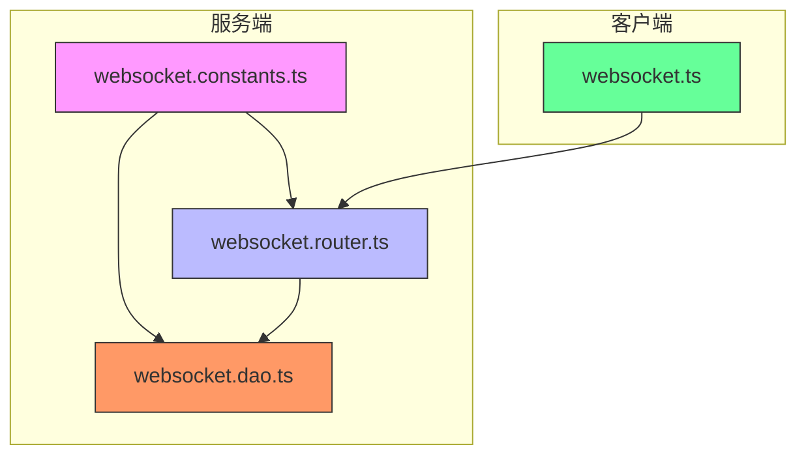
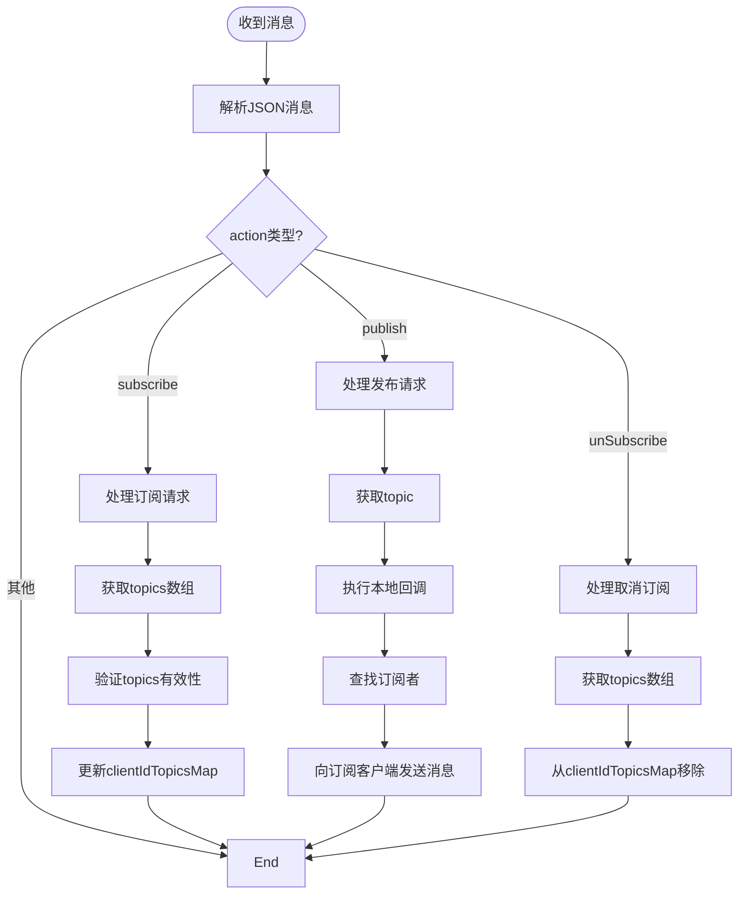
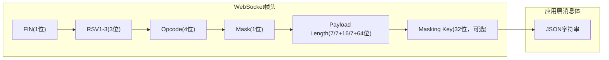
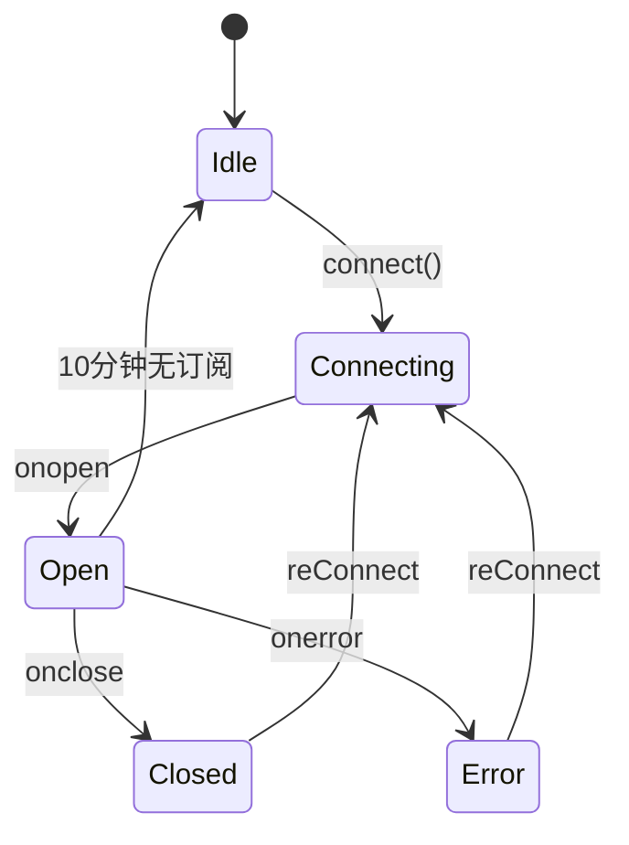

# 消息帧结构


**本文档引用的文件**   
- [websocket.constants.ts](https://github.com/sail-sail/nest/blob/main/deno/lib/websocket/websocket.constants.ts)
- [websocket.router.ts](https://github.com/sail-sail/nest/blob/main/deno/lib/websocket/websocket.router.ts)
- [websocket.dao.ts](https://github.com/sail-sail/nest/blob/main/deno/lib/websocket/websocket.dao.ts)
- [websocket.ts](https://github.com/sail-sail/nest/blob/main/pc/src/compositions/websocket.ts)


## 目录
1. [引言](#引言)
2. [项目结构分析](#项目结构分析)
3. [核心数据结构与常量](#核心数据结构与常量)
4. [WebSocket消息协议设计](#websocket消息协议设计)
5. [服务端消息处理流程](#服务端消息处理流程)
6. [客户端连接与通信机制](#客户端连接与通信机制)
7. [消息帧结构详细分析](#消息帧结构详细分析)
8. [异常处理与连接管理](#异常处理与连接管理)
9. [性能优化与最佳实践](#性能优化与最佳实践)
10. [总结](#总结)

## 引言

本文档详细描述了基于WebSocket协议的消息帧结构设计与实现，重点分析了消息的二进制/文本帧格式、头部信息、负载数据结构和长度编码方式。文档基于``项目中的WebSocket相关组件，深入解析了`websocket.constants.ts`中定义的帧类型常量及其在实际通信中的应用。

系统采用基于主题（topic）的发布-订阅模式，实现了客户端与服务端之间的实时双向通信。通过分析服务端如何解析和验证消息帧的完整性，包括校验和计算、长度检查和边界处理，本文档提供了完整的消息帧字节级布局图示，展示了各字段的位置和大小。

## 项目结构分析

项目采用分层架构设计，WebSocket相关功能主要分布在`deno/lib/websocket/`目录下，包含常量定义、路由处理和数据访问对象（DAO）三个核心组件。前端Vue组件位于`pc/src/compositions/websocket.ts`，负责客户端连接管理和消息收发。



**图表来源**
- [websocket.constants.ts](https://github.com/sail-sail/nest/blob/main/deno/lib/websocket/websocket.constants.ts)
- [websocket.router.ts](https://github.com/sail-sail/nest/blob/main/deno/lib/websocket/websocket.router.ts)
- [websocket.dao.ts](https://github.com/sail-sail/nest/blob/main/deno/lib/websocket/websocket.dao.ts)
- [websocket.ts](https://github.com/sail-sail/nest/blob/main/pc/src/compositions/websocket.ts)

**本节来源**
- [websocket.constants.ts](https://github.com/sail-sail/nest/blob/main/deno/lib/websocket/websocket.constants.ts)
- [websocket.router.ts](https://github.com/sail-sail/nest/blob/main/deno/lib/websocket/websocket.router.ts)

## 核心数据结构与常量

### 全局状态映射

系统定义了三个核心的Map数据结构，用于维护WebSocket连接的状态：

```typescript
// deno-lint-ignore no-explicit-any
export const callbacksMap = new Map<string, ((data: any) => Promise<void> | void)[]>();

export const socketMap = new Map<string, WebSocket[]>();

export const clientIdTopicsMap = new Map<string, string[]>();
```

**字段说明：**
- **callbacksMap**: 主题回调映射，键为topic字符串，值为该主题订阅的回调函数数组
- **socketMap**: 客户端连接映射，键为clientId字符串，值为该客户端的所有WebSocket连接数组
- **clientIdTopicsMap**: 客户端主题映射，键为clientId字符串，值为该客户端订阅的主题字符串数组

这些Map结构实现了O(1)时间复杂度的查找操作，确保了高并发场景下的消息分发效率。

**本节来源**
- [websocket.constants.ts](https://github.com/sail-sail/nest/blob/main/deno/lib/websocket/websocket.constants.ts#L0-L5)

## WebSocket消息协议设计

### 消息类型定义

系统支持三种主要的消息操作类型：

| 操作类型 | 描述 | 方向 |
|---------|------|------|
| subscribe | 订阅主题 | 客户端 → 服务端 |
| publish | 发布消息 | 客户端 ↔ 服务端 |
| unSubscribe | 取消订阅 | 客户端 → 服务端 |

### 消息帧格式

消息帧采用JSON格式进行序列化，具有统一的结构：

```json
{
  "action": "subscribe",
  "data": {
    "topics": ["topic1", "topic2"]
  }
}
```

或

```json
{
  "action": "publish",
  "data": {
    "topic": "user.update",
    "payload": { "userId": "123", "name": "张三" }
  }
}
```

**字段说明：**
- **action**: 消息操作类型，枚举值为"subscribe"、"publish"、"unSubscribe"
- **data**: 消息数据体，根据action类型具有不同的结构

### 心跳机制

系统实现了ping-pong心跳机制，用于保持连接活跃：

```typescript
function socketPing() {
  if (socket && socket.readyState === WebSocket.OPEN) {
    socket.send("ping");
  }
  setTimeout(socketPing, 60000);
}
```

心跳间隔为60秒，服务端收到"ping"消息后立即回复"pong"。

**本节来源**
- [websocket.router.ts](https://github.com/sail-sail/nest/blob/main/deno/lib/websocket/websocket.router.ts#L100-L105)
- [websocket.ts](https://github.com/sail-sail/nest/blob/main/pc/src/compositions/websocket.ts#L15-L18)

## 服务端消息处理流程

### 连接升级流程

服务端通过`/api/websocket/upgrade`端点处理WebSocket连接升级请求：

```mermaid
sequenceDiagram
participant Client as "客户端"
participant Router as "websocket.router"
participant Constants as "websocket.constants"
Client->>Router : GET /api/websocket/upgrade?pwd=xxx&clientId=yyy
Router->>Router : 验证pwd参数
alt pwd不匹配
Router-->>Client : 401 Unauthorized
stop
end
Router->>Router : 验证clientId参数
alt clientId缺失
Router-->>Client : 400 Bad Request
stop
end
Router->>Router : ctx.upgrade()
Router->>Constants : onopen(socket, clientId)
Router->>Router : 设置事件处理器
Router-->>Client : WebSocket连接建立
```

**图表来源**
- [websocket.router.ts](https://github.com/sail-sail/nest/blob/main/deno/lib/websocket/websocket.router.ts#L38-L89)

**本节来源**
- [websocket.router.ts](https://github.com/sail-sail/nest/blob/main/deno/lib/websocket/websocket.router.ts#L38-L89)

### 消息分发流程

服务端收到消息后，根据action类型进行分发处理：



**图表来源**
- [websocket.router.ts](https://github.com/sail-sail/nest/blob/main/deno/lib/websocket/websocket.router.ts#L89-L171)

**本节来源**
- [websocket.router.ts](https://github.com/sail-sail/nest/blob/main/deno/lib/websocket/websocket.router.ts#L89-L171)

## 客户端连接与通信机制

### 连接管理

客户端实现了自动重连机制，确保网络不稳定时的连接可靠性：

```typescript
async function reConnect() {
  if (socket && (socket.readyState === WebSocket.OPEN || socket.readyState === WebSocket.CONNECTING)) {
    return socket;
  }
  if (topicCallbackMap.size === 0) {
    return;
  }
  reConnectNum++;
  let time = 200;
  if (reConnectNum > 10) {
    time = 5000;
  } else {
    time = reConnectNum * 200;
  }
  await new Promise((resolve) => setTimeout(resolve, time));
  await connect();
}
```

**重连策略：**
- 初始重连间隔：200ms
- 递增策略：每次增加200ms
- 最大重连间隔：5000ms（当重连次数超过10次时）

### 消息订阅机制

客户端通过`subscribe`函数实现主题订阅：

```typescript
export async function subscribe<T>(
  topic: string,
  callback: ((data: T | undefined) => void),
) {
  const socket = await connect();
  if (!socket) {
    return;
  }
  let callbacks = topicCallbackMap.get(topic);
  if (!callbacks) {
    callbacks = [ ];
    topicCallbackMap.set(topic, callbacks);
  }
  callbacks.push(callback);
  socket.send(JSON.stringify({
    action: "subscribe",
    data: {
      topics: [ topic ],
    },
  }));
}
```

**本节来源**
- [websocket.ts](https://github.com/sail-sail/nest/blob/main/pc/src/compositions/websocket.ts#L25-L72)

## 消息帧结构详细分析

### 字节级布局

虽然系统采用文本帧（JSON格式），但其字节级布局遵循WebSocket协议规范：



**字段说明：**
- **FIN**: 1位，表示是否为消息的最后一个分片
- **RSV1-3**: 3位，保留位，必须为0
- **Opcode**: 4位，操作码，文本帧为1，二进制帧为2
- **Mask**: 1位，掩码标志，客户端发送必须为1
- **Payload Length**: 7/16/64位，负载长度
- **Masking Key**: 32位，掩码密钥
- **JSON字符串**: 应用层消息体，包含action和data字段

### 长度编码方式

系统采用WebSocket协议的变长整数编码方式：

- 负载长度 ≤ 125: 使用7位长度字段
- 126 ≤ 负载长度 ≤ 65535: 使用7+16位（值为126）
- 负载长度 > 65535: 使用7+64位（值为127）

### 校验和与完整性验证

系统通过以下机制确保消息完整性：

1. **JSON解析验证**: 使用`JSON.parse()`进行语法验证
2. **字段存在性检查**: 验证action、data等关键字段
3. **类型检查**: 确保数据类型符合预期
4. **连接状态检查**: 发送前检查WebSocket.readyState

**本节来源**
- [websocket.router.ts](https://github.com/sail-sail/nest/blob/main/deno/lib/websocket/websocket.router.ts#L89-L134)
- [websocket.ts](https://github.com/sail-sail/nest/blob/main/pc/src/compositions/websocket.ts#L45-L50)

## 异常处理与连接管理

### 错误处理策略

系统实现了全面的错误处理机制：

```typescript
socket.onerror = function(err0) {
  const err = err0 as ErrorEvent;
  try {
    if (socket.readyState === WebSocket.OPEN) {
      socket.close(1000, err.message);
    }
  } catch (_err) {
    // error(_err);
  }
  // 清理连接映射
  for (const [ clientId2, sockets ] of socketMap) {
    if (sockets.includes(socket)) {
      socketMap.set(clientId2, sockets.filter((item) => item !== socket));
    }
  }
  clientIdTopicsMap.delete(clientId);
};
```

**错误处理步骤：**
1. 尝试关闭连接
2. 从socketMap中移除失效连接
3. 从clientIdTopicsMap中清除客户端订阅信息
4. 记录错误日志

### 连接清理机制

系统在以下情况下自动清理连接：

- **连接关闭**: `onclose`事件触发时
- **连接错误**: `onerror`事件触发时
- **客户端重连**: 新连接建立时关闭旧连接
- **空闲超时**: 10分钟后无订阅自动关闭连接



**图表来源**
- [websocket.router.ts](https://github.com/sail-sail/nest/blob/main/deno/lib/websocket/websocket.router.ts#L70-L85)
- [websocket.ts](https://github.com/sail-sail/nest/blob/main/pc/src/compositions/websocket.ts#L60-L65)

**本节来源**
- [websocket.router.ts](https://github.com/sail-sail/nest/blob/main/deno/lib/websocket/websocket.router.ts#L70-L85)
- [websocket.ts](https://github.com/sail-sail/nest/blob/main/pc/src/compositions/websocket.ts#L60-L65)

## 性能优化与最佳实践

### 连接复用

系统支持单个客户端多个WebSocket连接，但通过`onopen`函数确保连接有效性：

```typescript
function onopen(socket: WebSocket, clientId: string) {
  let socketOlds = socketMap.get(clientId);
  if (!socketOlds) {
    socketOlds = [ ];
    socketMap.set(clientId, socketOlds);
  }
  socketOlds.push(socket);
  
  for (const socket2 of socketOlds) {
    if (socket2.readyState !== WebSocket.OPEN) {
      socket2.close(1000, `websocket: clientId ${ clientId } reconnect`);
    }
  }
}
```

当新连接建立时，会关闭所有非OPEN状态的旧连接。

### 消息批处理

发布消息时，系统采用批处理方式提高效率：

```typescript
export async function publish<T>(
  data: {
    topic: string;
    payload: T;
  },
) {
  const topic = data.topic;
  const callbacks = callbacksMap.get(topic);
  if (callbacks && callbacks.length > 0) {
    for (const callback of callbacks) {
      await callback(data.payload);
    }
  }
  const dataStr = JSON.stringify(data);
  for (const [ clientId, topics ] of clientIdTopicsMap) {
    if (!topics.includes(topic)) {
      continue;
    }
    const sockets = socketMap.get(clientId);
    if (!sockets || sockets.length === 0) {
      continue;
    }
    for (const socket of sockets) {
      if (socket.readyState !== WebSocket.OPEN) {
        // 清理无效连接
        continue;
      }
      socket.send(dataStr);
    }
  }
}
```

**优化点：**
- 本地回调并行执行
- 消息体只序列化一次
- 连接状态检查避免无效发送

### 内存管理

系统通过以下机制防止内存泄漏：

1. **自动清理**: 连接关闭时自动从Map中移除
2. **空闲超时**: 10分钟后无订阅自动关闭连接
3. **重复订阅过滤**: 避免同一主题多次订阅

**本节来源**
- [websocket.dao.ts](https://github.com/sail-sail/nest/blob/main/deno/lib/websocket/websocket.dao.ts#L45-L63)
- [websocket.router.ts](https://github.com/sail-sail/nest/blob/main/deno/lib/websocket/websocket.router.ts#L50-L55)

## 总结

本文档详细分析了WebSocket消息帧结构的设计与实现。系统采用基于JSON的文本帧格式，通过主题发布-订阅模式实现高效的消息分发。核心特点包括：

1. **标准化消息协议**: 统一的JSON消息格式，包含action和data字段
2. **高效状态管理**: 使用Map数据结构实现O(1)查找性能
3. **可靠连接管理**: 自动重连、心跳检测和连接清理机制
4. **安全验证**: 密码保护和客户端ID验证
5. **性能优化**: 消息批处理、连接复用和内存管理

该设计适用于高并发实时通信场景，具有良好的可扩展性和稳定性。