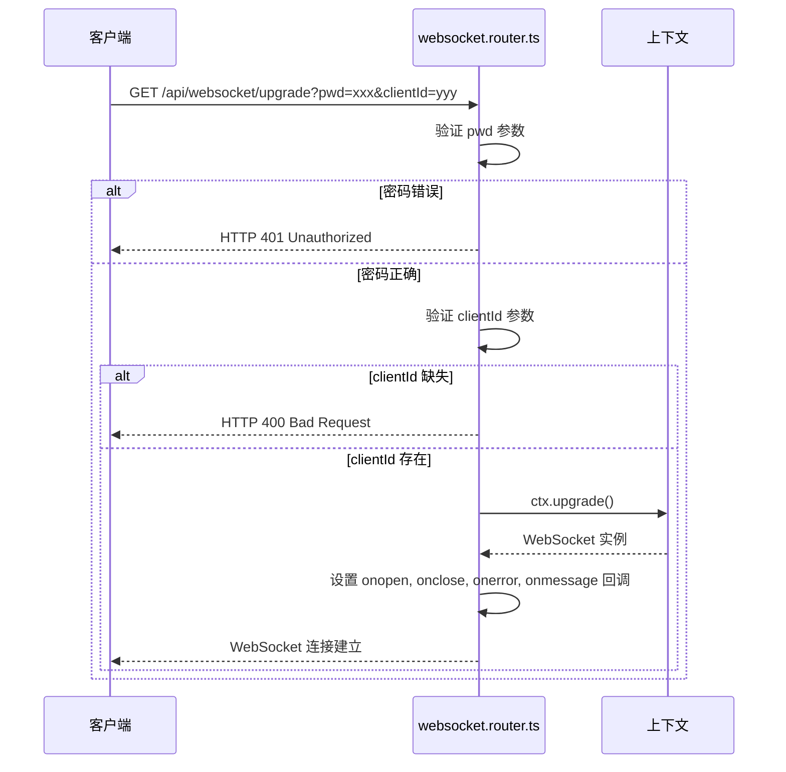
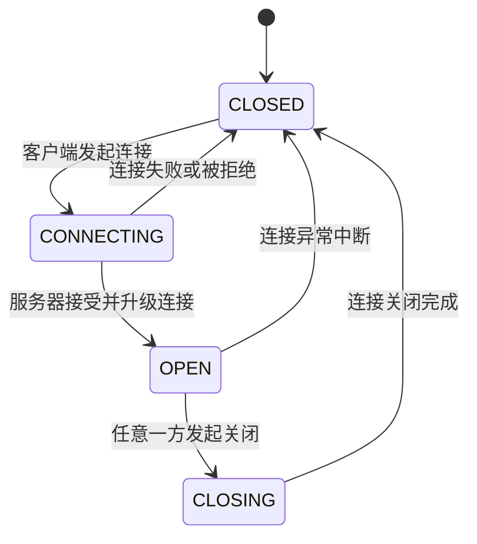

# 通信模式


**本文档引用文件**   
- [websocket.router.ts](https://github.com/sail-sail/nest/blob/main/deno/lib/websocket/websocket.router.ts)
- [websocket.dao.ts](https://github.com/sail-sail/nest/blob/main/deno/lib/websocket/websocket.dao.ts)
- [websocket.constants.ts](https://github.com/sail-sail/nest/blob/main/deno/lib/websocket/websocket.constants.ts)
- [websocket.ts](https://github.com/sail-sail/nest/blob/main/pc/src/compositions/websocket.ts)
- [websocket.ts](https://github.com/sail-sail/nest/blob/main/uni/src/compositions/websocket.ts)


## 目录
1. [引言](#引言)
2. [核心通信模式](#核心通信模式)
3. [WebSocket 路由处理机制](#websocket-路由处理机制)
4. [会话管理与消息路由实现](#会话管理与消息路由实现)
5. [通信模式状态机与时序图](#通信模式状态机与时序图)
6. [连接生命周期管理](#连接生命周期管理)
7. [错误码与恢复策略](#错误码与恢复策略)

## 引言

本技术文档详细阐述了基于 WebSocket 的实时通信系统架构，重点分析请求/响应、发布/订阅、点对点通信和广播四种核心通信模式的实现机制。文档深入解析了 `websocket.router.ts` 中的路由分发逻辑，以及 `websocket.dao.ts` 中的会话管理和消息路由实现。同时，文档还涵盖了连接建立、心跳维持、异常断开和自动重连的完整处理流程，并提供了错误码定义和系统恢复策略。

## 核心通信模式

本系统基于 WebSocket 协议构建了四种主要的实时通信模式，每种模式服务于不同的业务场景需求。

### 请求/响应模式

请求/响应模式是一种同步通信机制，客户端发送一个请求消息，并等待服务器返回一个对应的响应。该模式在当前实现中通过应用层逻辑完成，客户端在发送消息后启动一个定时器等待响应，服务器处理请求后通过发布/订阅机制将结果返回给特定主题。

### 发布/订阅模式

发布/订阅（Pub/Sub）模式是本系统的核心通信范式。它允许消息的发送者（发布者）和接收者（订阅者）通过一个中间代理（主题/Topic）进行解耦。

- **发布者 (Publisher)**：向一个特定的主题发送消息。
- **订阅者 (Subscriber)**：预先注册对某个或多个主题的兴趣，当有消息发布到这些主题时，会自动收到通知。
- **主题 (Topic)**：消息的分类通道，作为发布者和订阅者之间的逻辑纽带。

该模式实现了消息的广播和一对多通信，是系统实现事件驱动架构的基础。

### 点对点通信模式

点对点（P2P）通信模式允许两个特定的客户端之间直接交换消息。在本系统中，这通过为每个客户端分配一个唯一的 `clientId` 来实现。发送方可以将消息发布到一个以接收方 `clientId` 命名的主题上，接收方通过订阅该主题来接收消息，从而实现定向通信。

### 广播模式

广播模式是发布/订阅模式的一种特例。当一个消息被发布到一个特定主题，而该主题被所有在线客户端订阅时，该消息就会被发送给所有订阅者，从而实现向所有连接客户端的广播。系统管理员可以利用此模式发送全局通知。

## WebSocket 路由处理机制

`websocket.router.ts` 文件是 WebSocket 通信的入口和控制中心，负责处理连接升级、消息分发和连接管理。

### 连接升级与认证



**图解说明**：
1.  **客户端请求**：客户端通过带有 `pwd` 和 `clientId` 查询参数的 HTTP GET 请求发起连接。
2.  **密码认证**：服务器端首先验证 `pwd` 参数是否与预设的 `PWD` 常量匹配，不匹配则返回 401 错误。
3.  **客户端ID验证**：检查 `clientId` 参数是否存在，不存在则返回 400 错误。
4.  **连接升级**：通过 `ctx.upgrade()` 方法将 HTTP 连接升级为 WebSocket 连接。
5.  **事件监听**：为新建立的 WebSocket 实例设置 `onopen`、`onclose`、`onerror` 和 `onmessage` 事件处理器。

**Diagram sources**
- [websocket.router.ts](https://github.com/sail-sail/nest/blob/main/deno/lib/websocket/websocket.router.ts#L38-L89)

### 消息分发逻辑

`onmessage` 事件处理器是消息分发的核心，它根据消息中的 `action` 字段来区分不同的通信模式。

```mermaid
flowchart TD
A[收到消息] --> B{消息是 "ping"?}
B --> |是| C[回复 "pong"]
B --> |否| D{消息是字符串?}
D --> |否| E[忽略]
D --> |是| F[解析JSON]
F --> G{action字段}
G --> H[action = "subscribe"]
G --> I[action = "publish"]
G --> J[action = "unSubscribe"]
G --> K[其他/错误]
H --> L[更新clientIdTopicsMap]
I --> M[执行回调函数]
I --> N[向订阅者广播消息]
J --> O[从clientIdTopicsMap移除主题]
K --> P[记录错误]
```

**关键处理流程**：

1.  **心跳检测 (Ping/Pong)**：
    - 当收到 `"ping"` 消息时，服务器立即回复 `"pong"`，用于维持连接和检测客户端存活。

2.  **订阅 (Subscribe)**：
    - 客户端发送 `action: "subscribe"` 消息，包含一个主题列表。
    - 服务器将这些主题记录在 `clientIdTopicsMap` 中，建立 `clientId` 与主题的映射关系。

3.  **发布 (Publish)**：
    - 客户端发送 `action: "publish"` 消息，包含目标 `topic` 和 `payload`。
    - 服务器首先查找 `callbacksMap`，执行所有注册在该主题上的回调函数。
    - 然后遍历 `clientIdTopicsMap`，找到所有订阅了该主题的 `clientId`。
    - 对于每个订阅者，从 `socketMap` 中获取其 WebSocket 连接列表，并将消息发送给所有处于 `OPEN` 状态的连接。

4.  **取消订阅 (UnSubscribe)**：
    - 客户端发送 `action: "unSubscribe"` 消息，包含要取消订阅的主题列表。
    - 服务器从 `clientIdTopicsMap` 中移除这些主题。

**Diagram sources**
- [websocket.router.ts](https://github.com/sail-sail/nest/blob/main/deno/lib/websocket/websocket.router.ts#L89-L171)

**Section sources**
- [websocket.router.ts](https://github.com/sail-sail/nest/blob/main/deno/lib/websocket/websocket.router.ts#L0-L200)

## 会话管理与消息路由实现

`websocket.dao.ts` 文件提供了对底层数据结构的操作接口，实现了会话管理和消息路由的业务逻辑。

### 核心数据结构

系统依赖于三个全局的 `Map` 对象来维护状态：

- **`callbacksMap`**: `Map<string, Function[]>`
  - **键 (Key)**: 主题 (Topic) 名称。
  - **值 (Value)**: 一个函数数组，存储了所有注册在该主题上的回调函数。当消息发布到此主题时，这些函数会被依次调用。

- **`socketMap`**: `Map<string, WebSocket[]>`
  - **键 (Key)**: 客户端ID (`clientId`)。
  - **值 (Value)**: 一个 WebSocket 连接数组。一个 `clientId` 可能对应多个连接（例如，同一用户在不同设备或标签页登录）。

- **`clientIdTopicsMap`**: `Map<string, string[]>`
  - **键 (Key)**: 客户端ID (`clientId`)。
  - **值 (Value)**: 一个字符串数组，存储了该客户端订阅的所有主题。

这些数据结构共同构成了消息路由的基础。

### DAO 方法实现

#### 订阅 (subscribe)

```typescript
export function subscribe<T>(topic: string, callback: (data: T) => void) {
  let callbacks = callbacksMap.get(topic);
  if (!callbacks) {
    callbacks = [];
    callbacksMap.set(topic, callbacks);
  }
  if (!callbacks.includes(callback)) {
    callbacks.push(callback);
  }
}
```
此方法将一个回调函数注册到指定主题。如果该主题尚无回调列表，则创建一个新列表。

#### 发布 (publish)

```typescript
export async function publish<T>(data: { topic: string; payload: T; }) {
  // 1. 执行服务端回调
  const callbacks = callbacksMap.get(data.topic);
  if (callbacks && callbacks.length > 0) {
    for (const callback of callbacks) {
      await callback(data.payload);
    }
  }
  // 2. 向客户端广播消息
  const dataStr = JSON.stringify(data);
  for (const [ clientId, topics ] of clientIdTopicsMap) {
    if (!topics.includes(data.topic)) continue;
    const sockets = socketMap.get(clientId);
    if (!sockets || sockets.length === 0) continue;
    for (const socket of sockets) {
      if (socket.readyState !== WebSocket.OPEN) {
        // 清理失效连接
        socketMap.set(clientId, sockets.filter((item) => item !== socket));
        clientIdTopicsMap.delete(clientId);
        try { socket.close(); } catch (_err) { /* 忽略 */ }
        continue;
      }
      socket.send(dataStr);
    }
  }
}
```
`publish` 方法是核心，它分为两个阶段：
1.  **服务端处理**：触发所有注册在该主题上的服务端回调函数。
2.  **客户端广播**：遍历所有客户端，将消息发送给订阅了该主题且连接有效的客户端。

#### 取消订阅 (unSubscribe)

```typescript
export function unSubscribe<T>(topic: string, callback?: (data: T) => void) {
  if (!callback) {
    callbacksMap.delete(topic); // 取消整个主题
    return;
  }
  const callbacks = callbacksMap.get(topic);
  if (callbacks) {
    const index = callbacks.indexOf(callback as any);
    if (index >= 0) callbacks.splice(index, 1);
  }
  if (!callbacks || callbacks.length === 0) {
    callbacksMap.delete(topic);
  }
}
```
此方法允许移除特定的回调函数，或在没有指定回调时移除整个主题。

**Section sources**
- [websocket.dao.ts](https://github.com/sail-sail/nest/blob/main/deno/lib/websocket/websocket.dao.ts#L0-L103)
- [websocket.constants.ts](https://github.com/sail-sail/nest/blob/main/deno/lib/websocket/websocket.constants.ts#L0-L6)

## 通信模式状态机与时序图

### WebSocket 连接状态机



### 客户端自动重连时序图

```mermaid
sequenceDiagram
participant Client as 客户端
participant Server as 服务器
participant Reconnect as 重连模块
Client->>Server : 发起WebSocket连接
Server-->>Client : 连接建立 (OPEN)
Note over Client,Server : 正常通信
Server->>Client : 连接中断 (onclose)
Client->>Reconnect : 触发 onclose 事件
Reconnect->>Reconnect : 启动重连计数器
loop 指数退避
Reconnect->>Reconnect : 等待 (200ms * 重连次数)
Reconnect->>Client : 尝试重新连接
alt 连接成功
Client->>Server : 新的WebSocket连接
Server-->>Client : 连接建立 (OPEN)
Client->>Server : 发送 "subscribe" 消息，恢复订阅
break
else 连接失败
Reconnect->>Reconnect : 重连次数+1
end
end
```

**Diagram sources**
- [websocket.ts](https://github.com/sail-sail/nest/blob/main/pc/src/compositions/websocket.ts#L25-L115)
- [websocket.ts](https://github.com/sail-sail/nest/blob/main/uni/src/compositions/websocket.ts#L25-L115)

## 连接生命周期管理

### 连接建立

1.  **客户端**：使用 `new WebSocket(url)` 构造函数发起连接，URL 包含 `pwd` 和 `clientId`。
2.  **服务端**：`websocket.router.ts` 处理 `/api/websocket/upgrade` 路由，进行认证和连接升级。

### 心跳维持

为了防止连接因长时间空闲而被中间代理（如Nginx、防火墙）断开，系统实现了心跳机制。

- **客户端**：在 `pc/src/compositions/websocket.ts` 和 `uni/src/compositions/websocket.ts` 中，`socketPing` 函数每60秒向服务器发送一次 `"ping"` 消息。
- **服务端**：`websocket.router.ts` 的 `onmessage` 处理器收到 `"ping"` 后，立即回复 `"pong"`。

### 异常断开与自动重连

当连接因网络问题、服务器重启等原因断开时，客户端会自动尝试重连。

- **onclose/onerror 处理**：客户端的 `onclose` 和 `onerror` 事件处理器会调用 `reConnect()` 函数。
- **指数退避算法**：`reConnect()` 函数采用指数退避策略，初始等待200ms，每次失败后等待时间递增，最大不超过5秒，避免对服务器造成过大压力。
- **状态恢复**：重连成功后，客户端会遍历 `topicCallbackMap`，向服务器发送 `subscribe` 消息，重新订阅之前关注的所有主题，恢复通信状态。

## 错误码与恢复策略

### 错误码

- **400 Bad Request**: 客户端请求缺少 `clientId` 参数。
- **401 Unauthorized**: 客户端提供的 `pwd` 密码错误。
- **1000 Normal Closure**: WebSocket 连接正常关闭。
- **1006 Abnormal Closure**: 连接异常中断（如网络断开）。

### 恢复策略

- **客户端重连**：采用指数退避算法进行自动重连，确保在网络波动后能恢复连接。
- **状态同步**：重连后主动恢复订阅状态，保证消息不丢失（在连接断开期间发布的消息仍会丢失，但连接恢复后能继续接收新消息）。
- **资源清理**：服务端在 `onclose` 和 `onerror` 事件中清理 `socketMap` 和 `clientIdTopicsMap` 中的失效连接，防止内存泄漏。