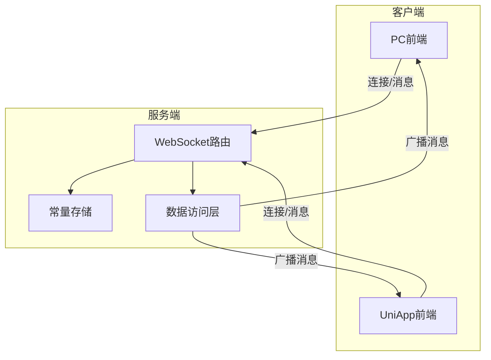
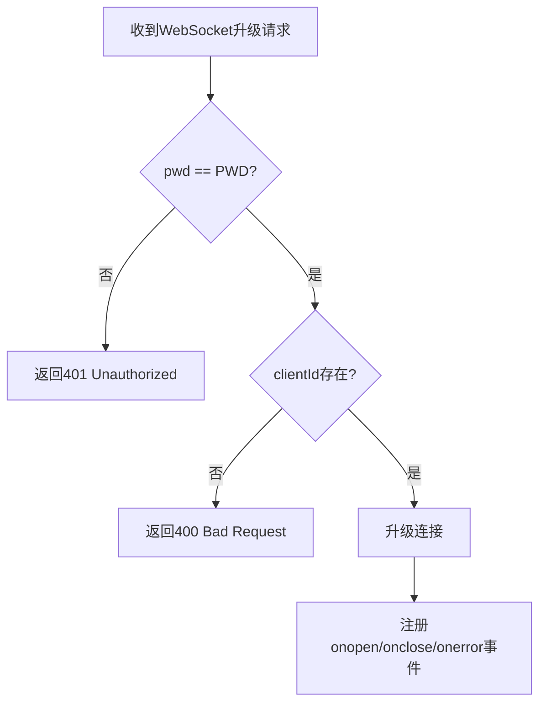
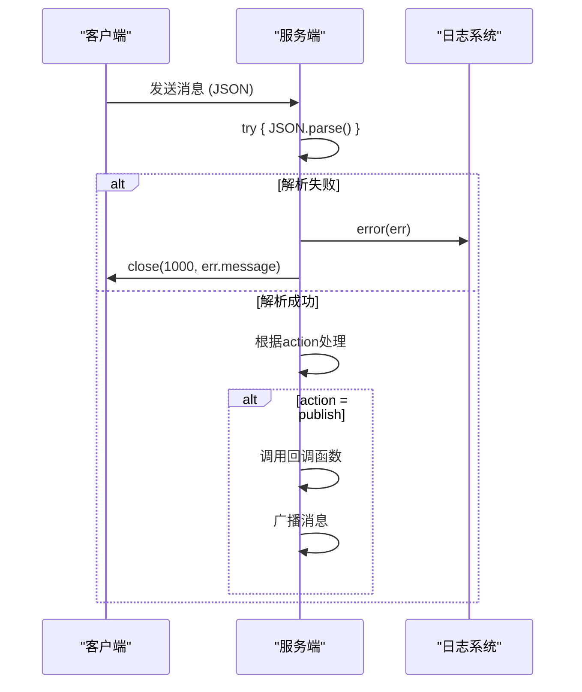
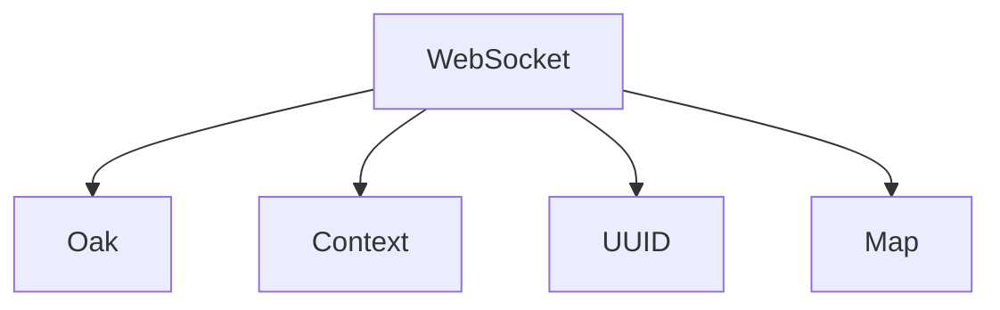

# 错误处理机制


**本文档引用的文件**  
- [websocket.constants.ts](https://github.com/sail-sail/nest/blob/main/deno/lib/websocket/websocket.constants.ts)
- [websocket.router.ts](https://github.com/sail-sail/nest/blob/main/deno/lib/websocket/websocket.router.ts)
- [websocket.dao.ts](https://github.com/sail-sail/nest/blob/main/deno/lib/websocket/websocket.dao.ts)
- [pc/src/compositions/websocket.ts](https://github.com/sail-sail/nest/blob/main/pc/src/compositions/websocket.ts)
- [uni/src/compositions/websocket.ts](https://github.com/sail-sail/nest/blob/main/uni/src/compositions/websocket.ts)


## 目录
1. [引言](#引言)
2. [项目结构](#项目结构)
3. [核心组件](#核心组件)
4. [架构概览](#架构概览)
5. [详细组件分析](#详细组件分析)
6. [依赖分析](#依赖分析)
7. [性能考量](#性能考量)
8. [故障排除指南](#故障排除指南)
9. [结论](#结论)

## 引言
本文档详细描述了基于WebSocket的错误处理机制，涵盖客户端与服务端之间的错误码体系、异常消息格式、恢复策略以及日志记录和用户提示机制。重点分析了`websocket.constants.ts`中定义的常量、`websocket.router.ts`中的错误捕获逻辑，以及前端在PC和UniApp平台中的重连与订阅管理机制。

## 项目结构
WebSocket功能模块分布在服务端和客户端两个主要部分：
- 服务端位于 `deno/lib/websocket/` 目录下，包含路由、常量和数据访问对象（DAO）。
- 客户端分别位于 `pc/src/compositions/websocket.ts` 和 `uni/src/compositions/websocket.ts`，实现Vue和UniApp平台的WebSocket连接管理。

**Section sources**
- [websocket.constants.ts](https://github.com/sail-sail/nest/blob/main/deno/lib/websocket/websocket.constants.ts)
- [websocket.router.ts](https://github.com/sail-sail/nest/blob/main/deno/lib/websocket/websocket.router.ts)
- [pc/src/compositions/websocket.ts](https://github.com/sail-sail/nest/blob/main/pc/src/compositions/websocket.ts)
- [uni/src/compositions/websocket.ts](https://github.com/sail-sail/nest/blob/main/uni/src/compositions/websocket.ts)

## 核心组件
核心组件包括：
- **错误码与认证机制**：通过查询参数`pwd`进行连接认证，失败返回401。
- **连接管理**：基于`clientId`维护多个WebSocket连接。
- **消息路由**：支持`subscribe`、`publish`、`unSubscribe`等操作。
- **异常处理**：在连接、消息接收、错误事件中均有完善的异常捕获与恢复逻辑。

**Section sources**
- [websocket.router.ts](https://github.com/sail-sail/nest/blob/main/deno/lib/websocket/websocket.router.ts#L38-L89)
- [websocket.dao.ts](https://github.com/sail-sail/nest/blob/main/deno/lib/websocket/websocket.dao.ts#L0-L63)

## 架构概览
系统采用典型的发布-订阅（Pub/Sub）模式，服务端作为消息代理，客户端通过WebSocket连接并订阅特定主题。



**Diagram sources**
- [websocket.router.ts](https://github.com/sail-sail/nest/blob/main/deno/lib/websocket/websocket.router.ts)
- [websocket.constants.ts](https://github.com/sail-sail/nest/blob/main/deno/lib/websocket/websocket.constants.ts)
- [websocket.dao.ts](https://github.com/sail-sail/nest/blob/main/deno/lib/websocket/websocket.dao.ts)

## 详细组件分析

### 服务端错误处理分析

#### 认证与连接错误
服务端在升级WebSocket连接时进行密码和`clientId`校验：



**Diagram sources**
- [websocket.router.ts](https://github.com/sail-sail/nest/blob/main/deno/lib/websocket/websocket.router.ts#L38-L89)

#### 消息处理与异常捕获
当客户端发送消息时，服务端解析JSON并根据`action`字段执行相应操作。所有解析和处理逻辑均包裹在`try-catch`中，确保异常不会中断服务。



**Diagram sources**
- [websocket.router.ts](https://github.com/sail-sail/nest/blob/main/deno/lib/websocket/websocket.router.ts#L86-L134)

### 客户端错误处理与恢复策略

#### 连接与重连机制
客户端实现了指数退避重连策略，防止服务端被频繁连接冲击。

```mermaid
flowchart TD
A[连接断开] --> B{有订阅主题?}
B --> |否| C[不重连]
B --> |是| D[reConnectNum++]
D --> E{reConnectNum > 10?}
E --> |是| F[等待5秒]
E --> |否| G[等待 reConnectNum * 200ms]
G --> H[尝试connect()]
F --> H
H --> I[创建WebSocket]
I --> J{连接成功?}
J --> |是| K[发送订阅消息]
J --> |否| L[递归reConnect()]
```

**Diagram sources**
- [pc/src/compositions/websocket.ts](https://github.com/sail-sail/nest/blob/main/pc/src/compositions/websocket.ts#L25-L72)
- [uni/src/compositions/websocket.ts](https://github.com/sail-sail/nest/blob/main/uni/src/compositions/websocket.ts#L68-L115)

#### 错误事件处理
客户端在`onerror`事件中关闭当前连接并触发重连：

```typescript
socket.onerror = function(err0) {
  const err = err0 as ErrorEvent;
  try {
    socket!.close();
  } catch (_err) { /* 忽略 */ }
  socket = undefined;
  reConnect();
};
```

此机制确保了网络异常或服务端崩溃后，客户端能自动恢复连接。

**Section sources**
- [pc/src/compositions/websocket.ts](https://github.com/sail-sail/nest/blob/main/pc/src/compositions/websocket.ts#L68-L72)

## 依赖分析
WebSocket模块依赖以下核心组件：
- **Oak框架**：提供WebSocket升级和路由功能。
- **Context系统**：用于异步上下文追踪和日志记录。
- **UUID工具**：生成唯一`clientId`。
- **Map数据结构**：存储`callbacksMap`、`socketMap`、`clientIdTopicsMap`。



**Diagram sources**
- [websocket.router.ts](https://github.com/sail-sail/nest/blob/main/deno/lib/websocket/websocket.router.ts#L0-L36)
- [pc/src/compositions/websocket.ts](https://github.com/sail-sail/nest/blob/main/pc/src/compositions/websocket.ts#L1-L10)

## 性能考量
- **内存管理**：使用`Map`结构高效存储连接和回调，避免内存泄漏。
- **连接复用**：同一`clientId`可维护多个连接，支持多标签页。
- **心跳机制**：每60秒发送`ping`消息，保持连接活跃。
- **自动清理**：当连接关闭或异常时，自动从`socketMap`和`clientIdTopicsMap`中移除。

## 故障排除指南

### 常见错误场景

| 错误场景 | 错误码 | 处理方式 |
|--------|-------|--------|
| 认证失败 | 401 | 检查`pwd`参数是否正确 |
| 缺少clientId | 400 | 确保URL包含`clientId`参数 |
| 消息格式错误 | - | 服务端捕获JSON解析异常，关闭连接 |
| 网络中断 | - | 客户端自动重连，指数退避 |

### 日志记录
服务端使用`error()`函数记录所有异常，便于监控和排查。客户端将错误输出到控制台。

### 用户提示
建议在UI层监听WebSocket状态，当连接失败时显示友好提示，如“网络连接中断，正在重新连接...”。

**Section sources**
- [websocket.router.ts](https://github.com/sail-sail/nest/blob/main/deno/lib/websocket/websocket.router.ts#L38-L89)
- [pc/src/compositions/websocket.ts](https://github.com/sail-sail/nest/blob/main/pc/src/compositions/websocket.ts#L68-L72)

## 结论
该WebSocket错误处理机制设计完善，具备：
- 健壮的认证与连接管理
- 细粒度的异常捕获与日志记录
- 高可用的客户端自动重连策略
- 高效的消息路由与发布订阅模式

通过服务端与客户端的协同，系统能够在网络波动、服务重启等异常情况下保持稳定运行，为实时通信提供了可靠保障。