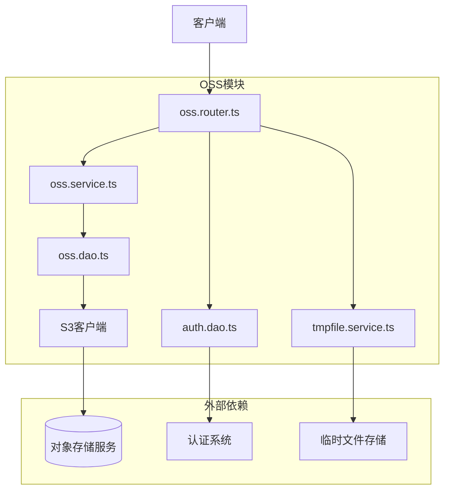
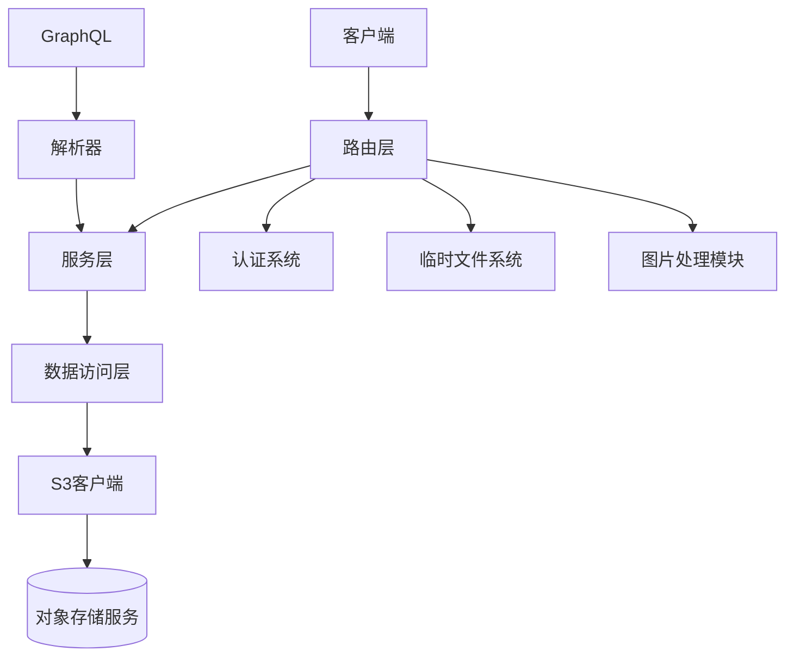
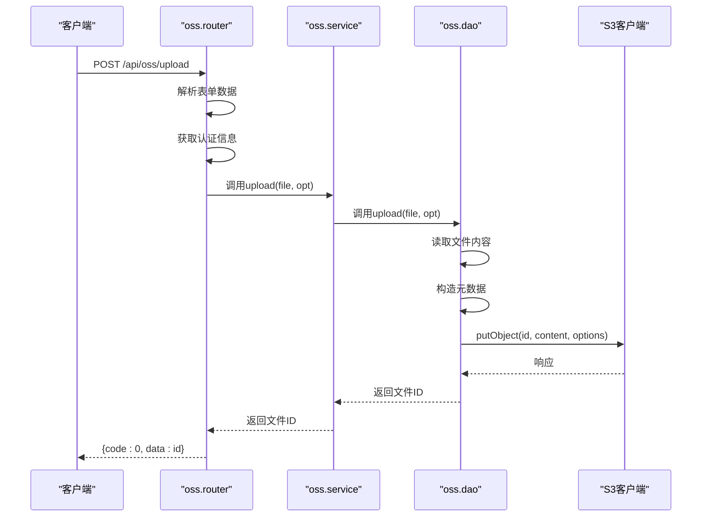
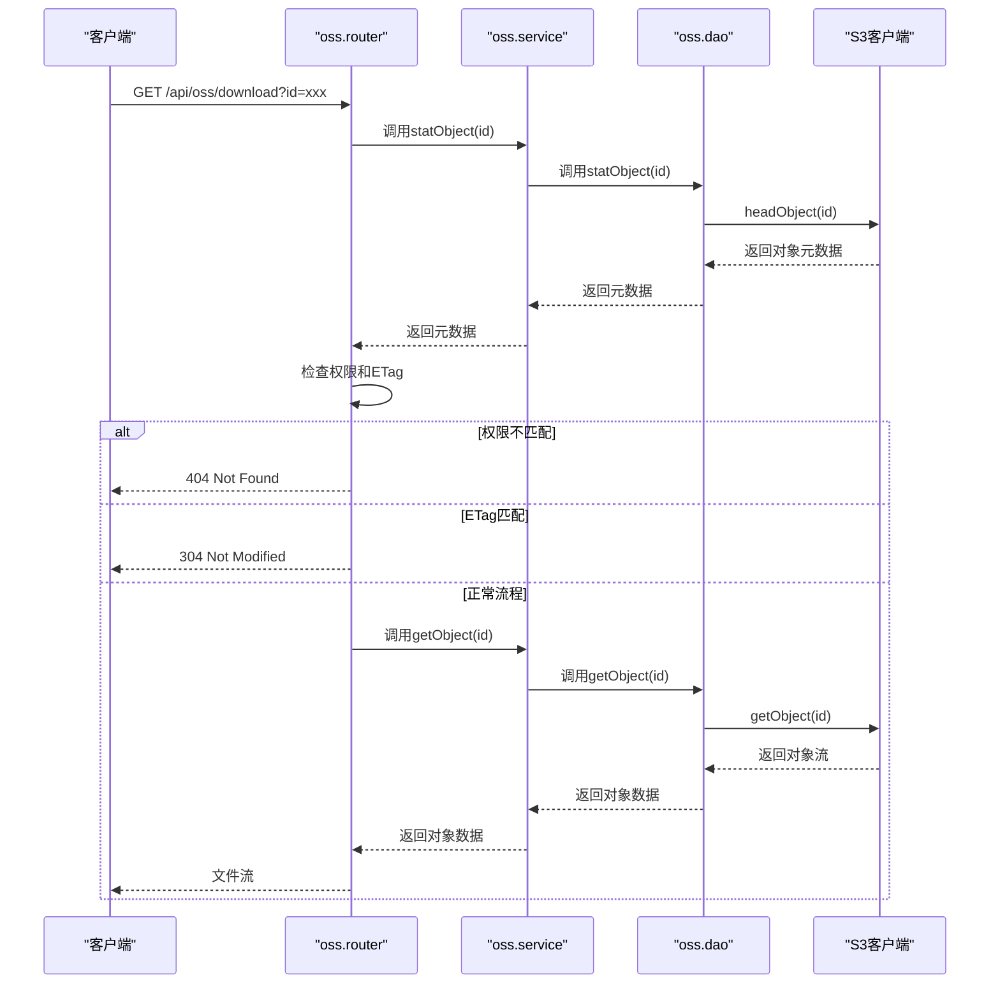
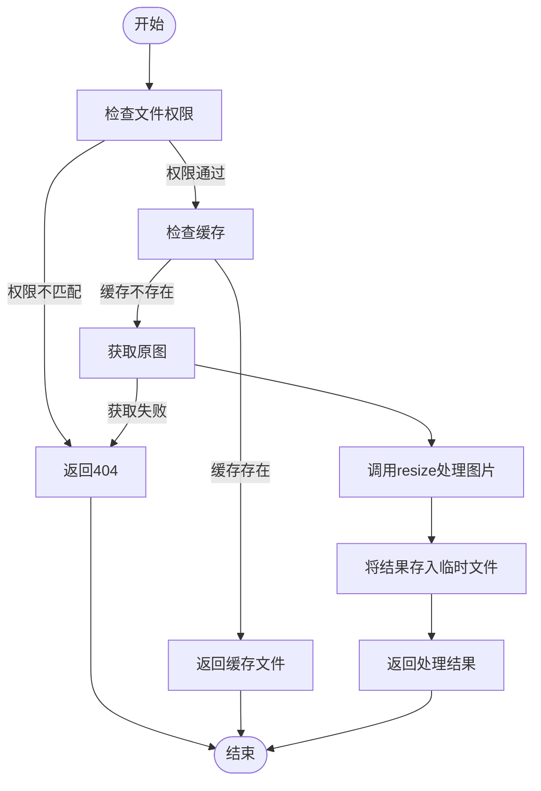
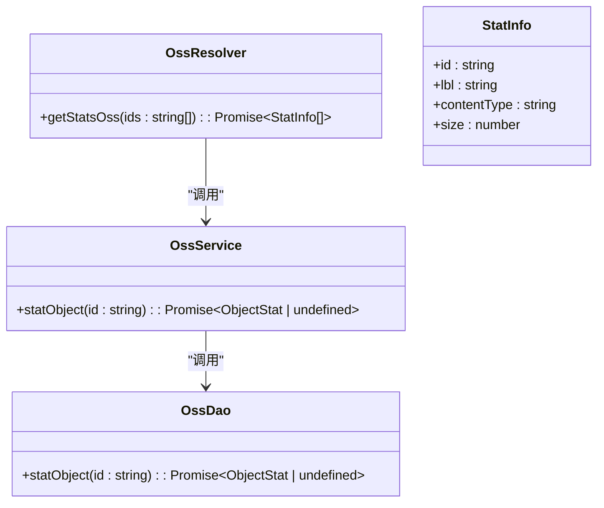
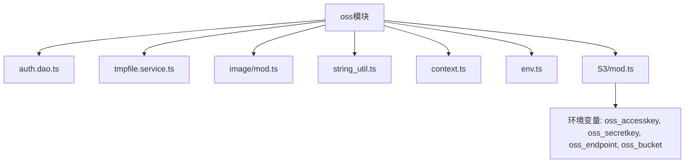

# OSS集成

**本文档引用文件**  
- [oss.dao.ts](https://github.com/sail-sail/nest/blob/main/deno/lib/oss/oss.dao.ts)
- [oss.service.ts](https://github.com/sail-sail/nest/blob/main/deno/lib/oss/oss.service.ts)
- [oss.router.ts](https://github.com/sail-sail/nest/blob/main/deno/lib/oss/oss.router.ts)
- [oss.resolver.ts](https://github.com/sail-sail/nest/blob/main/deno/lib/oss/oss.resolver.ts)
- [oss.graphql.ts](https://github.com/sail-sail/nest/blob/main/deno/lib/oss/oss.graphql.ts)
- [tmpfile.dao.ts](https://github.com/sail-sail/nest/blob/main/deno/lib/tmpfile/tmpfile.dao.ts)

## 目录
1. [简介](#简介)
2. [项目结构](#项目结构)
3. [核心组件](#核心组件)
4. [架构概览](#架构概览)
5. [详细组件分析](#详细组件分析)
6. [依赖分析](#依赖分析)
7. [性能考虑](#性能考虑)
8. [故障排除指南](#故障排除指南)
9. [结论](#结论)

## 简介
本文档详细介绍了基于Deno后端的OSS（对象存储服务）集成实现。系统通过封装S3兼容的API，实现了文件上传、下载、删除、元数据查询等核心功能，并支持权限控制、文件缓存优化和图片处理。OSS模块与认证系统、临时文件系统深度集成，确保多租户环境下的数据安全与高效访问。

## 项目结构
OSS相关代码位于`deno/lib/oss/`目录下，采用分层架构设计，包含DAO、服务、路由、GraphQL解析器等组件。该模块依赖于底层S3客户端库，并与认证、临时文件等模块协同工作。

**图示来源**  
- [oss.router.ts](https://github.com/sail-sail/nest/blob/main/deno/lib/oss/oss.router.ts)
- [oss.service.ts](https://github.com/sail-sail/nest/blob/main/deno/lib/oss/oss.service.ts)
- [oss.dao.ts](https://github.com/sail-sail/nest/blob/main/deno/lib/oss/oss.dao.ts)

## 核心组件
OSS模块的核心功能包括文件上传、下载、元数据查询和删除。系统通过`getBucket`函数实现连接池管理，确保S3客户端实例的复用。上传操作支持私有/公有文件、租户隔离和自定义ID。下载接口支持内容类型协商、ETag缓存验证和内联/附件模式。图片服务支持动态缩放、格式转换和结果缓存。

**组件来源**  
- [oss.dao.ts](https://github.com/sail-sail/nest/blob/main/deno/lib/oss/oss.dao.ts#L0-L134)
- [oss.service.ts](https://github.com/sail-sail/nest/blob/main/deno/lib/oss/oss.service.ts#L0-L31)

## 架构概览
系统采用典型的分层架构，从外到内依次为路由层、服务层、数据访问层。路由层处理HTTP请求，进行参数解析和权限验证；服务层提供业务逻辑封装；DAO层直接与S3客户端交互。GraphQL接口通过解析器暴露元数据查询功能。图片处理功能通过调用`lib/image`模块实现，并将结果缓存到临时文件系统以提高性能。

**图示来源**  
- [oss.router.ts](https://github.com/sail-sail/nest/blob/main/deno/lib/oss/oss.router.ts#L0-L409)
- [oss.service.ts](https://github.com/sail-sail/nest/blob/main/deno/lib/oss/oss.service.ts#L0-L31)
- [oss.dao.ts](https://github.com/sail-sail/nest/blob/main/deno/lib/oss/oss.dao.ts#L0-L134)

## 详细组件分析

### 文件上传分析
文件上传功能通过`POST /api/oss/upload`和`POST /api/oss/uploadPublic`两个接口提供。私有上传要求用户认证，并将租户ID存储在对象元数据中以实现数据隔离。

**图示来源**  
- [oss.router.ts](https://github.com/sail-sail/nest/blob/main/deno/lib/oss/oss.router.ts#L65-L98)
- [oss.service.ts](https://github.com/sail-sail/nest/blob/main/deno/lib/oss/oss.service.ts#L5-L15)
- [oss.dao.ts](https://github.com/sail-sail/nest/blob/main/deno/lib/oss/oss.dao.ts#L41-L99)

### 文件下载分析
文件下载通过`GET /api/oss/download`接口实现，支持ETag缓存验证和权限检查。私有文件会验证请求者的租户ID与文件元数据中的租户ID是否匹配。

**图示来源**  
- [oss.router.ts](https://github.com/sail-sail/nest/blob/main/deno/lib/oss/oss.router.ts#L99-L144)
- [oss.service.ts](https://github.com/sail-sail/nest/blob/main/deno/lib/oss/oss.service.ts#L17-L21)
- [oss.dao.ts](https://github.com/sail-sail/nest/blob/main/deno/lib/oss/oss.dao.ts#L101-L115)

### 图片处理分析
图片服务`GET /api/oss/img`支持动态缩放、格式转换和质量调整。处理结果会缓存到临时文件系统，避免重复计算。

**图示来源**  
- [oss.router.ts](https://github.com/sail-sail/nest/blob/main/deno/lib/oss/oss.router.ts#L181-L225)
- [tmpfile.service.ts](https://github.com/sail-sail/nest/blob/main/deno/lib/tmpfile/tmpfile.service.ts)
- [image/mod.ts](https://github.com/sail-sail/nest/blob/main/deno/lib/image/mod.ts)

### 元数据查询分析
GraphQL接口`getStatsOss`允许批量查询文件元数据，包括文件名、大小和内容类型。

**图示来源**  
- [oss.resolver.ts](https://github.com/sail-sail/nest/blob/main/deno/lib/oss/oss.resolver.ts#L0-L34)
- [oss.service.ts](https://github.com/sail-sail/nest/blob/main/deno/lib/oss/oss.service.ts#L17-L19)
- [oss.dao.ts](https://github.com/sail-sail/nest/blob/main/deno/lib/oss/oss.dao.ts#L101-L107)

## 依赖分析
OSS模块依赖多个内部和外部组件。内部依赖包括认证系统（`auth.dao.ts`）、临时文件系统（`tmpfile.service.ts`）和工具库（`string_util.ts`）。外部依赖主要是S3兼容的对象存储服务。模块通过环境变量配置S3客户端参数，包括访问密钥、端点URL和存储桶名称。

**图示来源**  
- [oss.dao.ts](https://github.com/sail-sail/nest/blob/main/deno/lib/oss/oss.dao.ts#L1-L39)
- [oss.router.ts](https://github.com/sail-sail/nest/blob/main/deno/lib/oss/oss.router.ts#L1-L63)
- [env.ts](https://github.com/sail-sail/nest/blob/main/deno/lib/env.ts)

## 性能考虑
系统在多个层面进行了性能优化。首先，通过`getBucket`函数实现了S3客户端的单例模式，避免了重复连接开销。其次，图片处理结果被缓存到临时文件系统，避免了重复计算。此外，系统支持ETag缓存验证，可以有效减少带宽消耗。对于大文件上传，建议在客户端实现分片上传，当前服务端接口适合处理中小型文件。

## 故障排除指南
常见问题包括权限错误、文件未找到和S3连接失败。权限错误通常由租户ID不匹配或未认证的私有文件访问引起。文件未找到可能是由于ID错误或文件已被删除。S3连接失败通常与环境变量配置错误有关，需检查`oss_accesskey`、`oss_secretkey`、`oss_endpoint`和`oss_bucket`等配置项。日志中"oss.upload S3Error"前缀的错误表示与S3服务通信出现问题。

**问题来源**  
- [oss.dao.ts](https://github.com/sail-sail/nest/blob/main/deno/lib/oss/oss.dao.ts#L85-L87)
- [oss.router.ts](https://github.com/sail-sail/nest/blob/main/deno/lib/oss/oss.router.ts#L140-L142)

## 结论
OSS集成模块为系统提供了稳定可靠的文件存储能力。通过清晰的分层架构和完善的错误处理，模块实现了高可用性和易维护性。未来可扩展的功能包括分片上传支持、生命周期管理、跨域访问策略配置和更精细的权限控制。当前实现已满足基本的文件管理需求，并为图片处理等高级功能提供了良好的扩展基础。