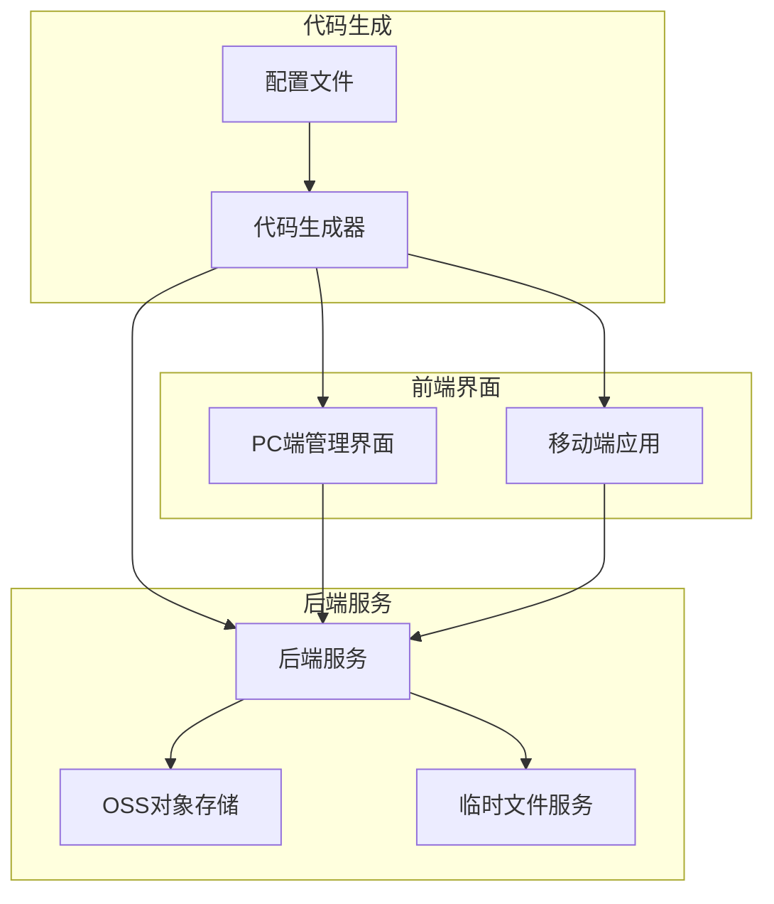
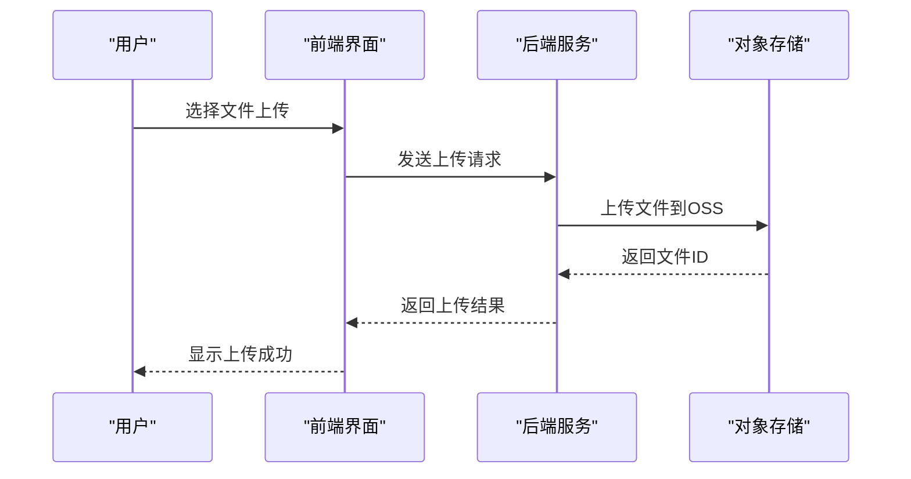
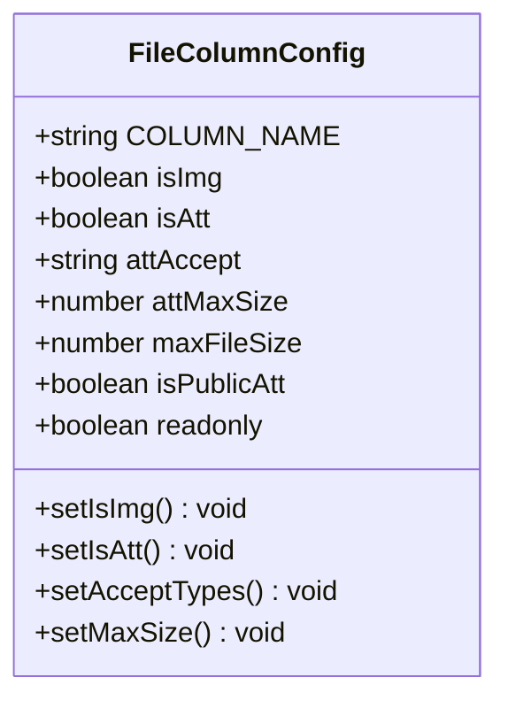
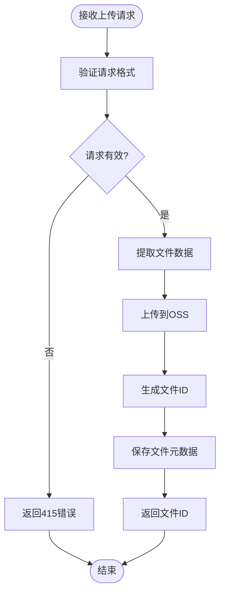
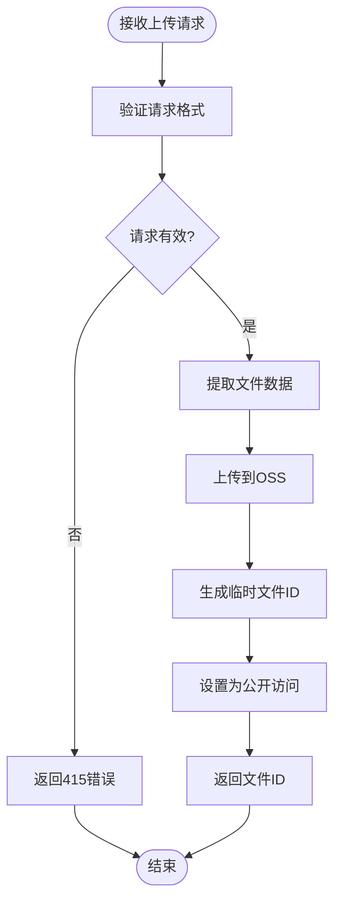
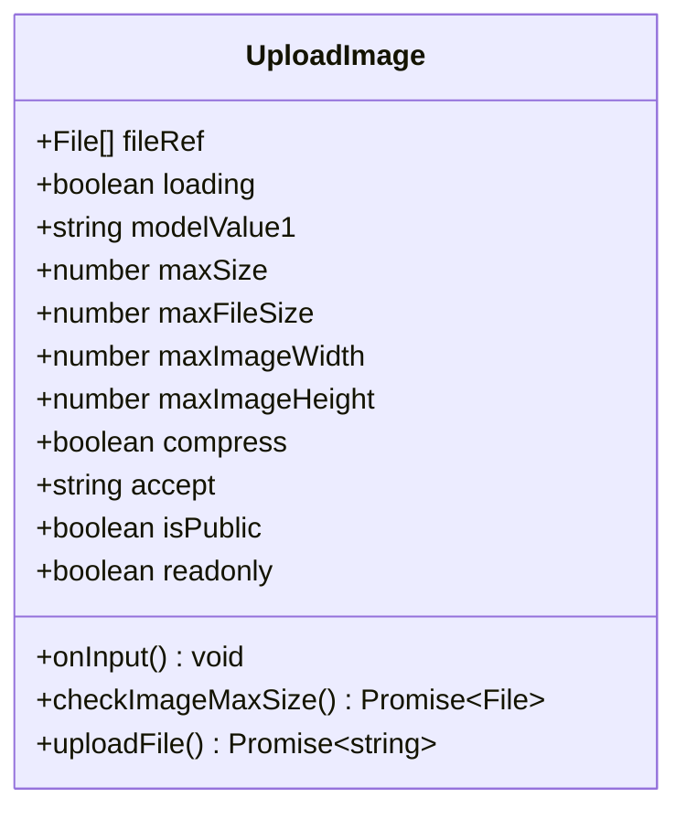
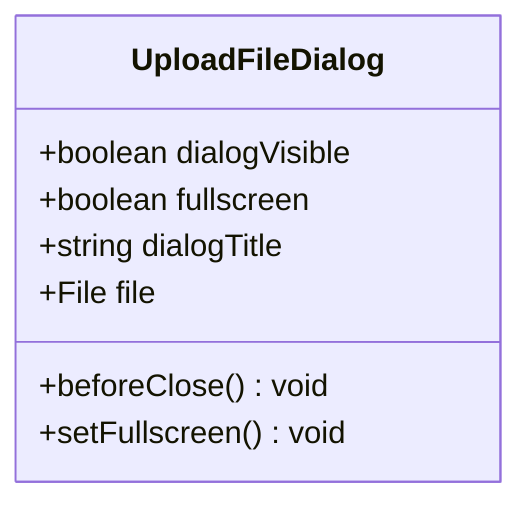
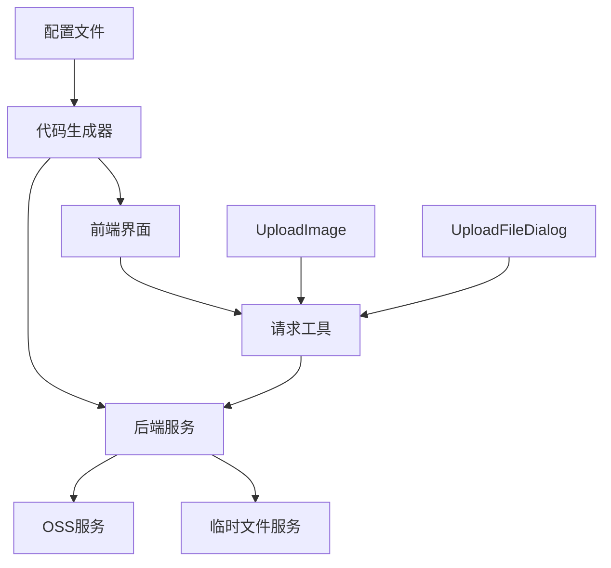

# 代码生成配置

**本文档中引用的文件**  
- [base.ts](https://github.com/sail-sail/nest/blob/main/codegen/src/tables/base/base.ts)
- [information_schema.ts](https://github.com/sail-sail/nest/blob/main/codegen/src/lib/information_schema.ts)
- [codegen.ts](https://github.com/sail-sail/nest/blob/main/codegen/src/lib/codegen.ts)
- [config.ts](https://github.com/sail-sail/nest/blob/main/codegen/src/config.ts)
- [oss.router.ts](https://github.com/sail-sail/nest/blob/main/deno/lib/oss/oss.router.ts)
- [tmpfile.router.ts](https://github.com/sail-sail/nest/blob/main/deno/lib/tmpfile/tmpfile.router.ts)
- [request.ts](https://github.com/sail-sail/nest/blob/main/pc/src/utils/request.ts)
- [UploadImage.vue](https://github.com/sail-sail/nest/blob/main/pc/src/components/UploadImage.vue)
- [UploadFileDialog.vue](https://github.com/sail-sail/nest/blob/main/pc/src/components/UploadFileDialog.vue)
- [Detail.vue](https://github.com/sail-sail/nest/blob/main/codegen/src/template/pc/src/views/[[mod_slash_table]]/Detail.vue)

## 目录
1. [简介](#简介)
2. [项目结构](#项目结构)
3. [核心组件](#核心组件)
4. [架构概述](#架构概述)
5. [详细组件分析](#详细组件分析)
6. [依赖分析](#依赖分析)
7. [性能考虑](#性能考虑)
8. [故障排除指南](#故障排除指南)
9. [结论](#结论)

## 简介
本文档详细说明了如何通过配置文件定义文件上传字段并自动生成相应代码。重点介绍表结构定义中文件字段的语法规范、参数配置和约束条件，以及代码生成引擎如何根据配置自动创建后端OSS服务接口、前端上传组件和GraphQL模式定义。同时涵盖多文件上传、文件关联关系、默认值配置的实现方法，自定义模板扩展方案，以及增量更新机制对手动修改代码的保护策略。

## 项目结构
项目采用模块化分层架构，主要包含代码生成器（codegen）、后端服务（deno）、前端管理界面（pc）和移动端应用（uni）四大模块。代码生成器负责解析配置并生成代码，后端服务提供API接口，前端界面实现用户交互。

**图表来源**  
- [base.ts](https://github.com/sail-sail/nest/blob/main/codegen/src/tables/base/base.ts)
- [config.ts](https://github.com/sail-sail/nest/blob/main/codegen/src/config.ts)

**章节来源**  
- [base.ts](https://github.com/sail-sail/nest/blob/main/codegen/src/tables/base/base.ts)
- [project_structure](https://github.com/sail-sail/nest/blob/main/project_structure)

## 核心组件
核心组件包括代码生成引擎、文件上传服务、前端上传组件和配置管理系统。代码生成引擎读取表结构配置，自动生成前后端代码；文件上传服务处理文件存储；前端组件提供用户友好的上传界面；配置系统定义文件字段的属性和行为。

**章节来源**  
- [codegen.ts](https://github.com/sail-sail/nest/blob/main/codegen/src/lib/codegen.ts)
- [oss.router.ts](https://github.com/sail-sail/nest/blob/main/deno/lib/oss/oss.router.ts)
- [UploadImage.vue](https://github.com/sail-sail/nest/blob/main/pc/src/components/UploadImage.vue)

## 架构概述
系统采用前后端分离架构，通过代码生成器实现配置驱动的开发模式。前端通过API调用后端服务，后端服务与对象存储系统交互完成文件上传下载。

**图表来源**  
- [oss.router.ts](https://github.com/sail-sail/nest/blob/main/deno/lib/oss/oss.router.ts)
- [request.ts](https://github.com/sail-sail/nest/blob/main/pc/src/utils/request.ts)

## 详细组件分析

### 文件字段配置分析
文件字段通过特定的命名约定和配置参数来定义，系统自动识别并生成相应的上传组件。

#### 配置语法规范
文件字段的配置遵循以下规则：
- 字段名为`img`或以`_img`结尾时，自动识别为图片字段
- 字段名为`att`或以`_att`结尾时，自动识别为附件字段
- 可通过`isImg`和`isAtt`属性显式指定字段类型

**图表来源**  
- [information_schema.ts](https://github.com/sail-sail/nest/blob/main/codegen/src/lib/information_schema.ts#L972-L1007)
- [base.ts](https://github.com/sail-sail/nest/blob/main/codegen/src/tables/base/base.ts)

#### 文件上传参数配置
文件字段支持多种参数配置，控制上传行为和组件外观：

| 参数 | 说明 | 示例 |
|------|------|------|
| `attAccept` | 允许的文件类型 | "image/svg+xml,image/png" |
| `attMaxSize` | 最大文件数量 | 5 |
| `maxFileSize` | 单个文件最大大小（字节） | 10485760 |
| `isPublicAtt` | 是否为公共文件 | true |
| `readonly` | 是否只读 | false |

**章节来源**  
- [base.ts](https://github.com/sail-sail/nest/blob/main/codegen/src/tables/base/base.ts)
- [config.ts](https://github.com/sail-sail/nest/blob/main/codegen/src/config.ts)

### 后端服务分析
后端提供两种文件上传接口：OSS服务和临时文件服务，支持公开和私有文件上传。

#### OSS上传接口

**图表来源**  
- [oss.router.ts](https://github.com/sail-sail/nest/blob/main/deno/lib/oss/oss.router.ts#L65-L97)

#### 临时文件上传接口

**图表来源**  
- [tmpfile.router.ts](https://github.com/sail-sail/nest/blob/main/deno/lib/tmpfile/tmpfile.router.ts#L59-L89)

### 前端组件分析
前端提供多种上传组件，支持图片和文件上传，具有丰富的配置选项。

#### 图片上传组件

**图表来源**  
- [UploadImage.vue](https://github.com/sail-sail/nest/blob/main/pc/src/components/UploadImage.vue#L309-L371)

#### 文件上传对话框

**图表来源**  
- [UploadFileDialog.vue](https://github.com/sail-sail/nest/blob/main/pc/src/components/UploadFileDialog.vue#L0-L58)

## 依赖分析
系统各组件之间存在明确的依赖关系，代码生成器作为核心枢纽，连接配置、后端和前端。

**图表来源**  
- [codegen.ts](https://github.com/sail-sail/nest/blob/main/codegen/src/lib/codegen.ts)
- [request.ts](https://github.com/sail-sail/nest/blob/main/pc/src/utils/request.ts)

## 性能考虑
- 文件上传采用流式处理，避免内存溢出
- 图片自动压缩，减少存储空间和带宽消耗
- 公共文件直接访问，减少服务器负载
- 前端组件支持懒加载，提升页面性能

## 故障排除指南
### 常见问题及解决方案
1. **文件上传失败**
   - 检查文件大小是否超过`maxFileSize`限制
   - 确认文件类型是否在`attAccept`允许范围内
   - 验证用户权限是否足够

2. **图片显示异常**
   - 检查图片是否成功上传并返回正确ID
   - 确认OSS服务是否正常运行
   - 验证图片URL是否可访问

3. **多文件上传数量限制**
   - 检查`attMaxSize`配置是否正确
   - 确认前端组件是否正确传递配置参数

**章节来源**  
- [UploadImage.vue](https://github.com/sail-sail/nest/blob/main/pc/src/components/UploadImage.vue#L309-L371)
- [oss.router.ts](https://github.com/sail-sail/nest/blob/main/deno/lib/oss/oss.router.ts#L65-L97)

## 结论
本系统通过配置驱动的代码生成机制，实现了文件上传功能的快速开发和部署。通过统一的配置规范和自动生成的前后端代码，确保了功能的一致性和可维护性。系统支持灵活的文件类型、大小和数量限制，满足各种业务场景需求。