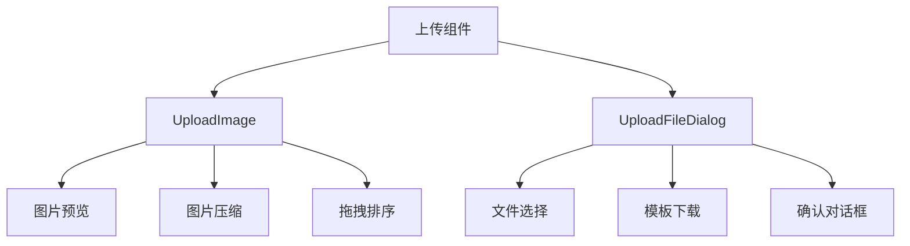
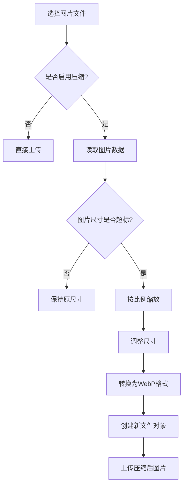
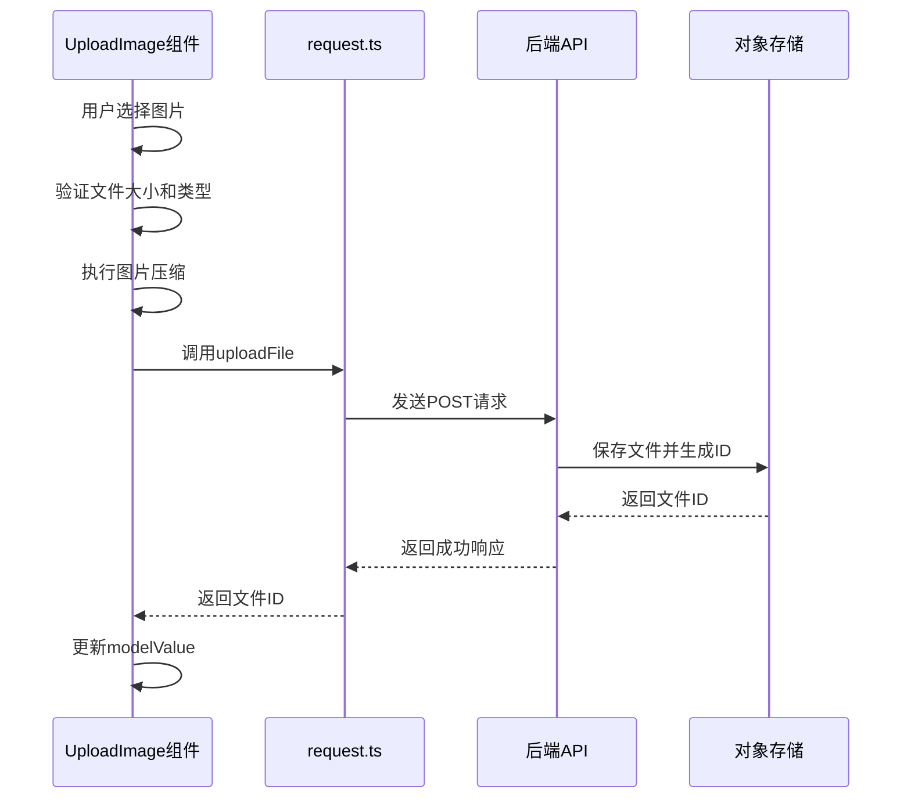
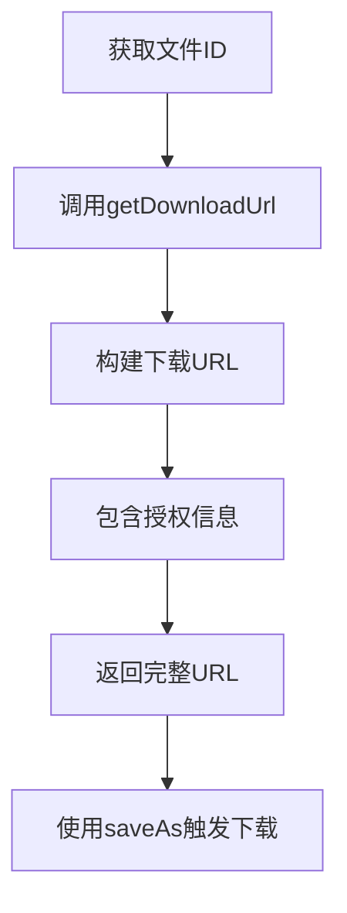
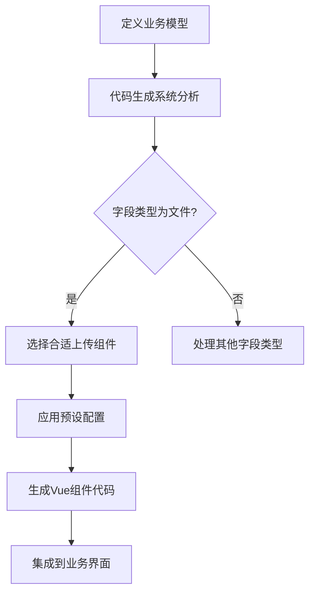

# 前端上传组件


**本文档引用的文件**   
- [UploadImage.vue](https://github.com/sail-sail/nest/blob/main/pc/src/components/UploadImage.vue)
- [UploadFileDialog.vue](https://github.com/sail-sail/nest/blob/main/pc/src/components/UploadFileDialog.vue)
- [image_util.ts](https://github.com/sail-sail/nest/blob/main/pc/src/utils/image_util.ts)
- [request.ts](https://github.com/sail-sail/nest/blob/main/pc/src/utils/request.ts)
- [oss.router.ts](https://github.com/sail-sail/nest/blob/main/deno/lib/oss/oss.router.ts)


## 目录
1. [简介](#简介)
2. [核心组件概览](#核心组件概览)
3. [UploadImage组件详解](#uploadimage组件详解)
4. [UploadFileDialog组件详解](#uploadfiledialog组件详解)
5. [图片压缩与处理机制](#图片压缩与处理机制)
6. [文件上传与下载流程](#文件上传与下载流程)
7. [组件定制化与集成](#组件定制化与集成)
8. [代码生成系统集成](#代码生成系统集成)
9. [最佳实践与故障排除](#最佳实践与故障排除)

## 简介
本文档详细介绍了前端上传组件的实现细节，重点分析了PC端Vue组件的实现。文档涵盖了UploadImage和UploadFileDialog两个核心组件的API接口、使用场景和最佳实践，深入解析了文件选择、预览生成、上传进度显示和错误提示等机制。同时，文档还详细说明了图片压缩算法、文件类型验证、大小限制和安全过滤的实现细节，以及组件的定制化方案和与代码生成系统的集成方法。

## 核心组件概览
前端上传组件主要由两个核心组件构成：UploadImage和UploadFileDialog。这两个组件分别用于处理图片上传和通用文件上传场景，提供了丰富的配置选项和事件回调，满足不同业务需求。



**图示来源**
- [UploadImage.vue](https://github.com/sail-sail/nest/blob/main/pc/src/components/UploadImage.vue)
- [UploadFileDialog.vue](https://github.com/sail-sail/nest/blob/main/pc/src/components/UploadFileDialog.vue)

## UploadImage组件详解
UploadImage组件是专门用于图片上传的Vue组件，提供了直观的图片预览界面和丰富的交互功能。

### Props属性
**UploadImage组件的Props属性**

| 属性名 | 类型 | 默认值 | 说明 |
|-------|------|--------|------|
| modelValue | string | undefined | 绑定的图片ID字符串，多个ID用逗号分隔 |
| maxFileSize | number | 52428800 | 最大文件大小（字节），默认50MB |
| maxSize | number | 1 | 最大上传图片数量 |
| accept | string | "image/webp,image/png,image/jpeg,image/svg+xml" | 接受的图片MIME类型 |
| readonly | boolean | false | 是否只读模式 |
| compress | boolean | true | 是否启用图片压缩 |
| maxImageWidth | number | 1920 | 压缩后最大图片宽度 |
| maxImageHeight | number | 1080 | 压缩后最大图片高度 |
| itemHeight | number | 100 | 预览项高度（像素） |
| pageInited | boolean | false | 页面是否已初始化 |
| db | string | "" | 数据库标识 |
| isPublic | boolean | false | 是否为公开文件 |

### Events事件
- **update:modelValue**: 当图片列表发生变化时触发，传递新的图片ID字符串

### Slots插槽
该组件未定义具名插槽，通过内置的UI元素提供完整的图片上传体验。

### 使用示例
```vue
<template>
  <UploadImage 
    v-model="imageIds" 
    :maxSize="3" 
    :maxFileSize="10485760" 
    itemHeight="120"
  />
</template>
```

**组件来源**
- [UploadImage.vue](https://github.com/sail-sail/nest/blob/main/pc/src/components/UploadImage.vue#L1-L523)

## UploadFileDialog组件详解
UploadFileDialog组件是一个通用的文件上传对话框组件，适用于各种文件类型的上传场景。

### Props属性
该组件主要通过showDialog方法的参数进行配置：

| 参数名 | 类型 | 说明 |
|-------|------|------|
| title | string | 对话框标题 |
| template | boolean | 是否显示导入模板选项 |
| templateName | string | 模板文件名 |
| accept | string | 接受的文件MIME类型 |

### Methods方法
- **showDialog**: 显示上传对话框，返回Promise，解析为上传的文件对象或undefined

### Events事件
- **downloadImportTemplate**: 当用户点击下载导入模板时触发

### 使用示例
```vue
<template>
  <el-button @click="openUploadDialog">上传文件</el-button>
  <UploadFileDialog ref="uploadFileDialog" @downloadImportTemplate="handleDownloadTemplate" />
</template>

<script>
export default {
  methods: {
    async openUploadDialog() {
      const file = await this.$refs.uploadFileDialog.showDialog({
        title: '上传文档',
        template: true,
        accept: '.doc,.docx,.pdf'
      });
      if (file) {
        // 处理上传的文件
        console.log('上传的文件:', file);
      }
    },
    handleDownloadTemplate() {
      // 处理模板下载
      console.log('下载模板');
    }
  }
}
</script>
```

**组件来源**
- [UploadFileDialog.vue](https://github.com/sail-sail/nest/blob/main/pc/src/components/UploadFileDialog.vue#L1-L289)

## 图片压缩与处理机制
图片上传组件集成了高效的图片压缩算法，确保上传的图片既保持良好质量又不会占用过多存储空间。

### 图片压缩流程


**图示来源**
- [image_util.ts](https://github.com/sail-sail/nest/blob/main/pc/src/utils/image_util.ts#L24-L79)
- [UploadImage.vue](https://github.com/sail-sail/nest/blob/main/pc/src/components/UploadImage.vue#L342-L350)

### 压缩算法实现
图片压缩功能主要由`checkImageMaxSize`函数实现，该函数位于`image_util.ts`文件中：

```typescript
export async function checkImageMaxSize(
  file: File,
  opts?: {
    compress: boolean,
    maxImageWidth?: number,
    maxImageHeight?: number,
  },
) {
  const file2 = await workerFn(file, opts);
  return file2;
}
```

`workerFn`函数执行具体的压缩逻辑：
1. 将文件转换为ArrayBuffer
2. 使用Canvas API读取图片元数据
3. 根据配置的最大宽度和高度进行比例缩放
4. 使用`@jsquash/resize`库进行图片尺寸调整
5. 使用`@jsquash/webp`库将图片转换为WebP格式
6. 创建新的File对象并返回

**算法来源**
- [image_util.ts](https://github.com/sail-sail/nest/blob/main/pc/src/utils/image_util.ts#L24-L79)

## 文件上传与下载流程
上传组件与后端服务通过标准化的API进行交互，实现了安全可靠的文件传输。

### 上传流程


**流程来源**
- [UploadImage.vue](https://github.com/sail-sail/nest/blob/main/pc/src/components/UploadImage.vue#L348-L367)
- [request.ts](https://github.com/sail-sail/nest/blob/main/pc/src/utils/request.ts#L153-L207)

### 下载流程


**流程来源**
- [request.ts](https://github.com/sail-sail/nest/blob/main/pc/src/utils/request.ts#L269-L306)
- [AttDialog.vue](https://github.com/sail-sail/nest/blob/main/pc/src/components/AttDialog.vue#L657-L666)

### 核心API函数
#### uploadFile函数
```typescript
export async function uploadFile(
  file: File,
  data?: { [key: string]: any },
  config?: {
    url?: string;
    method?: string;
    type?: "oss"|"tmpfile",
    data?: FormData;
    header?: Headers;
    notLoading?: boolean;
    showErrMsg?: boolean;
    duration?: number;
    db?: string;
    isPublic?: boolean;
  },
)
```

该函数处理文件上传的核心逻辑，包括：
- 自动构建请求URL
- 设置授权头信息
- 处理数据库和公开属性
- 显示加载状态
- 错误处理和消息提示

#### getDownloadUrl函数
```typescript
export function getDownloadUrl(
  model: {
    id: string;
    filename?: string;
    inline?: "0"|"1";
  } | string,
  type: "oss" | "tmpfile" = "oss",
): string
```

该函数生成文件下载URL，包含文件ID、文件名、内联显示选项和授权信息。

**API来源**
- [request.ts](https://github.com/sail-sail/nest/blob/main/pc/src/utils/request.ts#L153-L306)

## 组件定制化与集成
上传组件提供了多种方式支持定制化需求和与其他组件的集成。

### 样式覆盖
组件使用UnoCSS进行样式管理，可以通过以下方式覆盖默认样式：

```scss
/* 自定义上传组件样式 */
.custom-upload-image {
  @apply un-w-full un-flex un-flex-wrap un-gap-2;
  
  .upload_image_item {
    @apply un-relative un-rounded un-transition-all;
    
    &:hover {
      @apply un-shadow-md;
    }
  }
  
  .upload_image_empty {
    @apply un-border-2 un-border-dashed un-border-gray-300;
    
    &:hover {
      @apply un-border-primary;
    }
  }
}
```

### 功能扩展
可以通过以下方式扩展组件功能：

1. **添加水印**: 在图片压缩后处理阶段添加水印
2. **EXIF信息处理**: 读取和处理图片的EXIF信息
3. **批量操作**: 添加批量删除、批量下载等功能
4. **上传进度**: 显示详细的上传进度信息

### 表单集成
上传组件可以轻松集成到各种表单中：

```vue
<template>
  <el-form :model="form" ref="formRef">
    <el-form-item label="产品图片" prop="images">
      <UploadImage 
        v-model="form.images" 
        :maxSize="5"
        :maxFileSize="10485760"
      />
    </el-form-item>
    <el-form-item label="产品文档" prop="documents">
      <el-button @click="openDocumentUpload">上传文档</el-button>
      <span v-if="form.documents">{{ form.documents.name }}</span>
    </el-form-item>
  </el-form>
</template>
```

**集成来源**
- [UploadImage.vue](https://github.com/sail-sail/nest/blob/main/pc/src/components/UploadImage.vue)
- [UploadFileDialog.vue](https://github.com/sail-sail/nest/blob/main/pc/src/components/UploadFileDialog.vue)

## 代码生成系统集成
上传组件与代码生成系统紧密集成，能够自动生成适配不同业务场景的上传界面。

### 代码生成配置
代码生成系统通过配置文件定义上传组件的生成规则：

```typescript
// codegen/src/tables/base/base.ts
const uploadConfig = {
  image: {
    component: 'UploadImage',
    props: {
      maxSize: 1,
      maxFileSize: 52428800,
      accept: 'image/webp,image/png,image/jpeg',
      compress: true,
      maxImageWidth: 1920,
      maxImageHeight: 1080
    }
  },
  document: {
    component: 'UploadFileDialog',
    props: {
      accept: '.pdf,.doc,.docx,.xls,.xlsx'
    }
  }
};
```

### 自动生成流程


**集成来源**
- [codegen/src/tables/base/base.ts](https://github.com/sail-sail/nest/blob/main/codegen/src/tables/base/base.ts)
- [codegen/src/template/pc\src/views\[[mod_slash_table]]](https://github.com/sail-sail/nest/blob/main/codegen/src/template/pc\src/views\[[mod_slash_table]])

## 最佳实践与故障排除
### 最佳实践
1. **合理设置文件大小限制**: 根据业务需求和网络环境设置合理的文件大小限制
2. **启用图片压缩**: 对于图片上传场景，建议启用压缩功能以优化存储和加载性能
3. **提供清晰的用户提示**: 在用户操作时提供明确的反馈信息
4. **处理边缘情况**: 考虑网络中断、文件损坏等异常情况的处理

### 常见问题及解决方案
**问题1: 上传的图片显示为占位符**
- **原因**: 图片压缩过程中出现错误
- **解决方案**: 检查浏览器是否支持WebAssembly，确保`@jsquash`相关库正确加载

**问题2: 上传大文件时浏览器卡顿**
- **原因**: 图片压缩在主线程执行，阻塞UI
- **解决方案**: 考虑将压缩逻辑移至Web Worker中执行

**问题3: 文件上传后无法下载**
- **原因**: 授权信息未正确传递
- **解决方案**: 确保`getDownloadUrl`函数正确包含授权头信息

**问题4: 多图片上传时顺序混乱**
- **原因**: 拖拽排序功能未正确初始化
- **解决方案**: 确保`pageInited`属性正确设置，触发排序功能初始化

**故障排除来源**
- [UploadImage.vue](https://github.com/sail-sail/nest/blob/main/pc/src/components/UploadImage.vue)
- [request.ts](https://github.com/sail-sail/nest/blob/main/pc/src/utils/request.ts)
- [oss.router.ts](https://github.com/sail-sail/nest/blob/main/deno/lib/oss/oss.router.ts#L65-L97)