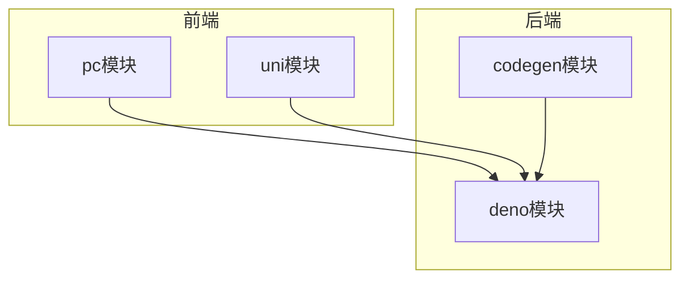
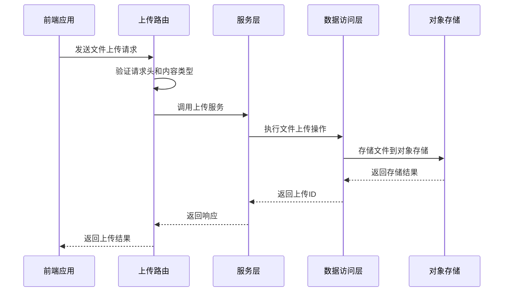
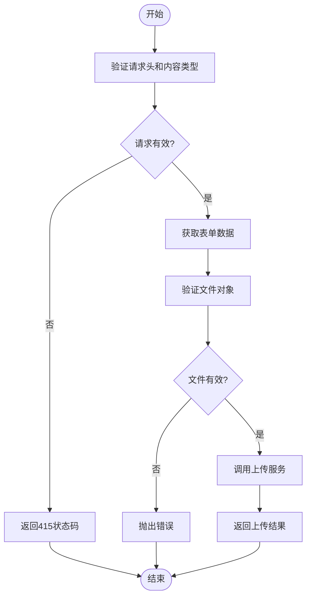
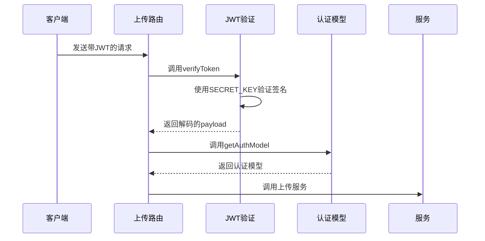
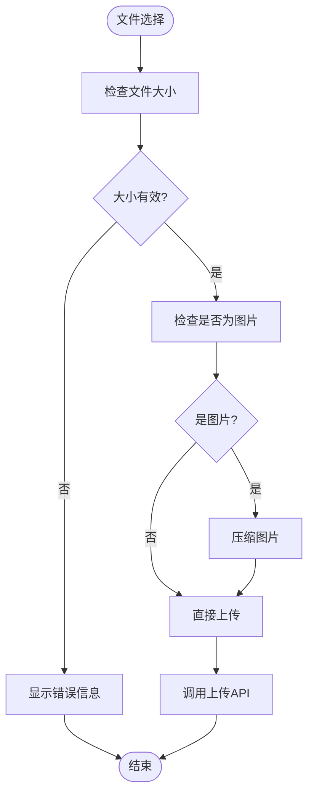
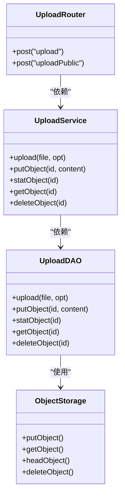

# 安全验证机制

**本文档引用文件**   
- [tmpfile.router.ts](https://github.com/sail-sail/nest/blob/main/deno\lib\tmpfile\tmpfile.router.ts)
- [oss.router.ts](https://github.com/sail-sail/nest/blob/main/deno\lib\oss\oss.router.ts)
- [tmpfile.service.ts](https://github.com/sail-sail/nest/blob/main/deno\lib\tmpfile\tmpfile.service.ts)
- [tmpfile.dao.ts](https://github.com/sail-sail/nest/blob/main/deno\lib\tmpfile\tmpfile.dao.ts)
- [oss.service.ts](https://github.com/sail-sail/nest/blob/main/deno\lib\oss\oss.service.ts)
- [oss.dao.ts](https://github.com/sail-sail/nest/blob/main/deno\lib\oss\oss.dao.ts)
- [auth.constants.ts](https://github.com/sail-sail/nest/blob/main/deno\lib\auth\auth.constants.ts)
- [auth.dao.ts](https://github.com/sail-sail/nest/blob/main/deno\lib\auth\auth.dao.ts)
- [UploadImage.vue](https://github.com/sail-sail/nest/blob/main/pc\src\components\UploadImage.vue)
- [AttDialog.vue](https://github.com/sail-sail/nest/blob/main/pc\src\components\AttDialog.vue)
- [image_util.ts](https://github.com/sail-sail/nest/blob/main/pc\src\utils\image_util.ts)

## 目录
1. [简介](#简介)
2. [项目结构](#项目结构)
3. [核心组件](#核心组件)
4. [架构概述](#架构概述)
5. [详细组件分析](#详细组件分析)
6. [依赖分析](#依赖分析)
7. [性能考虑](#性能考虑)
8. [故障排除指南](#故障排除指南)
9. [结论](#结论)

## 简介
本文档系统阐述了文件上传安全验证的多层次防护体系，涵盖从客户端到服务端的完整安全机制。文档详细说明了前端文件类型和大小验证、后端MIME类型检查、存储路径安全策略以及基于JWT的上传权限验证机制。通过分析代码实现，展示了如何有效防止恶意文件上传，包括文件名净化、扩展名白名单和内容检测等措施。

## 项目结构
项目采用分层架构设计，主要包含codegen、deno、pc和uni四个核心模块。codegen模块负责代码生成，deno模块实现后端服务逻辑，pc模块为PC端前端应用，uni模块为跨平台移动应用。各模块通过清晰的目录结构组织，确保代码的可维护性和可扩展性。

**图示来源**
- [tmpfile.router.ts](https://github.com/sail-sail/nest/blob/main/deno\lib\tmpfile\tmpfile.router.ts)
- [oss.router.ts](https://github.com/sail-sail/nest/blob/main/deno\lib\oss\oss.router.ts)

## 核心组件
系统核心组件包括文件上传路由、服务层、数据访问层和安全验证模块。文件上传功能通过多层验证确保安全性，包括前端验证、后端内容类型检查和JWT权限验证。组件间通过清晰的接口定义进行通信，确保系统的模块化和可测试性。

**组件来源**
- [tmpfile.service.ts](https://github.com/sail-sail/nest/blob/main/deno\lib\tmpfile\tmpfile.service.ts)
- [oss.service.ts](https://github.com/sail-sail/nest/blob/main/deno\lib\oss\oss.service.ts)

## 架构概述
系统采用前后端分离架构，前端通过API与后端交互。文件上传流程包含多个安全验证环节，从前端的文件大小检查到后端的MIME类型验证，再到JWT权限认证，形成完整的安全防护链。文件存储采用S3兼容的对象存储服务，确保数据的安全性和可靠性。

**图示来源**
- [tmpfile.router.ts](https://github.com/sail-sail/nest/blob/main/deno\lib\tmpfile\tmpfile.router.ts#L0-L57)
- [tmpfile.service.ts](https://github.com/sail-sail/nest/blob/main/deno\lib\tmpfile\tmpfile.service.ts#L0-L37)

## 详细组件分析

### 文件上传路由分析
文件上传路由组件负责处理文件上传请求，实现多层安全验证。路由首先验证请求头和内容类型，确保请求格式正确。然后通过JWT验证用户权限，最后调用服务层处理文件上传。

#### 路由实现

**图示来源**
- [tmpfile.router.ts](https://github.com/sail-sail/nest/blob/main/deno\lib\tmpfile\tmpfile.router.ts#L0-L57)
- [oss.router.ts](https://github.com/sail-sail/nest/blob/main/deno\lib\oss\oss.router.ts#L65-L97)

**组件来源**
- [tmpfile.router.ts](https://github.com/sail-sail/nest/blob/main/deno\lib\tmpfile\tmpfile.router.ts#L0-L133)
- [oss.router.ts](https://github.com/sail-sail/nest/blob/main/deno\lib\oss\oss.router.ts#L65-L262)

### JWT权限验证分析
JWT权限验证机制确保只有授权用户才能上传文件。系统使用预定义的密钥对JWT进行签名和验证，通过解析token获取用户身份信息，实现细粒度的权限控制。

#### 验证流程

**图示来源**
- [auth.constants.ts](https://github.com/sail-sail/nest/blob/main/deno\lib\auth\auth.constants.ts#L0-L31)
- [auth.dao.ts](https://github.com/sail-sail/nest/blob/main/deno\lib\auth\auth.dao.ts#L165-L218)

**组件来源**
- [auth.constants.ts](https://github.com/sail-sail/nest/blob/main/deno\lib\auth\auth.constants.ts#L0-L31)
- [auth.dao.ts](https://github.com/sail-sail/nest/blob/main/deno\lib\auth\auth.dao.ts#L165-L218)

### 前端验证分析
前端组件实现了文件上传的初步验证，包括文件大小限制和图片压缩处理。通过在用户选择文件时立即进行验证，可以快速反馈错误信息，提升用户体验。

#### 前端验证流程

**图示来源**
- [UploadImage.vue](https://github.com/sail-sail/nest/blob/main/pc\src\components\UploadImage.vue#L309-L371)
- [image_util.ts](https://github.com/sail-sail/nest/blob/main/pc\src\utils\image_util.ts#L24-L79)

**组件来源**
- [UploadImage.vue](https://github.com/sail-sail/nest/blob/main/pc\src\components\UploadImage.vue#L309-L371)
- [AttDialog.vue](https://github.com/sail-sail/nest/blob/main/pc\src\components\AttDialog.vue#L621-L666)
- [image_util.ts](https://github.com/sail-sail/nest/blob/main/pc\src\utils\image_util.ts#L24-L79)

## 依赖分析
系统各组件间存在清晰的依赖关系，遵循依赖倒置原则。高层模块依赖于抽象接口，低层模块实现具体功能。这种设计提高了系统的可维护性和可测试性，同时降低了模块间的耦合度。

**图示来源**
- [tmpfile.router.ts](https://github.com/sail-sail/nest/blob/main/deno\lib\tmpfile\tmpfile.router.ts)
- [tmpfile.service.ts](https://github.com/sail-sail/nest/blob/main/deno\lib\tmpfile\tmpfile.service.ts)
- [tmpfile.dao.ts](https://github.com/sail-sail/nest/blob/main/deno\lib\tmpfile\tmpfile.dao.ts)

**组件来源**
- [tmpfile.router.ts](https://github.com/sail-sail/nest/blob/main/deno\lib\tmpfile\tmpfile.router.ts)
- [tmpfile.service.ts](https://github.com/sail-sail/nest/blob/main/deno\lib\tmpfile\tmpfile.service.ts)
- [tmpfile.dao.ts](https://github.com/sail-sail/nest/blob/main/deno\lib\tmpfile\tmpfile.dao.ts)

## 性能考虑
文件上传系统的性能主要受网络传输、文件处理和存储操作的影响。系统通过异步处理和流式传输优化性能，避免阻塞主线程。图片压缩功能在前端执行，减少服务器处理负担。大文件上传采用分块上传策略，提高上传成功率和用户体验。

## 故障排除指南
常见问题包括文件上传失败、权限验证错误和存储连接问题。排查时应首先检查请求头和参数是否正确，然后验证JWT token的有效性，最后确认对象存储服务的配置和连接状态。日志系统记录了详细的错误信息，有助于快速定位和解决问题。

**组件来源**
- [tmpfile.dao.ts](https://github.com/sail-sail/nest/blob/main/deno\lib\tmpfile\tmpfile.dao.ts#L0-L116)
- [oss.dao.ts](https://github.com/sail-sail/nest/blob/main/deno\lib\oss\oss.dao.ts#L0-L134)

## 结论
本文档详细分析了文件上传安全验证系统的架构和实现。系统通过多层次的安全验证机制，从前端到后端构建了完整的防护体系。基于JWT的权限验证确保了操作的安全性，S3兼容的对象存储提供了可靠的数据存储方案。系统的模块化设计和清晰的依赖关系使其具有良好的可维护性和可扩展性。