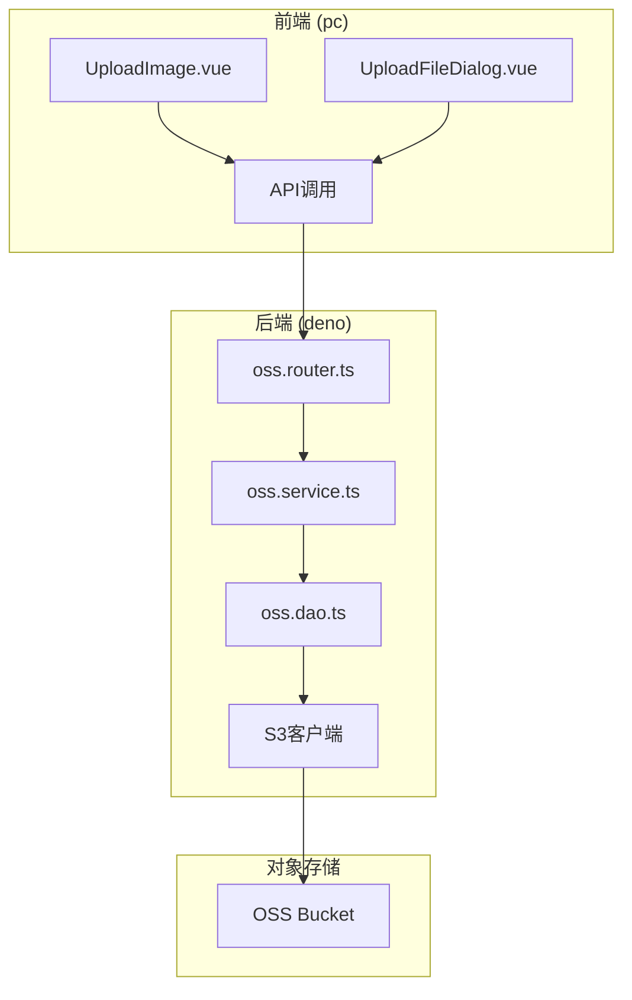
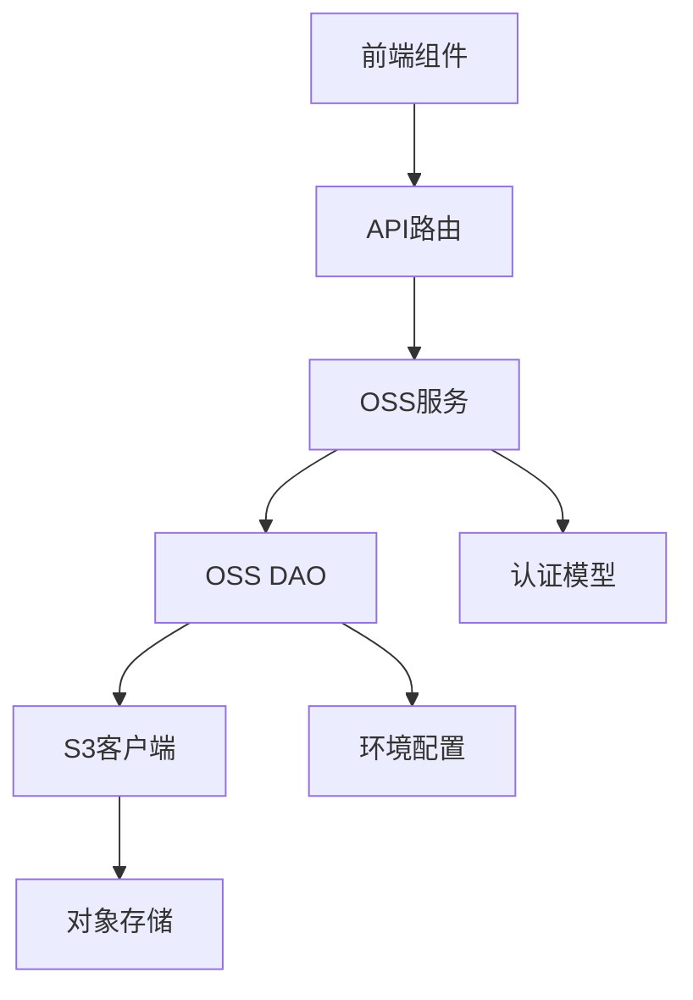
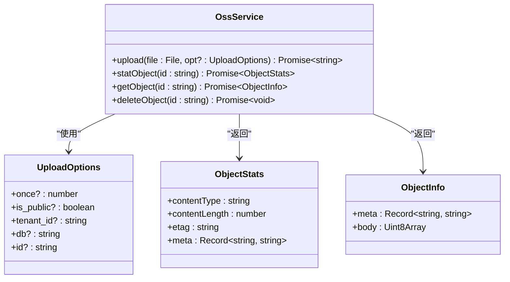
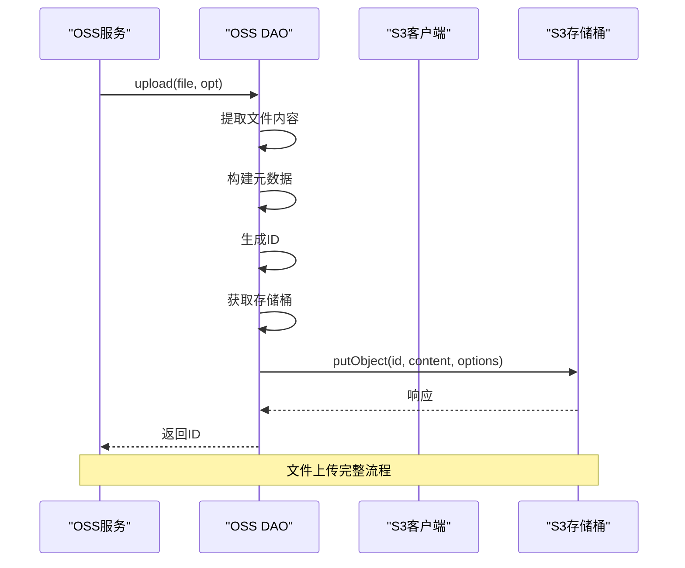
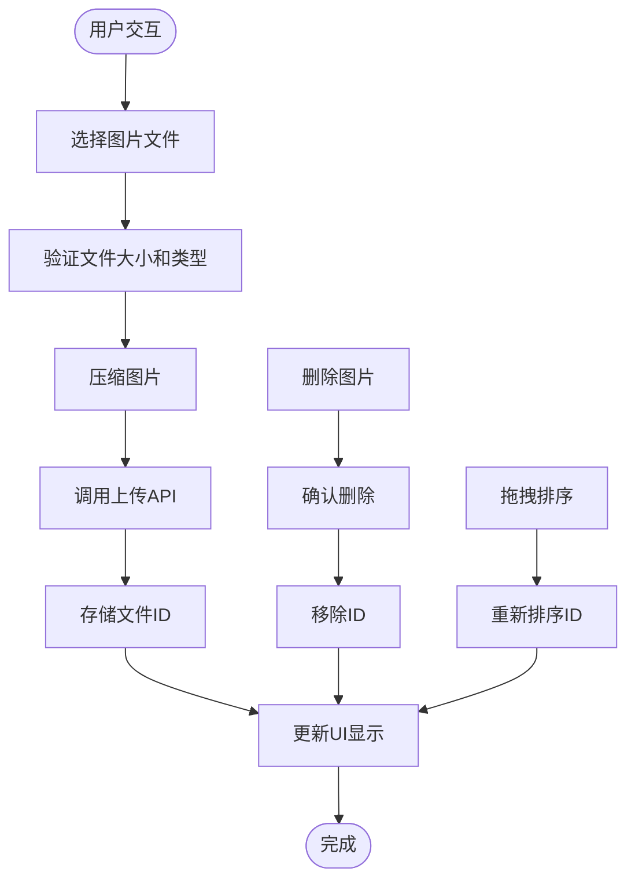
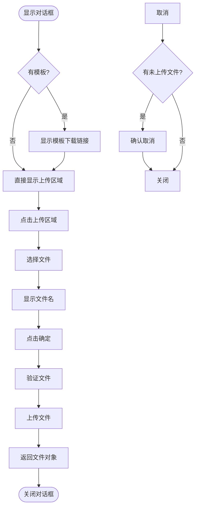
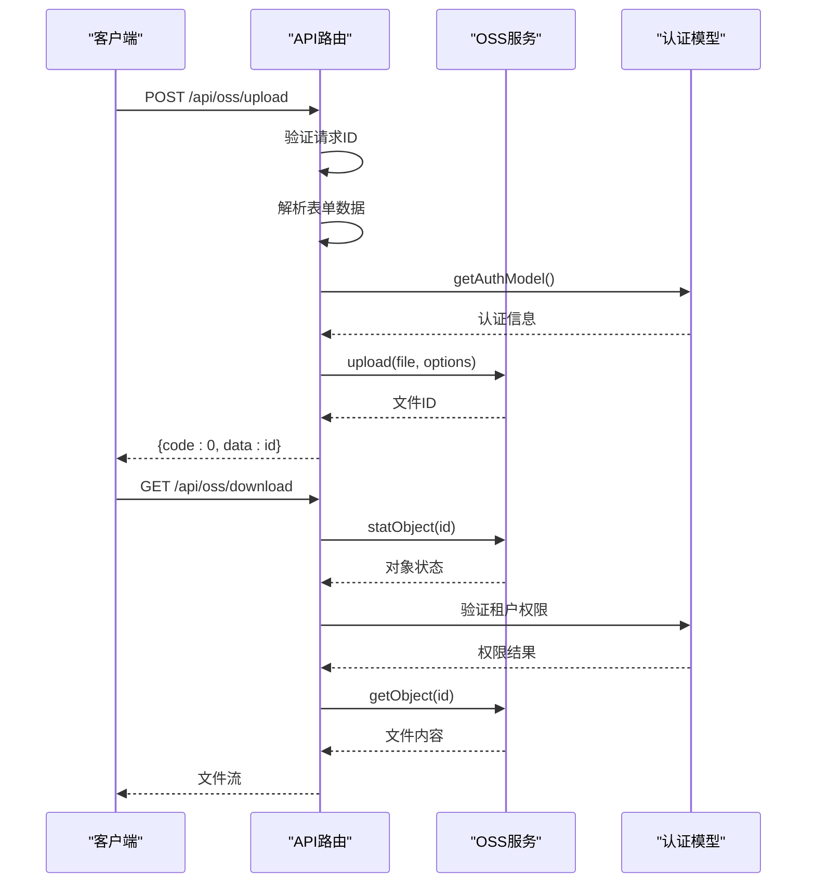
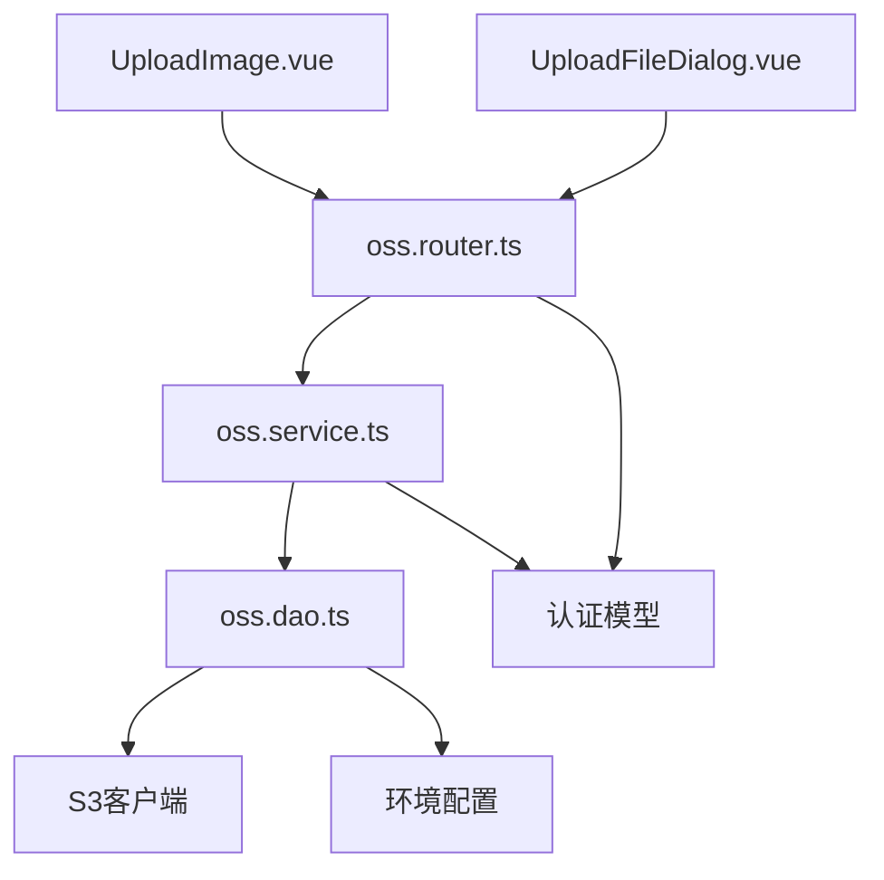

# 文件上传

**本文档引用文件**  
- [oss.service.ts](https://github.com/sail-sail/nest/blob/main/deno\lib\oss\oss.service.ts)
- [oss.dao.ts](https://github.com/sail-sail/nest/blob/main/deno\lib\oss\oss.dao.ts)
- [oss.router.ts](https://github.com/sail-sail/nest/blob/main/deno\lib\oss\oss.router.ts)
- [UploadImage.vue](https://github.com/sail-sail/nest/blob/main/pc\src\components\UploadImage.vue)
- [UploadFileDialog.vue](https://github.com/sail-sail/nest/blob/main/pc\src\components\UploadFileDialog.vue)
- [client.ts](https://github.com/sail-sail/nest/blob/main/deno\lib\S3\client.ts)
- [mod.ts](https://github.com/sail-sail/nest/blob/main/deno\lib\S3\mod.ts)

## 目录
1. [简介](#简介)
2. [项目结构](#项目结构)
3. [核心组件](#核心组件)
4. [架构概览](#架构概览)
5. [详细组件分析](#详细组件分析)
6. [依赖分析](#依赖分析)
7. [性能考虑](#性能考虑)
8. [故障排除指南](#故障排除指南)
9. [结论](#结论)

## 简介
本文档全面介绍基于OSS（对象存储服务）的文件上传功能实现。系统采用前后端分离架构，前端使用Vue组件实现用户交互，后端通过Deno运行时与S3兼容的对象存储服务集成。文档详细阐述了文件上传的完整流程，包括前端选择、后端处理、OSS存储、权限验证和安全机制。重点分析了图片上传组件、通用文件上传对话框、OSS服务层和数据访问层的实现细节。

## 项目结构
系统采用模块化分层架构，主要分为前端(PC端)、后端(Deno服务)和共享库三大部分。前端位于`pc`目录，后端服务位于`deno`目录，共享工具和库位于`lib`目录。

**图示来源**  
- [UploadImage.vue](https://github.com/sail-sail/nest/blob/main/pc\src\components\UploadImage.vue)
- [UploadFileDialog.vue](https://github.com/sail-sail/nest/blob/main/pc\src\components\UploadFileDialog.vue)
- [oss.router.ts](https://github.com/sail-sail/nest/blob/main/deno\lib\oss\oss.router.ts)
- [oss.service.ts](https://github.com/sail-sail/nest/blob/main/deno\lib\oss\oss.service.ts)
- [oss.dao.ts](https://github.com/sail-sail/nest/blob/main/deno\lib\oss\oss.dao.ts)

## 核心组件
系统核心组件包括前端上传组件、OSS服务层和S3客户端。前端组件负责用户交互和文件选择，OSS服务层处理业务逻辑和权限验证，S3客户端负责与对象存储服务的底层通信。所有组件通过清晰的接口进行通信，实现了高内聚低耦合的设计原则。

**组件来源**  
- [oss.service.ts](https://github.com/sail-sail/nest/blob/main/deno\lib\oss\oss.service.ts#L1-L32)
- [UploadImage.vue](https://github.com/sail-sail/nest/blob/main/pc\src\components\UploadImage.vue#L1-L523)

## 架构概览
系统采用典型的三层架构：表示层、业务逻辑层和数据访问层。表示层由Vue组件构成，业务逻辑层由OSS服务实现，数据访问层由OSS DAO处理。API路由作为入口点，协调各层之间的调用。

**图示来源**  
- [oss.router.ts](https://github.com/sail-sail/nest/blob/main/deno\lib\oss\oss.router.ts#L1-L410)
- [oss.service.ts](https://github.com/sail-sail/nest/blob/main/deno\lib\oss\oss.service.ts#L1-L32)
- [oss.dao.ts](https://github.com/sail-sail/nest/blob/main/deno\lib\oss\oss.dao.ts#L1-L135)

## 详细组件分析

### OSS服务层分析
OSS服务层是业务逻辑的核心，封装了文件上传、下载、状态查询和删除等操作。服务层不直接处理HTTP请求，而是为路由层提供干净的API接口。

**图示来源**  
- [oss.service.ts](https://github.com/sail-sail/nest/blob/main/deno\lib\oss\oss.service.ts#L1-L32)

**组件来源**  
- [oss.service.ts](https://github.com/sail-sail/nest/blob/main/deno\lib\oss\oss.service.ts#L1-L32)

### OSS数据访问层分析
OSS DAO层负责与S3客户端的直接交互，处理底层的存储操作和错误处理。DAO层还管理S3存储桶的连接和配置。

**图示来源**  
- [oss.dao.ts](https://github.com/sail-sail/nest/blob/main/deno\lib\oss\oss.dao.ts#L1-L135)
- [oss.service.ts](https://github.com/sail-sail/nest/blob/main/deno\lib\oss\oss.service.ts#L1-L32)

**组件来源**  
- [oss.dao.ts](https://github.com/sail-sail/nest/blob/main/deno\lib\oss\oss.dao.ts#L1-L135)

### 图片上传组件分析
图片上传组件提供用户友好的界面，支持多图上传、拖拽排序、预览和删除功能。组件还集成了图片压缩和尺寸限制。

**图示来源**  
- [UploadImage.vue](https://github.com/sail-sail/nest/blob/main/pc\src\components\UploadImage.vue#L1-L523)

**组件来源**  
- [UploadImage.vue](https://github.com/sail-sail/nest/blob/main/pc\src\components\UploadImage.vue#L1-L523)

### 文件上传对话框分析
文件上传对话框提供通用的文件上传界面，支持模板下载和文件验证，适用于各种文件类型上传场景。

**图示来源**  
- [UploadFileDialog.vue](https://github.com/sail-sail/nest/blob/main/pc\src\components\UploadFileDialog.vue#L1-L289)

**组件来源**  
- [UploadFileDialog.vue](https://github.com/sail-sail/nest/blob/main/pc\src\components\UploadFileDialog.vue#L1-L289)

### API路由分析
API路由处理HTTP请求，验证权限，并调用相应的服务方法。路由层实现了上传、下载和图片处理等端点。

**图示来源**  
- [oss.router.ts](https://github.com/sail-sail/nest/blob/main/deno\lib\oss\oss.router.ts#L1-L410)

**组件来源**  
- [oss.router.ts](https://github.com/sail-sail/nest/blob/main/deno\lib\oss\oss.router.ts#L1-L410)

## 依赖分析
系统依赖关系清晰，各层之间通过接口进行通信。前端依赖API路由，路由依赖服务层，服务层依赖DAO层，DAO层依赖S3客户端。

**图示来源**  
- [oss.router.ts](https://github.com/sail-sail/nest/blob/main/deno\lib\oss\oss.router.ts#L1-L410)
- [oss.service.ts](https://github.com/sail-sail/nest/blob/main/deno\lib\oss\oss.service.ts#L1-L32)
- [oss.dao.ts](https://github.com/sail-sail/nest/blob/main/deno\lib\oss\oss.dao.ts#L1-L135)

**组件来源**  
- [oss.router.ts](https://github.com/sail-sail/nest/blob/main/deno\lib\oss\oss.router.ts#L1-L410)
- [oss.service.ts](https://github.com/sail-sail/nest/blob/main/deno\lib\oss\oss.service.ts#L1-L32)
- [oss.dao.ts](https://github.com/sail-sail/nest/blob/main/deno\lib\oss\oss.dao.ts#L1-L135)

## 性能考虑
系统在性能方面进行了多项优化：使用UUID作为文件ID避免冲突，实现ETag缓存验证减少带宽消耗，图片缩略图缓存提高访问速度。大文件上传采用分块处理，避免内存溢出。前端组件支持多图上传和拖拽排序，提升用户体验。

## 故障排除指南
常见问题及解决方案：
- **上传失败**: 检查OSS配置（accessKey、secretKey、endpoint、bucket）是否正确
- **权限错误**: 验证租户ID是否匹配，公共文件需设置is_public=true
- **文件找不到**: 检查文件ID是否正确，确认文件已成功上传
- **图片不显示**: 验证图片处理参数（宽度、高度、格式）是否正确
- **内存不足**: 对于大文件上传，考虑实现分片上传

**组件来源**  
- [oss.dao.ts](https://github.com/sail-sail/nest/blob/main/deno\lib\oss\oss.dao.ts#L1-L135)
- [oss.router.ts](https://github.com/sail-sail/nest/blob/main/deno\lib\oss\oss.router.ts#L1-L410)

## 结论
本文件上传系统实现了完整的OSS集成方案，具有良好的架构设计和可扩展性。系统支持多种文件类型上传，提供丰富的前端组件，具备完善的权限控制和安全机制。通过合理的分层设计和清晰的接口定义，系统易于维护和扩展。建议未来增加分片上传、断点续传和上传进度显示等高级功能，进一步提升大文件上传体验。