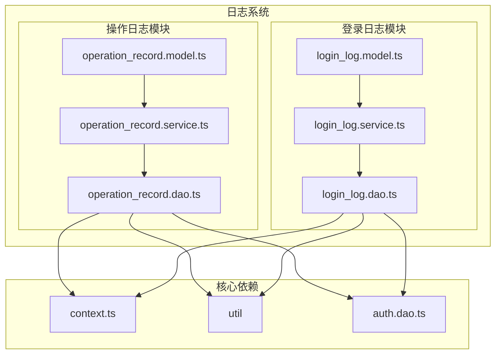
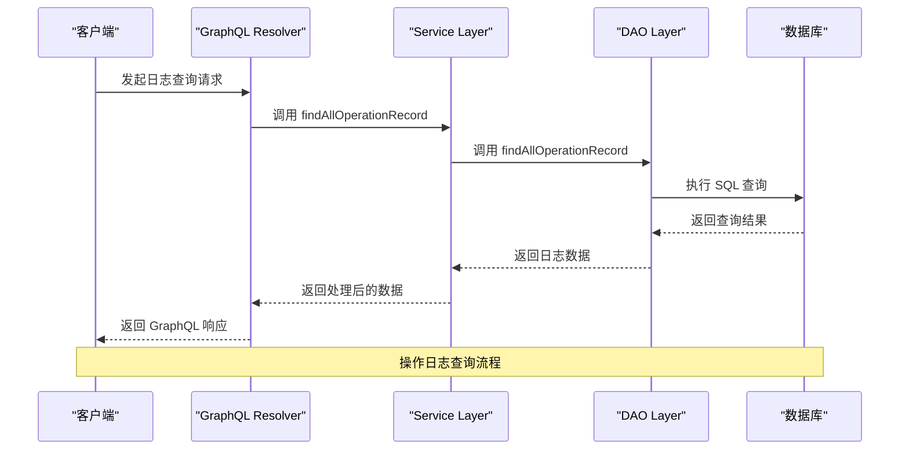
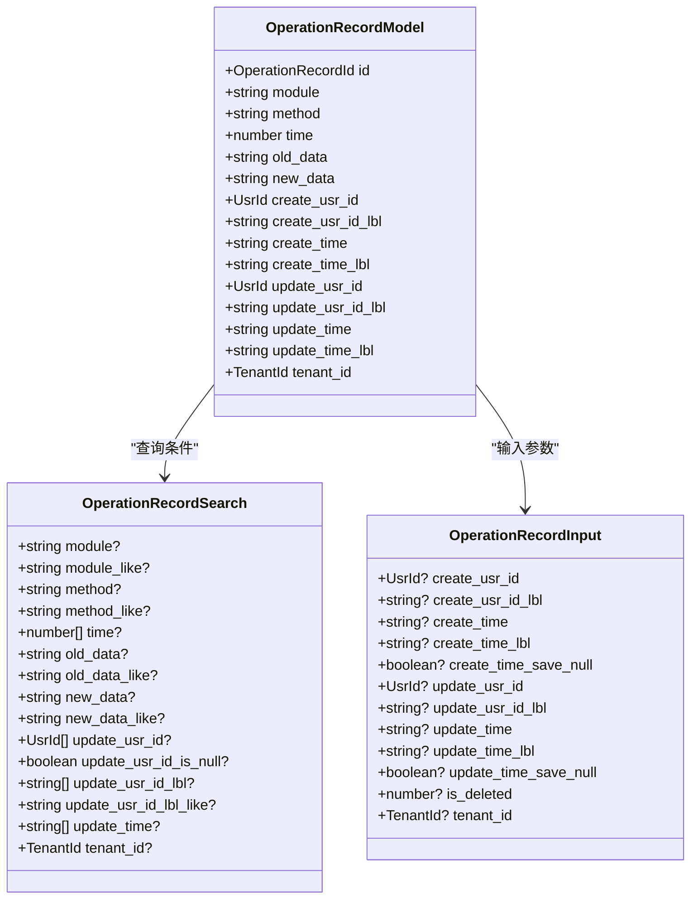
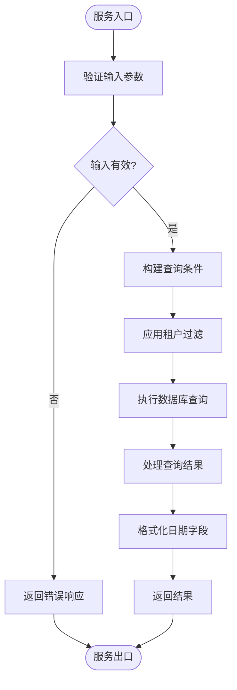
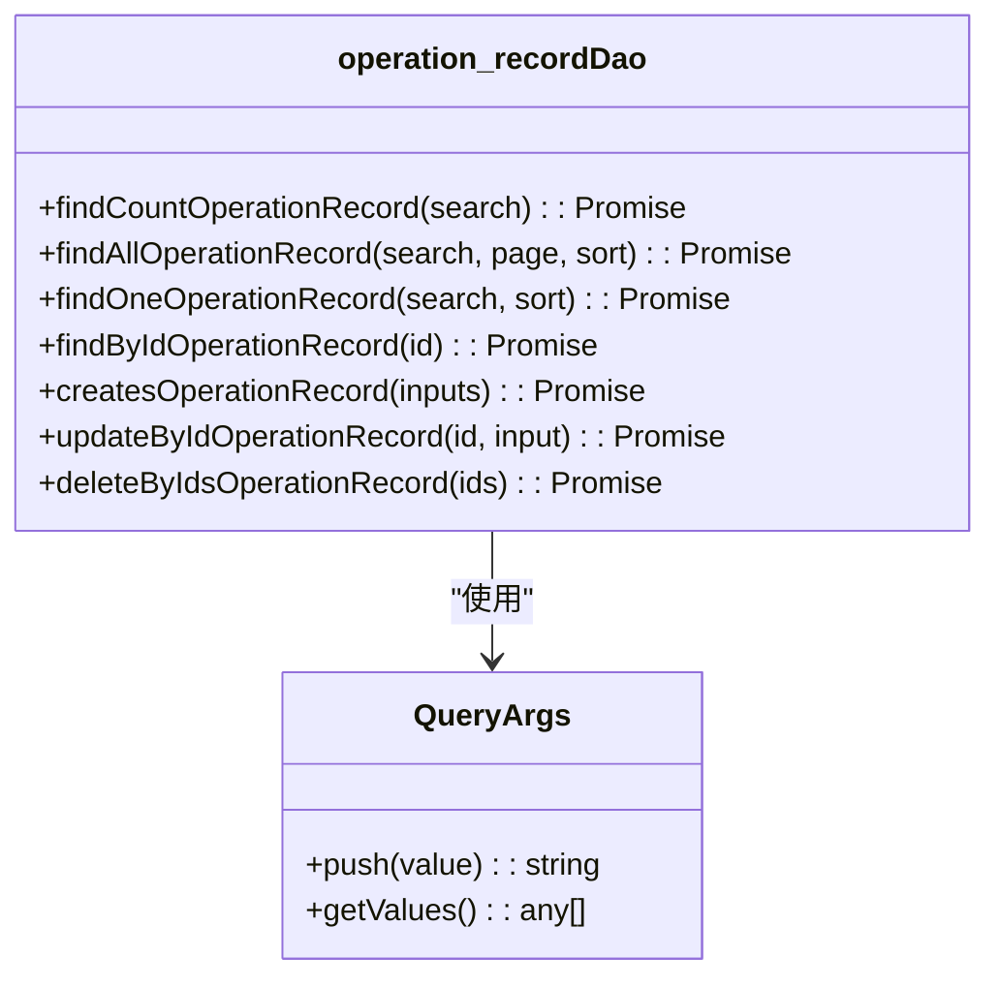
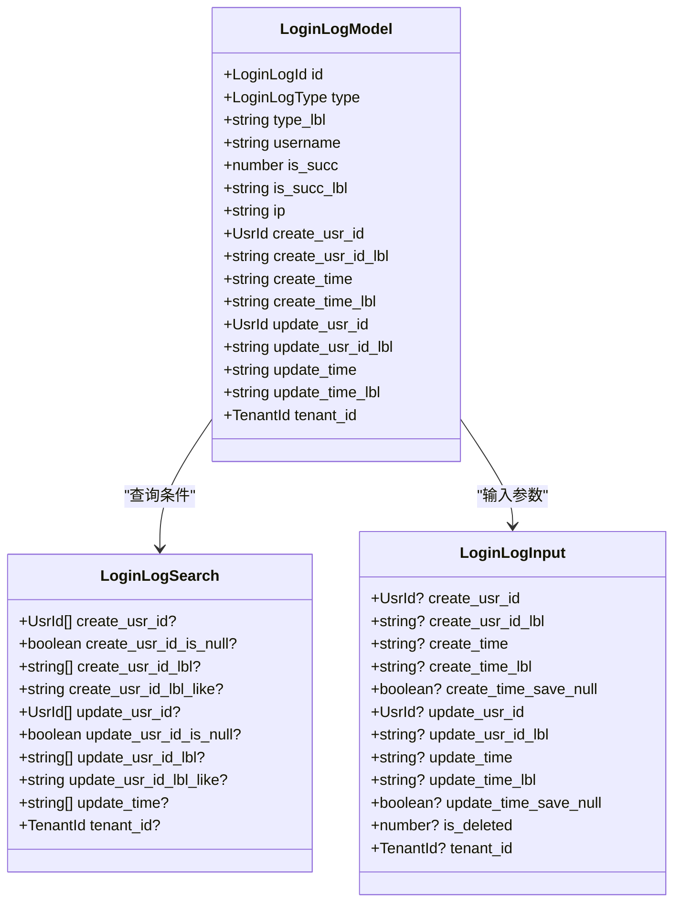
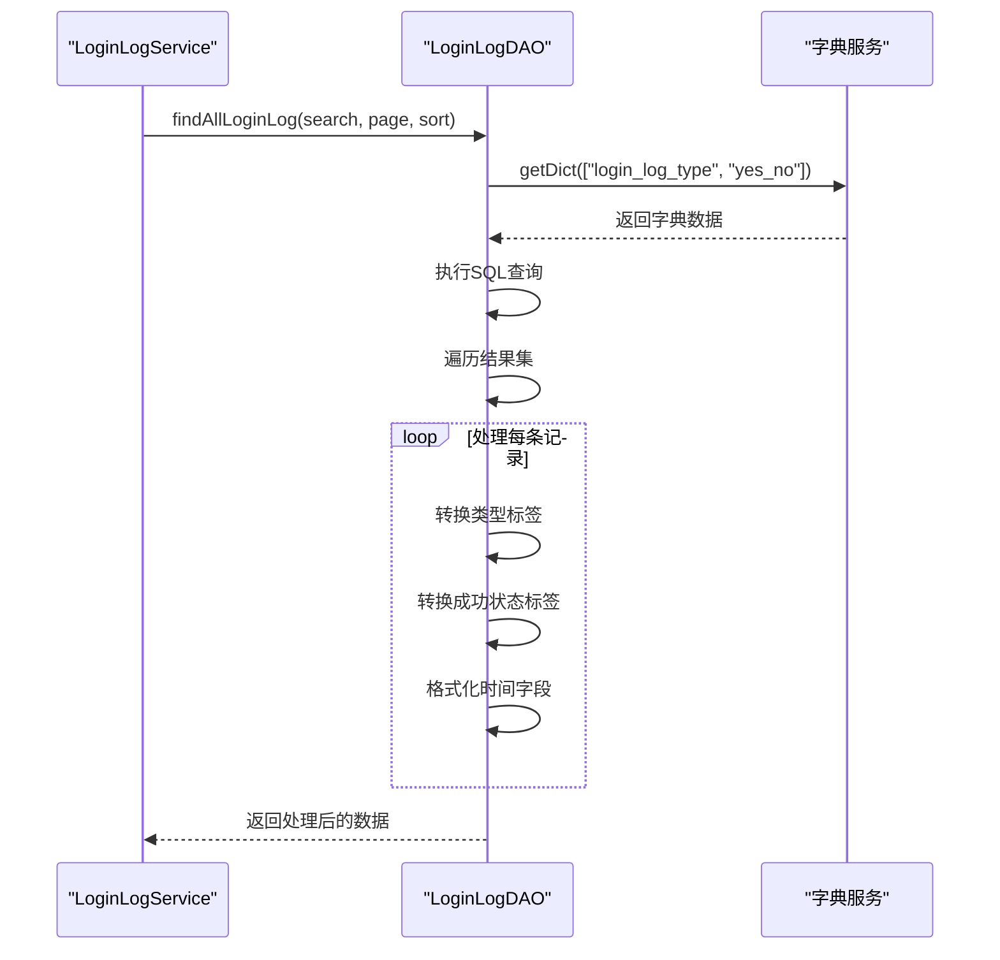
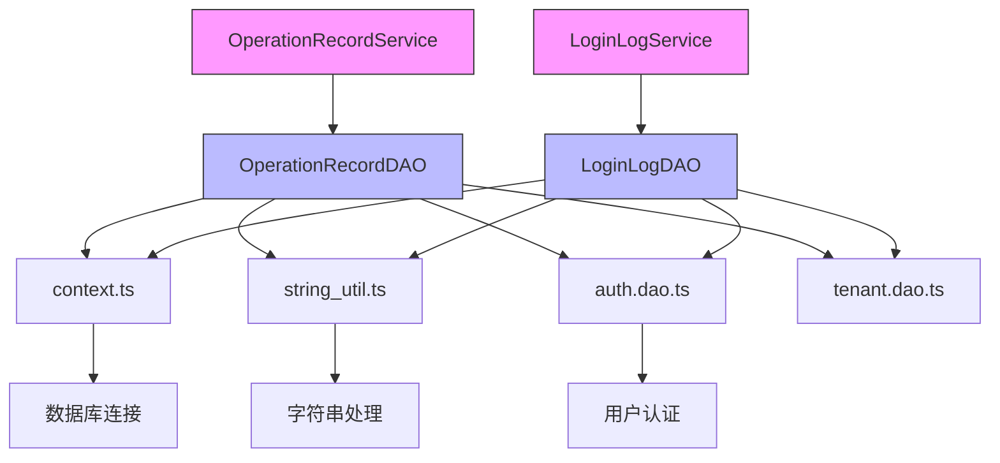

# 日志系统

**本文档引用的文件**  
- [operation_record.model.ts](https://github.com/sail-sail/nest/blob/main/deno/gen/base/operation_record/operation_record.model.ts)
- [operation_record.service.ts](https://github.com/sail-sail/nest/blob/main/deno/gen/base/operation_record/operation_record.service.ts)
- [operation_record.dao.ts](https://github.com/sail-sail/nest/blob/main/deno/gen/base/operation_record/operation_record.dao.ts)
- [login_log.model.ts](https://github.com/sail-sail/nest/blob/main/deno/gen/base/login_log/login_log.model.ts)
- [login_log.service.ts](https://github.com/sail-sail/nest/blob/main/deno/gen/base/login_log/login_log.service.ts)
- [login_log.dao.ts](https://github.com/sail-sail/nest/blob/main/deno/gen/base/login_log/login_log.dao.ts)

## 目录
1. [简介](#简介)
2. [项目结构](#项目结构)
3. [核心组件](#核心组件)
4. [架构概览](#架构概览)
5. [详细组件分析](#详细组件分析)
6. [依赖分析](#依赖分析)
7. [性能考虑](#性能考虑)
8. [故障排除指南](#故障排除指南)
9. [结论](#结论)

## 简介
本文档详细说明了日志系统的设计与实现，重点介绍操作日志和登录日志的记录与查询机制。系统基于 NestJS 框架构建，采用模块化设计，通过 GraphQL 接口提供日志数据访问能力。日志系统包含完整的数据模型、服务层逻辑和数据访问对象（DAO），支持条件过滤、分页查询和数据导出等核心功能。文档将深入分析日志数据模型设计、记录触发机制、查询 API 使用方法以及安全审计应用场景。

## 项目结构
日志系统主要由两个核心模块组成：操作日志（operation_record）和登录日志（login_log）。每个模块遵循一致的分层架构，包含模型（model）、服务（service）和数据访问对象（dao）三个主要组件。系统采用 TypeScript 语言开发，利用 Deno 运行时环境，通过 GraphQL 提供统一的 API 接口。

**图示来源**  
- [operation_record.model.ts](https://github.com/sail-sail/nest/blob/main/deno/gen/base/operation_record/operation_record.model.ts)
- [operation_record.service.ts](https://github.com/sail-sail/nest/blob/main/deno/gen/base/operation_record/operation_record.service.ts)
- [operation_record.dao.ts](https://github.com/sail-sail/nest/blob/main/deno/gen/base/operation_record/operation_record.dao.ts)
- [login_log.model.ts](https://github.com/sail-sail/nest/blob/main/deno/gen/base/login_log/login_log.model.ts)
- [login_log.service.ts](https://github.com/sail-sail/nest/blob/main/deno/gen/base/login_log/login_log.service.ts)
- [login_log.dao.ts](https://github.com/sail-sail/nest/blob/main/deno/gen/base/login_log/login_log.dao.ts)

## 核心组件
日志系统的核心组件包括操作日志和登录日志两个模块，每个模块都实现了完整的 CRUD（创建、读取、更新、删除）操作。系统通过 DAO 层直接与数据库交互，服务层封装业务逻辑，模型层定义数据结构和类型。所有日志记录都包含租户隔离、软删除和时间戳等通用功能，确保数据的安全性和可追溯性。

**组件来源**  
- [operation_record.model.ts](https://github.com/sail-sail/nest/blob/main/deno/gen/base/operation_record/operation_record.model.ts)
- [login_log.model.ts](https://github.com/sail-sail/nest/blob/main/deno/gen/base/login_log/login_log.model.ts)

## 架构概览
日志系统采用典型的三层架构模式：表现层（GraphQL 接口）、业务逻辑层（Service）和数据访问层（DAO）。这种分层设计确保了关注点分离，提高了代码的可维护性和可测试性。系统通过 AOP（面向切面编程）思想，在关键业务操作前后自动记录日志，无需在业务代码中显式调用日志记录方法。

**图示来源**  
- [operation_record.service.ts](https://github.com/sail-sail/nest/blob/main/deno/gen/base/operation_record/operation_record.service.ts)
- [operation_record.dao.ts](https://github.com/sail-sail/nest/blob/main/deno/gen/base/operation_record/operation_record.dao.ts)

## 详细组件分析

### 操作日志分析
操作日志模块负责记录系统中所有关键业务操作的详细信息，包括操作的模块、方法、耗时、操作前后数据变化等。该模块的设计充分考虑了审计需求，为安全审计和问题排查提供了完整的数据支持。

#### 数据模型
操作日志的数据模型定义了日志记录的核心字段，包括：
- **模块**：发生操作的系统模块
- **方法**：具体执行的操作方法
- **耗时(毫秒)**：操作执行的时间消耗
- **操作前数据**：操作执行前的数据快照
- **操作后数据**：操作执行后的数据状态
- **操作人**：执行操作的用户
- **操作时间**：操作发生的时间戳

**图示来源**  
- [operation_record.model.ts](https://github.com/sail-sail/nest/blob/main/deno/gen/base/operation_record/operation_record.model.ts)

#### 服务层逻辑
操作日志的服务层提供了丰富的 API 方法，支持各种查询和管理操作。核心功能包括：
- **分页查询**：支持按条件分页查找操作记录
- **条件统计**：根据搜索条件统计记录总数
- **精确查找**：根据 ID 或唯一约束查找特定记录
- **批量操作**：支持批量创建、删除和还原日志记录

**图示来源**  
- [operation_record.service.ts](https://github.com/sail-sail/nest/blob/main/deno/gen/base/operation_record/operation_record.service.ts)

#### 数据访问层
数据访问层直接与数据库交互，负责生成和执行 SQL 查询。该层实现了安全的参数化查询，防止 SQL 注入攻击。同时，通过 QueryArgs 对象管理查询参数，确保数据安全。

**图示来源**  
- [operation_record.dao.ts](https://github.com/sail-sail/nest/blob/main/deno/gen/base/operation_record/operation_record.dao.ts)

### 登录日志分析
登录日志模块专门用于记录用户的登录活动，是安全审计的重要组成部分。该模块不仅记录登录成功的信息，也记录登录失败的尝试，为异常行为检测提供数据支持。

#### 数据模型
登录日志的数据模型包含以下关键字段：
- **类型**：登录方式（如密码、短信、第三方等）
- **用户名**：尝试登录的用户名
- **登录成功**：标识登录是否成功
- **IP**：登录请求的来源 IP 地址
- **登录时间**：登录尝试发生的时间

**图示来源**  
- [login_log.model.ts](https://github.com/sail-sail/nest/blob/main/deno/gen/base/login_log/login_log.model.ts)

#### 业务逻辑
登录日志的业务逻辑特别关注数据的准确性和完整性。系统通过字典表（dict）将代码值转换为可读的标签，例如将登录类型代码转换为"密码登录"、"短信登录"等描述性文本。

**图示来源**  
- [login_log.dao.ts](https://github.com/sail-sail/nest/blob/main/deno/gen/base/login_log/login_log.dao.ts)

## 依赖分析
日志系统依赖于多个核心组件和服务，形成了紧密的依赖关系网络。系统通过依赖注入机制管理这些依赖，确保组件间的松耦合。

**图示来源**  
- [operation_record.dao.ts](https://github.com/sail-sail/nest/blob/main/deno/gen/base/operation_record/operation_record.dao.ts)
- [login_log.dao.ts](https://github.com/sail-sail/nest/blob/main/deno/gen/base/login_log/login_log.dao.ts)

## 性能考虑
日志系统的性能设计主要关注查询效率和数据存储优化。系统通过以下措施确保高性能：
- **索引优化**：在常用查询字段（如操作时间、操作人）上建立数据库索引
- **分页查询**：默认支持分页，避免一次性加载大量数据
- **查询缓存**：对频繁查询的字典数据进行缓存
- **连接池**：使用数据库连接池管理数据库连接，提高并发性能

系统还实现了查询条件的预处理和验证，防止恶意或无效查询对数据库造成过大压力。对于大规模数据查询，建议使用时间范围过滤，避免全表扫描。

## 故障排除指南
当遇到日志系统相关问题时，可以按照以下步骤进行排查：

1. **检查日志记录是否正常**
   - 验证业务操作是否触发了日志记录
   - 检查 DAO 层的创建方法是否被正确调用

2. **查询性能问题**
   - 检查查询条件是否合理，避免全表扫描
   - 确认相关字段是否有适当的数据库索引
   - 查看数据库慢查询日志

3. **数据不一致问题**
   - 验证租户隔离逻辑是否正确执行
   - 检查软删除标志（is_deleted）的处理
   - 确认时间戳字段的格式化是否正确

4. **权限问题**
   - 确认当前用户是否有访问日志数据的权限
   - 检查租户上下文是否正确传递

**故障排除来源**  
- [operation_record.dao.ts](https://github.com/sail-sail/nest/blob/main/deno/gen/base/operation_record/operation_record.dao.ts)
- [login_log.dao.ts](https://github.com/sail-sail/nest/blob/main/deno/gen/base/login_log/login_log.dao.ts)

## 结论
本文档全面介绍了日志系统的设计与实现，涵盖了操作日志和登录日志两个核心模块。系统采用模块化、分层的架构设计，具有良好的可维护性和扩展性。通过详细的 API 文档和使用示例，开发者可以快速掌握日志系统的使用方法。系统的安全审计功能和性能优化措施确保了其在生产环境中的稳定运行。未来可以考虑增加日志分析功能，如异常登录检测、操作模式分析等，进一步提升系统的价值。