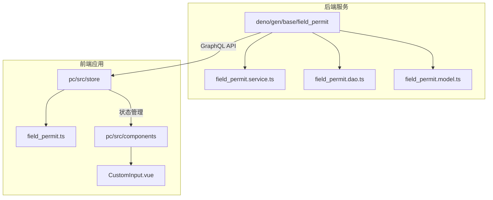
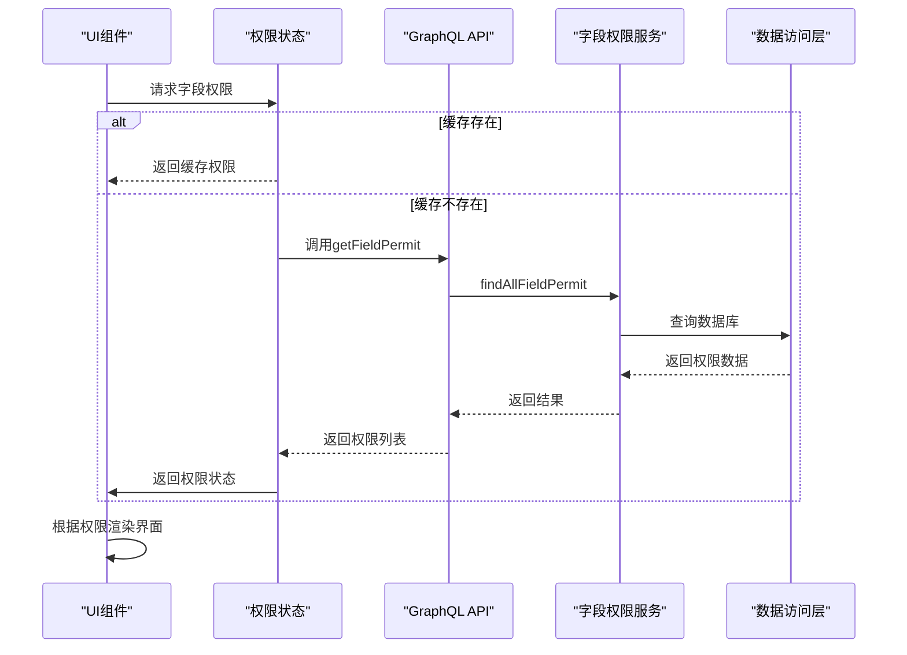
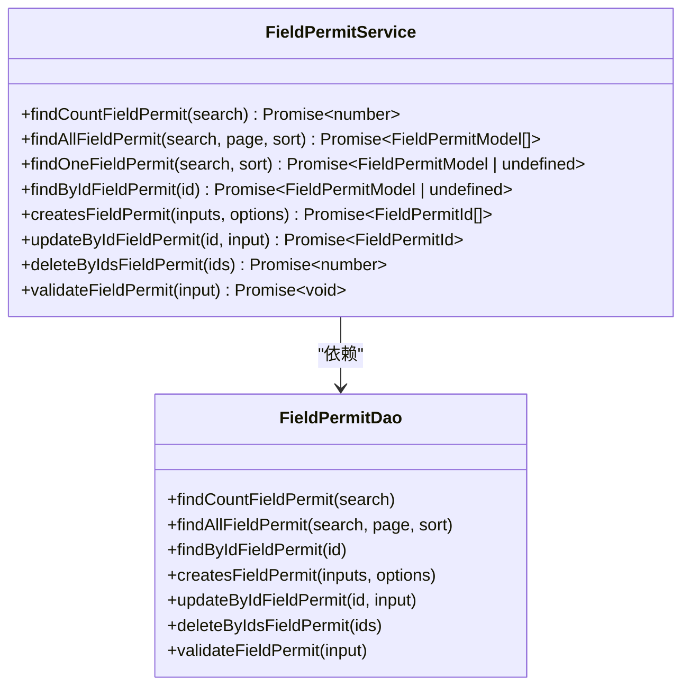
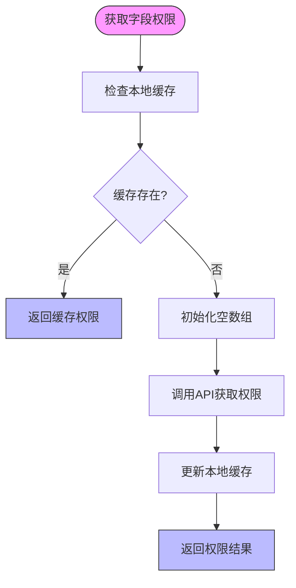
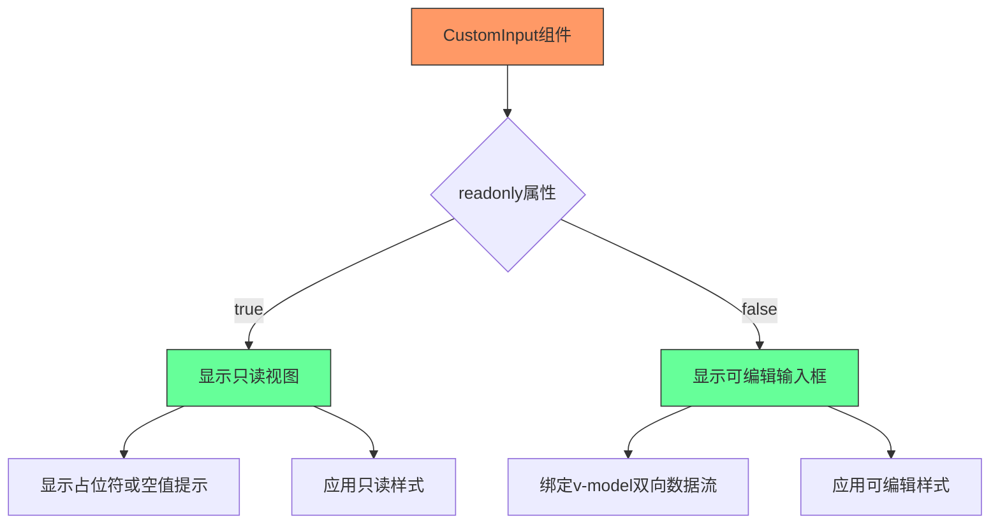
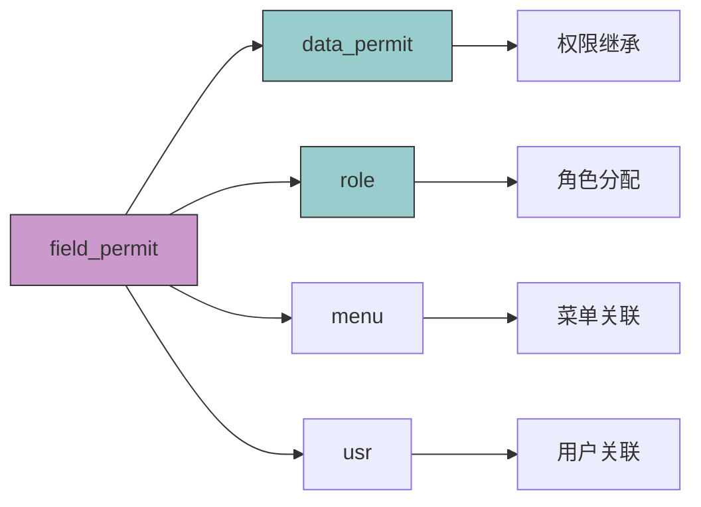

# 字段权限

**本文档引用文件**  
- [field_permit.service.ts](https://github.com/sail-sail/nest/blob/main/deno\gen\base\field_permit\field_permit.service.ts)
- [field_permit.ts](https://github.com/sail-sail/nest/blob/main/pc\src\store\field_permit.ts)
- [CustomInput.vue](https://github.com/sail-sail/nest/blob/main/pc\src\components\CustomInput.vue)
- [types.ts](https://github.com/sail-sail/nest/blob/main/deno\gen\types.ts)

## 目录
1. [简介](#简介)
2. [项目结构](#项目结构)
3. [核心组件](#核心组件)
4. [架构概览](#架构概览)
5. [详细组件分析](#详细组件分析)
6. [依赖分析](#依赖分析)
7. [性能考虑](#性能考虑)
8. [故障排除指南](#故障排除指南)
9. [结论](#结论)

## 简介
本文档详细介绍了系统中的字段级权限控制机制，重点阐述了如何通过 `field_permit` 模块实现对数据模型字段的读写权限管理。文档涵盖后端服务逻辑、前端状态管理以及在UI组件中的具体应用，旨在为开发者提供完整的字段权限控制实现方案。

## 项目结构
字段权限功能贯穿前后端多个模块，主要涉及以下目录结构：

**图示来源**  
- [field_permit.service.ts](https://github.com/sail-sail/nest/blob/main/deno\gen\base\field_permit\field_permit.service.ts)
- [field_permit.ts](https://github.com/sail-sail/nest/blob/main/pc\src\store\field_permit.ts)
- [CustomInput.vue](https://github.com/sail-sail/nest/blob/main/pc\src\components\CustomInput.vue)

**本节来源**  
- [project_structure](https://github.com/sail-sail/nest/blob/main/)

## 核心组件
字段权限系统由三个核心部分构成：后端服务层、前端状态管理层和UI组件层。后端定义权限规则，前端获取并缓存权限状态，UI组件根据权限状态动态渲染界面元素。

**本节来源**  
- [field_permit.service.ts](https://github.com/sail-sail/nest/blob/main/deno\gen\base\field_permit\field_permit.service.ts)
- [field_permit.ts](https://github.com/sail-sail/nest/blob/main/pc\src\store\field_permit.ts)

## 架构概览
整个字段权限控制系统采用分层架构设计，从前端到后端形成完整的权限控制链路。

**图示来源**  
- [field_permit.service.ts](https://github.com/sail-sail/nest/blob/main/deno\gen\base\field_permit\field_permit.service.ts)
- [field_permit.ts](https://github.com/sail-sail/nest/blob/main/pc\src\store\field_permit.ts)

## 详细组件分析

### 后端服务层分析
`field_permit.service.ts` 文件定义了字段权限的核心业务逻辑，提供了完整的CRUD操作和查询功能。

**图示来源**  
- [field_permit.service.ts](https://github.com/sail-sail/nest/blob/main/deno\gen\base\field_permit\field_permit.service.ts#L55-L259)

**本节来源**  
- [field_permit.service.ts](https://github.com/sail-sail/nest/blob/main/deno\gen\base\field_permit\field_permit.service.ts)

### 前端状态管理层分析
`field_permit.ts` 实现了前端权限状态的管理，采用本地存储缓存机制提高性能。

**图示来源**  
- [field_permit.ts](https://github.com/sail-sail/nest/blob/main/pc\src\store\field_permit.ts#L0-L118)

**本节来源**  
- [field_permit.ts](https://github.com/sail-sail/nest/blob/main/pc\src\store\field_permit.ts)

### UI组件层分析
`CustomInput.vue` 组件根据字段权限状态动态调整其可编辑性，实现了细粒度的UI控制。

**图示来源**  
- [CustomInput.vue](https://github.com/sail-sail/nest/blob/main/pc\src\components\CustomInput.vue#L0-L252)

**本节来源**  
- [CustomInput.vue](https://github.com/sail-sail/nest/blob/main/pc\src\components\CustomInput.vue)

## 依赖分析
字段权限系统与其他模块存在明确的依赖关系，形成了完整的权限管理体系。

**图示来源**  
- [field_permit.service.ts](https://github.com/sail-sail/nest/blob/main/deno\gen\base\field_permit\field_permit.service.ts)
- [types.ts](https://github.com/sail-sail/nest/blob/main/deno\gen\types.ts)

**本节来源**  
- [field_permit.service.ts](https://github.com/sail-sail/nest/blob/main/deno\gen\base\field_permit\field_permit.service.ts)
- [types.ts](https://github.com/sail-sail/nest/blob/main/deno\gen\types.ts)

## 性能考虑
字段权限系统在设计时充分考虑了性能优化，主要体现在以下几个方面：

1. **缓存机制**：前端使用 `useStorage` 对权限数据进行本地缓存，避免重复请求
2. **批量查询**：支持通过 `findByIdsFieldPermit` 方法批量获取多个字段权限
3. **条件查询**：提供灵活的搜索参数，支持按菜单、编码等条件过滤
4. **分页支持**：`findAllFieldPermit` 方法支持分页查询，避免一次性加载过多数据

这些优化策略确保了系统在处理大量字段权限时仍能保持良好的响应性能。

## 故障排除指南
在使用字段权限功能时可能遇到以下常见问题及解决方案：

1. **权限不生效**：检查前端缓存是否过期，尝试清除本地存储中的权限缓存
2. **字段显示异常**：确认后端返回的权限数据格式是否正确，特别是字段编码的匹配
3. **性能问题**：如果权限数据量过大，建议优化查询条件，使用更精确的过滤参数
4. **权限继承问题**：检查角色与字段权限的关联关系是否正确配置

**本节来源**  
- [field_permit.service.ts](https://github.com/sail-sail/nest/blob/main/deno\gen\base\field_permit\field_permit.service.ts)
- [field_permit.ts](https://github.com/sail-sail/nest/blob/main/pc\src\store\field_permit.ts)

## 结论
字段权限系统通过前后端协同工作，实现了对数据模型字段的精细化访问控制。后端服务提供了完整的权限管理API，前端状态管理实现了高效的权限缓存，UI组件则根据权限状态动态调整界面行为。这种分层架构设计既保证了安全性，又兼顾了性能和用户体验，为系统提供了灵活可靠的字段级权限控制能力。