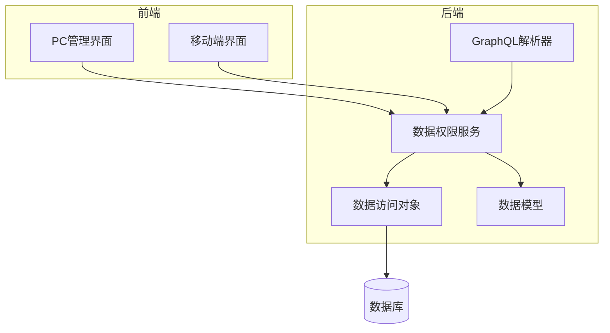
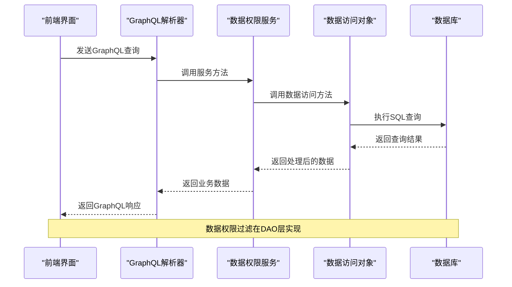
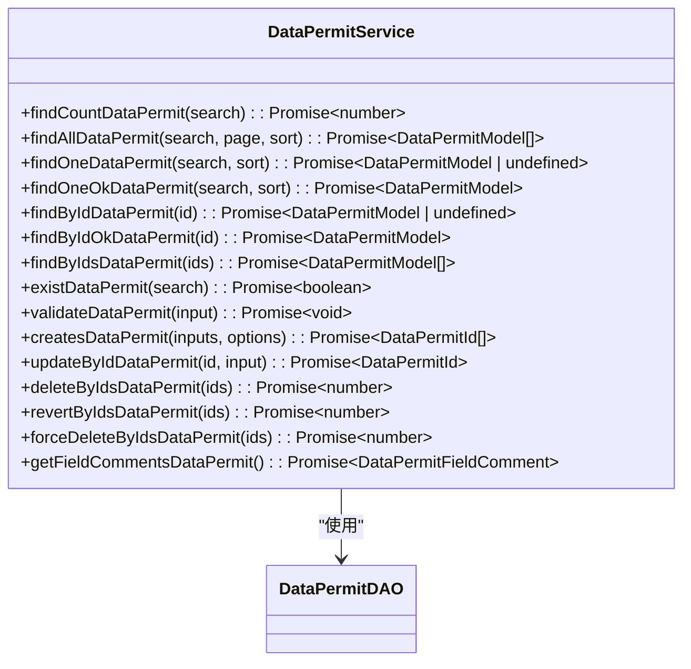
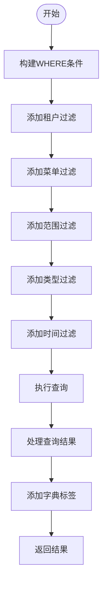
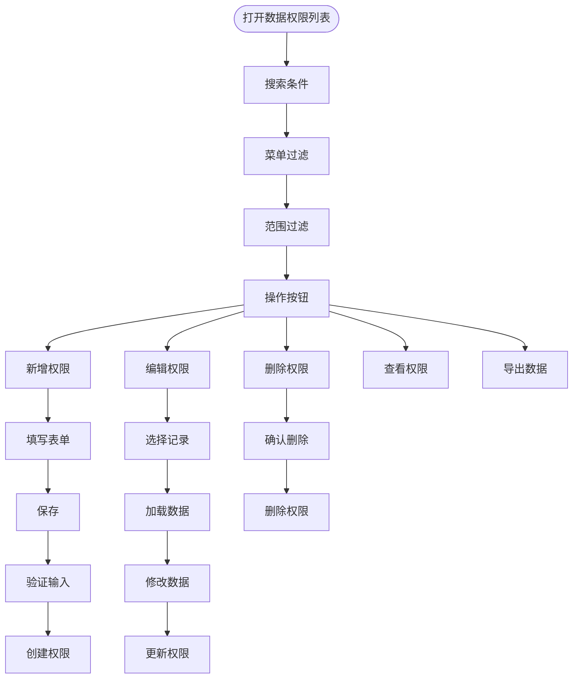
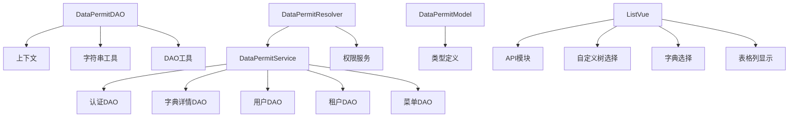

# 数据权限

**本文档引用的文件**   
- [data_permit.service.ts](https://github.com/sail-sail/nest/blob/main/deno\gen\base\data_permit\data_permit.service.ts)
- [data_permit.dao.ts](https://github.com/sail-sail/nest/blob/main/deno\gen\base\data_permit\data_permit.dao.ts)
- [data_permit.model.ts](https://github.com/sail-sail/nest/blob/main/deno\gen\base\data_permit\data_permit.model.ts)
- [data_permit.resolver.ts](https://github.com/sail-sail/nest/blob/main/deno\gen\base\data_permit\data_permit.resolver.ts)
- [List.vue](https://github.com/sail-sail/nest/blob/main/codegen\__out__\pc\src\views\base\data_permit\List.vue)
- [Api.ts](https://github.com/sail-sail/nest/blob/main/codegen\__out__\pc\src\views\base\data_permit\Api.ts)

## 目录
1. [简介](#简介)
2. [项目结构](#项目结构)
3. [核心组件](#核心组件)
4. [架构概述](#架构概述)
5. [详细组件分析](#详细组件分析)
6. [依赖分析](#依赖分析)
7. [性能考虑](#性能考虑)
8. [故障排除指南](#故障排除指南)
9. [结论](#结论)

## 简介
本文档详细介绍了基于数据范围的访问控制功能的实现。重点阐述了数据权限服务（data_permit.service.ts）和数据访问对象（data_permit.dao.ts）如何协作，实现对数据库记录的行级过滤。文档还解释了数据权限规则的定义方式，包括组织架构、角色范围和自定义条件等过滤策略。此外，提供了数据权限配置的前端界面（List.vue）使用示例，展示权限规则的创建、编辑和测试功能。最后，文档包含数据权限性能优化建议、复杂查询场景下的权限处理，以及如何确保数据权限规则与业务逻辑的一致性。

## 项目结构
项目结构遵循分层设计模式，主要分为以下几个部分：
- `codegen`：代码生成相关文件
- `deno`：核心业务逻辑实现
- `pc`：前端管理界面
- `uni`：移动端界面

核心数据权限功能主要位于`deno/gen/base/data_permit/`目录下，包含服务层、数据访问层、模型定义和GraphQL解析器。

**图表来源**
- [data_permit.service.ts](https://github.com/sail-sail/nest/blob/main/deno\gen\base\data_permit\data_permit.service.ts)
- [data_permit.dao.ts](https://github.com/sail-sail/nest/blob/main/deno\gen\base\data_permit\data_permit.dao.ts)
- [data_permit.model.ts](https://github.com/sail-sail/nest/blob/main/deno\gen\base\data_permit\data_permit.model.ts)
- [data_permit.resolver.ts](https://github.com/sail-sail/nest/blob/main/deno\gen\base\data_permit\data_permit.resolver.ts)

**章节来源**
- [data_permit.service.ts](https://github.com/sail-sail/nest/blob/main/deno\gen\base\data_permit\data_permit.service.ts)
- [data_permit.dao.ts](https://github.com/sail-sail/nest/blob/main/deno\gen\base\data_permit\data_permit.dao.ts)

## 核心组件
数据权限功能的核心组件包括：
- **数据权限服务 (data_permit.service.ts)**：提供业务逻辑处理
- **数据访问对象 (data_permit.dao.ts)**：负责数据库操作
- **数据模型 (data_permit.model.ts)**：定义数据结构
- **GraphQL解析器 (data_permit.resolver.ts)**：处理API请求

这些组件协同工作，实现了基于数据范围的访问控制功能。

**章节来源**
- [data_permit.service.ts](https://github.com/sail-sail/nest/blob/main/deno\gen\base\data_permit\data_permit.service.ts)
- [data_permit.dao.ts](https://github.com/sail-sail/nest/blob/main/deno\gen\base\data_permit\data_permit.dao.ts)
- [data_permit.model.ts](https://github.com/sail-sail/nest/blob/main/deno\gen\base\data_permit\data_permit.model.ts)
- [data_permit.resolver.ts](https://github.com/sail-sail/nest/blob/main/deno\gen\base\data_permit\data_permit.resolver.ts)

## 架构概述
数据权限功能采用分层架构设计，从上到下分为：
1. 前端界面层
2. GraphQL API层
3. 业务服务层
4. 数据访问层
5. 数据库层

各层之间通过明确定义的接口进行通信，确保了系统的可维护性和可扩展性。

**图表来源**
- [data_permit.service.ts](https://github.com/sail-sail/nest/blob/main/deno\gen\base\data_permit\data_permit.service.ts)
- [data_permit.dao.ts](https://github.com/sail-sail/nest/blob/main/deno\gen\base\data_permit\data_permit.dao.ts)
- [data_permit.resolver.ts](https://github.com/sail-sail/nest/blob/main/deno\gen\base\data_permit\data_permit.resolver.ts)

## 详细组件分析

### 数据权限服务分析
数据权限服务是业务逻辑的核心，提供了各种数据权限操作的方法。

#### 服务方法

**图表来源**
- [data_permit.service.ts](https://github.com/sail-sail/nest/blob/main/deno\gen\base\data_permit\data_permit.service.ts)

**章节来源**
- [data_permit.service.ts](https://github.com/sail-sail/nest/blob/main/deno\gen\base\data_permit\data_permit.service.ts)

### 数据访问对象分析
数据访问对象负责与数据库交互，实现数据的持久化操作。

#### 查询构建流程

**图表来源**
- [data_permit.dao.ts](https://github.com/sail-sail/nest/blob/main/deno\gen\base\data_permit\data_permit.dao.ts)

**章节来源**
- [data_permit.dao.ts](https://github.com/sail-sail/nest/blob/main/deno\gen\base\data_permit\data_permit.dao.ts)

### 前端界面分析
前端界面提供了数据权限规则的可视化配置和管理功能。

#### 界面功能流程

**图表来源**
- [List.vue](https://github.com/sail-sail/nest/blob/main/codegen\__out__\pc\src\views\base\data_permit\List.vue)

**章节来源**
- [List.vue](https://github.com/sail-sail/nest/blob/main/codegen\__out__\pc\src\views\base\data_permit\List.vue)

## 依赖分析
数据权限功能依赖于多个其他模块和组件：

**图表来源**
- [data_permit.service.ts](https://github.com/sail-sail/nest/blob/main/deno\gen\base\data_permit\data_permit.service.ts)
- [data_permit.dao.ts](https://github.com/sail-sail/nest/blob/main/deno\gen\base\data_permit\data_permit.dao.ts)
- [data_permit.model.ts](https://github.com/sail-sail/nest/blob/main/deno\gen\base\data_permit\data_permit.model.ts)
- [data_permit.resolver.ts](https://github.com/sail-sail/nest/blob/main/deno\gen\base\data_permit\data_permit.resolver.ts)
- [List.vue](https://github.com/sail-sail/nest/blob/main/codegen\__out__\pc\src\views\base\data_permit\List.vue)

**章节来源**
- [data_permit.service.ts](https://github.com/sail-sail/nest/blob/main/deno\gen\base\data_permit\data_permit.service.ts)
- [data_permit.dao.ts](https://github.com/sail-sail/nest/blob/main/deno\gen\base\data_permit\data_permit.dao.ts)
- [List.vue](https://github.com/sail-sail/nest/blob/main/codegen\__out__\pc\src\views\base\data_permit\List.vue)

## 性能考虑
为确保数据权限功能的高性能，系统采用了以下优化策略：

1. **查询缓存**：对频繁查询的结果进行缓存
2. **分页处理**：大数据集采用分页查询
3. **索引优化**：在关键字段上建立数据库索引
4. **批量操作**：支持批量创建、更新和删除
5. **连接池**：使用数据库连接池提高连接效率

此外，系统还实现了查询条件的预处理和验证，避免无效查询对数据库造成压力。

## 故障排除指南
### 常见问题及解决方案

**问题1：无法创建数据权限**
- **可能原因**：输入数据验证失败
- **解决方案**：检查必填字段是否完整，确保数据格式正确

**问题2：查询结果为空**
- **可能原因**：查询条件过于严格或数据不存在
- **解决方案**：放宽查询条件，检查数据是否已正确创建

**问题3：权限过滤不生效**
- **可能原因**：租户ID或用户ID获取失败
- **解决方案**：检查认证信息是否正确，确保用户已登录

**问题4：性能下降**
- **可能原因**：查询条件复杂或数据量过大
- **解决方案**：优化查询条件，考虑增加数据库索引

**章节来源**
- [data_permit.service.ts](https://github.com/sail-sail/nest/blob/main/deno\gen\base\data_permit\data_permit.service.ts)
- [data_permit.dao.ts](https://github.com/sail-sail/nest/blob/main/deno\gen\base\data_permit\data_permit.dao.ts)

## 结论
本文档详细介绍了数据权限功能的实现细节，包括服务层、数据访问层、模型定义和前端界面。通过分层架构设计，系统实现了灵活、可扩展的数据权限控制机制。数据权限服务与数据访问对象的协作确保了业务逻辑与数据持久化的分离，提高了代码的可维护性。前端界面提供了友好的用户交互体验，使权限规则的配置和管理更加直观。整体设计考虑了性能优化和错误处理，确保了系统的稳定性和可靠性。