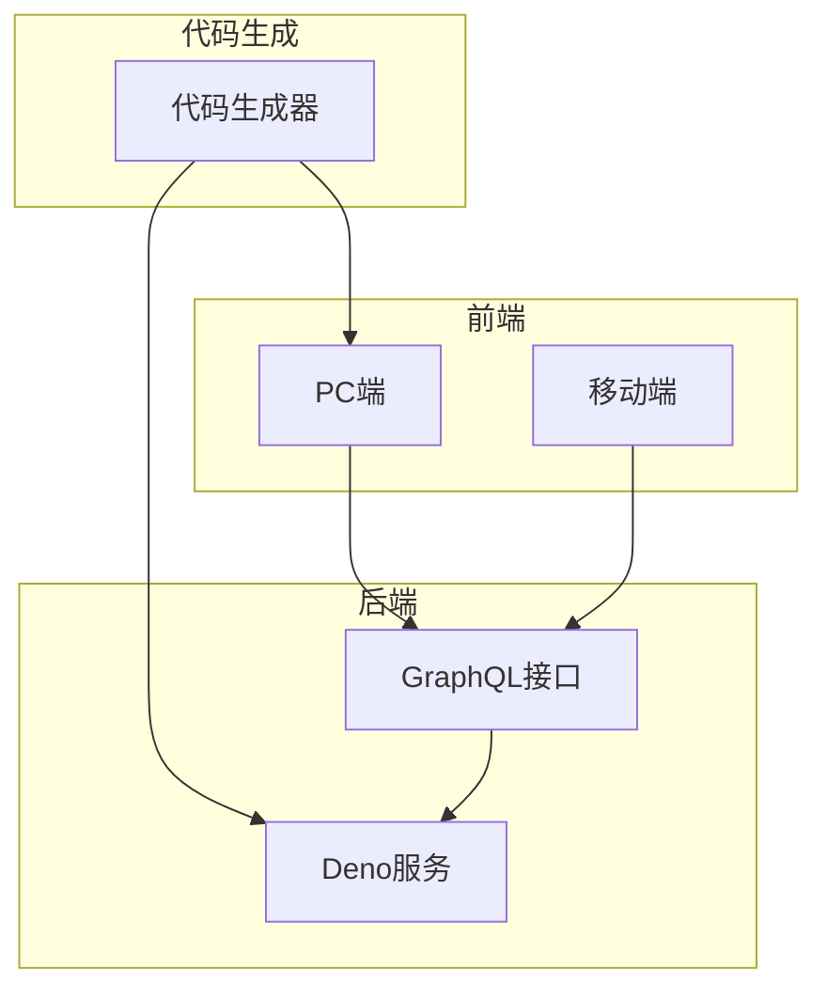
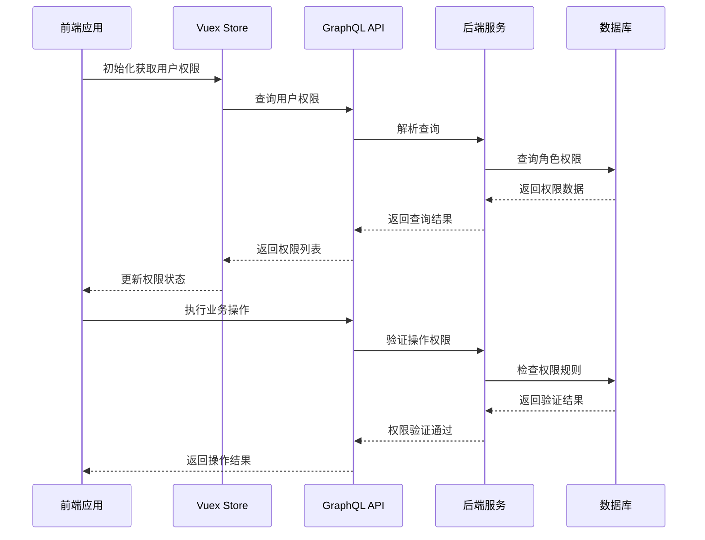
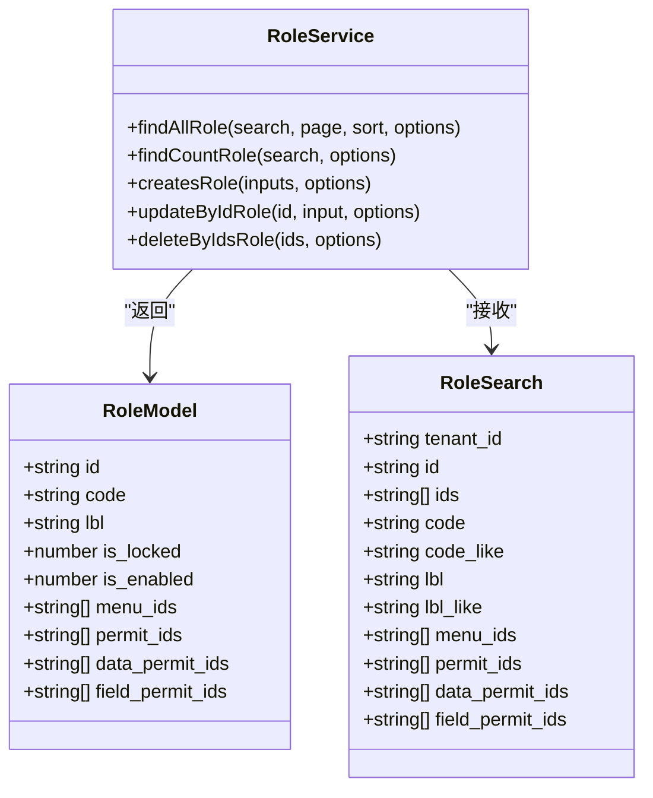
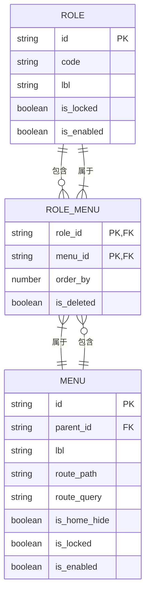
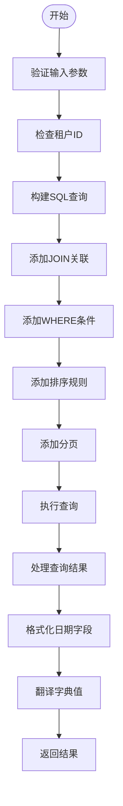
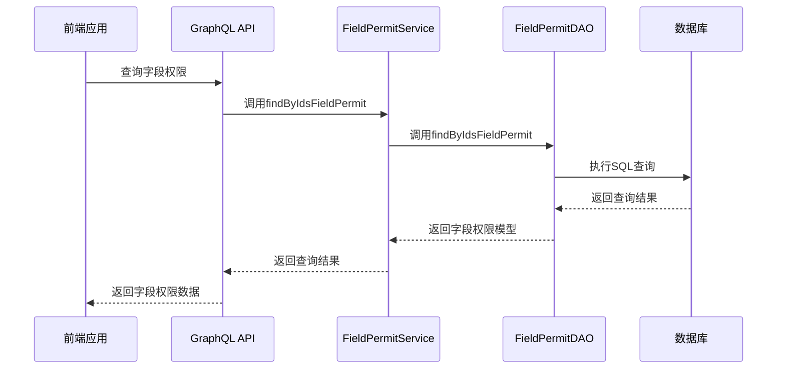
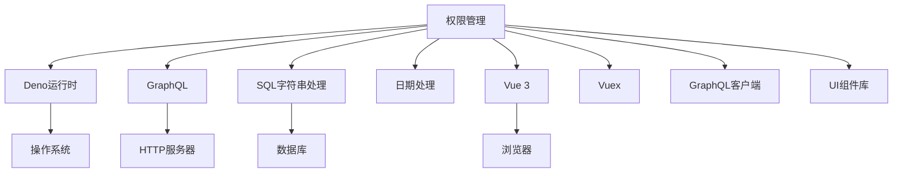

# 权限管理

**本文档引用的文件**  
- [role.dao.ts](https://github.com/sail-sail/nest/blob/main/deno\gen\base\role\role.dao.ts)
- [menu.dao.ts](https://github.com/sail-sail/nest/blob/main/deno\gen\base\menu\menu.dao.ts)
- [data_permit.dao.ts](https://github.com/sail-sail/nest/blob/main/deno\gen\base\data_permit\data_permit.dao.ts)
- [field_permit.service.ts](https://github.com/sail-sail/nest/blob/main/deno\gen\base\field_permit\field_permit.service.ts)
- [permit.ts](https://github.com/sail-sail/nest/blob/main/pc\src\store\permit.ts)
- [Api.ts](https://github.com/sail-sail/nest/blob/main/pc\src\views\base\field_permit\Api.ts)

## 目录
1. [简介](#简介)
2. [项目结构](#项目结构)
3. [核心组件](#核心组件)
4. [架构概述](#架构概述)
5. [详细组件分析](#详细组件分析)
6. [依赖分析](#依赖分析)
7. [性能考虑](#性能考虑)
8. [故障排除指南](#故障排除指南)
9. [结论](#结论)

## 简介
本文档详细介绍了基于角色的访问控制（RBAC）模型的实现机制，重点阐述了菜单权限、数据权限和字段级权限的三层控制体系。文档涵盖了权限定义、分配和验证的完整流程，解释了前端权限状态管理（Vuex store）与后端GraphQL权限验证的协同工作机制。通过代码示例展示了如何通过数据库表结构定义权限规则，以及如何在GraphQL查询中实现数据过滤。此外，文档还提供了权限调试技巧、常见问题排查方法和自定义权限策略的扩展方式。

## 项目结构
项目采用模块化设计，主要分为codegen、deno、pc和uni四个核心目录。codegen目录包含代码生成器和相关配置，用于自动生成数据访问对象（DAO）和GraphQL服务。deno目录是后端服务的核心，实现了基于Deno的RESTful API和GraphQL接口。pc目录是PC端前端应用，基于Vue 3和TypeScript构建，使用Vuex进行状态管理。uni目录是移动端应用，使用uni-app框架开发。

**图表来源**
- [role.dao.ts](https://github.com/sail-sail/nest/blob/main/deno\gen\base\role\role.dao.ts)
- [menu.dao.ts](https://github.com/sail-sail/nest/blob/main/deno\gen\base\menu\menu.dao.ts)

## 核心组件
系统的核心权限管理组件包括角色（Role）、菜单（Menu）、权限（Permit）、数据权限（DataPermit）和字段权限（FieldPermit）。这些组件通过多对多关系表进行关联，形成了完整的权限控制体系。角色是权限分配的基本单位，可以关联多个菜单、按钮权限、数据权限和字段权限。菜单权限控制用户可见的导航菜单，按钮权限控制具体操作的可执行性，数据权限控制数据访问范围，字段权限控制表单字段的可见性和可编辑性。

**章节来源**
- [role.dao.ts](https://github.com/sail-sail/nest/blob/main/deno\gen\base\role\role.dao.ts#L80-L121)
- [menu.dao.ts](https://github.com/sail-sail/nest/blob/main/deno\gen\base\menu\menu.dao.ts#L0-L799)

## 架构概述
系统采用前后端分离的架构，前端通过GraphQL API与后端进行通信。权限验证分为前端和后端两个层面：前端基于Vuex store中的权限缓存进行快速判断，后端在GraphQL解析器中进行严格的权限验证。这种双重验证机制既保证了用户体验的流畅性，又确保了系统的安全性。

**图表来源**
- [role.dao.ts](https://github.com/sail-sail/nest/blob/main/deno\gen\base\role\role.dao.ts#L218-L253)
- [permit.ts](https://github.com/sail-sail/nest/blob/main/pc\src\store\permit.ts#L0-L40)

## 详细组件分析

### 角色权限分析
角色权限组件是RBAC模型的核心，负责管理用户角色及其关联的各种权限。`role.dao.ts`文件中的`getFromQuery`函数通过复杂的SQL JOIN操作，一次性查询出角色关联的菜单、按钮、数据和字段权限，提高了查询效率。

**图表来源**
- [role.dao.ts](https://github.com/sail-sail/nest/blob/main/deno\gen\base\role\role.dao.ts#L218-L286)

**章节来源**
- [role.dao.ts](https://github.com/sail-sail/nest/blob/main/deno\gen\base\role\role.dao.ts#L80-L121)

### 菜单权限分析
菜单权限组件控制用户界面的导航结构。`menu.dao.ts`文件中的`getWhereQuery`函数构建了灵活的查询条件，支持按菜单ID、父菜单、名称、路由路径等多种条件进行筛选。菜单权限与角色通过`base_role_menu`关联表建立多对多关系。

**图表来源**
- [menu.dao.ts](https://github.com/sail-sail/nest/blob/main/deno\gen\base\menu\menu.dao.ts#L0-L799)

### 数据权限分析
数据权限组件控制用户对数据的访问范围。`data_permit.dao.ts`文件中的`findAllDataPermit`函数实现了数据权限的查询逻辑，支持按菜单、范围、类型等条件进行筛选。数据权限与角色通过`base_role_data_permit`关联表建立多对多关系。

**图表来源**
- [data_permit.dao.ts](https://github.com/sail-sail/nest/blob/main/deno\gen\base\data_permit\data_permit.dao.ts#L0-L799)

### 字段权限分析
字段权限组件控制表单字段的可见性和可编辑性。`field_permit.service.ts`文件提供了完整的字段权限管理API，包括根据ID查询、批量查询、存在性检查等功能。前端通过`Api.ts`中的GraphQL查询与后端交互。

**图表来源**
- [field_permit.service.ts](https://github.com/sail-sail/nest/blob/main/deno\gen\base\field_permit\field_permit.service.ts#L115-L174)
- [Api.ts](https://github.com/sail-sail/nest/blob/main/pc\src\views\base\field_permit\Api.ts#L82-L331)

## 依赖分析
权限管理系统依赖于多个核心模块和外部库。后端依赖Deno运行时、GraphQL库、SQL字符串处理库和日期处理库。前端依赖Vue 3框架、Vuex状态管理、GraphQL客户端和各种UI组件库。各模块之间通过清晰的接口进行通信，降低了耦合度。

**图表来源**
- [role.dao.ts](https://github.com/sail-sail/nest/blob/main/deno\gen\base\role\role.dao.ts#L0-L799)
- [permit.ts](https://github.com/sail-sail/nest/blob/main/pc\src\store\permit.ts#L0-L40)

## 性能考虑
权限系统的性能优化主要体现在以下几个方面：首先，通过缓存机制减少数据库查询次数，`role.dao.ts`中的`delCacheMenu`函数在创建菜单时清除相关缓存；其次，采用批量查询和分页机制，避免一次性加载过多数据；再次，使用JSON聚合函数（json_objectagg）在数据库层面处理权限数据的聚合，减少了数据传输量；最后，前端通过Vuex store缓存用户权限，避免了重复的GraphQL查询。

## 故障排除指南
常见的权限问题包括菜单不显示、按钮不可点击、数据访问被拒绝等。排查时应首先检查用户角色是否正确分配了相应权限，然后验证前端Vuex store中的权限缓存是否正确加载。对于数据权限问题，需要检查`data_permit`表中的配置是否正确，特别是范围和类型字段。字段权限问题通常与`field_permit`表的配置有关，需要确认字段ID和权限代码的对应关系。

**章节来源**
- [role.dao.ts](https://github.com/sail-sail/nest/blob/main/deno\gen\base\role\role.dao.ts#L181-L226)
- [permit.ts](https://github.com/sail-sail/nest/blob/main/pc\src\store\permit.ts#L0-L40)

## 结论
本权限管理系统实现了完整的基于角色的访问控制（RBAC）模型，通过菜单权限、数据权限和字段级权限的三层控制体系，提供了细粒度的权限管理能力。系统采用前后端分离架构，结合GraphQL API和Vuex状态管理，既保证了安全性又提升了用户体验。通过合理的数据库设计和缓存策略，系统在性能和可扩展性方面表现出色，能够满足复杂业务场景下的权限管理需求。