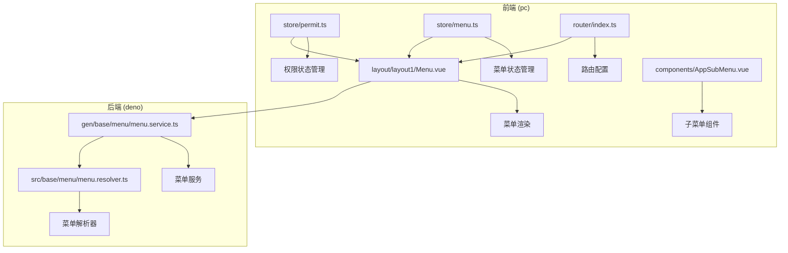
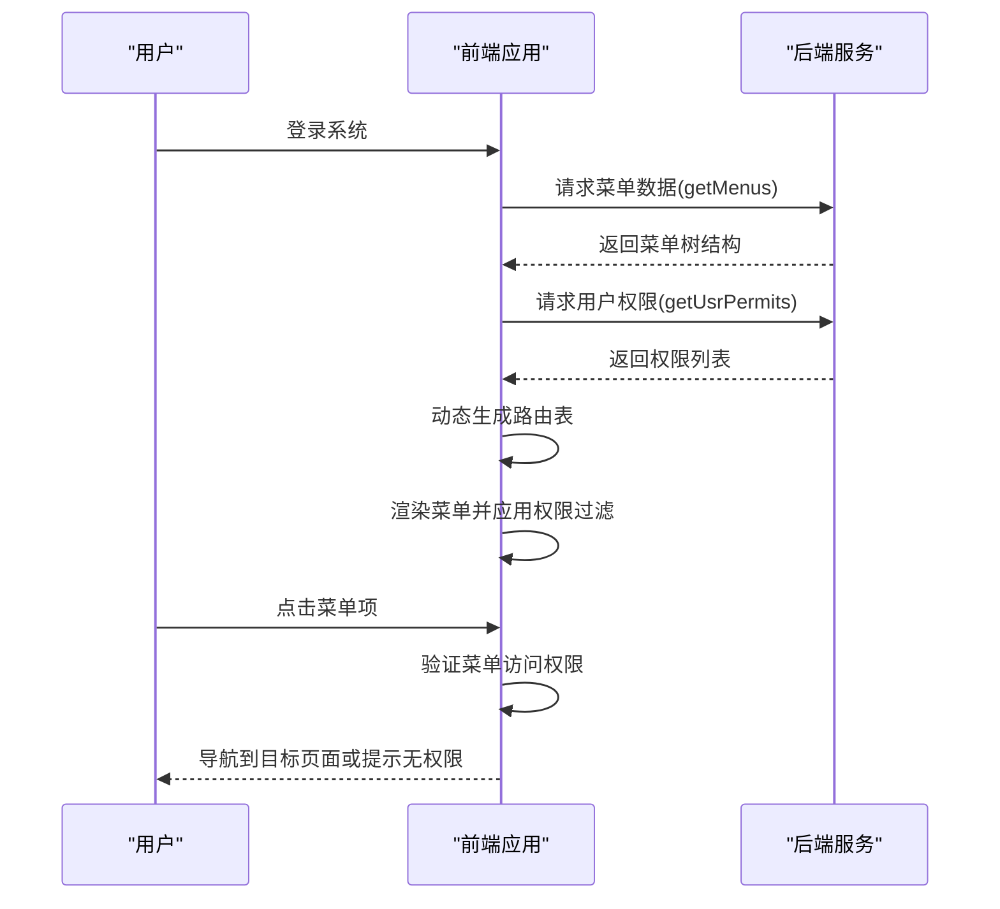
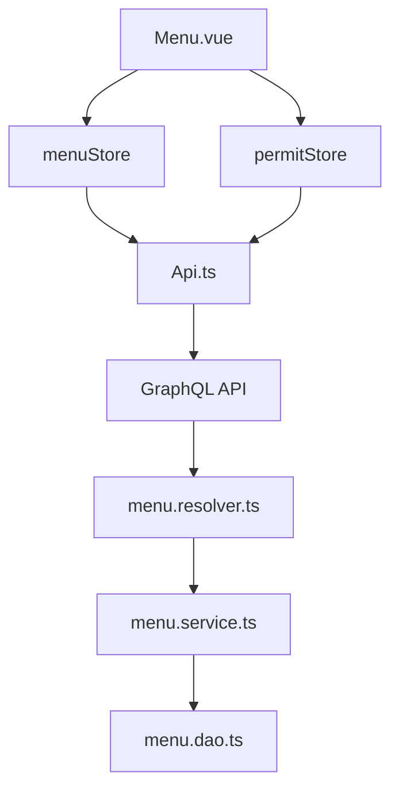

# 菜单权限


**本文档引用的文件**   
- [menu.resolver.ts](https://github.com/sail-sail/nest/blob/main/deno\src\base\menu\menu.resolver.ts)
- [menu.service.ts](https://github.com/sail-sail/nest/blob/main/deno\gen\base\menu\menu.service.ts)
- [permit.ts](https://github.com/sail-sail/nest/blob/main/pc\src\store\permit.ts)
- [menu.ts](https://github.com/sail-sail/nest/blob/main/pc\src\store\menu.ts)
- [index.ts](https://github.com/sail-sail/nest/blob/main/pc\src\router\index.ts)
- [Menu.vue](https://github.com/sail-sail/nest/blob/main/pc\src\layout\layout1\Menu.vue)
- [Api.ts](https://github.com/sail-sail/nest/blob/main/pc\src\layout\layout1\Api.ts)
- [AppSubMenu.vue](https://github.com/sail-sail/nest/blob/main/pc\src\components\AppSubMenu.vue)


## 目录
1. [简介](#简介)
2. [项目结构](#项目结构)
3. [核心组件](#核心组件)
4. [架构概览](#架构概览)
5. [详细组件分析](#详细组件分析)
6. [依赖分析](#依赖分析)
7. [性能考虑](#性能考虑)
8. [故障排除指南](#故障排除指南)
9. [结论](#结论)

## 简介
本文档详细阐述了系统中菜单权限控制的实现机制，重点分析前端路由与菜单项的权限绑定、权限状态管理、后端菜单解析以及多级菜单权限继承策略。文档涵盖权限配置、调试方法和常见问题解决方案，旨在为开发者提供全面的菜单权限管理指导。

## 项目结构
项目采用前后端分离架构，前端位于`pc`目录，后端位于`deno`目录。菜单权限相关代码分布在多个模块中，包括前端的权限状态管理(store/permit.ts)、菜单状态管理(store/menu.ts)、路由配置(router/index.ts)和菜单渲染组件(layout/layout1/Menu.vue)，以及后端的菜单服务(deno/gen/base/menu/menu.service.ts)和解析器(deno/src/base/menu/menu.resolver.ts)。



**图示来源**
- [menu.resolver.ts](https://github.com/sail-sail/nest/blob/main/deno\src\base\menu\menu.resolver.ts)
- [permit.ts](https://github.com/sail-sail/nest/blob/main/pc\src\store\permit.ts)
- [menu.ts](https://github.com/sail-sail/nest/blob/main/pc\src\store\menu.ts)
- [index.ts](https://github.com/sail-sail/nest/blob/main/pc\src\router\index.ts)
- [Menu.vue](https://github.com/sail-sail/nest/blob/main/pc\src\layout\layout1\Menu.vue)

## 核心组件
系统的核心权限控制组件包括前端的权限状态管理模块(permit.ts)和菜单状态管理模块(menu.ts)，以及后端的菜单服务(menu.service.ts)和解析器(menu.resolver.ts)。这些组件协同工作，实现了完整的菜单权限控制体系。

**组件来源**
- [permit.ts](https://github.com/sail-sail/nest/blob/main/pc\src\store\permit.ts#L1-L41)
- [menu.ts](https://github.com/sail-sail/nest/blob/main/pc\src\store\menu.ts#L1-L228)
- [menu.service.ts](https://github.com/sail-sail/nest/blob/main/deno\gen\base\menu\menu.service.ts#L1-L297)
- [menu.resolver.ts](https://github.com/sail-sail/nest/blob/main/deno\src\base\menu\menu.resolver.ts#L1-L7)

## 架构概览
系统采用前后端协同的菜单权限控制架构。后端提供菜单数据和权限验证接口，前端负责权限状态管理、路由生成和菜单渲染。用户登录后，前端获取菜单树和权限列表，根据用户角色动态生成可访问的路由表，并在菜单渲染时进行权限过滤。



**图示来源**
- [menu.resolver.ts](https://github.com/sail-sail/nest/blob/main/deno\src\base\menu\menu.resolver.ts#L1-L7)
- [Api.ts](https://github.com/sail-sail/nest/blob/main/pc\src\layout\layout1\Api.ts#L1-L138)
- [permit.ts](https://github.com/sail-sail/nest/blob/main/pc\src\store\permit.ts#L1-L41)

## 详细组件分析

### 权限状态管理分析
权限状态管理模块(permit.ts)负责管理用户的权限状态，提供权限验证功能。该模块使用Vue的响应式存储(useStorage)来持久化权限数据，并提供getPermit方法用于验证特定权限。

```mermaid
classDiagram
class PermitStore {
+permits : Array<{code : string, route_path : string}>
+isCollapse : boolean
+hide : boolean
+search : string
+getPermit(route_path? : string) : Function
+reset() : void
+clear() : void
}
PermitStore --> "1" "0..*" Permission : 包含
class Permission {
+code : string
+route_path : string
}
```

**图示来源**
- [permit.ts](https://github.com/sail-sail/nest/blob/main/pc\src\store\permit.ts#L1-L41)

#### 权限验证逻辑
权限验证逻辑首先检查用户是否为管理员，管理员拥有所有权限。对于普通用户，通过计算属性过滤出当前路由对应的权限对象，然后检查指定权限码是否存在。

```typescript
function getPermit(route_path?: string) {
    if (!route_path) {
        const route = useRoute();
        route_path = route.path;
    }
    const permitObj = computed(() => permits.value
        .filter((permit) => permit.route_path === route_path)
        .map((permit) => ({
            [permit.code]: true,
        })).reduce((prev, curr) => ({ ...prev, ...curr }), {})
    );
    
    return function(code: string, lbl?: string) {
        if (usrStore.isAdmin()) {
            return true;
        }
        return permitObj.value[code];
    };
}
```

**代码来源**
- [permit.ts](https://github.com/sail-sail/nest/blob/main/pc\src\store\permit.ts#L10-L30)

### 菜单状态管理分析
菜单状态管理模块(menu.ts)负责管理菜单数据的状态，包括菜单树的存储、菜单搜索、父子菜单关系处理等功能。该模块使用树形结构存储菜单数据，并提供多种辅助方法来操作菜单。

```mermaid
classDiagram
class MenuStore {
+menus : MenuModel[]
+isCollapse : boolean
+hide : boolean
+search : string
+getMenuByPath(path : string) : MenuModel | undefined
+getMenuById(id : MenuId) : MenuModel | undefined
+getParentIds(id : MenuId) : MenuId[]
+getParentMenus(id : MenuId) : MenuModel[]
+searchMenu(search : string) : void
+reset() : void
+clear() : void
}
MenuStore --> "1" "0..*" MenuModel : 包含
class MenuModel {
+id : MenuId
+parent_id : MenuId
+lbl : string
+route_path : string
+route_query : string
+children? : MenuModel[]
+_isShow? : boolean
}
```

**图示来源**
- [menu.ts](https://github.com/sail-sail/nest/blob/main/pc\src\store\menu.ts#L1-L228)

#### 菜单搜索实现
菜单搜索功能通过watch监听搜索关键字的变化，使用setTimeout实现防抖，避免频繁触发搜索。搜索时遍历菜单树，匹配菜单标签，同时确保匹配项的父菜单也被显示。

```typescript
function searchMenu(search: string) {
    treeMenu(menus.value, (item) => {
        if (!item.route_path) {
            item._isShow = false;
            return true;
        }
        if (item.lbl.includes(search)) {
            item._isShow = true;
            const parentMenus = getParentMenus(item.id);
            for (let i = 0; i < parentMenus.length; i++) {
                const parentMenu = parentMenus[i];
                parentMenu._isShow = true;
            }
        } else {
            item._isShow = false;
        }
        return true;
    });
}
```

**代码来源**
- [menu.ts](https://github.com/sail-sail/nest/blob/main/pc\src\store\menu.ts#L150-L180)

### 菜单渲染分析
菜单渲染组件(Menu.vue)负责将菜单数据渲染为可视化的导航菜单。该组件使用Element Plus的el-menu和自定义的AppSubMenu组件来实现树形菜单的渲染，并集成搜索和折叠功能。

```mermaid
flowchart TD
A[组件初始化] --> B[获取菜单数据]
B --> C{用户已授权?}
C --> |是| D[调用getMenusEfc获取菜单]
C --> |否| E[清空菜单]
D --> F[设置默认激活菜单]
F --> G[渲染菜单]
G --> H[监听路由变化]
H --> I[更新默认激活菜单]
I --> J[菜单选择事件]
J --> K[导航到目标路由]
K --> L[刷新页面(如需要)]
```

**图示来源**
- [Menu.vue](https://github.com/sail-sail/nest/blob/main/pc\src\layout\layout1\Menu.vue#L1-L294)

#### 菜单选择逻辑
当用户选择菜单项时，组件获取对应的菜单模型，解析路由路径和查询参数，然后使用Vue Router进行页面导航。如果目标页面已存在标签页，则触发页面刷新。

```typescript
async function menuSelect(id: MenuId) {
    selectedRouteNext = true;
    const model = menuStore.getMenuById(id);
    if (model) {
        const path = model.route_path;
        let query: LocationQueryRaw | undefined = undefined;
        if (model.route_query) {
            query = JSON.parse(model.route_query);
        }
        const hasTab = tabsStore.hasTab({
            path,
            query,
        });
        await router.push({
            path,
            query,
        });
        if (hasTab) {
            // eslint-disable-next-line @typescript-eslint/no-explicit-any
            const comp = route.matched[1].instances?.default as any;
            await comp?.refresh?.();
        }
    }
    setTimeout(() => {
        selectedRouteNext = false;
    }, 0);
}
```

**代码来源**
- [Menu.vue](https://github.com/sail-sail/nest/blob/main/pc\src\layout\layout1\Menu.vue#L200-L230)

### 后端菜单解析分析
后端菜单解析器(menu.resolver.ts)提供获取菜单数据的接口，该接口调用菜单服务来获取菜单列表。解析器作为GraphQL的resolver，将菜单数据暴露给前端。

```typescript
export async function getMenus() {
    const {
        getMenus,
    } = await import("./menu.service.ts");
    
    return await getMenus();
}
```

**代码来源**
- [menu.resolver.ts](https://github.com/sail-sail/nest/blob/main/deno\src\base\menu\menu.resolver.ts#L1-L7)

### 菜单服务分析
菜单服务(menu.service.ts)提供了一系列操作菜单的方法，包括查询、创建、更新、删除等。这些方法主要委托给DAO层进行数据库操作，同时包含业务逻辑验证。

```mermaid
classDiagram
class MenuService {
+findCountMenu(search? : MenuSearch) : Promise<number>
+findAllMenu(search? : MenuSearch, page? : PageInput, sort? : SortInput[]) : Promise<MenuModel[]>
+findOneMenu(search? : MenuSearch, sort? : SortInput[]) : Promise<MenuModel | undefined>
+findByIdMenu(menu_id : MenuId) : Promise<MenuModel | undefined>
+createsMenu(inputs : MenuInput[], options? : {uniqueType? : UniqueType}) : Promise<MenuId[]>
+updateByIdMenu(menu_id : MenuId, input : MenuInput) : Promise<MenuId>
+deleteByIdsMenu(menu_ids : MenuId[]) : Promise<number>
+enableByIdsMenu(ids : MenuId[], is_enabled : 0 | 1) : Promise<number>
+lockByIdsMenu(menu_ids : MenuId[], is_locked : 0 | 1) : Promise<number>
}
MenuService --> MenuDao : 依赖
class MenuDao {
+findCountMenu(search : MenuSearch) : Promise<number>
+findAllMenu(search : MenuSearch, page? : PageInput, sort? : SortInput[]) : Promise<MenuModel[]>
+findByIdMenu(menu_id : MenuId) : Promise<MenuModel | undefined>
+createsMenu(inputs : MenuInput[], options? : {uniqueType? : UniqueType}) : Promise<MenuId[]>
+updateByIdMenu(menu_id : MenuId, input : MenuInput) : Promise<MenuId>
+deleteByIdsMenu(menu_ids : MenuId[]) : Promise<number>
}
```

**图示来源**
- [menu.service.ts](https://github.com/sail-sail/nest/blob/main/deno\gen\base\menu\menu.service.ts#L1-L297)

## 依赖分析
系统各组件之间存在明确的依赖关系。前端菜单组件依赖菜单状态管理和权限状态管理，而这两个状态管理模块又依赖后端提供的API接口。后端解析器依赖服务层，服务层依赖DAO层进行数据访问。



**图示来源**
- [Menu.vue](https://github.com/sail-sail/nest/blob/main/pc\src\layout\layout1\Menu.vue)
- [menu.ts](https://github.com/sail-sail/nest/blob/main/pc\src\store\menu.ts)
- [permit.ts](https://github.com/sail-sail/nest/blob/main/pc\src\store\permit.ts)
- [Api.ts](https://github.com/sail-sail/nest/blob/main/pc\src\layout\layout1\Api.ts)
- [menu.resolver.ts](https://github.com/sail-sail/nest/blob/main/deno\src\base\menu\menu.resolver.ts)

## 性能考虑
菜单权限系统的性能主要考虑以下方面：首次加载时的菜单数据获取、菜单搜索的响应速度、权限验证的效率。系统通过以下方式优化性能：

1. 使用响应式存储缓存菜单和权限数据，避免重复请求
2. 菜单搜索使用防抖技术，减少不必要的计算
3. 权限验证使用计算属性缓存结果，提高重复验证的效率
4. 菜单树遍历使用递归算法，确保所有层级的菜单都能被正确处理

## 故障排除指南
### 菜单无法显示
**可能原因**：
- 用户未登录或授权信息失效
- 后端菜单接口返回空数据
- 菜单数据格式不符合预期

**解决方案**：
1. 检查用户登录状态和授权信息
2. 查看浏览器开发者工具的网络请求，确认getMenus接口是否正常返回数据
3. 检查返回的菜单数据结构是否符合MenuModel类型定义

### 权限验证失败
**可能原因**：
- 权限码配置错误
- 路由路径不匹配
- 权限数据未正确加载

**解决方案**：
1. 检查菜单项的权限标识符配置是否正确
2. 确认当前路由路径与权限记录中的route_path是否匹配
3. 检查getUsrPermits接口是否正常返回权限列表

### 菜单搜索无结果
**可能原因**：
- 搜索关键字与菜单标签不匹配
- 菜单搜索功能被禁用
- 菜单数据未正确设置_isShow属性

**解决方案**：
1. 确认搜索关键字是否存在于菜单标签中
2. 检查searchMenu方法是否被正确调用
3. 查看菜单项的_isShow属性是否被正确设置

**组件来源**
- [menu.ts](https://github.com/sail-sail/nest/blob/main/pc\src\store\menu.ts#L150-L180)
- [permit.ts](https://github.com/sail-sail/nest/blob/main/pc\src\store\permit.ts#L10-L30)

## 结论
本文档详细分析了系统的菜单权限控制机制，涵盖了前后端协同工作的完整流程。通过权限状态管理、菜单状态管理、路由配置和菜单渲染的有机结合，系统实现了灵活而安全的菜单权限控制。开发者可以基于本文档理解现有权限机制，并在此基础上进行扩展和优化。