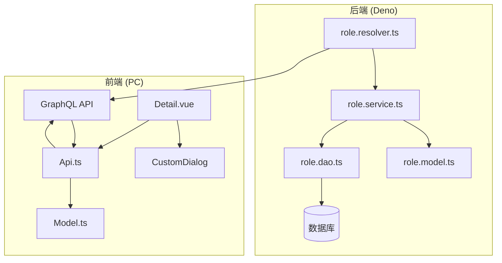
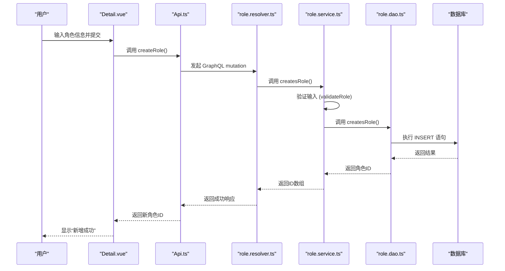
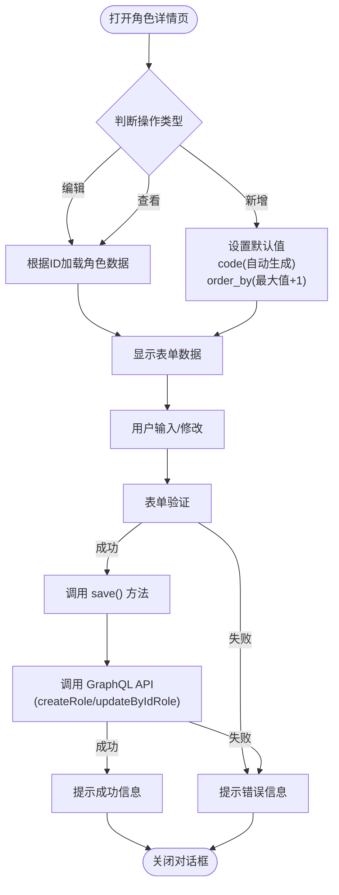

# 角色管理


**本文档引用的文件**  
- [role.service.ts](https://github.com/sail-sail/nest/blob/main/deno\gen\base\role\role.service.ts)
- [role.dao.ts](https://github.com/sail-sail/nest/blob/main/deno\gen\base\role\role.dao.ts)
- [role.model.ts](https://github.com/sail-sail/nest/blob/main/deno\gen\base\role\role.model.ts)
- [role.resolver.ts](https://github.com/sail-sail/nest/blob/main/deno\gen\base\role\role.resolver.ts)
- [Detail.vue](https://github.com/sail-sail/nest/blob/main/pc\src\views\base\role\Detail.vue)
- [Api.ts](https://github.com/sail-sail/nest/blob/main/pc\src\views\base\role\Api.ts)
- [Model.ts](https://github.com/sail-sail/nest/blob/main/pc\src\views\base\role\Model.ts)


## 目录
1. [简介](#简介)
2. [项目结构](#项目结构)
3. [核心组件](#核心组件)
4. [架构概述](#架构概述)
5. [详细组件分析](#详细组件分析)
6. [依赖分析](#依赖分析)
7. [性能考虑](#性能考虑)
8. [故障排除指南](#故障排除指南)
9. [结论](#结论)

## 简介
本文档详细介绍了基于 NestJS 和 Deno 构建的角色管理功能。该功能允许系统管理员创建、更新、删除和查询角色，并将角色与用户、菜单、权限等实体进行关联。文档重点分析了角色服务（role.service.ts）中的核心方法，包括角色的增删改查逻辑，以及角色与权限的绑定机制。同时，文档还涵盖了前端角色管理界面（Detail.vue）的实现细节，展示了表单验证、权限选择器和用户关联功能的使用示例。通过本指南，开发者可以深入了解角色管理模块的设计与实现，遵循最佳实践，并解决常见问题。

## 项目结构
角色管理功能分布在后端（Deno）和前端（PC）两个主要模块中。后端逻辑位于 `deno/gen/base/role/` 目录下，包含数据访问对象（DAO）、服务层、模型和解析器。前端界面位于 `pc/src/views/base/role/` 目录下，由 Vue 组件、API 客户端和类型定义文件组成。



**图示来源**
- [role.service.ts](https://github.com/sail-sail/nest/blob/main/deno\gen\base\role\role.service.ts)
- [role.dao.ts](https://github.com/sail-sail/nest/blob/main/deno\gen\base\role\role.dao.ts)
- [Detail.vue](https://github.com/sail-sail/nest/blob/main/pc\src\views\base\role\Detail.vue)
- [Api.ts](https://github.com/sail-sail/nest/blob/main/pc\src\views\base\role\Api.ts)

## 核心组件
角色管理的核心在于后端的服务层和数据访问层，以及前端的用户交互界面。`role.service.ts` 文件定义了所有业务逻辑，如角色的创建、更新和删除。`role.dao.ts` 负责与数据库进行交互，执行具体的 SQL 查询。`Detail.vue` 是用户进行角色管理操作的主要界面，它通过 `Api.ts` 中定义的 GraphQL 调用与后端服务通信。

**组件来源**
- [role.service.ts](https://github.com/sail-sail/nest/blob/main/deno\gen\base\role\role.service.ts#L1-L300)
- [role.dao.ts](https://github.com/sail-sail/nest/blob/main/deno\gen\base\role\role.dao.ts#L1-L800)
- [Detail.vue](https://github.com/sail-sail/nest/blob/main/pc\src\views\base\role\Detail.vue#L1-L800)

## 架构概述
系统采用典型的分层架构，从前端用户界面到后端服务，再到数据存储。前端通过 GraphQL API 发起请求，请求由 `role.resolver.ts` 接收并调用 `role.service.ts` 中的业务方法。服务层进行逻辑处理和验证后，调用 `role.dao.ts` 执行数据库操作。整个流程确保了业务逻辑与数据访问的分离，提高了代码的可维护性和可测试性。



**图示来源**
- [role.service.ts](https://github.com/sail-sail/nest/blob/main/deno\gen\base\role\role.service.ts#L150-L170)
- [role.dao.ts](https://github.com/sail-sail/nest/blob/main/deno\gen\base\role\role.dao.ts#L700-L750)
- [Api.ts](https://github.com/sail-sail/nest/blob/main/pc\src\views\base\role\Api.ts#L200-L220)
- [Detail.vue](https://github.com/sail-sail/nest/blob/main/pc\src\views\base\role\Detail.vue#L400-L450)

## 详细组件分析

### 角色服务分析
`role.service.ts` 是角色管理功能的核心，它封装了所有与角色相关的业务逻辑。

#### 核心方法
- **createsRole**: 批量创建角色。该方法接收一个 `RoleInput` 数组和一个可选的 `uniqueType` 参数，用于处理唯一性约束。
- **updateByIdRole**: 根据 ID 修改角色。在更新前会检查角色是否被锁定（`is_locked`），如果已锁定则抛出异常。
- **deleteByIdsRole**: 根据 IDs 删除角色。在删除前会进行双重检查：如果角色被锁定或标记为系统记录（`is_sys`），则禁止删除，确保了数据的安全性。
- **enableByIdsRole / lockByIdsRole**: 分别用于启用/禁用和锁定/解锁角色，通过更新 `is_enabled` 和 `is_locked` 字段来实现。

```mermaid
classDiagram
class RoleService {
+findCountRole(search : RoleSearch) : Promise~number~
+findAllRole(search : RoleSearch, page : PageInput, sort : SortInput[]) : Promise~RoleModel[]~
+findOneRole(search : RoleSearch, sort : SortInput[]) : Promise~RoleModel | undefined~
+createsRole(inputs : RoleInput[], options : {uniqueType? : UniqueType}) : Promise~RoleId[]~
+updateByIdRole(role_id : RoleId, input : RoleInput) : Promise~RoleId~
+deleteByIdsRole(role_ids : RoleId[]) : Promise~number~
+enableByIdsRole(ids : RoleId[], is_enabled : 0|1) : Promise~number~
+lockByIdsRole(role_ids : RoleId[], is_locked : 0|1) : Promise~number~
}
class RoleDao {
+findCountRole(search : RoleSearch) : Promise~number~
+findAllRole(search : RoleSearch, page : PageInput, sort : SortInput[]) : Promise~RoleModel[]~
+createsRole(inputs : RoleInput[], options : {uniqueType? : UniqueType}) : Promise~RoleId[]~
+updateByIdRole(role_id : RoleId, input : RoleInput) : Promise~RoleId~
+deleteByIdsRole(role_ids : RoleId[]) : Promise~number~
}
RoleService --> RoleDao : "使用"
```

**图示来源**
- [role.service.ts](https://github.com/sail-sail/nest/blob/main/deno\gen\base\role\role.service.ts#L1-L300)
- [role.dao.ts](https://github.com/sail-sail/nest/blob/main/deno\gen\base\role\role.dao.ts#L1-L800)

### 前端界面分析
`Detail.vue` 组件提供了角色的增、删、改、查界面。

#### 功能实现
- **表单验证**: 使用 `ElForm` 和 `form_rules` 实现。例如，名称（`lbl`）是必填项且长度不能超过45个字符，排序（`order_by`）也是必填项。
- **权限选择器**: 虽然在提供的代码片段中未直接展示，但通过 `menu_ids`, `permit_ids` 等字段可以推断，界面应包含用于选择菜单权限、按钮权限等的组件。
- **用户关联**: 代码中未直接体现用户关联功能，但 `role` 实体通常会通过多对多关系与 `usr`（用户）实体关联，此功能可能在其他界面或通过 API 实现。



**图示来源**
- [Detail.vue](https://github.com/sail-sail/nest/blob/main/pc\src\views\base\role\Detail.vue#L1-L800)
- [Api.ts](https://github.com/sail-sail/nest/blob/main/pc\src\views\base\role\Api.ts#L200-L250)

## 依赖分析
角色管理模块依赖于多个内部和外部组件。

```mermaid
graph TD
role.service.ts --> role.dao.ts
role.service.ts --> context.ts[get_usr_id, getTenant_id]
role.service.ts --> string_util.ts[isNotEmpty, isEmpty]
role.service.ts --> validators[验证器]
role.dao.ts --> context.ts[query, execute]
role.dao.ts --> string_util.ts
role.dao.ts --> dict_detail.dao.ts[getDict]
Detail.vue --> Api.ts
Api.ts --> GraphQL API
Api.ts --> Model.ts
Api.ts --> menu/Api.ts[getListMenu]
Api.ts --> permit/Api.ts[getListPermit]
```

**图示来源**
- [role.service.ts](https://github.com/sail-sail/nest/blob/main/deno\gen\base\role\role.service.ts#L1-L10)
- [role.dao.ts](https://github.com/sail-sail/nest/blob/main/deno\gen\base\role\role.dao.ts#L1-L20)
- [Api.ts](https://github.com/sail-sail/nest/blob/main/pc\src\views\base\role\Api.ts#L1-L50)

## 性能考虑
- **数据库查询优化**: `findAllRole` 方法使用了 `JSON_OBJECTAGG` 函数来聚合关联的权限ID，避免了多次查询，提高了效率。
- **缓存机制**: `findAllRole` 和 `findCountRole` 方法在查询时会生成缓存键（`cacheKey1`, `cacheKey2`），并利用缓存来减少对数据库的重复查询。
- **分页与限制**: 代码中对传入的 ID 列表长度进行了限制（`FIND_ALL_IDS_LIMIT`），防止因传入过长的 ID 列表而导致 SQL 查询性能下降或内存溢出。

## 故障排除指南
- **无法创建角色**: 检查 `input` 对象是否包含必填字段（如 `lbl`），并确认 `validateRole` 方法中定义的业务规则是否被违反。
- **无法更新角色**: 确认角色的 `is_locked` 字段是否为 `1`，如果是，则服务层会抛出“不能修改已经锁定的角色”的异常。
- **无法删除角色**: 检查角色是否为系统记录（`is_sys === 1`）或已被锁定（`is_locked === 1`），这两种情况均不允许删除。
- **前端界面无数据**: 确保 GraphQL API 调用成功，检查网络请求和后端日志。同时，确认 `search` 参数中的 `tenant_id` 是否正确，因为查询会根据当前用户的租户ID进行过滤。

**故障排除来源**
- [role.service.ts](https://github.com/sail-sail/nest/blob/main/deno\gen\base\role\role.service.ts#L200-L250)
- [role.dao.ts](https://github.com/sail-sail/nest/blob/main/deno\gen\base\role\role.dao.ts#L100-L150)

## 结论
本文档全面解析了角色管理功能的实现。该功能设计合理，通过清晰的分层架构和严格的业务逻辑验证，确保了角色数据的完整性和安全性。前端界面提供了直观的操作体验，后端服务则高效地处理了复杂的业务需求。开发者在扩展角色属性或实现新功能时，应遵循现有模式，保持代码的一致性，并充分利用已有的验证和权限控制机制。