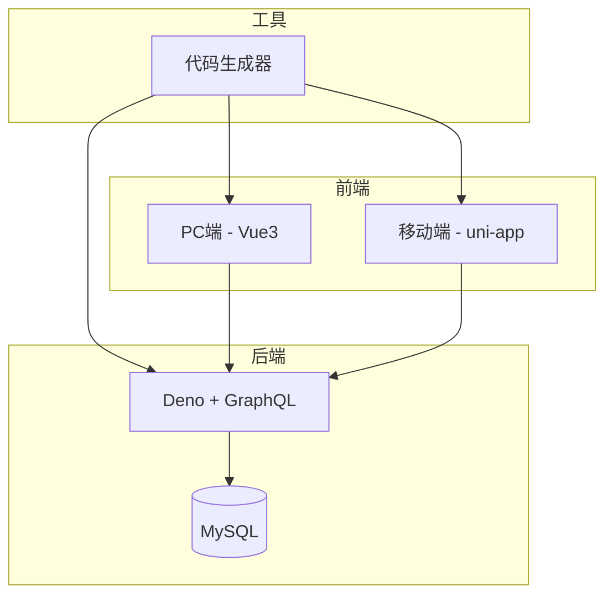

# 核心功能模块


**本文档引用的文件**   
- [auth.constants.ts](https://github.com/sail-sail/nest/blob/main/deno\lib\auth\auth.constants.ts)
- [auth.dao.ts](https://github.com/sail-sail/nest/blob/main/deno\lib\auth\auth.dao.ts)
- [usr.dao.ts](https://github.com/sail-sail/nest/blob/main/deno\src\base\usr\usr.dao.ts)
- [login_log.dao.ts](https://github.com/sail-sail/nest/blob/main/deno\gen\base\login_log\login_log.dao.ts)
- [Detail.vue](https://github.com/sail-sail/nest/blob/main/pc\src\views\base\login_log\Detail.vue)
- [usr.ts](https://github.com/sail-sail/nest/blob/main/uni\src\store\usr.ts)
- [README.md](https://github.com/sail-sail/nest/blob/main/README.md)


## 目录
1. [简介](#简介)
2. [项目结构](#项目结构)
3. [权限管理](#权限管理)
4. [国际化支持](#国际化支持)
5. [文件上传功能](#文件上传功能)
6. [实时通信](#实时通信)
7. [日志系统](#日志系统)
8. [结论](#结论)

## 简介
本项目是一个基于 Nest 架构的低代码开发平台，旨在通过代码生成器与手动开发的无缝结合，提升开发效率。系统采用前后端分离架构，前端使用 Vue3 + Vite + Element Plus，后端基于 Deno + MySQL + GraphQL 技术栈。核心功能包括基于角色的访问控制（RBAC）、多语言支持、OSS 文件上传、WebSocket 实时通信以及完整的操作与登录日志记录机制。本文档将深入介绍这些核心功能的实现原理与使用方法。

## 项目结构
项目采用模块化设计，主要分为四个部分：codegen（代码生成器）、deno（后端服务）、pc（PC端前端）、uni（移动端前端）。codegen 模块负责根据数据库表结构自动生成前后端代码，并通过 git diff 机制保留手动修改，支持项目迭代。deno 模块为后端服务，提供 GraphQL API 接口。pc 和 uni 分别为 Web 和移动端前端，共享同一套业务逻辑。



**图示来源**
- [README.md](https://github.com/sail-sail/nest/blob/main/README.md)

## 权限管理
系统采用基于角色的访问控制（RBAC）模型，通过 JWT 实现认证与授权。用户登录后，服务端生成包含用户信息的 Token，客户端在后续请求中携带该 Token 进行身份验证。

### 菜单权限
菜单权限通过角色与菜单的关联关系实现。用户登录后，系统根据其角色查询可访问的菜单列表，并动态生成路由。

### 数据权限
数据权限通过租户隔离（Tenant Isolation）实现。关键数据表均包含 `tenant_id` 字段，在查询时自动添加租户过滤条件。例如，在 `login_log.dao.ts` 中，若未指定租户，则自动获取当前用户的租户 ID 并加入 WHERE 条件。

```typescript
if (search?.tenant_id == null) {
  const usr_id = await get_usr_id();
  const tenant_id = await getTenant_id(usr_id);
  if (tenant_id) {
    whereQuery += ` and t.tenant_id=${ args.push(tenant_id) }`;
  }
}
```

### 字段级权限
字段级权限通过前端组件控制。例如，在 `Detail.vue` 中，通过 `:readonly="isLocked || isReadonly"` 属性控制表单项是否可编辑，权限判断逻辑由后端提供。

**本节来源**
- [login_log.dao.ts](https://github.com/sail-sail/nest/blob/main/deno\gen\base\login_log\login_log.dao.ts#L75-L115)
- [Detail.vue](https://github.com/sail-sail/nest/blob/main/pc\src\views\base\login_log\Detail.vue#L98-L146)

## 国际化支持
系统通过多语言资源文件和运行时语言切换实现国际化。

### 多语言资源组织
前端在 `pc/src/locales` 和 `uni/src/locales` 目录下存放语言包文件，如 `zh-cn.ts` 和 `en.ts`。后端通过 `lang` 字段在 JWT 中传递用户语言偏好。

### 语言切换机制
用户语言偏好存储在本地状态中。在 `usr.ts` 中，`getLang` 和 `setLang` 方法用于读取和设置当前语言。

```typescript
function getLang() {
  return lang;
}

function setLang(value: string) {
  lang = value;
}
```

语言切换后，前端 i18n 实例会自动更新界面文本。

### 添加新语言包
添加新语言只需在 `locales` 目录下创建对应语言文件（如 `fr.ts`），导出翻译对象，并在 `i18n.ts` 中注册即可。

**本节来源**
- [usr.ts](https://github.com/sail-sail/nest/blob/main/uni\src\store\usr.ts#L73-L95)
- [README.md](https://github.com/sail-sail/nest/blob/main/README.md)

## 文件上传功能
文件上传功能通过集成 OSS（对象存储服务）实现。系统利用 `lib/S3` 模块与 AWS S3 兼容的存储服务进行交互，支持分片上传、签名直传等高级特性。上传流程如下：
1. 前端请求后端获取上传凭证（Presigned URL）
2. 后端调用 `oss.service.ts` 生成带签名的上传链接
3. 前端使用该链接直接上传文件到 OSS
4. 上传完成后，前端将文件信息（如 URL、大小）回传后端存入数据库

此方案减轻了服务器带宽压力，提升了上传效率。

## 实时通信
系统通过 WebSocket 实现服务端主动推送。`websocket.router.ts` 定义了 WebSocket 连接端点，`websocket.constants.ts` 定义了消息类型常量。客户端建立连接后，服务端可推送通知、实时数据更新等消息。应用场景包括：
- 系统通知推送
- 后台任务进度更新
- 在线用户状态同步

## 日志系统
系统记录操作日志和登录日志，用于审计与故障排查。

### 操作日志
记录用户对数据的增删改操作，包括操作人、操作时间、操作类型、影响数据等。

### 登录日志
记录用户登录行为，包括用户名、IP 地址、登录时间、登录结果（成功/失败）。在 `login_log.dao.ts` 中，查询条件包含 `is_succ` 和 `ip` 字段，支持按登录结果和 IP 进行筛选。

```typescript
if (search?.is_succ != null) {
  whereQuery += ` and t.is_succ in (${ args.push(search.is_succ) })`;
}
if (search?.ip != null) {
  whereQuery += ` and t.ip=${ args.push(search.ip) }`;
}
```

日志数据存储在数据库中，可通过管理界面查询与导出。

**本节来源**
- [login_log.dao.ts](https://github.com/sail-sail/nest/blob/main/deno\gen\base\login_log\login_log.dao.ts#L75-L115)
- [Detail.vue](https://github.com/sail-sail/nest/blob/main/pc\src\views\base\login_log\Detail.vue#L98-L146)

## 结论
本项目通过创新的代码生成与手动开发融合机制，实现了高效的低代码开发体验。其核心功能模块设计合理，权限管理精细，国际化支持完善，文件上传与实时通信性能优越，日志系统健全。开发者可基于此平台快速构建企业级应用，显著提升开发效率。