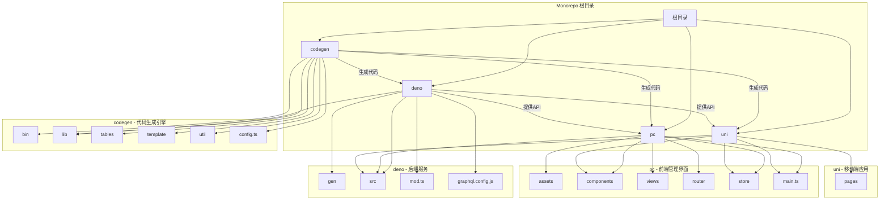
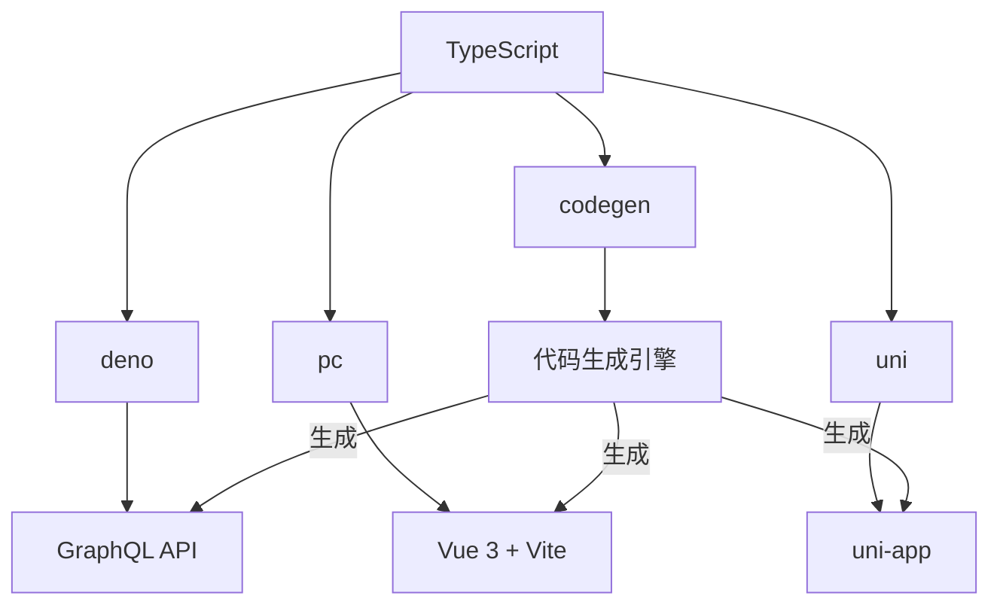
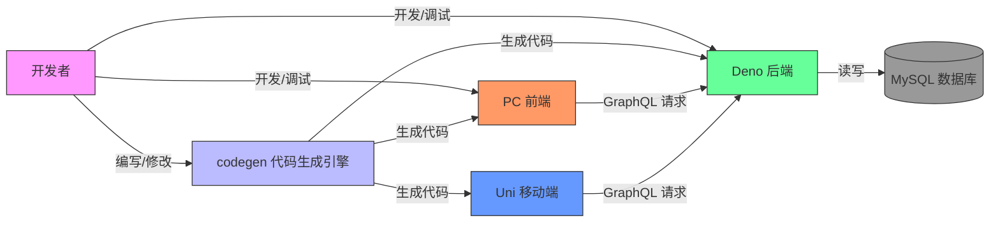

# 系统概述

**本文档引用文件**  
- [README.md](https://github.com/sail-sail/nest/blob/main/README.md)
- [package.json](https://github.com/sail-sail/nest/blob/main/package.json)
- [codegen/package.json](https://github.com/sail-sail/nest/blob/main/codegen/package.json)
- [deno/package.json](https://github.com/sail-sail/nest/blob/main/deno/package.json)
- [pc/package.json](https://github.com/sail-sail/nest/blob/main/pc/package.json)
- [uni/package.json](https://github.com/sail-sail/nest/blob/main/uni/package.json)
- [codegen/src/config.ts](https://github.com/sail-sail/nest/blob/main/codegen/src/config.ts)
- [pc/src/utils/config.ts](https://github.com/sail-sail/nest/blob/main/pc/src/utils/config.ts)
- [uni/src/utils/config.ts](https://github.com/sail-sail/nest/blob/main/uni/src/utils/config.ts)

## 目录
1. [系统概述](#系统概述)
2. [项目结构](#项目结构)
3. [核心价值与架构定位](#核心价值与架构定位)
4. [技术栈分析](#技术栈分析)
5. [系统上下文图](#系统上下文图)
6. [主要功能特性](#主要功能特性)
7. [代码生成机制详解](#代码生成机制详解)

## 项目结构

本项目采用单体仓库（Monorepo）架构，将多个相关但独立的子项目统一管理于一个代码仓库中。整体结构清晰，分为四个核心组成部分：`codegen`（代码生成引擎）、`deno`（后端服务）、`pc`（前端管理界面）和`uni`（移动端应用）。此外，根目录下包含通用配置文件和脚本，便于统一管理和跨项目协作。

**图示来源**  
- [项目结构](https://github.com/sail-sail/nest/blob/main/README.md)
- [package.json](https://github.com/sail-sail/nest/blob/main/package.json)

## 核心价值与架构定位

### 传统开发模式的痛点

1. **可视化低代码平台的局限性**：传统的拖拽式低代码平台虽然降低了入门门槛，但对开发人员而言存在较高的学习成本，且灵活性不足，难以进行深度定制化开发。同时，这些平台往往无法及时集成最新的技术栈和生态工具，限制了技术的演进。

2. **传统代码生成器的缺陷**：传统的代码生成器通过模板生成代码，但一旦手动修改了生成的代码，在下次重新生成时会覆盖之前的修改，导致无法在项目开发过程中持续使用。这种“一次性”特性使得代码生成器仅适用于项目初始化阶段，难以支持快速迭代的需求。

### 本项目的创新解决方案

本项目提出了一种全新的代码生成模式，旨在解决上述两大痛点，实现**代码生成器与手动开发的无缝融合**。其核心思想是：

> **通过代码生成器生成代码，但生成的代码在手动修改后能够被自动识别，并在下次生成时保留这些修改，从而实现增量式代码生成。**

该机制利用 `git diff` 和 `git apply` 技术来精确识别代码的变化，确保自动生成的代码不会覆盖开发人员的手动修改。这种方式不仅保留了代码生成器的高效性，还赋予了开发人员完全的代码控制权，实现了“10倍开发效率”的提升。

**Section sources**  
- [README.md](https://github.com/sail-sail/nest/blob/main/README.md#L1-L32)

## 技术栈分析

本项目基于现代前端和后端技术栈构建，各子系统采用最适合其场景的技术组合。

### 后端技术栈（Deno）

- **运行时**：采用 **Deno** 作为后端运行时环境。Deno 是由 Node.js 原作者开发的现代 JavaScript/TypeScript 运行时，内置 TypeScript 支持、安全沙箱和现代模块系统，相比 Node.js 更加安全和现代化。
- **数据库**：使用 **MySQL** 作为持久化存储。
- **API 协议**：采用 **GraphQL** 作为前后端数据交互协议，提供灵活、高效的数据查询能力。
- **语言**：使用 **TypeScript** 编写，保证了代码的类型安全和可维护性。

### 前端技术栈（PC 端）

- **框架**：采用 **Vue 3** 作为核心前端框架，利用其 Composition API 和响应式系统构建复杂的用户界面。
- **构建工具**：使用 **Vite** 作为构建工具，提供极速的冷启动和热更新体验。
- **UI 库**：使用 **Element Plus** 作为 UI 组件库，提供丰富的桌面端组件。
- **状态管理**：使用 **Pinia**（在 uni 项目中）或 Vuex（在 pc 项目中）进行状态管理。
- **语言**：使用 **TypeScript** 编写，增强类型安全。

### 移动端技术栈（uni-app）

- **框架**：采用 **uni-app** 框架，实现“一次开发，多端部署”（H5、微信小程序、App 等）。
- **语言**：同样使用 **TypeScript** 和 **Vue 3**，保证技术栈的一致性。

### 代码生成引擎（codegen）

- **语言**：使用 **TypeScript** 编写，与项目主体技术栈保持一致。
- **核心工具**：依赖 `ts-node` 直接运行 TypeScript 脚本，`mysql2` 访问数据库元信息，`ejsexcel` 处理 Excel 导入等。

**Diagram sources**  
- [package.json](https://github.com/sail-sail/nest/blob/main/package.json)
- [codegen/package.json](https://github.com/sail-sail/nest/blob/main/codegen/package.json)
- [deno/package.json](https://github.com/sail-sail/nest/blob/main/deno/package.json)
- [pc/package.json](https://github.com/sail-sail/nest/blob/main/pc/package.json)
- [uni/package.json](https://github.com/sail-sail/nest/blob/main/uni/package.json)

## 系统上下文图

下图展示了本系统中各主要子系统之间的关系和数据流向。

**Diagram sources**  
- [README.md](https://github.com/sail-sail/nest/blob/main/README.md)
- [package.json](https://github.com/sail-sail/nest/blob/main/package.json)

## 主要功能特性

本项目不仅是一个代码生成工具，更是一个功能完备的全栈应用开发框架，具备以下核心功能特性：

1. **基于数据库模式的全栈代码自动生成**：根据数据库表结构（Schema），自动生成后端 GraphQL API、DAO 层、Service 层，以及前端的页面、路由、组件和 API 调用代码，覆盖 CRUD 全流程。

2. **完整的 CRUD 操作支持**：为每个数据表自动生成创建（Create）、读取（Read）、更新（Update）和删除（Delete）操作的前后端代码。

3. **权限管理**：内置基于角色的访问控制（RBAC）系统，支持租户、用户、角色、菜单和数据权限的精细化管理。

4. **国际化支持（i18n）**：系统支持多语言，可通过配置轻松实现界面的国际化。

5. **文件上传与管理**：集成文件上传功能，支持通过 S3 或本地存储管理文件。

6. **实时通信能力**：通过 WebSocket 实现前后端的实时通信，可用于消息推送、实时日志等场景。

7. **多端支持**：一套代码生成逻辑，可同时生成 PC 端（Vue 3）和移动端（uni-app）的应用代码，实现全栈全端覆盖。

**Section sources**  
- [README.md](https://github.com/sail-sail/nest/blob/main/README.md)
- [project_structure](https://github.com/sail-sail/nest/blob/main/project_structure)

## 代码生成机制详解

代码生成的核心流程如下：

1. **配置与初始化**：开发者在 `codegen` 目录下的 `config.ts` 文件中配置数据库连接信息和其他生成参数。
2. **读取数据库元信息**：`codegen` 引擎连接到 MySQL 数据库，通过 `information_schema` 读取所有表的结构信息（字段、类型、约束等）。
3. **模板渲染**：引擎根据预定义的模板（位于 `codegen/template/` 目录下），将数据库元信息填充到模板中，生成对应的 TypeScript、Vue 和 GraphQL 代码。
4. **增量代码合并**：生成的代码并非简单覆盖，而是通过 `git diff` 比对现有代码与新生成代码的差异，使用 `git apply` 将增量部分应用到现有代码中，从而保护开发者的手动修改。
5. **输出到目标目录**：最终的代码被输出到 `deno/gen/`、`pc/src/views/` 和 `uni/src/pages/` 等目标目录。

此机制确保了代码生成器可以作为开发过程中的“活工具”，而非“一次性脚手架”，极大地提升了开发效率和代码的可维护性。

**Section sources**  
- [codegen/src/config.ts](https://github.com/sail-sail/nest/blob/main/codegen/src/config.ts)
- [codegen/src/lib/information_schema.ts](https://github.com/sail-sail/nest/blob/main/codegen/src/lib/information_schema.ts)
- [codegen/src/template](https://github.com/sail-sail/nest/blob/main/codegen/src/template)