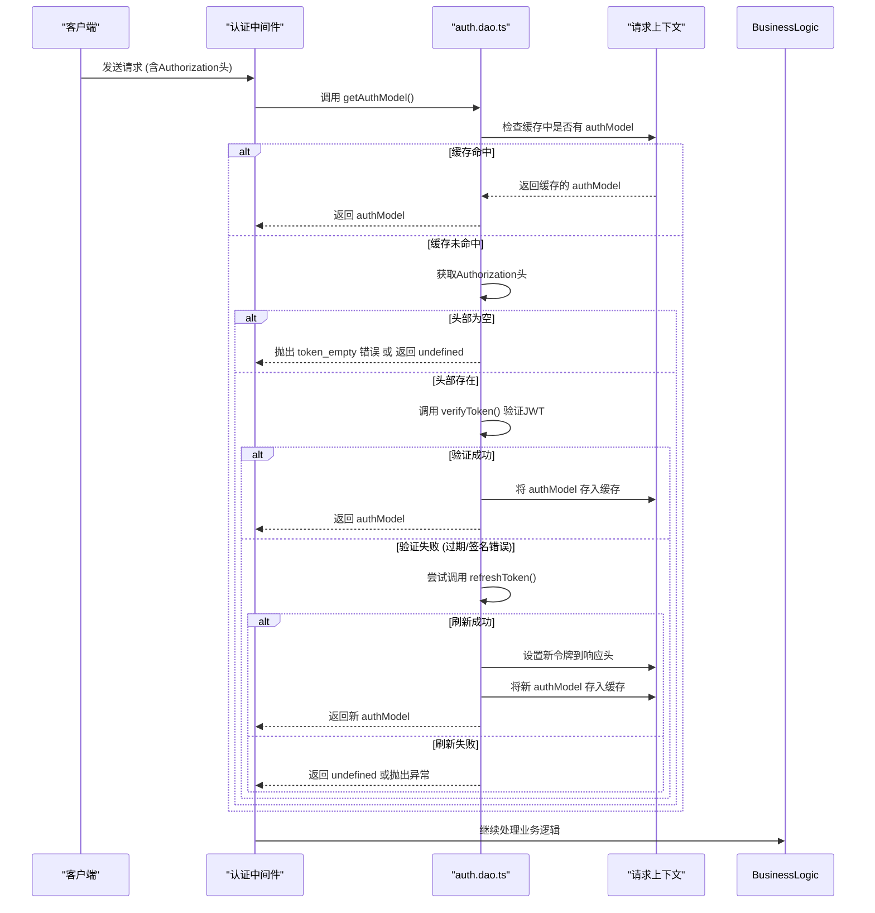
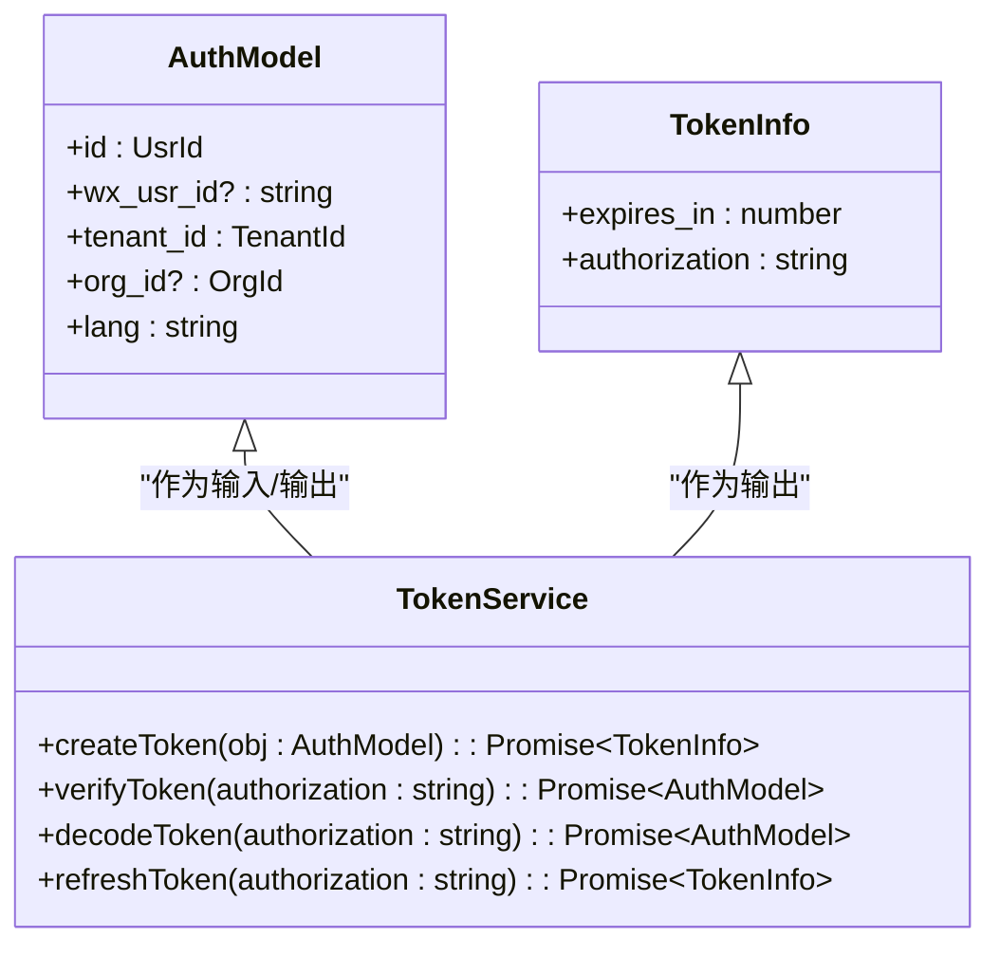
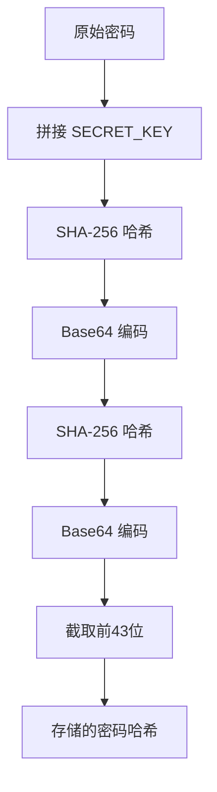

# 安全考虑


**本文档引用的文件**  
- [auth.dao.ts](https://github.com/sail-sail/nest/blob/main/deno\lib\auth\auth.dao.ts)
- [auth.constants.ts](https://github.com/sail-sail/nest/blob/main/deno\lib\auth\auth.constants.ts)
- [auth.service.ts](https://github.com/sail-sail/nest/blob/main/deno\lib\auth\auth.service.ts)
- [config.ts](https://github.com/sail-sail/nest/blob/main/codegen\src\config.ts)
- [operation_record.dao.ts](https://github.com/sail-sail/nest/blob/main/deno\gen\base\operation_record\operation_record.dao.ts)
- [background_task.dao.ts](https://github.com/sail-sail/nest/blob/main/deno\gen\base\background_task\background_task.dao.ts)
- [usr.ts](https://github.com/sail-sail/nest/blob/main/uni\src\store\usr.ts)


## 目录
1. [引言](#引言)
2. [身份认证与授权机制](#身份认证与授权机制)
3. [JWT令牌安全机制](#jwt令牌安全机制)
4. [密码安全处理策略](#密码安全处理策略)
5. [输入验证与数据校验](#输入验证与数据校验)
6. [SQL注入防护](#sql注入防护)
7. [敏感数据存储与加密](#敏感数据存储与加密)
8. [安全审计日志](#安全审计日志)
9. [安全配置与最佳实践](#安全配置与最佳实践)

## 引言
本安全考虑文档系统性地阐述了 `hugjs-nest` 项目中实施的各项安全防护措施。项目基于 Deno 运行时构建，采用模块化设计，重点关注身份认证、数据验证、加密存储和操作审计等关键安全领域。通过分析核心代码文件，本文档详细说明了如何防范常见 Web 安全漏洞，并展示了安全机制的具体实现。

## 身份认证与授权机制

### 认证流程与中间件设计
项目采用基于 JWT（JSON Web Token）的无状态身份认证机制。核心逻辑位于 `deno/lib/auth/` 目录下，通过 `auth.dao.ts` 和 `auth.service.ts` 文件实现。

认证流程如下：
1.  客户端在 HTTP 请求头中携带 `Authorization: Bearer <token>`。
2.  服务端中间件（隐含在 `useContext()` 调用中）调用 `getAuthModel()` 函数解析并验证令牌。
3.  验证成功后，将用户身份信息（`AuthModel`）缓存于当前请求上下文（`context.cacheMap`），供后续业务逻辑使用。

`getAuthModel()` 函数是权限检查的核心，它实现了灵活的验证策略：
-   当 `notVerifyToken` 参数为 `false` 或未提供时，必须提供有效令牌，否则抛出 `token_empty` 错误。
-   当 `notVerifyToken` 为 `true` 时，允许在不验证签名的情况下解码令牌（用于特定场景），若令牌无效则返回 `undefined` 而非抛出异常。



**图示来源**
- [auth.dao.ts](https://github.com/sail-sail/nest/blob/main/deno\lib\auth\auth.dao.ts#L29-L73)

**本节来源**
- [auth.dao.ts](https://github.com/sail-sail/nest/blob/main/deno\lib\auth\auth.dao.ts#L0-L219)
- [auth.service.ts](https://github.com/sail-sail/nest/blob/main/deno\lib\auth\auth.service.ts#L0-L54)

## JWT令牌安全机制

### 令牌的生成、验证与刷新
项目使用 `jose` 库来安全地处理 JWT 令牌，确保了标准的实现和安全性。

**令牌生成 (`createToken`)**
-   **算法**: 使用 `HS256` (HMAC SHA-256) 算法进行签名，确保令牌的完整性和防篡改。
-   **密钥**: 使用一个硬编码的 `SECRET_KEY` ("38e52379-9e94-467c-8e63-17ad318fc845")。**注意**：在生产环境中，此密钥应通过环境变量配置，而非硬编码。
-   **有效期**: 令牌的有效期由环境变量 `server_tokentimeout` 动态决定，增强了配置的灵活性。

**令牌验证 (`verifyToken`)**
-   服务端使用相同的 `SECRET_KEY` 对收到的令牌进行签名验证。
-   如果验证失败（签名不匹配或令牌过期），会捕获相应的错误（`JWTExpired`, `JWSSignatureVerificationFailed`）并进行处理。

**令牌刷新 (`refreshToken`)**
-   当令牌过期时，系统支持通过 `refreshToken` 函数生成新令牌。
-   该函数会解码旧令牌，提取除 `iat` (签发时间) 和 `exp` (过期时间) 外的所有有效载荷信息，然后用这些信息创建一个新的、具有新鲜有效期的令牌。
-   这种机制在提升用户体验（避免频繁登录）的同时，也通过限制刷新窗口（检查旧令牌是否在可刷新时间内）来保证安全性。



**图示来源**
- [auth.constants.ts](https://github.com/sail-sail/nest/blob/main/deno\lib\auth\auth.constants.ts#L15-L22)
- [auth.dao.ts](https://github.com/sail-sail/nest/blob/main/deno\lib\auth\auth.dao.ts#L150-L219)

## 密码安全处理策略

### 加密存储与哈希算法
项目对用户密码采用了双重 SHA-256 哈希算法进行加密存储，有效防止了明文密码泄露。

**`getPassword` 函数实现细节**:
1.  **加盐哈希**: 首先将用户提供的密码字符串与全局 `SECRET_KEY` 进行拼接，然后进行一次 SHA-256 哈希。这相当于为密码添加了一个固定的“盐”（salt），可以有效抵御彩虹表攻击。
2.  **二次哈希**: 将第一次哈希的结果进行 Base64 编码，再对编码后的字符串进行第二次 SHA-256 哈希。
3.  **截取输出**: 最终对第二次哈希的结果进行 Base64 编码，并截取前 43 个字符作为最终的密码哈希值。

此过程确保了即使数据库被泄露，攻击者也极难通过哈希值反推出原始密码。



**图示来源**
- [auth.constants.ts](https://github.com/sail-sail/nest/blob/main/deno\lib\auth\auth.constants.ts#L24-L32)

**本节来源**
- [auth.constants.ts](https://github.com/sail-sail/nest/blob/main/deno\lib\auth\auth.constants.ts#L24-L32)
- [auth.service.ts](https://github.com/sail-sail/nest/blob/main/deno\lib\auth\auth.service.ts#L48-L54)

## 输入验证与数据校验

### 基于配置的输入验证
项目通过 `codegen` 模块实现了强大的输入验证机制，该机制在代码生成阶段就将验证规则嵌入到数据访问层（DAO）中。

**验证规则来源**:
`codegen/src/config.ts` 文件中定义了 `Validator` 接口，支持多种验证类型，包括：
-   **数值范围**: `maximum`, `minimum`
-   **数值倍数**: `multiple_of`
-   **字符串长度**: `chars_max_length`, `chars_min_length`
-   **格式校验**: `email`, `url`, `ip`, `regex`

**验证执行**:
在生成的 DAO 文件（如 `operation_record.dao.ts`）中，对于每个需要验证的字段，都会插入相应的验证调用。例如，对于一个设置了 `chars_max_length` 的字段，生成的代码会包含：
```typescript
await validators.chars_max_length(
  input.<字段名>,
  <最大长度>,
  fieldComments.<字段名>,
);
```
这种在服务端入口处进行强制验证的策略，有效防止了恶意或格式错误的数据进入系统。

**本节来源**
- [config.ts](https://github.com/sail-sail/nest/blob/main/codegen\src\config.ts#L663-L737)
- [operation_record.dao.ts](https://github.com/sail-sail/nest/blob/main/deno\gen\base\operation_record\operation_record.dao.ts#L3684-L3727)

## SQL注入防护

### 参数化查询与安全拼接
项目通过使用参数化查询（Parameterized Queries）和安全的 SQL 拼接技术，从根本上杜绝了 SQL 注入攻击的风险。

**实现方式**:
在生成的 DAO 文件（如 `background_task.dao.ts`）中，SQL 语句的构建遵循以下原则：
1.  **动态值使用占位符**: 所有来自用户输入的动态值（如 `input.update_usr_id`）都不会直接拼接到 SQL 字符串中。
2.  **使用参数数组**: 动态值通过 `args.push()` 方法添加到一个参数数组中。
3.  **占位符替换**: SQL 字符串中使用 `?` 作为占位符，实际的数据库驱动会在执行时用参数数组中的值安全地替换这些占位符。

例如，以下代码片段展示了如何安全地处理 `update_usr_id` 字段：
```typescript
if (input.update_usr_id != null) {
  sql += `,${ args.push(input.update_usr_id) }`; // 将值推入数组
} else {
  sql += ",default"; // 使用数据库默认值
}
// 最终SQL可能形如: ... UPDATE_USR_ID = ? ...
```
由于用户输入的数据被严格分离为参数，数据库引擎会将其视为纯数据而非可执行的 SQL 代码，从而完全阻止了 SQL 注入。

**本节来源**
- [background_task.dao.ts](https://github.com/sail-sail/nest/blob/main/deno\gen\base\background_task\background_task.dao.ts#L1451-L1500)
- [operation_record.dao.ts](https://github.com/sail-sail/nest/blob/main/deno\gen\base\operation_record\operation_record.dao.ts#L1258-L1307)

## 敏感数据存储与加密

### 敏感信息的处理
项目对敏感数据的存储采取了谨慎的策略：
-   **密码**: 如前所述，使用双重 SHA-256 哈希加盐存储，确保不可逆。
-   **令牌**: JWT 令牌本身是加密的，且通过 `Authorization` 头传输。服务端不存储令牌，只验证其有效性。
-   **密钥**: `SECRET_KEY` 目前硬编码在 `auth.constants.ts` 文件中。这是一个潜在的安全风险，建议通过环境变量或密钥管理服务（KMS）来管理。

**客户端存储**:
在前端 `uni/src/store/usr.ts` 文件中，用户的 `authorization` (令牌) 和 `usr_id` 等信息被存储在 Vuex store 中。虽然这方便了应用状态管理，但应确保这些信息不会被持久化到不安全的本地存储（如 `localStorage`）中，以防止 XSS 攻击窃取。

**本节来源**
- [auth.constants.ts](https://github.com/sail-sail/nest/blob/main/deno\lib\auth\auth.constants.ts#L10)
- [usr.ts](https://github.com/sail-sail/nest/blob/main/uni\src\store\usr.ts#L73-L95)

## 安全审计日志

### 操作记录与溯源
项目通过 `operation_record` 模块实现了操作审计功能，能够追踪关键数据的变更。

**审计内容**:
根据 `operation_record.dao.ts` 的代码，系统会自动记录以下信息：
-   **操作模块 (`module`)**: 记录操作发生在哪个功能模块。
-   **操作方法 (`method`)**: 记录具体的操作类型（如创建、更新）。
-   **操作者 (`create_usr_id`, `update_usr_id`)**: 记录执行创建和更新操作的用户ID。
-   **操作者标签 (`create_usr_id_lbl`, `update_usr_id_lbl`)**: 记录操作者的用户名或标签。
-   **操作时间**: 由数据库自动填充。

**实现机制**:
当业务逻辑调用 `operation_record` 的 DAO 方法时，系统会自动从当前认证上下文（`getAuthModel()`）中获取当前用户的 `usr_id` 和 `usr_lbl`，并将其作为 `create_usr_id` 和 `create_usr_id_lbl` 写入审计日志。这确保了日志的准确性和不可抵赖性。

**本节来源**
- [operation_record.dao.ts](https://github.com/sail-sail/nest/blob/main/deno\gen\base\operation_record\operation_record.dao.ts#L1258-L1307)

## 安全配置与最佳实践

### 总结与建议
本项目在安全设计上展现了良好的实践，但也存在可改进之处。

**已实施的安全措施**:
-   **认证与授权**: 成熟的 JWT 机制，支持令牌刷新。
-   **输入验证**: 全面的、基于配置的输入校验。
-   **数据安全**: 参数化查询防止 SQL 注入，密码双重哈希存储。
-   **审计追踪**: 完善的操作日志记录。

**改进建议**:
1.  **密钥管理**: 将 `SECRET_KEY` 从代码中移除，改用环境变量或专业的密钥管理系统。
2.  **CORS 策略**: 文档中未提及 CORS 配置，应明确设置 `Access-Control-Allow-Origin` 等头信息，防止跨站请求伪造（CSRF）。
3.  **速率限制**: 应在 API 网关或应用层实现速率限制，防止暴力破解和 DDoS 攻击。
4.  **XSS 防护**: 虽然服务端返回的数据是 JSON，但前端应用（如 `pc` 和 `uni`）应确保对用户输入的内容进行安全转义，避免在 HTML 中直接渲染。
5.  **定期安全评估**: 建立定期的代码审计和渗透测试流程，及时发现并修复潜在漏洞。

通过遵循这些最佳实践，可以进一步提升 `hugjs-nest` 项目的整体安全性。