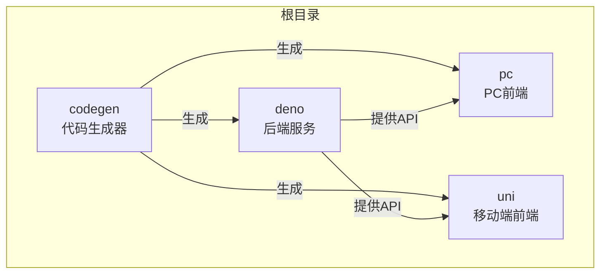
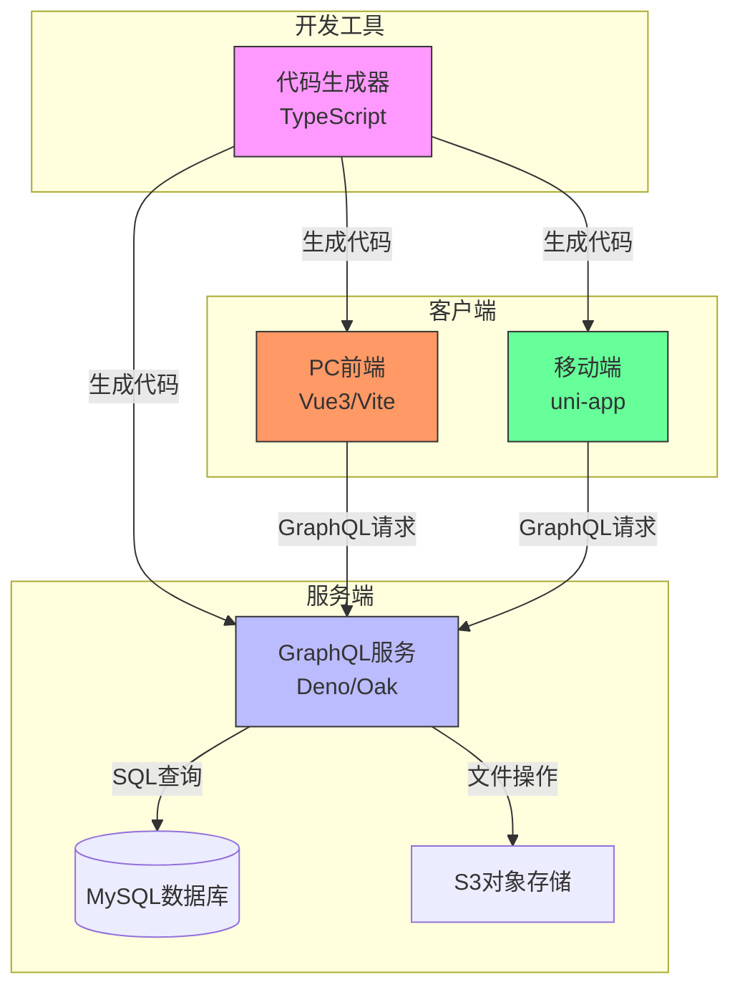
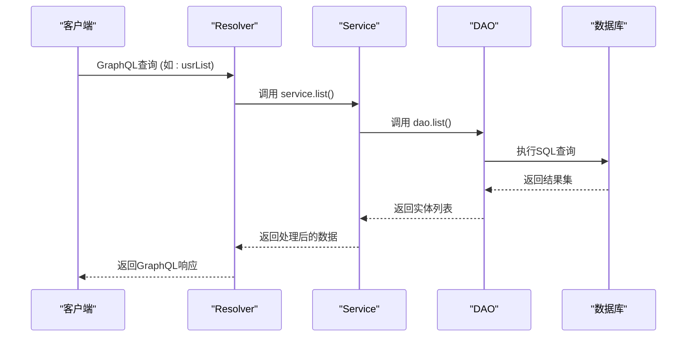
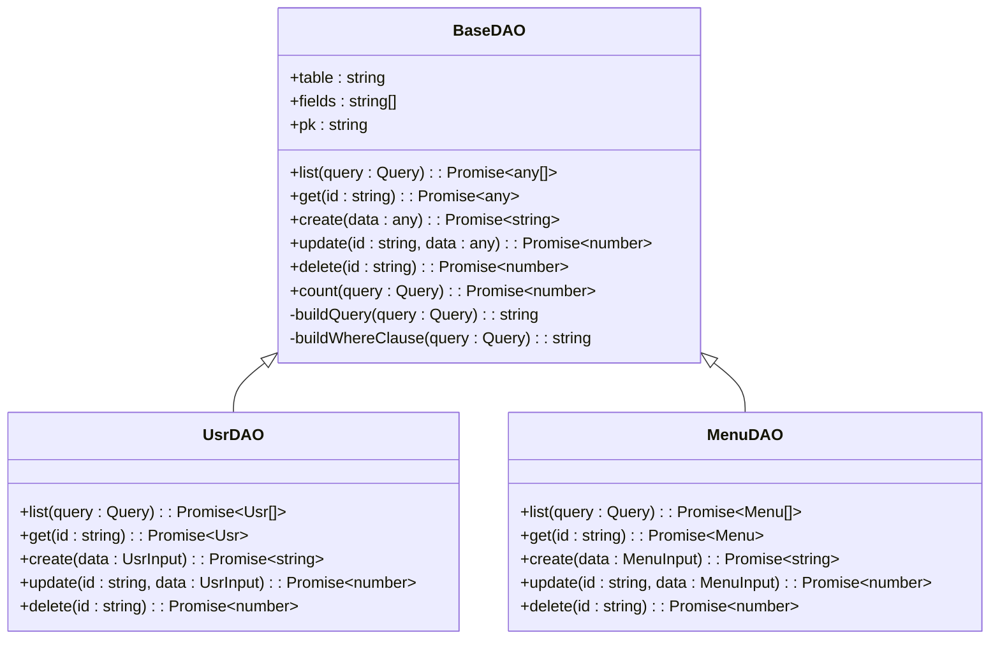
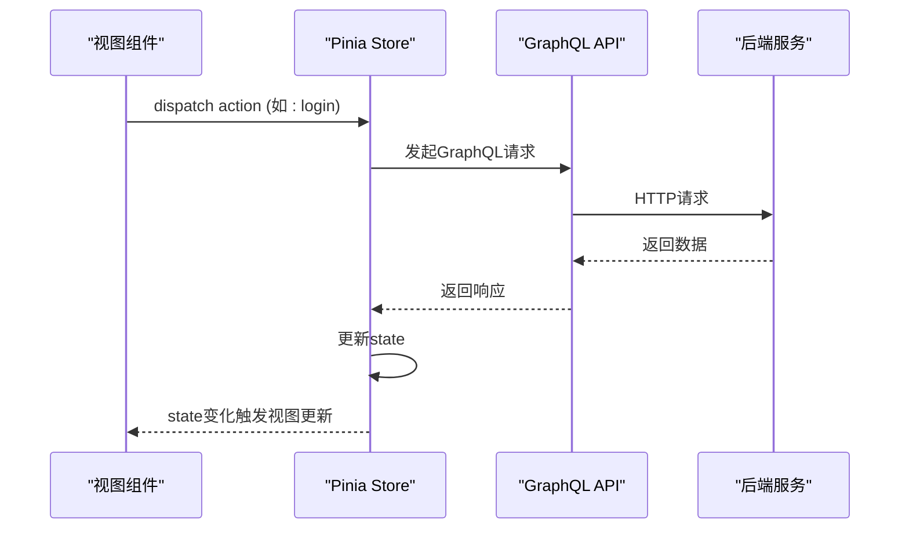
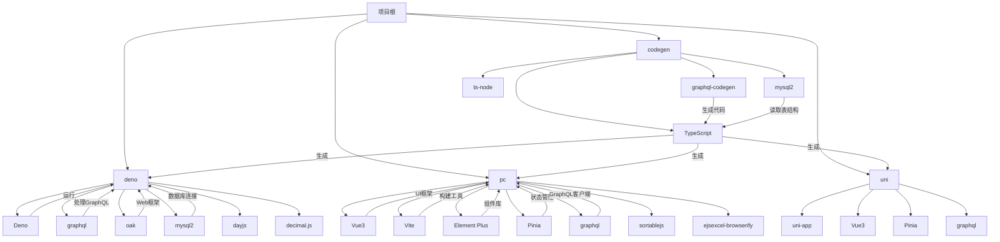

# 性能优化

**本文档引用文件**  
- [graphql.config.js](https://github.com/sail-sail/nest/blob/main/deno/graphql.config.js)
- [package.json](https://github.com/sail-sail/nest/blob/main/deno/package.json)
- [package.json](https://github.com/sail-sail/nest/blob/main/pc/package.json)
- [package.json](https://github.com/sail-sail/nest/blob/main/uni/package.json)
- [mod.ts](https://github.com/sail-sail/nest/blob/main/deno/mod.ts)
- [graphql.ts](https://github.com/sail-sail/nest/blob/main/deno/lib/graphql.ts)
- [gql.ts](https://github.com/sail-sail/nest/blob/main/deno/lib/oak/gql.ts)
- [build.ts](https://github.com/sail-sail/nest/blob/main/deno/lib/script/build.ts)
- [App.vue](https://github.com/sail-sail/nest/blob/main/pc/src/App.vue)
- [main.ts](https://github.com/sail-sail/nest/blob/main/pc/src/main.ts)
- [graphql.ts](https://github.com/sail-sail/nest/blob/main/pc/src/utils/graphql.ts)
- [KFrame.vue](https://github.com/sail-sail/nest/blob/main/pc/src/components/KFrame/KFrame.vue)
- [List.ts](https://github.com/sail-sail/nest/blob/main/pc/src/compositions/List.ts)
- [Detail.ts](https://github.com/sail-sail/nest/blob/main/pc/src/compositions/Detail.ts)
- [ListSelectDialog.vue](https://github.com/sail-sail/nest/blob/main/pc/src/components/ListSelectDialog.vue)
- [TableSearchStagingDialog.vue](https://github.com/sail-sail/nest/blob/main/pc/src/components/TableSearchStagingDialog.vue)
- [TableShowColumns.vue](https://github.com/sail-sail/nest/blob/main/pc/src/components/TableShowColumns.vue)
- [CustomInput.vue](https://github.com/sail-sail/nest/blob/main/pc/src/components/CustomInput.vue)
- [CustomSelect.vue](https://github.com/sail-sail/nest/blob/main/pc/src/components/CustomSelect.vue)
- [DictSelect.vue](https://github.com/sail-sail/nest/blob/main/pc/src/components/DictSelect.vue)
- [DictbizSelect.vue](https://github.com/sail-sail/nest/blob/main/pc/src/components/DictbizSelect.vue)
- [CustomDatePicker.vue](https://github.com/sail-sail/nest/blob/main/pc/src/components/CustomDatePicker.vue)
- [CustomCityPicker.vue](https://github.com/sail-sail/nest/blob/main/pc/src/components/CustomCityPicker.vue)
- [CustomSwitch.vue](https://github.com/sail-sail/nest/blob/main/pc/src/components/CustomSwitch.vue)
- [CustomCheckbox.vue](https://github.com/sail-sail/nest/blob/main/pc/src/components/CustomCheckbox.vue)
- [CustomTreeSelect.vue](https://github.com/sail-sail/nest/blob/main/pc/src/components/CustomTreeSelect.vue)
- [UploadImage.vue](https://github.com/sail-sail/nest/blob/main/pc/src/components/UploadImage.vue)
- [UploadFileDialog.vue](https://github.com/sail-sail/nest/blob/main/pc/src/components/UploadFileDialog.vue)
- [MyIframe.vue](https://github.com/sail-sail/nest/blob/main/pc/src/components/MyIframe.vue)
- [MyIframeDialog.vue](https://github.com/sail-sail/nest/blob/main/pc/src/components/MyIframeDialog.vue)
- [AttDialog.vue](https://github.com/sail-sail/nest/blob/main/pc/src/components/AttDialog.vue)
- [LinkAtt.vue](https://github.com/sail-sail/nest/blob/main/pc/src/components/LinkAtt.vue)
- [LinkImage.vue](https://github.com/sail-sail/nest/blob/main/pc/src/components/LinkImage.vue)
- [LinkList.vue](https://github.com/sail-sail/nest/blob/main/pc/src/components/LinkList.vue)
- [ImportPercentageDialog.vue](https://github.com/sail-sail/nest/blob/main/pc/src/components/ImportPercentageDialog.vue)
- [TableDataSortable.ts](https://github.com/sail-sail/nest/blob/main/pc/src/components/TableDataSortable.ts)
- [TableHeaderOrderDrag.ts](https://github.com/sail-sail/nest/blob/main/pc/src/components/TableHeaderOrderDrag.ts)
- [draggable.ts](https://github.com/sail-sail/nest/blob/main/pc/src/components/draggable.ts)
- [draggable.ts](https://github.com/sail-sail/nest/blob/main/pc/src/compositions/draggable.ts)
- [fullscreen.ts](https://github.com/sail-sail/nest/blob/main/pc/src/compositions/fullscreen.ts)
- [websocket.ts](https://github.com/sail-sail/nest/blob/main/pc/src/compositions/websocket.ts)
- [websocket.ts](https://github.com/sail-sail/nest/blob/main/pc/src/utils/websocket.ts)
- [request.ts](https://github.com/sail-sail/nest/blob/main/pc/src/utils/request.ts)
- [config.ts](https://github.com/sail-sail/nest/blob/main/pc/src/utils/config.ts)
- [DateUtil.ts](https://github.com/sail-sail/nest/blob/main/pc/src/utils/DateUtil.ts)
- [ObjectUtil.ts](https://github.com/sail-sail/nest/blob/main/pc/src/utils/ObjectUtil.ts)
- [StringUtil.ts](https://github.com/sail-sail/nest/blob/main/pc/src/utils/StringUtil.ts)
- [excel_util.ts](https://github.com/sail-sail/nest/blob/main/pc/src/utils/excel_util.ts)
- [permit_scan.js](https://github.com/sail-sail/nest/blob/main/pc/src/utils/permit_scan.js)
- [postbuild.js](https://github.com/sail-sail/nest/blob/main/pc/src/utils/postbuild.js)
- [postinstall.js](https://github.com/sail-sail/nest/blob/main/pc/src/utils/postinstall.js)
- [nest_config.js](https://github.com/sail-sail/nest/blob/main/pc/src/utils/database/nest_config.js)
- [Context.js](https://github.com/sail-sail/nest/blob/main/pc/src/utils/database/Context.js)
- [store/index.ts](https://github.com/sail-sail/nest/blob/main/pc/src/store/index.ts)
- [store/tabs.ts](https://github.com/sail-sail/nest/blob/main/pc/src/store/tabs.ts)
- [store/tenant.ts](https://github.com/sail-sail/nest/blob/main/pc/src/store/tenant.ts)
- [store/field_permit.ts](https://github.com/sail-sail/nest/blob/main/pc/src/store/field_permit.ts)
- [store/background_task.ts](https://github.com/sail-sail/nest/blob/main/pc/src/store/background_task.ts)
- [store/permit.ts](https://github.com/sail-sail/nest/blob/main/pc/src/store/permit.ts)
- [store/usr.ts](https://github.com/sail-sail/nest/blob/main/pc/src/store/usr.ts)
- [store/menu.ts](https://github.com/sail-sail/nest/blob/main/pc/src/store/menu.ts)
- [store/dirty.ts](https://github.com/sail-sail/nest/blob/main/pc/src/store/dirty.ts)
- [router/index.ts](https://github.com/sail-sail/nest/blob/main/pc/src/router/index.ts)
- [router/gen.ts](https://github.com/sail-sail/nest/blob/main/pc/src/router/gen.ts)
- [router/util.ts](https://github.com/sail-sail/nest/blob/main/pc/src/router/util.ts)
- [locales/index.ts](https://github.com/sail-sail/nest/blob/main/pc/src/locales/index.ts)
- [locales/i18n.ts](https://github.com/sail-sail/nest/blob/main/pc/src/locales/i18n.ts)
- [locales/zh-cn.ts](https://github.com/sail-sail/nest/blob/main/pc/src/locales/zh-cn.ts)
- [locales/en.ts](https://github.com/sail-sail/nest/blob/main/pc/src/locales/en.ts)
- [Api.ts](https://github.com/sail-sail/nest/blob/main/pc/src/locales/Api.ts)
- [layout/index.vue](https://github.com/sail-sail/nest/blob/main/pc/src/layout/index.vue)
- [layout/Login.vue](https://github.com/sail-sail/nest/blob/main/pc/src/layout/Login.vue)
- [layout/ChangePassword.vue](https://github.com/sail-sail/nest/blob/main/pc/src/layout/change_password/ChangePassword.vue)
- [layout/Menu.vue](https://github.com/sail-sail/nest/blob/main/pc/src/layout/layout1/Menu.vue)
- [layout/Top.vue](https://github.com/sail-sail/nest/blob/main/pc/src/layout/layout1/Top.vue)
- [layout/Tabs.vue](https://github.com/sail-sail/nest/blob/main/pc/src/layout/layout1/Tabs.vue)
- [layout/Api.ts](https://github.com/sail-sail/nest/blob/main/pc/src/layout/Api.ts)
- [views/Index.vue](https://github.com/sail-sail/nest/blob/main/pc/src/views/Index.vue)
- [codegen/src/lib/nest_config.ts](https://github.com/sail-sail/nest/blob/main/codegen/src/lib/nest_config.ts)
- [codegen/src/lib/information_schema.ts](https://github.com/sail-sail/nest/blob/main/codegen/src/lib/information_schema.ts)
- [codegen/src/lib/codegen.ts](https://github.com/sail-sail/nest/blob/main/codegen/src/lib/codegen.ts)
- [codegen/src/lib/coderemove.ts](https://github.com/sail-sail/nest/blob/main/codegen/src/lib/coderemove.ts)
- [codegen/src/bin/codegen.ts](https://github.com/sail-sail/nest/blob/main/codegen/src/bin/codegen.ts)
- [codegen/src/bin/codeapply.ts](https://github.com/sail-sail/nest/blob/main/codegen/src/bin/codeapply.ts)
- [codegen/src/bin/coderemove.ts](https://github.com/sail-sail/nest/blob/main/codegen/src/bin/coderemove.ts)
- [codegen/src/util/npmInitDB.ts](https://github.com/sail-sail/nest/blob/main/codegen/src/util/npmInitDB.ts)
- [codegen/src/util/npmImportCsv.ts](https://github.com/sail-sail/nest/blob/main/codegen/src/util/npmImportCsv.ts)
- [codegen/src/util/npmShortUuidV4.ts](https://github.com/sail-sail/nest/blob/main/codegen/src/util/npmShortUuidV4.ts)
- [codegen/src/util/npmPassword.ts](https://github.com/sail-sail/nest/blob/main/codegen/src/util/npmPassword.ts)
- [codegen/src/util/npmFieldPermit.ts](https://github.com/sail-sail/nest/blob/main/codegen/src/util/npmFieldPermit.ts)
- [codegen/src/util/npmDbCharset.ts](https://github.com/sail-sail/nest/blob/main/codegen/src/util/npmDbCharset.ts)
- [codegen/src/util/npmUpgrade.ts](https://github.com/sail-sail/nest/blob/main/codegen/src/util/npmUpgrade.ts)
- [codegen/src/util/uuid.ts](https://github.com/sail-sail/nest/blob/main/codegen/src/util/uuid.ts)
- [codegen/src/util/common.ts](https://github.com/sail-sail/nest/blob/main/codegen/src/util/common.ts)
- [codegen/src/tables/tables.ts](https://github.com/sail-sail/nest/blob/main/codegen/src/tables/tables.ts)
- [codegen/src/tables/base/base.ts](https://github.com/sail-sail/nest/blob/main/codegen/src/tables/base/base.ts)
- [codegen/src/tables/base/base.sql](https://github.com/sail-sail/nest/blob/main/codegen/src/tables/base/base.sql)
- [codegen/src/tables/base/base.i18n.sql](https://github.com/sail-sail/nest/blob/main/codegen/src/tables/base/base.i18n.sql)
- [codegen/src/config.ts](https://github.com/sail-sail/nest/blob/main/codegen/src/config.ts)
- [codegen/src/template/deno/gen/graphql.ts](https://github.com/sail-sail/nest/blob/main/codegen/src/template/deno/gen/graphql.ts)
- [codegen/src/template/deno/gen/base/__table__.graphql.ts](https://github.com/sail-sail/nest/blob/main/codegen/src/template/deno/gen/base/__table__.graphql.ts)
- [codegen/src/template/deno/gen/base/__table__.model.ts](https://github.com/sail-sail/nest/blob/main/codegen/src/template/deno/gen/base/__table__.model.ts)
- [codegen/src/template/deno/gen/base/__table__.dao.ts](https://github.com/sail-sail/nest/blob/main/codegen/src/template/deno/gen/base/__table__.dao.ts)
- [codegen/src/template/deno/gen/base/__table__.resolver.ts](https://github.com/sail-sail/nest/blob/main/codegen/src/template/deno/gen/base/__table__.resolver.ts)
- [codegen/src/template/deno/gen/base/__table__.service.ts](https://github.com/sail-sail/nest/blob/main/codegen/src/template/deno/gen/base/__table__.service.ts)
- [codegen/src/template/pc/src/views/[[mod_slash_table]]/List.vue](https://github.com/sail-sail/nest/blob/main/codegen/src/template/pc/src/views/[[mod_slash_table]]/List.vue)
- [codegen/src/template/pc/src/views/[[mod_slash_table]]/Edit.vue](https://github.com/sail-sail/nest/blob/main/codegen/src/template/pc/src/views/[[mod_slash_table]]/Edit.vue)
- [codegen/src/template/pc/src/views/[[mod_slash_table]]/View.vue](https://github.com/sail-sail/nest/blob/main/codegen/src/template/pc/src/views/[[mod_slash_table]]/View.vue)
- [codegen/src/template/pc/src/views/[[mod_slash_table]]/Api.ts](https://github.com/sail-sail/nest/blob/main/codegen/src/template/pc/src/views/[[mod_slash_table]]/Api.ts)
- [codegen/src/template/pc/src/views/[[mod_slash_table]]/Model.ts](https://github.com/sail-sail/nest/blob/main/codegen/src/template/pc/src/views/[[mod_slash_table]]/Model.ts)
- [codegen/src/template/pc/src/router/gen.ts](https://github.com/sail-sail/nest/blob/main/codegen/src/template/pc/src/router/gen.ts)
- [codegen/src/template/uni/src/pages/[[table]]/Api.ts](https://github.com/sail-sail/nest/blob/main/codegen/src/template/uni/src/pages/[[table]]/Api.ts)
- [codegen/src/template/uni/src/pages/[[table]]/Model.ts](https://github.com/sail-sail/nest/blob/main/codegen/src/template/uni/src/pages/[[table]]/Model.ts)

## 目录

1. [简介](#简介)
2. [项目结构](#项目结构)
3. [核心组件](#核心组件)
4. [架构概览](#架构概览)
5. [详细组件分析](#详细组件分析)
6. [依赖分析](#依赖分析)
7. [性能优化](#性能优化)
8. [性能监控与分析](#性能监控与分析)
9. [故障排除指南](#故障排除指南)
10. [结论](#结论)

## 简介

本项目是一个基于低代码架构的全栈应用，旨在通过代码生成器与手动开发的结合，实现开发效率的显著提升。系统采用前后端分离架构，后端使用 Deno + GraphQL + MySQL 技术栈，前端包含 PC 端（Vue3 + Vite + Element Plus）和移动端（uni-app）。项目核心创新在于其代码生成机制，利用 `git diff` 和 `git apply` 实现增量代码生成，允许在生成代码基础上进行手动修改而不被覆盖，支持项目的持续迭代。

## 项目结构

项目采用模块化分层结构，主要分为四个顶级目录：`codegen`（代码生成器）、`deno`（后端服务）、`pc`（PC前端）和`uni`（移动端前端）。

**图示来源**
- [README.md](https://github.com/sail-sail/nest/blob/main/README.md#L1-L32)

## 核心组件

项目的核心组件围绕代码生成、GraphQL API、数据库访问和前端框架展开。

**代码生成器 (codegen)**：位于 `codegen` 目录，是整个项目的基石。它通过读取数据库表结构（`information_schema`），结合预定义的模板（`template` 目录），生成后端（Deno）和前端（PC/Uni）的完整代码。其关键特性是增量更新，通过 `git diff` 识别已修改的文件，确保手动编写的业务逻辑不会被覆盖。

**GraphQL API (deno)**：位于 `deno` 目录，基于 Deno 运行时构建。使用 `oak` 作为 Web 框架，`graphql` 库处理 GraphQL 请求。后端采用典型的分层模式：`resolver` 接收请求并调用 `service`，`service` 包含业务逻辑并调用 `dao`（数据访问对象），`dao` 负责与 MySQL 数据库交互。

**PC前端 (pc)**：位于 `pc` 目录，使用 Vue3 和 Vite 构建。采用 Composition API 和 Pinia 状态管理。项目结构清晰，`views` 目录存放页面，`components` 存放可复用组件，`store` 管理全局状态，`router` 处理路由。大量使用 Element Plus 组件库。

**移动端 (uni)**：位于 `uni` 目录，使用 uni-app 框架，实现一套代码多端发布。

**本节来源**
- [README.md](https://github.com/sail-sail/nest/blob/main/README.md#L1-L32)
- [package.json](https://github.com/sail-sail/nest/blob/main/package.json#L1-L33)
- [deno/package.json](https://github.com/sail-sail/nest/blob/main/deno/package.json#L1-L53)
- [pc/package.json](https://github.com/sail-sail/nest/blob/main/pc/package.json#L1-L103)
- [uni/package.json](https://github.com/sail-sail/nest/blob/main/uni/package.json#L1-L117)

## 架构概览

系统采用前后端分离的微服务架构，以 GraphQL 作为核心通信协议。

**图示来源**
- [README.md](https://github.com/sail-sail/nest/blob/main/README.md#L1-L32)
- [deno/mod.ts](https://github.com/sail-sail/nest/blob/main/deno/mod.ts)
- [pc/main.ts](https://github.com/sail-sail/nest/blob/main/pc/src/main.ts)
- [uni/main.ts](https://github.com/sail-sail/nest/blob/main/uni/src/main.ts)

## 详细组件分析

### 后端 GraphQL 服务分析

后端服务的核心是 GraphQL API 的实现。每个数据表（如 `usr`, `menu`）都对应一组文件：`.graphql.ts` 定义 Schema，`.resolver.ts` 定义解析器，`.service.ts` 定义服务逻辑，`.dao.ts` 定义数据访问。

#### GraphQL 解析器调用流程

**图示来源**
- [deno/gen/base/usr.resolver.ts](https://github.com/sail-sail/nest/blob/main/deno/gen/base/usr.resolver.ts)
- [deno/gen/base/usr.service.ts](https://github.com/sail-sail/nest/blob/main/deno/gen/base/usr.service.ts)
- [deno/gen/base/usr.dao.ts](https://github.com/sail-sail/nest/blob/main/deno/gen/base/usr.dao.ts)

#### 数据访问对象 (DAO) 类图

**图示来源**
- [deno/gen/base/usr.dao.ts](https://github.com/sail-sail/nest/blob/main/deno/gen/base/usr.dao.ts)
- [deno/gen/base/menu.dao.ts](https://github.com/sail-sail/nest/blob/main/deno/gen/base/menu.dao.ts)
- [codegen/src/template/deno/gen/base/__table__.dao.ts](https://github.com/sail-sail/nest/blob/main/codegen/src/template/deno/gen/base/__table__.dao.ts)

### 前端组件分析

#### PC端列表页组件结构

PC端的列表页（List.vue）是一个高度可配置的通用组件，通过组合多个子组件实现复杂功能。

```mermaid
flowchart TD
A[List.vue] --> B[TableSearchStagingDialog]
A --> C[ListSelectDialog]
A --> D[TableShowColumns]
A --> E[TableDataSortable]
A --> F[TableHeaderOrderDrag]
A --> G[CustomInput]
A --> H[CustomSelect]
A --> I[CustomDatePicker]
A --> J[CustomCityPicker]
A --> K[CustomSwitch]
A --> L[CustomCheckbox]
A --> M[CustomTreeSelect]
A --> N[DictSelect]
A --> O[DictbizSelect]
A --> P[UploadImage]
A --> Q[UploadFileDialog]
A --> R[MyIframe]
A --> S[MyIframeDialog]
A --> T[AttDialog]
A --> U[LinkAtt]
A --> V[LinkImage]
A --> W[LinkList]
A --> X[ImportPercentageDialog]
B --> |条件暂存| A
C --> |列表选择| A
D --> |显示列| A
E --> |行排序| A
F --> |表头排序| A
G --> |输入框| A
H --> |下拉框| A
I --> |日期选择| A
J --> |城市选择| A
K --> |开关| A
L --> |复选框| A
M --> |树形选择| A
N --> |字典选择| A
O --> |业务字典选择| A
P --> |图片上传| A
Q --> |文件上传| A
R --> |内嵌框架| A
S --> |内嵌框架弹窗| A
T --> |附件弹窗| A
U --> |附件链接| A
V --> |图片链接| A
W --> |列表链接| A
X --> |导入进度| A
```

**图示来源**
- [codegen/src/template/pc/src/views/[[mod_slash_table]]/List.vue](https://github.com/sail-sail/nest/blob/main/codegen/src/template/pc/src/views/[[mod_slash_table]]/List.vue)
- [pc/src/components/ListSelectDialog.vue](https://github.com/sail-sail/nest/blob/main/pc/src/components/ListSelectDialog.vue)
- [pc/src/components/TableSearchStagingDialog.vue](https://github.com/sail-sail/nest/blob/main/pc/src/components/TableSearchStagingDialog.vue)
- [pc/src/components/TableShowColumns.vue](https://github.com/sail-sail/nest/blob/main/pc/src/components/TableShowColumns.vue)
- [pc/src/components/TableDataSortable.ts](https://github.com/sail-sail/nest/blob/main/pc/src/components/TableDataSortable.ts)
- [pc/src/components/TableHeaderOrderDrag.ts](https://github.com/sail-sail/nest/blob/main/pc/src/components/TableHeaderOrderDrag.ts)
- [pc/src/components/CustomInput.vue](https://github.com/sail-sail/nest/blob/main/pc/src/components/CustomInput.vue)
- [pc/src/components/CustomSelect.vue](https://github.com/sail-sail/nest/blob/main/pc/src/components/CustomSelect.vue)
- [pc/src/components/CustomDatePicker.vue](https://github.com/sail-sail/nest/blob/main/pc/src/components/CustomDatePicker.vue)
- [pc/src/components/CustomCityPicker.vue](https://github.com/sail-sail/nest/blob/main/pc/src/components/CustomCityPicker.vue)
- [pc/src/components/CustomSwitch.vue](https://github.com/sail-sail/nest/blob/main/pc/src/components/CustomSwitch.vue)
- [pc/src/components/CustomCheckbox.vue](https://github.com/sail-sail/nest/blob/main/pc/src/components/CustomCheckbox.vue)
- [pc/src/components/CustomTreeSelect.vue](https://github.com/sail-sail/nest/blob/main/pc/src/components/CustomTreeSelect.vue)
- [pc/src/components/DictSelect.vue](https://github.com/sail-sail/nest/blob/main/pc/src/components/DictSelect.vue)
- [pc/src/components/DictbizSelect.vue](https://github.com/sail-sail/nest/blob/main/pc/src/components/DictbizSelect.vue)
- [pc/src/components/UploadImage.vue](https://github.com/sail-sail/nest/blob/main/pc/src/components/UploadImage.vue)
- [pc/src/components/UploadFileDialog.vue](https://github.com/sail-sail/nest/blob/main/pc/src/components/UploadFileDialog.vue)
- [pc/src/components/MyIframe.vue](https://github.com/sail-sail/nest/blob/main/pc/src/components/MyIframe.vue)
- [pc/src/components/MyIframeDialog.vue](https://github.com/sail-sail/nest/blob/main/pc/src/components/MyIframeDialog.vue)
- [pc/src/components/AttDialog.vue](https://github.com/sail-sail/nest/blob/main/pc/src/components/AttDialog.vue)
- [pc/src/components/LinkAtt.vue](https://github.com/sail-sail/nest/blob/main/pc/src/components/LinkAtt.vue)
- [pc/src/components/LinkImage.vue](https://github.com/sail-sail/nest/blob/main/pc/src/components/LinkImage.vue)
- [pc/src/components/LinkList.vue](https://github.com/sail-sail/nest/blob/main/pc/src/components/LinkList.vue)
- [pc/src/components/ImportPercentageDialog.vue](https://github.com/sail-sail/nest/blob/main/pc/src/components/ImportPercentageDialog.vue)

#### 前端状态管理流程

前端使用 Pinia 进行状态管理，主要管理用户信息、菜单、标签页、租户等全局状态。

**图示来源**
- [pc/src/store/index.ts](https://github.com/sail-sail/nest/blob/main/pc/src/store/index.ts)
- [pc/src/store/usr.ts](https://github.com/sail-sail/nest/blob/main/pc/src/store/usr.ts)
- [pc/src/store/menu.ts](https://github.com/sail-sail/nest/blob/main/pc/src/store/menu.ts)
- [pc/src/store/tabs.ts](https://github.com/sail-sail/nest/blob/main/pc/src/store/tabs.ts)
- [pc/src/utils/request.ts](https://github.com/sail-sail/nest/blob/main/pc/src/utils/request.ts)

## 依赖分析

项目依赖关系复杂，涉及开发、运行时和生成时依赖。

**图示来源**
- [package.json](https://github.com/sail-sail/nest/blob/main/package.json#L1-L33)
- [deno/package.json](https://github.com/sail-sail/nest/blob/main/deno/package.json#L1-L53)
- [pc/package.json](https://github.com/sail-sail/nest/blob/main/pc/package.json#L1-L103)
- [uni/package.json](https://github.com/sail-sail/nest/blob/main/uni/package.json#L1-L117)

## 性能优化

### 后端 GraphQL 查询优化

1.  **批处理与缓存**：
    *   **批处理**：对于多个相似的查询，可以使用 `graphql-combine-query` 库（在 `pc` 和 `uni` 的 `package.json` 中已引入）将多个查询合并为一个请求，减少网络往返次数。
    *   **缓存**：在 `service` 层或 `dao` 层使用内存缓存（如 `lru-cache` 库，在 `deno/package.json` 中已引入）缓存频繁查询的结果。例如，`dict`（字典）数据几乎不变，非常适合缓存。可以在 `DictService` 中实现缓存逻辑，首次查询后将结果存入 LRU 缓存，后续请求直接从缓存返回。

2.  **查询深度与复杂度限制**：
    *   在 GraphQL 服务器配置中（`deno/graphql.config.js`），应设置查询深度和复杂度的限制，防止恶意的深层嵌套查询导致服务器资源耗尽。

### 数据库查询性能调优

1.  **索引优化**：
    *   分析慢查询日志，为 `WHERE`、`ORDER BY`、`JOIN` 子句中频繁使用的字段创建索引。
    *   例如，`usr` 表的 `username` 和 `email` 字段通常用于登录查询，应创建唯一索引。
    *   复合索引：对于多条件查询，创建复合索引。例如，如果经常按 `status` 和 `createTime` 查询，可创建 `(status, createTime)` 索引。

2.  **查询计划分析**：
    *   使用 `EXPLAIN` 或 `EXPLAIN ANALYZE` 命令分析 SQL 查询的执行计划。
    *   在 `UsrDAO` 的 `list` 方法中，生成的 SQL 可能包含复杂的 `WHERE` 条件。通过 `EXPLAIN` 分析，可以确认是否使用了正确的索引，避免全表扫描。

### 前端组件渲染优化

1.  **虚拟滚动**：
    *   当列表数据量巨大时（如超过 1000 条），使用虚拟滚动技术。Element Plus 的 `el-table` 支持 `v-virtual-scroll` 指令或使用 `el-virtual-scroll` 组件，只渲染可视区域内的行，极大提升渲染性能。

2.  **懒加载**：
    *   **路由懒加载**：在 `router/index.ts` 中，使用动态 `import()` 语法实现路由组件的懒加载，按需加载代码块，减少首屏加载时间。
    *   **图片懒加载**：对于列表中的图片，使用 `loading="lazy"` 属性或 `Intersection Observer` API 实现图片懒加载。

3.  **组件缓存**：
    *   使用 Vue 的 `<keep-alive>` 组件缓存不常变化的页面或组件（如 `Edit.vue`、`View.vue`），避免重复创建和销毁实例，提升切换速度。

### 网络请求优化

1.  **HTTP/2**：
    *   确保后端服务器（Deno）和反向代理（如 Nginx）支持 HTTP/2。HTTP/2 的多路复用特性可以显著减少请求延迟。

2.  **请求合并**：
    *   如前所述，使用 `graphql-combine-query` 将多个 GraphQL 查询合并为一个请求。

3.  **数据压缩**：
    *   在服务器端（`deno/lib/oak/gql.ts`）启用 Gzip 或 Brotli 压缩，减小响应体大小，加快传输速度。

**本节来源**
- [pc/package.json](https://github.com/sail-sail/nest/blob/main/pc/package.json#L1-L103)
- [uni/package.json](https://github.com/sail-sail/nest/blob/main/uni/package.json#L1-L117)
- [deno/package.json](https://github.com/sail-sail/nest/blob/main/deno/package.json#L1-L53)
- [deno/lib/oak/gql.ts](https://github.com/sail-sail/nest/blob/main/deno/lib/oak/gql.ts)
- [pc/src/utils/request.ts](https://github.com/sail-sail/nest/blob/main/pc/src/utils/request.ts)
- [pc/src/router/index.ts](https://github.com/sail-sail/nest/blob/main/pc/src/router/index.ts)

## 性能监控与分析

### 性能指标收集

1.  **后端**：
    *   在 `deno/lib/oak/timing.ts` 中，可以实现中间件来记录每个请求的处理时间。
    *   使用 `console.time()` 和 `console.timeEnd()` 或更专业的性能监控库记录关键函数的执行时间。

2.  **前端**：
    *   利用浏览器的 Performance API (`performance.now()`) 记录关键渲染时间点。
    *   在 `request.ts` 中，记录每个 GraphQL 请求的发起和响应时间。

### 使用性能分析工具

1.  **代码剖析 (Profiling)**：
    *   **Node.js Profiler**：虽然项目使用 Deno，但其 V8 引擎与 Node.js 类似。可以使用 Chrome DevTools 的 Profiler 功能连接到 Deno 进程（如果支持）或使用 Deno 自带的 `--v8-flags=--prof` 生成性能日志，再用 `--v8-flags=--prof-process` 分析。
    *   **Chrome DevTools**：对于前端，使用 Chrome DevTools 的 Performance 面板录制页面加载和交互过程，分析 CPU、内存占用和渲染性能瓶颈。

2.  **识别与解决瓶颈示例**：
    *   **场景**：用户反馈列表页加载缓慢。
    *   **步骤**：
        1.  使用 Chrome DevTools Network 面板，发现 GraphQL 请求耗时过长。
        2.  查看请求的查询语句，发现包含大量字段和深层嵌套。
        3.  在后端使用 `EXPLAIN` 分析生成的 SQL，发现未使用索引导致全表扫描。
        4.  为相关字段添加索引，问题解决。

**本节来源**
- [deno/lib/oak/timing.ts](https://github.com/sail-sail/nest/blob/main/deno/lib/oak/timing.ts)
- [pc/src/utils/request.ts](https://github.com/sail-sail/nest/blob/main/pc/src/utils/request.ts)

## 故障排除指南

### 常见问题

1.  **代码生成失败**：
    *   **检查**：确认数据库连接信息正确（`codegen/src/config.ts`），数据库服务正常运行。
    *   **检查**：确认 `codegen` 目录下的模板文件（`template`）未被意外修改。

2.  **GraphQL 查询错误**：
    *   **检查**：使用 GraphQL Playground 或 Apollo Client DevTools 检查查询语法。
    *   **检查**：查看后端日志，确认 `resolver` 或 `service` 中是否有异常抛出。

3.  **前端组件不显示**：
    *   **检查**：浏览器控制台是否有 JavaScript 错误或网络请求失败。
    *   **检查**：Pinia store 中的数据是否正确加载。

**本节来源**
- [codegen/src/config.ts](https://github.com/sail-sail/nest/blob/main/codegen/src/config.ts)
- [deno/lib/graphql.ts](https://github.com/sail-sail/nest/blob/main/deno/lib/graphql.ts)
- [pc/src/utils/request.ts](https://github.com/sail-sail/nest/blob/main/pc/src/utils/request.ts)

## 结论

本项目通过创新的增量代码生成机制，有效解决了传统低代码平台和代码生成器的痛点，实现了开发效率的飞跃。其清晰的分层架构和现代化的技术栈为高性能应用奠定了基础。通过实施上述性能优化策略——包括后端的查询批处理与缓存、数据库索引优化、前端的虚拟滚动与懒加载、以及网络层面的请求合并与压缩——可以显著提升系统的响应速度和用户体验。持续的性能监控和使用专业工具进行代码剖析是保障系统长期稳定高效运行的关键。该架构为快速构建和迭代复杂的业务系统提供了一个强大而灵活的解决方案。