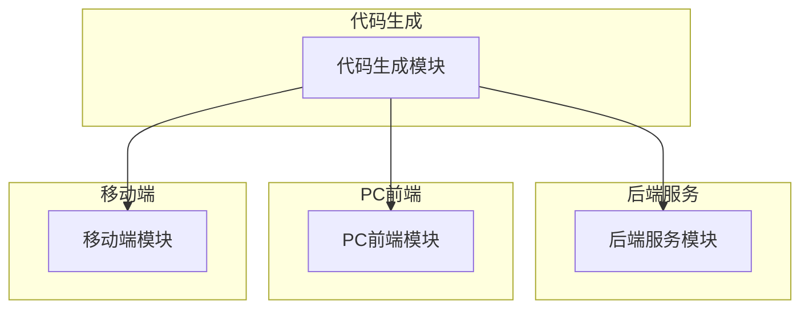
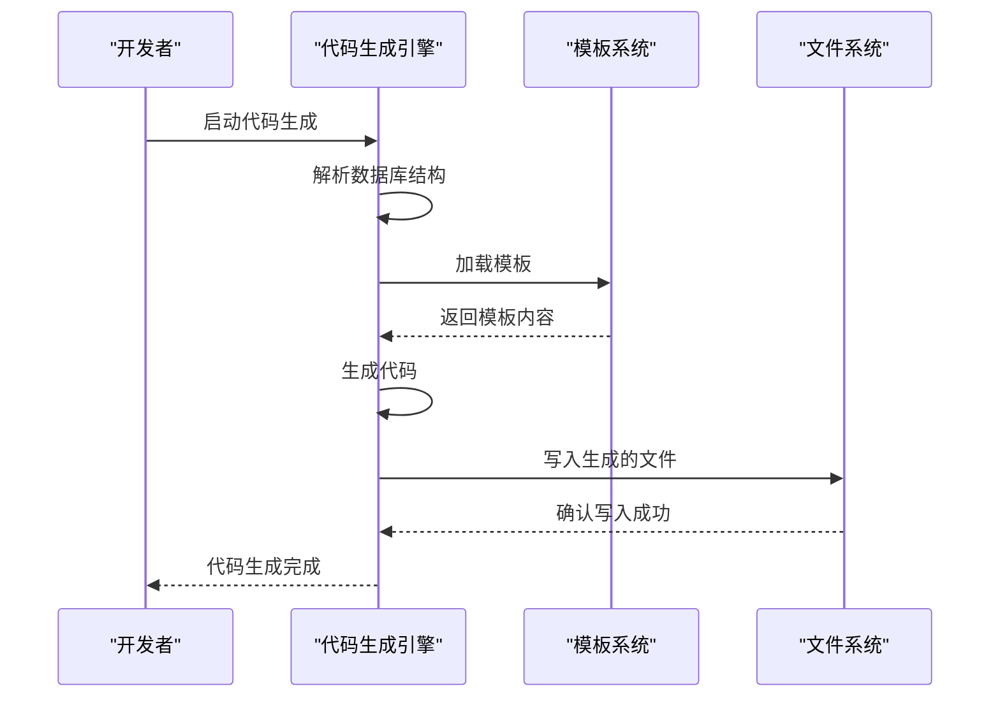
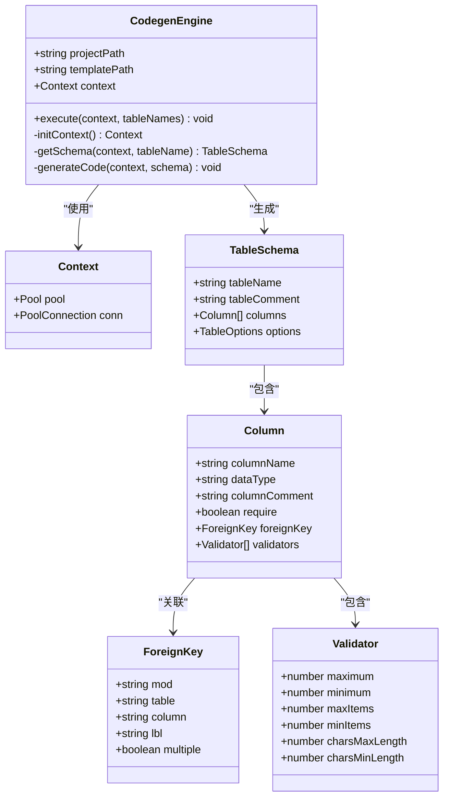
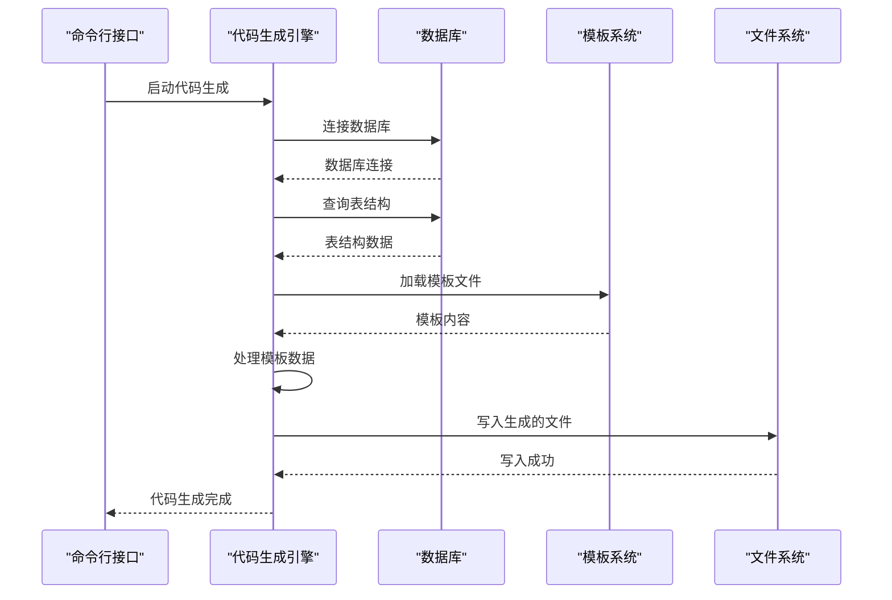
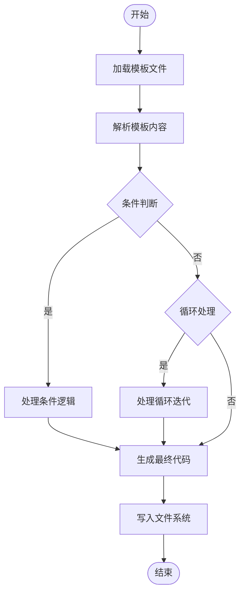
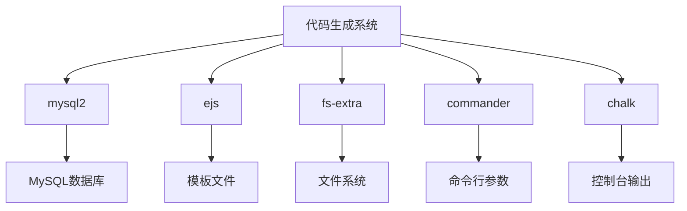

# 扩展开发

**本文档引用的文件**   
- [codegen.ts](https://github.com/sail-sail/nest/blob/main/codegen/src/bin/codegen.ts)
- [codegen.ts](https://github.com/sail-sail/nest/blob/main/codegen/src/lib/codegen.ts)
- [information_schema.ts](https://github.com/sail-sail/nest/blob/main/codegen/src/lib/information_schema.ts)
- [config.ts](https://github.com/sail-sail/nest/blob/main/codegen/src/config.ts)
- [tables.ts](https://github.com/sail-sail/nest/blob/main/codegen/src/tables/tables.ts)
- [template](https://github.com/sail-sail/nest/blob/main/codegen/src/template)

## 目录
1. [简介](#简介)
2. [项目结构](#项目结构)
3. [核心组件](#核心组件)
4. [架构概述](#架构概述)
5. [详细组件分析](#详细组件分析)
6. [依赖分析](#依赖分析)
7. [性能考虑](#性能考虑)
8. [故障排除指南](#故障排除指南)
9. [结论](#结论)

## 简介
本文档旨在为开发者提供一个全面的扩展开发指南，重点介绍如何在现有的代码生成系统中添加新的功能。文档将详细阐述如何为系统添加新的列类型支持、自定义代码生成模板、扩展GraphQL Schema以及向现有模块添加自定义业务逻辑。通过遵循本指南，开发者可以有效地扩展系统功能，满足不断变化的业务需求。

## 项目结构
项目采用模块化设计，主要分为`codegen`、`deno`、`pc`和`uni`四个核心模块。`codegen`模块负责代码生成的核心逻辑，包括模板处理和代码生成规则。`deno`模块包含后端服务代码，`pc`模块负责PC端前端应用，`uni`模块则负责移动端应用。这种清晰的分层结构使得系统易于维护和扩展。

**图示来源**
- [codegen](https://github.com/sail-sail/nest/blob/main/codegen)
- [deno](https://github.com/sail-sail/nest/blob/main/deno)
- [pc](https://github.com/sail-sail/nest/blob/main/pc)
- [uni](https://github.com/sail-sail/nest/blob/main/uni)

**本节来源**
- [codegen](https://github.com/sail-sail/nest/blob/main/codegen)
- [deno](https://github.com/sail-sail/nest/blob/main/deno)
- [pc](https://github.com/sail-sail/nest/blob/main/pc)
- [uni](https://github.com/sail-sail/nest/blob/main/uni)

## 核心组件
系统的核心组件包括代码生成引擎、模板系统和配置管理。代码生成引擎负责解析数据库结构并生成相应的代码文件。模板系统使用EJS模板引擎，允许开发者自定义生成的代码格式。配置管理组件则负责加载和验证系统配置，确保代码生成过程的正确性。

**本节来源**
- [codegen.ts](https://github.com/sail-sail/nest/blob/main/codegen/src/bin/codegen.ts)
- [codegen.ts](https://github.com/sail-sail/nest/blob/main/codegen/src/lib/codegen.ts)
- [config.ts](https://github.com/sail-sail/nest/blob/main/codegen/src/config.ts)

## 架构概述
系统采用分层架构，从下到上依次为数据访问层、业务逻辑层和表示层。代码生成过程始于对数据库结构的解析，然后根据预定义的模板生成相应的代码文件。整个过程由`codegen`模块协调，确保生成的代码符合预期的结构和规范。

**图示来源**
- [codegen.ts](https://github.com/sail-sail/nest/blob/main/codegen/src/bin/codegen.ts)
- [codegen.ts](https://github.com/sail-sail/nest/blob/main/codegen/src/lib/codegen.ts)

## 详细组件分析

### 代码生成引擎分析
代码生成引擎是系统的核心，负责协调整个代码生成过程。它首先解析数据库结构，然后根据配置和模板生成相应的代码文件。

#### 对象导向组件

**图示来源**
- [codegen.ts](https://github.com/sail-sail/nest/blob/main/codegen/src/lib/codegen.ts)
- [information_schema.ts](https://github.com/sail-sail/nest/blob/main/codegen/src/lib/information_schema.ts)
- [config.ts](https://github.com/sail-sail/nest/blob/main/codegen/src/config.ts)

#### API/服务组件

**图示来源**
- [codegen.ts](https://github.com/sail-sail/nest/blob/main/codegen/src/bin/codegen.ts)
- [codegen.ts](https://github.com/sail-sail/nest/blob/main/codegen/src/lib/codegen.ts)

**本节来源**
- [codegen.ts](https://github.com/sail-sail/nest/blob/main/codegen/src/bin/codegen.ts)
- [codegen.ts](https://github.com/sail-sail/nest/blob/main/codegen/src/lib/codegen.ts)
- [information_schema.ts](https://github.com/sail-sail/nest/blob/main/codegen/src/lib/information_schema.ts)

### 模板系统分析
模板系统使用EJS模板引擎，允许开发者通过简单的模板语法自定义生成的代码。模板文件存储在`template`目录下，支持条件判断、循环等高级功能。

#### 复杂逻辑组件

**图示来源**
- [codegen.ts](https://github.com/sail-sail/nest/blob/main/codegen/src/lib/codegen.ts)

## 依赖分析
系统依赖于多个外部库，包括`mysql2`用于数据库连接，`ejs`用于模板渲染，`fs-extra`用于文件操作。这些依赖通过`package.json`文件管理，确保了系统的稳定性和可维护性。

**图示来源**
- [package.json](https://github.com/sail-sail/nest/blob/main/codegen/package.json)

**本节来源**
- [package.json](https://github.com/sail-sail/nest/blob/main/codegen/package.json)

## 性能考虑
在代码生成过程中，性能主要受数据库查询速度和文件操作效率的影响。建议在生成大量代码时，优化数据库查询语句，减少不必要的数据传输。同时，批量写入文件可以显著提高文件操作效率。

## 故障排除指南
当代码生成失败时，首先检查数据库连接是否正常，然后确认模板文件是否存在且格式正确。常见的错误包括数据库表不存在、模板语法错误和文件权限问题。通过查看详细的错误日志，可以快速定位并解决问题。

**本节来源**
- [codegen.ts](https://github.com/sail-sail/nest/blob/main/codegen/src/bin/codegen.ts)
- [codegen.ts](https://github.com/sail-sail/nest/blob/main/codegen/src/lib/codegen.ts)

## 结论
本文档详细介绍了如何扩展代码生成系统，包括添加新的列类型支持、自定义模板、扩展GraphQL Schema和添加自定义业务逻辑。通过遵循本指南，开发者可以有效地扩展系统功能，满足不断变化的业务需求。建议在实际开发中，充分测试新功能，确保系统的稳定性和可靠性。