# 插件机制

**本文档引用的文件**  
- [websocket.dao.ts](https://github.com/sail-sail/nest/blob/main/deno\lib\websocket\websocket.dao.ts)
- [websocket.router.ts](https://github.com/sail-sail/nest/blob/main/deno\lib\websocket\websocket.router.ts)
- [websocket.constants.ts](https://github.com/sail-sail/nest/blob/main/deno\lib\websocket\websocket.constants.ts)
- [AsyncHooksContextManager.ts](https://github.com/sail-sail/nest/blob/main/deno\lib\async_hooks\AsyncHooksContextManager.ts)
- [app.dao.ts](https://github.com/sail-sail/nest/blob/main/deno\lib\app\app.dao.ts)
- [codegen.ts](https://github.com/sail-sail/nest/blob/main/codegen\src\lib\codegen.ts)
- [role.dao.ts](https://github.com/sail-sail/nest/blob/main/deno\gen\base\role\role.dao.ts)
- [options.dao.ts](https://github.com/sail-sail/nest/blob/main/deno\gen\base\options\options.dao.ts)
- [options.service.ts](https://github.com/sail-sail/nest/blob/main/deno\gen\base\options\options.service.ts)
- [List.ts](https://github.com/sail-sail/nest/blob/main/pc\src\compositions\List.ts)
- [core.ts](https://github.com/sail-sail/nest/blob/main/pc\src\components\KFrame\core.ts)
- [interface.ts](https://github.com/sail-sail/nest/blob/main/uni\src\uni_modules\tm-ui\local\interface.ts)
- [i18n.ts](https://github.com/sail-sail/nest/blob/main/uni\src\uni_modules\tm-ui\local\i18n.ts)

## 目录
1. [引言](#引言)
2. [项目结构分析](#项目结构分析)
3. [核心组件分析](#核心组件分析)
4. [插件架构设计](#插件架构设计)
5. [后端插件开发](#后端插件开发)
6. [前端插件开发](#前端插件开发)
7. [插件生命周期管理](#插件生命周期管理)
8. [插件通信机制](#插件通信机制)
9. [插件配置与依赖管理](#插件配置与依赖管理)
10. [安全沙箱与隔离机制](#安全沙箱与隔离机制)
11. [实际案例分析](#实际案例分析)
12. [最佳实践](#最佳实践)

## 引言
本文档全面介绍基于 Nest.js 架构的插件机制，详细阐述系统的插件架构设计原理、开发方法和最佳实践。通过分析代码库中的实际实现，本文档为开发者提供完整的插件开发指南，涵盖后端服务扩展、前端界面集成、插件通信、生命周期管理等关键方面。

## 项目结构分析
项目采用模块化架构，主要分为四个核心部分：codegen（代码生成器）、deno（后端服务）、pc（PC端前端）和uni（移动端前端）。这种分层结构支持插件机制的实现，允许在不同层级进行功能扩展。

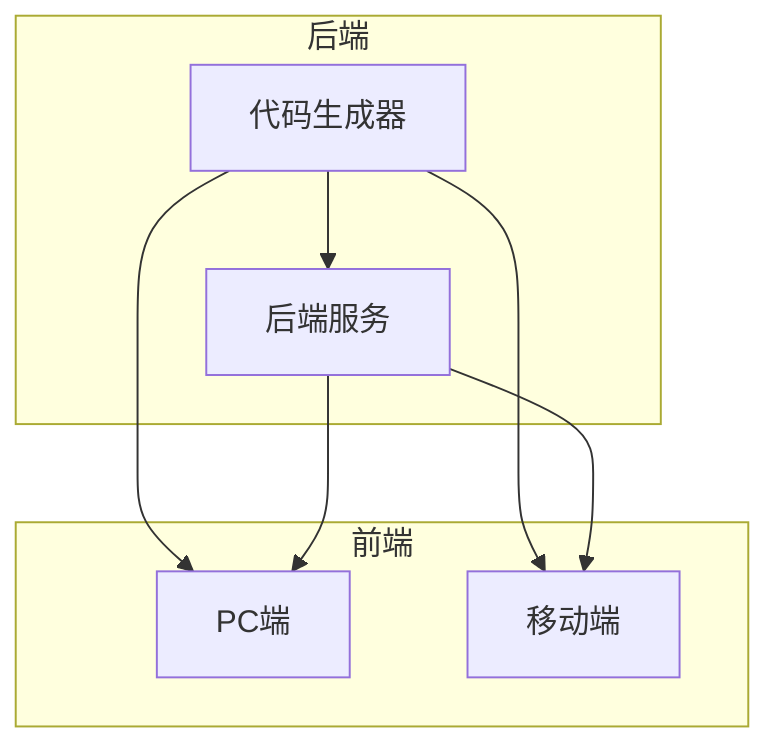

**图示来源**
- [codegen](https://github.com/sail-sail/nest/blob/main/codegen)
- [deno](https://github.com/sail-sail/nest/blob/main/deno)
- [pc](https://github.com/sail-sail/nest/blob/main/pc)
- [uni](https://github.com/sail-sail/nest/blob/main/uni)

## 核心组件分析
系统的核心组件包括WebSocket通信、异步上下文管理、应用服务和代码生成器等，这些组件共同支撑插件机制的运行。

### WebSocket通信组件
WebSocket组件实现了插件间的实时通信机制，通过主题订阅/发布模式实现松耦合的插件交互。

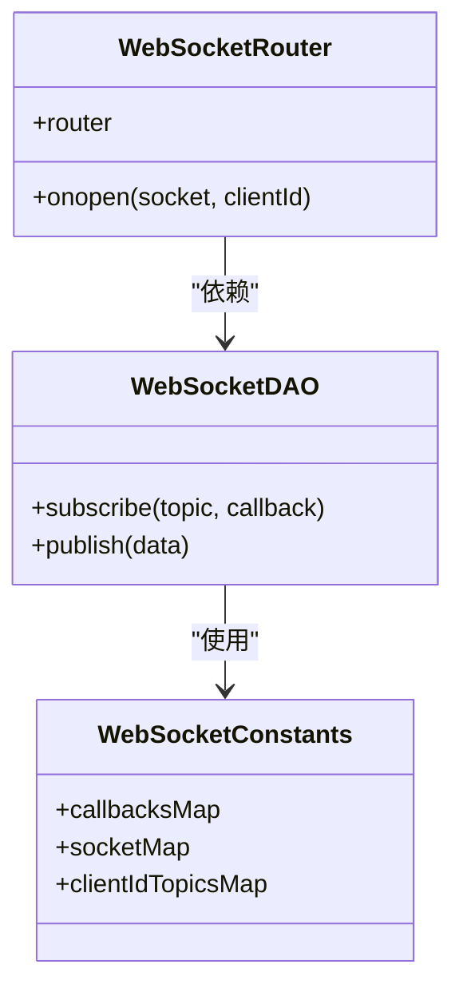

**图示来源**
- [websocket.dao.ts](https://github.com/sail-sail/nest/blob/main/deno\lib\websocket\websocket.dao.ts#L0-L63)
- [websocket.constants.ts](https://github.com/sail-sail/nest/blob/main/deno\lib\websocket\websocket.constants.ts#L0-L5)
- [websocket.router.ts](https://github.com/sail-sail/nest/blob/main/deno\lib\websocket\websocket.router.ts#L0-L36)

**本节来源**
- [websocket.dao.ts](https://github.com/sail-sail/nest/blob/main/deno\lib\websocket\websocket.dao.ts#L0-L63)
- [websocket.constants.ts](https://github.com/sail-sail/nest/blob/main/deno\lib\websocket\websocket.constants.ts#L0-L5)
- [websocket.router.ts](https://github.com/sail-sail/nest/blob/main/deno\lib\websocket\websocket.router.ts#L0-L36)

### 异步上下文管理组件
异步上下文管理器确保在异步操作链中保持上下文一致性，为插件提供稳定的运行环境。

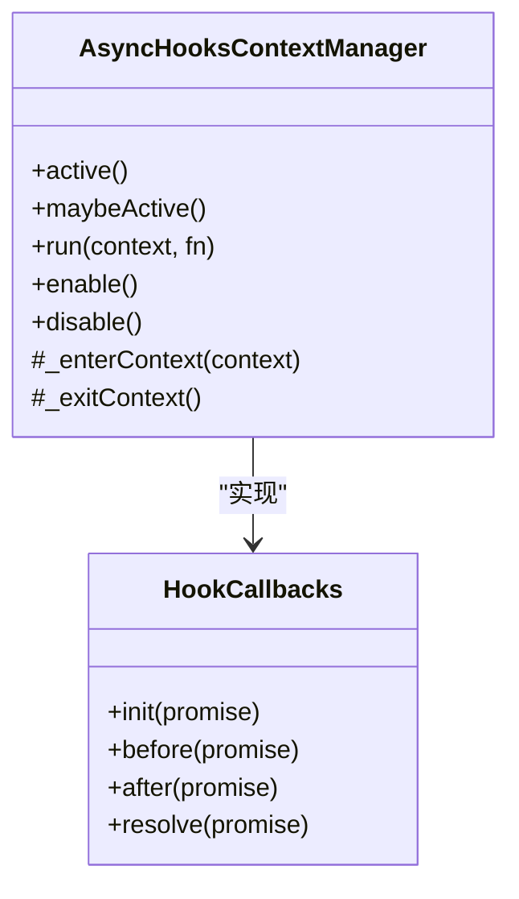

**图示来源**
- [AsyncHooksContextManager.ts](https://github.com/sail-sail/nest/blob/main/deno\lib\async_hooks\AsyncHooksContextManager.ts#L1-L105)

**本节来源**
- [AsyncHooksContextManager.ts](https://github.com/sail-sail/nest/blob/main/deno\lib\async_hooks\AsyncHooksContextManager.ts#L1-L105)

## 插件架构设计
系统采用基于代码生成的插件架构，通过模板化方式实现插件的快速开发和集成。

### 架构概览
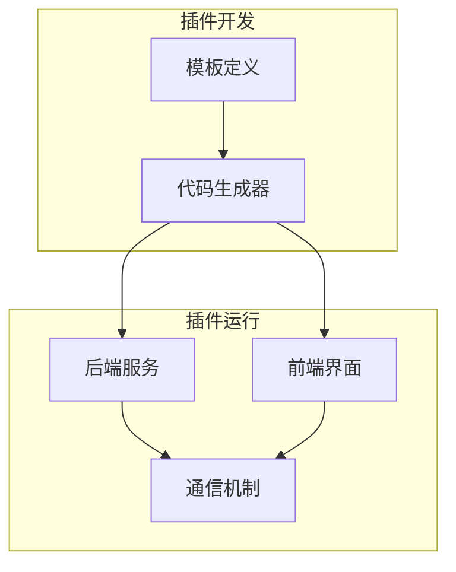

**图示来源**
- [codegen.ts](https://github.com/sail-sail/nest/blob/main/codegen\src\lib\codegen.ts#L374-L418)
- [genRouter](https://github.com/sail-sail/nest/blob/main/codegen\src\lib\codegen.ts#L548-L588)

### 插件生命周期
插件的生命周期包括创建、注册、激活、运行和销毁等阶段，系统提供完整的生命周期管理。

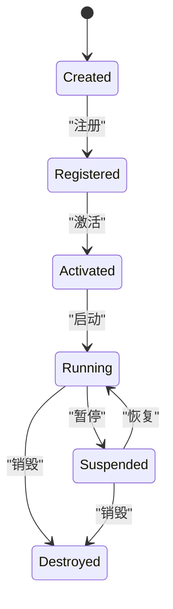

**图示来源**
- [app.dao.ts](https://github.com/sail-sail/nest/blob/main/deno\lib\app\app.dao.ts#L0-L18)
- [codegen.ts](https://github.com/sail-sail/nest/blob/main/codegen\src\lib\codegen.ts#L374-L418)

## 后端插件开发
后端插件开发主要涉及DAO（数据访问对象）、服务层和GraphQL接口的实现。

### DAO层开发
DAO层负责数据库操作，为插件提供数据持久化能力。

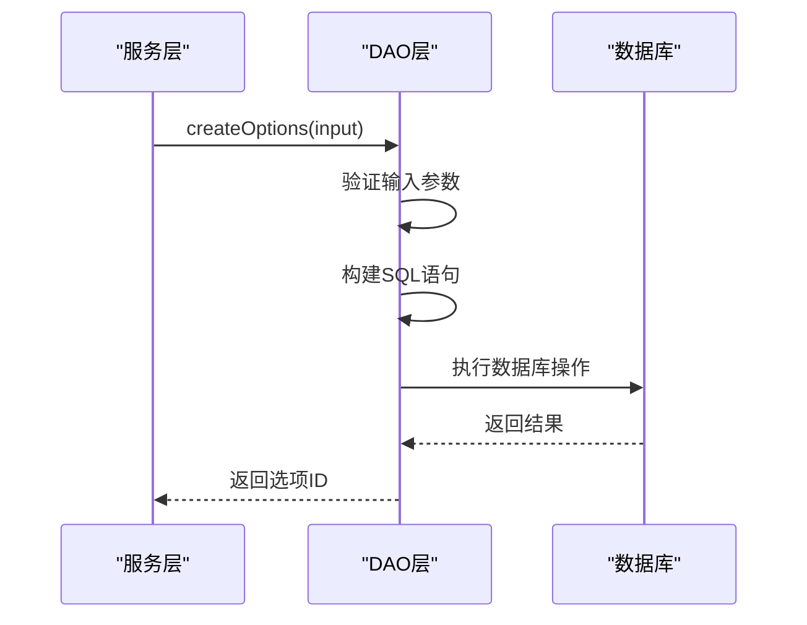

**图示来源**
- [options.dao.ts](https://github.com/sail-sail/nest/blob/main/deno\gen\base\options\options.dao.ts#L1164-L1203)

**本节来源**
- [options.dao.ts](https://github.com/sail-sail/nest/blob/main/deno\gen\base\options\options.dao.ts#L1164-L1203)
- [role.dao.ts](https://github.com/sail-sail/nest/blob/main/deno\gen\base\role\role.dao.ts#L1899-L1954)

### 服务层开发
服务层封装业务逻辑，为插件提供核心功能。

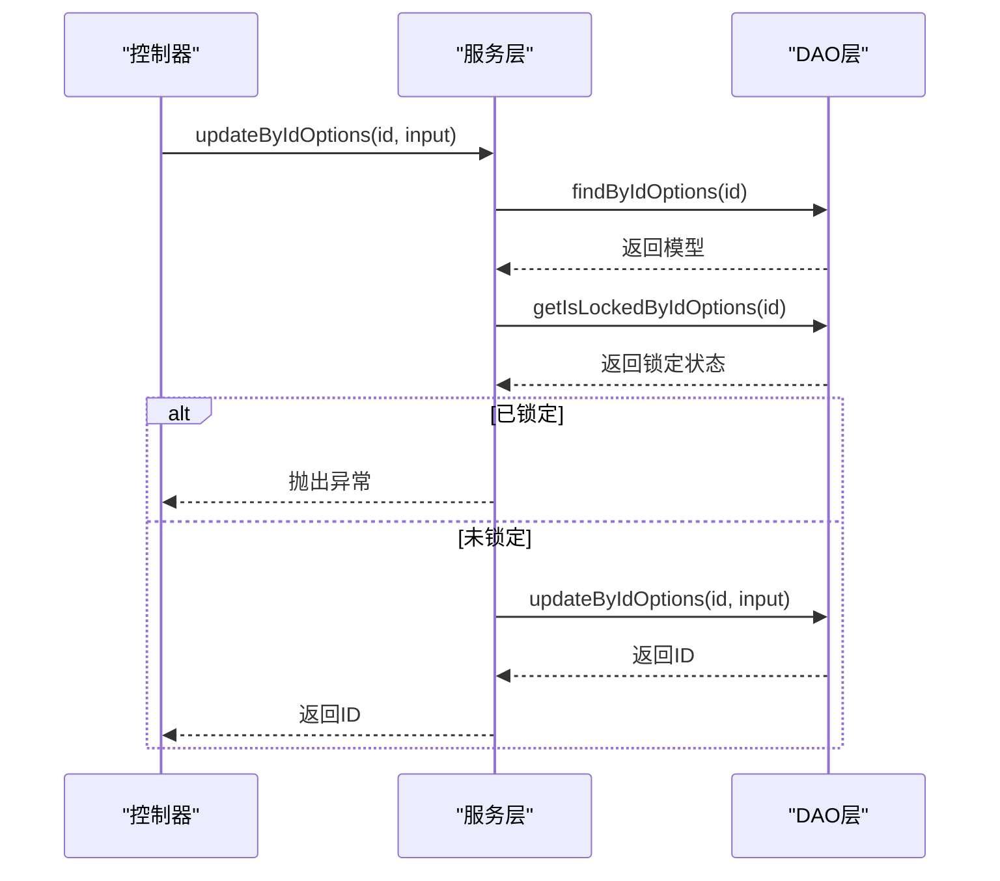

**图示来源**
- [options.service.ts](https://github.com/sail-sail/nest/blob/main/deno\gen\base\options\options.service.ts#L198-L234)

**本节来源**
- [options.service.ts](https://github.com/sail-sail/nest/blob/main/deno\gen\base\options\options.service.ts#L198-L234)

## 前端插件开发
前端插件开发主要涉及Vue组件、路由配置和状态管理的集成。

### 组件扩展机制
系统通过KFrame组件管理器实现前端插件的动态加载和管理。

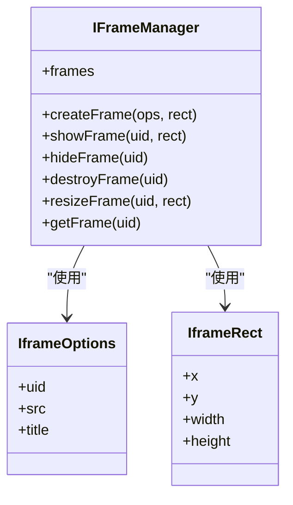

**图示来源**
- [core.ts](https://github.com/sail-sail/nest/blob/main/pc\src\components\KFrame\core.ts#L84-L124)

**本节来源**
- [core.ts](https://github.com/sail-sail/nest/blob/main/pc\src\components\KFrame\core.ts#L84-L124)

### 路由扩展机制
前端插件通过动态路由生成实现界面集成。

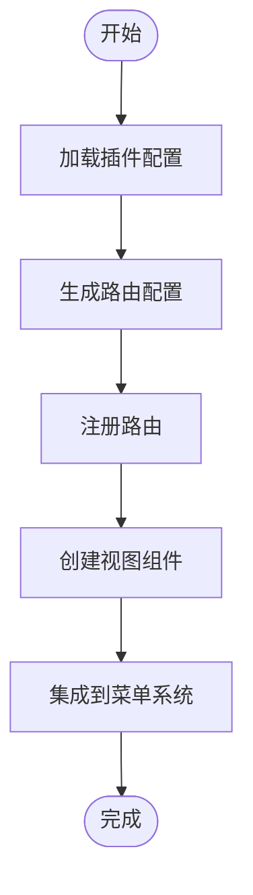

**图示来源**
- [codegen.ts](https://github.com/sail-sail/nest/blob/main/codegen\src\lib\codegen.ts#L548-L588)

## 插件生命周期管理
系统提供完整的插件生命周期管理，确保插件的安全运行和资源释放。

### 生命周期钩子
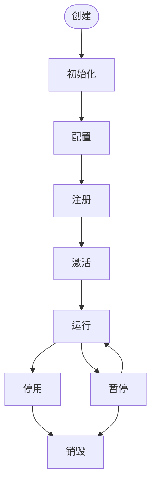

**本节来源**
- [app.dao.ts](https://github.com/sail-sail/nest/blob/main/deno\lib\app\app.dao.ts#L0-L18)
- [AsyncHooksContextManager.ts](https://github.com/sail-sail/nest/blob/main/deno\lib\async_hooks\AsyncHooksContextManager.ts#L34-L105)

## 插件通信机制
插件间通过多种通信机制实现数据交换和功能调用。

### 消息订阅/发布模式
基于WebSocket的发布/订阅模式实现插件间的实时通信。

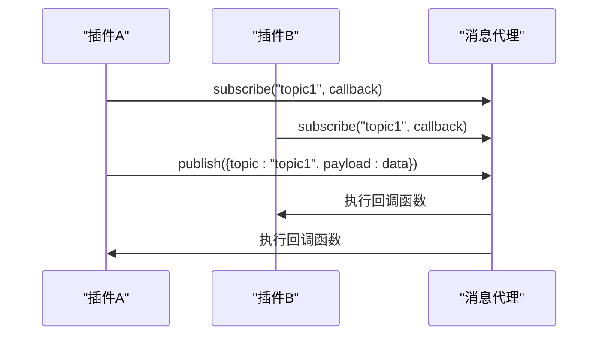

**本节来源**
- [websocket.dao.ts](https://github.com/sail-sail/nest/blob/main/deno\lib\websocket\websocket.dao.ts#L0-L63)
- [websocket.constants.ts](https://github.com/sail-sail/nest/blob/main/deno\lib\websocket\websocket.constants.ts#L0-L5)

### 事件驱动通信
前端插件通过事件总线实现组件间通信。

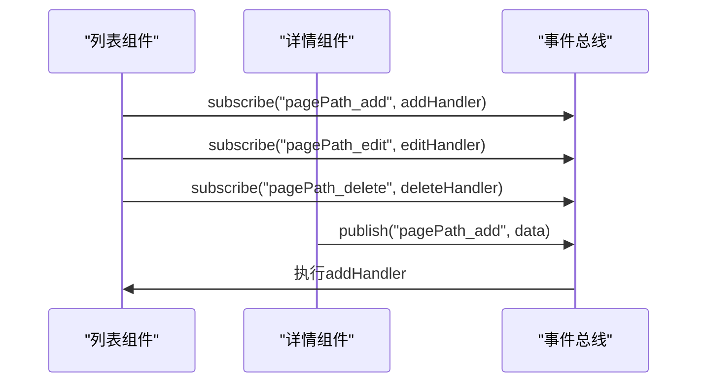

**本节来源**
- [List.ts](https://github.com/sail-sail/nest/blob/main/pc\src\compositions\List.ts#L1361-L1444)

## 插件配置与依赖管理
系统提供灵活的配置和依赖管理机制，支持插件的定制化和模块化。

### 配置管理
插件配置通过模板化方式生成，支持运行时动态调整。

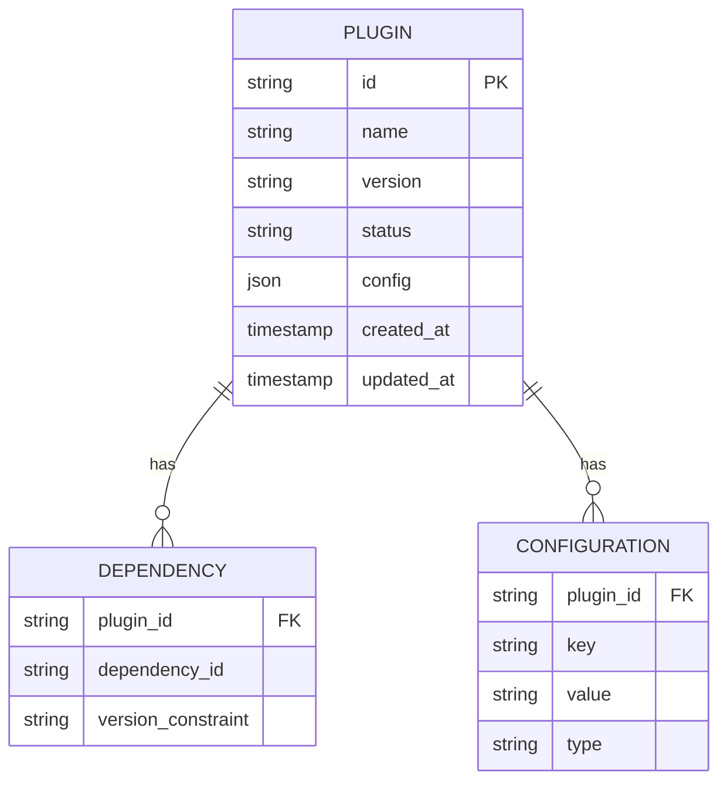

**本节来源**
- [codegen.ts](https://github.com/sail-sail/nest/blob/main/codegen\src\lib\codegen.ts#L374-L418)
- [options.dao.ts](https://github.com/sail-sail/nest/blob/main/deno\gen\base\options\options.dao.ts#L1164-L1203)

## 安全沙箱与隔离机制
系统通过多种机制确保插件的安全运行，防止插件间的相互干扰。

### 上下文隔离
使用异步钩子实现上下文隔离，确保插件运行环境的独立性。

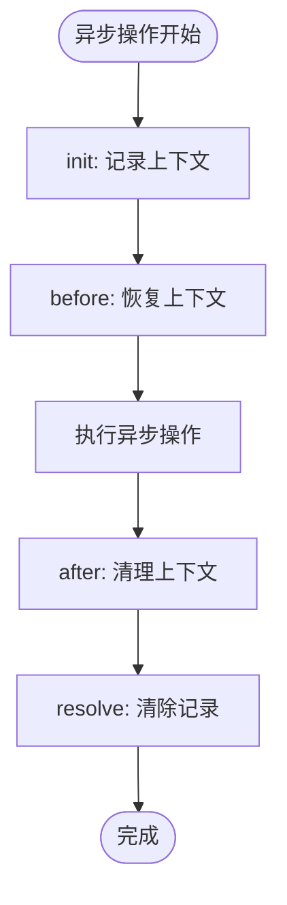

**本节来源**
- [AsyncHooksContextManager.ts](https://github.com/sail-sail/nest/blob/main/deno\lib\async_hooks\AsyncHooksContextManager.ts#L34-L105)

### 权限控制
通过数据权限和字段权限机制控制插件的数据访问范围。

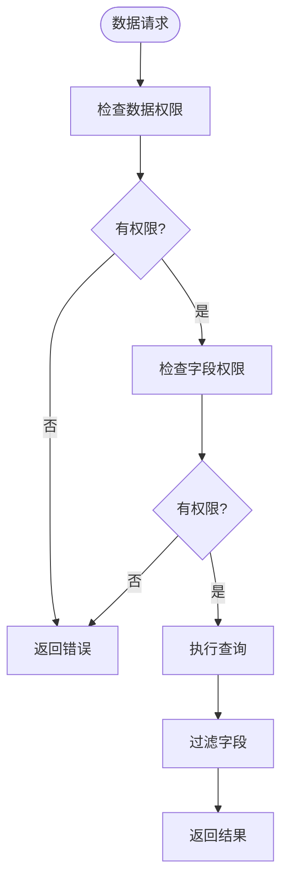

**本节来源**
- [data_permit](https://github.com/sail-sail/nest/blob/main/deno\gen\base\data_permit)
- [field_permit](https://github.com/sail-sail/nest/blob/main/deno\gen\base\field_permit)

## 实际案例分析
通过具体案例展示插件开发的完整流程。

### 系统选项插件开发
以系统选项插件为例，展示后端插件的开发过程。

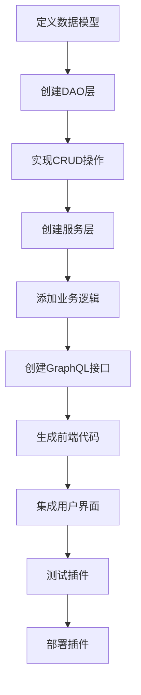

**本节来源**
- [options.dao.ts](https://github.com/sail-sail/nest/blob/main/deno\gen\base\options\options.dao.ts#L1164-L1203)
- [options.service.ts](https://github.com/sail-sail/nest/blob/main/deno\gen\base\options\options.service.ts#L198-L234)

### 多语言支持插件
以多语言支持插件为例，展示前端插件的开发过程。

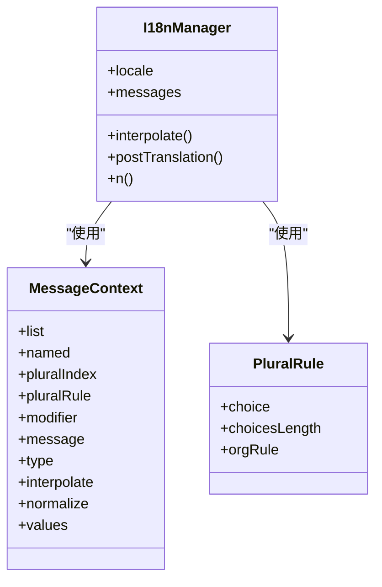

**图示来源**
- [interface.ts](https://github.com/sail-sail/nest/blob/main/uni\src\uni_modules\tm-ui\local\interface.ts#L32-L79)
- [i18n.ts](https://github.com/sail-sail/nest/blob/main/uni\src\uni_modules\tm-ui\local\i18n.ts#L215-L260)

**本节来源**
- [interface.ts](https://github.com/sail-sail/nest/blob/main/uni\src\uni_modules\tm-ui\local\interface.ts#L32-L79)
- [i18n.ts](https://github.com/sail-sail/nest/blob/main/uni\src\uni_modules\tm-ui\local\i18n.ts#L215-L260)

## 最佳实践
提供插件开发的最佳实践建议，帮助开发者创建高质量的插件。

### 代码生成最佳实践
- 使用模板化方式生成代码，确保代码风格一致性
- 在代码生成过程中进行输入验证
- 生成的代码应包含必要的日志记录
- 支持增量更新，避免覆盖自定义代码

### 性能优化建议
- 使用连接池管理数据库连接
- 实现适当的缓存策略
- 避免在循环中执行数据库查询
- 使用批量操作处理大量数据

### 安全性建议
- 对所有用户输入进行验证和清理
- 实现最小权限原则
- 使用参数化查询防止SQL注入
- 定期进行安全审计

### 可维护性建议
- 编写清晰的文档和注释
- 实现完整的单元测试
- 使用版本控制管理插件变更
- 提供详细的错误日志