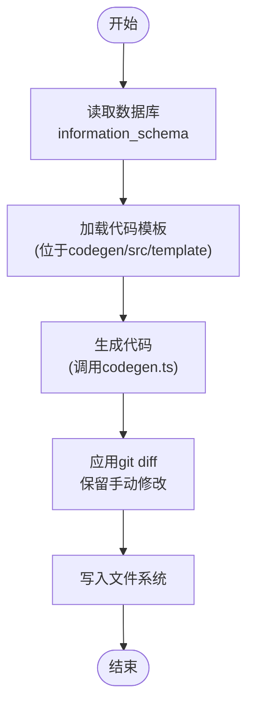
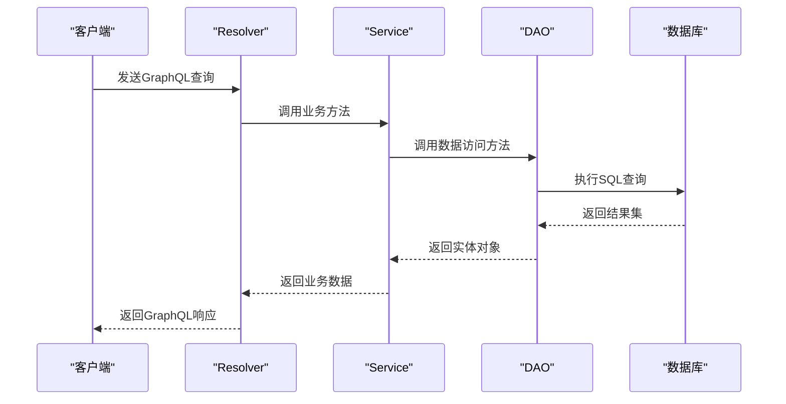
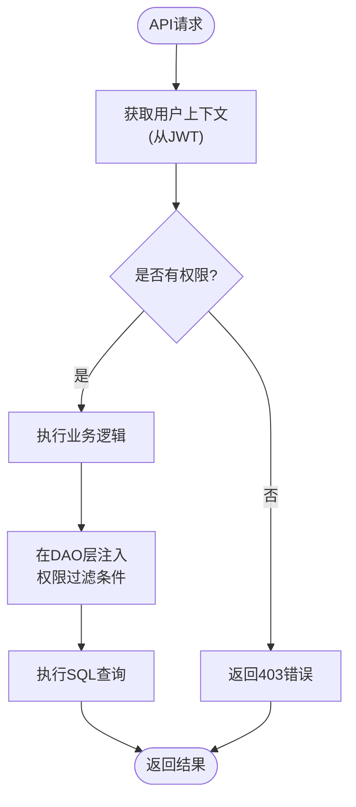
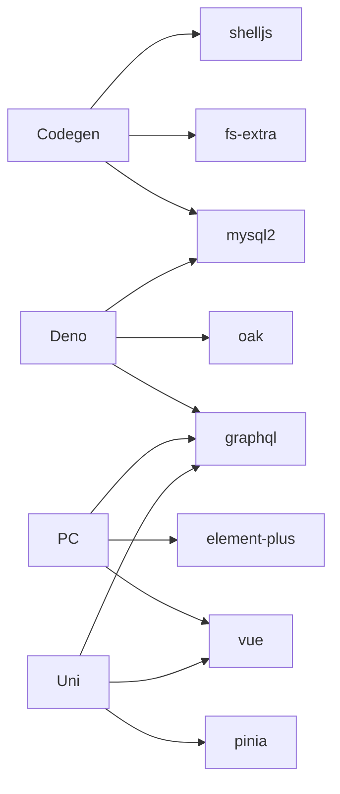

# 高级主题


**本文档引用的文件**  
- [README.md](https://github.com/sail-sail/nest/blob/main/README.md)
- [package.json](https://github.com/sail-sail/nest/blob/main/package.json)
- [codegen/package.json](https://github.com/sail-sail/nest/blob/main/codegen/package.json)
- [deno/package.json](https://github.com/sail-sail/nest/blob/main/deno/package.json)
- [pc/package.json](https://github.com/sail-sail/nest/blob/main/pc/package.json)
- [uni/package.json](https://github.com/sail-sail/nest/blob/main/uni/package.json)
- [codegen/src/bin/codegen.ts](https://github.com/sail-sail/nest/blob/main/codegen/src/bin/codegen.ts)
- [deno/lib/script/graphql_codegen_config.ts](https://github.com/sail-sail/nest/blob/main/deno/lib/script/graphql_codegen_config.ts)
- [pc/src/utils/permit_scan.js](https://github.com/sail-sail/nest/blob/main/pc/src/utils/permit_scan.js)
- [codegen/src/util/npmFieldPermit.ts](https://github.com/sail-sail/nest/blob/main/codegen/src/util/npmFieldPermit.ts)
- [deno/lib/auth/auth.service.ts](https://github.com/sail-sail/nest/blob/main/deno/lib/auth/auth.service.ts)
- [pc/src/store/usr.ts](https://github.com/sail-sail/nest/blob/main/pc/src/store/usr.ts)
- [deno/src/graphql.ts](https://github.com/sail-sail/nest/blob/main/deno/src/graphql.ts)
- [pc/src/utils/request.ts](https://github.com/sail-sail/nest/blob/main/pc/src/utils/request.ts)
- [codegen/src/lib/codegen.ts](https://github.com/sail-sail/nest/blob/main/codegen/src/lib/codegen.ts)
- [deno/lib/graphql.ts](https://github.com/sail-sail/nest/blob/main/deno/lib/graphql.ts)


## 目录
1. [引言](#引言)
2. [项目结构](#项目结构)
3. [核心组件](#核心组件)
4. [架构概览](#架构概览)
5. [详细组件分析](#详细组件分析)
6. [依赖分析](#依赖分析)
7. [性能优化](#性能优化)
8. [安全考虑](#安全考虑)
9. [扩展开发](#扩展开发)
10. [插件机制](#插件机制)
11. [生产环境最佳实践](#生产环境最佳实践)
12. [故障排查案例](#故障排查案例)

## 引言

本项目是一个基于低代码理念的全栈开发框架，旨在通过代码生成器与手动开发的无缝结合，实现开发效率的显著提升。系统采用模块化设计，支持多端部署（PC端、移动端），并集成了GraphQL API、权限管理、代码增量生成等高级功能。其核心创新在于利用 `git diff` 和 `git apply` 技术，实现代码生成后可手动修改且不会被覆盖，从而支持项目的持续迭代。

## 项目结构

项目采用多仓库结构，主要分为四个部分：`codegen`（代码生成器）、`deno`（后端服务）、`pc`（前端PC端）、`uni`（前端移动端）。这种结构实现了前后端分离与职责解耦。

```mermaid
graph TB
subgraph "根目录"
Codegen[codegen<br/>代码生成器]
Deno[deno<br/>后端服务]
PC[pc<br/>前端PC端]
Uni[uni<br/>前端移动端]
end
Codegen --> Deno : 生成代码
Codegen --> PC : 生成代码
Codegen --> Uni : 生成代码
Deno --> PC : 提供GraphQL API
Deno --> Uni : 提供GraphQL API
```

**图示来源**
- [README.md](https://github.com/sail-sail/nest/blob/main/README.md)

**本节来源**
- [README.md](https://github.com/sail-sail/nest/blob/main/README.md)

## 核心组件

系统的核心组件包括代码生成引擎、GraphQL服务、权限管理系统和多端前端应用。代码生成引擎（`codegen`）是整个系统的基石，它根据数据库表结构自动生成前后端代码。GraphQL服务（`deno`）作为统一的数据API层，为前端提供灵活的数据查询能力。权限管理系统贯穿前后端，确保数据安全。PC端和移动端前端应用则负责用户交互。

**本节来源**
- [README.md](https://github.com/sail-sail/nest/blob/main/README.md)
- [package.json](https://github.com/sail-sail/nest/blob/main/package.json)

## 架构概览

系统采用典型的前后端分离架构，后端基于Deno和MySQL，通过GraphQL暴露API；前端基于Vue3和Uni-app，分别构建PC和移动端应用。代码生成器作为独立工具，负责生成初始代码和后续增量代码。

```mermaid
graph TD
subgraph "前端"
PC_Frontend[PC前端<br/>Vue3 + Vite]
Uni_Frontend[移动端<br/>Uni-app]
end
subgraph "后端"
GraphQL_Server[GraphQL服务<br/>Deno + Oak]
Database[(MySQL数据库)]
Auth_Service[认证服务<br/>JWT]
end
subgraph "工具"
Code_Generator[代码生成器<br/>Node.js + TypeScript]
end
PC_Frontend --> GraphQL_Server : GraphQL请求
Uni_Frontend --> GraphQL_Server : GraphQL请求
GraphQL_Server --> Database : SQL查询
GraphQL_Server --> Auth_Service : 验证JWT
Code_Generator --> PC_Frontend : 生成代码
Code_Generator --> Uni_Frontend : 生成代码
Code_Generator --> GraphQL_Server : 生成代码
```

**图示来源**
- [README.md](https://github.com/sail-sail/nest/blob/main/README.md)
- [package.json](https://github.com/sail-sail/nest/blob/main/package.json)

## 详细组件分析

### 代码生成器分析

代码生成器是本系统的核心创新点。它通过分析数据库的`information_schema`，读取表结构，然后根据预定义的模板生成前后端代码。其关键特性是支持增量更新，即用户手动修改生成的代码后，生成器能通过`git`差异分析保留这些修改。

#### 代码生成流程


**图示来源**
- [codegen/src/lib/codegen.ts](https://github.com/sail-sail/nest/blob/main/codegen/src/lib/codegen.ts)
- [codegen/src/bin/codegen.ts](https://github.com/sail-sail/nest/blob/main/codegen/src/bin/codegen.ts)

**本节来源**
- [codegen/package.json](https://github.com/sail-sail/nest/blob/main/codegen/package.json)
- [codegen/src/bin/codegen.ts](https://github.com/sail-sail/nest/blob/main/codegen/src/bin/codegen.ts)
- [codegen/src/lib/codegen.ts](https://github.com/sail-sail/nest/blob/main/codegen/src/lib/codegen.ts)

### GraphQL服务分析

后端服务基于Deno的`oak`框架构建，使用`graphql`库实现GraphQL API。每个数据库表对应一个`base`目录下的模块，包含`.dao.ts`（数据访问）、`.service.ts`（业务逻辑）、`.resolver.ts`（GraphQL解析器）和`.graphql.ts`（GraphQL Schema）。

#### GraphQL请求处理流程


**图示来源**
- [deno/src/base/usr/usr.resolver.ts](https://github.com/sail-sail/nest/blob/main/deno/src/base/usr/usr.resolver.ts)
- [deno/src/base/usr/usr.service.ts](https://github.com/sail-sail/nest/blob/main/deno/src/base/usr/usr.service.ts)
- [deno/src/base/usr/usr.dao.ts](https://github.com/sail-sail/nest/blob/main/deno/src/base/usr/usr.dao.ts)

**本节来源**
- [deno/package.json](https://github.com/sail-sail/nest/blob/main/deno/package.json)
- [deno/src/graphql.ts](https://github.com/sail-sail/nest/blob/main/deno/src/graphql.ts)
- [deno/lib/graphql.ts](https://github.com/sail-sail/nest/blob/main/deno/lib/graphql.ts)

### 权限管理系统分析

权限管理分为数据权限和字段权限，通过`data_permit`和`field_permit`表实现。前端在请求时携带用户ID和角色信息，后端在DAO层动态拼接SQL的`WHERE`条件来过滤数据。

#### 权限检查流程


**图示来源**
- [pc/src/utils/permit_scan.js](https://github.com/sail-sail/nest/blob/main/pc/src/utils/permit_scan.js)
- [codegen/src/util/npmFieldPermit.ts](https://github.com/sail-sail/nest/blob/main/codegen/src/util/npmFieldPermit.ts)
- [deno/lib/auth/auth.service.ts](https://github.com/sail-sail/nest/blob/main/deno/lib/auth/auth.service.ts)

**本节来源**
- [pc/src/utils/permit_scan.js](https://github.com/sail-sail/nest/blob/main/pc/src/utils/permit_scan.js)
- [codegen/src/util/npmFieldPermit.ts](https://github.com/sail-sail/nest/blob/main/codegen/src/util/npmFieldPermit.ts)
- [deno/lib/auth/auth.service.ts](https://github.com/sail-sail/nest/blob/main/deno/lib/auth/auth.service.ts)

## 依赖分析

项目依赖关系清晰，各模块职责分明。`codegen`模块依赖`mysql2`和`fs-extra`等库来读取数据库和操作文件系统。`deno`后端依赖`oak`作为Web框架，`graphql`处理GraphQL请求。`pc`前端依赖`vue`和`element-plus`构建UI。



**图示来源**
- [codegen/package.json](https://github.com/sail-sail/nest/blob/main/codegen/package.json)
- [deno/package.json](https://github.com/sail-sail/nest/blob/main/deno/package.json)
- [pc/package.json](https://github.com/sail-sail/nest/blob/main/pc/package.json)
- [uni/package.json](https://github.com/sail-sail/nest/blob/main/uni/package.json)

**本节来源**
- [codegen/package.json](https://github.com/sail-sail/nest/blob/main/codegen/package.json)
- [deno/package.json](https://github.com/sail-sail/nest/blob/main/deno/package.json)
- [pc/package.json](https://github.com/sail-sail/nest/blob/main/pc/package.json)
- [uni/package.json](https://github.com/sail-sail/nest/blob/main/uni/package.json)

## 性能优化

### 后端GraphQL查询优化
- **查询扁平化**: 避免深度嵌套查询，减少解析器调用次数。
- **数据加载器(DataLoader)**: 使用`lru-cache`实现缓存，批量处理N+1查询问题。
- **SQL优化**: DAO层生成的SQL应使用索引，避免`SELECT *`。

### 数据库查询性能调优
- **索引策略**: 为`permit`、`tenant`等常用过滤字段建立复合索引。
- **连接池**: 使用`mysql2`的连接池，复用数据库连接，减少握手开销。
- **慢查询日志**: 开启MySQL慢查询日志，定期分析并优化。

### 前端组件渲染优化
- **虚拟滚动**: 对于长列表（如`login_log`），使用`vue-virtual-scroller`。
- **懒加载**: 路由和组件按需加载，减少首屏体积。
- **计算属性缓存**: 使用`computed`缓存复杂计算结果。

### 网络请求优化
- **GraphQL批处理**: 使用`graphql-combine-query`合并多个查询请求。
- **HTTP/2**: 后端支持HTTP/2，实现多路复用。
- **Gzip压缩**: 启用响应体压缩，减小传输体积。

**本节来源**
- [deno/package.json](https://github.com/sail-sail/nest/blob/main/deno/package.json)
- [pc/package.json](https://github.com/sail-sail/nest/blob/main/pc/package.json)
- [uni/package.json](https://github.com/sail-sail/nest/blob/main/uni/package.json)
- [deno/lib/graphql.ts](https://github.com/sail-sail/nest/blob/main/deno/lib/graphql.ts)

## 安全考虑

### 常见安全漏洞防范
- **SQL注入**: 使用`mysql2`的参数化查询，禁止字符串拼接。
- **XSS**: 前端使用`vue`的自动转义，后端返回的HTML内容需经过`DOMPurify`清洗。
- **CSRF**: 由于使用JWT进行认证，且JWT存储在内存中（非Cookie），天然免疫CSRF攻击。

### JWT令牌安全管理
- **安全存储**: 前端将JWT存储在`Vuex`或`Pinia`中，避免使用`localStorage`以防XSS窃取。
- **短期有效**: 设置较短的过期时间（如1小时），并实现刷新令牌机制。
- **HTTPS传输**: 强制所有API请求通过HTTPS，防止中间人攻击。

**本节来源**
- [deno/lib/auth/auth.service.ts](https://github.com/sail-sail/nest/blob/main/deno/lib/auth/auth.service.ts)
- [pc/src/store/usr.ts](https://github.com/sail-sail/nest/blob/main/pc/src/store/usr.ts)
- [pc/src/utils/request.ts](https://github.com/sail-sail/nest/blob/main/pc/src/utils/request.ts)

## 扩展开发

### 添加新的列类型支持
1. 在`codegen/src/lib/information_schema.ts`中定义新的列类型映射。
2. 在`codegen/src/template`的相应模板文件中添加对该类型的处理逻辑。
3. 运行`npm run codegen`重新生成代码。

### 自定义模板
1. 复制`codegen/src/template/pc/src/views/[[mod_slash_table]]`目录。
2. 修改Vue组件模板，调整UI布局或逻辑。
3. 将新模板放入`codegen/src/template`下的自定义目录。
4. 修改`codegen.ts`中的模板路径配置。

**本节来源**
- [codegen/src/lib/information_schema.ts](https://github.com/sail-sail/nest/blob/main/codegen/src/lib/information_schema.ts)
- [codegen/src/template](https://github.com/sail-sail/nest/blob/main/codegen/src/template)
- [codegen/src/lib/codegen.ts](https://github.com/sail-sail/nest/blob/main/codegen/src/lib/codegen.ts)

## 插件机制

系统通过`package.json`的`scripts`字段提供插件扩展点。例如，`permit`脚本用于扫描权限，`field_permit`用于生成字段权限代码。开发者可以创建新的Node.js脚本，并在`package.json`中注册为命令。

```json
"scripts": {
  "my-plugin": "node my_plugin.js"
}
```

**本节来源**
- [package.json](https://github.com/sail-sail/nest/blob/main/package.json)
- [pc/src/utils/permit_scan.js](https://github.com/sail-sail/nest/blob/main/pc/src/utils/permit_scan.js)
- [codegen/src/util/npmFieldPermit.ts](https://github.com/sail-sail/nest/blob/main/codegen/src/util/npmFieldPermit.ts)

## 生产环境最佳实践

### 监控
- **应用监控**: 使用`deno`的`health`模块提供健康检查端点。
- **日志监控**: 集成`log`库，将日志输出到文件或ELK栈。
- **性能监控**: 记录关键API的响应时间。

### 日志分析
- **结构化日志**: 使用`JSON`格式输出日志，便于机器解析。
- **日志级别**: 合理使用`debug`、`info`、`warn`、`error`级别。
- **日志轮转**: 配置日志文件大小和保留策略。

### 故障排查
- **启用调试模式**: 在`deno`中设置`DENO_ENV=development`以获取详细错误信息。
- **检查网络**: 使用`curl`或`Postman`直接测试GraphQL端点。
- **查看日志**: 检查`deno`服务和`pc`构建的日志文件。

**本节来源**
- [deno/lib/health/health.service.ts](https://github.com/sail-sail/nest/blob/main/deno/lib/health/health.service.ts)
- [deno/lib/util/log.ts](https://github.com/sail-sail/nest/blob/main/deno/lib/util/log.ts)
- [package.json](https://github.com/sail-sail/nest/blob/main/package.json)

## 故障排查案例

### 案例：代码生成后页面无法访问
**问题**: 运行`codegen`后，新生成的页面在PC端无法访问。
**排查步骤**:
1. 检查`pc/src/router/gen.ts`是否已生成新路由。
2. 检查`pc/src/views/base`下是否有对应的Vue文件。
3. 运行`npm run permit`重新扫描权限，确保新菜单有访问权限。
4. 重启`pc`前端服务。

### 案例：GraphQL查询返回空数据
**问题**: GraphQL查询返回`null`，但数据库中有数据。
**排查步骤**:
1. 检查`data_permit`表，确认当前用户是否有该数据的访问权限。
2. 检查DAO层生成的SQL，确认`WHERE`条件是否正确。
3. 在`deno`服务中开启`debug`日志，查看SQL执行详情。

**本节来源**
- [pc/src/router/gen.ts](https://github.com/sail-sail/nest/blob/main/pc/src/router/gen.ts)
- [pc/src/utils/permit_scan.js](https://github.com/sail-sail/nest/blob/main/pc/src/utils/permit_scan.js)
- [deno/src/base/*/base.dao.ts](https://github.com/sail-sail/nest/blob/main/deno/src/base/*/base.dao.ts)