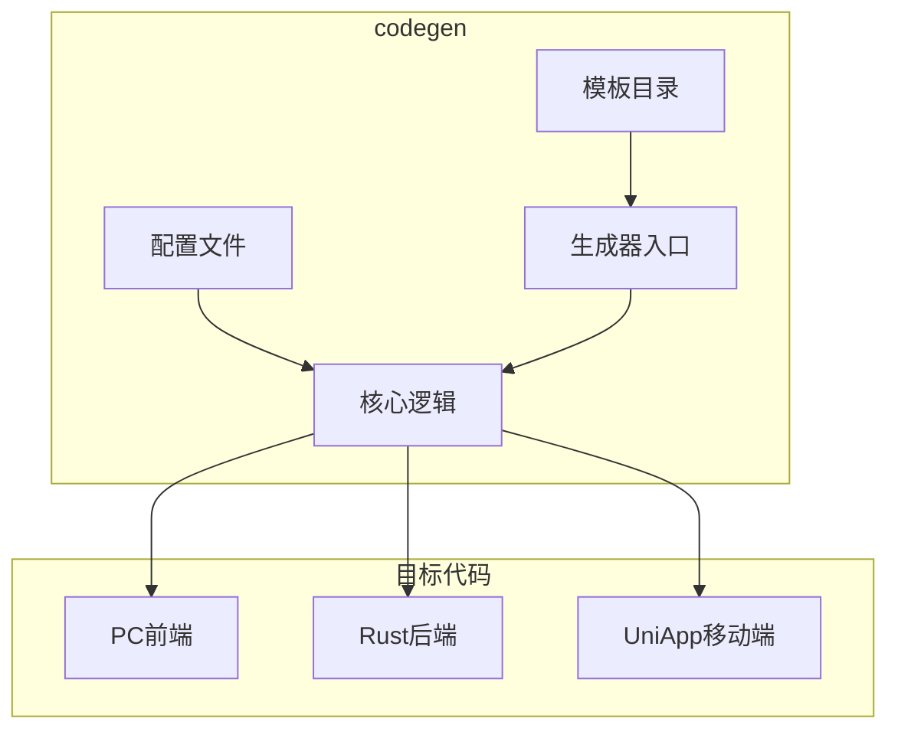
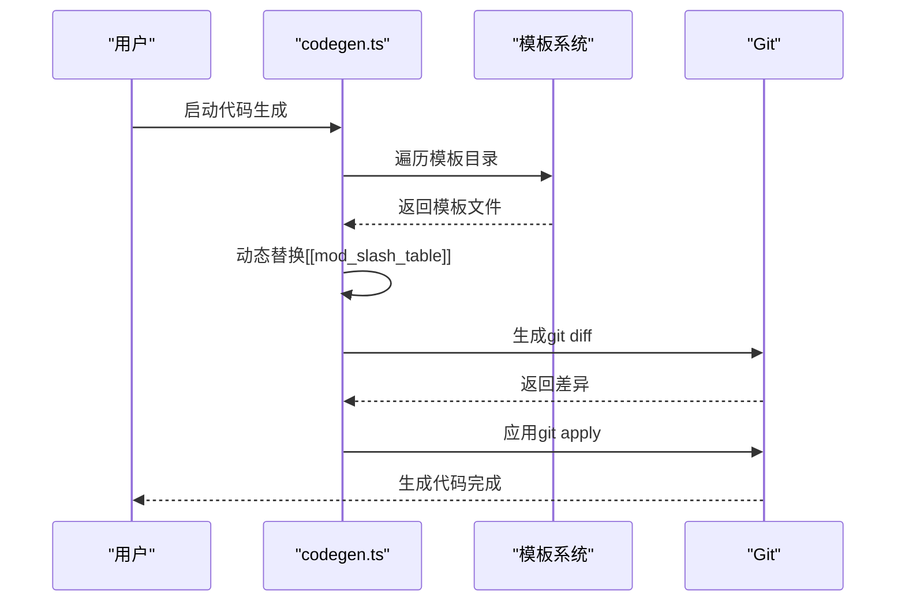
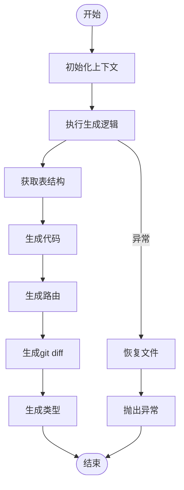
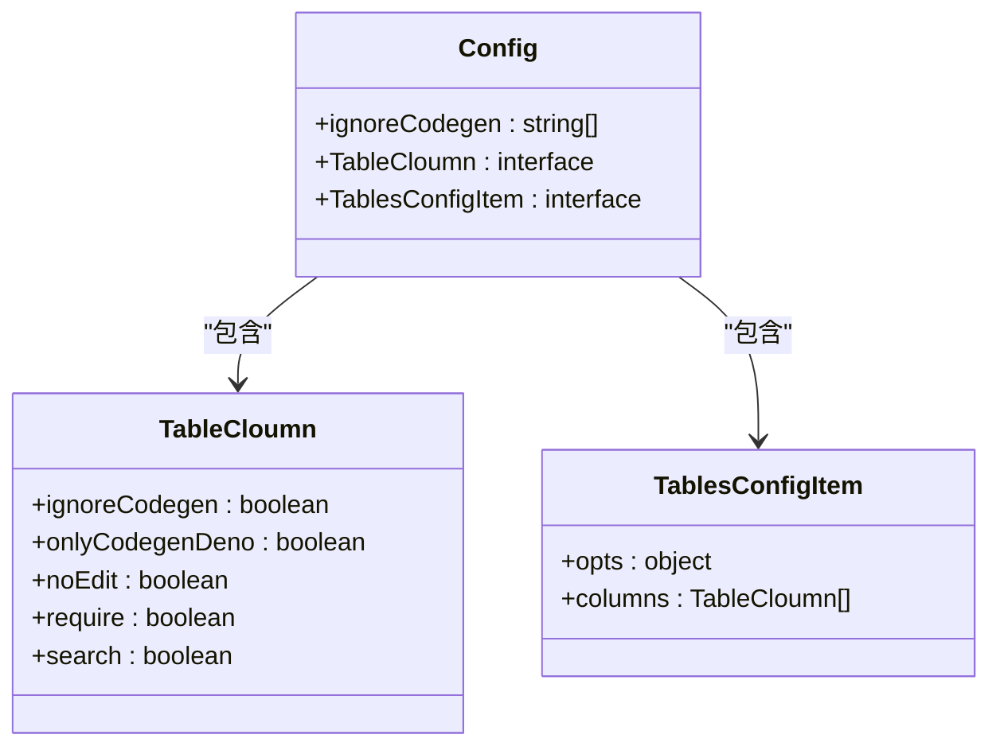
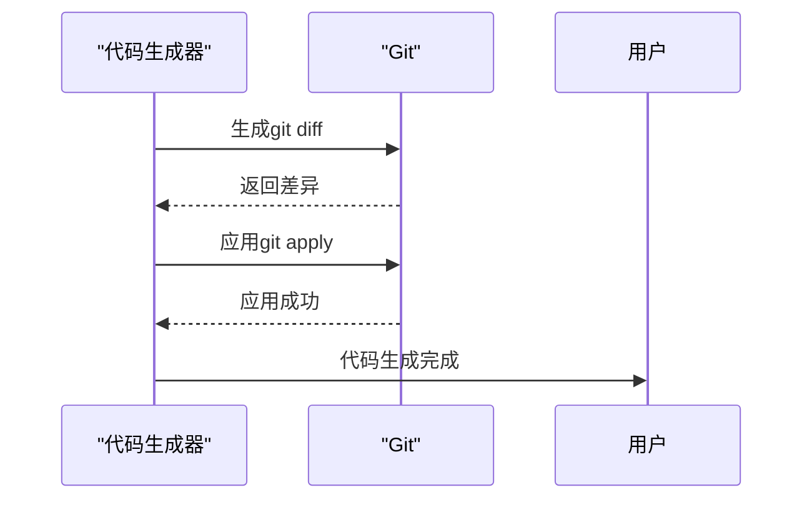

# 代码生成机制


**本文档引用的文件**   
- [codegen.ts](https://github.com/sail-sail/nest/blob/main/codegen/src/bin/codegen.ts)
- [config.ts](https://github.com/sail-sail/nest/blob/main/codegen/src/config.ts)
- [codegen.ts](https://github.com/sail-sail/nest/blob/main/codegen/src/lib/codegen.ts)
- [information_schema.ts](https://github.com/sail-sail/nest/blob/main/codegen/src/lib/information_schema.ts)
- [lib.rs](https://github.com/sail-sail/nest/blob/main/codegen/src/template/rust/generated/lib.rs)
- [List.vue](https://github.com/sail-sail/nest/blob/main/codegen/src/template/pc/src/views/[[mod_slash_table]]/List.vue)
- [Api.ts](https://github.com/sail-sail/nest/blob/main/codegen/src/template/uni/src/pages/[[table]]/Api.ts)
- [codeapply.ts](https://github.com/sail-sail/nest/blob/main/codegen/src/bin/codeapply.ts)


## 目录
1. [简介](#简介)
2. [项目结构](#项目结构)
3. [核心组件](#核心组件)
4. [架构概述](#架构概述)
5. [详细组件分析](#详细组件分析)
6. [依赖分析](#依赖分析)
7. [性能考虑](#性能考虑)
8. [故障排除指南](#故障排除指南)
9. [结论](#结论)
10. [附录](#附录)（如有必要）

## 简介
本文档深入探讨了代码生成机制的核心原理，旨在为开发者提供定制和扩展代码生成器所需的技术知识。系统通过自动化能力，基于模板和配置文件生成目标代码，支持PC、Rust和UniApp三端。文档详细解释了主逻辑流程、配置选项、模板系统工作机制，以及基于git diff和git apply实现的增量更新原理。

## 项目结构
代码生成机制的项目结构清晰，主要分为以下几个部分：
- `codegen`：代码生成器的核心目录，包含模板、配置和生成逻辑。
- `pc`：PC端前端代码。
- `rust`：Rust后端代码。
- `uni`：UniApp移动端代码。



**图表来源**
- [codegen.ts](https://github.com/sail-sail/nest/blob/main/codegen/src/bin/codegen.ts)
- [config.ts](https://github.com/sail-sail/nest/blob/main/codegen/src/config.ts)

**章节来源**
- [codegen.ts](https://github.com/sail-sail/nest/blob/main/codegen/src/bin/codegen.ts)
- [config.ts](https://github.com/sail-sail/nest/blob/main/codegen/src/config.ts)

## 核心组件
代码生成机制的核心组件包括`codegen.ts`中的主逻辑流程、`config.ts`中的配置选项以及模板系统。这些组件协同工作，实现代码的自动化生成。

**章节来源**
- [codegen.ts](https://github.com/sail-sail/nest/blob/main/codegen/src/bin/codegen.ts)
- [config.ts](https://github.com/sail-sail/nest/blob/main/codegen/src/config.ts)

## 架构概述
系统架构采用模块化设计，通过模板引擎和配置驱动的方式生成代码。主流程包括遍历模板目录、动态替换变量、生成目标文件，并通过git diff和git apply实现增量更新。



**图表来源**
- [codegen.ts](https://github.com/sail-sail/nest/blob/main/codegen/src/bin/codegen.ts)
- [codeapply.ts](https://github.com/sail-sail/nest/blob/main/codegen/src/bin/codeapply.ts)

## 详细组件分析

### 主逻辑流程分析
`codegen.ts`是代码生成器的入口文件，负责协调整个生成过程。它通过命令行参数接收表名，初始化上下文，执行生成逻辑，并处理异常。



**图表来源**
- [codegen.ts](https://github.com/sail-sail/nest/blob/main/codegen/src/bin/codegen.ts)

**章节来源**
- [codegen.ts](https://github.com/sail-sail/nest/blob/main/codegen/src/bin/codegen.ts)

### 配置选项分析
`config.ts`定义了代码生成的配置选项，包括忽略生成的字段、字段属性等。这些配置直接影响生成过程。



**图表来源**
- [config.ts](https://github.com/sail-sail/nest/blob/main/codegen/src/config.ts)

**章节来源**
- [config.ts](https://github.com/sail-sail/nest/blob/main/codegen/src/config.ts)

### 模板系统分析
模板系统通过动态替换`[[mod_slash_table]]`等变量，生成目标文件。支持PC、Rust和UniApp三端模板，结构相似但有差异。

#### PC端模板
PC端模板位于`template/pc/src/views/[[mod_slash_table]]`，包含List.vue、Detail.vue等组件。

```mermaid
flowchart TD
PC_Template["PC模板"] --> List["List.vue"]
PC_Template --> Detail["Detail.vue"]
PC_Template --> Api["Api.ts"]
PC_Template --> Model["Model.ts"]
List --> "遍历columns生成表格"
Detail --> "生成表单"
Api --> "生成GraphQL查询"
Model --> "定义数据模型"
```

**图表来源**
- [List.vue](https://github.com/sail-sail/nest/blob/main/codegen/src/template/pc/src/views/[[mod_slash_table]]/List.vue)

#### Rust端模板
Rust端模板位于`template/rust/generated/[[mod]]/[[table]]`，生成DAO、Model、Resolver等文件。

```mermaid
flowchart TD
Rust_Template["Rust模板"] --> DAO["*_dao.rs"]
Rust_Template --> Model["*_model.rs"]
Rust_Template --> Resolver["*_resolver.rs"]
Rust_Template --> Service["*_service.rs"]
DAO --> "数据库操作"
Model --> "数据结构"
Resolver --> "GraphQL解析"
Service --> "业务逻辑"
```

**图表来源**
- [lib.rs](https://github.com/sail-sail/nest/blob/main/codegen/src/template/rust/generated/lib.rs)

#### UniApp端模板
UniApp端模板位于`template/uni/src/pages/[[table]]`，生成Api.ts和Model.ts。

```mermaid
flowchart TD
Uni_Template["UniApp模板"] --> Api["Api.ts"]
Uni_Template --> Model["Model.ts"]
Api --> "生成GraphQL查询"
Model --> "定义数据模型"
```

**图表来源**
- [Api.ts](https://github.com/sail-sail/nest/blob/main/codegen/src/template/uni/src/pages/[[table]]/Api.ts)

### 增量更新原理
基于git diff和git apply实现的增量更新是保证生成代码与手动修改共存的关键。生成器先生成差异，再应用到目标文件。



**图表来源**
- [codegen.ts](https://github.com/sail-sail/nest/blob/main/codegen/src/lib/codegen.ts)

**章节来源**
- [codegen.ts](https://github.com/sail-sail/nest/blob/main/codegen/src/lib/codegen.ts)

## 依赖分析
代码生成机制依赖于多个外部工具和库，包括git、fs-extra、ejsexcel等。这些依赖确保了生成过程的稳定性和效率。

```mermaid
graph LR
A[代码生成器] --> B[git]
A --> C[fs-extra]
A --> D[ejsexcel]
A --> E[mysql2]
A --> F[commander]
B --> "版本控制"
C --> "文件操作"
D --> "Excel处理"
E --> "数据库连接"
F --> "命令行解析"
```

**图表来源**
- [codegen.ts](https://github.com/sail-sail/nest/blob/main/codegen/src/bin/codegen.ts)
- [codegen.ts](https://github.com/sail-sail/nest/blob/main/codegen/src/lib/codegen.ts)

**章节来源**
- [codegen.ts](https://github.com/sail-sail/nest/blob/main/codegen/src/bin/codegen.ts)
- [codegen.ts](https://github.com/sail-sail/nest/blob/main/codegen/src/lib/codegen.ts)

## 性能考虑
代码生成机制在性能方面做了多项优化，包括缓存表结构、批量写入文件、异步处理等。这些优化确保了生成过程的高效性。

## 故障排除指南
常见问题包括模板变量替换失败、git diff应用失败等。解决方法包括检查模板路径、确保git状态干净等。

**章节来源**
- [codegen.ts](https://github.com/sail-sail/nest/blob/main/codegen/src/bin/codegen.ts)
- [codegen.ts](https://github.com/sail-sail/nest/blob/main/codegen/src/lib/codegen.ts)

## 结论
代码生成机制通过自动化能力，显著提高了开发效率。理解其核心原理，有助于开发者更好地定制和扩展生成器，满足项目需求。

## 附录
无