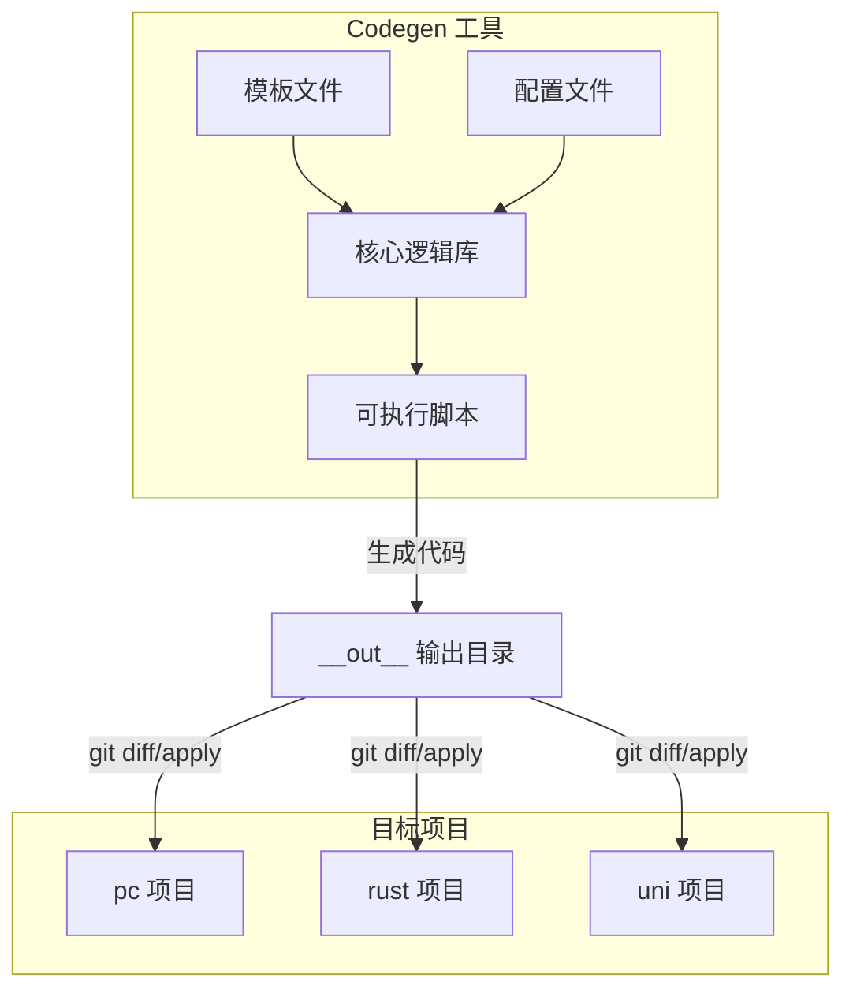
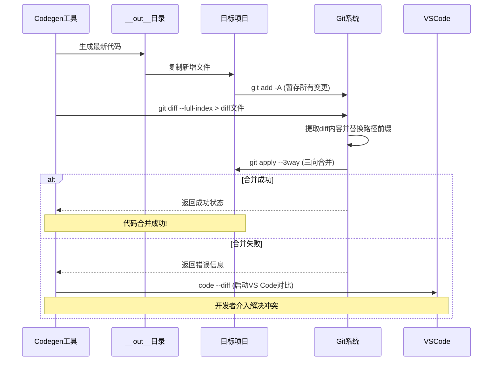
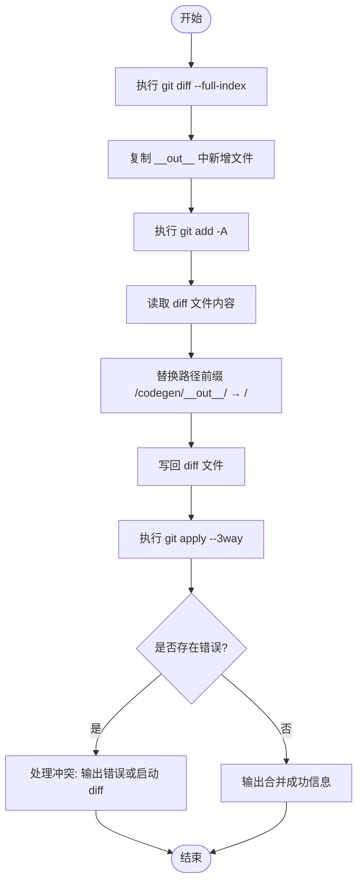
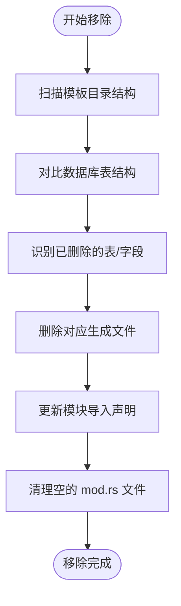
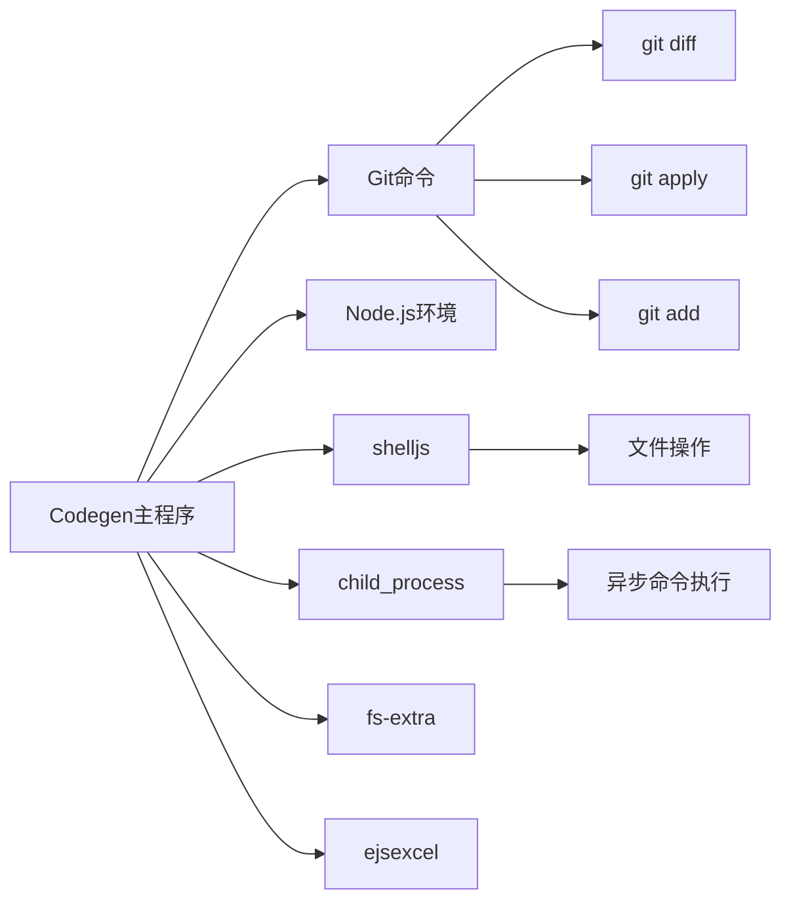

# 增量更新原理

**本文档引用文件**  
- [codeapply.ts](https://github.com/sail-sail/nest/blob/main/codegen/src/bin/codeapply.ts)
- [codegen.ts](https://github.com/sail-sail/nest/blob/main/codegen/src/lib/codegen.ts)
- [coderemove.ts](https://github.com/sail-sail/nest/blob/main/codegen/src/lib/coderemove.ts)
- [coderemove_rs.ts](https://github.com/sail-sail/nest/blob/main/codegen/src/lib/coderemove_rs.ts)
- [StringUitl.ts](https://github.com/sail-sail/nest/blob/main/codegen/src/lib/StringUitl.ts)

## 目录
1. [引言](#引言)
2. [项目结构](#项目结构)
3. [核心组件](#核心组件)
4. [架构概述](#架构概述)
5. [详细组件分析](#详细组件分析)
6. [依赖分析](#依赖分析)
7. [性能考虑](#性能考虑)
8. [故障排查指南](#故障排查指南)
9. [结论](#结论)

## 引言
本文档深入阐述基于 `git diff` 和 `git apply` 的代码增量更新机制，重点分析代码生成工具（codegen）如何与开发者手动修改的代码共存，并安全地处理代码冲突。通过解析 `coderemove.ts` 和 `coderemove_rs.ts` 中的逻辑，说明代码移除与更新的实现方式。同时提供实际场景示例，展示在修改生成的 Vue 组件或 Rust Resolver 后，系统如何保留这些修改并应用新的代码生成结果。

## 项目结构
项目采用模块化设计，codegen 工具负责生成前端（PC/Uni）和后端（Rust）代码。生成的代码输出至 `__out__` 目录，再通过 git 差异比对与合并机制同步到目标项目中。

**Diagram sources**
- [codegen.ts](https://github.com/sail-sail/nest/blob/main/codegen/src/lib/codegen.ts#L588-L714)
- [codeapply.ts](https://github.com/sail-sail/nest/blob/main/codegen/src/bin/codeapply.ts#L1-L14)

**Section sources**
- [codegen.ts](https://github.com/sail-sail/nest/blob/main/codegen/src/lib/codegen.ts#L0-L746)
- [codeapply.ts](https://github.com/sail-sail/nest/blob/main/codegen/src/bin/codeapply.ts#L0-L14)

## 核心组件
增量更新的核心流程由 `gitDiffOut` 函数驱动，该函数执行以下关键步骤：
1. 生成当前工作区与暂存区之间的完整差异（diff）
2. 将新生成的文件从 `__out__` 复制到项目根目录
3. 使用 `git add -A` 跟踪所有变更
4. 调用 `git apply` 应用差异补丁，实现非破坏性合并
5. 检测并处理合并冲突

此机制确保了代码生成不会覆盖开发者的手动修改，仅将变更部分安全地合并。

**Section sources**
- [codegen.ts](https://github.com/sail-sail/nest/blob/main/codegen/src/lib/codegen.ts#L588-L714)

## 架构概述
系统采用“生成-差异-合并”三阶段架构，确保代码生成与手动开发的协同。

**Diagram sources**
- [codegen.ts](https://github.com/sail-sail/nest/blob/main/codegen/src/lib/codegen.ts#L588-L714)

## 详细组件分析

### 代码生成与合并流程分析
`gitDiffOut` 函数是增量更新的核心，其逻辑确保了生成代码与手动修改的共存。

#### 代码合并机制

**Diagram sources**
- [codegen.ts](https://github.com/sail-sail/nest/blob/main/codegen/src/lib/codegen.ts#L588-L714)

**Section sources**
- [codegen.ts](https://github.com/sail-sail/nest/blob/main/codegen/src/lib/codegen.ts#L588-L714)

### 代码移除逻辑分析
`coderemove.ts` 和 `coderemove_rs.ts` 负责处理代码移除逻辑，确保在表或字段被删除时，相关生成代码也能被正确清理。

#### 移除逻辑流程

**Diagram sources**
- [coderemove.ts](https://github.com/sail-sail/nest/blob/main/codegen/src/lib/coderemove.ts)
- [coderemove_rs.ts](https://github.com/sail-sail/nest/blob/main/codegen/src/lib/coderemove_rs.ts)

**Section sources**
- [coderemove.ts](https://github.com/sail-sail/nest/blob/main/codegen/src/lib/coderemove.ts)
- [coderemove_rs.ts](https://github.com/sail-sail/nest/blob/main/codegen/src/lib/coderemove_rs.ts)

## 依赖分析
系统依赖 Git 进行差异计算与合并操作，依赖 Node.js 环境执行 TypeScript 脚本，并使用 `shelljs` 和 `child_process` 执行系统命令。

**Diagram sources**
- [codegen.ts](https://github.com/sail-sail/nest/blob/main/codegen/src/lib/codegen.ts#L0-L746)
- [codeapply.ts](https://github.com/sail-sail/nest/blob/main/codegen/src/bin/codeapply.ts#L0-L14)

**Section sources**
- [codegen.ts](https://github.com/sail-sail/nest/blob/main/codegen/src/lib/codegen.ts#L0-L746)

## 性能考虑
- 使用 `execSync` 执行同步 Git 命令，确保操作顺序
- 仅在文件内容或大小发生变化时才写入文件，减少 I/O 操作
- 利用缓存机制（如 `StringUitl.ts` 中的模板缓存）提升模板渲染效率
- 批量处理文件写入操作，减少磁盘访问次数

## 故障排查指南
当代码合并失败时，系统会自动检测并提示开发者介入。

### 常见合并冲突场景
| 场景 | 原因 | 解决方案 |
|------|------|----------|
| 手动修改与生成变更冲突 | 开发者修改了生成代码中的同一行 | 使用 VS Code 的 diff 工具手动合并 |
| 文件路径不匹配 | `__out__` 路径替换失败 | 检查 `gitDiffOut` 中的路径正则替换逻辑 |
| 新增文件未被跟踪 | `git add -A` 执行失败 | 确保项目根目录为 Git 工作区 |
| 权限问题 | 无法写入目标文件 | 检查文件权限及进程权限 |

### 冲突处理流程
1. 系统检测到 `git apply` 错误
2. 提取错误信息中包含 `error: patch failed:` 的行
3. 自动调用 `code --diff` 命令启动 VS Code 对比工具
4. 开发者在编辑器中手动解决冲突
5. 重新运行 codegen 工具完成合并

**Section sources**
- [codegen.ts](https://github.com/sail-sail/nest/blob/main/codegen/src/lib/codegen.ts#L632-L714)

## 结论
本系统通过 `git diff` 和 `git apply` 实现了安全、可靠的增量代码更新机制。该机制有效分离了代码生成与手动开发，确保了两者的协同工作。通过三向合并策略和自动冲突提示，极大降低了代码覆盖风险。未来可进一步集成可视化合并工具或支持更细粒度的变更追踪，提升开发体验。