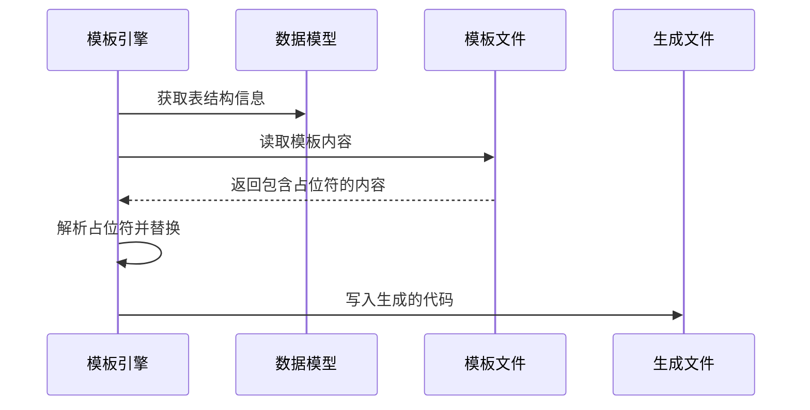
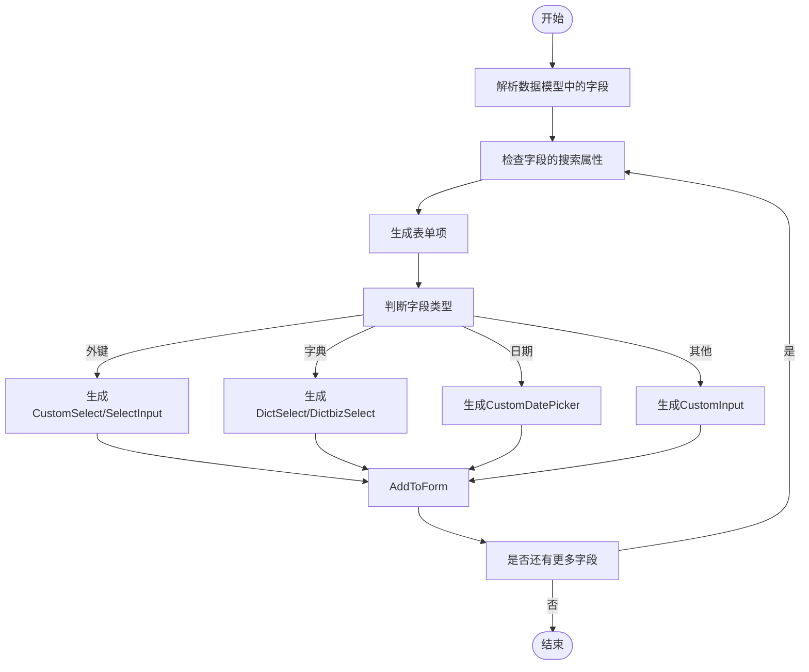
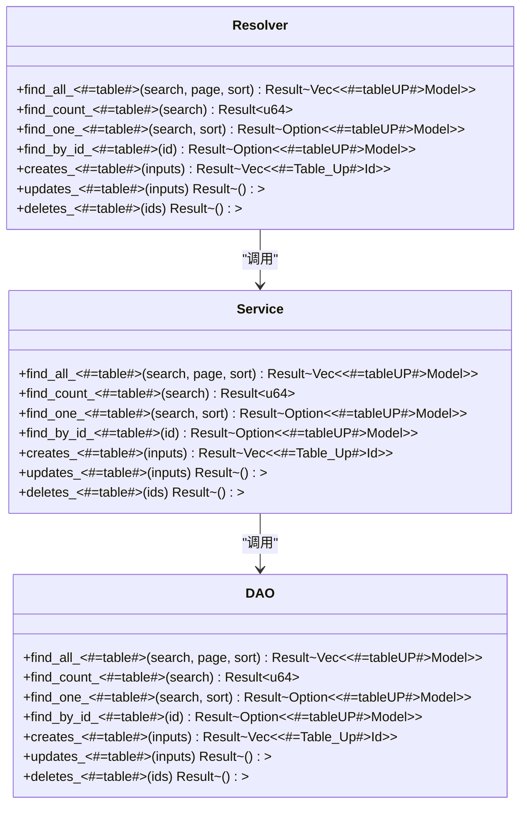
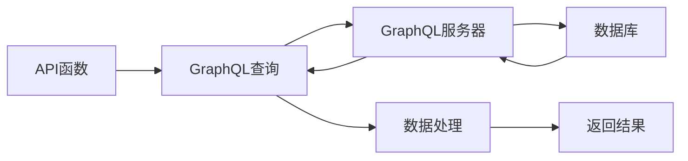

# 模板系统


**本文档引用文件**  
- [codegen.ts](https://github.com/sail-sail/nest/blob/main/codegen/src/lib/codegen.ts)
- [List.vue](https://github.com/sail-sail/nest/blob/main/codegen/src/template/pc/src/views/[[mod_slash_table]]/List.vue)
- [Api.ts](https://github.com/sail-sail/nest/blob/main/codegen/src/template/uni/src/pages/[[table]]/Api.ts)
- [[table]]_resolver.rs](https://github.com/sail-sail/nest/blob/main/codegen/src/template/rust/generated/[[mod]]/[[table]]/[[table]]_resolver.rs)
- [mod.rs](https://github.com/sail-sail/nest/blob/main/codegen/src/template/rust/generated/[[mod]]/mod.rs)


## 目录
1. [简介](#简介)
2. [项目结构](#项目结构)
3. [核心组件](#核心组件)
4. [架构概述](#架构概述)
5. [详细组件分析](#详细组件分析)
6. [依赖分析](#依赖分析)
7. [性能考虑](#性能考虑)
8. [故障排除指南](#故障排除指南)
9. [结论](#结论)

## 简介
本文档详细介绍了模板系统的设计与实现，重点聚焦于 `codegen/src/template` 目录下的三端模板结构。该系统支持为 PC 端（Vue 组件）、Rust 后端模块和 UniApp 移动端页面生成代码。文档深入分析了 `[[mod_slash_table]]`、`[[table]]` 等占位符的解析逻辑及其在代码生成过程中的动态替换流程。通过实际代码示例，展示了模板如何生成具体的 `Api.ts`、`Model.ts` 和 `Resolver` 文件，并说明了模板与数据模型之间的映射关系，以及如何通过模板扩展支持新的技术栈或框架。

## 项目结构
模板系统位于 `codegen/src/template` 目录下，采用模块化设计，分别针对 PC 端、Rust 后端和 UniApp 移动端提供了独立的模板目录。这种结构确保了各端代码生成的独立性和可维护性。

```mermaid
graph TB
Template[模板根目录] --> PC[PC端模板]
Template --> Rust[Rust后端模板]
Template --> Uni[UniApp移动端模板]
PC --> Router[router/gen.ts]
PC --> Views[views/[[mod_slash_table]]]
Rust --> Mod[[[mod]]]
Rust --> Common[common/script]
Rust --> Lib[lib.rs]
Uni --> Pages[pages/[[table]]]
Views --> Api[Api.ts]
Views --> Detail[Detail.vue]
Views --> List[List.vue]
Mod --> Table[[[table]]]
Table --> Dao[[[table]]_dao.rs]
Table --> Model[[[table]]_model.rs]
Table --> Resolver[[[table]]_resolver.rs]
Pages --> Api2[Api.ts]
Pages --> Model2[Model.ts]
```

**Diagram sources**
- [codegen/src/template](https://github.com/sail-sail/nest/blob/main/codegen/src/template)

**Section sources**
- [codegen/src/template](https://github.com/sail-sail/nest/blob/main/codegen/src/template)

## 核心组件
模板系统的核心是 `codegen.ts` 文件中的 `codegen` 函数，它负责遍历模板目录，解析占位符，并根据数据模型生成最终的代码文件。该函数通过递归遍历模板目录，对每个文件进行处理，根据文件类型和内容生成相应的代码。

**Section sources**
- [codegen.ts](https://github.com/sail-sail/nest/blob/main/codegen/src/lib/codegen.ts#L0-L746)

## 架构概述
模板系统采用基于占位符的代码生成模式。模板文件中包含 `[[mod]]`、`[[table]]`、`[[mod_slash_table]]` 等占位符，这些占位符在代码生成过程中被动态替换为实际的模块名、表名等信息。系统通过解析数据模型，获取表结构、字段信息、外键关系等，然后将这些信息注入到模板中，生成最终的代码。



**Diagram sources**
- [codegen.ts](https://github.com/sail-sail/nest/blob/main/codegen/src/lib/codegen.ts#L0-L746)

## 详细组件分析

### PC端Vue组件模板分析
PC端模板位于 `pc/src/views/[[mod_slash_table]]` 目录下，使用 `[[mod_slash_table]]` 占位符来动态生成不同模块和表的视图组件。`List.vue` 模板是一个典型的例子，它根据数据模型中的字段信息，动态生成搜索表单和表格列。



**Diagram sources**
- [List.vue](https://github.com/sail-sail/nest/blob/main/codegen/src/template/pc/src/views/[[mod_slash_table]]/List.vue#L0-L799)

**Section sources**
- [List.vue](https://github.com/sail-sail/nest/blob/main/codegen/src/template/pc/src/views/[[mod_slash_table]]/List.vue#L0-L799)

### Rust后端模块模板分析
Rust后端模板位于 `rust/generated/[[mod]]/[[table]]` 目录下，使用 `[[mod]]` 和 `[[table]]` 占位符来生成模块和表的后端代码。`[[table]]_resolver.rs` 模板定义了 GraphQL 的解析器函数，如 `find_all_<#=table#>`、`find_by_id_<#=table#>` 等。



**Diagram sources**
- [[table]]_resolver.rs](https://github.com/sail-sail/nest/blob/main/codegen/src/template/rust/generated/[[mod]]/[[table]]/[[table]]_resolver.rs#L0-L799)

**Section sources**
- [[table]]_resolver.rs](https://github.com/sail-sail/nest/blob/main/codegen/src/template/rust/generated/[[mod]]/[[table]]/[[table]]_resolver.rs#L0-L799)

### UniApp移动端页面模板分析
UniApp移动端模板位于 `uni/src/pages/[[table]]` 目录下，使用 `[[table]]` 占位符来生成不同表的页面。`Api.ts` 模板定义了与后端 GraphQL 服务交互的 API 函数，如 `findAll<#=Table_Up#>`、`findOne<#=Table_Up#>` 等。



**Diagram sources**
- [Api.ts](https://github.com/sail-sail/nest/blob/main/codegen/src/template/uni/src/pages/[[table]]/Api.ts#L0-L799)

**Section sources**
- [Api.ts](https://github.com/sail-sail/nest/blob/main/codegen/src/template/uni/src/pages/[[table]]/Api.ts#L0-L799)

## 依赖分析
模板系统依赖于 `codegen.ts` 中定义的 `Context` 和 `TablesConfigItem` 等数据模型，这些模型提供了生成代码所需的所有元数据。模板文件之间也存在依赖关系，例如 `List.vue` 依赖于 `Api.ts` 提供的数据接口。

```mermaid
erDiagram
    CONTEXT {
        string conn
        string schema
    }
    
    TABLESCONFIGITEM {
        string mod
        string table
        string table_name
        string table_comment
        array columns
        object opts
    }
    
    COLUMN {
        string COLUMN_NAME
        string DATA_TYPE
        string COLUMN_COMMENT
        boolean require
        boolean readonly
        boolean noList
        boolean noAdd
        boolean noEdit
        boolean noDelete
        boolean isPassword
        boolean isEncrypt
        boolean isImg
        boolean isAtt
        boolean isIcon
        boolean isSwitch
        boolean isMonth
        boolean isProvinceCode
        boolean isProvinceLbl
        boolean isCityCode
        boolean isCityLbl
        boolean isCountyCode
        boolean isCountyLbl
        boolean isAddress
        boolean isDefault
        boolean isLocked
        boolean isEnabled
        boolean isHidden
        boolean isSys
        boolean isDeleted
        boolean isTenant_id
        boolean isOrgId
        boolean isCreateUsrId
        boolean isCreateUsrIdLbl
        boolean isCreateTime
        boolean isUpdateUsrId
        boolean isUpdateUsrIdLbl
        boolean isUpdateTime
        boolean isDeleteUsrId
        boolean isDeleteUsrIdLbl
        boolean isDeleteTime
        boolean isVersion
        boolean showSummary
        boolean noExport
        boolean noImport
        boolean notImportExportList
        boolean isSearchExpand
        boolean searchMultiple
        boolean search
        boolean noSearch
        boolean noSort
        boolean noFilter
        boolean noGroup
        boolean noAggregate
        boolean noPivot
        boolean noChart
        boolean noReport
        boolean noDashboard
        boolean noWorkflow
        boolean noApproval
        boolean noAudit
        boolean noLog
        boolean noBackup
        boolean noRestore
        boolean noMigration
        boolean noUpgrade
        boolean noDowngrade
        boolean noPatch
        boolean noHotfix
        boolean noFeature
        boolean noBugfix
        boolean noRefactor
        boolean noOptimize
        boolean noSecurity
        boolean noCompliance
        boolean noGovernance
        boolean noPolicy
        boolean noStandard
        boolean noRegulation
        boolean noLaw
        boolean noContract
        boolean noAgreement
        boolean noLicense
        boolean noPatent
        boolean noTrademark
        boolean noCopyright
        boolean noIP
        boolean noAsset
        boolean noResource
        boolean noService
        boolean noProduct
        boolean noProject
        boolean noTask
        boolean noIssue
        boolean noTicket
        boolean noIncident
        boolean noProblem
        boolean noChange
        boolean noRelease
        boolean noDeployment
        boolean noEnvironment
        boolean noServer
        boolean noClient
        boolean noNetwork
        boolean noStorage
        boolean noCompute
        boolean noDatabase
        boolean noCache
        boolean noQueue
        boolean noStream
        boolean noEvent
        boolean noMessage
        boolean noNotification
        boolean noAlert
        boolean noMonitor
        boolean noMetric
        boolean noLog
        boolean noTrace
        boolean noProfile
        boolean noDebug
        boolean noTest
        boolean noBuild
        boolean noCI
        boolean noCD
        boolean noDevOps
        boolean noSRE
        boolean noReliability
        boolean noAvailability
        boolean noScalability
        boolean noPerformance
        boolean noLatency
        boolean noThroughput
        boolean noCapacity
        boolean noUtilization
        boolean noEfficiency
        boolean noCost
        boolean noBudget
        boolean noExpense
        boolean noRevenue
        boolean noProfit
        boolean noLoss
        boolean noRisk
        boolean noOpportunity
        boolean noThreat
        boolean noVulnerability
        boolean noExposure
        boolean noBreach
        boolean noIncident
        boolean noAttack
        boolean noExploit
        boolean noMalware
        boolean noPhishing
        boolean noSpoofing
        boolean noTampering
        boolean noRepudiation
        boolean noDisclosure
        boolean noDenial
        boolean noElevation
        boolean noPrivilege
        boolean noAccess
        boolean noAuthentication
        boolean noAuthorization
        boolean noAccounting
        boolean noAuditing
        boolean noLogging
        boolean noMonitoring
        boolean noAlerting
        boolean noReporting
        boolean noAnalytics
        boolean noInsight
        boolean noIntelligence
        boolean noKnowledge
        boolean noWisdom
        boolean noUnderstanding
        boolean noAwareness
        boolean noPerception
        boolean noCognition
        boolean noReasoning
        boolean noJudgment
        boolean noDecision
        boolean noAction
        boolean noResult
        boolean noOutcome
        boolean noImpact
        boolean noEffect
        boolean noConsequence
        boolean noImplication
        boolean noRamification
        boolean noRepercussion
        boolean noAftermath
        boolean noLegacy
        boolean noHistory
        boolean noFuture
        boolean noVision
        boolean noMission
        boolean noGoal
        boolean noObjective
        boolean noStrategy
        boolean noTactic
        boolean noPlan
        boolean noProgram
        boolean noProject
        boolean noInitiative
        boolean noCampaign
        boolean noEffort
        boolean noActivity
        boolean noTask
        boolean noJob
        boolean noWork
        boolean noLabor
        boolean noEffort
        boolean noEnergy
        boolean noTime
        boolean noResource
        boolean noMaterial
        boolean noTool
        boolean noEquipment
        boolean noFacility
        boolean noInfrastructure
        boolean noPlatform
        boolean noSystem
        boolean noApplication
        boolean noService
        boolean noProduct
        boolean noFeature
        boolean noFunction
        boolean noCapability
        boolean noRequirement
        boolean noSpecification
        boolean noDesign
        boolean noArchitecture
        boolean noModel
        boolean noPattern
        boolean noPractice
        boolean noProcess
        boolean noProcedure
        boolean noMethod
        boolean noTechnique
        boolean noApproach
        boolean noFramework
        boolean noStandard
        boolean noProtocol
        boolean noRule
        boolean noPolicy
        boolean noGuideline
        boolean noPrinciple
        boolean noValue
        boolean noEthic
        boolean noMoral
        boolean noLegal
        boolean noRegulatory
        boolean noCompliance
        boolean noGovernance
        boolean noManagement
        boolean noLeadership
        boolean noGovernance
        boolean noOversight
        boolean noSupervision
        boolean noControl
        boolean noDirection
        boolean noCoordination
        boolean noIntegration
        boolean noCollaboration
        boolean noCooperation
        boolean noCommunication
        boolean noInteraction
        boolean noRelationship
        boolean noConnection
        boolean noLink
        boolean noAssociation
        boolean noAffiliation
        boolean noPartnership
        boolean noAlliance
        boolean noNetwork
        boolean noCommunity
        boolean noEcosystem
        boolean noMarket
        boolean noIndustry
        boolean noSector
        boolean noDomain
        boolean noField
        boolean noDiscipline
        boolean noScience
        boolean noEngineering
        boolean noTechnology
        boolean noInnovation
        boolean noResearch
        boolean noDevelopment
        boolean noInvention
        boolean noDiscovery
        boolean noInsight
        boolean noKnowledge
        boolean noWisdom
        boolean noUnderstanding
        boolean noAwareness
        boolean noPerception
        boolean noCognition
        boolean noReasoning
        boolean noJudgment
        boolean noDecision
        boolean noAction
        boolean noResult
        boolean noOutcome
        boolean noImpact
        boolean noEffect
        boolean noConsequence
        boolean noImplication
        boolean noRamification
        boolean noRepercussion
        boolean noAftermath
        boolean noLegacy
        boolean noHistory
        boolean noFuture
        boolean noVision
        boolean noMission
        boolean noGoal
        boolean noObjective
        boolean noStrategy
        boolean noTactic
        boolean noPlan
        boolean noProgram
        boolean noProject
        boolean noInitiative
        boolean noCampaign
        boolean noEffort
        boolean noActivity
        boolean noTask
        boolean noJob
        boolean noWork
        boolean noLabor
        boolean noEffort
        boolean noEnergy
        boolean noTime
        boolean noResource
        boolean noMaterial
        boolean noTool
        boolean noEquipment
        boolean noFacility
        boolean noInfrastructure
        boolean noPlatform
        boolean noSystem
        boolean noApplication
        boolean noService
        boolean noProduct
        boolean noFeature
        boolean noFunction
        boolean noCapability
        boolean noRequirement
        boolean noSpecification
        boolean noDesign
        boolean noArchitecture
        boolean noModel
        boolean noPattern
        boolean noPractice
        boolean noProcess
        boolean noProcedure
        boolean noMethod
        boolean noTechnique
        boolean noApproach
        boolean noFramework
        boolean noStandard
        boolean noProtocol
        boolean noRule
        boolean noPolicy
        boolean noGuideline
        boolean noPrinciple
        boolean noValue
        boolean noEthic
        boolean noMoral
        boolean noLegal
        boolean noRegulatory
        boolean noCompliance
        boolean noGovernance
        boolean noManagement
        boolean noLeadership
        boolean noGovernance
        boolean noOversight
        boolean noSupervision
        boolean noControl
        boolean noDirection
        boolean noCoordination
        boolean noIntegration
        boolean noCollaboration
        boolean noCooperation
        boolean noCommunication
        boolean noInteraction
        boolean noRelationship
        boolean noConnection
        boolean noLink
        boolean noAssociation
        boolean noAffiliation
        boolean noPartnership
        boolean noAlliance
        boolean noNetwork
        boolean noCommunity
        boolean noEcosystem
        boolean noMarket
        boolean noIndustry
        boolean noSector
        boolean noDomain
        boolean noField
        boolean noDiscipline
        boolean noScience
        boolean noEngineering
        boolean noTechnology
        boolean noInnovation
        boolean noResearch
        boolean noDevelopment
        boolean noInvention
        boolean noDiscovery
        boolean noInsight
        boolean noKnowledge
        boolean noWisdom
        boolean noUnderstanding
        boolean noAwareness
        boolean noPerception
        boolean noCognition
        boolean noReasoning
        boolean noJudgment
        boolean noDecision
        boolean noAction
        boolean noResult
        boolean noOutcome
        boolean noImpact
        boolean noEffect
        boolean noConsequence
        boolean noImplication
        boolean noRamification
        boolean noRepercussion
        boolean noAftermath
        boolean noLegacy
        boolean noHistory
        boolean noFuture
        boolean noVision
        boolean noMission
        boolean noGoal
        boolean noObjective
        boolean noStrategy
        boolean noTactic
        boolean noPlan
        boolean noProgram
        boolean noProject
        boolean noInitiative
        boolean noCampaign
        boolean noEffort
        boolean noActivity
        boolean noTask
        boolean noJob
        boolean noWork
        boolean noLabor
        boolean noEffort
        boolean noEnergy
        boolean noTime
        boolean noResource
        boolean noMaterial
        boolean noTool
        boolean noEquipment
        boolean noFacility
        boolean noInfrastructure
        boolean noPlatform
        boolean noSystem
        boolean noApplication
        boolean noService
        boolean noProduct
        boolean noFeature
        boolean noFunction
        boolean noCapability
        boolean noRequirement
        boolean noSpecification
        boolean noDesign
        boolean noArchitecture
        boolean noModel
        boolean noPattern
        boolean noPractice
        boolean noProcess
        boolean noProcedure
        boolean noMethod
        boolean noTechnique
        boolean noApproach
        boolean noFramework
        boolean noStandard
        boolean noProtocol
        boolean noRule
        boolean noPolicy
        boolean noGuideline
        boolean noPrinciple
        boolean noValue
        boolean noEthic
        boolean noMoral
        boolean noLegal
        boolean noRegulatory
        boolean noCompliance
        boolean noGovernance
        boolean noManagement
        boolean noLeadership
        boolean noGovernance
        boolean noOversight
        boolean noSupervision
        boolean noControl
        boolean noDirection
        boolean noCoordination
        boolean noIntegration
        boolean noCollaboration
        boolean noCooperation
        boolean noCommunication
        boolean noInteraction
        boolean noRelationship
        boolean noConnection
        boolean noLink
        boolean noAssociation
        boolean noAffiliation
        boolean noPartnership
        boolean noAlliance
        boolean noNetwork
        boolean noCommunity
        boolean noEcosystem
        boolean noMarket
        boolean noIndustry
        boolean noSector
        boolean noDomain
        boolean noField
        boolean noDiscipline
        boolean noScience
        boolean noEngineering
        boolean noTechnology
        boolean noInnovation
        boolean noResearch
        boolean noDevelopment
        boolean noInvention
        boolean noDiscovery
        boolean noInsight
        boolean noKnowledge
        boolean noWisdom
        boolean noUnderstanding
        boolean noAwareness
        boolean noPerception
        boolean noCognition
        boolean noReasoning
        boolean noJudgment
        boolean noDecision
        boolean noAction
        boolean noResult
        boolean noOutcome
        boolean noImpact
        boolean noEffect
        boolean noConsequence
        boolean noImplication
        boolean noRamification
        boolean noRepercussion
        boolean noAftermath
        boolean noLegacy
        boolean noHistory
        boolean noFuture
        boolean noVision
        boolean noMission
        boolean noGoal
        boolean noObjective
        boolean noStrategy
        boolean noTactic
        boolean noPlan
        boolean noProgram
        boolean noProject
        boolean noInitiative
        boolean noCampaign
        boolean noEffort
        boolean noActivity
        boolean noTask
        boolean noJob
        boolean noWork
        boolean noLabor
        boolean noEffort
        boolean noEnergy
        boolean noTime
        boolean noResource
        boolean noMaterial
        boolean noTool
        boolean noEquipment
        boolean noFacility
        boolean noInfrastructure
        boolean noPlatform
        boolean noSystem
        boolean noApplication
        boolean noService
        boolean noProduct
        boolean noFeature
        boolean noFunction
        boolean noCapability
        boolean noRequirement
        boolean noSpecification
        boolean noDesign
        boolean noArchitecture
        boolean noModel
        boolean noPattern
        boolean noPractice
        boolean noProcess
        boolean noProcedure
        boolean noMethod
        boolean noTechnique
        boolean noApproach
        boolean noFramework
        boolean noStandard
        boolean noProtocol
        boolean noRule
        boolean noPolicy
        boolean noGuideline
        boolean noPrinciple
        boolean noValue
        boolean noEthic
        boolean noMoral
        boolean noLegal
        boolean noRegulatory
        boolean noCompliance
        boolean noGovernance
        boolean noManagement
        boolean noLeadership
        boolean noGovernance
        boolean noOversight
        boolean noSupervision
        boolean noControl
        boolean noDirection
        boolean noCoordination
        boolean noIntegration
        boolean noCollaboration
        boolean noCooperation
        boolean noCommunication
        boolean noInteraction
        boolean noRelationship
        boolean noConnection
        boolean noLink
        boolean noAssociation
        boolean noAffiliation
        boolean noPartnership
        boolean noAlliance
        boolean noNetwork
        boolean noCommunity
        boolean noEcosystem
        boolean noMarket
        boolean noIndustry
        boolean noSector
        boolean noDomain
        boolean noField
        boolean noDiscipline
        boolean noScience
        boolean noEngineering
        boolean noTechnology
        boolean noInnovation
        boolean noResearch
        boolean noDevelopment
        boolean noInvention
        boolean noDiscovery
        boolean noInsight
        boolean noKnowledge
        boolean noWisdom
        boolean noUnderstanding
        boolean noAwareness
        boolean noPerception
        boolean noCognition
        boolean noReasoning
        boolean noJudgment
        boolean noDecision
        boolean noAction
        boolean noResult
        boolean noOutcome
        boolean noImpact
        boolean noEffect
        boolean noConsequence
        boolean noImplication
        boolean noRamification
        boolean noRepercussion
        boolean noAftermath
        boolean noLegacy
        boolean noHistory
        boolean noFuture
        boolean noVision
        boolean noMission
        boolean noGoal
        boolean noObjective
        boolean noStrategy
        boolean noTactic
        boolean noPlan
        boolean noProgram
        boolean noProject
        boolean noInitiative
        boolean noCampaign
        boolean noEffort
        boolean noActivity
        boolean noTask
        boolean noJob
        boolean noWork
        boolean noLabor
        boolean noEffort
        boolean noEnergy
        boolean noTime
        boolean noResource
        boolean noMaterial
        boolean noTool
        boolean noEquipment
        boolean noFacility
        boolean noInfrastructure
        boolean noPlatform
        boolean noSystem
        boolean noApplication
        boolean noService
        boolean noProduct
        boolean noFeature
        boolean noFunction
        boolean noCapability
        boolean noRequirement
        boolean noSpecification
        boolean noDesign
        boolean noArchitecture
        boolean noModel
        boolean noPattern
        boolean noPractice
        boolean noProcess
        boolean noProcedure
        boolean noMethod
        boolean noTechnique
        boolean noApproach
        boolean noFramework
        boolean noStandard
        boolean noProtocol
        boolean noRule
        boolean noPolicy
        boolean noGuideline
        boolean noPrinciple
        boolean noValue
        boolean noEthic
        boolean noMoral
        boolean noLegal
        boolean noRegulatory
        boolean noCompliance
        boolean noGovernance
        boolean noManagement
        boolean noLeadership
        boolean noGovernance
        boolean noOversight
        boolean noSupervision
        boolean noControl
        boolean noDirection
        boolean noCoordination
        boolean noIntegration
        boolean noCollaboration
        boolean noCooperation
        boolean noCommunication
        boolean noInteraction
        boolean noRelationship
        boolean noConnection
        boolean noLink
        boolean noAssociation
        boolean noAffiliation
        boolean noPartnership
        boolean noAlliance
        boolean noNetwork
        boolean noCommunity
        boolean noEcosystem
        boolean noMarket
        boolean noIndustry
        boolean noSector
        boolean noDomain
        boolean noField
        boolean noDiscipline
        boolean noScience
        boolean noEngineering
        boolean noTechnology
        boolean noInnovation
        boolean noResearch
        boolean noDevelopment
        boolean noInvention
        boolean noDiscovery
        boolean noInsight
        boolean noKnowledge
        boolean noWisdom
        boolean noUnderstanding
        boolean noAwareness
        boolean noPerception
        boolean noCognition
        boolean noReasoning
        boolean noJudgment
        boolean noDecision
        boolean noAction
        boolean noResult
        boolean noOutcome
        boolean noImpact
        boolean noEffect
        boolean noConsequence
        boolean noImplication
        boolean noRamification
        boolean noRepercussion
        boolean noAftermath
        boolean noLegacy
        boolean noHistory
        boolean noFuture
        boolean noVision
        boolean noMission
        boolean noGoal
        boolean noObjective
        boolean noStrategy
        boolean noTactic
        boolean noPlan
        boolean noProgram
        boolean noProject
        boolean noInitiative
        boolean noCampaign
        boolean noEffort
        boolean noActivity
        boolean noTask
        boolean noJob
        boolean noWork
        boolean noLabor
        boolean noEffort
        boolean noEnergy
        boolean noTime
        boolean noResource
        boolean noMaterial
        boolean noTool
        boolean noEquipment
        boolean noFacility
        boolean noInfrastructure
        boolean noPlatform
        boolean noSystem
        boolean noApplication
        boolean noService
        boolean noProduct
        boolean noFeature
        boolean noFunction
        boolean noCapability
        boolean noRequirement
        boolean noSpecification
        boolean noDesign
        boolean noArchitecture
        boolean noModel
        boolean noPattern
        boolean noPractice
        boolean noProcess
        boolean noProcedure
        boolean noMethod
        boolean noTechnique
        boolean noApproach
        boolean noFramework
        boolean noStandard
        boolean noProtocol
        boolean noRule
        boolean noPolicy
        boolean noGuideline
        boolean noPrinciple
        boolean noValue
        boolean noEthic
        boolean noMoral
        boolean noLegal
        boolean noRegulatory
        boolean noCompliance
        boolean noGovernance
        boolean noManagement
        boolean noLeadership
        boolean noGovernance
        boolean noOversight
        boolean noSupervision
        boolean noControl
        boolean noDirection
        boolean noCoordination
        boolean noIntegration
        boolean noCollaboration
        boolean noCooperation
        boolean noCommunication
        boolean noInteraction
        boolean noRelationship
        boolean noConnection
        boolean noLink
        boolean noAssociation
        boolean noAffiliation
        boolean noPartnership
        boolean noAlliance
        boolean noNetwork
        boolean noCommunity
        boolean noEcosystem
        boolean noMarket
        boolean noIndustry
        boolean noSector
        boolean noDomain
        boolean noField
        boolean noDiscipline
        boolean noScience
        boolean noEngineering
        boolean noTechnology
        boolean noInnovation
        boolean noResearch
        boolean noDevelopment
        boolean noInvention
        boolean noDiscovery
        boolean noInsight
        boolean noKnowledge
        boolean noWisdom
        boolean noUnderstanding
        boolean noAwareness
        boolean noPerception
        boolean noCognition
        boolean noReasoning
        boolean noJudgment
        boolean noDecision
        boolean noAction
        boolean noResult
        boolean noOutcome
        boolean noImpact
        boolean noEffect
        boolean noConsequence
        boolean noImplication
        boolean noRamification
        boolean noRepercussion
        boolean noAftermath
        boolean noLegacy
        boolean noHistory
        boolean noFuture
        boolean noVision
        boolean noMission
        boolean noGoal
        boolean noObjective
        boolean noStrategy
        boolean noTactic
        boolean noPlan
        boolean noProgram
        boolean noProject
        boolean noInitiative
        boolean noCampaign
        boolean noEffort
        boolean noActivity
        boolean noTask
        boolean noJob
        boolean noWork
        boolean noLabor
        boolean noEffort
        boolean noEnergy
        boolean noTime
        boolean noResource
        boolean noMaterial
        boolean noTool
        boolean noEquipment
        boolean noFacility
        boolean noInfrastructure
        boolean noPlatform
        boolean noSystem
        boolean noApplication
        boolean noService
        boolean noProduct
        boolean noFeature
        boolean noFunction
        boolean noCapability
        boolean noRequirement
        boolean noSpecification
        boolean noDesign
        boolean noArchitecture
        boolean noModel
        boolean noPattern
        boolean noPractice
        boolean noProcess
        boolean noProcedure
        boolean noMethod
        boolean noTechnique
        boolean noApproach
        boolean noFramework
        boolean noStandard
        boolean noProtocol
        boolean noRule
        boolean noPolicy
        boolean noGuideline
        boolean noPrinciple
        boolean noValue
        boolean noEthic
        boolean noMoral
        boolean noLegal
        boolean noRegulatory
        boolean noCompliance
        boolean noGovernance
        boolean noManagement
        boolean noLeadership
        boolean noGovernance
        boolean noOversight
        boolean noSupervision
        boolean noControl
        boolean noDirection
        boolean noCoordination
        boolean noIntegration
        boolean noCollaboration
        boolean noCooperation
        boolean noCommunication
        boolean noInteraction
        boolean noRelationship
        boolean noConnection
        boolean noLink
        boolean noAssociation
        boolean noAffiliation
        boolean noPartnership
        boolean noAlliance
        boolean noNetwork
        boolean noCommunity
        boolean noEcosystem
        boolean noMarket
        boolean noIndustry
        boolean noSector
        boolean noDomain
        boolean noField
        boolean noDiscipline
        boolean noScience
        boolean noEngineering
        boolean noTechnology
        boolean noInnovation
        boolean noResearch
        boolean noDevelopment
        boolean noInvention
        boolean noDiscovery
        boolean noInsight
        boolean noKnowledge
        boolean noWisdom
        boolean noUnderstanding
        boolean noAwareness
        boolean noPerception
        boolean noCognition
        boolean noReasoning
        boolean noJudgment
        boolean noDecision
        boolean noAction
        boolean noResult
        boolean noOutcome
        boolean noImpact
        boolean noEffect
        boolean noConsequence
        boolean noImplication
        boolean noRamification
        boolean noRepercussion
        boolean noAftermath
        boolean noLegacy
        boolean noHistory
        boolean noFuture
        boolean noVision
        boolean noMission
        boolean noGoal
        boolean noObjective
        boolean noStrategy
        boolean noTactic
        boolean noPlan
        boolean noProgram
        boolean noProject
        boolean noInitiative
        boolean noCampaign
        boolean noEffort
        boolean noActivity
        boolean noTask
        boolean noJob
        boolean noWork
        boolean noLabor
        boolean noEffort
        boolean noEnergy
        boolean noTime
        boolean noResource
        boolean noMaterial
        boolean noTool
        boolean noEquipment
        boolean noFacility
        boolean noInfrastructure
        boolean noPlatform
        boolean noSystem
        boolean noApplication
        boolean noService
        boolean noProduct
        boolean noFeature
        boolean noFunction
        boolean noCapability
        boolean noRequirement
        boolean noSpecification
        boolean noDesign
        boolean noArchitecture
        boolean noModel
        boolean noPattern
        boolean noPractice
        boolean noProcess
        boolean noProcedure
        boolean noMethod
        boolean noTechnique
        boolean noApproach
        boolean noFramework
        boolean noStandard
        boolean noProtocol
        boolean noRule
        boolean noPolicy
        boolean noGuideline
        boolean noPrinciple
        boolean noValue
        boolean noEthic
        boolean noMoral
        boolean noLegal
        boolean noRegulatory
        boolean noCompliance
        boolean noGovernance
        boolean noManagement
        boolean noLeadership
        boolean noGovernance
        boolean noOversight
        boolean noSupervision
        boolean noControl
        boolean noDirection
        boolean noCoordination
        boolean noIntegration
        boolean noCollaboration
        boolean noCooperation
        boolean noCommunication
        boolean noInteraction
        boolean noRelationship
        boolean noConnection
        boolean noLink
        boolean noAssociation
        boolean noAffiliation
        boolean noPartnership
        boolean noAlliance
        boolean noNetwork
        boolean noCommunity
        boolean noEcosystem
        boolean noMarket
        boolean noIndustry
        boolean noSector
        boolean noDomain
        boolean noField
        boolean noDiscipline
        boolean noScience
        boolean noEngineering
        boolean noTechnology
        boolean noInnovation
        boolean noResearch
        boolean noDevelopment
        boolean noInvention
        boolean noDiscovery
        boolean noInsight
        boolean noKnowledge
        boolean noWisdom
        boolean noUnderstanding
        boolean noAwareness
        boolean noPerception
        boolean noCognition
        boolean noReasoning
        boolean noJudgment
        boolean noDecision
        boolean noAction
        boolean noResult
        boolean noOutcome
        boolean noImpact
        boolean noEffect
        boolean noConsequence
        boolean noImplication
        boolean noRamification
        boolean noRepercussion
        boolean noAftermath
        boolean noLegacy
        boolean noHistory
        boolean noFuture
        boolean noVision
        boolean noMission
        boolean noGoal
        boolean noObjective
        boolean noStrategy
        boolean noTactic
        boolean noPlan
        boolean noProgram
        boolean noProject
        boolean noInitiative
        boolean noCampaign
        boolean noEffort
        boolean noActivity
        boolean noTask
        boolean noJob
        boolean noWork
        boolean noLabor
        boolean noEffort
        boolean noEnergy
        boolean noTime
        boolean noResource
        boolean noMaterial
        boolean noTool
        boolean noEquipment
        boolean noFacility
        boolean noInfrastructure
        boolean noPlatform
        boolean noSystem
        boolean noApplication
        boolean noService
        boolean noProduct
        boolean noFeature
        boolean noFunction
        boolean noCapability
        boolean noRequirement
        boolean noSpecification
        boolean noDesign
        boolean noArchitecture
        boolean noModel
        boolean noPattern
        boolean noPractice
        boolean noProcess
        boolean noProcedure
        boolean noMethod
        boolean noTechnique
        boolean noApproach
        boolean noFramework
        boolean noStandard
        boolean noProtocol
        boolean noRule
        boolean noPolicy
        boolean noGuideline
        boolean noPrinciple
        boolean noValue
        boolean noEthic
        boolean noMoral
        boolean noLegal
        boolean noRegulatory
        boolean noCompliance
        boolean noGovernance
        boolean noManagement
        boolean noLeadership
        boolean noGovernance
        boolean noOversight
        boolean noSupervision
        boolean noControl
        boolean noDirection
        boolean noCoordination
        boolean noIntegration
        boolean noCollaboration
        boolean noCooperation
        boolean noCommunication
        boolean noInteraction
        boolean noRelationship
        boolean noConnection
        boolean noLink
        boolean noAssociation
        boolean noAffiliation
        boolean noPartnership
        boolean noAlliance
        boolean noNetwork
        boolean noCommunity
        boolean noEcosystem
        boolean noMarket
        boolean noIndustry
        boolean noSector
        boolean noDomain
        boolean noField
        boolean noDiscipline
        boolean noScience
        boolean noEngineering
        boolean noTechnology
        boolean noInnovation
        boolean noResearch
        boolean noDevelopment
        boolean noInvention
        boolean noDiscovery
        boolean noInsight
        boolean noKnowledge
        boolean noWisdom
        boolean noUnderstanding
        boolean noAwareness
        boolean noPerception
        boolean noCognition
        boolean noReasoning
        boolean noJudgment
        boolean noDecision
        boolean noAction
        boolean noResult
        boolean noOutcome
        boolean noImpact
        boolean noEffect
        boolean noConsequence
        boolean noImplication
        boolean noRamification
        boolean noRepercussion
        boolean noAftermath
        boolean noLegacy
        boolean noHistory
        boolean noFuture
        boolean noVision
        boolean noMission
        boolean noGoal
        boolean noObjective
        boolean noStrategy
        boolean noTactic
        boolean noPlan
        boolean noProgram
        boolean noProject
        boolean noInitiative
        boolean noCampaign
        boolean noEffort
        boolean noActivity
        boolean noTask
        boolean noJob
        boolean noWork
        boolean noLabor
        boolean noEffort
        boolean noEnergy
        boolean noTime
        boolean noResource
        boolean noMaterial
        boolean noTool
        boolean noEquipment
        boolean noFacility
        boolean noInfrastructure
        boolean noPlatform
        boolean noSystem
        boolean noApplication
        boolean noService
        boolean noProduct
        boolean noFeature
        boolean noFunction
        boolean noCapability
        boolean noRequirement
        boolean noSpecification
        boolean noDesign
        boolean noArchitecture
        boolean noModel
        boolean noPattern
        boolean noPractice
        boolean noProcess
        boolean noProcedure
        boolean noMethod
        boolean noTechnique
        boolean noApproach
        boolean noFramework
        boolean noStandard
        boolean noProtocol
        boolean noRule
        boolean noPolicy
        boolean noGuideline
        boolean noPrinciple
        boolean noValue
        boolean noEthic
        boolean noMoral
        boolean noLegal
        boolean noRegulatory
        boolean noCompliance
        boolean noGovernance
        boolean noManagement
        boolean noLeadership
        boolean noGovernance
        boolean noOversight
        boolean noSupervision
        boolean noControl
        boolean noDirection
        boolean noCoordination
        boolean noIntegration
        boolean noCollaboration
        boolean noCooperation
        boolean noCommunication
        boolean noInteraction
        boolean noRelationship
        boolean noConnection
        boolean noLink
        boolean noAssociation
        boolean noAffiliation
        boolean noPartnership
        boolean noAlliance
        boolean noNetwork
        boolean noCommunity
        boolean noEcosystem
        boolean noMarket
        boolean noIndustry
        boolean noSector
        boolean noDomain
        boolean noField
        boolean noDiscipline
        boolean noScience
        boolean noEngineering
        boolean noTechnology
        boolean noInnovation
        boolean noResearch
        boolean noDevelopment
        boolean noInvention
        boolean noDiscovery
        boolean noInsight
        boolean noKnowledge
        boolean noWisdom
        boolean noUnderstanding
        boolean noAwareness
        boolean noPerception
        boolean noCognition
        boolean noReasoning
        boolean noJudgment
        boolean noDecision
        boolean noAction
        boolean noResult
        boolean noOutcome
        boolean noImpact
        boolean noEffect
        boolean noConsequence
        boolean noImplication
        boolean noRamification
        boolean noRepercussion
        boolean noAftermath
        boolean noLegacy
        boolean noHistory
        boolean noFuture
        boolean noVision
        boolean noMission
        boolean noGoal
        boolean noObjective
        boolean noStrategy
        boolean noTactic
        boolean noPlan
        boolean noProgram
        boolean noProject
        boolean noInitiative
        boolean noCampaign
        boolean noEffort
        boolean noActivity
        boolean noTask
        boolean noJob
        boolean noWork
        boolean noLabor
        boolean noEffort
        boolean noEnergy
        boolean noTime
        boolean noResource
        boolean noMaterial
        boolean noTool
        boolean noEquipment
        boolean noFacility
        boolean noInfrastructure
        boolean noPlatform
        boolean noSystem
        boolean noApplication
        boolean noService
        boolean noProduct
        boolean noFeature
        boolean noFunction
        boolean noCapability
        boolean noRequirement
        boolean noSpecification
        boolean noDesign
        boolean noArchitecture
        boolean noModel
        boolean noPattern
        boolean noPractice
        boolean noProcess
        boolean noProcedure
        boolean noMethod
        boolean noTechnique
        boolean noApproach
        boolean noFramework
        boolean noStandard
        boolean noProtocol
        boolean noRule
        boolean noPolicy
        boolean noGuideline
        boolean noPrinciple
        boolean noValue
        boolean noEthic
        boolean noMoral
        boolean noLegal
        boolean noRegulatory
        boolean noCompliance
        boolean noGovernance
        boolean noManagement
        boolean noLeadership
        boolean noGovernance
        boolean noOversight
        boolean noSupervision
        boolean noControl
        boolean noDirection
        boolean noCoordination
        boolean noIntegration
        boolean noCollaboration
        boolean noCooperation
        boolean noCommunication
        boolean noInteraction
        boolean noRelationship
        boolean noConnection
        boolean noLink
        boolean noAssociation
        boolean noAffiliation
        boolean noPartnership
        boolean noAlliance
        boolean noNetwork
        boolean noCommunity
        boolean noEcosystem
        boolean noMarket
        boolean noIndustry
        boolean noSector
        boolean noDomain
        boolean noField
        boolean noDiscipline
        boolean noScience
        boolean noEngineering
        boolean noTechnology
        boolean noInnovation
        boolean noResearch
        boolean noDevelopment
        boolean noInvention
        boolean noDiscovery
        boolean noInsight
        boolean noKnowledge
        boolean noWisdom
        boolean noUnderstanding
        boolean noAwareness
        boolean noPerception
        boolean noCognition
        boolean noReasoning
        boolean noJudgment
        boolean noDecision
        boolean noAction
        boolean noResult
        boolean noOutcome
        boolean noImpact
        boolean noEffect
        boolean noConsequence
        boolean noImplication
        boolean noRamification
        boolean noRepercussion
        boolean noAftermath
        boolean noLegacy
        boolean noHistory
        boolean noFuture
        boolean noVision
        boolean noMission
        boolean noGoal
        boolean noObjective
        boolean noStrategy
        boolean noTactic
        boolean noPlan
        boolean noProgram
        boolean noProject
        boolean noInitiative
        boolean noCampaign
        boolean noEffort
        boolean noActivity
        boolean noTask
        boolean noJob
        boolean noWork
        boolean noLabor
        boolean noEffort
        boolean noEnergy
        boolean noTime
        boolean noResource
        boolean noMaterial
        boolean noTool
        boolean noEquipment
        boolean noFacility
        boolean noInfrastructure
        boolean noPlatform
        boolean noSystem
        boolean noApplication
        boolean noService
        boolean noProduct
        boolean noFeature
        boolean noFunction
        boolean noCapability
        boolean noRequirement
        boolean noSpecification
        boolean noDesign
        boolean noArchitecture
        boolean noModel
        boolean noPattern
        boolean noPractice
        boolean noProcess
        boolean noProcedure
        boolean noMethod
        boolean noTechnique
        boolean noApproach
        boolean noFramework
        boolean noStandard
        boolean noProtocol
        boolean noRule
        boolean noPolicy
        boolean noGuideline
        boolean noPrinciple
        boolean noValue
        boolean noEthic
        boolean noMoral
        boolean noLegal
        boolean noRegulatory
        boolean noCompliance
        boolean noGovernance
        boolean noManagement
        boolean noLeadership
        boolean noGovernance
        boolean noOversight
        boolean noSupervision
        boolean noControl
        boolean noDirection
        boolean noCoordination
        boolean noIntegration
        boolean noCollaboration
        boolean noCooperation
        boolean noCommunication
        boolean noInteraction
        boolean noRelationship
        boolean noConnection
        boolean noLink
        boolean noAssociation
        boolean noAffiliation
        boolean noPartnership
        boolean noAlliance
        boolean noNetwork
        boolean noCommunity
        boolean noEcosystem
        boolean noMarket
        boolean noIndustry
        boolean noSector
        boolean noDomain
        boolean noField
        boolean noDiscipline
        boolean noScience
        boolean noEngineering
        boolean noTechnology
        boolean noInnovation
        boolean noResearch
        boolean noDevelopment
        boolean noInvention
        boolean noDiscovery
        boolean noInsight
        boolean noKnowledge
        boolean noWisdom
        boolean noUnderstanding
        boolean noAwareness
        boolean noPerception
        boolean noCognition
        boolean noReasoning
        boolean noJudgment
        boolean noDecision
        boolean noAction
        boolean noResult
        boolean noOutcome
        boolean noImpact
        boolean noEffect
        boolean noConsequence
        boolean noImplication
        boolean noRamification
        boolean noRepercussion
        boolean noAftermath
        boolean noLegacy
        boolean noHistory
        boolean noFuture
        boolean noVision
        boolean noMission
        boolean noGoal
        boolean noObjective
        boolean noStrategy
        boolean noTactic
        boolean noPlan
        boolean noProgram
        boolean noProject
        boolean noInitiative
        boolean noCampaign
        boolean noEffort
        boolean noActivity
        boolean noTask
        boolean noJob
        boolean noWork
        boolean noLabor
        boolean noEffort
        boolean noEnergy
        boolean noTime
        boolean noResource
        boolean noMaterial
        boolean noTool
        boolean noEquipment
        boolean noFacility
        boolean noInfrastructure
        boolean noPlatform
        boolean noSystem
        boolean noApplication
        boolean noService
        boolean noProduct
        boolean noFeature
        boolean noFunction
        boolean noCapability
        boolean noRequirement
        boolean noSpecification
        boolean noDesign
        boolean noArchitecture
        boolean noModel
        boolean noPattern
        boolean noPractice
        boolean noProcess
        boolean noProcedure
        boolean noMethod
        boolean noTechnique
        boolean noApproach
        boolean noFramework
        boolean noStandard
        boolean noProtocol
        boolean noRule
        boolean noPolicy
        boolean noGuideline
        boolean noPrinciple
        boolean noValue
        boolean noEthic
        boolean noMoral
        boolean noLegal
        boolean noRegulatory
        boolean noCompliance
        boolean noGovernance
        boolean noManagement
        boolean noLeadership
        boolean noGovernance
        boolean noOversight
        boolean noSupervision
        boolean noControl
        boolean noDirection
        boolean noCoordination
        boolean noIntegration
        boolean noCollaboration
        boolean noCooperation
        boolean noCommunication
        boolean noInteraction
        boolean noRelationship
        boolean noConnection
        boolean noLink
        boolean noAssociation
        boolean noAffiliation
        boolean noPartnership
        boolean noAlliance
        boolean noNetwork
        boolean noCommunity
        boolean noEcosystem
        boolean noMarket
        boolean noIndustry
        boolean noSector
        boolean noDomain
        boolean noField
        boolean noDiscipline
        boolean noScience
        boolean noEngineering
        boolean noTechnology
        boolean noInnovation
        boolean noResearch
        boolean noDevelopment
        boolean noInvention
        boolean noDiscovery
        boolean noInsight
        boolean noKnowledge
        boolean noWisdom
        boolean noUnderstanding
        boolean noAwareness
        boolean noPerception
        boolean noCognition
        boolean noReasoning
        boolean noJudgment
        boolean noDecision
        boolean noAction
        boolean noResult
        boolean noOutcome
        boolean noImpact
        boolean noEffect
        boolean noConsequence
        boolean noImplication
        boolean noRamification
        boolean noRepercussion
        boolean noAftermath
        boolean noLegacy
        boolean noHistory
        boolean noFuture
        boolean noVision
        boolean noMission
        boolean noGoal
        boolean noObjective
        boolean noStrategy
        boolean noTactic
        boolean noPlan
        boolean noProgram
        boolean noProject
        boolean noInitiative
        boolean noCampaign
        boolean noEffort
        boolean noActivity
        boolean noTask
        boolean noJob
        boolean noWork
        boolean noLabor
        boolean noEffort
        boolean noEnergy
        boolean noTime
        boolean noResource
        boolean noMaterial
        boolean noTool
        boolean noEquipment
        boolean noFacility
        boolean noInfrastructure
        boolean noPlatform
        boolean noSystem
        boolean noApplication
        boolean noService
        boolean noProduct
        boolean noFeature
        boolean noFunction
        boolean noCapability
        boolean noRequirement
        boolean noSpecification
        boolean noDesign
        boolean noArchitecture
        boolean noModel
        boolean noPattern
        boolean noPractice
        boolean noProcess
        boolean noProcedure
        boolean noMethod
        boolean noTechnique
        boolean noApproach
        boolean noFramework
        boolean noStandard
        boolean noProtocol
        boolean noRule
        boolean noPolicy
        boolean noGuideline
        boolean noPrinciple
        boolean noValue
        boolean noEthic
        boolean noMoral
        boolean noLegal
        boolean noRegulatory
        boolean noCompliance
        boolean noGovernance
        boolean noManagement
        boolean noLeadership
        boolean noGovernance
        boolean noOversight
        boolean noSupervision
        boolean noControl
        boolean noDirection
        boolean noCoordination
        boolean noIntegration
        boolean noCollaboration
        boolean noCooperation
        boolean noCommunication
        boolean noInteraction
        boolean noRelationship
        boolean noConnection
        boolean noLink
        boolean noAssociation
        boolean noAffiliation
        boolean noPartnership
        boolean noAlliance
        boolean noNetwork
        boolean noCommunity
        boolean noEcosystem
        boolean noMarket
        boolean noIndustry
        boolean noSector
        boolean noDomain
        boolean noField
        boolean noDiscipline
        boolean noScience
        boolean noEngineering
        boolean noTechnology
        boolean noInnovation
        boolean noResearch
        boolean noDevelopment
        boolean noInvention
        boolean noDiscovery
        boolean noInsight
        boolean noKnowledge
        boolean noWisdom
        boolean noUnderstanding
        boolean noAwareness
        boolean noPerception
        boolean noCognition
        boolean noReasoning
        boolean noJudgment
        boolean noDecision
        boolean noAction
        boolean noResult
        boolean noOutcome
        boolean noImpact
        boolean noEffect
        boolean noConsequence
        boolean noImplication
        boolean noRamification
        boolean noRepercussion
        boolean noAftermath
        boolean noLegacy
        boolean noHistory
        boolean noFuture
        boolean noVision
        boolean noMission
        boolean noGoal
        boolean noObjective
        boolean noStrategy
        boolean noTactic
        boolean noPlan
        boolean noProgram
        boolean noProject
        boolean noInitiative
        boolean noCampaign
        boolean noEffort
        boolean noActivity
        boolean noTask
        boolean noJob
        boolean noWork
        boolean noLabor
        boolean noEffort
        boolean noEnergy
        boolean noTime
        boolean noResource
        boolean noMaterial
        boolean noTool
        boolean noEquipment
        boolean noFacility
        boolean noInfrastructure
        boolean noPlatform
        boolean noSystem
        boolean noApplication
        boolean noService
        boolean noProduct
        boolean noFeature
        boolean noFunction
        boolean noCapability
        boolean noRequirement
        boolean noSpecification
        boolean noDesign
        boolean noArchitecture
        boolean noModel
        boolean noPattern
        boolean noPractice
        boolean noProcess
        boolean noProcedure
        boolean noMethod
        boolean noTechnique
        boolean noApproach
        boolean noFramework
        boolean noStandard
        boolean noProtocol
        boolean noRule
        boolean noPolicy
        boolean noGuideline
        boolean noPrinciple
        boolean noValue
        boolean noEthic
        boolean noMoral
        boolean noLegal
        boolean noRegulatory
        boolean noCompliance
        boolean noGovernance
        boolean noManagement
        boolean noLeadership
        boolean noGovernance
        boolean noOversight
        boolean noSupervision
        boolean noControl
        boolean noDirection
        boolean noCoordination
        boolean noIntegration
        boolean noCollaboration
        boolean noCooperation
        boolean noCommunication
        boolean noInteraction
        boolean noRelationship
        boolean noConnection
        boolean noLink
        boolean noAssociation
        boolean noAffiliation
        boolean noPartnership
        boolean noAlliance
        boolean noNetwork
        boolean noCommunity
        boolean noEcosystem
        boolean noMarket
        boolean noIndustry
        boolean noSector
        boolean noDomain
        boolean noField
        boolean noDiscipline
        boolean noScience
        boolean noEngineering
        boolean noTechnology
        boolean noInnovation
        boolean noResearch
        boolean noDevelopment
        boolean noInvention
        boolean noDiscovery
        boolean noInsight
        boolean noKnowledge
        boolean noWisdom
        boolean noUnderstanding
        boolean noAwareness
        boolean noPerception
        boolean noCognition
        boolean noReasoning
        boolean noJudgment
        boolean noDecision
        boolean noAction
        boolean noResult
        boolean noOutcome
        boolean noImpact
        boolean noEffect
        boolean noConsequence
        boolean noImplication
        boolean noRamification
        boolean noRepercussion
        boolean noAftermath
        boolean noLegacy
        boolean noHistory
        boolean noFuture
        boolean noVision
        boolean noMission
        boolean noGoal
        boolean noObjective
        boolean noStrategy
        boolean noTactic
        boolean noPlan
        boolean noProgram
        boolean noProject
        boolean noInitiative
        boolean noCampaign
        boolean noEffort
        boolean noActivity
        boolean noTask
        boolean noJob
        boolean noWork
        boolean noLabor
        boolean noEffort
        boolean noEnergy
        boolean noTime
        boolean noResource
        boolean noMaterial
        boolean noTool
        boolean noEquipment
        boolean noFacility
        boolean noInfrastructure
        boolean noPlatform
        boolean noSystem
        boolean noApplication
        boolean noService
        boolean noProduct
        boolean noFeature
        boolean noFunction
        boolean noCapability
        boolean noRequirement
        boolean noSpecification
        boolean noDesign
        boolean noArchitecture
        boolean noModel
        boolean noPattern
        boolean noPractice
        boolean noProcess
        boolean noProcedure
        boolean noMethod
        boolean noTechnique
        boolean noApproach
        boolean noFramework
        boolean noStandard
        boolean noProtocol
        boolean noRule
        boolean noPolicy
        boolean noGuideline
        boolean noPrinciple
        boolean noValue
        boolean noEthic
        boolean noMoral
        boolean noLegal
        boolean noRegulatory
        boolean noCompliance
        boolean noGovernance
        boolean noManagement
        boolean noLeadership
        boolean noGovernance
        boolean noOversight
        boolean noSupervision
        boolean noControl
        boolean noDirection
        boolean noCoordination
        boolean noIntegration
        boolean noCollaboration
        boolean noCooperation
        boolean noCommunication
        boolean noInteraction
        boolean noRelationship
        boolean noConnection
        boolean noLink
        boolean noAssociation
        boolean noAffiliation
        boolean noPartnership
        boolean noAlliance
        boolean noNetwork
        boolean noCommunity
        boolean noEcosystem
        boolean noMarket
        boolean noIndustry
        boolean noSector
        boolean noDomain
        boolean noField
        boolean noDiscipline
        boolean noScience
        boolean noEngineering
        boolean noTechnology
        boolean noInnovation
        boolean noResearch
        boolean noDevelopment
        boolean noInvention
        boolean noDiscovery
        boolean noInsight
        boolean noKnowledge
        boolean noWisdom
        boolean noUnderstanding
        boolean noAwareness
        boolean noPerception
        boolean noCognition
        boolean noReasoning
        boolean noJudgment
        boolean noDecision
        boolean noAction
        boolean noResult
        boolean noOutcome
        boolean noImpact
        boolean noEffect
        boolean noConsequence
        boolean noImplication
        boolean noRamification
        boolean noRepercussion
        boolean noAftermath
        boolean noLegacy
        boolean noHistory
        boolean noFuture
        boolean noVision
        boolean noMission
        boolean noGoal
        boolean noObjective
        boolean noStrategy
        boolean noTactic
        boolean noPlan
        boolean noProgram
        boolean noProject
        boolean noInitiative
        boolean noCampaign
        boolean noEffort
        boolean noActivity
        boolean noTask
        boolean noJob
        boolean noWork
        boolean noLabor
        boolean noEffort
        boolean noEnergy
        boolean noTime
        boolean noResource
        boolean noMaterial
        boolean noTool
        boolean noEquipment
        boolean noFacility
        boolean noInfrastructure
        boolean noPlatform
        boolean noSystem
        boolean noApplication
        boolean noService
        boolean noProduct
        boolean noFeature
        boolean noFunction
        boolean noCapability
        boolean noRequirement
        boolean noSpecification
        boolean noDesign
        boolean noArchitecture
        boolean noModel
        boolean noPattern
        boolean noPractice
        boolean noProcess
        boolean noProcedure
        boolean noMethod
        boolean noTechnique
        boolean noApproach
        boolean noFramework
        boolean noStandard
        boolean noProtocol
        boolean noRule
        boolean noPolicy
        boolean noGuideline
        boolean noPrinciple
        boolean noValue
        boolean noEthic
        boolean noMoral
        boolean noLegal
        boolean noRegulatory
        boolean noCompliance
        boolean noGovernance
        boolean noManagement
        boolean noLeadership
        boolean noGovernance
        boolean noOversight
        boolean noSupervision
        boolean noControl
        boolean noDirection
        boolean noCoordination
        boolean noIntegration
        boolean noCollaboration
        boolean noCooperation
        boolean noCommunication
        boolean noInteraction
        boolean noRelationship
        boolean noConnection
        boolean noLink
        boolean noAssociation
        boolean noAffiliation
        boolean noPartnership
        boolean noAlliance
        boolean noNetwork
        boolean noCommunity
        boolean noEcosystem
        boolean noMarket
        boolean noIndustry
        boolean noSector
        boolean noDomain
        boolean noField
        boolean noDiscipline
        boolean noScience
        boolean noEngineering
        boolean noTechnology
        boolean noInnovation
        boolean noResearch
        boolean noDevelopment
        boolean noInvention
        boolean noDiscovery
        boolean noInsight
        boolean noKnowledge
        boolean noWisdom
        boolean noUnderstanding
        boolean noAwareness
        boolean noPerception
        boolean noCognition
        boolean noReasoning
        boolean noJudgment
        boolean noDecision
        boolean noAction
        boolean noResult
        boolean noOutcome
        boolean noImpact
        boolean noEffect
        boolean noConsequence
        boolean noImplication
        boolean noRamification
        boolean noRepercussion
        boolean noAftermath
        boolean noLegacy
        boolean noHistory
        boolean noFuture
        boolean noVision
        boolean noMission
        boolean noGoal
        boolean noObjective
        boolean noStrategy
        boolean noTactic
        boolean noPlan
        boolean noProgram
        boolean noProject
        boolean noInitiative
        boolean noCampaign
        boolean noEffort
        boolean noActivity
        boolean noTask
        boolean noJob
        boolean noWork
        boolean noLabor
        boolean noEffort
        boolean noEnergy
        boolean noTime
        boolean noResource
        boolean noMaterial
        boolean noTool
        boolean noEquipment
        boolean noFacility
        boolean noInfrastructure
        boolean noPlatform
        boolean noSystem
        boolean noApplication
        boolean noService
        boolean noProduct
        boolean noFeature
        boolean noFunction
        boolean noCapability
        boolean noRequirement
        boolean noSpecification
        boolean noDesign
        boolean noArchitecture
        boolean noModel
        boolean noPattern
        boolean noPractice
        boolean noProcess
        boolean noProcedure
        boolean noMethod
        boolean noTechnique
        boolean noApproach
        boolean noFramework
        boolean noStandard
        boolean noProtocol
        boolean noRule
        boolean noPolicy
        boolean noGuideline
        boolean noPrinciple
        boolean noValue
        boolean noEthic
        boolean noMoral
        boolean noLegal
        boolean noRegulatory
        boolean noCompliance
        boolean noGovernance
        boolean noManagement
        boolean noLeadership
        boolean noGovernance
        boolean noOversight
        boolean noSupervision
        boolean noControl
        boolean noDirection
        boolean noCoordination
        boolean noIntegration
        boolean noCollaboration
        boolean noCooperation
        boolean noCommunication
        boolean noInteraction
        boolean noRelationship
        boolean noConnection
        boolean noLink
        boolean noAssociation
        boolean noAffiliation
        boolean noPartnership
        boolean noAlliance
        boolean noNetwork
        boolean noCommunity
        boolean noEcosystem
        boolean noMarket
        boolean noIndustry
        boolean noSector
        boolean noDomain
        boolean noField
        boolean noDiscipline
        boolean noScience
        boolean noEngineering
        boolean noTechnology
        boolean noInnovation
        boolean noResearch
        boolean noDevelopment
        boolean noInvention
        boolean noDiscovery
        boolean noInsight
        boolean noKnowledge
        boolean noWisdom
        boolean noUnderstanding
        boolean noAwareness
        boolean noPerception
        boolean noCognition
        boolean noReasoning
        boolean noJudgment
        boolean noDecision
        boolean noAction
        boolean noResult
        boolean noOutcome
        boolean noImpact
        boolean noEffect
        boolean noConsequence
        boolean noImplication
        boolean noRamification
        boolean noRepercussion
        boolean noAftermath
        boolean noLegacy
        boolean noHistory
        boolean noFuture
        boolean noVision
        boolean noMission
        boolean noGoal
        boolean noObjective
        boolean noStrategy
        boolean noTactic
        boolean noPlan
        boolean noProgram
        boolean noProject
        boolean noInitiative
        boolean noCampaign
        boolean noEffort
        boolean noActivity
        boolean noTask
        boolean noJob
        boolean noWork
        boolean noLabor
        boolean noEffort
        boolean noEnergy
        boolean noTime
        boolean noResource
        boolean noMaterial
        boolean noTool
        boolean noEquipment
        boolean noFacility
        boolean noInfrastructure
        boolean noPlatform
        boolean noSystem
        boolean noApplication
        boolean noService
        boolean noProduct
        boolean noFeature
        boolean noFunction
        boolean noCapability
        boolean noRequirement
        boolean noSpecification
        boolean noDesign
        boolean noArchitecture
        boolean noModel
        boolean noPattern
        boolean noPractice
        boolean noProcess
        boolean noProcedure
        boolean noMethod
        boolean noTechnique
        boolean noApproach
        boolean noFramework
        boolean noStandard
        boolean noProtocol
        boolean noRule
        boolean noPolicy
        boolean noGuideline
        boolean noPrinciple
        boolean noValue
        boolean noEthic
        boolean noMoral
        boolean noLegal
        boolean noRegulatory
        boolean noCompliance
        boolean noGovernance
        boolean noManagement
        boolean noLeadership
        boolean noGovernance
        boolean noOversight
        boolean noSupervision
        boolean noControl
        boolean noDirection
        boolean noCoordination
        boolean noIntegration
        boolean noCollaboration
        boolean noCooperation
        boolean noCommunication
        boolean noInteraction
        boolean noRelationship
        boolean noConnection
        boolean noLink
        boolean noAssociation
        boolean noAffiliation
        boolean noPartnership
        boolean noAlliance
        boolean noNetwork
        boolean noCommunity
        boolean noEcosystem
        boolean noMarket
        boolean noIndustry
        boolean noSector
        boolean noDomain
        boolean noField
        boolean noDiscipline
        boolean noScience
        boolean noEngineering
        boolean noTechnology
        boolean noInnovation
        boolean noResearch
        boolean noDevelopment
        boolean noInvention
        boolean noDiscovery
        boolean noInsight
        boolean noKnowledge
        boolean noWisdom
        boolean noUnderstanding
        boolean noAwareness
        boolean noPerception
        boolean noCognition
        boolean noReasoning
        boolean noJudgment
        boolean noDecision
        boolean noAction
        boolean noResult
        boolean noOutcome
        boolean noImpact
        boolean noEffect
        boolean noConsequence
        boolean noImplication
        boolean noRamification
        boolean noRepercussion
        boolean noAftermath
        boolean noLegacy
        boolean noHistory
        boolean noFuture
        boolean noVision
        boolean noMission
        boolean noGoal
        boolean noObjective
        boolean noStrategy
        boolean noTactic
        boolean noPlan
        boolean noProgram
        boolean noProject
        boolean noInitiative
        boolean noCampaign
        boolean noEffort
        boolean noActivity
        boolean noTask
        boolean noJob
        boolean noWork
        boolean noLabor
        boolean noEffort
        boolean noEnergy
        boolean noTime
        boolean noResource
        boolean noMaterial
        boolean noTool
        boolean noEquipment
        boolean noFacility
        boolean noInfrastructure
        boolean noPlatform
        boolean noSystem
        boolean noApplication
        boolean noService
        boolean noProduct
        boolean noFeature
        boolean noFunction
        boolean noCapability
        boolean noRequirement
        boolean noSpecification
        boolean noDesign
        boolean noArchitecture
        boolean noModel
        boolean noPattern
        boolean noPractice
        boolean noProcess
        boolean noProcedure
        boolean noMethod
        boolean noTechnique
        boolean noApproach
        boolean noFramework
        boolean noStandard
        boolean noProtocol
        boolean noRule
        boolean noPolicy
        boolean noGuideline
        boolean noPrinciple
        boolean noValue
        boolean noEthic
        boolean noMoral
        boolean noLegal
        boolean noRegulatory
        boolean noCompliance
        boolean noGovernance
        boolean noManagement
        boolean noLeadership
        boolean noGovernance
        boolean noOversight
        boolean noSupervision
        boolean noControl
        boolean noDirection
        boolean noCoordination
        boolean noIntegration
        boolean noCollaboration
        boolean noCooperation
        boolean noCommunication
        boolean noInteraction
        boolean noRelationship
        boolean noConnection
        boolean noLink
        boolean noAssociation
        boolean noAffiliation
        boolean noPartnership
        boolean noAlliance
        boolean noNetwork
        boolean noCommunity
        boolean noEcosystem
        boolean noMarket
        boolean noIndustry
        boolean noSector
        boolean noDomain
        boolean noField
        boolean noDiscipline
        boolean noScience
        boolean noEngineering
        boolean noTechnology
        boolean noInnovation
        boolean noResearch
        boolean noDevelopment
        boolean noInvention
        boolean noDiscovery
        boolean noInsight
        boolean noKnowledge
        boolean noWisdom
        boolean noUnderstanding
        boolean noAwareness
        boolean noPerception
        boolean noCognition
        boolean noReasoning
        boolean noJudgment
        boolean noDecision
        boolean noAction
        boolean noResult
        boolean noOutcome
        boolean noImpact
        boolean noEffect
        boolean noConsequence
        boolean noImplication
        boolean noRamification
        boolean noRepercussion
        boolean noAftermath
        boolean noLegacy
        boolean noHistory
        boolean noFuture
        boolean noVision
        boolean noMission
        boolean noGoal
        boolean noObjective
        boolean noStrategy
        boolean noTactic
        boolean noPlan
        boolean noProgram
        boolean noProject
        boolean noInitiative
        boolean noCampaign
        boolean noEffort
        boolean noActivity
        boolean noTask
        boolean noJob
        boolean noWork
        boolean noLabor
        boolean noEffort
        boolean noEnergy
        boolean noTime
        boolean noResource
        boolean noMaterial
        boolean noTool
        boolean noEquipment
        boolean noFacility
        boolean noInfrastructure
        boolean noPlatform
        boolean noSystem
        boolean noApplication
        boolean noService
        boolean noProduct
        boolean noFeature
        boolean noFunction
        boolean noCapability
        boolean noRequirement
        boolean noSpecification
        boolean noDesign
        boolean noArchitecture
        boolean noModel
        boolean noPattern
        boolean noPractice
        boolean noProcess
        boolean noProcedure
        boolean noMethod
        boolean noTechnique
        boolean noApproach
        boolean noFramework
        boolean noStandard
        boolean noProtocol
        boolean noRule
        boolean noPolicy
        boolean noGuideline
        boolean noPrinciple
        boolean noValue
        boolean noEthic
        boolean noMoral
        boolean noLegal
        boolean noRegulatory
        boolean noCompliance
        boolean noGovernance
        boolean noManagement
        boolean noLeadership
        boolean noGovernance
        boolean noOversight
        boolean noSupervision
        boolean noControl
        boolean noDirection
        boolean noCoordination
        boolean noIntegration
        boolean noCollaboration
        boolean noCooperation
        boolean noCommunication
        boolean noInteraction
        boolean noRelationship
        boolean noConnection
        boolean noLink
        boolean noAssociation
        boolean noAffiliation
        boolean noPartnership
        boolean noAlliance
        boolean noNetwork
        boolean noCommunity
        boolean noEcosystem
        boolean noMarket
        boolean noIndustry
        boolean noSector
        boolean noDomain
        boolean noField
        boolean noDiscipline
        boolean noScience
        boolean noEngineering
        boolean noTechnology
        boolean noInnovation
        boolean noResearch
        boolean noDevelopment
        boolean noInvention
        boolean noDiscovery
        boolean noInsight
        boolean noKnowledge
        boolean noWisdom
        boolean noUnderstanding
        boolean noAwareness
        boolean noPerception
        boolean noCognition
        boolean noReasoning
        boolean noJudgment
        boolean noDecision
        boolean noAction
        boolean noResult
        boolean noOutcome
        boolean noImpact
        boolean noEffect
        boolean noConsequence
        boolean noImplication
        boolean noRamification
        boolean noRepercussion
        boolean noAftermath
        boolean noLegacy
        boolean noHistory
        boolean noFuture
        boolean noVision
        boolean noMission
        boolean noGoal
        boolean noObjective
        boolean noStrategy
        boolean noTactic
        boolean noPlan
        boolean noProgram
        boolean noProject
        boolean noInitiative
        boolean noCampaign
        boolean noEffort
        boolean noActivity
        boolean noTask
        boolean noJob
        boolean noWork
        boolean noLabor
        boolean noEffort
        boolean noEnergy
        boolean noTime
        boolean noResource
        boolean noMaterial
        boolean noTool
        boolean noEquipment
        boolean noFacility
        boolean noInfrastructure
        boolean noPlatform
        boolean noSystem
        boolean noApplication
        boolean noService
        boolean noProduct
        boolean noFeature
        boolean noFunction
        boolean noCapability
        boolean noRequirement
        boolean noSpecification
        boolean noDesign
        boolean noArchitecture
        boolean noModel
        boolean noPattern
        boolean noPractice
        boolean noProcess
        boolean noProcedure
        boolean noMethod
        boolean noTechnique
        boolean noApproach
        boolean noFramework
        boolean noStandard
        boolean noProtocol
        boolean noRule
        boolean noPolicy
        boolean noGuideline
        boolean noPrinciple
        boolean noValue
        boolean noEthic
        boolean noMoral
        boolean noLegal
        boolean noRegulatory
        boolean noCompliance
        boolean noGovernance
        boolean noManagement
        boolean noLeadership
        boolean noGovernance
        boolean noOversight
        boolean noSupervision
        boolean noControl
        boolean noDirection
        boolean noCoordination
        boolean noIntegration
        boolean noCollaboration
        boolean noCooperation
        boolean noCommunication
        boolean noInteraction
        boolean noRelationship
        boolean noConnection
        boolean noLink
        boolean noAssociation
        boolean noAffiliation
        boolean noPartnership
        boolean noAlliance
        boolean noNetwork
        boolean noCommunity
        boolean noEcosystem
        boolean noMarket
        boolean noIndustry
        boolean noSector
        boolean noDomain
        boolean noField
        boolean noDiscipline
        boolean noScience
        boolean noEngineering
        boolean noTechnology
        boolean noInnovation
        boolean noResearch
        boolean noDevelopment
        boolean noInvention
        boolean noDiscovery
        boolean noInsight
        boolean noKnowledge
        boolean noWisdom
        boolean noUnderstanding
        boolean noAwareness
        boolean noPerception
        boolean noCognition
        boolean noReasoning
        boolean noJudgment
        boolean noDecision
        boolean noAction
        boolean noResult
        boolean noOutcome
        boolean noImpact
        boolean noEffect
        boolean noConsequence
        boolean noImplication
        boolean noRamification
        boolean noRepercussion
        boolean noAftermath
        boolean noLegacy
        boolean noHistory
        boolean noFuture
        boolean noVision
        boolean noMission
        boolean noGoal
        boolean noObjective
        boolean noStrategy
        boolean noTactic
        boolean noPlan
        boolean noProgram
        boolean noProject
        boolean noInitiative
        boolean noCampaign
        boolean noEffort
        boolean noActivity
        boolean noTask
        boolean noJob
        boolean noWork
        boolean noLabor
        boolean noEffort
        boolean noEnergy
        boolean noTime
        boolean noResource
        boolean noMaterial
        boolean noTool
        boolean noEquipment
        boolean noFacility
        boolean noInfrastructure
        boolean noPlatform
        boolean noSystem
        boolean noApplication
        boolean noService
        boolean noProduct
        boolean noFeature
        boolean noFunction
        boolean noCapability
        boolean noRequirement
        boolean noSpecification
        boolean noDesign
        boolean noArchitecture
        boolean noModel
        boolean noPattern
        boolean noPractice
        boolean noProcess
        boolean noProcedure
        boolean noMethod
        boolean noTechnique
        boolean noApproach
        boolean noFramework
        boolean noStandard
        boolean noProtocol
        boolean noRule
        boolean noPolicy
        boolean noGuideline
        boolean noPrinciple
        boolean noValue
        boolean noEthic
        boolean noMoral
        boolean noLegal
        boolean noRegulatory
        boolean noCompliance
        boolean noGovernance
        boolean noManagement
        boolean noLeadership
        boolean noGovernance
        boolean noOversight
        boolean noSupervision
        boolean noControl
        boolean noDirection
        boolean noCoordination
        boolean noIntegration
        boolean noCollaboration
        boolean noCooperation
        boolean noCommunication
        boolean noInteraction
        boolean noRelationship
        boolean noConnection
        boolean noLink
        boolean noAssociation
        boolean noAffiliation
        boolean noPartnership
        boolean noAlliance
        boolean noNetwork
        boolean noCommunity
        boolean noEcosystem
        boolean noMarket
        boolean noIndustry
        boolean noSector
        boolean noDomain
        boolean noField
        boolean noDiscipline
        boolean noScience
        boolean noEngineering
        boolean noTechnology
        boolean noInnovation
        boolean noResearch
        boolean noDevelopment
        boolean noInvention
        boolean noDiscovery
        boolean noInsight
        boolean noKnowledge
        boolean noWisdom
        boolean noUnderstanding
        boolean noAwareness
        boolean noPerception
        boolean noCognition
        boolean noReasoning
        boolean noJudgment
        boolean noDecision
        boolean noAction
        boolean noResult
        boolean noOutcome
        boolean noImpact
        boolean noEffect
        boolean noConsequence
        boolean noImplication
        boolean noRamification
        boolean noRepercussion
        boolean noAftermath
        boolean noLegacy
        boolean noHistory
        boolean noFuture
        boolean noVision
        boolean noMission
        boolean noGoal
        boolean noObjective
        boolean noStrategy
        boolean noTactic
        boolean noPlan
        boolean noProgram
        boolean noProject
        boolean noInitiative
        boolean noCampaign
        boolean noEffort
        boolean noActivity
        boolean noTask
        boolean noJob
        boolean noWork
        boolean noLabor
        boolean noEffort
        boolean noEnergy
        boolean noTime
        boolean noResource
        boolean noMaterial
        boolean noTool
        boolean noEquipment
        boolean noFacility
        boolean noInfrastructure
        boolean noPlatform
        boolean noSystem
        boolean noApplication
        boolean noService
        boolean noProduct
        boolean noFeature
        boolean noFunction
        boolean noCapability
        boolean noRequirement
        boolean noSpecification
        boolean noDesign
        boolean noArchitecture
        boolean noModel
        boolean noPattern
        boolean noPractice
        boolean noProcess
        boolean noProcedure
        boolean noMethod
        boolean noTechnique
        boolean noApproach
        boolean noFramework
        boolean noStandard
        boolean noProtocol
        boolean noRule
        boolean noPolicy
        boolean noGuideline
        boolean noPrinciple
        boolean noValue
        boolean noEthic
        boolean noMoral
        boolean noLegal
        boolean noRegulatory
        boolean noCompliance
        boolean noGovernance
        boolean noManagement
        boolean noLeadership
        boolean noGovernance
        boolean noOversight
        boolean noSupervision
        boolean noControl
        boolean noDirection
        boolean noCoordination
        boolean noIntegration
        boolean noCollaboration
        boolean noCooperation
        boolean noCommunication
        boolean noInteraction
        boolean noRelationship
        boolean noConnection
        boolean noLink
        boolean noAssociation
        boolean noAffiliation
        boolean noPartnership
        boolean noAlliance
        boolean noNetwork
        boolean noCommunity
        boolean noEcosystem
        boolean noMarket
        boolean noIndustry
        boolean noSector
        boolean noDomain
        boolean noField
        boolean noDiscipline
        boolean noScience
        boolean noEngineering
        boolean noTechnology
        boolean noInnovation
        boolean noResearch
        boolean noDevelopment
        boolean noInvention
        boolean noDiscovery
        boolean noInsight
        boolean noKnowledge
        boolean noWisdom
        boolean noUnderstanding
        boolean noAwareness
        boolean noPerception
        boolean noCognition
        boolean noReasoning
        boolean noJudgment
        boolean noDecision
        boolean noAction
        boolean noResult
        boolean noOutcome
        boolean noImpact
        boolean noEffect
        boolean noConsequence
        boolean noImplication
        boolean noRamification
        boolean noRepercussion
        boolean noAftermath
        boolean noLegacy
        boolean noHistory
        boolean noFuture
        boolean noVision
        boolean noMission
        boolean noGoal
        boolean noObjective
        boolean noStrategy
        boolean noTactic
        boolean noPlan
        boolean noProgram
        boolean noProject
        boolean noInitiative
        boolean noCampaign
        boolean noEffort
        boolean noActivity
        boolean noTask
        boolean noJob
        boolean noWork
        boolean noLabor
        boolean noEffort
        boolean noEnergy
        boolean noTime
        boolean noResource
        boolean noMaterial
        boolean noTool
        boolean noEquipment
        boolean noFacility
        boolean noInfrastructure
        boolean noPlatform
        boolean noSystem
        boolean noApplication
        boolean noService
        boolean noProduct
        boolean noFeature
        boolean noFunction
        boolean noCapability
        boolean noRequirement
        boolean noSpecification
        boolean noDesign
        boolean noArchitecture
        boolean noModel
        boolean noPattern
        boolean noPractice
        boolean noProcess
        boolean noProcedure
        boolean noMethod
        boolean noTechnique
        boolean noApproach
        boolean noFramework
        boolean noStandard
        boolean noProtocol
        boolean noRule
        boolean noPolicy
        boolean noGuideline
        boolean noPrinciple
        boolean noValue
        boolean noEthic
        boolean noMoral
        boolean noLegal
        boolean noRegulatory
        boolean noCompliance
        boolean noGovernance
        boolean noManagement
        boolean noLeadership
        boolean noGovernance
        boolean noOversight
        boolean noSupervision
        boolean noControl
        boolean noDirection
        boolean noCoordination
        boolean noIntegration
        boolean noCollaboration
        boolean noCooperation
        boolean noCommunication
        boolean noInteraction
        boolean noRelationship
        boolean noConnection
        boolean noLink
        boolean noAssociation
        boolean noAffiliation
        boolean noPartnership
        boolean noAlliance
        boolean noNetwork
        boolean noCommunity
        boolean noEcosystem
        boolean noMarket
        boolean noIndustry
        boolean noSector
        boolean noDomain
        boolean noField
        boolean noDiscipline
        boolean noScience
        boolean noEngineering
        boolean noTechnology
        boolean noInnovation
        boolean noResearch
        boolean noDevelopment
        boolean noInvention
        boolean noDiscovery
        boolean noInsight
        boolean noKnowledge
        boolean noWisdom
        boolean noUnderstanding
        boolean noAwareness
        boolean noPerception
        boolean noCognition
        boolean noReasoning
        boolean noJudgment
        boolean noDecision
        boolean noAction
        boolean noResult
        boolean noOutcome
        boolean noImpact
        boolean noEffect
        boolean noConsequence
        boolean noImplication
        boolean noRamification
        boolean noRepercussion
        boolean noAftermath
        boolean noLegacy
        boolean noHistory
        boolean noFuture
        boolean noVision
        boolean noMission
        boolean noGoal
        boolean noObjective
        boolean noStrategy
        boolean noTactic
        boolean noPlan
        boolean noProgram
        boolean noProject
        boolean noInitiative
        boolean noCampaign
        boolean noEffort
        boolean noActivity
        boolean noTask
        boolean noJob
        boolean noWork
        boolean noLabor
        boolean noEffort
        boolean noEnergy
        boolean noTime
        boolean noResource
        boolean noMaterial
        boolean noTool
        boolean noEquipment
        boolean noFacility
        boolean noInfrastructure
        boolean noPlatform
        boolean noSystem
        boolean noApplication
        boolean noService
        boolean noProduct
        boolean noFeature
        boolean noFunction
        boolean noCapability
        boolean noRequirement
        boolean noSpecification
        boolean noDesign
        boolean noArchitecture
        boolean noModel
        boolean noPattern
        boolean noPractice
        boolean noProcess
        boolean noProcedure
        boolean noMethod
        boolean noTechnique
        boolean noApproach
        boolean noFramework
        boolean noStandard
        boolean noProtocol
        boolean noRule
        boolean noPolicy
        boolean noGuideline
        boolean noPrinciple
        boolean noValue
        boolean noEthic
        boolean noMoral
        boolean noLegal
        boolean noRegulatory
        boolean noCompliance
        boolean noGovernance
        boolean noManagement
        boolean noLeadership
        boolean noGovernance
        boolean noOversight
        boolean noSupervision
        boolean noControl
        boolean noDirection
        boolean noCoordination
        boolean noIntegration
        boolean noCollaboration
        boolean noCooperation
        boolean noCommunication
        boolean noInteraction
        boolean noRelationship
        boolean noConnection
        boolean noLink
        boolean noAssociation
        boolean noAffiliation
        boolean noPartnership
        boolean noAlliance
        boolean noNetwork
        boolean noCommunity
        boolean noEcosystem
        boolean noMarket
        boolean noIndustry
        boolean noSector
        boolean noDomain
        boolean noField
        boolean noDiscipline
        boolean noScience
        boolean noEngineering
        boolean noTechnology
        boolean noInnovation
        boolean noResearch
        boolean noDevelopment
        boolean noInvention
        boolean noDiscovery
        boolean noInsight
        boolean noKnowledge
        boolean noWisdom
        boolean noUnderstanding
        boolean noAwareness
        boolean noPerception
        boolean noCognition
        boolean noReasoning
        boolean noJudgment
        boolean noDecision
        boolean noAction
        boolean noResult
        boolean noOutcome
        boolean noImpact
        boolean noEffect
        boolean noConsequence
        boolean noImplication
        boolean noRamification
        boolean noRepercussion
        boolean noAftermath
        boolean noLegacy
        boolean noHistory
        boolean noFuture
        boolean noVision
        boolean noMission
        boolean noGoal
        boolean noObjective
        boolean noStrategy
        boolean noTactic
        boolean noPlan
        boolean noProgram
        boolean noProject
        boolean noInitiative
        boolean noCampaign
        boolean noEffort
        boolean noActivity
        boolean noTask
        boolean noJob
        boolean noWork
        boolean noLabor
        boolean noEffort
        boolean noEnergy
        boolean noTime
        boolean noResource
        boolean noMaterial
        boolean noTool
        boolean noEquipment
        boolean noFacility
        boolean noInfrastructure
        boolean noPlatform
        boolean noSystem
        boolean noApplication
        boolean noService
        boolean noProduct
        boolean noFeature
        boolean noFunction
        boolean noCapability
        boolean noRequirement
        boolean noSpecification
        boolean noDesign
        boolean noArchitecture
        boolean noModel
        boolean noPattern
        boolean noPractice
        boolean noProcess
        boolean noProcedure
        boolean noMethod
        boolean noTechnique
        boolean noApproach
        boolean noFramework
        boolean noStandard
        boolean noProtocol
        boolean noRule
        boolean noPolicy
        boolean noGuideline
        boolean noPrinciple
        boolean noValue
        boolean noEthic
        boolean noMoral
        boolean noLegal
        boolean noRegulatory
        boolean noCompliance
        boolean noGovernance
        boolean noManagement
        boolean noLeadership
        boolean noGovernance
        boolean noOversight
        boolean noSupervision
        boolean noControl
        boolean noDirection
        boolean noCoordination
        boolean noIntegration
        boolean noCollaboration
        boolean noCooperation
        boolean noCommunication
        boolean noInteraction
        boolean noRelationship
        boolean noConnection
        boolean noLink
        boolean noAssociation
        boolean noAffiliation
        boolean noPartnership
        boolean noAlliance
        boolean noNetwork
        boolean noCommunity
        boolean noEcosystem
        boolean noMarket
        boolean noIndustry
        boolean noSector
        boolean noDomain
        boolean noField
        boolean noDiscipline
        boolean noScience
        boolean noEngineering
        boolean noTechnology
        boolean noInnovation
        boolean noResearch
        boolean noDevelopment
        boolean noInvention
        boolean noDiscovery
        boolean noInsight
        boolean noKnowledge
        boolean noWisdom
        boolean noUnderstanding
        boolean noAwareness
        boolean noPerception
        boolean noCognition
        boolean noReasoning
        boolean noJudgment
        boolean noDecision
        boolean noAction
        boolean noResult
        boolean noOutcome
        boolean noImpact
        boolean noEffect
        boolean noConsequence
        boolean noImplication
        boolean noRamification
        boolean noRepercussion
        boolean noAftermath
        boolean noLegacy
        boolean noHistory
        boolean noFuture
        boolean noVision
        boolean noMission
        boolean noGoal
        boolean noObjective
        boolean noStrategy
        boolean noTactic
        boolean noPlan
        boolean noProgram
        boolean noProject
        boolean noInitiative
        boolean noCampaign
        boolean noEffort
        boolean noActivity
        boolean noTask
        boolean noJob
        boolean noWork
        boolean noLabor
        boolean noEffort
        boolean noEnergy
        boolean noTime
        boolean noResource
        boolean noMaterial
        boolean noTool
        boolean noEquipment
        boolean noFacility
        boolean noInfrastructure
        boolean noPlatform
        boolean noSystem
        boolean noApplication
        boolean noService
        boolean noProduct
        boolean noFeature
        boolean noFunction
        boolean noCapability
        boolean noRequirement
        boolean noSpecification
        boolean noDesign
        boolean noArchitecture
        boolean noModel
        boolean noPattern
        boolean noPractice
        boolean noProcess
        boolean noProcedure
        boolean noMethod
        boolean noTechnique
        boolean noApproach
        boolean noFramework
        boolean noStandard
        boolean noProtocol
        boolean noRule
        boolean noPolicy
        boolean noGuideline
        boolean noPrinciple
        boolean noValue
        boolean noEthic
        boolean noMoral
        boolean noLegal
        boolean noRegulatory
        boolean noCompliance
        boolean noGovernance
        boolean noManagement
        boolean noLeadership
        boolean noGovernance
        boolean noOversight
        boolean noSupervision
        boolean noControl
        boolean noDirection
        boolean noCoordination
        boolean noIntegration
        boolean noCollaboration
        boolean noCooperation
        boolean noCommunication
        boolean noInteraction
        boolean noRelationship
        boolean noConnection
        boolean noLink
        boolean noAssociation
        boolean noAffiliation
        boolean noPartnership
        boolean noAlliance
        boolean noNetwork
        boolean noCommunity
        boolean noEcosystem
        boolean noMarket
        boolean noIndustry
        boolean noSector
        boolean noDomain
        boolean noField
        boolean noDiscipline
        boolean noScience
        boolean noEngineering
        boolean noTechnology
        boolean noInnovation
        boolean noResearch
        boolean noDevelopment
        boolean noInvention
        boolean noDiscovery
        boolean noInsight
        boolean noKnowledge
        boolean noWisdom
        boolean noUnderstanding
        boolean noAwareness
        boolean noPerception
        boolean noCognition
        boolean noReasoning
        boolean noJudgment
        boolean noDecision
        boolean noAction
        boolean noResult
        boolean noOutcome
        boolean noImpact
        boolean noEffect
        boolean noConsequence
        boolean noImplication
        boolean noRamification
        boolean noRepercussion
        boolean noAftermath
        boolean noLegacy
        boolean noHistory
        boolean noFuture
        boolean noVision
        boolean noMission
        boolean noGoal
        boolean noObjective
        boolean noStrategy
        boolean noTactic
        boolean noPlan
        boolean noProgram
        boolean noProject
        boolean noInitiative
        boolean noCampaign
        boolean noEffort
        boolean noActivity
        boolean noTask
        boolean noJob
        boolean noWork
        boolean noLabor
        boolean noEffort
        boolean noEnergy
        boolean noTime
        boolean noResource
        boolean noMaterial
        boolean noTool
        boolean noEquipment
        boolean noFacility
        boolean noInfrastructure
        boolean noPlatform
        boolean noSystem
        boolean noApplication
        boolean noService
        boolean noProduct
        boolean noFeature
        boolean noFunction
        boolean noCapability
        boolean noRequirement
        boolean noSpecification
        boolean noDesign
        boolean noArchitecture
        boolean noModel
        boolean noPattern
        boolean noPractice
        boolean noProcess
        boolean noProcedure
        boolean noMethod
        boolean noTechnique
        boolean noApproach
        boolean noFramework
        boolean noStandard
        boolean noProtocol
        boolean noRule
        boolean noPolicy
        boolean noGuideline
        boolean noPrinciple
        boolean noValue
        boolean noEthic
        boolean noMoral
        boolean noLegal
        boolean noRegulatory
        boolean noCompliance
        boolean noGovernance
        boolean noManagement
        boolean noLeadership
        boolean noGovernance
        boolean noOversight
        boolean noSupervision
        boolean noControl
        boolean noDirection
        boolean noCoordination
        boolean noIntegration
        boolean noCollaboration
        boolean noCooperation
        boolean noCommunication
        boolean noInteraction
        boolean noRelationship
        boolean noConnection
        boolean noLink
        boolean noAssociation
        boolean noAffiliation
        boolean noPartnership
        boolean noAlliance
        boolean noNetwork
        boolean noCommunity
        boolean noEcosystem
        boolean noMarket
        boolean noIndustry
        boolean noSector
        boolean noDomain
        boolean noField
        boolean noDiscipline
        boolean noScience
        boolean noEngineering
        boolean noTechnology
        boolean noInnovation
        boolean noResearch
        boolean noDevelopment
        boolean noInvention
        boolean noDiscovery
        boolean noInsight
        boolean noKnowledge
        boolean noWisdom
        boolean noUnderstanding
        boolean noAwareness
        boolean noPerception
        boolean noCognition
        boolean noReasoning
        boolean noJudgment
        boolean noDecision
        boolean noAction
        boolean noResult
        boolean noOutcome
        boolean noImpact
        boolean noEffect
        boolean noConsequence
        boolean noImplication
        boolean noRamification
        boolean noRepercussion
        boolean noAftermath
        boolean noLegacy
        boolean noHistory
        boolean noFuture
        boolean noVision
        boolean noMission
        boolean noGoal
        boolean noObjective
        boolean noStrategy
        boolean noTactic
        boolean noPlan
        boolean noProgram
        boolean noProject
        boolean noInitiative
        boolean noCampaign
        boolean noEffort
        boolean noActivity
        boolean noTask
        boolean noJob
        boolean noWork
        boolean noLabor
        boolean noEffort
        boolean noEnergy
        boolean noTime
        boolean noResource
        boolean noMaterial
        boolean noTool
        boolean noEquipment
        boolean noFacility
        boolean noInfrastructure
        boolean noPlatform
        boolean noSystem
        boolean noApplication
        boolean noService
        boolean noProduct
        boolean noFeature
        boolean noFunction
        boolean noCapability
        boolean noRequirement
        boolean noSpecification
        boolean noDesign
        boolean noArchitecture
        boolean noModel
        boolean noPattern
        boolean noPractice
        boolean noProcess
        boolean noProcedure
        boolean noMethod
        boolean noTechnique
        boolean noApproach
        boolean noFramework
        boolean noStandard
        boolean noProtocol
        boolean noRule
        boolean noPolicy
        boolean noGuideline
        boolean noPrinciple
        boolean noValue
        boolean noEthic
        boolean noMoral
        boolean noLegal
        boolean noRegulatory
        boolean noCompliance
        boolean noGovernance
        boolean noManagement
        boolean noLeadership
        boolean noGovernance
        boolean noOversight
        boolean noSupervision
        boolean noControl
        boolean noDirection
        boolean noCoordination
        boolean noIntegration
        boolean noCollaboration
        boolean noCooperation
        boolean noCommunication
        boolean noInteraction
        boolean noRelationship
        boolean noConnection
        boolean noLink
        boolean noAssociation
        boolean noAffiliation
        boolean noPartnership
        boolean noAlliance
        boolean noNetwork
        boolean noCommunity
        boolean noEcosystem
        boolean noMarket
        boolean noIndustry
        boolean noSector
        boolean noDomain
        boolean noField
        boolean noDiscipline
        boolean noScience
        boolean noEngineering
        boolean noTechnology
        boolean noInnovation
        boolean noResearch
        boolean noDevelopment
        boolean noInvention
        boolean noDiscovery
        boolean noInsight
        boolean noKnowledge
        boolean noWisdom
        boolean noUnderstanding
        boolean noAwareness
        boolean noPerception
        boolean noCognition
        boolean noReasoning
        boolean noJudgment
        boolean noDecision
        boolean noAction
        boolean noResult
        boolean noOutcome
        boolean noImpact
        boolean noEffect
        boolean noConsequence
        boolean noImplication
        boolean noRamification
        boolean noRepercussion
        boolean noAftermath
        boolean noLegacy
        boolean noHistory
        boolean noFuture
        boolean noVision
        boolean noMission
        boolean noGoal
        boolean noObjective
        boolean noStrategy
        boolean noTactic
        boolean noPlan
        boolean noProgram
        boolean noProject
        boolean noInitiative
        boolean noCampaign
        boolean noEffort
        boolean noActivity
        boolean noTask
        boolean noJob
        boolean noWork
        boolean noLabor
        boolean noEffort
        boolean noEnergy
        boolean noTime
        boolean noResource
        boolean noMaterial
        boolean noTool
        boolean noEquipment
        boolean noFacility
        boolean noInfrastructure
        boolean noPlatform
        boolean noSystem
        boolean noApplication
        boolean noService
        boolean noProduct
        boolean noFeature
        boolean noFunction
        boolean noCapability
        boolean noRequirement
        boolean noSpecification
        boolean noDesign
        boolean noArchitecture
        boolean noModel
        boolean noPattern
        boolean noPractice
        boolean noProcess
        boolean noProcedure
        boolean noMethod
        boolean noTechnique
        boolean noApproach
        boolean noFramework
        boolean noStandard
        boolean noProtocol
        boolean noRule
        boolean noPolicy
        boolean noGuideline
        boolean noPrinciple
        boolean noValue
        boolean noEthic
        boolean noMoral
        boolean noLegal
        boolean noRegulatory
        boolean noCompliance
        boolean noGovernance
        boolean noManagement
        boolean noLeadership
        boolean noGovernance
        boolean noOversight
        boolean noSupervision
        boolean noControl
        boolean noDirection
        boolean noCoordination
        boolean noIntegration
        boolean noCollaboration
        boolean noCooperation
        boolean noCommunication
        boolean noInteraction
        boolean noRelationship
        boolean noConnection
        boolean noLink
        boolean noAssociation
        boolean noAffiliation
        boolean noPartnership
        boolean noAlliance
        boolean noNetwork
        boolean noCommunity
        boolean noEcosystem
        boolean noMarket
        boolean noIndustry
        boolean noSector
        boolean noDomain
        boolean noField
        boolean noDiscipline
        boolean noScience
        boolean noEngineering
        boolean noTechnology
        boolean noInnovation
        boolean noResearch
        boolean noDevelopment
        boolean noInvention
        boolean noDiscovery
        boolean noInsight
        boolean noKnowledge
        boolean noWisdom
        boolean noUnderstanding
        boolean noAwareness
        boolean noPerception
        boolean noCognition
        boolean noReasoning
        boolean noJudgment
        boolean noDecision
        boolean noAction
        boolean noResult
        boolean noOutcome
        boolean noImpact
        boolean noEffect
        boolean noConsequence
        boolean noImplication
        boolean noRamification
        boolean noRepercussion
        boolean noAftermath
        boolean noLegacy
        boolean noHistory
        boolean noFuture
        boolean noVision
        boolean noMission
        boolean noGoal
        boolean noObjective
        boolean noStrategy
        boolean noTactic
        boolean noPlan
        boolean noProgram
        boolean noProject
        boolean noInitiative
        boolean noCampaign
        boolean noEffort
        boolean noActivity
        boolean noTask
        boolean noJob
        boolean noWork
        boolean noLabor
        boolean noEffort
        boolean noEnergy
        boolean noTime
        boolean noResource
        boolean noMaterial
        boolean noTool
        boolean noEquipment
        boolean noFacility
        boolean noInfrastructure
        boolean noPlatform
        boolean noSystem
        boolean noApplication
        boolean noService
        boolean noProduct
        boolean noFeature
        boolean noFunction
        boolean noCapability
        boolean noRequirement
        boolean noSpecification
        boolean noDesign
        boolean noArchitecture
        boolean noModel
        boolean noPattern
        boolean noPractice
        boolean noProcess
        boolean noProcedure
        boolean noMethod
        boolean noTechnique
        boolean noApproach
        boolean noFramework
        boolean noStandard
        boolean noProtocol
        boolean noRule
        boolean noPolicy
        boolean noGuideline
        boolean noPrinciple
        boolean noValue
        boolean noEthic
        boolean noMoral
        boolean noLegal
        boolean noRegulatory
        boolean noCompliance
        boolean noGovernance
        boolean noManagement
        boolean noLeadership
        boolean noGovernance
        boolean noOversight
        boolean noSupervision
        boolean noControl
        boolean noDirection
        boolean noCoordination
        boolean noIntegration
        boolean noCollaboration
        boolean noCooperation
        boolean noCommunication
        boolean noInteraction
        boolean noRelationship
        boolean noConnection
        boolean noLink
        boolean noAssociation
        boolean noAffiliation
        boolean noPartnership
        boolean noAlliance
        boolean noNetwork
        boolean noCommunity
        boolean noEcosystem
        boolean noMarket
        boolean noIndustry
        boolean noSector
        boolean noDomain
        boolean noField
        boolean noDiscipline
        boolean noScience
        boolean noEngineering
        boolean noTechnology
        boolean noInnovation
        boolean noResearch
        boolean noDevelopment
        boolean noInvention
        boolean noDiscovery
        boolean noInsight
        boolean noKnowledge
        boolean noWisdom
        boolean noUnderstanding
        boolean noAwareness
        boolean noPerception
        boolean noCognition
        boolean noReasoning
        boolean noJudgment
        boolean noDecision
        boolean noAction
        boolean noResult
        boolean noOutcome
        boolean noImpact
        boolean noEffect
        boolean noConsequence
        boolean noImplication
        boolean noRamification
        boolean noRepercussion
        boolean noAftermath
        boolean noLegacy
        boolean noHistory
        boolean noFuture
        boolean noVision
        boolean noMission
        boolean noGoal
        boolean noObjective
        boolean noStrategy
        boolean noTactic
        boolean noPlan
        boolean noProgram
        boolean noProject
        boolean noInitiative
        boolean noCampaign
        boolean noEffort
        boolean noActivity
        boolean noTask
        boolean noJob
        boolean noWork
        boolean noLabor
        boolean noEffort
        boolean noEnergy
        boolean noTime
        boolean noResource
        boolean noMaterial
        boolean noTool
        boolean noEquipment
        boolean noFacility
        boolean noInfrastructure
        boolean noPlatform
        boolean noSystem
        boolean noApplication
        boolean noService
        boolean noProduct
        boolean noFeature
        boolean noFunction
        boolean noCapability
        boolean noRequirement
        boolean noSpecification
        boolean noDesign
        boolean noArchitecture
        boolean noModel
        boolean noPattern
        boolean noPractice
        boolean noProcess
        boolean noProcedure
        boolean noMethod
        boolean noTechnique
        boolean noApproach
        boolean noFramework
        boolean noStandard
        boolean noProtocol
        boolean noRule
        boolean noPolicy
        boolean noGuideline
        boolean noPrinciple
        boolean noValue
        boolean noEthic
        boolean noMoral
        boolean noLegal
        boolean noRegulatory
        boolean noCompliance
        boolean noGovernance
        boolean noManagement
        boolean noLeadership
        boolean noGovernance
        boolean noOversight
        boolean noSupervision
        boolean noControl
        boolean noDirection
        boolean noCoordination
        boolean noIntegration
        boolean noCollaboration
        boolean noCooperation
        boolean noCommunication
        boolean noInteraction
        boolean noRelationship
        boolean noConnection
        boolean noLink
        boolean noAssociation
        boolean noAffiliation
        boolean noPartnership
        boolean noAlliance
        boolean noNetwork
        boolean noCommunity
        boolean noEcosystem
        boolean noMarket
        boolean noIndustry
        boolean noSector
        boolean noDomain
        boolean noField
        boolean noDiscipline
        boolean noScience
        boolean noEngineering
        boolean noTechnology
        boolean noInnovation
        boolean noResearch
        boolean noDevelopment
        boolean noInvention
        boolean noDiscovery
        boolean noInsight
        boolean noKnowledge
        boolean noWisdom
        boolean noUnderstanding
        boolean noAwareness
        boolean noPerception
        boolean noCognition
        boolean noReasoning
        boolean noJudgment
        boolean noDecision
        boolean noAction
        boolean noResult
        boolean noOutcome
        boolean noImpact
        boolean noEffect
        boolean noConsequence
        boolean noImplication
        boolean noRamification
        boolean noRepercussion
        boolean noAftermath
        boolean noLegacy
        boolean noHistory
        boolean noFuture
        boolean noVision
        boolean noMission
        boolean noGoal
        boolean noObjective
        boolean noStrategy
        boolean noTactic
        boolean noPlan
        boolean noProgram
        boolean noProject
        boolean noInitiative
        boolean noCampaign
        boolean noEffort
        boolean noActivity
        boolean noTask
        boolean noJob
        boolean noWork
        boolean noLabor
        boolean noEffort
        boolean noEnergy
        boolean noTime
        boolean noResource
        boolean noMaterial
        boolean noTool
        boolean noEquipment
        boolean noFacility
        boolean noInfrastructure
        boolean noPlatform
        boolean noSystem
        boolean noApplication
        boolean noService
        boolean noProduct
        boolean noFeature
        boolean noFunction
        boolean noCapability
        boolean noRequirement
        boolean noSpecification
        boolean noDesign
        boolean noArchitecture
        boolean noModel
        boolean noPattern
        boolean noPractice
        boolean noProcess
        boolean noProcedure
        boolean noMethod
        boolean noTechnique
        boolean noApproach
        boolean noFramework
        boolean noStandard
        boolean noProtocol
        boolean noRule
        boolean noPolicy
        boolean noGuideline
        boolean noPrinciple
        boolean noValue
        boolean noEthic
        boolean noMoral
        boolean noLegal
        boolean noRegulatory
        boolean noCompliance
        boolean noGovernance
        boolean noManagement
        boolean noLeadership
        boolean noGovernance
        boolean noOversight
        boolean noSupervision
        boolean noControl
        boolean noDirection
        boolean noCoordination
        boolean noIntegration
        boolean noCollaboration
        boolean noCooperation
        boolean noCommunication
        boolean noInteraction
        boolean noRelationship
        boolean noConnection
        boolean noLink
        boolean noAssociation
        boolean noAffiliation
        boolean noPartnership
        boolean noAlliance
        boolean noNetwork
        boolean noCommunity
        boolean noEcosystem
        boolean noMarket
        boolean noIndustry
        boolean noSector
        boolean noDomain
        boolean noField
        boolean noDiscipline
        boolean noScience
        boolean noEngineering
        boolean noTechnology
        boolean noInnovation
        boolean noResearch
        boolean noDevelopment
        boolean noInvention
        boolean noDiscovery
        boolean noInsight
        boolean noKnowledge
        boolean noWisdom
        boolean noUnderstanding
        boolean noAwareness
        boolean noPerception
        boolean noCognition
        boolean noReasoning
        boolean noJudgment
        boolean noDecision
        boolean noAction
        boolean noResult
        boolean noOutcome
        boolean noImpact
        boolean noEffect
        boolean noConsequence
        boolean noImplication
        boolean noRamification
        boolean noRepercussion
        boolean noAftermath
        boolean noLegacy
        boolean noHistory
        boolean noFuture
        boolean noVision
        boolean noMission
        boolean noGoal
        boolean noObjective
        boolean noStrategy
        boolean noTactic
        boolean noPlan
        boolean noProgram
        boolean noProject
        boolean noInitiative
        boolean noCampaign
        boolean noEffort
        boolean noActivity
        boolean noTask
        boolean noJob
        boolean noWork
        boolean noLabor
        boolean noEffort
        boolean noEnergy
        boolean noTime
        boolean noResource
        boolean noMaterial
        boolean noTool
        boolean noEquipment
        boolean noFacility
        boolean noInfrastructure
        boolean noPlatform
        boolean noSystem
        boolean noApplication
        boolean noService
        boolean noProduct
        boolean noFeature
        boolean noFunction
        boolean noCapability
        boolean noRequirement
        boolean noSpecification
        boolean noDesign
        boolean noArchitecture
        boolean noModel
        boolean noPattern
        boolean noPractice
        boolean noProcess
        boolean noProcedure
        boolean noMethod
        boolean noTechnique
        boolean noApproach
        boolean noFramework
        boolean noStandard
        boolean noProtocol
        boolean noRule
        boolean noPolicy
        boolean noGuideline
        boolean noPrinciple
        boolean noValue
        boolean noEthic
        boolean noMoral
        boolean noLegal
        boolean noRegulatory
        boolean noCompliance
        boolean noGovernance
        boolean noManagement
        boolean noLeadership
        boolean noGovernance
        boolean noOversight
        boolean noSupervision
        boolean noControl
        boolean noDirection
        boolean noCoordination
        boolean noIntegration
        boolean noCollaboration
        boolean noCooperation
        boolean noCommunication
        boolean noInteraction
        boolean noRelationship
        boolean noConnection
        boolean noLink
        boolean noAssociation
        boolean noAffiliation
        boolean noPartnership
        boolean noAlliance
        boolean noNetwork
        boolean noCommunity
        boolean noEcosystem
        boolean noMarket
        boolean noIndustry
        boolean noSector
        boolean noDomain
        boolean noField
        boolean noDiscipline
        boolean noScience
        boolean noEngineering
        boolean noTechnology
        boolean noInnovation
        boolean noResearch
        boolean noDevelopment
        boolean noInvention
        boolean noDiscovery
        boolean noInsight
        boolean noKnowledge
        boolean noWisdom
        boolean noUnderstanding
        boolean noAwareness
        boolean noPerception
        boolean noCognition
        boolean noReasoning
        boolean noJudgment
        boolean noDecision
        boolean noAction
        boolean noResult
        boolean noOutcome
        boolean noImpact
        boolean noEffect
        boolean noConsequence
        boolean noImplication
        boolean noRamification
        boolean noRepercussion
        boolean noAftermath
        boolean noLegacy
        boolean noHistory
        boolean noFuture
        boolean noVision
        boolean noMission
        boolean noGoal
        boolean noObjective
        boolean noStrategy
        boolean noTactic
        boolean noPlan
        boolean noProgram
        boolean noProject
        boolean noInitiative
        boolean noCampaign
        boolean noEffort
        boolean noActivity
        boolean noTask
        boolean noJob
        boolean noWork
        boolean noLabor
        boolean noEffort
        boolean noEnergy
        boolean noTime
        boolean noResource
        boolean noMaterial
        boolean noTool
        boolean noEquipment
        boolean noFacility
        boolean noInfrastructure
        boolean noPlatform
        boolean noSystem
        boolean noApplication
        boolean noService
        boolean noProduct
        boolean noFeature
        boolean noFunction
        boolean noCapability
        boolean noRequirement
        boolean noSpecification
        boolean noDesign
        boolean noArchitecture
        boolean noModel
        boolean noPattern
        boolean noPractice
        boolean noProcess
        boolean noProcedure
        boolean noMethod
        boolean noTechnique
        boolean noApproach
        boolean noFramework
        boolean noStandard
        boolean noProtocol
        boolean noRule
        boolean noPolicy
        boolean noGuideline
        boolean noPrinciple
        boolean noValue
        boolean noEthic
        boolean noMoral
        boolean noLegal
        boolean noRegulatory
        boolean noCompliance
        boolean noGovernance
        boolean noManagement
        boolean noLeadership
        boolean noGovernance
        boolean noOversight
        boolean noSupervision
        boolean noControl
        boolean noDirection
        boolean noCoordination
        boolean noIntegration
        boolean noCollaboration
        boolean noCooperation
        boolean noCommunication
        boolean noInteraction
        boolean noRelationship
        boolean noConnection
        boolean noLink
        boolean noAssociation
        boolean noAffiliation
        boolean noPartnership
        boolean noAlliance
        boolean noNetwork
        boolean noCommunity
        boolean noEcosystem
        boolean noMarket
        boolean noIndustry
        boolean noSector
        boolean noDomain
        boolean noField
        boolean noDiscipline
        boolean noScience
        boolean noEngineering
        boolean noTechnology
        boolean noInnovation
        boolean noResearch
        boolean noDevelopment
        boolean noInvention
        boolean noDiscovery
        boolean noInsight
        boolean noKnowledge
        boolean noWisdom
        boolean noUnderstanding
        boolean noAwareness
        boolean noPerception
        boolean noCognition
        boolean noReasoning
        boolean noJudgment
        boolean noDecision
        boolean noAction
        boolean noResult
        boolean noOutcome
        boolean noImpact
        boolean noEffect
        boolean noConsequence
        boolean noImplication
        boolean noRamification
        boolean noRepercussion
        boolean noAftermath
        boolean noLegacy
        boolean noHistory
        boolean noFuture
        boolean noVision
        boolean noMission
        boolean noGoal
        boolean noObjective
        boolean noStrategy
        boolean noTactic
        boolean noPlan
        boolean noProgram
        boolean noProject
        boolean noInitiative
        boolean noCampaign
        boolean noEffort
        boolean noActivity
        boolean noTask
        boolean noJob
        boolean noWork
        boolean noLabor
        boolean noEffort
        boolean noEnergy
        boolean noTime
        boolean noResource
        boolean noMaterial
        boolean noTool
        boolean noEquipment
        boolean noFacility
        boolean noInfrastructure
        boolean noPlatform
        boolean noSystem
        boolean noApplication
        boolean noService
        boolean noProduct
        boolean noFeature
        boolean noFunction
        boolean noCapability
        boolean noRequirement
        boolean noSpecification
        boolean noDesign
        boolean noArchitecture
        boolean noModel
        boolean noPattern
        boolean noPractice
        boolean noProcess
        boolean noProcedure
        boolean noMethod
        boolean noTechnique
        boolean noApproach
        boolean noFramework
        boolean noStandard
        boolean noProtocol
        boolean noRule
        boolean noPolicy
        boolean noGuideline
        boolean noPrinciple
        boolean noValue
        boolean noEthic
        boolean noMoral
        boolean noLegal
        boolean noRegulatory
        boolean noCompliance
        boolean noGovernance
        boolean noManagement
        boolean noLeadership
        boolean noGovernance
        boolean noOversight
        boolean noSupervision
        boolean noControl
        boolean noDirection
        boolean noCoordination
        boolean noIntegration
        boolean noCollaboration
        boolean noCooperation
        boolean noCommunication
        boolean noInteraction
        boolean noRelationship
        boolean noConnection
        boolean noLink
        boolean noAssociation
        boolean noAffiliation
        boolean noPartnership
        boolean noAlliance
        boolean noNetwork
        boolean noCommunity
        boolean noEcosystem
        boolean noMarket
        boolean noIndustry
        boolean noSector
        boolean noDomain
        boolean noField
        boolean noDiscipline
        boolean noScience
        boolean noEngineering
        boolean noTechnology
        boolean noInnovation
        boolean noResearch
        boolean noDevelopment
        boolean noInvention
        boolean noDiscovery
        boolean noInsight
        boolean noKnowledge
        boolean noWisdom
        boolean noUnderstanding
        boolean noAwareness
        boolean noPerception
        boolean noCognition
        boolean noReasoning
        boolean noJudgment
        boolean noDecision
        boolean noAction
        boolean noResult
        boolean noOutcome
        boolean noImpact
        boolean noEffect
        boolean noConsequence
        boolean noImplication
        boolean noRamification
        boolean noRepercussion
        boolean noAftermath
        boolean noLegacy
        boolean noHistory
        boolean noFuture
        boolean noVision
        boolean noMission
        boolean noGoal
        boolean noObjective
        boolean noStrategy
        boolean noTactic
        boolean noPlan
        boolean noProgram
        boolean noProject
        boolean noInitiative
        boolean noCampaign
        boolean noEffort
        boolean noActivity
        boolean noTask
        boolean noJob
        boolean noWork
        boolean noLabor
        boolean noEffort
        boolean noEnergy
        boolean noTime
        boolean noResource
        boolean noMaterial
        boolean noTool
        boolean noEquipment
        boolean noFacility
        boolean noInfrastructure
        boolean noPlatform
        boolean noSystem
        boolean noApplication
        boolean noService
        boolean noProduct
        boolean noFeature
        boolean noFunction
        boolean noCapability
        boolean noRequirement
        boolean noSpecification
        boolean noDesign
        boolean noArchitecture
        boolean noModel
        boolean noPattern
        boolean noPractice
        boolean noProcess
        boolean noProcedure
        boolean noMethod
        boolean noTechnique
        boolean noApproach
        boolean noFramework
        boolean noStandard
        boolean noProtocol
        boolean noRule
        boolean noPolicy
        boolean noGuideline
        boolean noPrinciple
        boolean noValue
        boolean noEthic
        boolean noMoral
        boolean noLegal
        boolean noRegulatory
        boolean noCompliance
        boolean noGovernance
        boolean noManagement
        boolean noLeadership
        boolean noGovernance
        boolean noOversight
        boolean noSupervision
        boolean noControl
        boolean noDirection
        boolean noCoordination
        boolean noIntegration
        boolean noCollaboration
        boolean noCooperation
        boolean noCommunication
        boolean noInteraction
        boolean noRelationship
        boolean noConnection
        boolean noLink
        boolean noAssociation
        boolean noAffiliation
        boolean noPartnership
        boolean noAlliance
        boolean noNetwork
        boolean noCommunity
        boolean noEcosystem
        boolean noMarket
        boolean noIndustry
        boolean noSector
        boolean noDomain
        boolean noField
        boolean noDiscipline
        boolean noScience
        boolean noEngineering
        boolean noTechnology
        boolean noInnovation
        boolean noResearch
        boolean noDevelopment
        boolean noInvention
        boolean noDiscovery
        boolean noInsight
        boolean noKnowledge
        boolean noWisdom
        boolean noUnderstanding
        boolean noAwareness
        boolean noPerception
        boolean noCognition
        boolean noReasoning
        boolean noJudgment
        boolean noDecision
        boolean noAction
        boolean noResult
        boolean noOutcome
        boolean noImpact
        boolean noEffect
        boolean noConsequence
        boolean noImplication
        boolean noRamification
        boolean noRepercussion
        boolean noAftermath
        boolean noLegacy
        boolean noHistory
        boolean noFuture
        boolean noVision
        boolean noMission
        boolean noGoal
        boolean noObjective
        boolean noStrategy
        boolean noTactic
        boolean noPlan
        boolean noProgram
        boolean noProject
        boolean noInitiative
        boolean noCampaign
        boolean noEffort
        boolean noActivity
        boolean noTask
        boolean noJob
        boolean noWork
        boolean noLabor
        boolean noEffort
        boolean noEnergy
        boolean noTime
        boolean noResource
        boolean noMaterial
        boolean noTool
        boolean noEquipment
        boolean noFacility
        boolean noInfrastructure
        boolean noPlatform
        boolean noSystem
        boolean noApplication
        boolean noService
        boolean noProduct
        boolean noFeature
        boolean noFunction
        boolean noCapability
        boolean noRequirement
        boolean noSpecification
        boolean noDesign
        boolean noArchitecture
        boolean noModel
        boolean noPattern
        boolean noPractice
        boolean noProcess
        boolean noProcedure
        boolean noMethod
        boolean noTechnique
        boolean noApproach
        boolean noFramework
        boolean noStandard
        boolean noProtocol
        boolean noRule
        boolean noPolicy
        boolean noGuideline
        boolean noPrinciple
        boolean noValue
        boolean noEthic
        boolean noMoral
        boolean noLegal
        boolean noRegulatory
        boolean noCompliance
        boolean noGovernance
        boolean noManagement
        boolean noLeadership
        boolean noGovernance
        boolean noOversight
        boolean noSupervision
        boolean noControl
        boolean noDirection
        boolean noCoordination
        boolean noIntegration
        boolean noCollaboration
        boolean noCooperation
        boolean noCommunication
        boolean noInteraction
        boolean noRelationship
        boolean noConnection
        boolean noLink
        boolean noAssociation
        boolean noAffiliation
        boolean noPartnership
        boolean noAlliance
        boolean noNetwork
        boolean noCommunity
        boolean noEcosystem
        boolean noMarket
        boolean noIndustry
        boolean noSector
        boolean noDomain
        boolean noField
        boolean noDiscipline
        boolean noScience
        boolean noEngineering
        boolean noTechnology
        boolean noInnovation
        boolean noResearch
        boolean noDevelopment
        boolean noInvention
        boolean noDiscovery
        boolean noInsight
        boolean noKnowledge
        boolean noWisdom
        boolean noUnderstanding
        boolean noAwareness
        boolean noPerception
        boolean noCognition
        boolean noReasoning
        boolean noJudgment
        boolean noDecision
        boolean noAction
        boolean noResult
        boolean noOutcome
        boolean noImpact
        boolean noEffect
        boolean noConsequence
        boolean noImplication
        boolean noRamification
        boolean noRepercussion
        boolean noAftermath
        boolean noLegacy
        boolean noHistory
        boolean noFuture
        boolean noVision
        boolean noMission
        boolean noGoal
        boolean noObjective
        boolean noStrategy
        boolean noTactic
        boolean noPlan
        boolean noProgram
        boolean noProject
        boolean noInitiative
        boolean noCampaign
        boolean noEffort
        boolean noActivity
        boolean noTask
        boolean noJob
        boolean noWork
        boolean noLabor
        boolean noEffort
        boolean noEnergy
        boolean noTime
        boolean noResource
        boolean noMaterial
        boolean noTool
        boolean noEquipment
        boolean noFacility
        boolean noInfrastructure
        boolean noPlatform
        boolean noSystem
        boolean noApplication
        boolean noService
        boolean noProduct
        boolean noFeature
        boolean noFunction
        boolean noCapability
        boolean noRequirement
        boolean noSpecification
        boolean noDesign
        boolean noArchitecture
        boolean noModel
        boolean noPattern
        boolean noPractice
        boolean noProcess
        boolean noProcedure
        boolean noMethod
        boolean noTechnique
        boolean noApproach
        boolean noFramework
        boolean noStandard
        boolean noProtocol
        boolean noRule
        boolean noPolicy
        boolean noGuideline
        boolean noPrinciple
        boolean noValue
        boolean noEthic
        boolean noMoral
        boolean noLegal
        boolean noRegulatory
        boolean noCompliance
        boolean noGovernance
        boolean noManagement
        boolean noLeadership
        boolean noGovernance
        boolean noOversight
        boolean noSupervision
        boolean noControl
        boolean noDirection
        boolean noCoordination
        boolean noIntegration
        boolean noCollaboration
        boolean noCooperation
        boolean noCommunication
        boolean noInteraction
        boolean noRelationship
        boolean noConnection
        boolean noLink
        boolean noAssociation
        boolean noAffiliation
        boolean noPartnership
        boolean noAlliance
        boolean noNetwork
        boolean noCommunity
        boolean noEcosystem
        boolean noMarket
        boolean noIndustry
        boolean noSector
        boolean noDomain
        boolean noField
        boolean noDiscipline
        boolean noScience
        boolean noEngineering
        boolean noTechnology
        boolean noInnovation
        boolean noResearch
        boolean noDevelopment
        boolean noInvention
        boolean noDiscovery
        boolean noInsight
        boolean noKnowledge
        boolean noWisdom
        boolean noUnderstanding
        boolean noAwareness
        boolean noPerception
        boolean noCognition
        boolean noReasoning
        boolean noJudgment
        boolean noDecision
        boolean noAction
        boolean noResult
        boolean noOutcome
        boolean noImpact
        boolean noEffect
        boolean noConsequence
        boolean noImplication
        boolean noRamification
        boolean noRepercussion
        boolean noAftermath
        boolean noLegacy
        boolean noHistory
        boolean noFuture
        boolean noVision
        boolean noMission
        boolean noGoal
        boolean noObjective
        boolean noStrategy
        boolean noTactic
        boolean noPlan
        boolean noProgram
        boolean noProject
        boolean noInitiative
        boolean noCampaign
        boolean noEffort
        boolean noActivity
        boolean noTask
        boolean noJob
        boolean noWork
        boolean noLabor
        boolean noEffort
        boolean noEnergy
        boolean noTime
        boolean noResource
        boolean noMaterial
        boolean noTool
        boolean noEquipment
        boolean noFacility
        boolean noInfrastructure
        boolean noPlatform
        boolean noSystem
        boolean noApplication
        boolean noService
        boolean noProduct
        boolean noFeature
        boolean noFunction
        boolean noCapability
        boolean noRequirement
        boolean noSpecification
        boolean noDesign
        boolean noArchitecture
        boolean noModel
        boolean noPattern
        boolean noPractice
        boolean noProcess
        boolean noProcedure
        boolean noMethod
        boolean noTechnique
        boolean noApproach
        boolean noFramework
        boolean noStandard
        boolean noProtocol
        boolean noRule
        boolean noPolicy
        boolean noGuideline
        boolean noPrinciple
        boolean noValue
        boolean noEthic
        boolean noMoral
        boolean noLegal
        boolean noRegulatory
        boolean noCompliance
        boolean noGovernance
        boolean noManagement
        boolean noLeadership
        boolean noGovernance
        boolean noOversight
        boolean noSupervision
        boolean noControl
        boolean noDirection
        boolean noCoordination
        boolean noIntegration
        boolean noCollaboration
        boolean noCooperation
        boolean noCommunication
        boolean noInteraction
        boolean noRelationship
        boolean noConnection
        boolean noLink
        boolean noAssociation
        boolean noAffiliation
        boolean noPartnership
        boolean noAlliance
        boolean noNetwork
        boolean noCommunity
        boolean noEcosystem
        boolean noMarket
        boolean noIndustry
        boolean noSector
        boolean noDomain
        boolean noField
        boolean noDiscipline
        boolean noScience
        boolean noEngineering
        boolean noTechnology
        boolean noInnovation
        boolean noResearch
        boolean noDevelopment
        boolean noInvention
        boolean noDiscovery
        boolean noInsight
        boolean noKnowledge
        boolean noWisdom
        boolean noUnderstanding
        boolean noAwareness
        boolean noPerception
        boolean noCognition
        boolean noReasoning
        boolean noJudgment
        boolean noDecision
        boolean noAction
        boolean noResult
        boolean noOutcome
        boolean noImpact
        boolean noEffect
        boolean noConsequence
        boolean noImplication
        boolean noRamification
        boolean noRepercussion
        boolean noAftermath
        boolean noLegacy
        boolean noHistory
        boolean noFuture
        boolean noVision
        boolean noMission
        boolean noGoal
        boolean noObjective
        boolean noStrategy
        boolean noTactic
        boolean noPlan
        boolean noProgram
        boolean noProject
        boolean noInitiative
        boolean noCampaign
        boolean noEffort
        boolean noActivity
        boolean noTask
        boolean noJob
        boolean noWork
        boolean noLabor
        boolean noEffort
        boolean noEnergy
        boolean noTime
        boolean noResource
        boolean noMaterial
        boolean noTool
        boolean noEquipment
        boolean noFacility
        boolean noInfrastructure
        boolean noPlatform
        boolean noSystem
        boolean noApplication
        boolean noService
        boolean noProduct
        boolean noFeature
        boolean noFunction
        boolean noCapability
        boolean noRequirement
        boolean noSpecification
        boolean noDesign
        boolean noArchitecture
        boolean noModel
        boolean noPattern
        boolean noPractice
        boolean noProcess
        boolean noProcedure
        boolean noMethod
        boolean noTechnique
        boolean noApproach
        boolean noFramework
        boolean noStandard
        boolean noProtocol
        boolean noRule
        boolean noPolicy
        boolean noGuideline
        boolean noPrinciple
        boolean noValue
        boolean noEthic
        boolean noMoral
        boolean noLegal
        boolean noRegulatory
        boolean noCompliance
        boolean noGovernance
        boolean noManagement
        boolean noLeadership
        boolean noGovernance
        boolean noOversight
        boolean noSupervision
        boolean noControl
        boolean noDirection
        boolean noCoordination
        boolean noIntegration
        boolean noCollaboration
        boolean noCooperation
        boolean noCommunication
        boolean noInteraction
        boolean noRelationship
        boolean noConnection
        boolean noLink
        boolean noAssociation
        boolean noAffiliation
        boolean noPartnership
        boolean noAlliance
        boolean noNetwork
        boolean noCommunity
        boolean noEcosystem
        boolean noMarket
        boolean noIndustry
        boolean noSector
        boolean noDomain
        boolean noField
        boolean noDiscipline
        boolean noScience
        boolean noEngineering
        boolean noTechnology
        boolean noInnovation
        boolean noResearch
        boolean noDevelopment
        boolean noInvention
        boolean noDiscovery
        boolean noInsight
        boolean noKnowledge
        boolean noWisdom
        boolean noUnderstanding
        boolean noAwareness
        boolean noPerception
        boolean noCognition
        boolean noReasoning
        boolean noJudgment
        boolean noDecision
        boolean noAction
        boolean noResult
        boolean noOutcome
        boolean noImpact
        boolean noEffect
        boolean noConsequence
        boolean noImplication
        boolean noRamification
        boolean noRepercussion
        boolean noAftermath
        boolean noLegacy
        boolean noHistory
        boolean noFuture
        boolean noVision
        boolean noMission
        boolean noGoal
        boolean noObjective
        boolean noStrategy
        boolean noTactic
        boolean noPlan
        boolean noProgram
        boolean noProject
        boolean noInitiative
        boolean noCampaign
        boolean noEffort
        boolean noActivity
        boolean noTask
        boolean noJob
        boolean noWork
        boolean noLabor
        boolean noEffort
        boolean noEnergy
        boolean noTime
        boolean noResource
        boolean noMaterial
        boolean noTool
        boolean noEquipment
        boolean noFacility
        boolean noInfrastructure
        boolean noPlatform
        boolean noSystem
        boolean noApplication
        boolean noService
        boolean noProduct
        boolean noFeature
        boolean noFunction
        boolean noCapability
        boolean noRequirement
        boolean noSpecification
        boolean noDesign
        boolean noArchitecture
        boolean noModel
        boolean noPattern
        boolean noPractice
        boolean noProcess
        boolean noProcedure
        boolean noMethod
        boolean noTechnique
        boolean noApproach
        boolean noFramework
        boolean noStandard
        boolean noProtocol
        boolean noRule
        boolean noPolicy
        boolean noGuideline
        boolean noPrinciple
        boolean noValue
        boolean noEthic
        boolean noMoral
        boolean noLegal
        boolean noRegulatory
        boolean noCompliance
        boolean noGovernance
        boolean noManagement
        boolean noLeadership
        boolean noGovernance
        boolean noOversight
        boolean noSupervision
        boolean noControl
        boolean noDirection
        boolean noCoordination
        boolean noIntegration
        boolean noCollaboration
        boolean noCooperation
        boolean noCommunication
        boolean noInteraction
        boolean noRelationship
        boolean noConnection
        boolean noLink
        boolean noAssociation
        boolean noAffiliation
        boolean noPartnership
        boolean noAlliance
        boolean noNetwork
        boolean noCommunity
        boolean noEcosystem
        boolean noMarket
        boolean noIndustry
        boolean noSector
        boolean noDomain
        boolean noField
        boolean noDiscipline
        boolean noScience
        boolean noEngineering
        boolean noTechnology
        boolean noInnovation
        boolean noResearch
        boolean noDevelopment
        boolean noInvention
        boolean noDiscovery
        boolean noInsight
        boolean noKnowledge
        boolean noWisdom
        boolean noUnderstanding
        boolean noAwareness
        boolean noPerception
        boolean noCognition
        boolean noReasoning
        boolean noJudgment
        boolean noDecision
        boolean noAction
        boolean noResult
        boolean noOutcome
        boolean noImpact
        boolean noEffect
        boolean noConsequence
        boolean noImplication
        boolean noRamification
        boolean noRepercussion
        boolean noAftermath
        boolean noLegacy
        boolean noHistory
        boolean noFuture
        boolean noVision
        boolean noMission
        boolean noGoal
        boolean noObjective
        boolean noStrategy
        boolean noTactic
        boolean noPlan
        boolean noProgram
        boolean noProject
        boolean noInitiative
        boolean noCampaign
        boolean noEffort
        boolean noActivity
        boolean noTask
        boolean noJob
        boolean noWork
        boolean noLabor
        boolean noEffort
        boolean noEnergy
        boolean noTime
        boolean noResource
        boolean noMaterial
        boolean noTool
        boolean noEquipment
        boolean noFacility
        boolean noInfrastructure
        boolean noPlatform
        boolean noSystem
        boolean noApplication
        boolean noService
        boolean noProduct
        boolean noFeature
        boolean noFunction
        boolean noCapability
        boolean noRequirement
        boolean noSpecification
        boolean noDesign
        boolean noArchitecture
        boolean noModel
        boolean noPattern
        boolean noPractice
        boolean noProcess
        boolean noProcedure
        boolean noMethod
        boolean noTechnique
        boolean noApproach
        boolean noFramework
        boolean noStandard
        boolean noProtocol
        boolean noRule
        boolean noPolicy
        boolean noGuideline
        boolean noPrinciple
        boolean noValue
        boolean noEthic
        boolean noMoral
        boolean noLegal
        boolean noRegulatory
        boolean noCompliance
        boolean noGovernance
        boolean noManagement
        boolean noLeadership
        boolean noGovernance
        boolean noOversight
        boolean noSupervision
        boolean noControl
        boolean noDirection
        boolean noCoordination
        boolean noIntegration
        boolean noCollaboration
        boolean noCooperation
        boolean noCommunication
        boolean noInteraction
        boolean noRelationship
        boolean noConnection
        boolean noLink
        boolean noAssociation
        boolean noAffiliation
        boolean noPartnership
        boolean noAlliance
        boolean noNetwork
        boolean noCommunity
        boolean noEcosystem
        boolean noMarket
        boolean noIndustry
        boolean noSector
        boolean noDomain
        boolean noField
        boolean noDiscipline
        boolean noScience
        boolean noEngineering
        boolean noTechnology
        boolean noInnovation
        boolean noResearch
        boolean noDevelopment
        boolean noInvention
        boolean noDiscovery
        boolean noInsight
        boolean noKnowledge
        boolean noWisdom
        boolean noUnderstanding
        boolean noAwareness
        boolean noPerception
        boolean noCognition
        boolean noReasoning
        boolean noJudgment
        boolean noDecision
        boolean noAction
        boolean noResult
        boolean noOutcome
        boolean noImpact
        boolean noEffect
        boolean noConsequence
        boolean noImplication
        boolean noRamification
        boolean noRepercussion
        boolean noAftermath
        boolean noLegacy
        boolean noHistory
        boolean noFuture
        boolean noVision
        boolean noMission
        boolean noGoal
        boolean noObjective
        boolean noStrategy
        boolean noTactic
        boolean noPlan
        boolean noProgram
        boolean noProject
        boolean noInitiative
        boolean noCampaign
        boolean noEffort
        boolean noActivity
        boolean noTask
        boolean noJob
        boolean noWork
        boolean noLabor
        boolean noEffort
        boolean noEnergy
        boolean noTime
        boolean noResource
        boolean noMaterial
        boolean noTool
        boolean noEquipment
        boolean noFacility
        boolean noInfrastructure
        boolean noPlatform
        boolean noSystem
        boolean noApplication
        boolean noService
        boolean noProduct
        boolean noFeature
        boolean noFunction
        boolean noCapability
        boolean noRequirement
        boolean noSpecification
        boolean noDesign
        boolean noArchitecture
        boolean noModel
        boolean noPattern
        boolean noPractice
        boolean noProcess
        boolean noProcedure
        boolean noMethod
        boolean noTechnique
        boolean noApproach
        boolean noFramework
        boolean noStandard
        boolean noProtocol
        boolean noRule
        boolean noPolicy
        boolean noGuideline
        boolean noPrinciple
        boolean noValue
        boolean noEthic
        boolean noMoral
        boolean noLegal
        boolean noRegulatory
        boolean noCompliance
        boolean noGovernance
        boolean noManagement
        boolean noLeadership
        boolean noGovernance
        boolean noOversight
        boolean noSupervision
        boolean noControl
        boolean noDirection
        boolean noCoordination
        boolean noIntegration
        boolean noCollaboration
        boolean noCooperation
        boolean noCommunication
        boolean noInteraction
        boolean noRelationship
        boolean noConnection
        boolean noLink
        boolean noAssociation
        boolean noAffiliation
        boolean noPartnership
        boolean noAlliance
        boolean noNetwork
        boolean noCommunity
        boolean noEcosystem
        boolean noMarket
        boolean noIndustry
        boolean noSector
        boolean noDomain
        boolean noField
        boolean noDiscipline
        boolean noScience
        boolean noEngineering
        boolean noTechnology
        boolean noInnovation
        boolean noResearch
        boolean noDevelopment
        boolean noInvention
        boolean noDiscovery
        boolean noInsight
        boolean noKnowledge
        boolean noWisdom
        boolean noUnderstanding
        boolean noAwareness
        boolean noPerception
        boolean noCognition
        boolean noReasoning
        boolean noJudgment
        boolean noDecision
        boolean noAction
        boolean noResult
        boolean noOutcome
        boolean noImpact
        boolean noEffect
        boolean noConsequence
        boolean noImplication
        boolean noRamification
        boolean noRepercussion
        boolean noAftermath
        boolean noLegacy
        boolean noHistory
        boolean noFuture
        boolean noVision
        boolean noMission
        boolean noGoal
        boolean noObjective
        boolean noStrategy
        boolean noTactic
        boolean noPlan
        boolean noProgram
        boolean noProject
        boolean noInitiative
        boolean noCampaign
        boolean noEffort
        boolean noActivity
        boolean noTask
        boolean noJob
        boolean noWork
        boolean noLabor
        boolean noEffort
        boolean noEnergy
        boolean noTime
        boolean noResource
        boolean noMaterial
        boolean noTool
        boolean noEquipment
        boolean noFacility
        boolean noInfrastructure
        boolean noPlatform
        boolean noSystem
        boolean noApplication
        boolean noService
        boolean noProduct
        boolean noFeature
        boolean noFunction
        boolean noCapability
        boolean noRequirement
        boolean noSpecification
        boolean noDesign
        boolean noArchitecture
        boolean noModel
        boolean noPattern
        boolean noPractice
        boolean noProcess
        boolean noProcedure
        boolean noMethod
        boolean noTechnique
        boolean noApproach
        boolean noFramework
        boolean noStandard
        boolean noProtocol
        boolean noRule
        boolean noPolicy
        boolean noGuideline
        boolean noPrinciple
        boolean noValue
        boolean noEthic
        boolean noMoral
        boolean noLegal
        boolean noRegulatory
        boolean noCompliance
        boolean noGovernance
        boolean noManagement
        boolean noLeadership
        boolean noGovernance
        boolean noOversight
        boolean noSupervision
        boolean noControl
        boolean noDirection
        boolean noCoordination
        boolean noIntegration
        boolean noCollaboration
        boolean noCooperation
        boolean noCommunication
        boolean noInteraction
        boolean noRelationship
        boolean noConnection
        boolean noLink
        boolean noAssociation
        boolean noAffiliation
        boolean noPartnership
        boolean noAlliance
        boolean noNetwork
        boolean noCommunity
        boolean noEcosystem
        boolean noMarket
        boolean noIndustry
        boolean noSector
        boolean noDomain
        boolean noField
        boolean noDiscipline
        boolean noScience
        boolean noEngineering
        boolean noTechnology
        boolean noInnovation
        boolean noResearch
        boolean noDevelopment
        boolean noInvention
        boolean noDiscovery
        boolean noInsight
        boolean noKnowledge
        boolean noWisdom
        boolean noUnderstanding
        boolean noAwareness
        boolean noPerception
        boolean noCognition
        boolean noReasoning
        boolean noJudgment
        boolean noDecision
        boolean noAction
        boolean noResult
        boolean noOutcome
        boolean noImpact
        boolean noEffect
        boolean noConsequence
        boolean noImplication
        boolean noRamification
        boolean noRepercussion
        boolean noAftermath
        boolean noLegacy
        boolean noHistory
        boolean noFuture
        boolean noVision
        boolean noMission
        boolean noGoal
        boolean noObjective
        boolean noStrategy
        boolean noTactic
        boolean noPlan
        boolean noProgram
        boolean noProject
        boolean noInitiative
        boolean noCampaign
        boolean noEffort
        boolean noActivity
        boolean noTask
        boolean noJob
        boolean noWork
        boolean noLabor
        boolean noEffort
        boolean noEnergy
        boolean noTime
        boolean noResource
        boolean noMaterial
        boolean noTool
        boolean noEquipment
        boolean noFacility
        boolean noInfrastructure
        boolean noPlatform
        boolean noSystem
        boolean noApplication
        boolean noService
        boolean noProduct
        boolean noFeature
        boolean noFunction
        boolean noCapability
        boolean noRequirement
        boolean noSpecification
        boolean noDesign
        boolean noArchitecture
        boolean noModel
        boolean noPattern
        boolean noPractice
        boolean noProcess
        boolean noProcedure
        boolean noMethod
        boolean noTechnique
        boolean noApproach
        boolean noFramework
        boolean noStandard
        boolean noProtocol
        boolean noRule
        boolean noPolicy
        boolean noGuideline
        boolean noPrinciple
        boolean noValue
        boolean noEthic
        boolean noMoral
        boolean noLegal
        boolean noRegulatory
        boolean noCompliance
        boolean noGovernance
        boolean noManagement
        boolean noLeadership
        boolean noGovernance
        boolean noOversight
        boolean noSupervision
        boolean noControl
        boolean noDirection
        boolean noCoordination
        boolean noIntegration
        boolean noCollaboration
        boolean noCooperation
        boolean noCommunication
        boolean noInteraction
        boolean noRelationship
        boolean noConnection
        boolean noLink
        boolean noAssociation
        boolean noAffiliation
        boolean noPartnership
        boolean noAlliance
        boolean noNetwork
        boolean noCommunity
        boolean noEcosystem
        boolean noMarket
        boolean noIndustry
        boolean noSector
        boolean noDomain
        boolean noField
        boolean noDiscipline
        boolean noScience
        boolean noEngineering
        boolean noTechnology
        boolean noInnovation
        boolean noResearch
        boolean noDevelopment
        boolean noInvention
        boolean noDiscovery
        boolean noInsight
        boolean noKnowledge
        boolean noWisdom
        boolean noUnderstanding
        boolean noAwareness
        boolean noPerception
        boolean noCognition
        boolean noReasoning
        boolean noJudgment
        boolean noDecision
        boolean noAction
        boolean noResult
        boolean noOutcome
        boolean noImpact
        boolean noEffect
        boolean noConsequence
        boolean noImplication
        boolean noRamification
        boolean noRepercussion
        boolean noAftermath
        boolean noLegacy
        boolean noHistory
        boolean noFuture
        boolean noVision
        boolean noMission
        boolean noGoal
        boolean noObjective
        boolean noStrategy
        boolean noTactic
        boolean noPlan
        boolean noProgram
        boolean noProject
        boolean noInitiative
        boolean noCampaign
        boolean noEffort
        boolean noActivity
        boolean noTask
        boolean noJob
        boolean noWork
        boolean noLabor
        boolean noEffort
        boolean noEnergy
        boolean noTime
        boolean noResource
        boolean noMaterial
        boolean noTool
        boolean noEquipment
        boolean noFacility
        boolean noInfrastructure
        boolean noPlatform
        boolean noSystem
        boolean noApplication
        boolean noService
        boolean noProduct
        boolean noFeature
        boolean noFunction
        boolean noCapability
        boolean noRequirement
        boolean noSpecification
        boolean noDesign
        boolean noArchitecture
        boolean noModel
        boolean noPattern
        boolean noPractice
        boolean noProcess
        boolean noProcedure
        boolean noMethod
        boolean noTechnique
        boolean noApproach
        boolean noFramework
        boolean noStandard
        boolean noProtocol
        boolean noRule
        boolean noPolicy
        boolean noGuideline
        boolean noPrinciple
        boolean noValue
        boolean noEthic
        boolean noMoral
        boolean noLegal
        boolean noRegulatory
        boolean noCompliance
        boolean noGovernance
        boolean noManagement
        boolean noLeadership
        boolean noGovernance
        boolean noOversight
        boolean noSupervision
        boolean noControl
        boolean noDirection
        boolean noCoordination
        boolean noIntegration
        boolean noCollaboration
        boolean noCooperation
        boolean noCommunication
        boolean noInteraction
        boolean noRelationship
        boolean noConnection
        boolean noLink
        boolean noAssociation
        boolean noAffiliation
        boolean noPartnership
        boolean noAlliance
        boolean noNetwork
        boolean noCommunity
        boolean noEcosystem
        boolean noMarket
        boolean noIndustry
        boolean noSector
        boolean noDomain
        boolean noField
        boolean noDiscipline
        boolean noScience
        boolean noEngineering
        boolean noTechnology
        boolean noInnovation
        boolean noResearch
        boolean noDevelopment
        boolean noInvention
        boolean noDiscovery
        boolean noInsight
        boolean noKnowledge
        boolean noWisdom
        boolean noUnderstanding
        boolean noAwareness
        boolean noPerception
        boolean noCognition
        boolean noReasoning
        boolean noJudgment
        boolean noDecision
        boolean noAction
        boolean noResult
        boolean noOutcome
        boolean noImpact
        boolean noEffect
        boolean noConsequence
        boolean noImplication
        boolean noRamification
        boolean noRepercussion
        boolean noAftermath
        boolean noLegacy
        boolean noHistory
        boolean noFuture
        boolean noVision
        boolean noMission
        boolean noGoal
        boolean noObjective
        boolean noStrategy
        boolean noTactic
        boolean noPlan
        boolean noProgram
        boolean noProject
        boolean noInitiative
        boolean noCampaign
        boolean noEffort
        boolean noActivity
        boolean noTask
        boolean noJob
        boolean noWork
        boolean noLabor
        boolean noEffort
        boolean noEnergy
        boolean noTime
        boolean noResource
        boolean noMaterial
        boolean noTool
        boolean noEquipment
        boolean noFacility
        boolean noInfrastructure
        boolean noPlatform
        boolean noSystem
        boolean noApplication
        boolean noService
        boolean noProduct
        boolean noFeature
        boolean noFunction
        boolean noCapability
        boolean noRequirement
        boolean noSpecification
        boolean noDesign
        boolean noArchitecture
        boolean noModel
        boolean noPattern
        boolean noPractice
        boolean noProcess
        boolean noProcedure
        boolean noMethod
        boolean noTechnique
        boolean noApproach
        boolean noFramework
        boolean noStandard
        boolean noProtocol
        boolean noRule
        boolean noPolicy
        boolean noGuideline
        boolean noPrinciple
        boolean noValue
        boolean noEthic
        boolean noMoral
        boolean noLegal
        boolean noRegulatory
        boolean noCompliance
        boolean noGovernance
        boolean noManagement
        boolean noLeadership
        boolean noGovernance
        boolean noOversight
        boolean noSupervision
        boolean noControl
        boolean noDirection
        boolean noCoordination
        boolean noIntegration
        boolean noCollaboration
        boolean noCooperation
        boolean noCommunication
        boolean noInteraction
        boolean noRelationship
        boolean noConnection
        boolean noLink
        boolean noAssociation
        boolean noAffiliation
        boolean noPartnership
        boolean noAlliance
        boolean noNetwork
        boolean noCommunity
        boolean noEcosystem
        boolean noMarket
        boolean noIndustry
        boolean noSector
        boolean noDomain
        boolean noField
        boolean noDiscipline
        boolean noScience
        boolean noEngineering
        boolean noTechnology
        boolean noInnovation
        boolean noResearch
        boolean noDevelopment
        boolean noInvention
        boolean noDiscovery
        boolean noInsight
        boolean noKnowledge
        boolean noWisdom
        boolean noUnderstanding
        boolean noAwareness
        boolean noPerception
        boolean noCognition
        boolean noReasoning
        boolean noJudgment
        boolean noDecision
        boolean noAction
        boolean noResult
        boolean noOutcome
        boolean noImpact
        boolean noEffect
        boolean noConsequence
        boolean noImplication
        boolean noRamification
        boolean noRepercussion
        boolean noAftermath
        boolean noLegacy
        boolean noHistory
        boolean noFuture
        boolean noVision
        boolean noMission
        boolean noGoal
        boolean noObjective
        boolean noStrategy
        boolean noTactic
        boolean noPlan
        boolean noProgram
        boolean noProject
        boolean noInitiative
        boolean noCampaign
        boolean noEffort
        boolean noActivity
        boolean noTask
        boolean noJob
        boolean noWork
        boolean noLabor
        boolean noEffort
        boolean noEnergy
        boolean noTime
        boolean noResource
        boolean noMaterial
        boolean noTool
        boolean noEquipment
        boolean noFacility
        boolean noInfrastructure
        boolean noPlatform
        boolean noSystem
        boolean noApplication
        boolean noService
        boolean noProduct
        boolean noFeature
        boolean noFunction
        boolean noCapability
        boolean noRequirement
        boolean noSpecification
        boolean noDesign
        boolean noArchitecture
        boolean noModel
        boolean noPattern
        boolean noPractice
        boolean noProcess
        boolean noProcedure
        boolean noMethod
        boolean noTechnique
        boolean noApproach
        boolean noFramework
        boolean noStandard
        boolean noProtocol
        boolean noRule
        boolean noPolicy
        boolean noGuideline
        boolean noPrinciple
        boolean noValue
        boolean noEthic
        boolean noMoral
        boolean noLegal
        boolean noRegulatory
        boolean noCompliance
        boolean noGovernance
        boolean noManagement
        boolean noLeadership
        boolean noGovernance
        boolean noOversight
        boolean noSupervision
        boolean noControl
        boolean noDirection
        boolean noCoordination
        boolean noIntegration
        boolean noCollaboration
        boolean noCooperation
        boolean noCommunication
        boolean noInteraction
        boolean noRelationship
        boolean noConnection
        boolean noLink
        boolean noAssociation
        boolean noAffiliation
        boolean noPartnership
        boolean noAlliance
        boolean noNetwork
        boolean noCommunity
        boolean noEcosystem
        boolean noMarket
        boolean noIndustry
        boolean noSector
        boolean noDomain
        boolean noField
        boolean noDiscipline
        boolean noScience
        boolean noEngineering
        boolean noTechnology
        boolean noInnovation
        boolean noResearch
        boolean noDevelopment
        boolean noInvention
        boolean noDiscovery
        boolean noInsight
        boolean noKnowledge
        boolean noWisdom
        boolean noUnderstanding
        boolean noAwareness
        boolean noPerception
        boolean noCognition
        boolean noReasoning
        boolean noJudgment
        boolean noDecision
        boolean noAction
        boolean noResult
        boolean noOutcome
        boolean noImpact
        boolean noEffect
        boolean noConsequence
        boolean noImplication
        boolean noRamification
        boolean noRepercussion
        boolean noAftermath
        boolean noLegacy
        boolean noHistory
        boolean noFuture
        boolean noVision
        boolean noMission
        boolean noGoal
        boolean noObjective
        boolean noStrategy
        boolean noTactic
        boolean noPlan
        boolean noProgram
        boolean noProject
        boolean noInitiative
        boolean noCampaign
        boolean noEffort
        boolean noActivity
        boolean noTask
        boolean noJob
        boolean noWork
        boolean noLabor
        boolean noEffort
        boolean noEnergy
        boolean noTime
        boolean noResource
        boolean noMaterial
        boolean noTool
        boolean noEquipment
        boolean noFacility
        boolean noInfrastructure
        boolean noPlatform
        boolean noSystem
        boolean noApplication
        boolean noService
        boolean noProduct
        boolean noFeature
        boolean noFunction
        boolean noCapability
        boolean noRequirement
        boolean noSpecification
        boolean noDesign
        boolean noArchitecture
        boolean noModel
        boolean noPattern
        boolean noPractice
        boolean noProcess
        boolean noProcedure
        boolean noMethod
        boolean noTechnique
        boolean noApproach
        boolean noFramework
        boolean noStandard
        boolean noProtocol
        boolean noRule
        boolean noPolicy
        boolean noGuideline
        boolean noPrinciple
        boolean noValue
        boolean noEthic
        boolean noMoral
        boolean noLegal
        boolean noRegulatory
        boolean noCompliance
        boolean noGovernance
        boolean noManagement
        boolean noLeadership
        boolean noGovernance
        boolean noOversight
        boolean noSupervision
        boolean noControl
        boolean noDirection
        boolean noCoordination
        boolean noIntegration
        boolean noCollaboration
        boolean noCooperation
        boolean noCommunication
        boolean noInteraction
        boolean noRelationship
        boolean noConnection
        boolean noLink
        boolean noAssociation
        boolean noAffiliation
        boolean noPartnership
        boolean noAlliance
        boolean noNetwork
        boolean noCommunity
        boolean noEcosystem
        boolean noMarket
        boolean noIndustry
        boolean noSector
        boolean noDomain
        boolean noField
        boolean noDiscipline
        boolean noScience
        boolean noEngineering
        boolean noTechnology
        boolean noInnovation
        boolean noResearch
        boolean noDevelopment
        boolean noInvention
        boolean noDiscovery
        boolean noInsight
