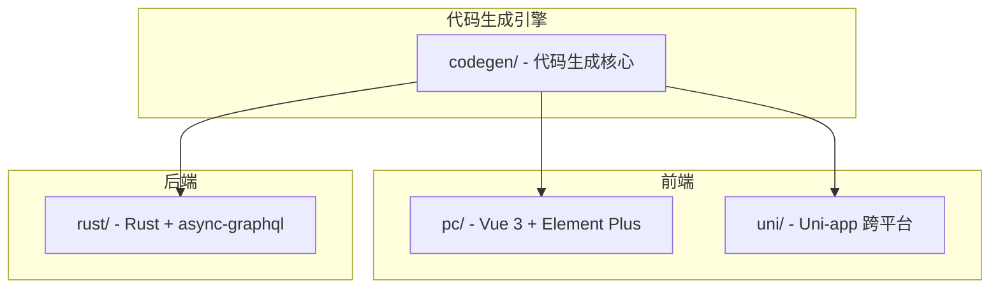
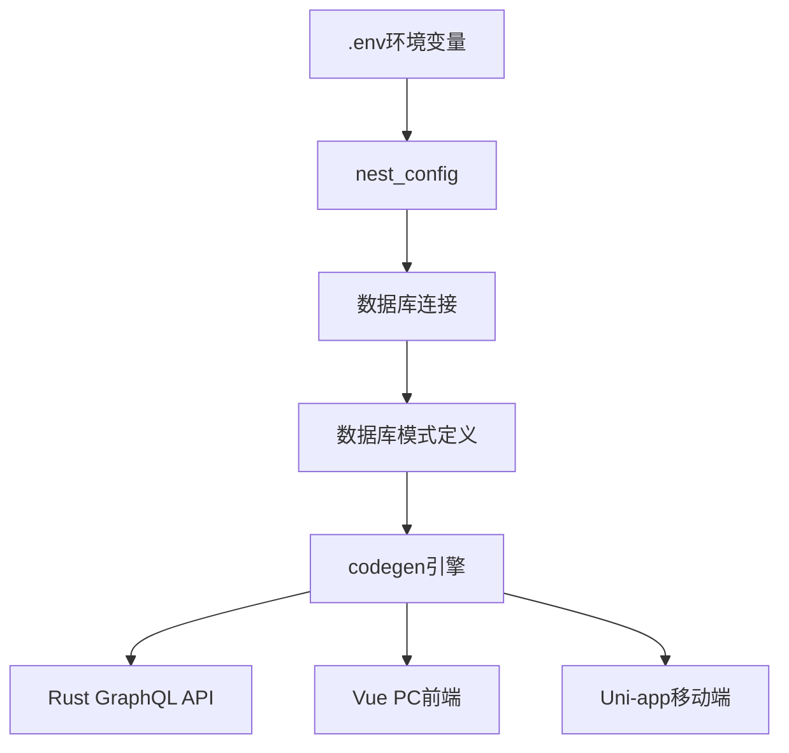
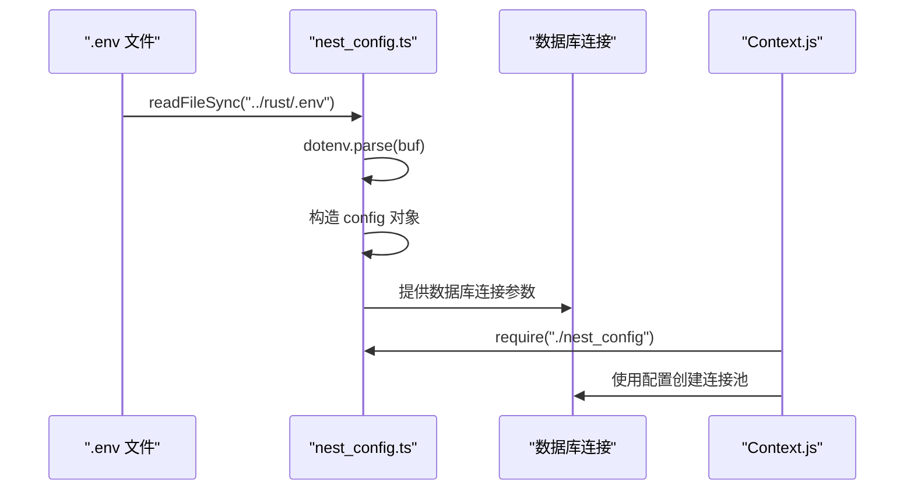
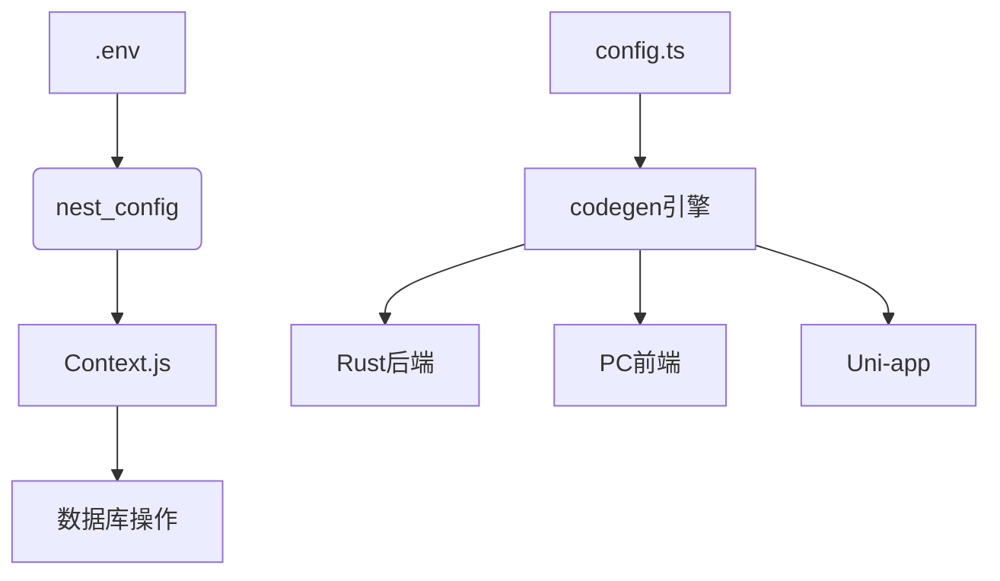

# 配置文件说明


**本文档中引用的文件**  
- [config.ts](https://github.com/sail-sail/nest/blob/main/codegen/src/config.ts)
- [nest_config.ts](https://github.com/sail-sail/nest/blob/main/codegen/src/lib/nest_config.ts)
- [nest_config.js](https://github.com/sail-sail/nest/blob/main/pc/src/utils/database/nest_config.js)
- [Context.js](https://github.com/sail-sail/nest/blob/main/pc/src/utils/database/Context.js)


## 目录
1. [简介](#简介)
2. [项目结构](#项目结构)
3. [核心组件](#核心组件)
4. [架构概述](#架构概述)
5. [详细组件分析](#详细组件分析)
6. [依赖分析](#依赖分析)
7. [性能考虑](#性能考虑)
8. [故障排除指南](#故障排除指南)
9. [结论](#结论)

## 简介
本项目是一个基于数据库模式定义的全栈代码生成系统，支持多端应用（PC端、移动端）的自动生成。系统通过 `codegen` 模块驱动，根据数据库表结构自动生成 Rust 后端服务、Vue 前端组件以及 Uni-app 移动端代码。配置文件在该系统中起着核心作用，决定了代码生成的行为、路径、模块映射规则以及环境适配机制。

## 项目结构
项目采用四模块结构设计，各模块职责清晰，协同工作以实现全栈自动化生成。



**Diagram sources**
- [project_structure](https://github.com/sail-sail/nest/blob/main/README.md#L1-L50)

## 核心组件

`codegen/src/config.ts` 是代码生成的核心配置文件，定义了所有表字段的生成行为和前端展示规则。`nest_config.ts` 则负责数据库连接与环境变量管理，是系统运行的基础配置。

**Section sources**
- [config.ts](https://github.com/sail-sail/nest/blob/main/codegen/src/config.ts#L1-L1068)
- [nest_config.ts](https://github.com/sail-sail/nest/blob/main/codegen/src/lib/nest_config.ts#L1-L35)

## 架构概述

系统整体架构围绕“约定优于配置”原则构建，通过统一的配置文件驱动多端代码生成。



**Diagram sources**
- [config.ts](https://github.com/sail-sail/nest/blob/main/codegen/src/config.ts#L1-L1068)
- [nest_config.ts](https://github.com/sail-sail/nest/blob/main/codegen/src/lib/nest_config.ts#L1-L35)

## 详细组件分析

### config.ts 配置项详解

#### 表字段配置（TableCloumn）
该接口定义了每个数据库字段在代码生成过程中的行为和前端表现。

```mermaid
classDiagram
class TableCloumn {
+ignoreCodegen : boolean
+onlyCodegenDeno : boolean
+noEdit : boolean
+noAdd : boolean
+noList : boolean
+noDetail : boolean
+isVirtual : boolean
+COLUMN_NAME : string
+COLUMN_DEFAULT : string
+IS_NULLABLE : "NO"|"YES"
+DATA_TYPE : string
+CHARACTER_MAXIMUM_LENGTH : number
+NUMERIC_PRECISION : string
+NUMERIC_SCALE : string
+COLUMN_COMMENT : string
+notForeignKeyById : boolean
+notImportExportList : boolean
+foreignKey : ForeignKey
+foreignTabsDialogType : "auto"|"medium"|"large"|"default"
+foreignTabs : ForeignTab[]
+foreignPage : ForeignPage
+many2many : Many2Many
+inlineMany2manyTab : boolean
+require : boolean
+search : boolean
+canSearch : boolean
+isImg : boolean
+isIcon : boolean
+isTextarea : boolean
+isFluentEditor : boolean
+isColorPicker : boolean
+isSwitch : boolean
+isAtt : boolean
+attMaxSize : number
+maxFileSize : number
+attAccept : string
+width : number
+align : string
+sortable : boolean
+dict : string
+dictbiz : string
+fixed : boolean|"left"|"right"
+validators : Validator[]
+isEncrypt : boolean
+autoCode : AutoCode
}
class ForeignKey {
+mod : string
+mod_slash_table : string
+table : string
+column : string
+multiple : boolean
+lbl : string
+cascade_fields : string[]
+type : "many2many"
+many2many_no_cascade_delete : boolean
+selectType : "select"|"selectInput"|"tree"
+selectListReadonly : boolean
+hasSelectAdd : boolean
+defaultSort : SortConfig
+showType : "tag"|"dialog"|"link"
+isLinkForeignTabs : boolean
+notSetIdByLbl : boolean
+isSearchByLbl : boolean
+isSearchBySelectInput : boolean
}
class ForeignTab {
+linkType : "link"|"button"|"more"
+mod : string
+mod_slash_table : string
+table : string
+label : string
+column : string
}
class ForeignPage {
+routeName : string
+tabNameField : string
+query : { [key : string] : string }
}
class Many2Many {
+mod : string
+table : string
+column1 : string
+column2 : string
}
class AutoCode {
+prefix : string
+seq : string
+seqPadStart0 : number
+suffix : string
+dateSeq : string
+dateFormat : "YYYYMMDD"|"YYYYMM"|"YYYY"|"YY"
}
class SortConfig {
+prop : string
+order : string
}
class Validator {
+maximum : number
+minimum : number
+multiple_of : number
+max_items : number
+min_items : number
+chars_max_length : number
+chars_min_length : number
+email : boolean
+url : boolean
+ip : boolean
+regex : string
}
```

**Diagram sources**
- [config.ts](https://github.com/sail-sail/nest/blob/main/codegen/src/config.ts#L1-L799)

#### 表配置项（TablesConfigItem）
定义整个表的生成选项和行为规则。

```mermaid
classDiagram
class TablesConfigItem {
+opts : TableOptions
+columns : TableCloumn[]
+records : any[]
}
class TableOptions {
+lbl_field : string
+cache : boolean
+log : boolean
+list_page : boolean
+list_tree : boolean|string
+ignoreCodegen : boolean
+onlyCodegenDeno : boolean
+table_name : string
+table : string
+mod : string
+tableUp : string
+table_comment : string
+hasTenant_id : boolean
+hasOrgId : boolean
+hasCreateUsrId : boolean
+hasCreateTime : boolean
+hasUpdateUsrId : boolean
+hasUpdateTime : boolean
+hasIsDeleted : boolean
+hasDeleteUsrId : boolean
+hasDeleteTime : boolean
+hasVersion : boolean
+defaultSort : SortConfig
+secondSorts : SortConfig[]
+searchByKeyword : KeywordSearch
+noDelete : boolean
+noRevert : boolean
+noForceDelete : boolean
+noEdit : boolean
+noAdd : boolean
+hideSaveAndCopy : boolean
+noCopy : boolean
+noImport : boolean
+noExport : boolean
+filterDataByCreateUsr : boolean
+uniques : string[][]
+sys_fields : string[]
+history_table : string
+dataPermit : boolean
+inlineForeignTabs : InlineForeignTab[]
+detailCustomDialogType : "auto"|"medium"|"large"|"default"
+hasSelectInput : boolean
+tableSelectable : string
+isRealData : boolean
+detailFormCols : number
+detailFormWidth : string
+searchFormWidth : string
+langTable : LangTableConfig
+audit : AuditConfig
+isUniApi : boolean
+cascadeUpdateFields : CascadeUpdateField[]
}
class KeywordSearch {
+prop : string
+fields : string[]
+lbl : string
+placeholder : string
+hideInList : boolean
}
class InlineForeignTab {
+mod : string
+mod_slash_table : string
+table : string
+label : string
+column : string
+column_name : string
+foreign_type : "one2one"|"one2many"
+onlyCodegenDeno : boolean
}
class LangTableConfig {
+opts : { mod : string; table : string; table_name : string }
+records : TableCloumn[]
}
class AuditConfig {
+column : string
+auditMod : string
+auditTable : string
+auditTableSchema : TablesConfigItem
+hasReviewed : boolean
}
class CascadeUpdateField {
+watchColumn : string
+mod : string
+table : string
+idColumn : string
+column : string
}
```

**Diagram sources**
- [config.ts](https://github.com/sail-sail/nest/blob/main/codegen/src/config.ts#L800-L1068)

### nest_config.ts 环境配置机制

该文件实现了环境配置的分层管理，从 `.env` 文件读取数据库连接信息，并统一提供给前后端使用。



**Diagram sources**
- [nest_config.ts](https://github.com/sail-sail/nest/blob/main/codegen/src/lib/nest_config.ts#L1-L35)
- [nest_config.js](https://github.com/sail-sail/nest/blob/main/pc/src/utils/database/nest_config.js#L1-L22)
- [Context.js](https://github.com/sail-sail/nest/blob/main/pc/src/utils/database/Context.js#L1-L43)

## 依赖分析

系统依赖关系清晰，codegen 模块为上游，生成代码供其他模块使用。



**Diagram sources**
- [nest_config.ts](https://github.com/sail-sail/nest/blob/main/codegen/src/lib/nest_config.ts#L1-L35)
- [config.ts](https://github.com/sail-sail/nest/blob/main/codegen/src/config.ts#L1-L1068)

## 性能考虑
- 配置文件采用静态解析方式，无运行时性能损耗
- 数据库连接池复用，提升数据库访问效率
- 代码生成阶段完成所有逻辑判断，运行时无额外开销

## 故障排除指南

### 配置验证机制
- `defineConfig()` 函数用于类型校验，确保配置结构正确
- 字段默认值逻辑在模板中处理，避免运行时错误
- 外键、多对多等复杂关系在生成时进行合法性检查

### 常见问题
1. **数据库连接失败**：检查 `.env` 文件路径及字段名是否正确
2. **代码未生成**：确认 `config.ts` 中表配置是否启用
3. **前端显示异常**：检查 `width`、`align` 等展示属性设置
4. **权限控制失效**：验证 `fieldPermit` 和 `dataPermit` 配置项

**Section sources**
- [config.ts](https://github.com/sail-sail/nest/blob/main/codegen/src/config.ts#L1-L1068)
- [nest_config.ts](https://github.com/sail-sail/nest/blob/main/codegen/src/lib/nest_config.ts#L1-L35)

## 结论
本系统的配置体系设计合理，通过 `config.ts` 实现细粒度的代码生成控制，通过 `nest_config.ts` 实现环境统一管理。两者结合，既保证了灵活性，又提升了开发效率。建议在实际使用中遵循既定模式，避免手动修改生成代码，以保持系统一致性。