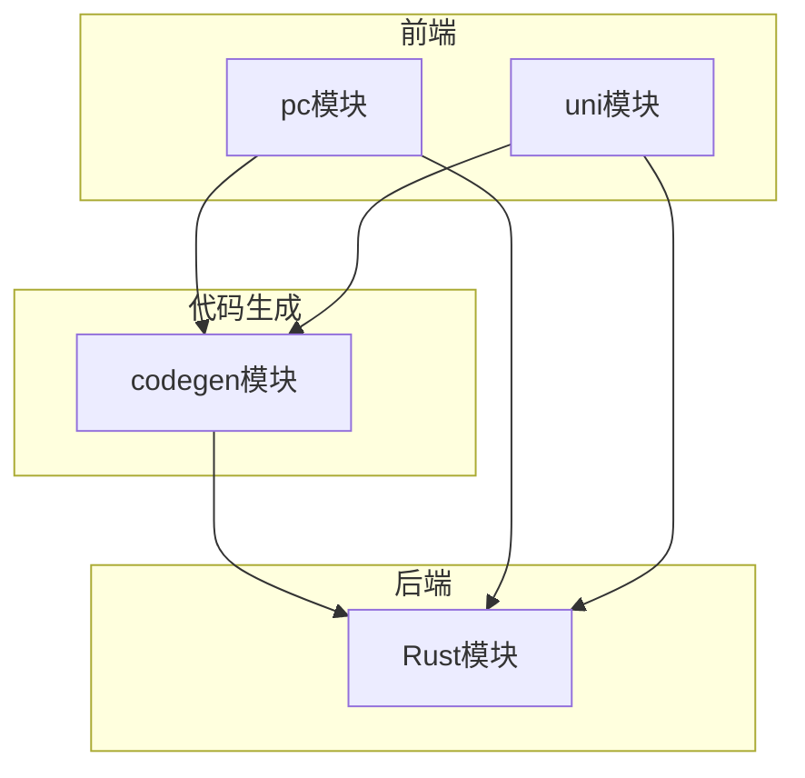
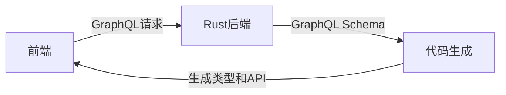
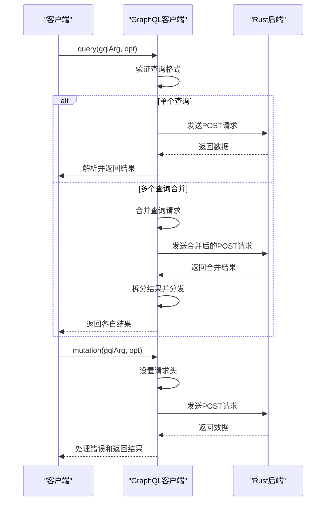
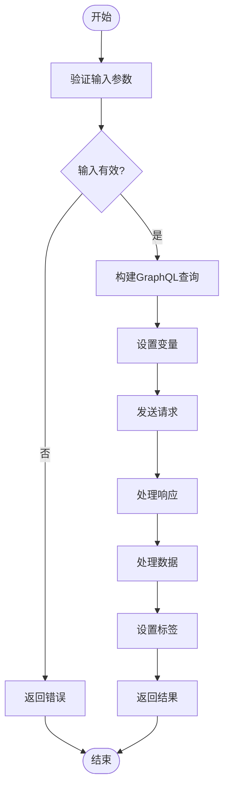
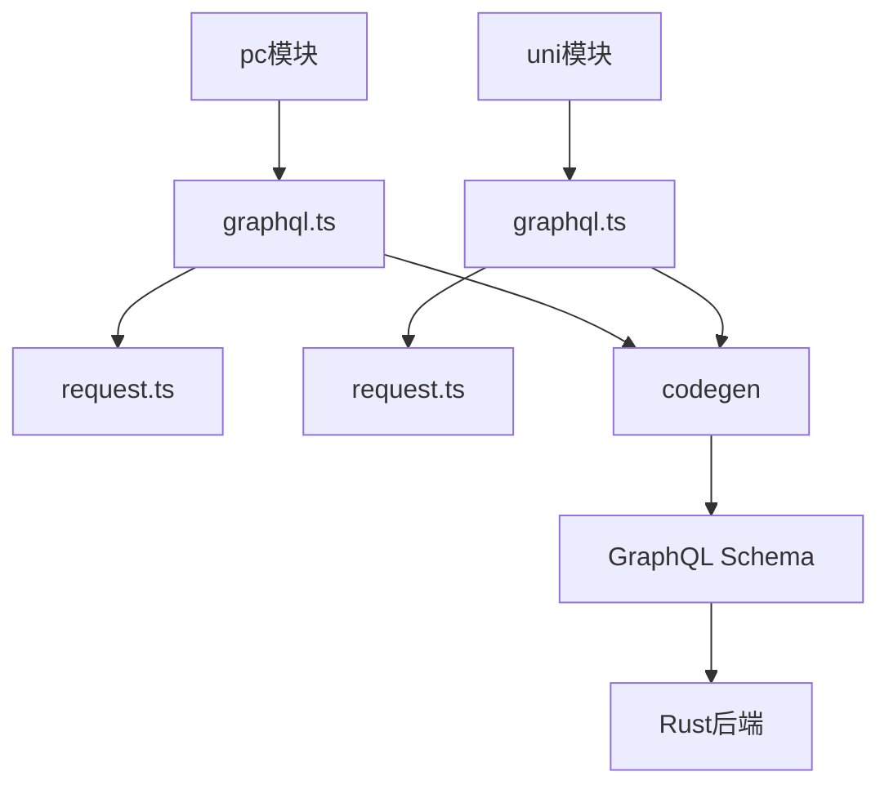

# GraphQL客户端集成


**本文档引用的文件**  
- [graphql.ts](https://github.com/sail-sail/nest/blob/main/pc/src/utils/graphql.ts)
- [graphql.ts](https://github.com/sail-sail/nest/blob/main/uni/src/utils/graphql.ts)
- [Api.ts](https://github.com/sail-sail/nest/blob/main/codegen/__out__/pc/src/views/base/usr/Api.ts)
- [Api.ts](https://github.com/sail-sail/nest/blob/main/codegen/__out__/pc/src/views/base/menu/Api.ts)
- [graphql.config.js](https://github.com/sail-sail/nest/blob/main/pc/graphql.config.js)
- [graphql.config.js](https://github.com/sail-sail/nest/blob/main/rust/graphql.config.js)
- [graphql.config.js](https://github.com/sail-sail/nest/blob/main/uni/graphql.config.js)


## 目录
1. [简介](#简介)
2. [项目结构](#项目结构)
3. [核心组件](#核心组件)
4. [架构概述](#架构概述)
5. [详细组件分析](#详细组件分析)
6. [依赖分析](#依赖分析)
7. [性能考虑](#性能考虑)
8. [故障排除指南](#故障排除指南)
9. [结论](#结论)

## 简介
本文档详细说明了前端如何通过GraphQL与Rust后端进行通信。重点解析了`graphql.ts`中的客户端配置，包括HTTP链接、错误处理和缓存策略。阐述了`Api.ts`文件中GraphQL查询和变更的封装模式，展示了如何定义Query、Mutation及其类型安全的TypeScript接口。解释了`graphql.config.js`的代码生成配置如何自动生成TypeScript类型。提供了实际的请求示例，涵盖认证、分页和实时数据更新等场景，并为开发者提供调试GraphQL请求的工具和方法。

## 项目结构
本项目包含多个前端模块（pc、uni）和一个Rust后端模块。前端使用TypeScript和GraphQL进行数据交互，而后端使用Rust实现GraphQL服务。代码生成工具（codegen）用于自动生成前端API和类型定义。



**图示来源**  
- [pc/src/utils/graphql.ts](https://github.com/sail-sail/nest/blob/main/pc/src/utils/graphql.ts)
- [uni/src/utils/graphql.ts](https://github.com/sail-sail/nest/blob/main/uni/src/utils/graphql.ts)
- [codegen/__out__/pc/src/views/base/usr/Api.ts](https://github.com/sail-sail/nest/blob/main/codegen/__out__/pc/src/views/base/usr/Api.ts)

**章节来源**  
- [pc/src/utils/graphql.ts](https://github.com/sail-sail/nest/blob/main/pc/src/utils/graphql.ts)
- [uni/src/utils/graphql.ts](https://github.com/sail-sail/nest/blob/main/uni/src/utils/graphql.ts)

## 核心组件
核心组件包括GraphQL客户端配置、API封装和代码生成配置。这些组件共同实现了前端与后端的高效通信。

**章节来源**  
- [pc/src/utils/graphql.ts](https://github.com/sail-sail/nest/blob/main/pc/src/utils/graphql.ts#L1-L414)
- [uni/src/utils/graphql.ts](https://github.com/sail-sail/nest/blob/main/uni/src/utils/graphql.ts#L1-L380)

## 架构概述
系统采用前后端分离架构，前端通过GraphQL协议与后端通信。代码生成工具根据GraphQL Schema自动生成TypeScript类型和API方法，确保类型安全和开发效率。



**图示来源**  
- [pc/graphql.config.js](https://github.com/sail-sail/nest/blob/main/pc/graphql.config.js#L1-L15)
- [rust/graphql.config.js](https://github.com/sail-sail/nest/blob/main/rust/graphql.config.js#L1-L8)

## 详细组件分析

### GraphQL客户端配置分析
`graphql.ts`文件实现了GraphQL客户端的核心功能，包括查询、变更、错误处理和请求合并。

#### 客户端功能类图
```mermaid
classDiagram
class GqlArg {
+operationName? : string
+query : string
+variables? : { [key : string] : any }
}
class GqlOpt {
+showErrMsg? : boolean
+duration? : number
+timeout? : number
+notLoading? : boolean
+isMutation? : boolean
+"x-request-id"? : string
+client_tenant_id? : TenantId | null
}
class QueryInfo {
+gqlArg? : GqlArg
+hash? : string
+result? : Promise<any>
+resolve? : ((value : unknown) => void)
+reject? : ((reason? : any) => void)
}
class graphql {
+query(gqlArg : GqlArg, opt? : GqlOpt) : Promise<any>
+mutation(gqlArg : GqlArg, opt? : GqlOpt) : Promise<any>
+getQueryUrl(gqlArg : GqlArg, opt? : GqlOpt, authorization? : string) : string
-gqlQuery(gqlArg : GqlArg, opt? : GqlOpt) : Promise<any>
}
graphql --> QueryInfo : "管理"
graphql --> GqlArg : "使用"
graphql --> GqlOpt : "使用"
```

**图示来源**  
- [pc/src/utils/graphql.ts](https://github.com/sail-sail/nest/blob/main/pc/src/utils/graphql.ts#L50-L414)
- [uni/src/utils/graphql.ts](https://github.com/sail-sail/nest/blob/main/uni/src/utils/graphql.ts#L50-L380)

#### GraphQL请求流程序列图


**图示来源**  
- [pc/src/utils/graphql.ts](https://github.com/sail-sail/nest/blob/main/pc/src/utils/graphql.ts#L100-L414)
- [uni/src/utils/graphql.ts](https://github.com/sail-sail/nest/blob/main/uni/src/utils/graphql.ts#L100-L380)

### API封装模式分析
`Api.ts`文件展示了GraphQL查询和变更的封装模式，提供了类型安全的接口。

#### API封装流程图


**图示来源**  
- [codegen/__out__/pc/src/views/base/usr/Api.ts](https://github.com/sail-sail/nest/blob/main/codegen/__out__/pc/src/views/base/usr/Api.ts#L1-L800)
- [codegen/__out__/pc/src/views/base/menu/Api.ts](https://github.com/sail-sail/nest/blob/main/codegen/__out__/pc/src/views/base/menu/Api.ts#L1-L800)

**章节来源**  
- [codegen/__out__/pc/src/views/base/usr/Api.ts](https://github.com/sail-sail/nest/blob/main/codegen/__out__/pc/src/views/base/usr/Api.ts#L1-L932)
- [codegen/__out__/pc/src/views/base/menu/Api.ts](https://github.com/sail-sail/nest/blob/main/codegen/__out__/pc/src/views/base/menu/Api.ts#L1-L799)

## 依赖分析
项目依赖关系清晰，前端模块依赖代码生成模块生成的API，代码生成模块依赖后端的GraphQL Schema。



**图示来源**  
- [pc/src/utils/graphql.ts](https://github.com/sail-sail/nest/blob/main/pc/src/utils/graphql.ts)
- [uni/src/utils/graphql.ts](https://github.com/sail-sail/nest/blob/main/uni/src/utils/graphql.ts)
- [pc/graphql.config.js](https://github.com/sail-sail/nest/blob/main/pc/graphql.config.js)

**章节来源**  
- [pc/graphql.config.js](https://github.com/sail-sail/nest/blob/main/pc/graphql.config.js#L1-L15)
- [rust/graphql.config.js](https://github.com/sail-sail/nest/blob/main/rust/graphql.config.js#L1-L8)

## 性能考虑
- 使用查询合并功能减少网络请求次数
- 实现请求缓存避免重复请求
- 支持分页查询减少单次请求数据量
- 提供加载状态控制优化用户体验

## 故障排除指南
- 检查GraphQL查询格式是否正确
- 验证认证令牌是否有效
- 查看网络请求是否成功
- 检查变量类型是否匹配
- 确认GraphQL Schema是否最新

**章节来源**  
- [pc/src/utils/graphql.ts](https://github.com/sail-sail/nest/blob/main/pc/src/utils/graphql.ts#L300-L400)
- [uni/src/utils/graphql.ts](https://github.com/sail-sail/nest/blob/main/uni/src/utils/graphql.ts#L250-L350)

## 结论
本文档详细介绍了GraphQL客户端集成的各个方面，从配置到实现，为开发者提供了完整的指导。通过类型安全的API封装和高效的代码生成，大大提升了开发效率和代码质量。