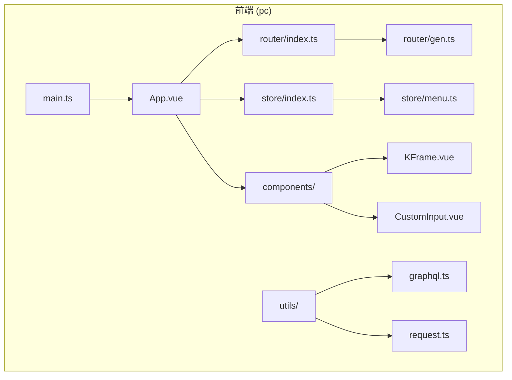
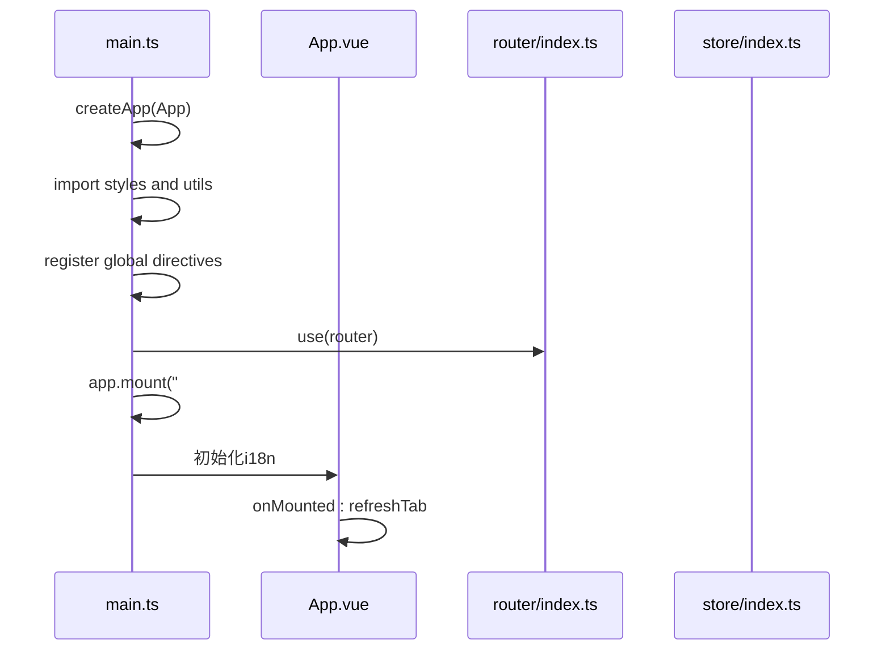
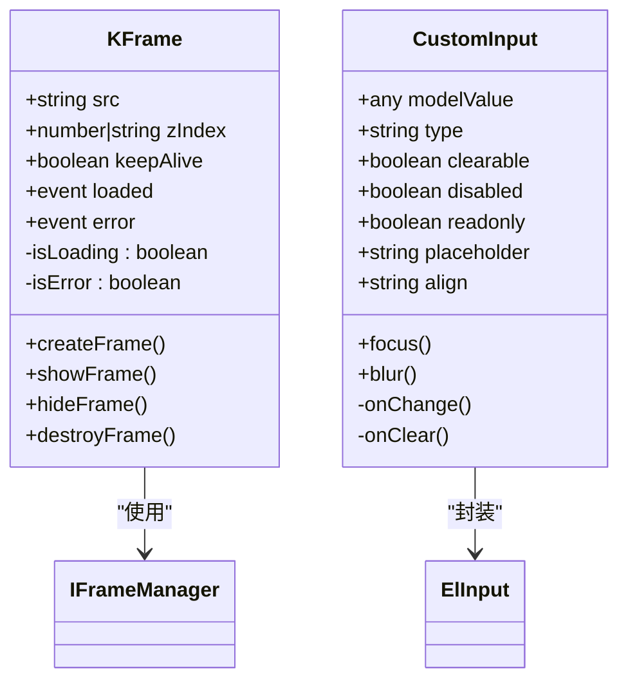
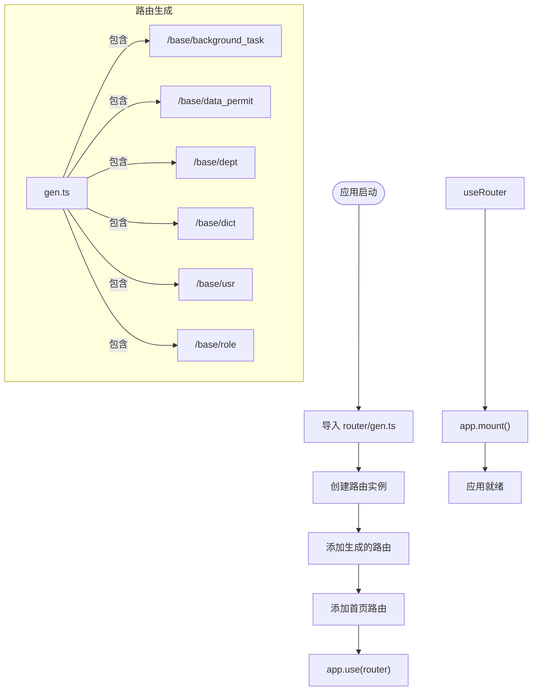
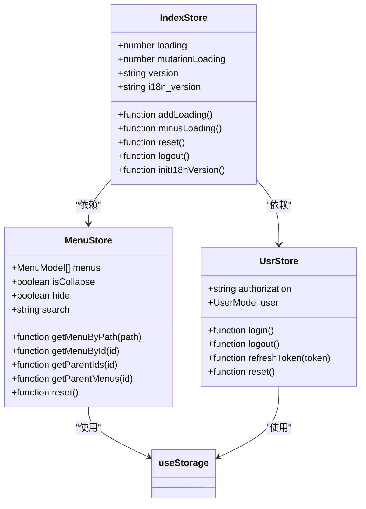
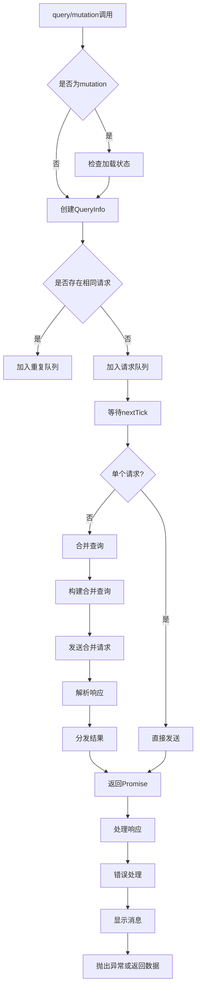
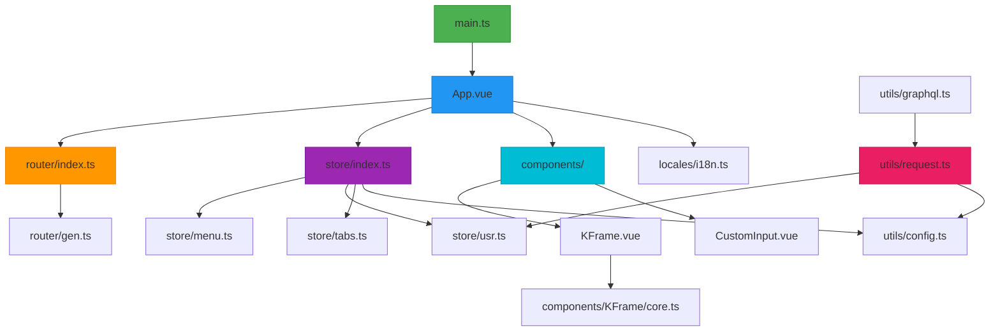

# 前端架构

**本文档引用文件**  
- [main.ts](https://github.com/sail-sail/nest/blob/main/pc/src/main.ts)
- [App.vue](https://github.com/sail-sail/nest/blob/main/pc/src/App.vue)
- [router/index.ts](https://github.com/sail-sail/nest/blob/main/pc/src/router/index.ts)
- [router/gen.ts](https://github.com/sail-sail/nest/blob/main/pc/src/router/gen.ts)
- [store/index.ts](https://github.com/sail-sail/nest/blob/main/pc/src/store/index.ts)
- [store/menu.ts](https://github.com/sail-sail/nest/blob/main/pc/src/store/menu.ts)
- [utils/graphql.ts](https://github.com/sail-sail/nest/blob/main/pc/src/utils/graphql.ts)
- [utils/request.ts](https://github.com/sail-sail/nest/blob/main/pc/src/utils/request.ts)
- [components/KFrame/KFrame.vue](https://github.com/sail-sail/nest/blob/main/pc/src/components/KFrame/KFrame.vue)
- [components/CustomInput.vue](https://github.com/sail-sail/nest/blob/main/pc/src/components/CustomInput.vue)

## 目录
1. [项目结构](#项目结构)
2. [应用初始化流程](#应用初始化流程)
3. [全局布局与组件体系](#全局布局与组件体系)
4. [路由与菜单生成机制](#路由与菜单生成机制)
5. [状态管理 (Pinia)](#状态管理-pinia)
6. [GraphQL 数据交互](#graphql-数据交互)
7. [核心组件设计](#核心组件设计)
8. [依赖关系图](#依赖关系图)

## 项目结构

项目采用模块化分层结构，主要分为以下几个部分：

- `pc/`：PC端管理后台前端代码
- `codegen/`：代码生成器相关逻辑
- `rust/`：后端Rust服务
- `uni/`：UniApp移动端代码

前端核心代码位于`pc/src`目录下，包含：
- `main.ts`：应用入口
- `App.vue`：根组件
- `components/`：通用组件库
- `views/`：页面视图
- `router/`：路由配置
- `store/`：状态管理
- `utils/`：工具函数

**图示来源**
- [main.ts](https://github.com/sail-sail/nest/blob/main/pc/src/main.ts)
- [App.vue](https://github.com/sail-sail/nest/blob/main/pc/src/App.vue)
- [router/index.ts](https://github.com/sail-sail/nest/blob/main/pc/src/router/index.ts)
- [store/index.ts](https://github.com/sail-sail/nest/blob/main/pc/src/store/index.ts)

## 应用初始化流程

应用从`main.ts`开始启动，执行以下初始化步骤：

1. 创建Vue应用实例
2. 引入样式和全局依赖
3. 注册全局指令
4. 挂载路由
5. 启动应用

**图示来源**
- [main.ts](https://github.com/sail-sail/nest/blob/main/pc/src/main.ts#L1-L37)
- [App.vue](https://github.com/sail-sail/nest/blob/main/pc/src/App.vue#L40-L83)

**本节来源**
- [main.ts](https://github.com/sail-sail/nest/blob/main/pc/src/main.ts#L1-L37)
- [App.vue](https://github.com/sail-sail/nest/blob/main/pc/src/App.vue#L40-L83)

## 全局布局与组件体系

`App.vue`作为根组件，采用Element Plus的`el-config-provider`进行全局配置，并通过`router-view`实现动态内容渲染。

当路由组件不存在时，显示404页面，包含返回首页按钮。同时，全局挂载了后台任务列表对话框组件。

### 组件体系

项目构建了一套完整的自定义组件体系：

- **KFrame**：IFrame管理组件，支持懒加载和缓存
- **CustomInput**：增强输入框，支持只读模式和对齐方式
- **CustomSelect/Checkbox/Switch**：表单控件系列
- **Table相关组件**：排序、搜索、列显示控制
- **Dialog系列**：文件上传、列表选择等

**图示来源**
- [components/KFrame/KFrame.vue](https://github.com/sail-sail/nest/blob/main/pc/src/components/KFrame/KFrame.vue)
- [components/CustomInput.vue](https://github.com/sail-sail/nest/blob/main/pc/src/components/CustomInput.vue)

**本节来源**
- [App.vue](https://github.com/sail-sail/nest/blob/main/pc/src/App.vue#L1-L83)
- [components/KFrame/KFrame.vue](https://github.com/sail-sail/nest/blob/main/pc/src/components/KFrame/KFrame.vue)
- [components/CustomInput.vue](https://github.com/sail-sail/nest/blob/main/pc/src/components/CustomInput.vue)

## 路由与菜单生成机制

路由系统基于Vue Router构建，采用动态生成机制。

### 路由配置

`router/gen.ts`文件导出`routesGen`常量，包含所有基础模块的路由配置。每个路由都指向`Layout1`布局组件，并嵌套具体的页面组件。

**图示来源**
- [router/gen.ts](https://github.com/sail-sail/nest/blob/main/pc/src/router/gen.ts)
- [router/index.ts](https://github.com/sail-sail/nest/blob/main/pc/src/router/index.ts)

### 菜单管理

`store/menu.ts`负责菜单状态管理，主要功能包括：

- 菜单数据存储（使用useStorage持久化）
- 菜单折叠状态管理
- 菜单搜索过滤
- 菜单路径映射
- 父级菜单查找

菜单数据通过`pathMenuMap`计算属性建立路径索引，支持快速查找。

**本节来源**
- [router/index.ts](https://github.com/sail-sail/nest/blob/main/pc/src/router/index.ts#L1-L60)
- [router/gen.ts](https://github.com/sail-sail/nest/blob/main/pc/src/router/gen.ts#L1-L335)
- [store/menu.ts](https://github.com/sail-sail/nest/blob/main/pc/src/store/menu.ts#L1-L228)

## 状态管理 (Pinia)

项目使用Pinia进行状态管理，核心store位于`store/index.ts`。

### 核心功能

- 全局加载状态管理
- 版本号管理
- 用户会话管理
- 状态重置与登出

### 状态模块

store目录下包含多个模块化store：

- `background_task.ts`：后台任务状态
- `dirty.ts`：脏数据检测
- `field_permit.ts`：字段权限
- `menu.ts`：菜单状态
- `permit.ts`：按钮权限
- `tabs.ts`：标签页管理
- `tenant.ts`：租户信息
- `usr.ts`：用户信息

**图示来源**
- [store/index.ts](https://github.com/sail-sail/nest/blob/main/pc/src/store/index.ts#L1-L127)
- [store/menu.ts](https://github.com/sail-sail/nest/blob/main/pc/src/store/menu.ts#L1-L228)

**本节来源**
- [store/index.ts](https://github.com/sail-sail/nest/blob/main/pc/src/store/index.ts#L1-L127)
- [store/menu.ts](https://github.com/sail-sail/nest/blob/main/pc/src/store/menu.ts#L1-L228)

## GraphQL 数据交互

项目通过自定义的GraphQL客户端与后端进行数据交互，核心逻辑位于`utils/graphql.ts`。

### 请求处理流程

### 核心特性

- **请求合并**：自动合并多个查询请求，减少网络开销
- **错误处理**：统一处理认证过期、后台任务等特殊错误
- **加载状态**：集成全局加载指示器
- **URL生成**：支持生成可分享的GraphQL请求URL
- **缓存控制**：通过`notLoading`选项控制加载状态

请求通过`request.ts`底层工具发送，自动添加认证头和租户ID。

**本节来源**
- [utils/graphql.ts](https://github.com/sail-sail/nest/blob/main/pc/src/utils/graphql.ts#L1-L413)
- [utils/request.ts](https://github.com/sail-sail/nest/blob/main/pc/src/utils/request.ts#L1-L495)

## 核心组件设计

### KFrame 组件

`KFrame`组件用于管理IFrame元素，提供以下特性：

- **生命周期管理**：自动创建、销毁IFrame
- **状态反馈**：加载中、错误、无数据状态提示
- **缓存支持**：通过`keepAlive`属性控制是否缓存
- **尺寸自适应**：监听容器尺寸变化
- **API暴露**：提供`getRef`方法获取内部引用

组件使用`IFrameManager`核心类进行实际的IFrame管理，实现了创建、显示、隐藏、销毁等操作。

### CustomInput 组件

`CustomInput`组件是对Element Plus `el-input`的增强封装，主要改进：

- **只读模式**：两种显示样式（带边框/无边框）
- **对齐方式**：支持左、中、右对齐
- **插槽支持**：保留所有原始插槽
- **事件代理**：正确传递change、clear等事件
- **高度自适应**：监听textarea高度变化

组件采用Composition API编写，使用`$ref`和`$shallowRef`进行响应式管理。

**本节来源**
- [components/KFrame/KFrame.vue](https://github.com/sail-sail/nest/blob/main/pc/src/components/KFrame/KFrame.vue#L1-L198)
- [components/CustomInput.vue](https://github.com/sail-sail/nest/blob/main/pc/src/components/CustomInput.vue#L1-L252)

## 依赖关系图

**图示来源**
- [main.ts](https://github.com/sail-sail/nest/blob/main/pc/src/main.ts)
- [App.vue](https://github.com/sail-sail/nest/blob/main/pc/src/App.vue)
- [router/index.ts](https://github.com/sail-sail/nest/blob/main/pc/src/router/index.ts)
- [store/index.ts](https://github.com/sail-sail/nest/blob/main/pc/src/store/index.ts)
- [utils/graphql.ts](https://github.com/sail-sail/nest/blob/main/pc/src/utils/graphql.ts)
- [utils/request.ts](https://github.com/sail-sail/nest/blob/main/pc/src/utils/request.ts)

**本节来源**
- 所有引用文件