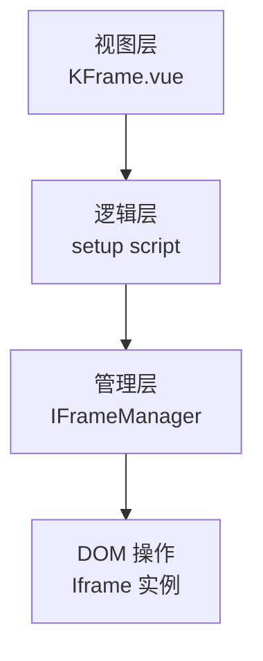
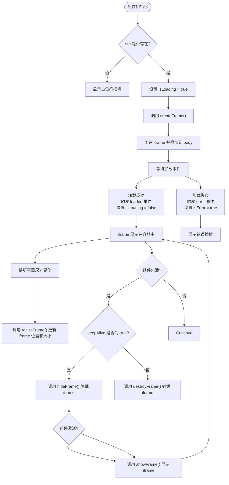
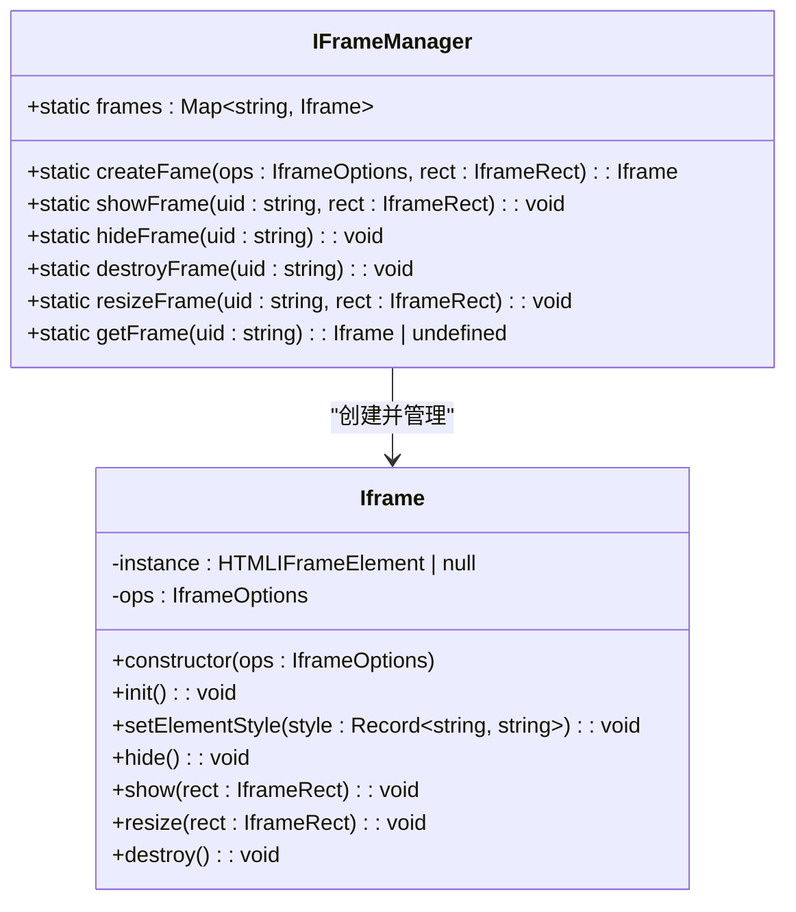

# KFrame框架


**本文档中引用的文件**  
- [KFrame.vue](https://github.com/sail-sail/nest/blob/main/pc/src/components/KFrame/KFrame.vue)
- [core.ts](https://github.com/sail-sail/nest/blob/main/pc/src/components/KFrame/core.ts)
- [index.ts](https://github.com/sail-sail/nest/blob/main/pc/src/components/KFrame/index.ts)


## 目录
1. [简介](#简介)
2. [项目结构](#项目结构)
3. [核心组件](#核心组件)
4. [架构概述](#架构概述)
5. [详细组件分析](#详细组件分析)
6. [依赖分析](#依赖分析)
7. [性能考虑](#性能考虑)
8. [故障排除指南](#故障排除指南)
9. [结论](#结论)

## 简介
KFrame 是一个专为 PC 端设计的核心布局框架，旨在提供灵活、可复用的 iframe 嵌入式布局解决方案。该框架通过 `KFrame.vue` 组件封装了 iframe 的创建、显示、隐藏、调整大小和销毁等生命周期操作，并通过 `core.ts` 中的 `IFrameManager` 类进行统一管理。`index.ts` 提供了模块导出机制，便于在项目中全局引入和使用。本技术文档将深入解析其设计原理与实现机制，帮助开发者理解其工作方式并进行定制化扩展。

## 项目结构
KFrame 框架位于 `pc/src/components/KFrame/` 目录下，由三个核心文件构成：
- `KFrame.vue`：主组件文件，定义了 UI 结构、响应式逻辑及与父组件的通信接口。
- `core.ts`：核心逻辑文件，包含 `IFrameManager` 管理类和 `Iframe` 实体类，负责 iframe 的底层操作与状态管理。
- `index.ts`：模块入口文件，用于导出组件和管理类，实现模块化引用。

```mermaid
graph TB
subgraph "KFrame 组件模块"
KFrameVue[KFrame.vue<br/>组件定义]
CoreTS[core.ts<br/>核心逻辑]
IndexTS[index.ts<br/>模块导出]
end
KFrameVue --> CoreTS : "导入 IFrameManager"
IndexTS --> KFrameVue : "导出默认组件"
IndexTS --> CoreTS : "导出 IFrameManager"
```

**Diagram sources**  
- [KFrame.vue](https://github.com/sail-sail/nest/blob/main/pc/src/components/KFrame/KFrame.vue#L1-L199)
- [core.ts](https://github.com/sail-sail/nest/blob/main/pc/src/components/KFrame/core.ts#L1-L126)
- [index.ts](https://github.com/sail-sail/nest/blob/main/pc/src/components/KFrame/index.ts#L1-L3)

**Section sources**  
- [KFrame.vue](https://github.com/sail-sail/nest/blob/main/pc/src/components/KFrame/KFrame.vue#L1-L199)
- [core.ts](https://github.com/sail-sail/nest/blob/main/pc/src/components/KFrame/core.ts#L1-L126)
- [index.ts](https://github.com/sail-sail/nest/blob/main/pc/src/components/KFrame/index.ts#L1-L3)

## 核心组件
KFrame 框架的核心在于其组件化设计与状态分离。`KFrame.vue` 作为视图层，通过 props 接收配置（如 `src`、`zIndex`、`keepAlive`），并通过插槽（slots）提供加载中、加载失败和占位符的自定义内容。组件内部利用 Vue 的生命周期钩子（如 `onBeforeUnmount`、`onActivated`、`onDeactivated`）和 `watch` 监听器，确保 iframe 在不同状态下的正确创建、显示、隐藏与销毁。`core.ts` 中的 `IFrameManager` 则作为单例管理器，集中管理所有 iframe 实例，避免全局污染并提供统一的操作接口。

**Section sources**  
- [KFrame.vue](https://github.com/sail-sail/nest/blob/main/pc/src/components/KFrame/KFrame.vue#L1-L199)
- [core.ts](https://github.com/sail-sail/nest/blob/main/pc/src/components/KFrame/core.ts#L1-L126)

## 架构概述
KFrame 框架采用分层架构设计，清晰地分离了视图层、逻辑层和管理层。视图层由 `KFrame.vue` 构成，负责渲染容器和状态提示；逻辑层由 `KFrame.vue` 的 `setup` 脚本部分实现，处理组件的响应式数据和方法调用；管理层由 `core.ts` 中的 `IFrameManager` 和 `Iframe` 类构成，负责 iframe 元素的创建、样式控制、事件绑定及 DOM 操作。这种设计提高了代码的可维护性和可测试性。



**Diagram sources**  
- [KFrame.vue](https://github.com/sail-sail/nest/blob/main/pc/src/components/KFrame/KFrame.vue#L1-L199)
- [core.ts](https://github.com/sail-sail/nest/blob/main/pc/src/components/KFrame/core.ts#L1-L126)

## 详细组件分析

### KFrame.vue 组件分析
`KFrame.vue` 是一个基于 Vue 3 Composition API 的有状态组件。它通过 `ref` 创建对容器元素的引用，并利用 `useResizeObserver` 监听容器尺寸变化，实现 iframe 的响应式调整。组件通过 `watch` 监听 `frameContainer` 和 `props.src` 的变化，动态创建或销毁 iframe。`onActivated` 和 `onDeactivated` 钩子结合 `keepAlive` 属性，实现了 iframe 的缓存机制，避免了重复加载。

#### 组件状态流程图


**Diagram sources**  
- [KFrame.vue](https://github.com/sail-sail/nest/blob/main/pc/src/components/KFrame/KFrame.vue#L1-L199)

**Section sources**  
- [KFrame.vue](https://github.com/sail-sail/nest/blob/main/pc/src/components/KFrame/KFrame.vue#L1-L199)

### core.ts 核心逻辑分析
`core.ts` 文件定义了 `IFrameManager` 和 `Iframe` 两个核心类。`Iframe` 类封装了一个 iframe 元素的完整生命周期，包括初始化、显示、隐藏、调整大小和销毁。`IFrameManager` 作为一个静态类，使用 `Map` 数据结构（`frames`）来存储和管理所有已创建的 iframe 实例，通过唯一的 `uid` 进行索引。这确保了每个 iframe 实例的唯一性和可追溯性。

#### 类关系图


**Diagram sources**  
- [core.ts](https://github.com/sail-sail/nest/blob/main/pc/src/components/KFrame/core.ts#L1-L126)

**Section sources**  
- [core.ts](https://github.com/sail-sail/nest/blob/main/pc/src/components/KFrame/core.ts#L1-L126)

### index.ts 导出机制分析
`index.ts` 文件是 KFrame 模块的入口点，采用 ES6 模块语法进行导出。它将 `KFrame.vue` 组件作为默认导出（`default as KFrame`），方便在其他地方通过 `import KFrame from '...'` 的方式直接使用。同时，它将 `IFrameManager` 类作为具名导出，使得开发者可以在需要直接操作 iframe 管理器时进行导入。这种导出方式符合 Vue 组件库的通用规范。

**Section sources**  
- [index.ts](https://github.com/sail-sail/nest/blob/main/pc/src/components/KFrame/index.ts#L1-L3)

## 依赖分析
KFrame 框架主要依赖于 Vue 3 的 Composition API（如 `ref`、`watch`、`onBeforeUnmount` 等）和浏览器原生的 DOM API（如 `document.createElement`、`getBoundingClientRect`）。它没有引入外部第三方库，保持了轻量级。组件内部通过 `useThrottleFn` 对 `resizeFrame` 进行节流处理，以优化频繁的 resize 事件带来的性能开销。

```mermaid
graph LR
A[KFrame] --> B[Vue 3 Composition API]
A --> C[Browser DOM API]
A --> D[useThrottleFn (性能优化)]
```

**Diagram sources**  
- [KFrame.vue](https://github.com/sail-sail/nest/blob/main/pc/src/components/KFrame/KFrame.vue#L1-L199)
- [core.ts](https://github.com/sail-sail/nest/blob/main/pc/src/components/KFrame/core.ts#L1-L126)

**Section sources**  
- [KFrame.vue](https://github.com/sail-sail/nest/blob/main/pc/src/components/KFrame/KFrame.vue#L1-L199)
- [core.ts](https://github.com/sail-sail/nest/blob/main/pc/src/components/KFrame/core.ts#L1-L126)

## 性能考虑
KFrame 框架在性能方面做了以下优化：
1.  **节流处理**：使用 `useThrottleFn` 包装 `resizeFrame` 函数，防止在窗口或容器频繁调整大小时触发过多的 DOM 操作。
2.  **缓存机制**：通过 `keepAlive` 属性和 `onActivated`/`onDeactivated` 钩子，实现了 iframe 的缓存。当组件失活时，仅将其隐藏而非销毁，再次激活时直接显示，避免了重复的网络请求和页面加载。
3.  **集中管理**：`IFrameManager` 集中管理所有实例，确保在创建新实例前会先销毁同 `uid` 的旧实例，防止内存泄漏。
4.  **按需创建**：iframe 元素仅在 `src` 属性存在且容器已挂载时才被创建，减少了不必要的 DOM 操作。

## 故障排除指南
以下是一些使用 KFrame 框架时可能遇到的常见问题及解决方案：

- **问题**：iframe 无法加载，显示“加载失败”。
  - **解决方案**：检查 `src` 属性的 URL 是否正确且可访问。确认目标网站是否允许被 iframe 嵌入（检查其 `X-Frame-Options` 或 `Content-Security-Policy` 头）。

- **问题**：iframe 尺寸不正确或未跟随容器变化。
  - **解决方案**：确保 `KFrame` 组件的父容器具有明确的宽度和高度。检查是否有 CSS 样式冲突导致容器尺寸计算错误。

- **问题**：切换页面后 iframe 内容未刷新。
  - **解决方案**：如果希望每次激活都重新加载，可以将 `keepAlive` 属性设置为 `false`。

- **问题**：内存占用过高。
  - **解决方案**：确保在不需要时组件能正确销毁。检查 `keepAlive` 为 `true` 的场景下，是否积累了过多的隐藏 iframe 实例。

**Section sources**  
- [KFrame.vue](https://github.com/sail-sail/nest/blob/main/pc/src/components/KFrame/KFrame.vue#L1-L199)
- [core.ts](https://github.com/sail-sail/nest/blob/main/pc/src/components/KFrame/core.ts#L1-L126)

## 结论
KFrame 框架是一个设计精良、职责分明的 PC 端布局组件。它通过组件化和模块化的方式，简化了 iframe 的嵌入和管理。其核心的 `IFrameManager` 提供了强大的底层控制能力，而 `KFrame.vue` 组件则提供了友好的上层 API 和灵活的插槽定制。结合 `keepAlive` 缓存和节流优化，该框架在保证功能完整性的同时也兼顾了性能表现。开发者可以基于此框架轻松集成外部页面，并根据项目需求进行二次开发和扩展。