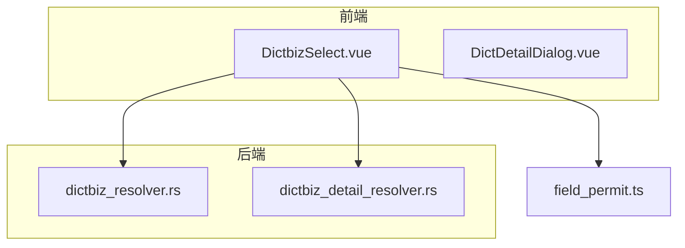
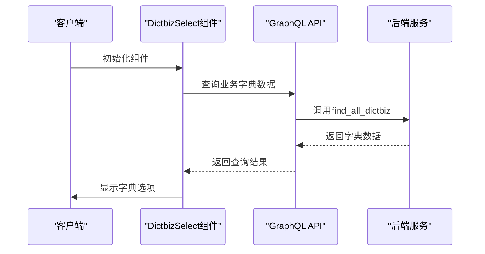
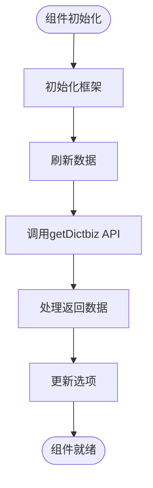
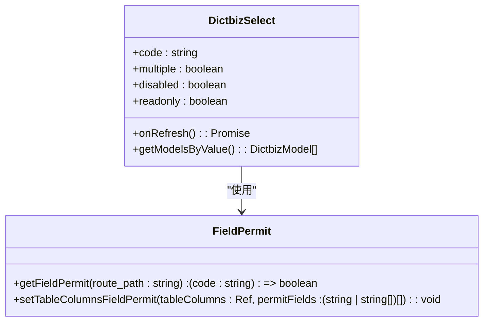
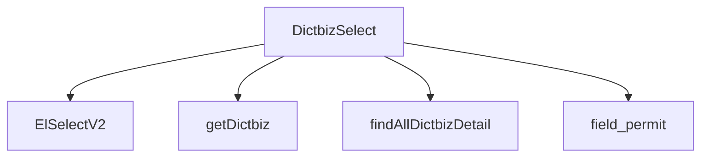

# 业务字典选择组件


**本文档引用文件**  
- [DictbizSelect.vue](https://github.com/sail-sail/nest/blob/main/pc/src/components/DictbizSelect.vue)
- [dictbiz_resolver.rs](https://github.com/sail-sail/nest/blob/main/rust/generated/base/dictbiz/dictbiz_resolver.rs)
- [dictbiz_detail_resolver.rs](https://github.com/sail-sail/nest/blob/main/rust/generated/base/dictbiz_detail/dictbiz_detail_resolver.rs)
- [field_permit.ts](https://github.com/sail-sail/nest/blob/main/pc/src/store/field_permit.ts)
- [DictSelect.vue](https://github.com/sail-sail/nest/blob/main/pc/src/components/DictSelect.vue)


## 目录
1. [简介](#简介)
2. [项目结构](#项目结构)
3. [核心组件](#核心组件)
4. [架构概述](#架构概述)
5. [详细组件分析](#详细组件分析)
6. [依赖分析](#依赖分析)
7. [性能考虑](#性能考虑)
8. [故障排除指南](#故障排除指南)
9. [结论](#结论)

## 简介
`DictbizSelect` 是一个用于选择业务字典数据的前端组件，支持多租户环境下的数据隔离和权限控制。该组件通过与后端 GraphQL API 集成，实现动态加载不同业务上下文的字典数据，并提供数据预加载和懒加载策略以优化页面性能。此外，组件还支持搜索过滤、分页加载和自定义模板渲染等高级功能。

## 项目结构
`DictbizSelect` 组件位于 `pc/src/components` 目录下，依赖于 `rust/generated/base/dictbiz` 和 `dictbiz_detail` 模块提供的后端服务。组件通过 `field_permit` 模块实现字段级别的权限控制。



**图示来源**
- [DictbizSelect.vue](https://github.com/sail-sail/nest/blob/main/pc/src/components/DictbizSelect.vue)
- [dictbiz_resolver.rs](https://github.com/sail-sail/nest/blob/main/rust/generated/base/dictbiz/dictbiz_resolver.rs)
- [dictbiz_detail_resolver.rs](https://github.com/sail-sail/nest/blob/main/rust/generated/base/dictbiz_detail/dictbiz_detail_resolver.rs)
- [field_permit.ts](https://github.com/sail-sail/nest/blob/main/pc/src/store/field_permit.ts)

## 核心组件
`DictbizSelect` 组件通过 `code` 属性指定要加载的业务字典代码，支持单选和多选模式。组件在初始化时会根据 `code` 属性调用后端 API 加载相应的字典数据，并将数据转换为 `ElSelectV2` 组件所需的选项格式。

**组件来源**
- [DictbizSelect.vue](https://github.com/sail-sail/nest/blob/main/pc/src/components/DictbizSelect.vue)

## 架构概述
`DictbizSelect` 组件采用前后端分离架构，前端通过 GraphQL API 与后端通信。后端服务由 Rust 编写，提供了一系列用于查询和管理业务字典及其明细的 API。组件通过 `field_permit` 模块实现字段级别的权限控制，确保用户只能访问其有权限的数据。



**图示来源**
- [DictbizSelect.vue](https://github.com/sail-sail/nest/blob/main/pc/src/components/DictbizSelect.vue)
- [dictbiz_resolver.rs](https://github.com/sail-sail/nest/blob/main/rust/generated/base/dictbiz/dictbiz_resolver.rs)

## 详细组件分析

### DictbizSelect 组件分析
`DictbizSelect` 组件通过 `props` 接收配置参数，如 `code`、`multiple`、`disabled` 等。组件在 `onRefresh` 方法中调用 `getDictbiz` 函数获取字典数据，并将其转换为 `options4SelectV2` 格式供 `ElSelectV2` 使用。

#### 组件生命周期


**图示来源**
- [DictbizSelect.vue](https://github.com/sail-sail/nest/blob/main/pc/src/components/DictbizSelect.vue)

#### 数据加载与权限控制


**图示来源**
- [DictbizSelect.vue](https://github.com/sail-sail/nest/blob/main/pc/src/components/DictbizSelect.vue)
- [field_permit.ts](https://github.com/sail-sail/nest/blob/main/pc/src/store/field_permit.ts)

### 高级功能支持
`DictbizSelect` 组件支持多种高级功能，包括搜索过滤、分页加载和自定义模板渲染。这些功能通过 `ElSelectV2` 组件的属性和插槽实现。

#### 搜索过滤
```mermaid
flowchart TD
Start([用户输入搜索关键词]) --> FilterOptions["过滤选项"]
FilterOptions --> ShowResults["显示匹配结果"]
ShowResults --> End([完成]
```

**图示来源**
- [DictbizSelect.vue](https://github.com/sail-sail/nest/blob/main/pc/src/components/DictbizSelect.vue)

#### 分页加载
```mermaid
flowchart TD
Start([滚动到底部]) --> LoadMore["加载更多数据"]
LoadMore --> UpdateOptions["更新选项列表"]
UpdateOptions --> End([完成]
```

**图示来源**
- [DictbizSelect.vue](https://github.com/sail-sail/nest/blob/main/pc/src/components/DictbizSelect.vue)

## 依赖分析
`DictbizSelect` 组件依赖于多个模块和服务，包括 `ElSelectV2`、`getDictbiz`、`findAllDictbizDetail` 和 `field_permit`。这些依赖关系确保了组件能够正确地加载和显示业务字典数据，并实现权限控制。



**图示来源**
- [DictbizSelect.vue](https://github.com/sail-sail/nest/blob/main/pc/src/components/DictbizSelect.vue)

## 性能考虑
为了优化性能，`DictbizSelect` 组件采用了数据预加载和懒加载策略。在组件初始化时，仅加载必要的字典数据；当用户进行搜索或滚动时，再按需加载更多数据。此外，组件还通过 `inited` 标志位避免重复加载数据。

## 故障排除指南
如果 `DictbizSelect` 组件无法正常工作，请检查以下几点：
- 确认 `code` 属性是否正确设置
- 检查网络请求是否成功
- 确认 `field_permit` 配置是否正确
- 查看浏览器控制台是否有错误信息

**故障排除来源**
- [DictbizSelect.vue](https://github.com/sail-sail/nest/blob/main/pc/src/components/DictbizSelect.vue)
- [field_permit.ts](https://github.com/sail-sail/nest/blob/main/pc/src/store/field_permit.ts)

## 结论
`DictbizSelect` 组件是一个功能强大且灵活的业务字典选择组件，支持多租户环境下的数据隔离和权限控制。通过合理的架构设计和性能优化，该组件能够满足复杂业务场景的需求。