# 业务数据组件


**本文档引用的文件**
- [DictSelect.vue](https://github.com/sail-sail/nest/blob/main/pc/src/components/DictSelect.vue)
- [DictbizSelect.vue](https://github.com/sail-sail/nest/blob/main/pc/src/components/DictbizSelect.vue)
- [LinkList.vue](https://github.com/sail-sail/nest/blob/main/pc/src/components/LinkList.vue)
- [UploadImage.vue](https://github.com/sail-sail/nest/blob/main/pc/src/components/UploadImage.vue)
- [dict_detail_dao.rs](https://github.com/sail-sail/nest/blob/main/rust/generated/base/dict_detail/dict_detail_dao.rs)
- [dictbiz_detail_dao.rs](https://github.com/sail-sail/nest/blob/main/rust/generated/base/dictbiz_detail/dictbiz_detail_dao.rs)
- [dictbiz_detail_resolver.rs](https://github.com/sail-sail/nest/blob/main/rust/generated/common/dictbiz_detail/dictbiz_detail_resolver.rs)
- [oss_router.rs](https://github.com/sail-sail/nest/blob/main/rust/generated/common/oss/oss_router.rs)
- [request.ts](https://github.com/sail-sail/nest/blob/main/pc/src/utils/request.ts)


## 目录
1. [简介](#简介)
2. [核心组件分析](#核心组件分析)
3. [数据交互机制](#数据交互机制)
4. [缓存与异步更新策略](#缓存与异步更新策略)
5. [关联数据展示处理](#关联数据展示处理)
6. [文件上传流程与状态管理](#文件上传流程与状态管理)
7. [实际业务场景集成示例](#实际业务场景集成示例)
8. [权限控制与数据安全](#权限控制与数据安全)
9. [性能调优建议](#性能调优建议)
10. [常见数据同步问题解决方案](#常见数据同步问题解决方案)

## 简介
本文档深入解析系统中的业务数据组件，重点阐述DictSelect和DictbizSelect组件如何与系统字典数据进行交互。详细说明组件的数据加载机制、缓存策略和异步更新逻辑。同时，文档将解释LinkList组件如何处理关联数据展示，以及UploadImage组件的文件上传流程与状态管理。为开发者提供全面的集成指南、性能优化建议和常见问题解决方案。

## 核心组件分析

### DictSelect与DictbizSelect组件
DictSelect和DictbizSelect组件是系统中用于选择字典数据的核心组件。它们通过GraphQL API与后端服务进行通信，获取并展示字典数据。

**组件特性**
- 支持单选和多选模式
- 提供全选功能
- 支持自定义选项映射
- 支持只读模式下的标签展示

**数据模型**
- DictSelect使用GetDict类型作为数据模型
- DictbizSelect使用GetDictbiz类型作为数据模型
- 两者都包含id、code、type、lbl、val等核心字段

### LinkList组件
LinkList组件用于展示关联数据列表，支持标签形式的紧凑展示和弹出式详细展示。

**组件特性**
- 支持最大显示数量限制
- 超出数量时显示折叠标签
- 支持鼠标悬停查看完整列表
- 提供响应式布局

### UploadImage组件
UploadImage组件提供完整的图片上传功能，包括文件选择、压缩、上传和预览。

**组件特性**
- 支持单张和多张图片上传
- 提供图片压缩功能
- 支持拖拽排序
- 提供上传进度和错误处理
- 支持图片预览和删除

**Section sources**
- [DictSelect.vue](https://github.com/sail-sail/nest/blob/main/pc/src/components/DictSelect.vue)
- [DictbizSelect.vue](https://github.com/sail-sail/nest/blob/main/pc/src/components/DictbizSelect.vue)
- [LinkList.vue](https://github.com/sail-sail/nest/blob/main/pc/src/components/LinkList.vue)
- [UploadImage.vue](https://github.com/sail-sail/nest/blob/main/pc/src/components/UploadImage.vue)

## 数据交互机制

### DictSelect数据加载流程
DictSelect组件通过以下流程加载字典数据：

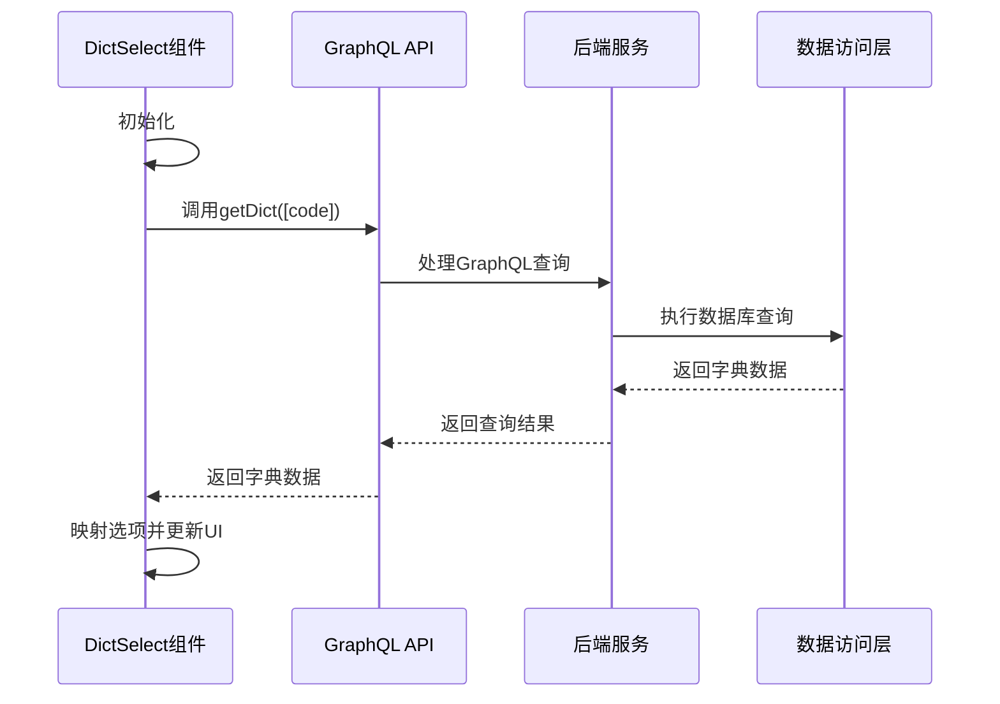

**Diagram sources**
- [DictSelect.vue](https://github.com/sail-sail/nest/blob/main/pc/src/components/DictSelect.vue#L634-L694)
- [dict_detail_dao.rs](https://github.com/sail-sail/nest/blob/main/rust/generated/base/dict_detail/dict_detail_dao.rs#L110-L161)

### DictbizSelect数据加载流程
DictbizSelect组件的数据加载机制与DictSelect类似，但针对业务字典进行了优化：

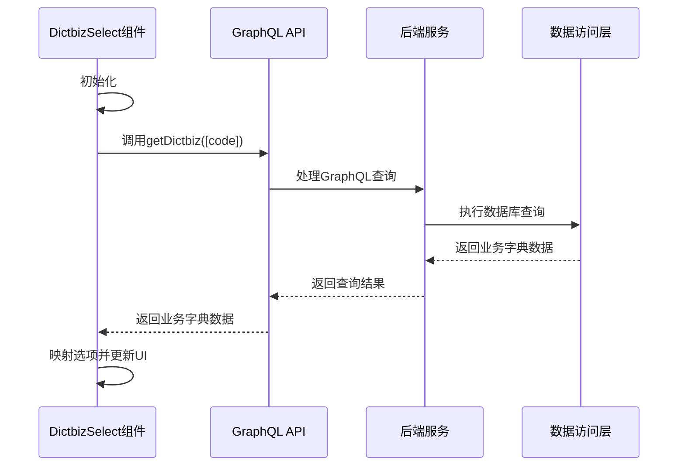

**Diagram sources**
- [DictbizSelect.vue](https://github.com/sail-sail/nest/blob/main/pc/src/components/DictbizSelect.vue#L634-L695)
- [dictbiz_detail_dao.rs](https://github.com/sail-sail/nest/blob/main/rust/generated/base/dictbiz_detail/dictbiz_detail_dao.rs#L61-L116)

### 数据加载触发条件
- 组件初始化时自动加载
- code属性变化时重新加载
- 下拉框显示时刷新宽度
- 手动调用refresh方法

**Section sources**
- [DictSelect.vue](https://github.com/sail-sail/nest/blob/main/pc/src/components/DictSelect.vue#L634-L694)
- [DictbizSelect.vue](https://github.com/sail-sail/nest/blob/main/pc/src/components/DictbizSelect.vue#L634-L695)

## 缓存与异步更新策略

### 缓存机制
系统采用多层缓存策略来提高数据访问性能：

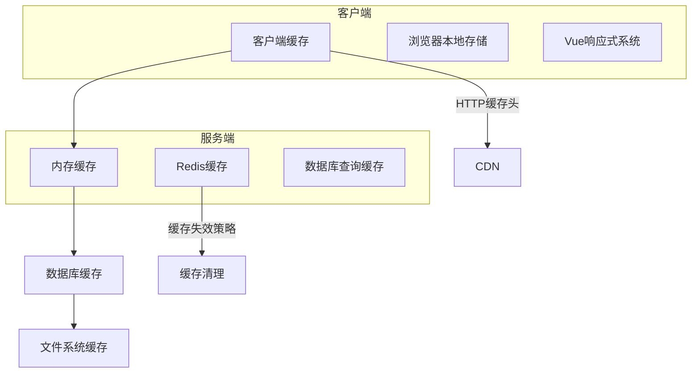

**缓存特点**
- 客户端使用Vue的响应式系统进行内存缓存
- 服务端使用Redis进行分布式缓存
- 数据库查询结果缓存
- HTTP缓存头支持CDN缓存

### 异步更新逻辑
组件采用异步更新机制确保UI响应性：

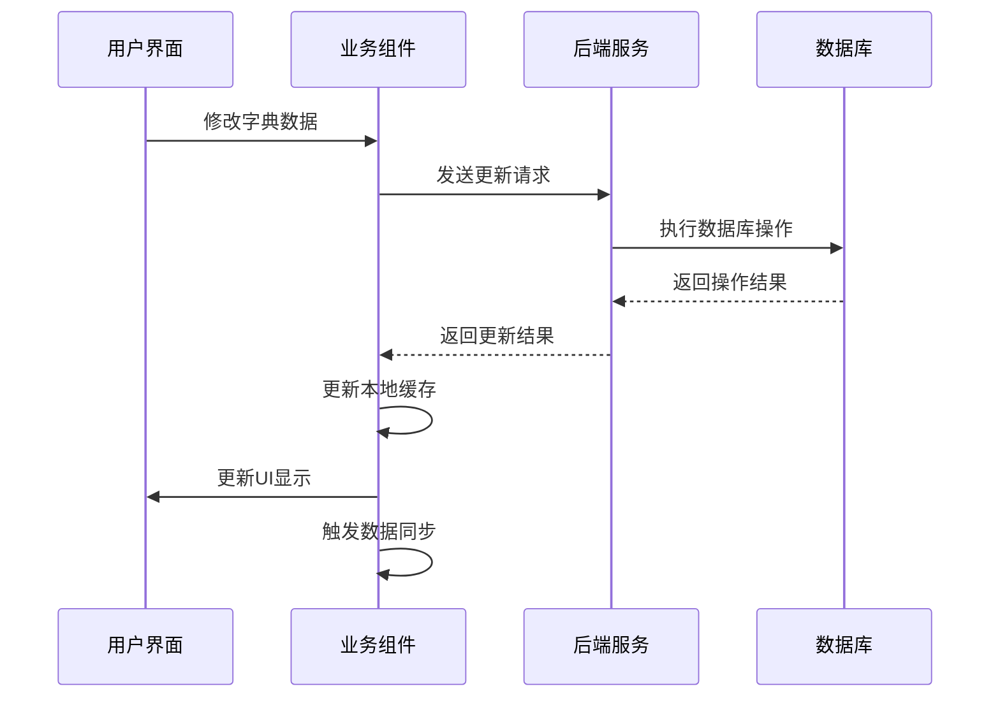

**异步更新特点**
- 使用Promise处理异步操作
- 采用nextTick确保DOM更新
- 错误处理和重试机制
- 更新完成后的回调通知

**Diagram sources**
- [DictSelect.vue](https://github.com/sail-sail/nest/blob/main/pc/src/components/DictSelect.vue#L634-L694)
- [DictbizSelect.vue](https://github.com/sail-sail/nest/blob/main/pc/src/components/DictbizSelect.vue#L634-L695)

## 关联数据展示处理

### LinkList组件工作流程
LinkList组件通过以下流程处理关联数据展示：

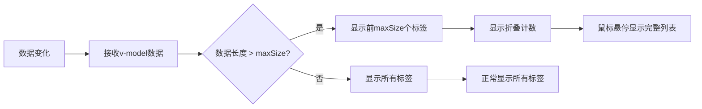

**处理逻辑**
- 监听modelValue属性变化
- 根据maxSize属性决定显示方式
- 超出数量时显示折叠标签
- 提供鼠标悬停查看完整列表的功能

### 模板集成示例
在业务模板中，LinkList组件通常与其他组件配合使用：

```mermaid
erDiagram
USER ||--o{ ROLE : "拥有"
ROLE ||--o{ PERMISSION : "包含"
USER ||--o{ ORGANIZATION : "属于"
classDict {
code: string
lbl: string
val: string
}
linkList {
modelValue: string[]
maxSize: number
collapseTags: boolean
}
classDict --> linkList : "数据源"
```

**Section sources**
- [LinkList.vue](https://github.com/sail-sail/nest/blob/main/pc/src/components/LinkList.vue#L0-L97)
- [List.vue](https://github.com/sail-sail/nest/blob/main/codegen/src/template/pc/src/views/[[mod_slash_table]]/List.vue#L2189-L2222)

## 文件上传流程与状态管理

### UploadImage组件上传流程
UploadImage组件的文件上传流程如下：

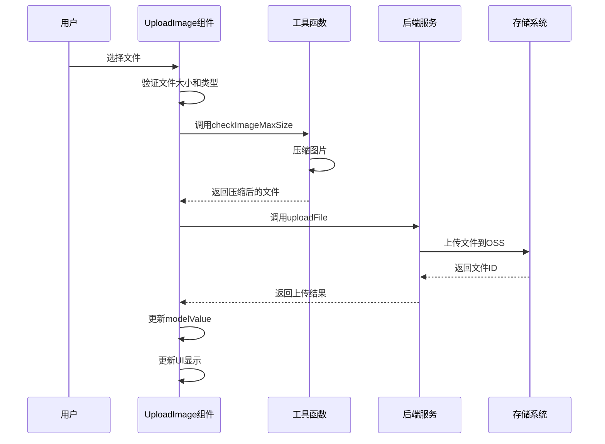

### 状态管理机制
组件采用精细化的状态管理：

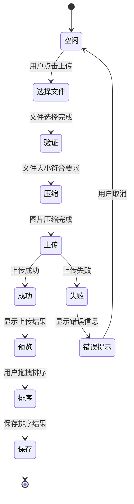

**状态特点**
- loading状态控制上传过程的UI显示
- modelValue管理已上传文件的ID列表
- thumbList管理缩略图URL
- urlList管理完整图片URL
- 支持撤销操作的状态管理

**Diagram sources**
- [UploadImage.vue](https://github.com/sail-sail/nest/blob/main/pc/src/components/UploadImage.vue#L309-L371)
- [oss_router.rs](https://github.com/sail-sail/nest/blob/main/rust/generated/common/oss/oss_router.rs#L72-L118)

## 实际业务场景集成示例

### 字典选择组件集成
在实际业务场景中，DictSelect和DictbizSelect组件的集成示例如下：

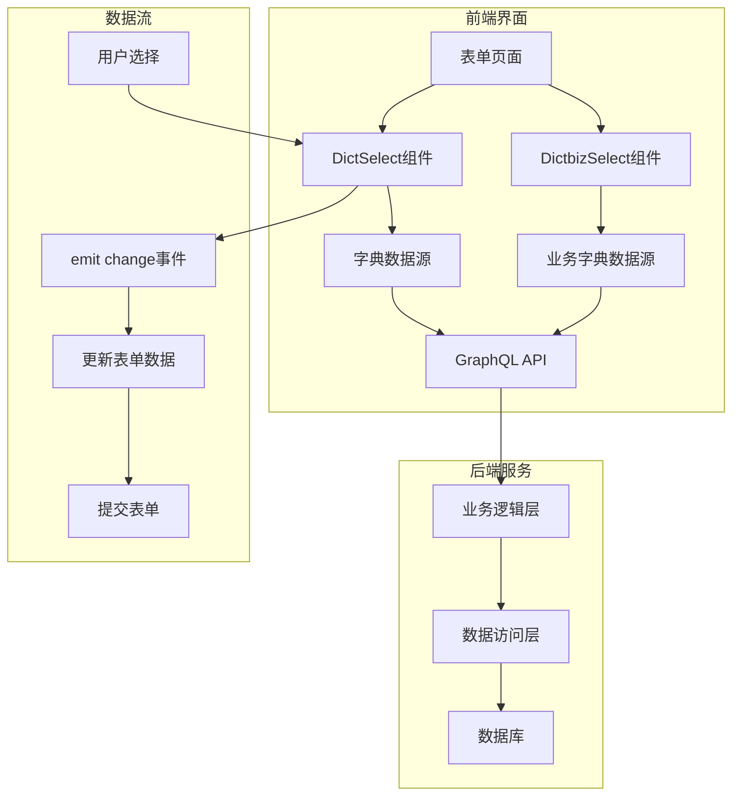

### 配置数据源
```typescript
// 配置DictSelect数据源
const dictConfig = {
  code: 'user_status',
  optionsMap: (item) => ({
    label: item.lbl,
    value: item.val
  }),
  multiple: false,
  placeholder: '请选择用户状态'
};

// 配置DictbizSelect数据源
const dictbizConfig = {
  code: 'order_type',
  optionsMap: (item) => ({
    label: item.lbl,
    value: item.val
  }),
  multiple: true,
  placeholder: '请选择订单类型'
};
```

### 处理选择事件
```typescript
// 处理选择事件
const handleSelectChange = (value) => {
  console.log('选择的值:', value);
  // 更新表单数据
  formData.status = value;
  // 触发其他业务逻辑
  triggerBusinessLogic(value);
};

// 处理清除事件
const handleClear = () => {
  console.log('已清除选择');
  // 重置相关字段
  resetRelatedFields();
};
```

### 自定义渲染模板
```vue
<DictSelect
  v-model="formData.status"
  :code="statusDictCode"
  :optionsMap="customOptionsMap"
  @change="handleStatusChange"
>
  <!-- 自定义选项模板 -->
  <template #default="{ item }">
    <span :style="{ color: getStatusColor(item.val) }">
      {{ item.lbl }}
    </span>
  </template>
  
  <!-- 自定义头部 -->
  <template #header>
    <el-checkbox v-model="selectAll">全选</el-checkbox>
  </template>
</DictSelect>
```

**Section sources**
- [DictSelect.vue](https://github.com/sail-sail/nest/blob/main/pc/src/components/DictSelect.vue)
- [DictbizSelect.vue](https://github.com/sail-sail/nest/blob/main/pc/src/components/DictbizSelect.vue)
- [UploadImage.vue](https://github.com/sail-sail/nest/blob/main/pc/src/components/UploadImage.vue)

## 权限控制与数据安全

### 权限控制机制
系统采用多层次的权限控制机制：

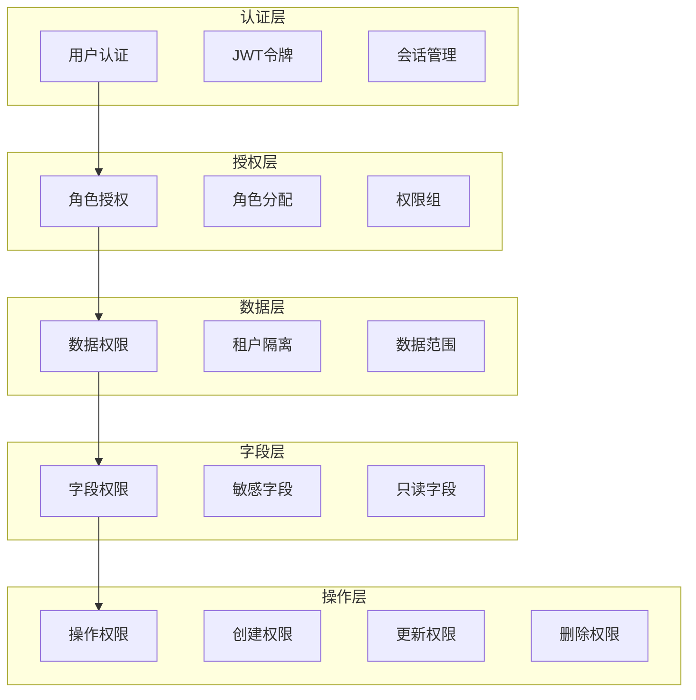

### 数据安全措施
系统实施严格的数据安全措施：

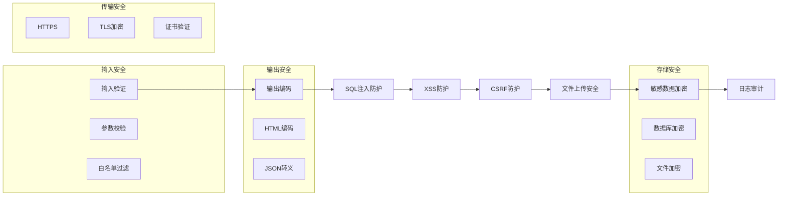

**安全特点**
- 前后端双重验证
- 敏感操作二次确认
- 文件上传类型和大小限制
- 租户数据隔离
- 操作日志记录

**Section sources**
- [request.ts](https://github.com/sail-sail/nest/blob/main/pc/src/utils/request.ts#L153-L207)
- [oss_router.rs](https://github.com/sail-sail/nest/blob/main/rust/generated/common/oss/oss_router.rs#L0-L30)

## 性能调优建议

### 组件性能优化
针对业务数据组件的性能优化建议：

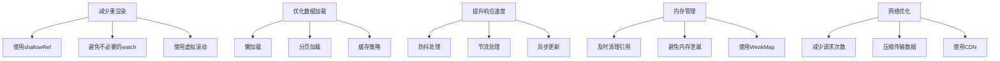

**具体建议**
- 使用$shallowRef优化大型数据集的响应性
- 合理使用watch的deep和immediate选项
- 对大型列表使用虚拟滚动
- 实现数据懒加载和分页
- 使用防抖和节流优化频繁触发的事件
- 及时清理定时器和事件监听器
- 优化GraphQL查询，避免N+1问题
- 使用HTTP缓存头减少重复请求

### 缓存策略优化
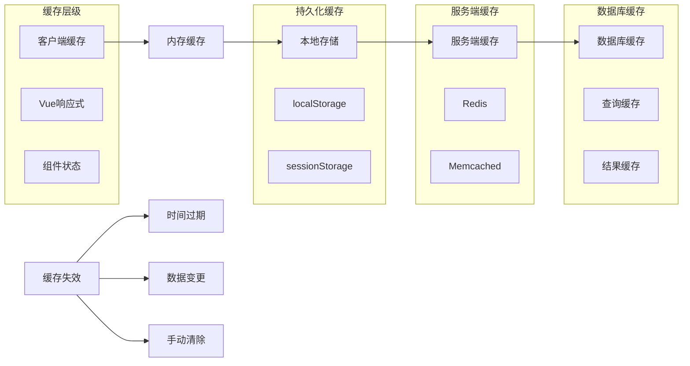

**Section sources**
- [DictSelect.vue](https://github.com/sail-sail/nest/blob/main/pc/src/components/DictSelect.vue)
- [DictbizSelect.vue](https://github.com/sail-sail/nest/blob/main/pc/src/components/DictbizSelect.vue)

## 常见数据同步问题解决方案

### 数据不一致问题
解决数据同步不一致的方案：

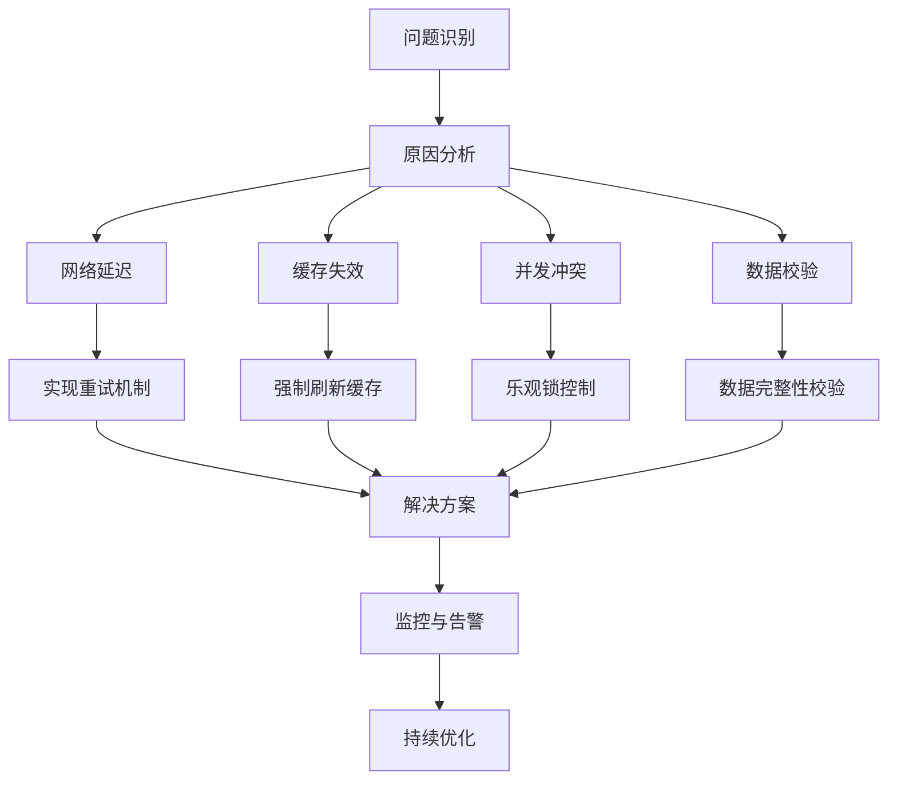

**解决方案**
- 实现数据同步状态监控
- 添加数据版本号控制
- 使用WebSocket实现实时同步
- 建立数据校验机制
- 实现自动重试和错误恢复

### 网络异常处理
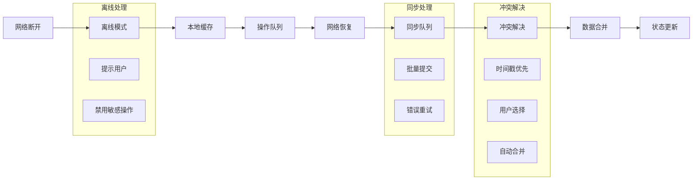

**处理策略**
- 检测网络状态变化
- 提供离线操作支持
- 建立操作队列机制
- 实现智能冲突解决
- 提供用户确认界面
- 记录同步日志

**Section sources**
- [DictSelect.vue](https://github.com/sail-sail/nest/blob/main/pc/src/components/DictSelect.vue)
- [DictbizSelect.vue](https://github.com/sail-sail/nest/blob/main/pc/src/components/DictbizSelect.vue)
- [UploadImage.vue](https://github.com/sail-sail/nest/blob/main/pc/src/components/UploadImage.vue)