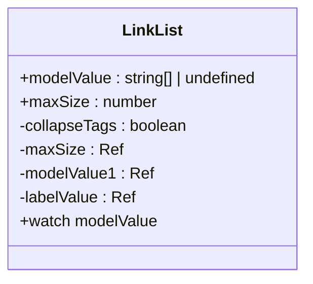
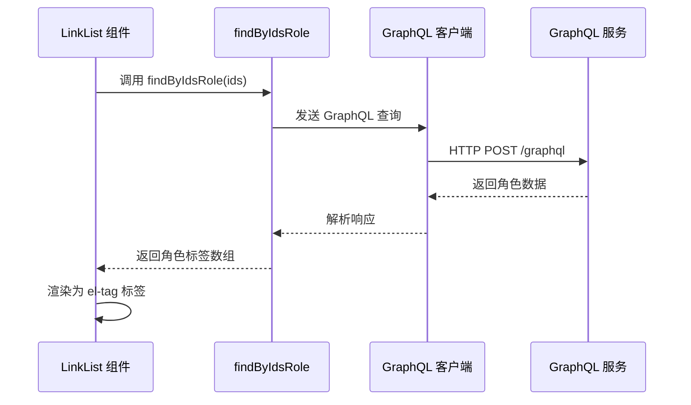
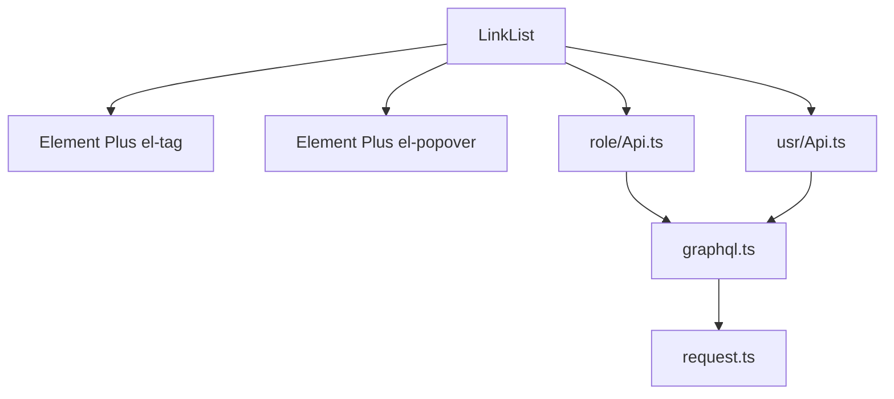

# 关联数据列表组件


**本文档引用的文件**  
- [LinkList.vue](https://github.com/sail-sail/nest/blob/main/pc/src/components/LinkList.vue)
- [graphql.ts](https://github.com/sail-sail/nest/blob/main/pc/src/utils/graphql.ts)
- [Api.ts](https://github.com/sail-sail/nest/blob/main/pc/src/components/Api.ts)
- [usr/Api.ts](https://github.com/sail-sail/nest/blob/main/pc/src/views/base/usr/Api.ts)
- [role/Api.ts](https://github.com/sail-sail/nest/blob/main/pc/src/views/base/role/Api.ts)


## 目录
1. [简介](#简介)
2. [项目结构](#项目结构)
3. [核心组件](#核心组件)
4. [架构概述](#架构概述)
5. [详细组件分析](#详细组件分析)
6. [依赖分析](#依赖分析)
7. [性能考虑](#性能考虑)
8. [故障排除指南](#故障排除指南)
9. [结论](#结论)

## 简介
`LinkList` 组件是一个用于展示实体间关联关系的前端组件，广泛应用于用户管理、组织架构等模块。该组件通过 GraphQL 查询获取关联数据，并支持标签折叠、最大显示数量控制等可配置功能。它能够高效地展示如用户与角色、部门与员工之间的多对多关系，并通过标签形式直观呈现。组件设计注重用户体验，支持大数据量下的性能优化，如分页加载和虚拟滚动。

## 项目结构
项目采用前后端分离架构，前端基于 Vue 3 和 TypeScript 构建，后端使用 Rust 和 async-graphql 框架。`LinkList` 组件位于 `pc/src/components/` 目录下，是通用组件库的一部分。关联数据的获取依赖于 `pc/src/utils/graphql.ts` 中封装的 GraphQL 客户端，而具体的业务数据查询逻辑则分散在各个业务模块的 `Api.ts` 文件中，如用户管理模块的 `usr/Api.ts`。

## 核心组件
`LinkList` 组件的核心功能是接收一个字符串数组（`modelValue`），并将其渲染为一系列 `el-tag` 标签。当标签数量超过预设的最大值（`maxSize`）时，超出部分会被折叠，并通过一个可点击的 `+N` 标签展示，点击后可展开查看全部。该组件通过 `watch` 监听 `modelValue` 的变化，动态更新内部状态 `modelValue1` 和 `labelValue`，确保视图与数据同步。

**组件来源**
- [LinkList.vue](https://github.com/sail-sail/nest/blob/main/pc/src/components/LinkList.vue#L1-L97)

## 架构概述
系统整体架构遵循典型的分层模式。前端通过 GraphQL API 与后端交互，后端服务通过 DAO 层访问数据库。`LinkList` 组件作为表现层的一部分，通过调用业务 API（如 `findByIdsRole`）获取关联数据。这些 API 函数封装了 GraphQL 查询逻辑，利用 `graphql.ts` 中的 `query` 函数发送请求并处理响应。数据流为：组件 → 业务 API → GraphQL 客户端 → 后端 GraphQL 服务 → 数据库。

```mermaid
graph TB
A[LinkList 组件] --> B[业务 API (如 findByIdsRole)]
B --> C[GraphQL 客户端 (query)]
C --> D[GraphQL 服务]
D --> E[数据库]
```

**图表来源**  
- [LinkList.vue](https://github.com/sail-sail/nest/blob/main/pc/src/components/LinkList.vue#L1-L97)
- [graphql.ts](https://github.com/sail-sail/nest/blob/main/pc/src/utils/graphql.ts#L1-L413)
- [role/Api.ts](https://github.com/sail-sail/nest/blob/main/pc/src/views/base/role/Api.ts#L318-L390)

## 详细组件分析

### LinkList 组件分析
`LinkList` 是一个轻量级的展示型组件，主要用于在有限空间内优雅地展示多个关联项。

#### 组件结构


**图表来源**  
- [LinkList.vue](https://github.com/sail-sail/nest/blob/main/pc/src/components/LinkList.vue#L1-L97)

#### 数据获取流程
当需要展示用户关联的角色时，父组件会调用 `findByIdsRole` API，传入用户的角色 ID 列表。该 API 构造一个 GraphQL 查询，请求角色的 ID 和标签（lbl），后端服务处理查询并返回数据，前端将角色标签数组传递给 `LinkList` 的 `modelValue` 属性进行渲染。



**图表来源**  
- [role/Api.ts](https://github.com/sail-sail/nest/blob/main/pc/src/views/base/role/Api.ts#L318-L390)
- [graphql.ts](https://github.com/sail-sail/nest/blob/main/pc/src/utils/graphql.ts#L1-L413)
- [LinkList.vue](https://github.com/sail-sail/nest/blob/main/pc/src/components/LinkList.vue#L1-L97)

### 可配置性与使用模式
`LinkList` 组件通过 `props` 提供了良好的可配置性：
- `modelValue`: 接收要展示的字符串数组，是核心数据源。
- `maxSize`: 控制在折叠前最多显示的标签数量，默认为 3。

在用户管理模块中，当展示一个用户时，系统会获取该用户的 `role_ids`，然后调用 `findByIdsRole` 获取对应的角色标签，最后将标签数组传给 `LinkList`。在组织架构中展示部门关联员工时，逻辑类似，通过 `dept_ids` 获取员工信息。

**组件来源**
- [LinkList.vue](https://github.com/sail-sail/nest/blob/main/pc/src/components/LinkList.vue#L1-L97)
- [usr/Api.ts](https://github.com/sail-sail/nest/blob/main/pc/src/views/base/usr/Api.ts#L590-L661)

## 依赖分析
`LinkList` 组件的直接依赖较少，主要依赖 Element Plus 的 `el-tag` 和 `el-popover` 组件。其功能的实现高度依赖于项目的 GraphQL 数据获取体系。业务逻辑层的 `Api.ts` 文件是连接组件与后端服务的桥梁，而 `graphql.ts` 则提供了统一的网络请求和错误处理机制。



**图表来源**  
- [LinkList.vue](https://github.com/sail-sail/nest/blob/main/pc/src/components/LinkList.vue#L1-L97)
- [role/Api.ts](https://github.com/sail-sail/nest/blob/main/pc/src/views/base/role/Api.ts#L318-L390)
- [usr/Api.ts](https://github.com/sail-sail/nest/blob/main/pc/src/views/base/usr/Api.ts#L590-L661)
- [graphql.ts](https://github.com/sail-sail/nest/blob/main/pc/src/utils/graphql.ts#L1-L413)

## 性能考虑
对于 `LinkList` 组件本身，其性能开销极低，因为它只负责渲染一个字符串数组。然而，其性能瓶颈在于关联数据的获取。项目通过以下方式优化：
1.  **按需查询**：API 函数（如 `findAllRole`）允许指定查询字段，避免获取不必要的数据。
2.  **分页加载**：在列表页等场景，使用 `PageInput` 参数进行分页，减少单次请求的数据量。
3.  **缓存**：GraphQL 客户端对查询结果进行缓存，避免重复请求相同数据。
4.  **虚拟滚动**：在数据量极大的列表中，可结合虚拟滚动技术，只渲染可视区域内的元素。

虽然 `LinkList` 本身不直接处理分页，但其数据源（如角色列表）的获取是分页的，这间接保证了整体性能。

## 故障排除指南
- **问题：`LinkList` 未显示任何标签**
  - **检查**：确认父组件传递的 `modelValue` 是否为非空数组。
  - **检查**：确认 `modelValue` 数组中的元素是否为字符串类型。
- **问题：关联数据获取失败**
  - **检查**：查看浏览器开发者工具的网络面板，确认 GraphQL 请求是否成功，检查返回的错误信息。
  - **检查**：确认传递给 API 函数的 ID 列表是否正确且存在。
  - **检查**：确认用户权限是否足够访问相关数据。

**组件来源**
- [LinkList.vue](https://github.com/sail-sail/nest/blob/main/pc/src/components/LinkList.vue#L1-L97)
- [graphql.ts](https://github.com/sail-sail/nest/blob/main/pc/src/utils/graphql.ts#L1-L413)

## 结论
`LinkList` 组件是一个简单而有效的 UI 组件，专注于展示实体间的关联关系。它通过与项目强大的 GraphQL 数据层集成，实现了灵活、高效的数据获取和展示。其可配置的折叠功能提升了在有限空间内的信息密度。通过遵循项目约定的 API 调用模式，开发者可以轻松地在用户管理、组织架构等场景中复用此组件，保持了代码的一致性和可维护性。