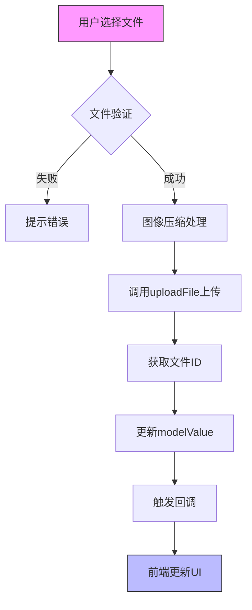
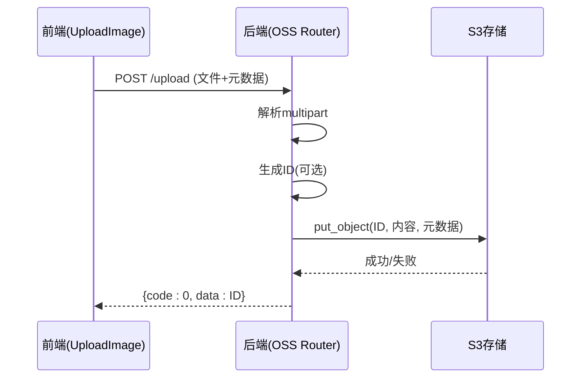

# 图片上传组件


**本文档引用文件**  
- [UploadImage.vue](https://github.com/sail-sail/nest/blob/main/pc/src/components/UploadImage.vue)
- [oss_dao.rs](https://github.com/sail-sail/nest/blob/main/rust/generated/common/oss/oss_dao.rs)
- [oss_service.rs](https://github.com/sail-sail/nest/blob/main/rust/generated/common/oss/oss_service.rs)
- [oss_router.rs](https://github.com/sail-sail/nest/blob/main/rust/generated/common/oss/oss_router.rs)
- [image_util.ts](https://github.com/sail-sail/nest/blob/main/pc/src/utils/image_util.ts)


## 目录
1. [简介](#简介)
2. [组件结构与流程](#组件结构与流程)
3. [核心上传流程](#核心上传流程)
4. [安全与验证机制](#安全与验证机制)
5. [后端OSS服务集成](#后端oss服务集成)
6. [回调与业务数据关联](#回调与业务数据关联)
7. [最佳实践示例](#最佳实践示例)
8. [性能调优建议](#性能调优建议)
9. [错误处理与重试机制](#错误处理与重试机制)

## 简介
`UploadImage` 组件是一个用于实现图片上传功能的前端组件，支持多图上传、压缩、预览、排序和删除。该组件与后端OSS服务深度集成，使用S3兼容的存储协议进行文件直传，并通过预签名URL机制保障上传安全。上传后的文件可通过ID生成访问链接，并支持缩略图、格式转换和CDN加速。

## 组件结构与流程



**图示来源**  
- [UploadImage.vue](https://github.com/sail-sail/nest/blob/main/pc/src/components/UploadImage.vue#L309-L371)
- [image_util.ts](https://github.com/sail-sail/nest/blob/main/pc/src/utils/image_util.ts#L0-L80)

## 核心上传流程

### 1. 用户选择文件
用户通过点击“+”按钮触发隐藏的 `<input type="file">`，选择图片文件。

### 2. 前端验证
组件在上传前进行多项验证：
- 文件大小限制（`maxFileSize`）
- 文件类型限制（`accept` 属性）
- 最大上传数量（`maxSize`）

若验证失败，使用 `ElMessage.error` 提示用户。

### 3. 图像压缩处理
调用 `checkImageMaxSize` 函数对图像进行压缩：
- 自动压缩为 WebP 格式
- 限制最大宽度和高度（默认 1920x1080）
- 使用 `@jsquash/webp` 和 `@jsquash/resize` 进行无损压缩

### 4. 调用上传接口
通过 `uploadFile` 方法将文件上传至后端，返回唯一文件ID。

### 5. 更新模型值
将返回的文件ID（或多个ID用逗号分隔）通过 `emit("update:modelValue")` 同步到父组件。

**本节来源**  
- [UploadImage.vue](https://github.com/sail-sail/nest/blob/main/pc/src/components/UploadImage.vue#L309-L371)
- [image_util.ts](https://github.com/sail-sail/nest/blob/main/pc/src/utils/image_util.ts#L0-L80)

## 安全与验证机制

### 文件类型验证
通过 `accept` 属性限制可上传的MIME类型：
```ts
accept: "image/webp,image/png,image/jpeg,image/svg+xml"
```

### 大小限制
- 单文件大小限制：`maxFileSize`（默认 50MB）
- 图像尺寸限制：`maxImageWidth` 和 `maxImageHeight`
- 最多上传数量：`maxSize`（默认 1 张）

### 安全元数据
上传时，后端自动添加以下元数据：
- `x-amz-meta-filename`：原始文件名
- `x-amz-meta-is_public`：是否公开访问
- `x-amz-meta-tenant_id`：租户ID（用于多租户隔离）
- `x-amz-meta-db`：数据库标识

**本节来源**  
- [UploadImage.vue](https://github.com/sail-sail/nest/blob/main/pc/src/components/UploadImage.vue#L309-L371)
- [oss_dao.rs](https://github.com/sail-sail/nest/blob/main/rust/generated/common/oss/oss_dao.rs#L59-L89)

## 后端OSS服务集成

### 1. 上传接口
后端提供 `/upload` 接口，接收 `multipart/form-data` 格式文件。

### 2. S3 存储集成
使用 `s3` Rust 库与兼容S3协议的对象存储服务通信：
- 配置 `oss_endpoint`、`oss_accesskey`、`oss_secretkey`
- 使用 `Bucket::new` 创建存储桶实例
- 支持路径风格访问（`with_path_style()`）

### 3. 文件ID生成
若未指定ID，则调用 `get_short_uuid()` 生成短UUID作为文件唯一标识。

### 4. 元数据写入
上传时自动写入文件名、租户ID、数据库标识等元数据，用于权限控制和溯源。



**图示来源**  
- [oss_router.rs](https://github.com/sail-sail/nest/blob/main/rust/generated/common/oss/oss_router.rs#L0-L238)
- [oss_dao.rs](https://github.com/sail-sail/nest/blob/main/rust/generated/common/oss/oss_dao.rs#L59-L89)

## 回调与业务数据关联

上传成功后，组件通过 `emit("update:modelValue", id)` 将文件ID返回给父组件。父组件可将该ID关联到业务模型，例如：

```ts
// 用户头像上传
user.avatarId = uploadedId;

// 商品图片管理
product.imageIds = [id1, id2, id3];
```

通过 `getDownloadUrl({ id })` 或 `getImgUrl({ id })` 可生成访问URL，支持：
- 直接下载
- 缩略图生成（支持宽高、格式、质量参数）
- CDN加速（通过反向代理）

## 最佳实践示例

### 用户头像上传
```vue
<UploadImage
  v-model="user.avatarId"
  :maxSize="1"
  :maxFileSize="1024 * 1024 * 2"
  accept="image/jpeg,image/png"
  :compress="true"
  :maxImageWidth="400"
  :maxImageHeight="400"
/>
```

### 商品图片管理
```vue
<UploadImage
  v-model="product.imageIds"
  :maxSize="5"
  :maxFileSize="1024 * 1024 * 5"
  accept="image/*"
  :compress="true"
  itemHeight="120"
/>
```

**本节来源**  
- [UploadImage.vue](https://github.com/sail-sail/nest/blob/main/pc/src/components/UploadImage.vue#L309-L371)

## 性能调优建议

### 1. 图像压缩
启用 `compress` 选项，自动将图片压缩为 WebP 格式，平均可减少 50% 体积。

### 2. 缩略图服务
使用 `/img` 接口按需生成缩略图，避免前端加载大图：
```
/img?id=xxx&w=200&h=200&f=webp&q=80
```

### 3. CDN 加速
将 `/download` 和 `/img` 接口接入CDN，提升全球访问速度。

### 4. 浏览器缓存
服务端返回 `ETag` 和 `Last-Modified`，支持304缓存。

### 5. 内存优化
使用 `get_object_stream` 流式读取大文件，避免内存溢出。

## 错误处理与重试机制

### 前端错误处理
- 文件过大：提示“文件大小不能超过 {0}M”
- 数量超限：提示“最多只能上传 {0} 张图片”
- 上传失败：`try...finally` 确保 `loading` 状态重置

### 后端错误处理
- 404：存储桶未找到
- 500：内部错误（如S3连接失败）
- 自动重试：`s3` 库内置重试机制

### 重试建议
前端可结合 `uploadFile` 封装重试逻辑，例如：
```ts
async function uploadWithRetry(file, retries = 3) {
  for (let i = 0; i < retries; i++) {
    try {
      return await uploadFile(file);
    } catch (err) {
      if (i === retries - 1) throw err;
      await sleep(1000 * (i + 1));
    }
  }
}
```

**本节来源**  
- [UploadImage.vue](https://github.com/sail-sail/nest/blob/main/pc/src/components/UploadImage.vue#L309-L371)
- [oss_dao.rs](https://github.com/sail-sail/nest/blob/main/rust/generated/common/oss/oss_dao.rs#L59-L89)
- [oss_service.rs](https://github.com/sail-sail/nest/blob/main/rust/generated/common/oss/oss_service.rs#L0-L56)