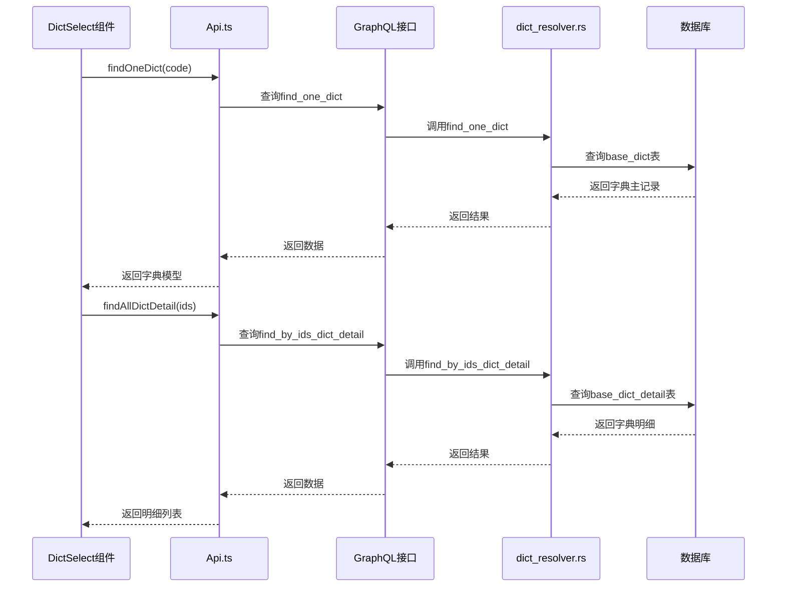
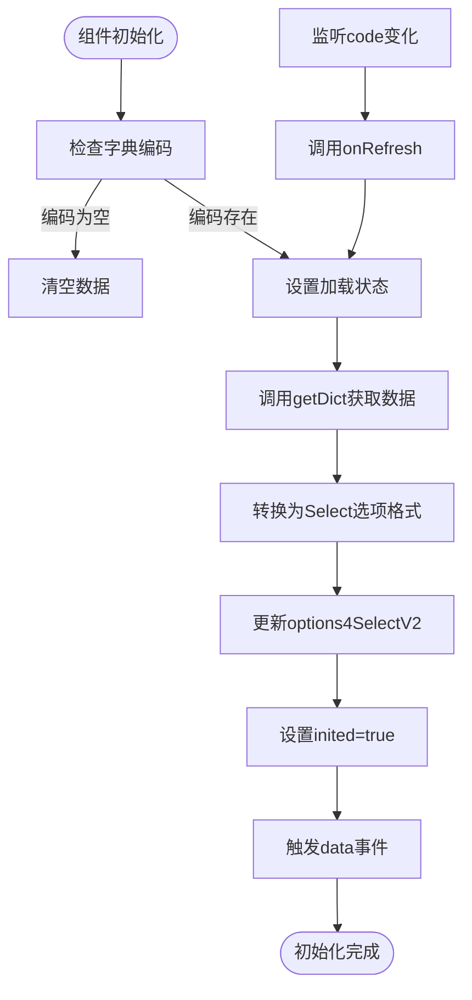
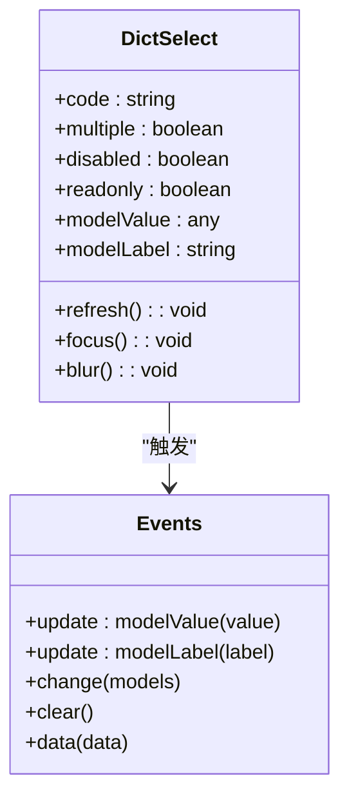

# 字典选择组件

**本文档引用的文件**  
- [DictSelect.vue](https://github.com/sail-sail/nest/blob/main/pc/src/components/DictSelect.vue)
- [Api.ts](https://github.com/sail-sail/nest/blob/main/pc/src/components/Api.ts)
- [dict_resolver.rs](https://github.com/sail-sail/nest/blob/main/rust/generated/base/dict/dict_resolver.rs)
- [base.sql](https://github.com/sail-sail/nest/blob/main/codegen/src/tables/base/base.sql)

## 目录
1. [介绍](#介绍)
2. [核心组件](#核心组件)
3. [数据交互机制](#数据交互机制)
4. [异步加载与缓存策略](#异步加载与缓存策略)
5. [配置选项详解](#配置选项详解)
6. [表单集成与事件处理](#表单集成与事件处理)
7. [权限控制机制](#权限控制机制)
8. [性能优化建议](#性能优化建议)

## 介绍
`DictSelect` 是一个用于从系统字典中选择值的 Vue 组件，广泛应用于表单和数据录入场景。该组件通过 GraphQL 接口与后端交互，支持多选、禁用、只读等多种状态，并具备良好的用户体验设计。组件封装了字典数据的获取、缓存和展示逻辑，开发者只需传入字典编码即可快速集成。

## 核心组件

`DictSelect` 组件基于 Element Plus 的 `ElSelectV2` 构建，结合项目自身的 `DictDetailDialog` 实现新增字典项功能。组件支持两种显示模式：可编辑选择模式和只读展示模式，根据 `readonly` 属性自动切换。

**Section sources**
- [DictSelect.vue](https://github.com/sail-sail/nest/blob/main/pc/src/components/DictSelect.vue#L1-L803)

## 数据交互机制

`DictSelect` 组件通过调用 `findOneDict` 和 `findAllDictDetail` API 方法从后端获取字典数据。这些方法最终通过 GraphQL 查询 `base_dict` 和 `base_dict_detail` 表获取数据。

**Diagram sources**
- [DictSelect.vue](https://github.com/sail-sail/nest/blob/main/pc/src/components/DictSelect.vue#L150-L160)
- [Api.ts](https://github.com/sail-sail/nest/blob/main/pc/src/components/Api.ts#L1-L57)
- [dict_resolver.rs](https://github.com/sail-sail/nest/blob/main/rust/generated/base/dict/dict_resolver.rs#L1-L454)

## 异步加载与缓存策略

组件在初始化时通过 `onRefresh` 方法异步加载字典数据。数据加载完成后，会将原始数据转换为 `ElSelectV2` 所需的 `options` 格式，并存储在 `options4SelectV2` 中。

组件通过 `inited` 状态标记来管理加载状态，避免重复请求。当 `props.code` 变化时，会自动触发重新加载。已加载的数据会缓存在组件实例中，直到组件销毁或字典编码变更。

**Diagram sources**
- [DictSelect.vue](https://github.com/sail-sail/nest/blob/main/pc/src/components/DictSelect.vue#L300-L350)
- [DictSelect.vue](https://github.com/sail-sail/nest/blob/main/pc/src/components/DictSelect.vue#L500-L550)

## 配置选项详解

`DictSelect` 提供了丰富的配置属性，满足不同场景需求：

| 属性 | 类型 | 默认值 | 说明 |
|------|------|--------|------|
| code | string | 必填 | 字典编码，用于标识要加载的字典类型 |
| multiple | boolean | false | 是否支持多选 |
| disabled | boolean | undefined | 是否禁用选择 |
| readonly | boolean | undefined | 是否为只读模式 |
| placeholder | string | undefined | 输入框占位符 |
| modelValue | any | undefined | 绑定的选中值 |
| modelLabel | string | undefined | 显示的标签文本 |
| showSelectAll | boolean | true | 多选时是否显示全选选项 |
| hasSelectAdd | boolean | false | 是否显示新增选项按钮 |
| readonlyPlaceholder | string | "" | 只读模式下的占位文本 |
| readonlyCollapseTags | boolean | true | 只读多选时是否折叠标签 |
| readonlyMaxCollapseTags | number | 1 | 只读模式下最多显示的标签数 |

**Section sources**
- [DictSelect.vue](https://github.com/sail-sail/nest/blob/main/pc/src/components/DictSelect.vue#L100-L150)

## 表单集成与事件处理

在表单中使用 `DictSelect` 时，可通过 `v-model` 绑定选中值。组件会触发多种事件供父组件监听：

**Diagram sources**
- [DictSelect.vue](https://github.com/sail-sail/nest/blob/main/pc/src/components/DictSelect.vue#L80-L100)
- [DictSelect.vue](https://github.com/sail-sail/nest/blob/main/pc/src/components/DictSelect.vue#L200-L250)

## 权限控制机制

组件通过后端 GraphQL 接口的权限检查机制确保用户只能访问其有权限查看的字典项。在 `dict_resolver.rs` 中，`find_one_dict` 等查询方法会自动进行权限验证。

当用户尝试新增字典项时，组件会先检查用户是否有对应字典的添加权限。权限验证通过后端的 `use_permit` 函数实现，确保只有授权用户才能创建新的字典条目。

**Section sources**
- [dict_resolver.rs](https://github.com/sail-sail/nest/blob/main/rust/generated/base/dict/dict_resolver.rs#L200-L250)

## 性能优化建议

1. **合理使用缓存**：组件已内置数据缓存，避免重复请求相同字典数据
2. **大数据量处理**：对于包含大量选项的字典，建议启用 `filterable` 属性支持搜索
3. **虚拟滚动**：Element Plus 的 `ElSelectV2` 支持虚拟滚动，可处理数千个选项而不会卡顿
4. **按需加载**：确保只在需要时才渲染 `DictSelect` 组件，避免不必要的初始化
5. **避免频繁刷新**：不要在短时间内频繁调用 `refresh` 方法

**Section sources**
- [DictSelect.vue](https://github.com/sail-sail/nest/blob/main/pc/src/components/DictSelect.vue#L500-L550)