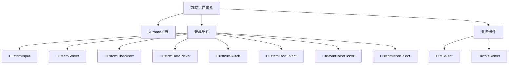
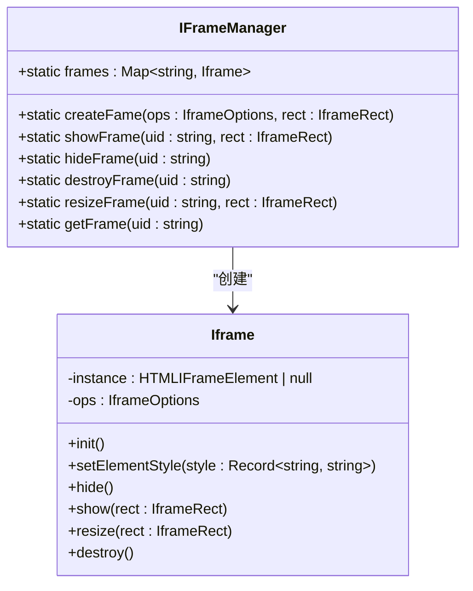
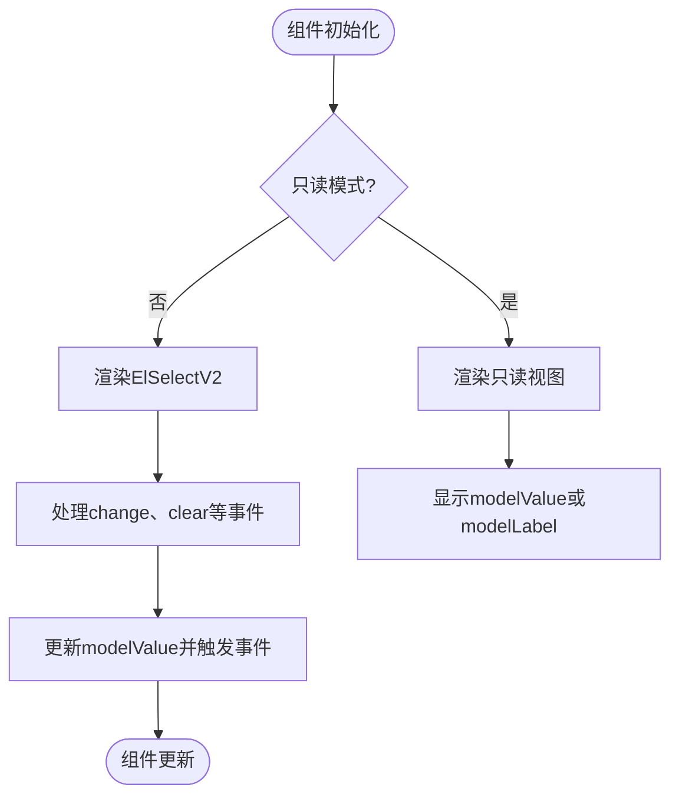
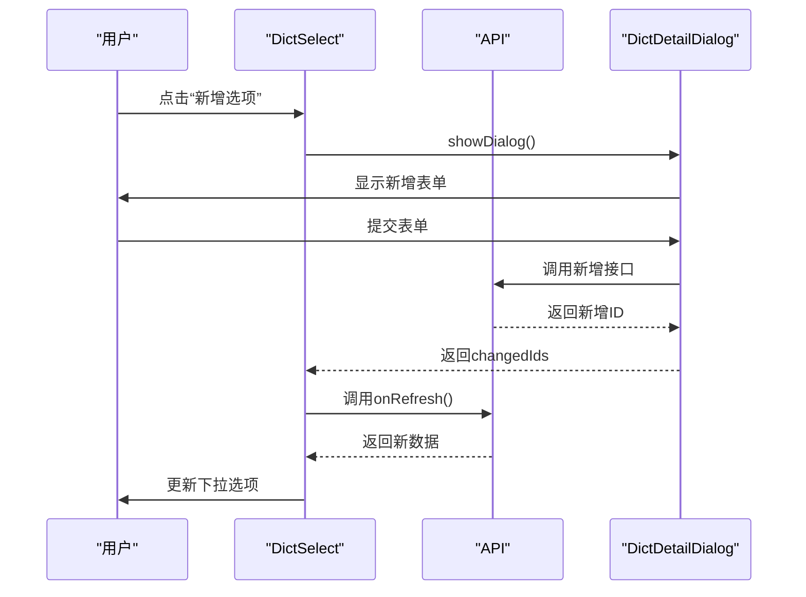

# 前端组件体系


**本文档引用的文件**  
- [KFrame.vue](https://github.com/sail-sail/nest/blob/main/pc/src/components/KFrame/KFrame.vue)
- [core.ts](https://github.com/sail-sail/nest/blob/main/pc/src/components/KFrame/core.ts)
- [CustomInput.vue](https://github.com/sail-sail/nest/blob/main/pc/src/components/CustomInput.vue)
- [CustomSelect.vue](https://github.com/sail-sail/nest/blob/main/pc/src/components/CustomSelect.vue)
- [DictSelect.vue](https://github.com/sail-sail/nest/blob/main/pc/src/components/DictSelect.vue)
- [DictbizSelect.vue](https://github.com/sail-sail/nest/blob/main/pc/src/components/DictbizSelect.vue)
- [CustomCheckbox.vue](https://github.com/sail-sail/nest/blob/main/pc/src/components/CustomCheckbox.vue)
- [CustomDatePicker.vue](https://github.com/sail-sail/nest/blob/main/pc/src/components/CustomDatePicker.vue)
- [CustomSwitch.vue](https://github.com/sail-sail/nest/blob/main/pc/src/components/CustomSwitch.vue)
- [CustomTreeSelect.vue](https://github.com/sail-sail/nest/blob/main/pc/src/components/CustomTreeSelect.vue)
- [CustomColorPicker.vue](https://github.com/sail-sail/nest/blob/main/pc/src/components/CustomColorPicker.vue)
- [CustomIconSelect.vue](https://github.com/sail-sail/nest/blob/main/pc/src/components/CustomIconSelect.vue)


## 目录
1. [简介](#简介)
2. [项目结构](#项目结构)
3. [核心组件](#核心组件)
4. [KFrame框架机制](#kframe框架机制)
5. [表单组件封装](#表单组件封装)
6. [业务组件与字典交互](#业务组件与字典交互)
7. [组件使用示例](#组件使用示例)
8. [响应式与兼容性](#响应式与兼容性)
9. [最佳实践与问题解决](#最佳实践与问题解决)

## 简介
本文档详细阐述了基于Vue 3的前端组件体系，涵盖PC端与移动端的UI组件设计与实现。重点分析KFrame框架的核心机制、表单组件（如CustomInput、CustomSelect）的封装逻辑、业务组件（如DictSelect、DictbizSelect）与字典数据的交互方式，并提供组件使用的代码示例、响应式设计实现及跨浏览器兼容性说明。

## 项目结构
项目采用模块化结构，主要组件位于`pc/src/components`目录下，包括KFrame框架、各类表单输入组件及业务选择组件。组件通过Vue 3的Composition API和TypeScript实现，支持响应式更新和类型安全。

**组件结构图**


**图示来源**
- [KFrame.vue](https://github.com/sail-sail/nest/blob/main/pc/src/components/KFrame/KFrame.vue)
- [CustomInput.vue](https://github.com/sail-sail/nest/blob/main/pc/src/components/CustomInput.vue)
- [CustomSelect.vue](https://github.com/sail-sail/nest/blob/main/pc/src/components/CustomSelect.vue)
- [DictSelect.vue](https://github.com/sail-sail/nest/blob/main/pc/src/components/DictSelect.vue)
- [DictbizSelect.vue](https://github.com/sail-sail/nest/blob/main/pc/src/components/DictbizSelect.vue)

**本节来源**
- [KFrame.vue](https://github.com/sail-sail/nest/blob/main/pc/src/components/KFrame/KFrame.vue)
- [CustomInput.vue](https://github.com/sail-sail/nest/blob/main/pc/src/components/CustomInput.vue)
- [CustomSelect.vue](https://github.com/sail-sail/nest/blob/main/pc/src/components/CustomSelect.vue)
- [DictSelect.vue](https://github.com/sail-sail/nest/blob/main/pc/src/components/DictSelect.vue)
- [DictbizSelect.vue](https://github.com/sail-sail/nest/blob/main/pc/src/components/DictbizSelect.vue)

## 核心组件
系统包含多种核心UI组件，支持表单输入、选择、日期、开关等交互功能。所有组件均支持只读模式、禁用状态及国际化，通过`$attrs`透传原生属性，确保灵活性和可扩展性。

**本节来源**
- [CustomInput.vue](https://github.com/sail-sail/nest/blob/main/pc/src/components/CustomInput.vue)
- [CustomSelect.vue](https://github.com/sail-sail/nest/blob/main/pc/src/components/CustomSelect.vue)
- [CustomCheckbox.vue](https://github.com/sail-sail/nest/blob/main/pc/src/components/CustomCheckbox.vue)
- [CustomDatePicker.vue](https://github.com/sail-sail/nest/blob/main/pc/src/components/CustomDatePicker.vue)
- [CustomSwitch.vue](https://github.com/sail-sail/nest/blob/main/pc/src/components/CustomSwitch.vue)

## KFrame框架机制
KFrame组件用于嵌入外部内容，通过iframe实现。其核心逻辑在`core.ts`中，使用`IFrameManager`管理iframe实例的创建、显示、隐藏和销毁。组件支持`keepAlive`属性，确保在非活跃状态下保留iframe状态。

### 布局控制
KFrame通过`getFrameContainerRect`获取容器尺寸，并在`resizeObserver`监听容器变化时动态调整iframe大小。`zIndex`属性控制层叠顺序，确保正确显示。

### 核心逻辑
`IFrameManager`使用`Map`存储iframe实例，通过`uid`唯一标识。`createFame`方法创建或替换iframe，`showFrame`和`hideFrame`控制显示状态，`destroyFrame`清理资源。



**图示来源**
- [KFrame.vue](https://github.com/sail-sail/nest/blob/main/pc/src/components/KFrame/KFrame.vue#L1-L199)
- [core.ts](https://github.com/sail-sail/nest/blob/main/pc/src/components/KFrame/core.ts#L1-L126)

**本节来源**
- [KFrame.vue](https://github.com/sail-sail/nest/blob/main/pc/src/components/KFrame/KFrame.vue#L1-L199)
- [core.ts](https://github.com/sail-sail/nest/blob/main/pc/src/components/KFrame/core.ts#L1-L126)

## 表单组件封装
表单组件如CustomInput、CustomSelect等均采用统一的封装模式：支持`modelValue`双向绑定、`readonly`和`disabled`状态、`placeholder`提示及插槽扩展。

### CustomInput组件
CustomInput封装了`el-input`，支持文本、数字、密码等多种类型。在只读模式下，显示为带边框的文本区域，支持自定义对齐方式（左、中、右）。

### CustomSelect组件
CustomSelect基于`ElSelectV2`，支持单选、多选、全选、设为默认等高级功能。通过`optionsMap`属性自定义选项映射，`findByValues`方法支持按值反查数据。



**图示来源**
- [CustomInput.vue](https://github.com/sail-sail/nest/blob/main/pc/src/components/CustomInput.vue#L1-L253)
- [CustomSelect.vue](https://github.com/sail-sail/nest/blob/main/pc/src/components/CustomSelect.vue#L1-L1011)

**本节来源**
- [CustomInput.vue](https://github.com/sail-sail/nest/blob/main/pc/src/components/CustomInput.vue#L1-L253)
- [CustomSelect.vue](https://github.com/sail-sail/nest/blob/main/pc/src/components/CustomSelect.vue#L1-L1011)

## 业务组件与字典交互
DictSelect和DictbizSelect组件专门用于与系统字典数据交互，通过`code`属性指定字典编码，自动加载对应字典项。

### 数据加载
组件在`onRefresh`方法中调用`getDict`或`getDictbiz` API获取数据，并映射为`ElSelectV2`所需的选项格式。`optionsMap`根据字典项类型（number、time、boolean）自动转换值类型。

### 新增选项
当`hasSelectAdd`为true时，组件底部显示“新增选项”按钮，点击后打开`DictDetailDialog`或`DictbizDetailDialog`，新增后自动刷新选项列表。



**图示来源**
- [DictSelect.vue](https://github.com/sail-sail/nest/blob/main/pc/src/components/DictSelect.vue#L1-L803)
- [DictbizSelect.vue](https://github.com/sail-sail/nest/blob/main/pc/src/components/DictbizSelect.vue#L1-L805)

**本节来源**
- [DictSelect.vue](https://github.com/sail-sail/nest/blob/main/pc/src/components/DictSelect.vue#L1-L803)
- [DictbizSelect.vue](https://github.com/sail-sail/nest/blob/main/pc/src/components/DictbizSelect.vue#L1-L805)

## 组件使用示例
### Props、Events、Slots用法
```vue
<CustomInput 
  v-model="inputValue"
  placeholder="请输入"
  :readonly="isReadonly"
  @change="handleChange"
>
  <template #suffix>
    <el-icon><Search /></el-icon>
  </template>
</CustomInput>

<DictSelect 
  v-model="dictValue"
  code="user_status"
  @update:modelLabel="handleLabelUpdate"
  @data="handleDataLoaded"
>
  <template #header>
    <el-checkbox>自定义全选</el-checkbox>
  </template>
</DictSelect>
```

**本节来源**
- [CustomInput.vue](https://github.com/sail-sail/nest/blob/main/pc/src/components/CustomInput.vue#L1-L253)
- [DictSelect.vue](https://github.com/sail-sail/nest/blob/main/pc/src/components/DictSelect.vue#L1-L803)

## 响应式与兼容性
所有组件均基于Vue 3的响应式系统，使用`ref`、`computed`和`watch`实现数据驱动。通过`unocss`的原子化CSS类实现响应式布局，支持PC和移动端适配。组件兼容主流浏览器（Chrome、Firefox、Safari、Edge），并处理了iframe跨域、输入框光标定位等兼容性问题。

**本节来源**
- [CustomInput.vue](https://github.com/sail-sail/nest/blob/main/pc/src/components/CustomInput.vue#L1-L253)
- [CustomSelect.vue](https://github.com/sail-sail/nest/blob/main/pc/src/components/CustomSelect.vue#L1-L1011)
- [KFrame.vue](https://github.com/sail-sail/nest/blob/main/pc/src/components/KFrame/KFrame.vue#L1-L199)

## 最佳实践与问题解决
### 最佳实践
- 使用`v-model`绑定`modelValue`实现双向数据流
- 通过`readonly`属性切换只读模式，避免直接禁用输入
- 利用`$slots`扩展组件功能，如添加自定义图标或按钮
- 在复杂表单中使用`CustomTreeSelect`实现树形选择

### 常见问题
- **问题**：DictSelect加载缓慢  
  **解决**：确保字典数据已缓存，或使用`notLoading: true`参数
- **问题**：CustomInput在只读模式下高度异常  
  **解决**：检查`textareaHeight`计算逻辑，确保`useResizeObserver`正常工作
- **问题**：KFrame内容不显示  
  **解决**：检查`src`属性是否正确，确保iframe源可访问

**本节来源**
- [CustomInput.vue](https://github.com/sail-sail/nest/blob/main/pc/src/components/CustomInput.vue#L1-L253)
- [CustomSelect.vue](https://github.com/sail-sail/nest/blob/main/pc/src/components/CustomSelect.vue#L1-L1011)
- [DictSelect.vue](https://github.com/sail-sail/nest/blob/main/pc/src/components/DictSelect.vue#L1-L803)
- [KFrame.vue](https://github.com/sail-sail/nest/blob/main/pc/src/components/KFrame/KFrame.vue#L1-L199)