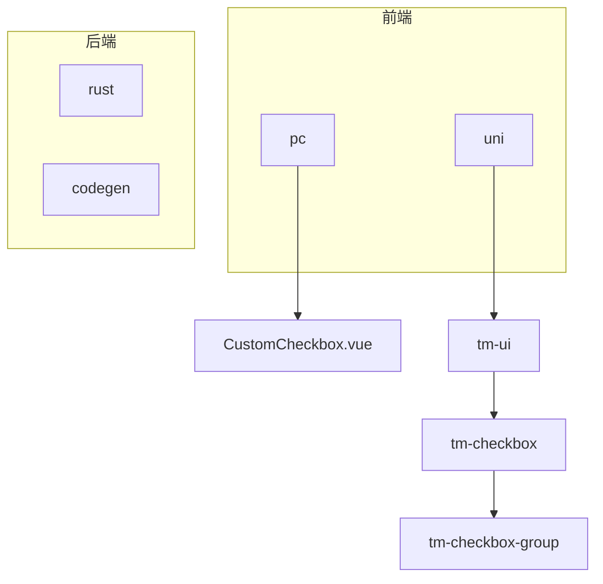
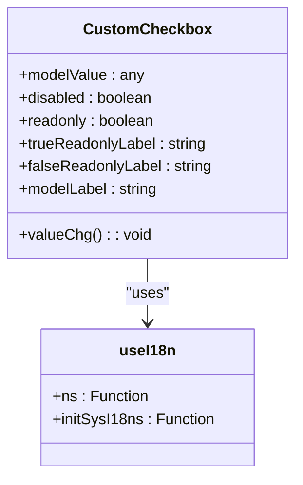
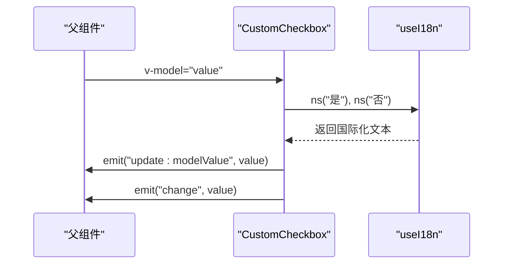
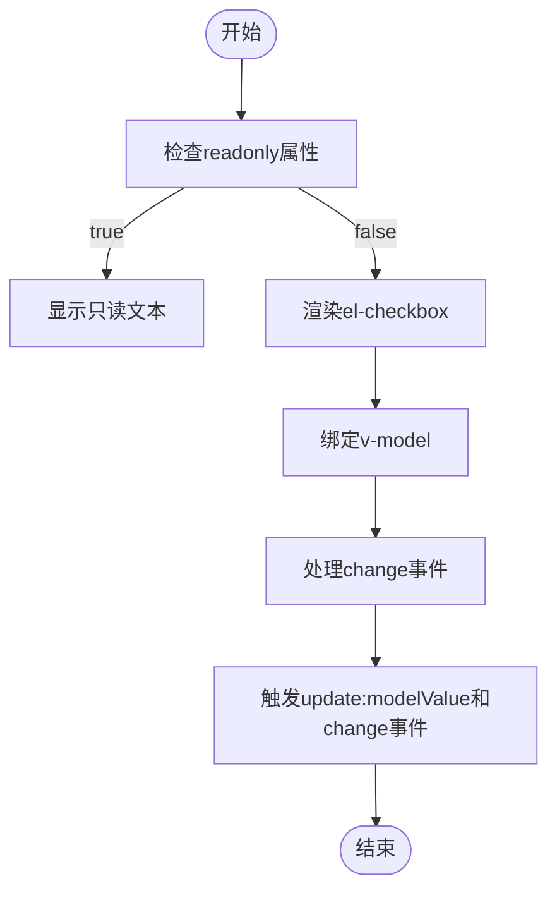
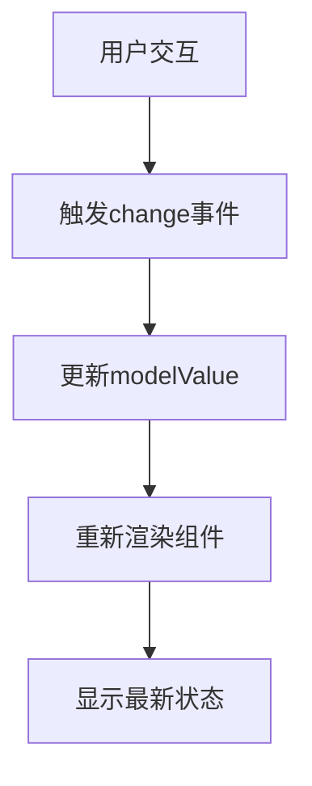
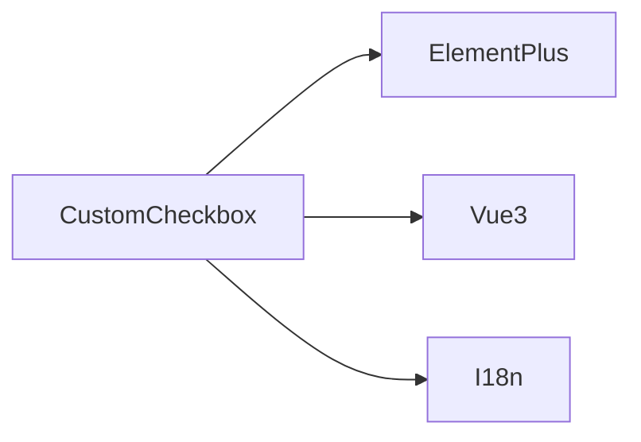

# CustomCheckbox 组件


**本文档引用的文件**   
- [CustomCheckbox.vue](https://github.com/sail-sail/nest/blob/main/pc/src/components/CustomCheckbox.vue)
- [common.scss](https://github.com/sail-sail/nest/blob/main/pc/src/assets/style/common.scss)


## 目录
1. [简介](#简介)
2. [项目结构](#项目结构)
3. [核心组件](#核心组件)
4. [架构概述](#架构概述)
5. [详细组件分析](#详细组件分析)
6. [依赖分析](#依赖分析)
7. [性能考虑](#性能考虑)
8. [故障排除指南](#故障排除指南)
9. [结论](#结论)
10. [附录](#附录)（如有必要）

## 简介
CustomCheckbox 组件是一个基于 Element Plus 的 el-checkbox 组件封装的自定义复选框组件，旨在提供更灵活的配置选项和更好的可读性支持。该组件不仅支持基本的复选框功能，还增加了只读模式下的文本显示能力，使得在不同场景下都能保持良好的用户体验。

## 项目结构
该项目结构清晰地划分了前端、后端及工具代码，其中 CustomCheckbox 组件位于 `pc/src/components` 目录下，是前端部分的一个重要组成部分。此组件通过引入 Element Plus 的 el-checkbox 并对其进行扩展，实现了项目特定的需求。



**图表来源**
- [CustomCheckbox.vue](https://github.com/sail-sail/nest/blob/main/pc/src/components/CustomCheckbox.vue#L1-L101)
- [tm-checkbox.vue](https://github.com/sail-sail/nest/blob/main/uni/src/uni_modules/tm-ui/components/tm-checkbox/tm-checkbox.vue#L46-L120)
- [tm-checkbox-group.vue](https://github.com/sail-sail/nest/blob/main/uni/src/uni_modules/tm-ui/components/tm-checkbox-group/tm-checkbox-group.vue#L22-L68)

**章节来源**
- [CustomCheckbox.vue](https://github.com/sail-sail/nest/blob/main/pc/src/components/CustomCheckbox.vue#L1-L101)

## 核心组件

CustomCheckbox 组件主要由模板和脚本两部分组成，模板部分定义了组件的UI结构，而脚本部分则负责处理数据绑定、事件响应等逻辑。组件支持 v-model 双向绑定、标签文本、禁用状态以及复选框组集成等多种配置项。

**章节来源**
- [CustomCheckbox.vue](https://github.com/sail-sail/nest/blob/main/pc/src/components/CustomCheckbox.vue#L1-L101)

## 架构概述

CustomCheckbox 组件的设计遵循了 Vue 3 的 Composition API 模式，利用 `<script setup>` 语法糖简化了组件的编写。组件通过 `useI18n` 钩子函数实现了国际化支持，确保了组件在不同语言环境下的正确显示。此外，组件还通过 `defineEmits` 定义了对外暴露的事件，允许父组件监听值的变化。



**图表来源**
- [CustomCheckbox.vue](https://github.com/sail-sail/nest/blob/main/pc/src/components/CustomCheckbox.vue#L1-L101)

## 详细组件分析

### CustomCheckbox 分析
CustomCheckbox 组件通过 `v-model` 实现了与父组件的数据双向绑定，同时支持通过 `props` 传递额外的配置信息，如 `disabled` 和 `readonly` 状态。当组件处于只读模式时，会显示预设的文本而不是复选框，这通过 `v-if` 指令实现。组件还支持自定义插槽，允许开发者插入额外的内容。

#### 对于对象导向组件：


**图表来源**
- [CustomCheckbox.vue](https://github.com/sail-sail/nest/blob/main/pc/src/components/CustomCheckbox.vue#L1-L101)

#### 对于API/服务组件：


**图表来源**
- [CustomCheckbox.vue](https://github.com/sail-sail/nest/blob/main/pc/src/components/CustomCheckbox.vue#L1-L101)

#### 对于复杂逻辑组件：


**图表来源**
- [CustomCheckbox.vue](https://github.com/sail-sail/nest/blob/main/pc/src/components/CustomCheckbox.vue#L1-L101)

**章节来源**
- [CustomCheckbox.vue](https://github.com/sail-sail/nest/blob/main/pc/src/components/CustomCheckbox.vue#L1-L101)

### 概念概述
CustomCheckbox 组件的设计理念是提供一个既简单又强大的复选框解决方案，它不仅满足了基本的功能需求，还考虑到了国际化、可访问性和性能优化等方面。通过合理的属性设计和事件机制，CustomCheckbox 能够适应各种复杂的表单场景。



## 依赖分析

CustomCheckbox 组件依赖于 Element Plus 的 el-checkbox 组件，同时也利用了 Vue 3 的 Composition API 特性。此外，组件还依赖于项目的国际化配置，以支持多语言环境。



**图表来源**
- [CustomCheckbox.vue](https://github.com/sail-sail/nest/blob/main/pc/src/components/CustomCheckbox.vue#L1-L101)

**章节来源**
- [CustomCheckbox.vue](https://github.com/sail-sail/nest/blob/main/pc/src/components/CustomCheckbox.vue#L1-L101)

## 性能考虑

在大量复选框渲染时，CustomCheckbox 组件通过使用 `v-if` 和 `v-show` 指令来优化渲染性能。此外，组件还通过 `watch` 监听 `props.modelValue` 的变化，确保只有在必要时才进行重新渲染，从而减少不必要的计算开销。

## 故障排除指南

如果遇到 CustomCheckbox 组件无法正常工作的情况，首先检查 `v-model` 是否正确绑定，以及 `props` 是否按预期传递。另外，确认 `useI18n` 钩子是否正确初始化，以确保国际化文本能够正确显示。

**章节来源**
- [CustomCheckbox.vue](https://github.com/sail-sail/nest/blob/main/pc/src/components/CustomCheckbox.vue#L1-L101)

## 结论

CustomCheckbox 组件是一个功能丰富且易于使用的复选框组件，它不仅继承了 Element Plus 的优秀特性，还通过自定义逻辑增强了其适用性。无论是独立使用还是作为复选框组的一部分，CustomCheckbox 都能提供一致且高质量的用户体验。

## 附录

### 使用示例
```vue
<template>
  <CustomCheckbox v-model="checked" :disabled="isDisabled" />
</template>

<script>
import CustomCheckbox from '@/components/CustomCheckbox.vue';

export default {
  components: {
    CustomCheckbox,
  },
  data() {
    return {
      checked: false,
      isDisabled: false,
    };
  },
};
</script>
```

### API 定义
| 属性 | 类型 | 默认值 | 描述 |
| --- | --- | --- | --- |
| modelValue | any | undefined | 双向绑定的值 |
| disabled | boolean | undefined | 是否禁用 |
| readonly | boolean | undefined | 是否只读 |
| trueReadonlyLabel | string | undefined | 只读模式下选中状态的标签 |
| falseReadonlyLabel | string | undefined | 只读模式下未选中状态的标签 |

### 样式定制
通过修改 `common.scss` 文件中的相关样式，可以轻松定制 CustomCheckbox 的外观。例如，可以通过调整 `.custom_checkbox` 类的样式来改变复选框的颜色、大小等属性。

**章节来源**
- [CustomCheckbox.vue](https://github.com/sail-sail/nest/blob/main/pc/src/components/CustomCheckbox.vue#L1-L101)
- [common.scss](https://github.com/sail-sail/nest/blob/main/pc/src/assets/style/common.scss#L0-L585)