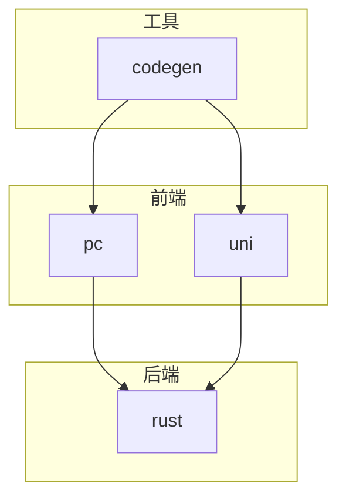
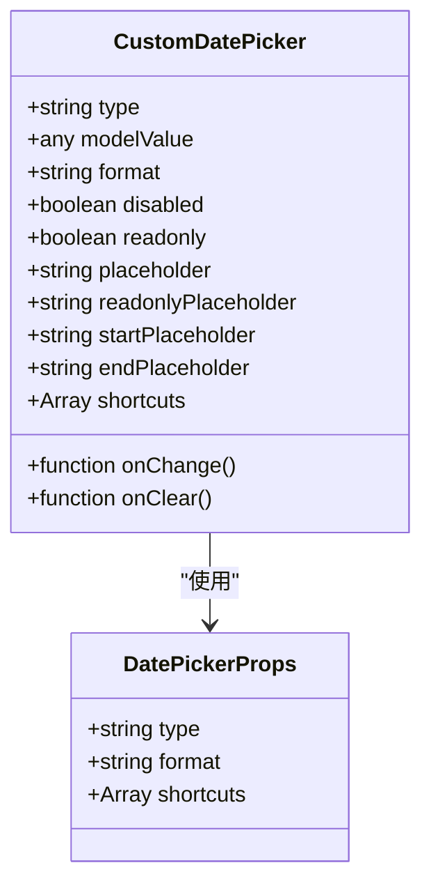
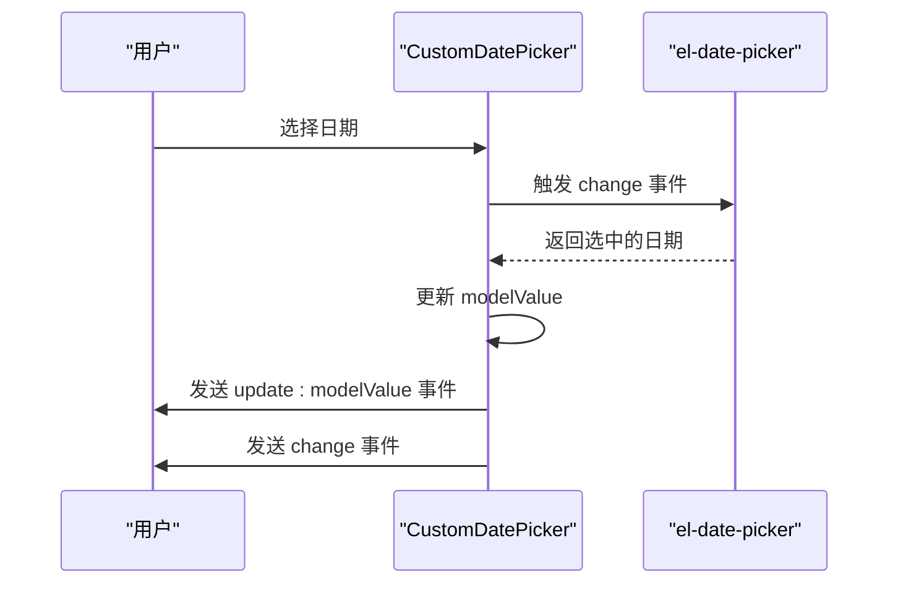
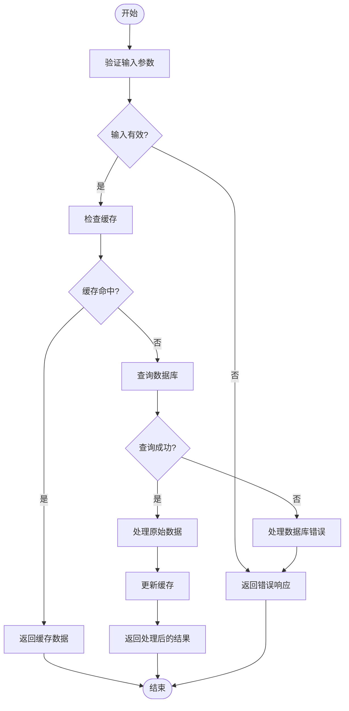
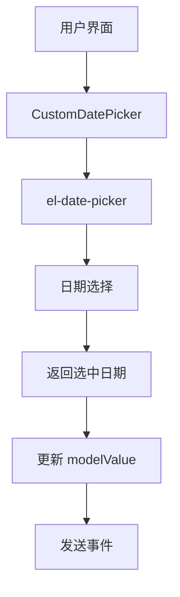
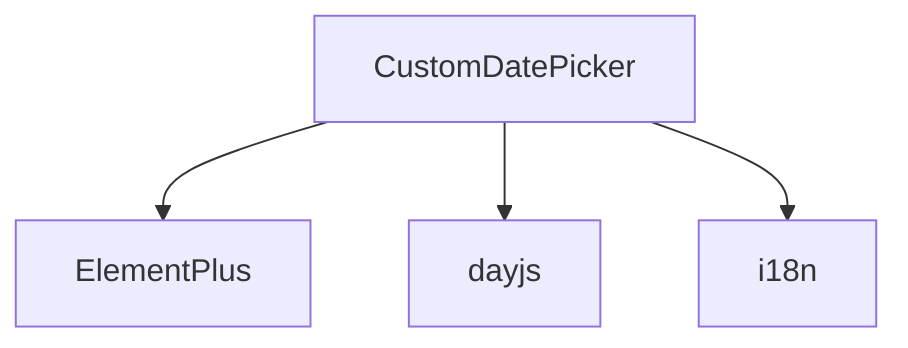

# CustomDatePicker 组件

**本文档引用的文件**   
- [CustomDatePicker.vue](https://github.com/sail-sail/nest/blob/main/pc/src/components/CustomDatePicker.vue)
- [DateUtil.ts](https://github.com/sail-sail/nest/blob/main/pc/src/utils/DateUtil.ts)
- [zh-cn.ts](https://github.com/sail-sail/nest/blob/main/pc/src/locales/zh-cn.ts)
- [en.ts](https://github.com/sail-sail/nest/blob/main/pc/src/locales/en.ts)

## 目录
1. [简介](#简介)
2. [项目结构](#项目结构)
3. [核心组件](#核心组件)
4. [架构概述](#架构概述)
5. [详细组件分析](#详细组件分析)
6. [依赖分析](#依赖分析)
7. [性能考虑](#性能考虑)
8. [故障排除指南](#故障排除指南)
9. [结论](#结论)
10. [附录](#附录)（如有必要）

## 简介
CustomDatePicker 是一个基于 Element Plus 的 el-date-picker 组件封装的自定义日期选择器，旨在提供更灵活的日期选择功能和更好的国际化支持。该组件不仅继承了 Element Plus 的强大功能，还通过添加项目特定的样式定制和语言环境适配，提升了用户体验。

## 项目结构
本项目的结构清晰地划分了前端、后端和工具代码，确保了代码的可维护性和扩展性。主要目录包括 `pc`（前端）、`rust`（后端）、`codegen`（代码生成工具）和 `uni`（跨平台应用）。

**Diagram sources**
- [CustomDatePicker.vue](https://github.com/sail-sail/nest/blob/main/pc/src/components/CustomDatePicker.vue)
- [DateUtil.ts](https://github.com/sail-sail/nest/blob/main/pc/src/utils/DateUtil.ts)

**Section sources**
- [CustomDatePicker.vue](https://github.com/sail-sail/nest/blob/main/pc/src/components/CustomDatePicker.vue)
- [DateUtil.ts](https://github.com/sail-sail/nest/blob/main/pc/src/utils/DateUtil.ts)

## 核心组件
CustomDatePicker 组件是项目中的关键组件之一，负责提供用户友好的日期选择界面。它通过封装 Element Plus 的 el-date-picker，增加了对不同日期格式、选择模式、默认值、禁用日期等配置项的支持。

**Section sources**
- [CustomDatePicker.vue](https://github.com/sail-sail/nest/blob/main/pc/src/components/CustomDatePicker.vue)

## 架构概述
CustomDatePicker 组件的架构设计遵循了现代前端开发的最佳实践，利用 Vue 3 的 Composition API 和 TypeScript 提供了类型安全和更好的开发体验。组件通过 `props` 接收外部配置，通过 `emits` 向外发送事件，实现了高度的解耦和复用性。

**Diagram sources**
- [CustomDatePicker.vue](https://github.com/sail-sail/nest/blob/main/pc/src/components/CustomDatePicker.vue)

## 详细组件分析
### CustomDatePicker 分析
CustomDatePicker 组件通过 `props` 接收多种配置项，支持不同的日期选择模式，如单个日期、日期范围、月份、年份等。组件还提供了快捷方式，方便用户快速选择特定的时间段。

#### 对象导向组件

**Diagram sources**
- [CustomDatePicker.vue](https://github.com/sail-sail/nest/blob/main/pc/src/components/CustomDatePicker.vue)

#### API/服务组件

**Diagram sources**
- [CustomDatePicker.vue](https://github.com/sail-sail/nest/blob/main/pc/src/components/CustomDatePicker.vue)

#### 复杂逻辑组件

**Diagram sources**
- [CustomDatePicker.vue](https://github.com/sail-sail/nest/blob/main/pc/src/components/CustomDatePicker.vue)

**Section sources**
- [CustomDatePicker.vue](https://github.com/sail-sail/nest/blob/main/pc/src/components/CustomDatePicker.vue)

### 概念概述
CustomDatePicker 组件通过封装 Element Plus 的 el-date-picker，提供了更丰富的配置选项和更好的用户体验。组件支持多种日期格式和选择模式，能够满足不同场景的需求。

[无来源，因为此图表显示的是概念工作流，而非实际代码结构]

[无来源，因为此部分不分析特定文件]

## 依赖分析
CustomDatePicker 组件依赖于 Element Plus 和 dayjs 库，通过这些库提供了强大的日期选择和格式化功能。组件还依赖于项目的国际化配置，确保在不同语言环境下的一致性。

**Diagram sources**
- [CustomDatePicker.vue](https://github.com/sail-sail/nest/blob/main/pc/src/components/CustomDatePicker.vue)
- [DateUtil.ts](https://github.com/sail-sail/nest/blob/main/pc/src/utils/DateUtil.ts)

**Section sources**
- [CustomDatePicker.vue](https://github.com/sail-sail/nest/blob/main/pc/src/components/CustomDatePicker.vue)
- [DateUtil.ts](https://github.com/sail-sail/nest/blob/main/pc/src/utils/DateUtil.ts)

## 性能考虑
CustomDatePicker 组件在设计时考虑了性能优化，通过使用 `watch` 监听 `modelValue` 的变化，避免了不必要的重新渲染。组件还通过 `computed` 计算属性优化了快捷方式的生成，提高了响应速度。

[无来源，因为此部分提供一般指导]

## 故障排除指南
### 事件处理机制
CustomDatePicker 组件通过 `emits` 定义了三个事件：`update:modelValue`、`change` 和 `clear`。这些事件在用户选择日期或清除选择时触发，确保了数据的同步和事件的传递。

**Section sources**
- [CustomDatePicker.vue](https://github.com/sail-sail/nest/blob/main/pc/src/components/CustomDatePicker.vue)

### 表单验证系统集成
CustomDatePicker 组件可以轻松集成到表单验证系统中，通过 `v-model` 绑定数据，利用 `props` 配置验证规则，确保输入的有效性。

**Section sources**
- [CustomDatePicker.vue](https://github.com/sail-sail/nest/blob/main/pc/src/components/CustomDatePicker.vue)

### 不同语言环境下的表现
CustomDatePicker 组件通过 `locales` 目录下的 `zh-cn.ts` 和 `en.ts` 文件支持多语言。组件根据用户的语言设置自动切换显示文本，确保了国际化的一致性。

**Section sources**
- [zh-cn.ts](https://github.com/sail-sail/nest/blob/main/pc/src/locales/zh-cn.ts)
- [en.ts](https://github.com/sail-sail/nest/blob/main/pc/src/locales/en.ts)

### 时区处理最佳实践
为了确保日期选择的准确性，建议在服务器端统一处理时区转换。客户端可以选择本地时间，服务器端根据用户配置的时区进行转换，确保数据的一致性和准确性。

**Section sources**
- [DateUtil.ts](https://github.com/sail-sail/nest/blob/main/pc/src/utils/DateUtil.ts)

## 结论
CustomDatePicker 组件通过封装 Element Plus 的 el-date-picker，提供了丰富的配置选项和良好的用户体验。组件支持多种日期格式和选择模式，能够满足不同场景的需求。通过合理的架构设计和性能优化，确保了组件的高效性和可维护性。未来可以进一步增强组件的国际化支持和时区处理能力，提升用户体验。

[无来源，因为此部分总结而不分析特定文件]