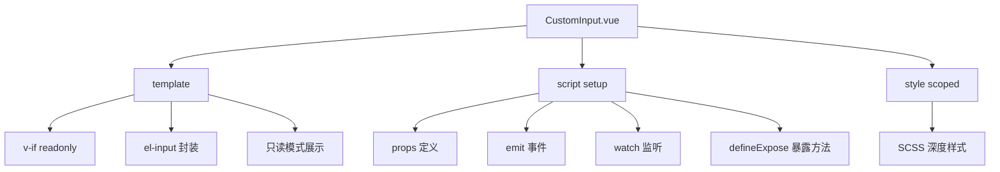
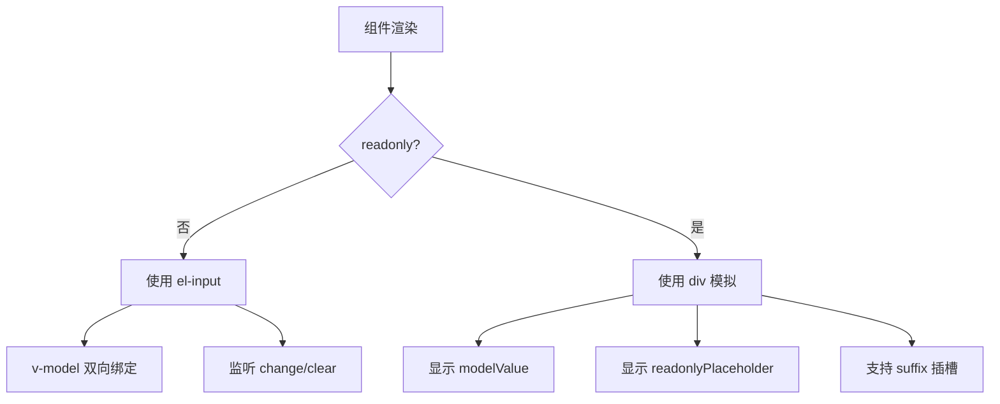
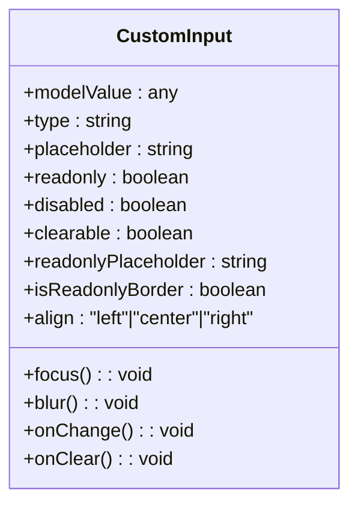
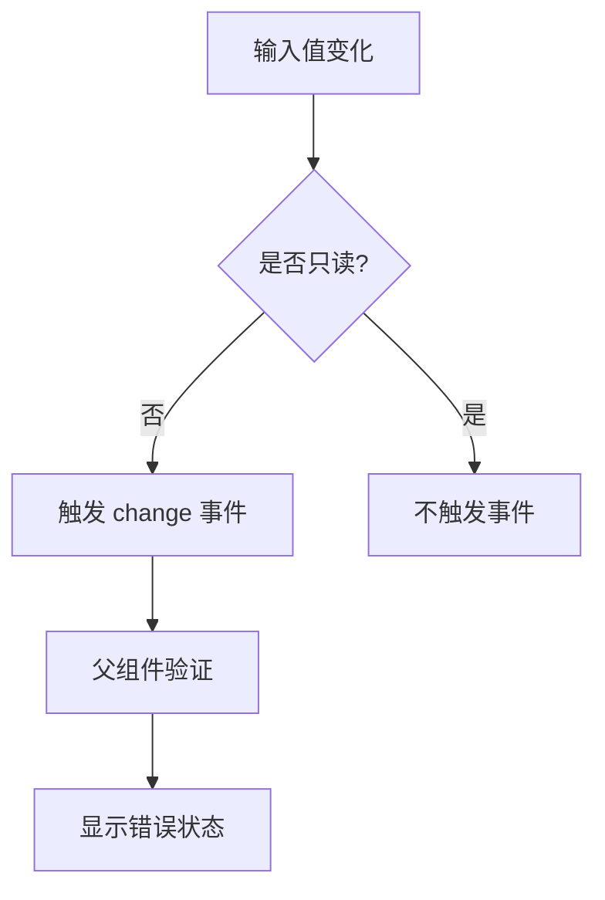
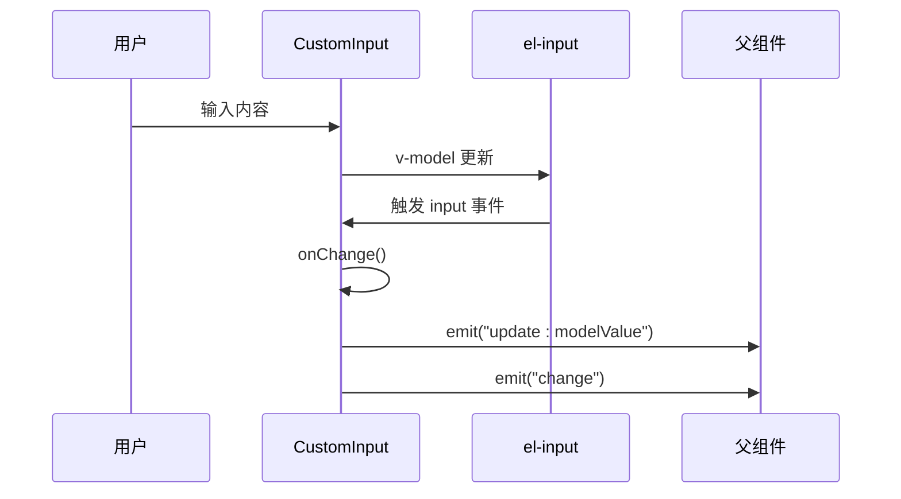
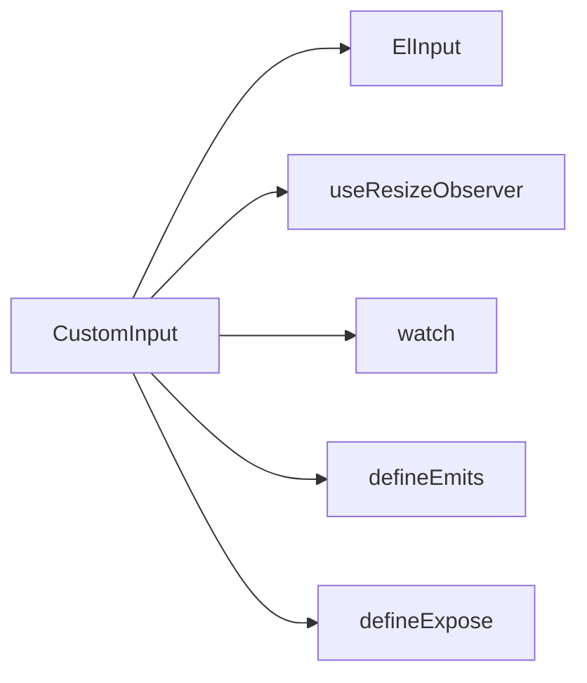

# CustomInput 组件

**本文档引用文件**  
- [CustomInput.vue](https://github.com/sail-sail/nest/blob/main/pc/src/components/CustomInput.vue)

## 目录
1. [简介](#简介)
2. [项目结构](#项目结构)
3. [核心组件](#核心组件)
4. [架构概述](#架构概述)
5. [详细组件分析](#详细组件分析)
6. [依赖分析](#依赖分析)
7. [性能考虑](#性能考虑)
8. [故障排除指南](#故障排除指南)
9. [结论](#结论)
10. [附录](#附录)（如有必要）

## 简介
CustomInput 组件是项目中的基础输入组件，封装了 Element Plus 的 `el-input` 组件，并添加了项目特定的样式与行为。该组件支持多种输入类型、对齐方式、只读状态和禁用状态，适用于文本、密码、数字等多种输入场景。组件通过 `v-model` 实现双向数据绑定，支持 `placeholder` 提示、清除功能、事件触发等特性，并具备良好的可访问性和扩展性。

## 项目结构
CustomInput 组件位于 `pc/src/components/` 目录下，是项目 UI 组件库的一部分。该组件采用 Vue 3 的 `<script setup>` 语法编写，结合 Tailwind CSS 的原子类进行样式布局，同时使用 SCSS 编写深度样式以覆盖 Element Plus 默认样式。

**图示来源**  
- [CustomInput.vue](https://github.com/sail-sail/nest/blob/main/pc/src/components/CustomInput.vue#L0-L252)

**本节来源**  
- [CustomInput.vue](https://github.com/sail-sail/nest/blob/main/pc/src/components/CustomInput.vue#L0-L252)

## 核心组件
CustomInput 组件的核心功能包括：
- 支持 `v-model` 双向绑定
- 支持 `text`、`password`、`textarea` 等多种输入类型
- 支持 `placeholder` 和 `readonlyPlaceholder` 提示文本
- 支持禁用（`disabled`）和只读（`readonly`）状态
- 支持左、中、右对齐（`align`）
- 支持清除按钮（`clearable`）
- 支持插槽扩展（`myAppend`、`suffix` 等）

组件通过 `$attrs` 透传所有未声明的属性到 `el-input`，增强了灵活性。

**本节来源**  
- [CustomInput.vue](https://github.com/sail-sail/nest/blob/main/pc/src/components/CustomInput.vue#L104-L161)

## 架构概述
CustomInput 组件采用条件渲染方式，根据 `readonly` 属性决定是否使用 `el-input` 或自定义只读展示区域。在可编辑模式下，组件封装 `el-input` 并处理 `v-model` 同步；在只读模式下，组件通过 `div` 模拟输入框外观，确保视觉一致性。

**图示来源**  
- [CustomInput.vue](https://github.com/sail-sail/nest/blob/main/pc/src/components/CustomInput.vue#L0-L252)

## 详细组件分析

### 组件功能分析
CustomInput 组件通过 `props` 接收配置项，包括 `modelValue`、`type`、`placeholder`、`disabled`、`readonly`、`clearable`、`align` 等。组件内部使用 `ref` 和 `watch` 实现 `v-model` 的双向同步。

#### Props 属性说明
| 属性名 | 类型 | 默认值 | 说明 |
|--------|------|--------|------|
| modelValue | any | undefined | 绑定值 |
| type | string | "text" | 输入框类型 |
| placeholder | string | undefined | 输入提示 |
| readonly | boolean | undefined | 是否只读 |
| disabled | boolean | undefined | 是否禁用 |
| clearable | boolean | true | 是否可清除 |
| readonlyPlaceholder | string | undefined | 只读状态下的占位符 |
| isReadonlyBorder | boolean | true | 只读时是否显示边框 |
| align | "left" \| "center" \| "right" | undefined | 文本对齐方式 |

#### 事件说明
- `update:modelValue`: 当绑定值变化时触发
- `change`: 当值改变时触发
- `clear`: 当点击清除按钮时触发

#### 暴露方法
- `focus()`: 使输入框获得焦点
- `blur()`: 使输入框失去焦点

#### 插槽支持
- `myAppend`: 自定义追加内容
- `suffix`: 后置插槽（只读模式下也支持）

**图示来源**  
- [CustomInput.vue](https://github.com/sail-sail/nest/blob/main/pc/src/components/CustomInput.vue#L104-L161)

**本节来源**  
- [CustomInput.vue](https://github.com/sail-sail/nest/blob/main/pc/src/components/CustomInput.vue#L0-L252)

### 验证机制与错误状态
组件本身不包含验证逻辑，但通过 `v-model` 与父组件通信，可由父组件结合 `el-form` 实现表单验证。在只读模式下，组件通过 `shouldShowPlaceholder` 计算属性判断是否显示占位符。

**图示来源**  
- [CustomInput.vue](https://github.com/sail-sail/nest/blob/main/pc/src/components/CustomInput.vue#L188-L204)

### 事件处理流程

**图示来源**  
- [CustomInput.vue](https://github.com/sail-sail/nest/blob/main/pc/src/components/CustomInput.vue#L194-L204)

**本节来源**  
- [CustomInput.vue](https://github.com/sail-sail/nest/blob/main/pc/src/components/CustomInput.vue#L194-L204)

## 依赖分析
CustomInput 组件依赖 Element Plus 的 `el-input` 组件，并使用 `useResizeObserver` 监听 `textarea` 高度变化。组件通过 `$attrs` 透传属性，与外部组件保持松耦合。

**图示来源**  
- [CustomInput.vue](https://github.com/sail-sail/nest/blob/main/pc/src/components/CustomInput.vue#L163-L187)

**本节来源**  
- [CustomInput.vue](https://github.com/sail-sail/nest/blob/main/pc/src/components/CustomInput.vue#L163-L187)

## 性能考虑
- 使用 `shallowRef` 存储 `textareaHeight`，避免不必要的响应式开销
- 使用 `computed` 计算 `shouldShowPlaceholder`，提升渲染效率
- 通过 `v-if` 条件渲染，避免同时渲染可编辑和只读模式
- 使用 `useResizeObserver` 优化 `textarea` 高度监听性能

## 故障排除指南
- **问题：v-model 不生效**  
  检查是否正确传递 `modelValue` 和监听 `update:modelValue` 事件。

- **问题：只读模式下 placeholder 不显示**  
  确保设置了 `readonlyPlaceholder` 属性。

- **问题：对齐样式失效**  
  检查 `align` 属性值是否为 `left`、`center` 或 `right`。

- **问题：清除按钮在禁用状态下仍显示**  
  组件已处理此情况，`disabled` 时 `clearable` 强制为 `false`。

**本节来源**  
- [CustomInput.vue](https://github.com/sail-sail/nest/blob/main/pc/src/components/CustomInput.vue#L72-L75)

## 结论
CustomInput 组件是一个功能完整、易于复用的基础输入组件。它封装了 Element Plus 的 `el-input`，提供了项目统一的样式和行为，并支持多种配置选项和扩展方式。组件设计合理，性能良好，适用于项目中各种输入场景。

## 附录
- **无障碍访问建议**：为输入框添加 `aria-label` 或 `label` 元素，确保屏幕阅读器可读。
- **性能优化建议**：避免在 `v-model` 中绑定复杂对象，使用 `.trim` 修饰符去除空格。
- **扩展建议**：可通过插槽添加图标、按钮等交互元素，增强用户体验。