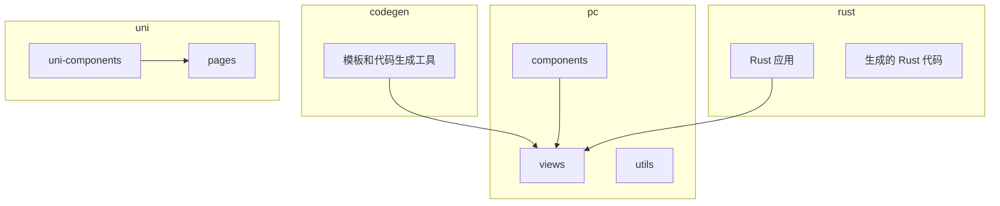
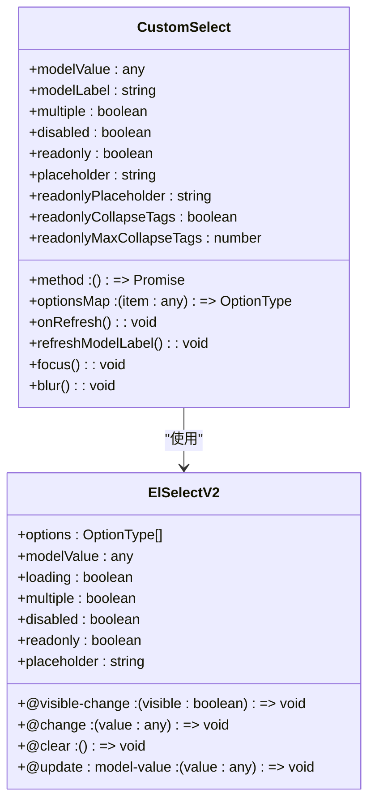
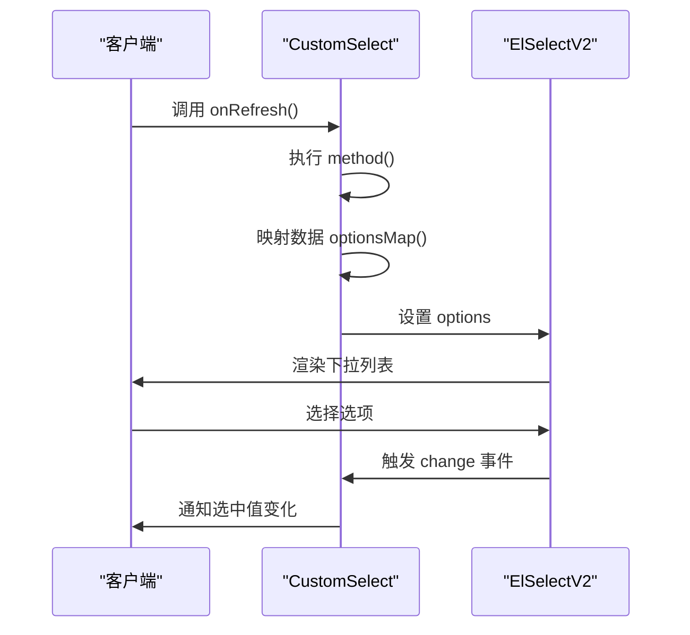
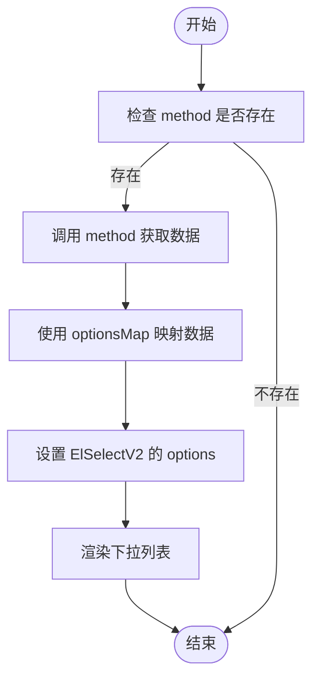
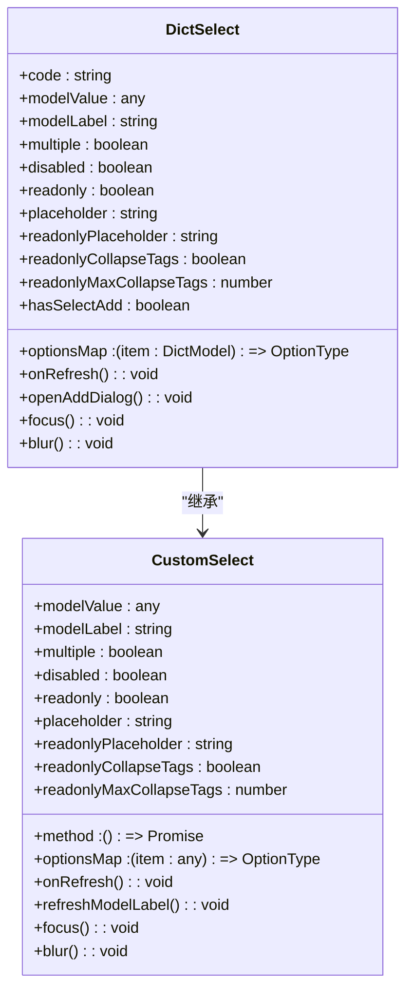
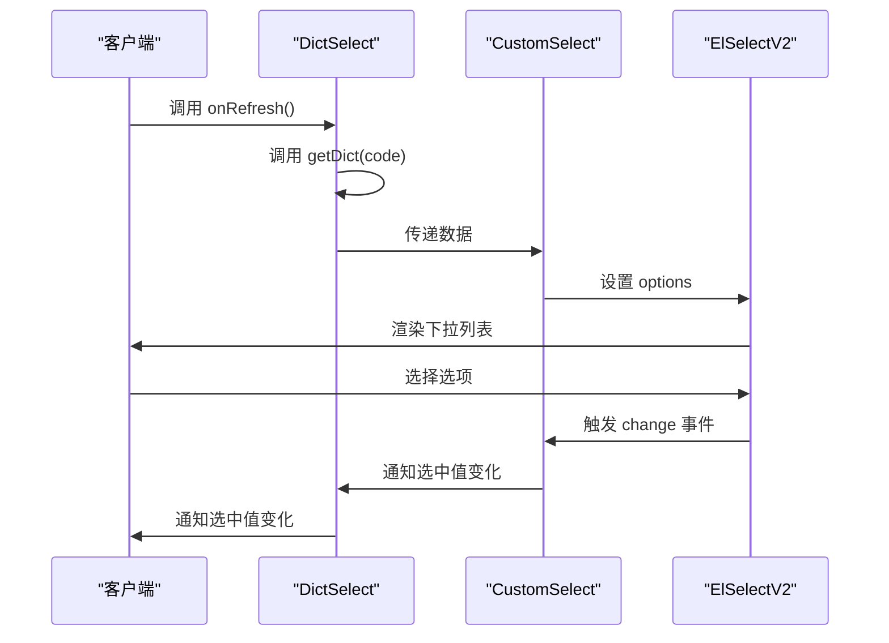
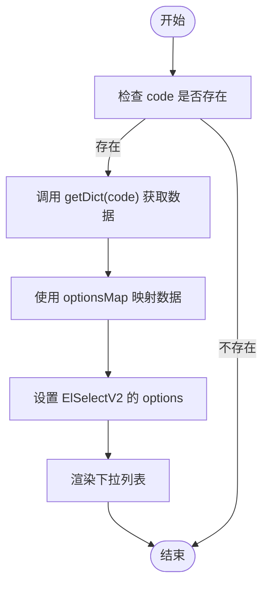

# CustomSelect 组件


**本文档引用的文件**   
- [CustomSelect.vue](https://github.com/sail-sail/nest/blob/main/pc/src/components/CustomSelect.vue)
- [DictSelect.vue](https://github.com/sail-sail/nest/blob/main/pc/src/components/DictSelect.vue)
- [common.ts](https://github.com/sail-sail/nest/blob/main/pc/src/utils/common.ts)
- [i18n.ts](https://github.com/sail-sail/nest/blob/main/pc/src/locales/i18n.ts)


## 目录
1. [简介](#简介)
2. [项目结构](#项目结构)
3. [核心组件](#核心组件)
4. [架构概述](#架构概述)
5. [详细组件分析](#详细组件分析)
6. [依赖分析](#依赖分析)
7. [性能考虑](#性能考虑)
8. [故障排除指南](#故障排除指南)
9. [结论](#结论)

## 简介
CustomSelect 组件是项目中用于下拉选择的核心组件，封装了 Element Plus 的 el-select 组件，并集成了项目特定的数据处理逻辑。该组件支持多种配置选项，包括数据源、选中值绑定、多选模式、禁用状态和远程搜索等。此外，它还提供了与 DictSelect 组件的集成，支持字典数据的加载和管理。

## 项目结构
项目结构清晰，主要分为 codegen、pc、rust 和 uni 四个部分。CustomSelect 组件位于 pc/src/components 目录下，与其他 UI 组件一起组织。



**图示来源**
- [CustomSelect.vue](https://github.com/sail-sail/nest/blob/main/pc/src/components/CustomSelect.vue)
- [DictSelect.vue](https://github.com/sail-sail/nest/blob/main/pc/src/components/DictSelect.vue)

**章节来源**
- [CustomSelect.vue](https://github.com/sail-sail/nest/blob/main/pc/src/components/CustomSelect.vue)
- [DictSelect.vue](https://github.com/sail-sail/nest/blob/main/pc/src/components/DictSelect.vue)

## 核心组件
CustomSelect 组件通过封装 Element Plus 的 el-select 组件，提供了丰富的功能和灵活的配置选项。它支持本地数据和远程数据加载，能够处理大数据量下的虚拟滚动，确保性能优化。

**章节来源**
- [CustomSelect.vue](https://github.com/sail-sail/nest/blob/main/pc/src/components/CustomSelect.vue)

## 架构概述
CustomSelect 组件的架构设计遵循模块化原则，将数据获取、数据映射和 UI 渲染分离。组件通过 `method` 属性接收数据获取方法，通过 `optionsMap` 属性定义数据映射规则，最终将数据渲染到 el-select 组件中。



**图示来源**
- [CustomSelect.vue](https://github.com/sail-sail/nest/blob/main/pc/src/components/CustomSelect.vue)

## 详细组件分析

### CustomSelect 分析
CustomSelect 组件通过 `method` 属性接收数据获取方法，支持异步数据加载。`optionsMap` 属性用于定义数据映射规则，将原始数据转换为 el-select 组件所需的格式。组件还支持多选模式、禁用状态和只读模式，提供了丰富的配置选项。

#### 对象导向组件


**图示来源**
- [CustomSelect.vue](https://github.com/sail-sail/nest/blob/main/pc/src/components/CustomSelect.vue)

#### API/服务组件


**图示来源**
- [CustomSelect.vue](https://github.com/sail-sail/nest/blob/main/pc/src/components/CustomSelect.vue)

#### 复杂逻辑组件


**图示来源**
- [CustomSelect.vue](https://github.com/sail-sail/nest/blob/main/pc/src/components/CustomSelect.vue)

**章节来源**
- [CustomSelect.vue](https://github.com/sail-sail/nest/blob/main/pc/src/components/CustomSelect.vue)

### DictSelect 分析
DictSelect 组件是 CustomSelect 的一个特化版本，专门用于处理字典数据。它通过 `code` 属性指定字典代码，自动加载对应的字典数据。组件还支持新增选项的功能，允许用户在运行时添加新的字典项。

#### 对象导向组件


**图示来源**
- [DictSelect.vue](https://github.com/sail-sail/nest/blob/main/pc/src/components/DictSelect.vue)

#### API/服务组件


**图示来源**
- [DictSelect.vue](https://github.com/sail-sail/nest/blob/main/pc/src/components/DictSelect.vue)

#### 复杂逻辑组件


**图示来源**
- [DictSelect.vue](https://github.com/sail-sail/nest/blob/main/pc/src/components/DictSelect.vue)

**章节来源**
- [DictSelect.vue](https://github.com/sail-sail/nest/blob/main/pc/src/components/DictSelect.vue)

## 依赖分析
CustomSelect 组件依赖于 Element Plus 的 el-select 组件，以及项目中的 utils 和 locales 模块。DictSelect 组件进一步依赖于 views/base/dict 和 views/base/dict_detail 模块，用于加载和管理字典数据。

```mermaid
graph TB
subgraph "CustomSelect"
CustomSelect --> ElSelectV2
CustomSelect --> common_ts
CustomSelect --> i18n_ts
end
subgraph "DictSelect"
DictSelect --> CustomSelect
DictSelect --> getDict
DictSelect --> findOneDict
DictSelect --> findAllDictDetail
end
common_ts --> getDict
i18n_ts --> ns
i18n_ts --> nsAsync
i18n_ts --> initSysI18ns
```

**图示来源**
- [CustomSelect.vue](https://github.com/sail-sail/nest/blob/main/pc/src/components/CustomSelect.vue)
- [DictSelect.vue](https://github.com/sail-sail/nest/blob/main/pc/src/components/DictSelect.vue)
- [common.ts](https://github.com/sail-sail/nest/blob/main/pc/src/utils/common.ts)
- [i18n.ts](https://github.com/sail-sail/nest/blob/main/pc/src/locales/i18n.ts)

**章节来源**
- [CustomSelect.vue](https://github.com/sail-sail/nest/blob/main/pc/src/components/CustomSelect.vue)
- [DictSelect.vue](https://github.com/sail-sail/nest/blob/main/pc/src/components/DictSelect.vue)
- [common.ts](https://github.com/sail-sail/nest/blob/main/pc/src/utils/common.ts)
- [i18n.ts](https://github.com/sail-sail/nest/blob/main/pc/src/locales/i18n.ts)

## 性能考虑
CustomSelect 组件在处理大数据量时，通过虚拟滚动技术优化性能。组件支持 `height` 属性，可以设置下拉列表的高度，避免一次性渲染大量选项导致页面卡顿。此外，组件还支持 `autoWidth` 属性，自动调整下拉列表的宽度，提升用户体验。

**章节来源**
- [CustomSelect.vue](https://github.com/sail-sail/nest/blob/main/pc/src/components/CustomSelect.vue)

## 故障排除指南
- **问题：下拉列表无法显示数据**
  - **解决方案**：检查 `method` 属性是否正确配置，确保返回的数据格式符合预期。
- **问题：多选模式下全选功能失效**
  - **解决方案**：检查 `showSelectAll` 属性是否设置为 `true`，并确保 `options` 数组不为空。
- **问题：远程搜索无响应**
  - **解决方案**：检查 `method` 方法的实现，确保异步请求正确处理。

**章节来源**
- [CustomSelect.vue](https://github.com/sail-sail/nest/blob/main/pc/src/components/CustomSelect.vue)
- [DictSelect.vue](https://github.com/sail-sail/nest/blob/main/pc/src/components/DictSelect.vue)

## 结论
CustomSelect 组件是一个功能强大且灵活的下拉选择组件，适用于各种数据源和使用场景。通过封装 Element Plus 的 el-select 组件，它提供了丰富的配置选项和良好的性能优化，能够满足项目中的多样化需求。DictSelect 组件作为其特化版本，进一步增强了对字典数据的支持，提升了开发效率。