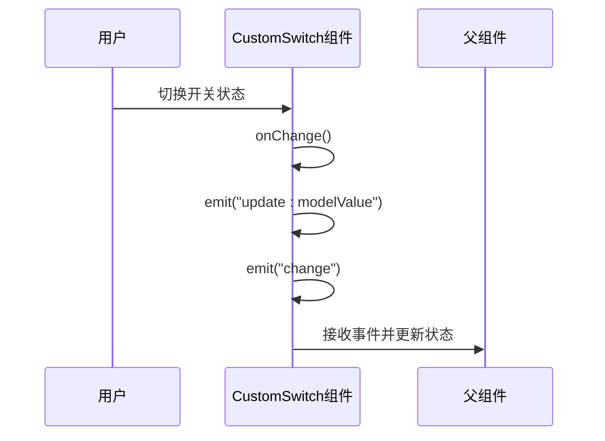
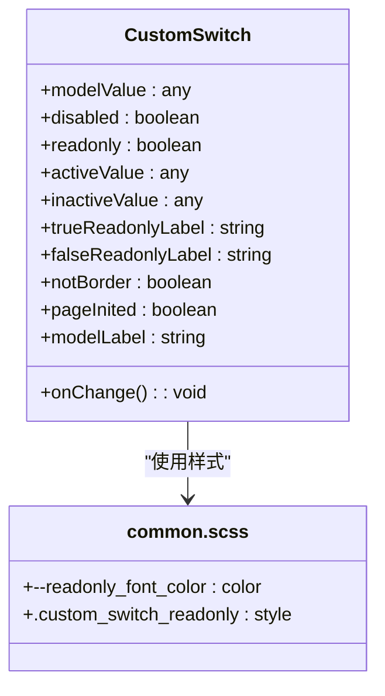

# CustomSwitch 组件


**Referenced Files in This Document**   
- [CustomSwitch.vue](https://github.com/sail-sail/nest/blob/main/pc/src/components/CustomSwitch.vue)
- [common.scss](https://github.com/sail-sail/nest/blob/main/pc/src/assets/style/common.scss)


## 目录
1. [简介](#简介)
2. [核心功能与实现](#核心功能与实现)
3. [Props 属性详解](#props-属性详解)
4. [事件处理机制](#事件处理机制)
5. [样式与设计语言集成](#样式与设计语言集成)
6. [只读模式实现](#只读模式实现)
7. [国际化支持](#国际化支持)
8. [使用示例](#使用示例)
9. [无障碍访问与键盘导航](#无障碍访问与键盘导航)

## 简介

CustomSwitch 组件是基于 Element Plus 的 `el-switch` 组件进行二次封装的开关选择器。该组件旨在提供一个功能丰富、易于使用且与项目整体设计语言保持一致的开关控件。它不仅继承了原生 `el-switch` 的所有功能，还扩展了只读模式、自定义标签、国际化支持等特性，使其能够灵活地应用于各种表单和列表场景。

**Section sources**
- [CustomSwitch.vue](https://github.com/sail-sail/nest/blob/main/pc/src/components/CustomSwitch.vue#L1-L125)

## 核心功能与实现

CustomSwitch 组件的核心功能是作为一个二元状态选择器，允许用户在两种状态之间进行切换。组件通过 `v-model` 实现双向数据绑定，确保视图和模型之间的同步。在实现上，组件使用了 Vue 3 的 `<script setup>` 语法糖，使得代码更加简洁和直观。

组件的模板部分包含两个主要的 `<template>` 分支：一个用于可编辑模式，另一个用于只读模式。在可编辑模式下，组件渲染一个 `el-switch` 元素，并通过 `v-model` 绑定到 `modelValue` 变量。在只读模式下，组件渲染一个简单的 `<div>` 元素，显示当前状态的标签。

**Section sources**
- [CustomSwitch.vue](https://github.com/sail-sail/nest/blob/main/pc/src/components/CustomSwitch.vue#L1-L125)

## Props 属性详解

CustomSwitch 组件支持多个 props 属性，以满足不同的使用需求。以下是各属性的详细说明：

- **modelValue**: 绑定值，表示开关的当前状态。默认值为 `undefined`。
- **disabled**: 是否禁用开关。默认值为 `undefined`。
- **readonly**: 是否为只读模式。默认值为 `undefined`。
- **activeValue**: 激活状态的值。默认值为 `1`。
- **inactiveValue**: 非激活状态的值。默认值为 `0`。
- **trueReadonlyLabel**: 只读模式下，激活状态的标签。默认值为 `"是"`。
- **falseReadonlyLabel**: 只读模式下，非激活状态的标签。默认值为 `"否"`。
- **notBorder**: 是否无边框。默认值为 `undefined`。
- **pageInited**: 页面是否已初始化。默认值为 `undefined`。

这些属性通过 `withDefaults` 函数设置了默认值，确保组件在未指定某些属性时仍能正常工作。

**Section sources**
- [CustomSwitch.vue](https://github.com/sail-sail/nest/blob/main/pc/src/components/CustomSwitch.vue#L25-L50)

## 事件处理机制

CustomSwitch 组件通过 `emit` 发出两个事件：`update:modelValue` 和 `change`。当开关状态发生变化时，`onChange` 函数会被调用，进而触发这两个事件。`update:modelValue` 事件用于更新绑定值，而 `change` 事件则用于通知外部状态变化。



**Diagram sources**
- [CustomSwitch.vue](https://github.com/sail-sail/nest/blob/main/pc/src/components/CustomSwitch.vue#L75-L80)

## 样式与设计语言集成

CustomSwitch 组件通过 CSS 变量和 SCSS 样式表与项目整体设计语言保持一致。组件的样式定义在 `common.scss` 文件中，确保了在整个项目中的一致性。例如，只读模式下的字体颜色通过 `--readonly_font_color` 变量定义，并在深色主题下自动调整。



**Diagram sources**
- [CustomSwitch.vue](https://github.com/sail-sail/nest/blob/main/pc/src/components/CustomSwitch.vue#L1-L125)
- [common.scss](https://github.com/sail-sail/nest/blob/main/pc/src/assets/style/common.scss#L550-L560)

## 只读模式实现

在只读模式下，CustomSwitch 组件不会渲染 `el-switch`，而是渲染一个简单的 `<div>` 元素，显示当前状态的标签。标签内容通过 `modelLabel` 计算属性动态生成，根据 `modelValue` 的值选择相应的标签文本。如果 `trueReadonlyLabel` 或 `falseReadonlyLabel` 未指定，则使用默认的 `"是"` 和 `"否"`。

**Section sources**
- [CustomSwitch.vue](https://github.com/sail-sail/nest/blob/main/pc/src/components/CustomSwitch.vue#L10-L15)
- [CustomSwitch.vue](https://github.com/sail-sail/nest/blob/main/pc/src/components/CustomSwitch.vue#L100-L110)

## 国际化支持

CustomSwitch 组件通过 `useI18n` 函数实现了国际化支持。组件在初始化时调用 `initSysI18ns` 函数，加载所需的国际化代码。`modelLabel` 计算属性会优先使用 `trueReadonlyLabel` 和 `falseReadonlyLabel` 属性，如果未指定，则使用 `ns` 函数获取默认的国际化文本。

**Section sources**
- [CustomSwitch.vue](https://github.com/sail-sail/nest/blob/main/pc/src/components/CustomSwitch.vue#L20-L24)
- [CustomSwitch.vue](https://github.com/sail-sail/nest/blob/main/pc/src/components/CustomSwitch.vue#L100-L110)

## 使用示例

以下是在表单和列表中使用 CustomSwitch 组件的示例：

### 表单中的使用
```vue
<template>
  <el-form>
    <el-form-item label="启用功能">
      <CustomSwitch v-model="featureEnabled" />
    </el-form-item>
  </el-form>
</template>

<script setup>
import { ref } from 'vue';
import CustomSwitch from '@/components/CustomSwitch.vue';

const featureEnabled = ref(1);
</script>
```

### 列表中的使用
```vue
<template>
  <el-table :data="items">
    <el-table-column label="状态">
      <template #default="{ row }">
        <CustomSwitch v-model="row.status" readonly />
      </template>
    </el-table-column>
  </el-table>
</template>

<script setup>
import CustomSwitch from '@/components/CustomSwitch.vue';

const items = ref([
  { status: 1 },
  { status: 0 }
]);
</script>
```

**Section sources**
- [CustomSwitch.vue](https://github.com/sail-sail/nest/blob/main/pc/src/components/CustomSwitch.vue#L1-L125)

## 无障碍访问与键盘导航

CustomSwitch 组件继承了 `el-switch` 的无障碍访问特性，支持键盘导航。用户可以通过 Tab 键将焦点移动到开关上，然后使用空格键或 Enter 键切换状态。在只读模式下，组件虽然不可交互，但仍可通过屏幕阅读器正确读取当前状态。

**Section sources**
- [CustomSwitch.vue](https://github.com/sail-sail/nest/blob/main/pc/src/components/CustomSwitch.vue#L1-L125)